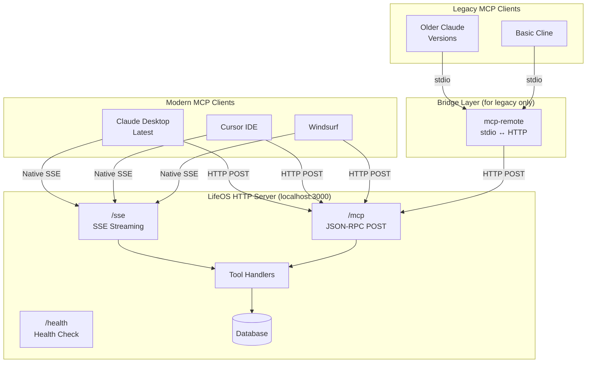
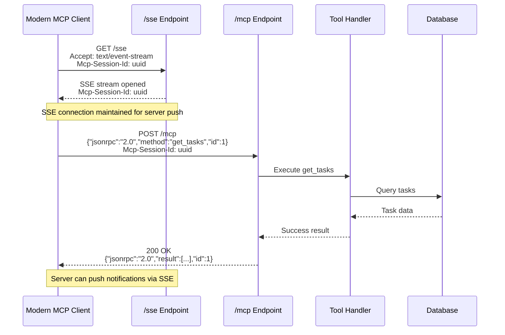
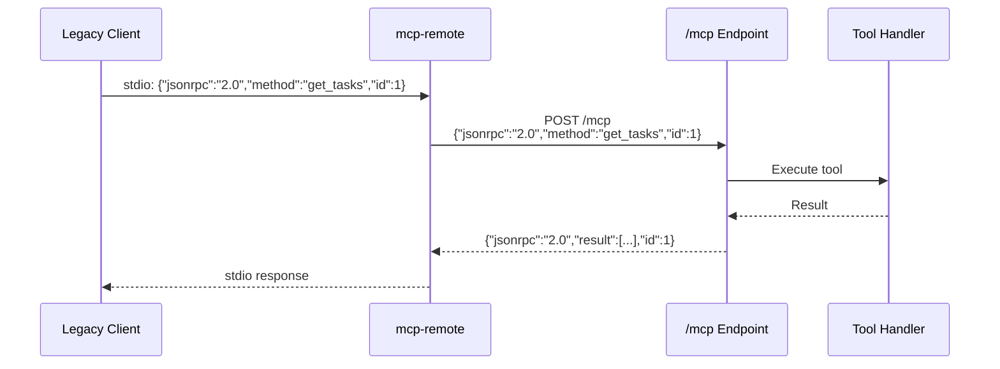
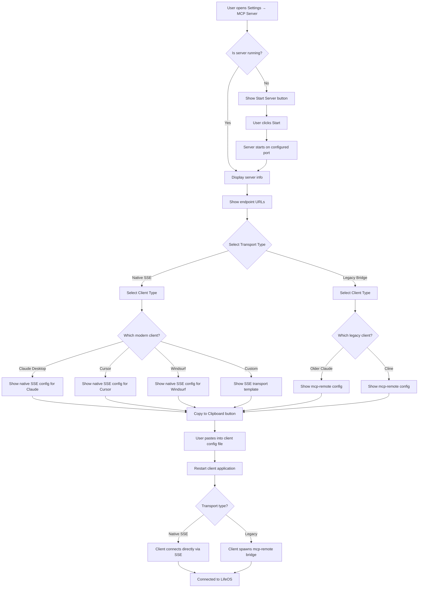
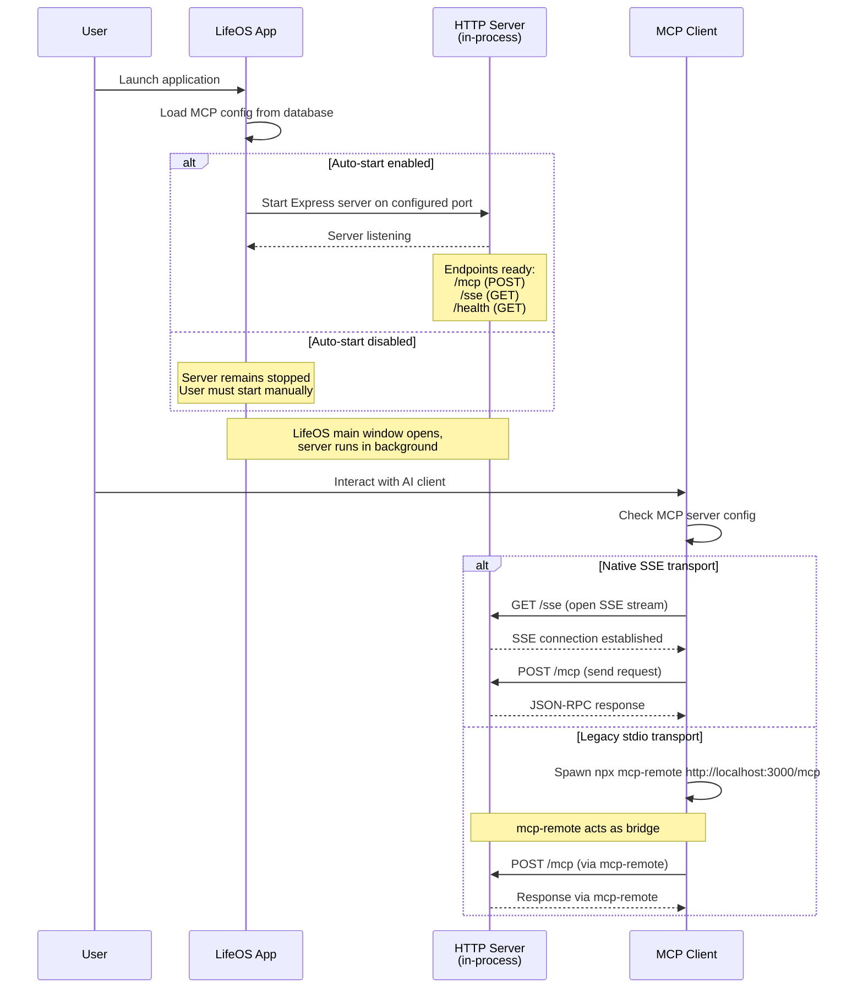
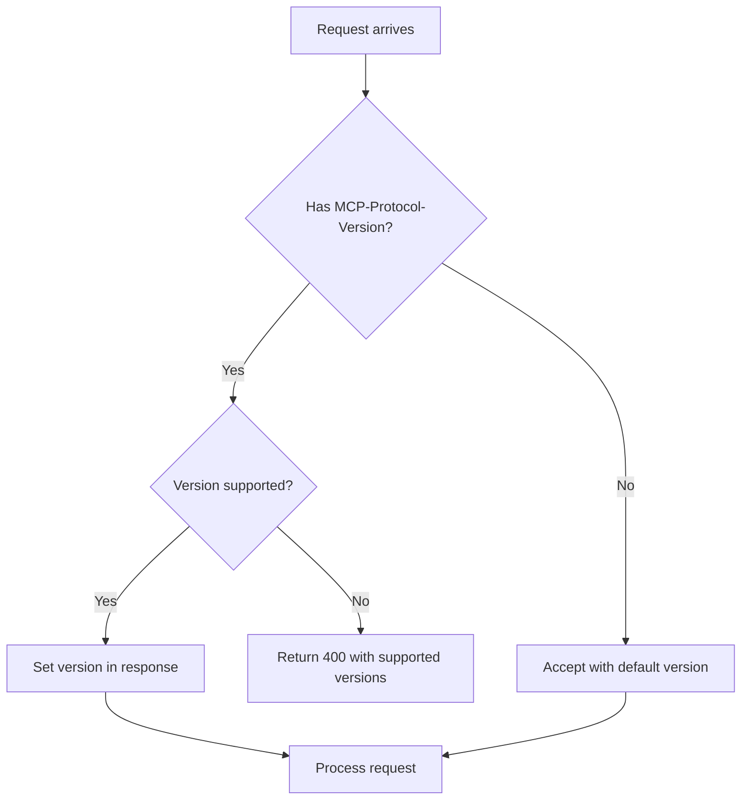
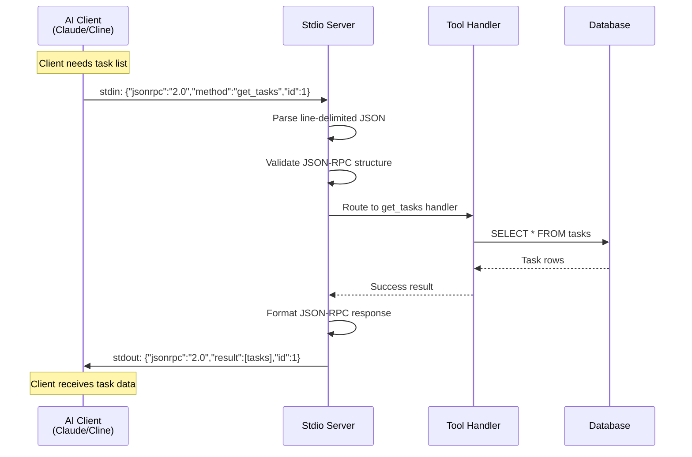
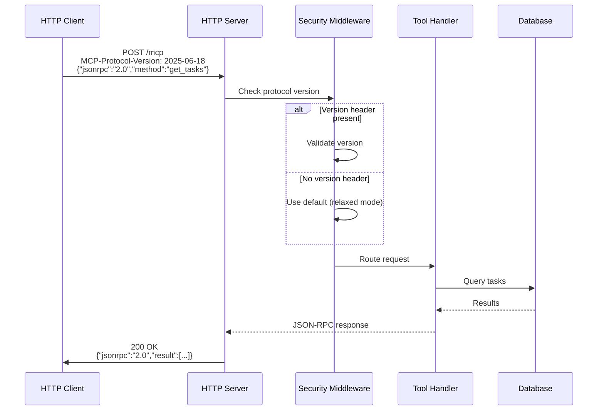
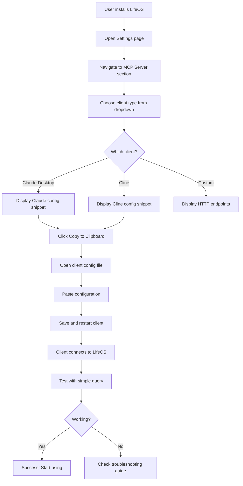

# MCP Server Configuration Fix

## Overview

This design addresses the critical incompatibility between LifeOS's current HTTP-based MCP server implementation and standard MCP clients that expect stdio-based JSON-RPC communication. The goal is to enable seamless integration with MCP clients like Claude Desktop, Cline, and other AI tools by providing a properly structured stdio transport layer while maintaining the existing HTTP REST API for direct access.

## Problem Analysis

### Current Architecture Issue

The existing MCP server operates as an HTTP REST API service:
- Listens on `http://localhost:3000`
- Requires strict `MCP-Protocol-Version` header
- Blocks requests without exact protocol version match
- Has SSE endpoints but they're not properly configured for MCP clients

### MCP Client Transport Types

MCP clients support two primary transport types:

**1. stdio transport (legacy/older clients):**
- Communication via stdin/stdout streams
- Used by older Claude Desktop, basic Cline installations
- Requires `mcp-remote` bridge to connect to HTTP servers

**2. SSE transport (modern/preferred):**
- Native Streamable HTTP support per MCP spec 2025-06-18
- Direct connection to HTTP server endpoints
- No bridge needed - client connects directly
- Supports SSE streaming for bidirectional communication

### What's Currently Blocking MCP Clients

**Version Header Enforcement:**
- Server requires exact `MCP-Protocol-Version: 2025-06-18` header
- Clients without this header get 400 Bad Request
- Blocks clients using different or no version header

**Missing SSE Endpoint Configuration:**
- Server has `/sse` endpoint but not properly advertised
- Clients expect both `sseUrl` and `postUrl` endpoints
- No clear configuration snippet for native SSE transport

### Native SSE Transport Configuration

**What modern MCP clients need:**
```json
{
  "mcpServers": {
    "lifeos": {
      "transport": {
        "type": "sse",
        "sseUrl": "http://localhost:3000/sse",
        "postUrl": "http://localhost:3000/mcp"
      }
    }
  }
}
```

**What legacy clients need (via mcp-remote bridge):**
```json
{
  "mcpServers": {
    "lifeos": {
      "command": "npx",
      "args": ["-y", "mcp-remote", "http://localhost:3000/mcp"]
    }
  }
}
```

## Solution Architecture

### Dual Transport Support (Native SSE + Legacy Bridge)

Support both modern SSE transport and legacy stdio via mcp-remote:



### Transport Strategy

**Modern Clients (Preferred):**
- Use native SSE transport configuration
- Direct HTTP/SSE connection to LifeOS
- No bridge process needed
- Better performance, fewer moving parts

**Legacy Clients (Fallback):**
- Use `mcp-remote` bridge for stdio compatibility
- Bridge translates stdio ↔ HTTP
- Same backend endpoints, different client config

### Configuration Matrix

| Client Type | Transport | Configuration Method | Bridge Needed |
|-------------|-----------|---------------------|---------------|
| Modern Claude Desktop | Native SSE | `transport.type: "sse"` | No |
| Cursor IDE | Native SSE | `transport.type: "sse"` | No |
| Windsurf | Native SSE | `transport.type: "sse"` | No |
| Older Claude | stdio | `command: npx mcp-remote` | Yes |
| Basic Cline | stdio | `command: npx mcp-remote` | Yes |
| Custom HTTP | HTTP POST | Direct API calls | No |

## Component Design

### 1. HTTP Server Modifications

**Primary Change:** Make `MCP-Protocol-Version` header **optional** and ensure SSE endpoints are fully functional.

**Current Problem:**
```javascript
// Strict enforcement blocks clients
if (!protocolVersion) {
  return res.status(400).json({
    error: { code: 'MISSING_PROTOCOL_VERSION', ... }
  });
}
```

**Solution:**
```javascript
// Make version optional, accept any version or none
const protocolVersion = req.get('MCP-Protocol-Version');
if (protocolVersion && SUPPORTED_VERSIONS.includes(protocolVersion)) {
  res.setHeader('MCP-Protocol-Version', protocolVersion);
}
// Continue processing regardless
```

### 2. Communication Flow: Native SSE Transport



### 3. Communication Flow: Legacy Bridge (mcp-remote)



### 4. Middleware Security Modes

| Mode | Version Required | Origin Check | Session Required | Use Case |
|------|-----------------|--------------|------------------|----------|
| **Strict** | Yes, exact match | Yes | Optional | Production with controlled clients |
| **Relaxed** | Optional | Yes (localhost) | No | Development, modern clients |
| **Legacy** | No | No | No | Maximum compatibility, mcp-remote |

**Recommended Configuration:**
- `/mcp` endpoint: **Relaxed** mode (accept optional version)
- `/sse` endpoint: **Relaxed** mode (accept optional version)
- `/api/*` endpoints: **Strict** mode (require auth)

### 5. Endpoint Configuration

| Endpoint | Method | Purpose | Headers | Response |
|----------|--------|---------|---------|----------|
| `/mcp` | POST | JSON-RPC tool execution | `Content-Type: application/json`<br/>`Mcp-Session-Id` (optional) | JSON-RPC response |
| `/sse` | GET | SSE streaming for server push | `Accept: text/event-stream`<br/>`Mcp-Session-Id` (optional) | SSE stream |
| `/messages` | POST | Legacy message endpoint | `Content-Type: application/json` | JSON response |
| `/health` | GET | Server health check | None | `{"status":"ok"}` |

## MCP Client Configuration

### Modern Clients: Native SSE Transport (Recommended)

**For Claude Desktop (latest) - %AppData%\Claude\config.json:**
```json
{
  "mcpServers": {
    "lifeos": {
      "transport": {
        "type": "sse",
        "sseUrl": "http://localhost:3000/sse",
        "postUrl": "http://localhost:3000/mcp"
      },
      "metadata": {
        "name": "LifeOS",
        "version": "1.0.0",
        "description": "Personal life management system"
      },
      "capabilities": {
        "tools": true,
        "resources": true
      }
    }
  }
}
```

**For Cursor IDE - .cursor/mcp.json:**
```json
{
  "mcpServers": {
    "lifeos": {
      "transport": {
        "type": "sse",
        "sseUrl": "http://localhost:3000/sse",
        "postUrl": "http://localhost:3000/mcp",
        "heartbeatMs": 15000,
        "requestTimeoutMs": 30000
      }
    }
  }
}
```

**For Windsurf - windsurf.config.json:**
```json
{
  "mcpServers": {
    "lifeos": {
      "transport": {
        "type": "sse",
        "sseUrl": "http://localhost:3000/sse",
        "postUrl": "http://localhost:3000/mcp",
        "retry": {
          "maxAttempts": 3,
          "backoffMs": 2000
        }
      }
    }
  }
}
```

### Legacy Clients: mcp-remote Bridge (Fallback)

**For older Claude Desktop versions:**
```json
{
  "mcpServers": {
    "lifeos": {
      "command": "npx",
      "args": ["-y", "mcp-remote", "http://localhost:3000/mcp"]
    }
  }
}
```

**For basic Cline - .vscode/settings.json:**
```json
{
  "roo-cline.mcp.servers": {
    "lifeos": {
      "command": "npx",
      "args": ["-y", "mcp-remote", "http://localhost:3000/mcp"]
    }
  }
}
```

### Configuration Generation in Settings UI

The LifeOS settings page provides copy-paste configuration snippets for both transport types:

**Settings Page Enhancements:**

| Field | Description | Values |
|-------|-------------|--------|
| **Server Status** | HTTP server running indicator | Green (running) / Red (stopped) |
| **Server Port** | Configurable HTTP port | Default: 3000 (editable) |
| **SSE Endpoint** | Native SSE URL | `http://localhost:{port}/sse` |
| **MCP Endpoint** | JSON-RPC POST URL | `http://localhost:{port}/mcp` |
| **Transport Type** | Toggle: Native SSE / Legacy Bridge | Default: Native SSE |
| **Client Target** | Dropdown selector | Claude Desktop / Cursor / Windsurf / Cline / Custom |
| **Config Snippet** | Copy-paste JSON | Auto-generated based on selections |

**UI Flow:**



**Configuration Snippet Generator:**

The UI dynamically generates snippets based on:
- Selected transport type (Native SSE vs Legacy Bridge)
- Selected client (Claude, Cursor, Windsurf, Cline, Custom)
- Current server port (from MCP config)
- Optional authentication settings

## Auto-Start Behavior

### HTTP Server Launch Strategy

**Decision:** HTTP server auto-starts with LifeOS application when enabled.

**Rationale:**
- Both native SSE clients and mcp-remote bridge expect server to be running
- Clients fail immediately if endpoint is unavailable
- Auto-start ensures seamless user experience
- Server runs in-process, no separate process management needed

### Startup Sequence



### Lifecycle Management

| Component | Lifecycle | Instances | Startup Trigger | Shutdown Trigger |
|-----------|-----------|-----------|-----------------|------------------|
| **HTTP Server** | App lifetime | Single (in-process) | LifeOS startup (if enabled) | LifeOS exit |
| **SSE Connections** | Per-session | Multiple (one per client) | Client initiates connection | Client disconnect or timeout |
| **mcp-remote** | Per-client-session | Multiple (legacy clients only) | Client spawns process | Client stops or crashes |

### Port Binding Behavior

**On startup:**
1. Read configured port from database (default: 3000)
2. Attempt to bind to `localhost:{port}`
3. If port in use, log error and notify user
4. User can change port in Settings and restart server

**Port conflict handling:**
- Server startup fails gracefully if port unavailable
- UI displays error message with current port
- Settings UI allows port change without app restart
- Server can be manually restarted after port change

## Protocol Version Handling

### Relaxed Version Enforcement

**Problem:** Current strict version checking blocks clients without version headers.

**Solution:** Make version header optional with graceful degradation.

**Middleware Behavior:**



**Configuration Options:**

| Mode | Protocol Version Required | Use Case |
|------|---------------------------|----------|
| **Strict** | Yes, must match supported versions | Production with known clients |
| **Relaxed** | No, optional with fallback | Development, unknown clients |
| **Legacy** | No, ignored entirely | Backwards compatibility |

## Testing Strategy

### Stdio Server Testing

**Unit Tests:**
- JSON parsing from stdin stream
- JSON-RPC 2.0 format validation
- Tool method routing
- Error response formatting

**Integration Tests:**
- Simulate stdin/stdout streams
- Send complete JSON-RPC request lifecycle
- Verify response format and content
- Test error conditions (invalid JSON, unknown methods)

### HTTP Server Testing

**Regression Tests:**
- Ensure existing HTTP endpoints still work
- Verify optional protocol version header
- Test SSE streaming functionality
- Validate CORS and security middleware

### End-to-End Testing

**Manual Testing with Real Clients:**
- Configure Claude Desktop with stdio server
- Configure Cline with stdio server
- Send tool invocation requests from AI clients
- Verify data retrieval and modification operations

## Configuration Schema Updates

### MCP Config Table Enhancements

Add fields to support dual transport:

| Field | Type | Purpose | Default |
|-------|------|---------|---------|
| `stdio_enabled` | boolean | Enable stdio transport | `true` |
| `http_enabled` | boolean | Enable HTTP transport | `true` |
| `require_protocol_version` | boolean | Enforce version header | `false` |
| `stdio_server_path` | text | Path to stdio binary | Auto-detected |

### Settings UI Updates

**New Configuration Sections:**

1. **Transport Settings**
   - Enable/disable stdio transport
   - Enable/disable HTTP transport
   - Protocol version enforcement toggle

2. **Client Configuration Generator**
   - Select target client (dropdown)
   - Display formatted configuration snippet
   - Copy to clipboard button
   - Instructions for client setup

3. **Server Paths**
   - Display stdio server absolute path
   - Display HTTP server endpoint URL
   - Test connection buttons

## Implementation Phases

### Phase 1: Relax Protocol Version Enforcement
- Update `mcpSecurity.ts` middleware to make version header optional
- Set `/mcp` endpoint to use relaxed security mode
- Add configuration toggle for strict/relaxed mode
- Test HTTP endpoint with and without version header

### Phase 2: Configuration UI Updates
- Add "MCP Remote Configuration" section to Settings
- Display HTTP endpoint URL dynamically (based on port)
- Implement client-type selector (Claude/Cline/Cursor/Custom)
- Generate appropriate config snippets with mcp-remote
- Add copy-to-clipboard functionality

### Phase 3: Auto-Start Configuration
- Ensure HTTP server auto-starts with app (existing behavior)
- Add toggle for auto-start in Settings UI
- Display clear server status indicator
- Add "Test Connection" button to verify endpoint

### Phase 4: Documentation & Testing
- Update MCP_SERVER_GUIDE.md with mcp-remote instructions
- Add client-specific setup guides (Claude, Cline, Cursor)
- Test with real MCP clients using mcp-remote
- Document troubleshooting steps

## Data Flow Diagrams

### Stdio Mode: Tool Invocation



### HTTP Mode: REST API Access



## Error Handling Strategy

### Stdio Transport Errors

**Invalid JSON:**
- Log error to stderr (not stdout)
- Send JSON-RPC error response to stdout
- Continue listening for next request

**Unknown Method:**
- Return JSON-RPC error code -32601 (Method not found)
- Include list of available methods in error data

**Database Error:**
- Return JSON-RPC error code -32002 (Database error)
- Log full error to application logs
- Return safe error message to client

### HTTP Transport Errors

**Missing Protocol Version (Relaxed Mode):**
- Log warning
- Proceed with default version
- Return response without version header

**Invalid Protocol Version (Strict Mode):**
- Return 400 Bad Request
- Include supported versions in response body
- Set appropriate error headers

## Security Considerations

### Stdio Transport Security

**Risk: Arbitrary code execution**
- Stdio server runs with same permissions as spawning client
- Limit file system access to app database only
- Validate all input parameters strictly

**Risk: Data injection**
- Use parameterized SQL queries
- Sanitize all user input
- Reject requests exceeding size limits

### HTTP Transport Security

**Maintain existing security:**
- API key authentication (optional)
- Rate limiting per IP
- CORS restrictions
- Request size limits

### Shared Security Principles

| Principle | Implementation |
|-----------|----------------|
| **Input validation** | JSON schema validation for all parameters |
| **SQL injection prevention** | Parameterized queries only |
| **Output sanitization** | Escape special characters in responses |
| **Resource limits** | Max message size, rate limiting |

## User Experience Flow

### Initial Setup Journey



### Ongoing Usage

Once configured, the workflow is seamless:
- User interacts with AI client (Claude, Cline, etc.)
- Client spawns stdio server automatically
- User's requests invoke LifeOS tools transparently
- Data flows between AI and LifeOS database
- No manual intervention required

## Configuration Examples

### Modern Clients: Native SSE Transport

#### Claude Desktop (Latest)

**Location:** `%AppData%\Claude\config.json` (Windows) or `~/Library/Application Support/Claude/config.json` (macOS)

**Content:**
```json
{
  "mcpServers": {
    "lifeos": {
      "transport": {
        "type": "sse",
        "sseUrl": "http://localhost:3000/sse",
        "postUrl": "http://localhost:3000/mcp",
        "heartbeatMs": 15000,
        "requestTimeoutMs": 30000
      },
      "metadata": {
        "name": "LifeOS",
        "version": "1.0.0",
        "description": "Personal productivity system with tasks, habits, notes, and Q&A"
      },
      "capabilities": {
        "tools": true,
        "resources": true,
        "prompts": false
      }
    }
  }
}
```

#### Cursor IDE

**Location:** `.cursor/mcp.json` in workspace or user config directory

**Content:**
```json
{
  "mcpServers": {
    "lifeos": {
      "transport": {
        "type": "sse",
        "sseUrl": "http://localhost:3000/sse",
        "postUrl": "http://localhost:3000/mcp"
      }
    }
  }
}
```

#### Windsurf

**Location:** `windsurf.config.json`

**Content:**
```json
{
  "mcpServers": {
    "lifeos": {
      "transport": {
        "type": "sse",
        "sseUrl": "http://localhost:3000/sse",
        "postUrl": "http://localhost:3000/mcp",
        "retry": {
          "maxAttempts": 3,
          "backoffMs": 2000
        }
      },
      "metadata": {
        "name": "LifeOS",
        "description": "Kanban, habits, notes, QA, activities tracking"
      },
      "capabilities": {
        "tools": true,
        "resources": true
      }
    }
  }
}
```

### Legacy Clients: mcp-remote Bridge

#### Older Claude Desktop

**Location:** `%AppData%\Claude\config.json`

**Content:**
```json
{
  "mcpServers": {
    "lifeos": {
      "command": "npx",
      "args": [
        "-y",
        "mcp-remote",
        "http://localhost:3000/mcp"
      ]
    }
  }
}
```

#### Cline (Basic Configuration)

**Location:** `.vscode/settings.json`

**Content:**
```json
{
  "roo-cline.mcp.servers": {
    "lifeos": {
      "command": "npx",
      "args": [
        "-y",
        "mcp-remote",
        "http://localhost:3000/mcp"
      ]
    }
  }
}
```

### Custom Port Configuration

**If LifeOS runs on port 8080:**

**Native SSE:**
```json
{
  "mcpServers": {
    "lifeos": {
      "transport": {
        "type": "sse",
        "sseUrl": "http://localhost:8080/sse",
        "postUrl": "http://localhost:8080/mcp"
      }
    }
  }
}
```

**Legacy Bridge:**
```json
{
  "mcpServers": {
    "lifeos": {
      "command": "npx",
      "args": ["-y", "mcp-remote", "http://localhost:8080/mcp"]
    }
  }
}
```

### Direct HTTP Testing (curl)

**Health check:**
```bash
curl http://localhost:3000/health
```

**JSON-RPC tool invocation:**
```bash
curl -X POST http://localhost:3000/mcp \
  -H "Content-Type: application/json" \
  -d '{
    "jsonrpc": "2.0",
    "method": "get_tasks",
    "params": {"status": "pending"},
    "id": 1
  }'
```

**SSE stream connection:**
```bash
curl -N -H "Accept: text/event-stream" http://localhost:3000/sse
```

## Build System Integration

### Build Outputs

**Required artifacts (no changes needed):**

| Artifact | Purpose | Build Command |
|----------|---------|---------------|
| `mcp-server.js` | HTTP transport server | `npm run build:server` |
| `main.js` | Electron main process | `npm run build:main` |
| `renderer/index.html` | Frontend UI | Vite build |

### No Custom Stdio Server Needed

**Why:**
- `mcp-remote` is a standard npm package, installed globally or via npx
- Users run `npx mcp-remote http://localhost:3000/mcp`
- No custom stdio server to build or distribute
- Simpler build process, fewer artifacts

### Deployment Structure

**Development:**
```
lifeos/
├── src/
│   ├── server/
│   │   └── mcp-server.ts      ← HTTP server (existing)
│   └── main/
│       └── index.ts            ← Starts HTTP server
└── dist/
    ├── mcp-server.js           ← Compiled HTTP server
    └── main.js                 ← Electron main
```

**Production (packaged app):**
```
LifeOS.app/
└── Contents/
    └── Resources/
        └── app.asar            ← All-in-one Electron app
            ├── main.js
            └── server/mcp-server.js
```

**User's machine:**
```
npx mcp-remote http://localhost:3000/mcp
↓
Automatically downloads mcp-remote from npm registry
↓
Bridges stdio ↔ LifeOS HTTP server
```

## Monitoring and Debugging

### HTTP Server Logging

**Log all MCP requests:**
- Request method and parameters
- Tool handler execution
- Response data and errors
- Client connection events

**Log format:**
```
[2025-01-15 10:30:45] [MCP] POST /mcp method=get_tasks
[2025-01-15 10:30:45] [MCP] Executing tool: get_tasks
[2025-01-15 10:30:45] [MCP] Response: 15 tasks returned
```

### mcp-remote Debugging

**Client-side diagnostics:**
- `mcp-remote` logs to stderr (visible in client logs)
- HTTP connection errors appear in client console
- Network issues visible in Electron DevTools

### Debugging Tools in Settings UI

**Enhanced Settings panel:**
- **Server Status**: Green/red indicator with uptime
- **Connection Test**: Button to verify endpoint responds
- **Recent Requests**: Last 10 MCP requests with timestamps
- **Error Log**: Display HTTP errors and connection failures
- **Sample Request**: Test button to send `get_stats` request

## Migration Strategy

### No Breaking Changes

**Existing HTTP server continues to work:**
- All current REST API endpoints remain functional
- Existing integrations unaffected
- Optional migration to stdio for better client support

### Gradual Adoption

Users can adopt stdio transport when ready:
- HTTP server remains default
- Stdio configuration is optional
- Both transports can run simultaneously

### Deprecation Plan

**No deprecation needed:**
- Both transports serve different use cases
- HTTP for web apps, stdio for AI clients
- Long-term support for both
