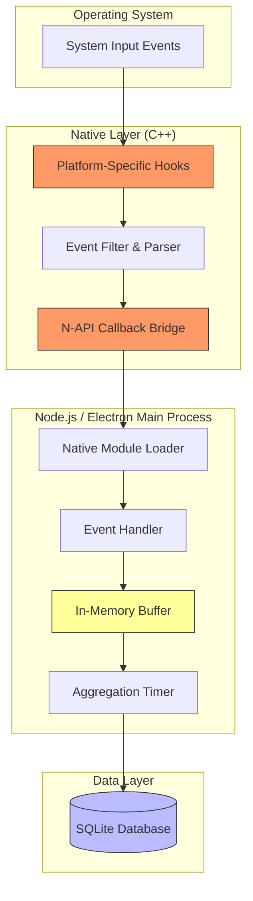
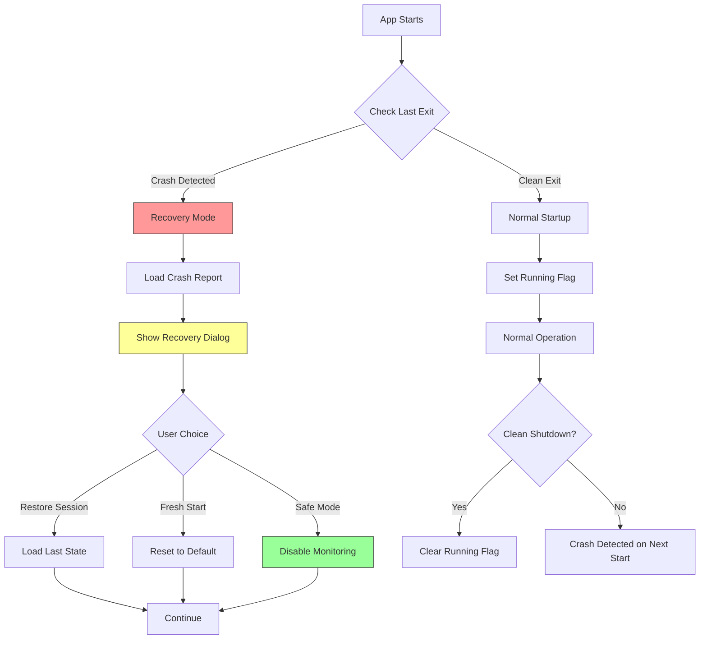
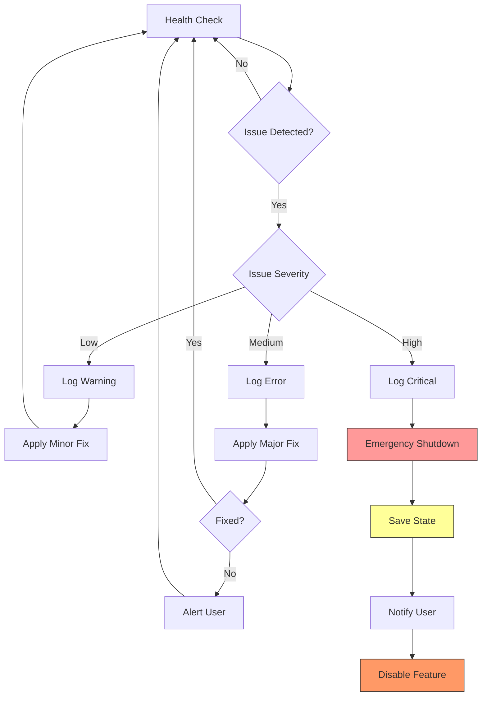
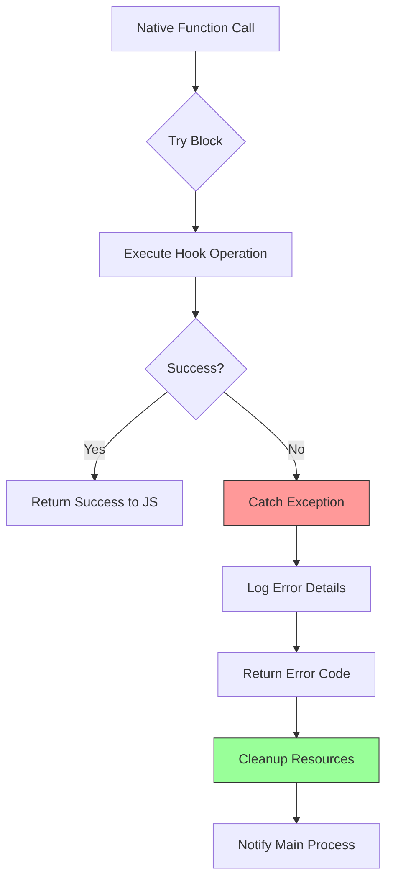
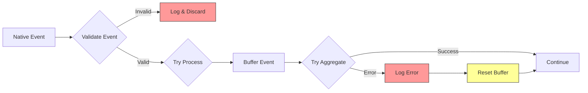
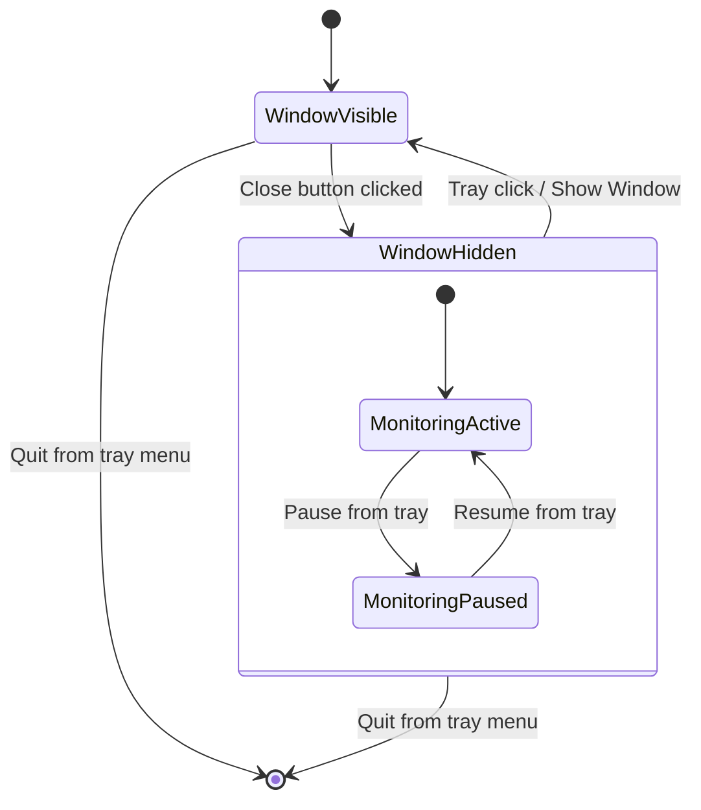

# Monitor Module Design

## Overview

The Monitor Module is a comprehensive system activity tracking component designed to capture and analyze user interaction patterns with the LifeOS desktop application. This module records keystroke patterns, mouse click positions, battery status, application usage hours, and running application inventory to provide detailed insights into user productivity and device health.

### Core Objectives

- Capture detailed system-wide user input metrics across all applications while respecting system performance constraints
- Monitor global keyboard and mouse activity regardless of which application has focus
- Aggregate data intelligently to prevent database bloat
- Provide rich visualizations of activity patterns through heatmaps, charts, and statistics
- Track active hours and productivity patterns based on system-wide application interaction
- Monitor battery health and consumption trends over time
- Identify frequently used applications and usage duration patterns across the entire system

### Value Proposition

| Benefit | Description |
|---------|-------------|
| Productivity Insights | Identify peak productivity hours and input intensity patterns |
| Application Usage Tracking | Understand which applications consume most time and focus |
| Battery Health Monitoring | Track battery degradation and consumption patterns over time |
| Input Pattern Analysis | Discover most-used keys and mouse interaction hotspots |
| Session Management | Automatic detection of active vs. idle periods |

### Repository Type

Desktop Application (Electron-based) with native OS integration for system-level monitoring capabilities.

## Architecture

### High-Level Component Structure

``mermaid
flowchart TD
    subgraph "Native OS Layer"
        A[Electron Main Process]
        B[System APIs]
        C[Input Listeners]
        D[Battery Monitor]
        E[Process Watcher]
    end
    
    subgraph "Data Collection Layer"
        F[Keystroke Aggregator]
        G[Mouse Click Tracker]
        H[Battery Sampler]
        I[App Activity Tracker]
        J[Active Hours Detector]
    end
    
    subgraph "Storage Layer"
        K[(Keystroke Stats)]
        L[(Mouse Clicks)]
        M[(Battery History)]
        N[(App Sessions)]
        O[(Active Hours)]
    end
    
    subgraph "Presentation Layer"
        P[Keyboard Heatmap]
        Q[Mouse Click Heatmap]
        R[Battery Line Chart]
        S[Activity Timeline]
        T[App Usage Dashboard]
    end
    
    A --> C
    A --> D
    B --> E
    
    C --> F
    C --> G
    D --> H
    E --> I
    F --> J
    G --> J
    
    F --> K
    G --> L
    H --> M
    I --> N
    J --> O
    
    K --> P
    L --> Q
    M --> R
    N --> S
    O --> T
    
    style A fill:#6f9,stroke:#333
    style K fill:#bbf,stroke:#333
    style L fill:#bbf,stroke:#333
    style M fill:#bbf,stroke:#333
    style N fill:#bbf,stroke:#333
    style O fill:#bbf,stroke:#333
    style P fill:#f96,stroke:#333
    style Q fill:#f96,stroke:#333
    style R fill:#f96,stroke:#333
    style S fill:#f96,stroke:#333
    style T fill:#f96,stroke:#333
```

### System Integration Architecture

``mermaid
sequenceDiagram
    participant OS as Operating System
    participant GlobalHook as Global Input Hooks
    participant Main as Main Process
    participant Aggregator as Data Aggregator
    participant DB as SQLite Database
    participant IPC as IPC Bridge
    participant UI as Renderer UI
    
    OS->>GlobalHook: System-wide Events (keystroke/click/battery)
    Note over GlobalHook: Runs even when LifeOS<br/>is in background
    GlobalHook->>Main: Forward Event to Main Process
    Main->>Aggregator: Buffer Event
    
    Note over Aggregator: Aggregate for 1 minute
    
    Aggregator->>Aggregator: Count keystrokes per key
    Aggregator->>Aggregator: Store click coordinates (screen)
    Aggregator->>Aggregator: Sample battery status
    
    Aggregator->>DB: Persist aggregated data
    
    UI->>IPC: Request monitor statistics
    IPC->>DB: Query aggregated data
    DB-->>IPC: Return statistics
    IPC-->>UI: Formatted response
    
    UI->>UI: Render visualizations
```

### Data Flow Strategy

The monitoring system follows a hierarchical data aggregation pattern to balance granularity with storage efficiency:

| Collection Interval | Aggregation Level | Storage Strategy |
|---------------------|-------------------|------------------|
| Real-time | In-memory buffer | Temporary holding (60 seconds) |
| 1 minute | Per-minute statistics | Permanent storage for detailed analysis |
| 5 minutes | Rolling window summary | Calculated on-demand from minute data |
| 1 hour | Hourly rollup | Calculated view for trend analysis |
| 1 day | Daily summary | Aggregated from hourly data |

## Data Models & Storage Schema

### Keystroke Statistics Table

Stores per-minute keystroke counts for each key, enabling detailed typing pattern analysis.

| Column | Type | Constraints | Description |
|--------|------|-------------|-------------|
| id | INTEGER | PRIMARY KEY AUTOINCREMENT | Unique record identifier |
| timestamp | TEXT | NOT NULL, INDEXED | ISO 8601 timestamp (minute precision) |
| key_code | TEXT | NOT NULL | Virtual key code or character representation |
| key_label | TEXT | NULL | Human-readable key label (e.g., "A", "Enter", "Shift") |
| count | INTEGER | NOT NULL DEFAULT 0 | Number of times key was pressed in this minute |
| is_modifier | INTEGER | NOT NULL DEFAULT 0 | Boolean flag for modifier keys (Ctrl, Alt, Shift) |
| created_at | TEXT | NOT NULL DEFAULT CURRENT_TIMESTAMP | Record creation timestamp |

**Indexes:**
- Composite index on (timestamp, key_code) for efficient time-based queries
- Index on timestamp for aggregation queries

### Mouse Click Events Table

Records mouse click positions with screen-absolute coordinates for heatmap generation.

| Column | Type | Constraints | Description |
|--------|------|-------------|-------------|
| id | INTEGER | PRIMARY KEY AUTOINCREMENT | Unique click identifier |
| timestamp | TEXT | NOT NULL, INDEXED | ISO 8601 timestamp (second precision) |
| x_position | INTEGER | NOT NULL | X coordinate (screen absolute) |
| y_position | INTEGER | NOT NULL | Y coordinate (screen absolute) |
| screen_width | INTEGER | NOT NULL | Screen width at click time |
| screen_height | INTEGER | NOT NULL | Screen height at click time |
| button | TEXT | NOT NULL | Button type (left, right, middle) |
| click_type | TEXT | NOT NULL | Single or double click |
| active_app | TEXT | NULL | Application that had focus at click time |
| created_at | TEXT | NOT NULL DEFAULT CURRENT_TIMESTAMP | Record creation timestamp |

**Indexes:**
- Index on timestamp for time-range queries
- Composite index on (timestamp, button) for button-specific analysis
- Index on active_app for per-application click analysis

### Battery Status History Table

Captures periodic battery status snapshots for health and consumption tracking.

| Column | Type | Constraints | Description |
|--------|------|-------------|-------------|
| id | INTEGER | PRIMARY KEY AUTOINCREMENT | Unique status identifier |
| timestamp | TEXT | NOT NULL, INDEXED | ISO 8601 timestamp |
| battery_level | REAL | NOT NULL | Battery percentage (0-100) |
| is_charging | INTEGER | NOT NULL | Boolean charging status |
| is_plugged | INTEGER | NOT NULL | Boolean AC adapter connection status |
| estimated_time | INTEGER | NULL | Remaining minutes (null if charging/unknown) |
| battery_health | REAL | NULL | Battery health percentage (if available) |
| charge_cycles | INTEGER | NULL | Total charge cycles (if available) |
| created_at | TEXT | NOT NULL DEFAULT CURRENT_TIMESTAMP | Record creation timestamp |

**Sampling Interval:** 5 minutes (when app is active)

**Indexes:**
- Index on timestamp for time-series queries

### Application Session Table

Tracks when external applications are opened, focused, and closed.

| Column | Type | Constraints | Description |
|--------|------|-------------|-------------|
| id | INTEGER | PRIMARY KEY AUTOINCREMENT | Unique session identifier |
| app_name | TEXT | NOT NULL | Application executable name |
| app_title | TEXT | NULL | Window title (if available) |
| app_path | TEXT | NULL | Full executable path |
| process_id | INTEGER | NULL | Operating system process ID |
| start_time | TEXT | NOT NULL | Session start timestamp |
| end_time | TEXT | NULL | Session end timestamp (null if still running) |
| duration_seconds | INTEGER | NULL | Calculated duration when session ends |
| focus_duration_seconds | INTEGER | NOT NULL DEFAULT 0 | Total time app had focus |
| created_at | TEXT | NOT NULL DEFAULT CURRENT_TIMESTAMP | Record creation timestamp |
| updated_at | TEXT | NOT NULL DEFAULT CURRENT_TIMESTAMP | Last update timestamp |

**Indexes:**
- Composite index on (app_name, start_time) for per-app queries
- Index on start_time for chronological analysis

### Active Hours Summary Table

Aggregates user activity into hourly buckets based on input events and app focus.

| Column | Type | Constraints | Description |
|--------|------|-------------|-------------|
| id | INTEGER | PRIMARY KEY AUTOINCREMENT | Unique summary identifier |
| hour_timestamp | TEXT | NOT NULL UNIQUE | Hour bucket (YYYY-MM-DD HH:00:00) |
| total_keystrokes | INTEGER | NOT NULL DEFAULT 0 | Total keystrokes in this hour |
| total_clicks | INTEGER | NOT NULL DEFAULT 0 | Total mouse clicks in this hour |
| active_minutes | INTEGER | NOT NULL DEFAULT 0 | Minutes with detected activity |
| app_switches | INTEGER | NOT NULL DEFAULT 0 | Number of application focus changes |
| activity_score | REAL | NOT NULL DEFAULT 0 | Composite activity intensity (0-100) |
| created_at | TEXT | NOT NULL DEFAULT CURRENT_TIMESTAMP | Record creation timestamp |
| updated_at | TEXT | NOT NULL DEFAULT CURRENT_TIMESTAMP | Last update timestamp |

**Activity Score Calculation:**
- Normalized composite metric combining keystroke rate, click frequency, and app interaction
- Formula: `min(100, (keystrokes/60)*10 + (clicks/60)*5 + app_switches*2)`

**Indexes:**
- Unique index on hour_timestamp
- Index on hour_timestamp for time-series queries

## Data Collection Architecture

### Native Addon Integration Pattern



**Integration Flow:**

| Layer | Component | Responsibility |
|-------|-----------|----------------|
| OS | System Events | Generate raw input events |
| Native (C++) | Global Hooks | Intercept events before applications |
| Native (C++) | Event Parser | Extract keycode, coordinates, timestamp |
| Native (C++) | N-API Callback | Invoke JavaScript function with event data |
| Main Process | Event Handler | Receive event, validate, buffer |
| Main Process | Aggregator | Accumulate events for batch processing |
| Main Process | Timer | Flush buffer every 60 seconds |
| Database | Repository | Persist aggregated statistics |

**Native Addon API Surface:**

The C++ addon exposes the following functions to JavaScript:

| Function | Parameters | Return | Description |
|----------|------------|--------|-------------|
| `start(callback)` | callback: (event) => void | boolean | Initialize hooks and start monitoring |
| `stop()` | none | boolean | Remove hooks and stop monitoring |
| `isRunning()` | none | boolean | Check if monitoring is active |
| `getStats()` | none | object | Return native-level statistics (events/sec) |

**Event Object Structure:**

When the native addon detects an input event, it passes a structured object to the JavaScript callback:

```
Keyboard Event:
{
  type: 'keydown' | 'keyup',
  keycode: number,           // Virtual key code
  rawcode: number,           // Platform-specific scancode
  timestamp: number,         // High-precision timestamp (ms)
  altKey: boolean,
  ctrlKey: boolean,
  shiftKey: boolean,
  metaKey: boolean
}

Mouse Event:
{
  type: 'mouseclick' | 'mousemove' | 'mousewheel',
  button: number,            // 1=left, 2=right, 3=middle
  clicks: number,            // 1=single, 2=double
  x: number,                 // Screen-absolute X
  y: number,                 // Screen-absolute Y
  timestamp: number
}
```

### Keystroke Monitoring Strategy

``mermaid
flowchart LR
    A[System-wide Keyboard Hook] --> B{Event Captured}
    B --> C[Extract Key Code]
    C --> D[In-Memory Counter Map]
    D --> E{Minute Boundary?}
    E -->|No| D
    E -->|Yes| F[Flush to Database]
    F --> G[Reset Counters]
    G --> D
    
    style A fill:#6f9,stroke:#333
    style D fill:#ff9,stroke:#333
    style F fill:#bbf,stroke:#333
```

**Implementation Approach:**

The keystroke monitoring uses system-wide global hooks to capture keyboard events across all applications, regardless of which application has focus. This requires platform-specific native modules:

| Platform | Implementation Method | Library/API |
|----------|----------------------|-------------|
| Windows | Low-level keyboard hook (WH_KEYBOARD_LL) | Native Node addon using SetWindowsHookEx |
| macOS | Event Tap (CGEventTapCreate) | Native addon with Accessibility permissions |
| Linux | X11 XRecord extension or evdev | Native addon with X11 or input device access |

Events are buffered in an in-memory hash map structure keyed by key code, with values incrementing on each press. The hook runs continuously in the main process background thread.

**Buffering Strategy:**

| Component | Behavior |
|-----------|----------|
| Buffer Structure | JavaScript Map object with key_code as key and count as value |
| Buffer Lifespan | 60 seconds (one minute) |
| Flush Trigger | Timer-based at minute boundaries |
| Overflow Protection | Automatic flush if buffer exceeds 10,000 unique keys (safety limit) |

**Key Mapping:**

The system maintains a mapping between virtual key codes and human-readable labels to support visualization:

| Key Type | Example Codes | Label Format |
|----------|---------------|--------------|
| Alphanumeric | 65-90, 48-57 | Single character ("A", "5") |
| Function Keys | 112-123 | "F1" through "F12" |
| Modifiers | 16, 17, 18 | "Shift", "Ctrl", "Alt" |
| Special Keys | 13, 32, 8 | "Enter", "Space", "Backspace" |
| Navigation | 37-40 | "Left", "Up", "Right", "Down" |

### Mouse Click Tracking Strategy

``mermaid
flowchart LR
    A[System-wide Mouse Hook] --> B{Click Detected}
    B --> C[Capture Screen Coordinates]
    C --> D[Get Active Application]
    D --> E[Store in Buffer]
    E --> F{Buffer Full or 1min?}
    F -->|No| E
    F -->|Yes| G[Batch Insert to DB]
    G --> H[Clear Buffer]
    H --> E
    
    style A fill:#6f9,stroke:#333
    style E fill:#ff9,stroke:#333
    style G fill:#bbf,stroke:#333
```

**Coordinate Storage:**

Mouse positions are recorded as screen-absolute coordinates to track clicks across all applications and screen regions.

| Coordinate Type | Storage | Purpose |
|----------------|---------|---------|
| Screen Absolute | x, y from global screen origin (0,0) | Raw system-wide position |
| Screen Dimensions | Current screen width/height | Context for multi-monitor setups |
| Normalized (visualization) | (x/screenWidth, y/screenHeight) | Resolution-independent heatmap rendering |
| Active Application | Process name at click time | Filter clicks by application |

**Click Type Classification:**

| Event Type | Detection Logic | Storage Value |
|------------|-----------------|---------------|
| Single Left Click | button=0, clickCount=1 | "left_single" |
| Double Left Click | button=0, clickCount=2 | "left_double" |
| Right Click | button=2 | "right_single" |
| Middle Click | button=1 | "middle_single" |

### Battery Monitoring Strategy

Battery status is sampled periodically using Electron's powerMonitor API, which provides access to system battery information.

**Sampling Configuration:**

| Parameter | Value | Rationale |
|-----------|-------|-----------|
| Sampling Interval | 5 minutes | Balance between granularity and storage |
| Active-only Sampling | No | Record continuously as background service |
| Charging Detection | AC adapter status check | Distinguish charging vs. discharging periods |

**Platform-Specific Capabilities:**

| OS | Battery Level | Charging Status | Health Info | Charge Cycles |
|----|---------------|-----------------|-------------|---------------|
| Windows | ✓ | ✓ | ✓ (via WMI) | ✓ (via WMI) |
| macOS | ✓ | ✓ | ✓ (via IOKit) | ✓ (via IOKit) |
| Linux | ✓ | ✓ | ✗ (limited) | ✗ (limited) |

**Error Handling:**

When battery information is unavailable (desktop systems, virtualized environments), the monitoring gracefully degrades by skipping samples and logging informational messages rather than raising errors.

### Application Usage Tracking Strategy

``mermaid
stateDiagram-v2
    [*] --> Polling
    Polling --> DetectRunning: Poll every 10s
    DetectRunning --> CreateSession: New app detected
    DetectRunning --> UpdateSession: Existing app still running
    DetectRunning --> CloseSession: App no longer running
    
    CreateSession --> Polling
    UpdateSession --> Polling
    CloseSession --> Polling
    
    note right of Polling
        Enumerate running processes
        Query window titles
        Track focus changes
    end note
```

**Process Enumeration:**

The system periodically queries running processes using platform-specific APIs:

| Platform | API | Information Extracted |
|----------|-----|----------------------|
| Windows | Windows Task Scheduler / WMI | Process name, PID, executable path, window title |
| macOS | NSWorkspace / Activity Monitor | Application bundle name, PID, window title |
| Linux | /proc filesystem / wmctrl | Process name, PID, window class |

**Session Lifecycle:**

| State | Trigger | Database Action |
|-------|---------|-----------------|
| Session Start | New process detected in polling cycle | INSERT new record with start_time |
| Session Update | Process still running with focus | UPDATE focus_duration_seconds |
| Session End | Process no longer detected | UPDATE end_time and duration_seconds |
| Orphaned Session | App crashes or detection gap | UPDATE with estimated end_time (last_seen + polling_interval) |

**Focus Tracking:**

The system distinguishes between an application being running vs. having user focus:

- Running duration: Total time from start_time to end_time
- Focus duration: Cumulative time when application window had focus (tracked via focus change events)

### Active Hours Detection Strategy

Active hours are calculated by analyzing the density of input events within hourly time buckets.

**Activity Detection Logic:**

``mermaid
flowchart TD
    A[Hourly Timer Trigger] --> B[Query Events in Past Hour]
    B --> C[Count Keystrokes]
    B --> D[Count Clicks]
    B --> E[Count App Switches]
    
    C --> F[Calculate Activity Score]
    D --> F
    E --> F
    
    F --> G{Score > Threshold?}
    G -->|Yes| H[Mark as Active Minute]
    G -->|No| I[Mark as Idle]
    
    H --> J[Update Active Hours Table]
    I --> J
    
    style F fill:#ff9,stroke:#333
    style J fill:#bbf,stroke:#333
```

**Activity Thresholds:**

| Metric | Active Threshold | Rationale |
|--------|------------------|-----------|
| Keystrokes per minute | ≥ 10 | Indicates typing activity |
| Clicks per minute | ≥ 3 | Indicates UI interaction |
| App switches per hour | ≥ 1 | Indicates task switching |
| Composite activity score | ≥ 5.0 | Combined metric for overall activity |

**Minute-Level Granularity:**

Within each hourly bucket, the system tracks individual minutes as active or idle. An hour with 30+ active minutes is considered a "productive hour" for visualization purposes.

## IPC Communication Layer

The Monitor Module follows the established LifeOS IPC pattern using Electron's main-renderer communication mechanism.

### IPC Handler Registration

Handlers are registered in the main process and exposed via the preload script's API surface.

**Handler Namespace:** `monitor`

| Method | Channel | Parameters | Return Type |
|--------|---------|------------|-------------|
| getKeystrokeStats | monitor:keystroke-stats | { startDate, endDate, groupBy } | KeystrokeStatsResponse |
| getMouseClicks | monitor:mouse-clicks | { startDate, endDate, limit } | MouseClicksResponse |
| getBatteryHistory | monitor:battery-history | { startDate, endDate } | BatteryHistoryResponse |
| getAppSessions | monitor:app-sessions | { startDate, endDate, appName? } | AppSessionsResponse |
| getActiveHours | monitor:active-hours | { startDate, endDate } | ActiveHoursResponse |
| getMonitorStatus | monitor:status | {} | MonitorStatusResponse |
| setMonitorEnabled | monitor:set-enabled | { enabled: boolean } | ApiResponse |

### Request/Response Schema

**KeystrokeStatsResponse:**

| Field | Type | Description |
|-------|------|-------------|
| ok | boolean | Success indicator |
| data.stats | Array | Keystroke statistics records |
| data.stats[].key_code | string | Virtual key code |
| data.stats[].key_label | string | Human-readable label |
| data.stats[].total_count | number | Total presses in period |
| data.stats[].is_modifier | boolean | Modifier key flag |
| data.topKeys | Array | Top 10 most-pressed keys |
| data.totalKeystrokes | number | Sum of all keystrokes |

**MouseClicksResponse:**

| Field | Type | Description |
|-------|------|-------------|
| ok | boolean | Success indicator |
| data.clicks | Array | Click event records |
| data.clicks[].timestamp | string | ISO 8601 timestamp |
| data.clicks[].x_position | number | Screen-absolute X coordinate |
| data.clicks[].y_position | number | Screen-absolute Y coordinate |
| data.clicks[].active_app | string | Application with focus at click time |
| data.clicks[].button | string | Button type |
| data.totalClicks | number | Total clicks in period |

**BatteryHistoryResponse:**

| Field | Type | Description |
|-------|------|-------------|
| ok | boolean | Success indicator |
| data.history | Array | Battery status snapshots |
| data.history[].timestamp | string | ISO 8601 timestamp |
| data.history[].battery_level | number | Percentage (0-100) |
| data.history[].is_charging | boolean | Charging status |
| data.currentLevel | number | Current battery percentage |
| data.averageLevel | number | Average level in period |

**AppSessionsResponse:**

| Field | Type | Description |
|-------|------|-------------|
| ok | boolean | Success indicator |
| data.sessions | Array | Application session records |
| data.sessions[].app_name | string | Application name |
| data.sessions[].duration_seconds | number | Total session duration |
| data.sessions[].focus_duration_seconds | number | Time with focus |
| data.topApps | Array | Top 5 apps by total duration |

**ActiveHoursResponse:**

| Field | Type | Description |
|-------|------|-------------|
| ok | boolean | Success indicator |
| data.hours | Array | Hourly activity summaries |
| data.hours[].hour_timestamp | string | Hour bucket timestamp |
| data.hours[].activity_score | number | Activity intensity (0-100) |
| data.hours[].active_minutes | number | Active minutes in hour |
| data.peakHours | Array | Top 5 most active hours |
| data.totalActiveMinutes | number | Total active minutes |

## Visualization Components

### Keyboard Heatmap Component

Displays a visual keyboard layout with color-coded keys based on usage frequency.

**Component Name:** `KeyboardHeatmap`

**Data Requirements:**

| Input | Type | Source |
|-------|------|--------|
| keystrokeStats | Array | IPC call to monitor:keystroke-stats |
| dateRange | Object | User-selected time period |
| colorScheme | String | Theme-dependent color palette |

**Visual Design:**

``mermaid
graph TD
    A[Keyboard Layout Grid] --> B[Key Cells]
    B --> C{Usage Count}
    C -->|0| D[Minimal opacity]
    C -->|1-10| E[Low intensity color]
    C -->|11-50| F[Medium intensity color]
    C -->|51-100| G[High intensity color]
    C -->|>100| H[Maximum intensity color]
    
    B --> I[Tooltip on Hover]
    I --> J[Key label]
    I --> K[Press count]
    I --> L[Percentage of total]
    
    style D fill:#ddd,stroke:#333
    style E fill:#03DAC6,opacity:0.3
    style F fill:#03DAC6,opacity:0.6
    style G fill:#03DAC6,opacity:0.85
    style H fill:#03DAC6,opacity:1.0
```

**Layout Strategy:**

The component renders a standard QWERTY keyboard layout with properly positioned keys including:

| Row | Keys Included |
|-----|---------------|
| Function Row | Esc, F1-F12, Print Screen, Scroll Lock, Pause |
| Number Row | `, 1-9, 0, -, =, Backspace |
| Tab Row | Tab, Q-P, [, ], \ |
| Caps Row | Caps Lock, A-L, ;, ', Enter |
| Shift Row | Shift, Z-M, ,, ., /, Right Shift |
| Control Row | Ctrl, Win, Alt, Space, Alt, Win, Menu, Ctrl |

**Color Intensity Mapping:**

| Percentile Range | Color Opacity | Visual Indicator |
|------------------|---------------|------------------|
| 0 (not pressed) | 0.05 | Nearly transparent gray |
| 1-25th percentile | 0.3 | Light cyan |
| 26-50th percentile | 0.5 | Medium cyan |
| 51-75th percentile | 0.7 | Bright cyan |
| 76-100th percentile | 0.95 | Intense cyan |

### Mouse Click Heatmap Component

Renders a density-based heatmap showing where users click most frequently across the entire screen or filtered by specific applications.

**Component Name:** `MouseClickHeatmap`

**Filtering Options:**

| Filter | Description |
|--------|-------------|
| All Screens | Show clicks across entire screen space (all monitors) |
| Primary Screen | Filter to primary monitor only |
| By Application | Show only clicks when specific app had focus |
| LifeOS Only | Show clicks within LifeOS window boundaries |

**Heatmap Generation Algorithm:**

``mermaid
flowchart TD
    A[Load Click Data] --> B[Create Grid Overlay]
    B --> C[Divide Window into Cells]
    C --> D[Assign Clicks to Cells]
    D --> E[Calculate Density per Cell]
    E --> F[Normalize to 0-1 Range]
    F --> G[Apply Color Gradient]
    G --> H[Render with Opacity]
    
    style A fill:#6f9,stroke:#333
    style E fill:#ff9,stroke:#333
    style G fill:#f96,stroke:#333
```

**Grid Configuration:**

| Parameter | Value | Rationale |
|-----------|-------|-----------|
| Grid Resolution | 20x20 cells | Balance between granularity and performance |
| Cell Size Calculation | windowWidth/20 × windowHeight/20 | Adaptive to window dimensions |
| Density Metric | Clicks per cell | Raw count of clicks in each cell |
| Smoothing | None initially | Can be enhanced with Gaussian blur |

**Color Gradient:**

| Density Level | Color | Opacity |
|---------------|-------|---------|
| 0 clicks | Transparent | 0.0 |
| 1-5 clicks | Blue-cyan | 0.3 |
| 6-15 clicks | Cyan-green | 0.5 |
| 16-30 clicks | Green-yellow | 0.7 |
| 31+ clicks | Yellow-red | 0.9 |

**Interaction Features:**

- Hover tooltip displaying exact click count for the cell
- Click to filter clicks by time range within that region
- Toggle between different click types (left, right, middle)

### Battery Status Line Chart Component

Displays battery level trends over time with charging period annotations.

**Component Name:** `BatteryLineChart`

**Chart Configuration:**

| Axis | Data | Scale |
|------|------|-------|
| X-Axis | Timestamp | Time-series (auto-scaled) |
| Y-Axis | Battery Level (%) | Linear 0-100 |
| Secondary Y-Axis | Estimated Time (min) | Linear (optional) |

**Visual Elements:**

``mermaid
graph LR
    A[Line Series: Battery Level] --> B[Data Points Every 5min]
    C[Shaded Area: Charging Periods] --> D[Green background overlay]
    E[Threshold Line: 20%] --> F[Red dashed line]
    G[Annotations] --> H[Plugged/Unplugged events]
    
    style A stroke:#03DAC6,stroke-width:2px
    style C fill:#6f9,opacity:0.2
    style E stroke:#f44,stroke-dasharray:5
```

**Data Processing:**

| Transformation | Purpose |
|----------------|---------|
| Gap Interpolation | Fill missing samples (e.g., when app was closed) with dashed line |
| Charging Period Detection | Group consecutive is_charging=true records for shading |
| Slope Analysis | Calculate discharge rate (% per hour) during discharge periods |
| Outlier Removal | Filter readings that jump >30% between samples (sensor errors) |

**Metric Displays:**

Display cards above the chart showing:

| Metric | Calculation | Format |
|--------|-------------|--------|
| Current Level | Latest battery_level value | "85%" |
| Average Discharge Rate | Linear regression of discharge periods | "12% per hour" |
| Estimated Full Charge Time | Based on recent charging rate | "1h 23m" (when charging) |
| Battery Health | Latest battery_health value | "95%" (if available) |

### Active Hours Timeline Component

Visualizes activity intensity across hours of the day and days of the week.

**Component Name:** `ActiveHoursTimeline`

**Visualization Type:** Horizontal bar chart with time axis

**Data Representation:**

``mermaid
gantt
    title Active Hours Timeline
    dateFormat HH:mm
    axisFormat %H:%M
    
    section Monday
    Active Period    :active, 08:00, 3h
    Active Period    :active, 14:00, 4h
    Active Period    :active, 20:00, 2h
    
    section Tuesday
    Active Period    :active, 09:00, 5h
    Active Period    :active, 15:00, 3h
```

**Color Coding:**

| Activity Score Range | Color | Intensity Label |
|----------------------|-------|-----------------|
| 0-10 | Gray | Idle |
| 11-30 | Light cyan | Low activity |
| 31-60 | Medium cyan | Moderate activity |
| 61-85 | Bright cyan | High activity |
| 86-100 | Intense cyan | Peak productivity |

**Interaction Features:**

- Click on a time block to drill down into minute-by-minute keystroke/click details
- Hover to see breakdown: keystrokes, clicks, app switches
- Toggle between different views: daily, weekly, monthly aggregation

### Application Usage Dashboard Component

Presents a breakdown of time spent in different applications with usage trends.

**Component Name:** `AppUsageDashboard`

**Layout Structure:**

| Section | Content |
|---------|---------|
| Top Row | Total session time cards for top 5 apps |
| Middle Row | Donut chart: time distribution by app |
| Bottom Row | Table: all sessions with filtering and sorting |

**Donut Chart Configuration:**

- Each app represented as a colored segment proportional to total usage duration
- Center displays total tracked time across all apps
- Legend shows app names with duration and percentage
- Hover shows session count and average session length

**Session Table Columns:**

| Column | Data | Sortable | Filterable |
|--------|------|----------|------------|
| App Name | Application executable name | Yes | Yes |
| Start Time | Session start timestamp | Yes | Date range |
| Duration | Total session length | Yes | No |
| Focus Time | Time with active focus | Yes | No |
| Focus % | focus_duration / total_duration × 100 | Yes | No |

**Statistics Cards:**

| Card | Metric | Calculation |
|------|--------|-------------|
| Total Apps | COUNT(DISTINCT app_name) | Unique applications tracked |
| Total Sessions | COUNT(*) | Total session records |
| Avg Session Length | AVG(duration_seconds) | Mean session duration |
| Most Used App | App with MAX(SUM(duration_seconds)) | Application with highest total time |

## Business Logic Layer

### Data Aggregation Service

**Service Name:** `MonitorAggregationService`

**Responsibilities:**

- Aggregate raw input events into minute-level statistics
- Calculate hourly activity scores from minute data
- Detect session boundaries for application usage
- Compute battery health trends and degradation metrics

**Aggregation Workflows:**

``mermaid
flowchart TD
    A[Raw Events Buffer] --> B{Aggregation Type}
    
    B -->|Keystroke| C[Group by Minute + Key]
    C --> D[Sum Counts]
    D --> E[Insert/Update Keystroke Stats]
    
    B -->|Mouse Click| F[Batch Insert Clicks]
    
    B -->|Battery| G[Sample Current Status]
    G --> H[Insert Battery History]
    
    B -->|App Usage| I[Diff Process List]
    I --> J[Update Sessions]
    
    B -->|Active Hours| K[Calculate Hourly Score]
    K --> L[Upsert Active Hours]
    
    style E fill:#bbf,stroke:#333
    style F fill:#bbf,stroke:#333
    style H fill:#bbf,stroke:#333
    style J fill:#bbf,stroke:#333
    style L fill:#bbf,stroke:#333
```

**Aggregation Rules:**

| Data Type | Aggregation Rule | Storage Frequency |
|-----------|------------------|-------------------|
| Keystrokes | Group by (timestamp_minute, key_code), SUM(count) | Every minute |
| Mouse Clicks | Store individual clicks | Real-time (buffered for batch insert) |
| Battery Status | Sample current state | Every 5 minutes |
| App Sessions | Detect start/end via process diff | Every 10 seconds (polling interval) |
| Active Hours | Calculate from keystroke + click counts | Every hour (on the hour) |

### Activity Scoring Service

**Service Name:** `ActivityScoringService`

**Scoring Formula:**

The activity score represents overall user engagement intensity within a time window.

**Composite Score Calculation:**

```
activity_score = min(100, 
  (total_keystrokes / expected_keystrokes) * 40 +
  (total_clicks / expected_clicks) * 30 +
  (app_switches / expected_switches) * 20 +
  (active_minutes / 60) * 10
)
```

**Expected Values (per hour):**

| Metric | Expected Value | Normalization Basis |
|--------|----------------|---------------------|
| Keystrokes | 600 (10 per minute) | Moderate typing activity |
| Clicks | 180 (3 per minute) | Regular UI interaction |
| App Switches | 10 | Task switching behavior |
| Active Minutes | 60 | Full hour of activity |

**Score Interpretation:**

| Score Range | Activity Level | Description |
|-------------|----------------|-------------|
| 0-10 | Idle | Minimal or no detected activity |
| 11-30 | Light | Sporadic interaction, low intensity |
| 31-60 | Moderate | Steady work with regular input |
| 61-85 | High | Intensive work with frequent input |
| 86-100 | Peak | Sustained maximum productivity |

### Data Retention Service

**Service Name:** `MonitorRetentionService`

**Retention Policy:**

To prevent unbounded database growth, old monitoring data is periodically pruned based on retention rules.

| Data Type | Retention Period | Archival Strategy |
|-----------|------------------|-------------------|
| Keystroke Stats (minute-level) | 90 days | Aggregate to hourly after 30 days |
| Mouse Clicks (individual) | 30 days | Delete after aggregation to grid density |
| Battery History | 180 days | No aggregation (low volume) |
| App Sessions | 365 days | Keep all (manageable volume) |
| Active Hours | Indefinite | Minimal storage footprint |

**Cleanup Workflow:**

``mermaid
flowchart LR
    A[Daily Cleanup Job] --> B[Check Retention Policy]
    B --> C{Data Age > Threshold?}
    C -->|Yes| D[Aggregate if Applicable]
    D --> E[Delete Raw Records]
    C -->|No| F[Skip]
    E --> G[Log Cleanup Stats]
    F --> G
    
    style A fill:#6f9,stroke:#333
    style E fill:#f96,stroke:#333
```

## User Interface Integration

### Monitor Module Page

**Route:** `/monitor`

**Page Layout:**

``mermaid
graph TD
    A[Monitor Module Page] --> B[Header: Time Range Selector]
    A --> C[Row 1: Summary Cards]
    A --> D[Row 2: Keyboard Heatmap]
    A --> E[Row 3: Mouse Heatmap + Battery Chart]
    A --> F[Row 4: Active Hours Timeline]
    A --> G[Row 5: Application Usage Dashboard]
    
    C --> H[Total Keystrokes]
    C --> I[Total Clicks]
    C --> J[Active Hours]
    C --> K[Top App]
    
    style A fill:#f96,stroke:#333
    style C fill:#bbf,stroke:#333
```

**Summary Cards:**

| Card | Primary Metric | Secondary Metrics |
|------|----------------|-------------------|
| Total Keystrokes | Sum of all keystrokes in period | Avg per day, Top key |
| Total Clicks | Sum of all clicks in period | Avg per day, Most clicked region |
| Active Hours | Total hours with activity score > 5 | Peak hour, Avg activity score |
| Top Application | App with most usage time | Total duration, Session count |

**Time Range Selector:**

| Preset Option | Date Range | Use Case |
|---------------|------------|----------|
| Today | Current day (00:00 - now) | Current session analysis |
| Last 7 Days | Past week | Weekly patterns |
| Last 30 Days | Past month | Monthly trends |
| Custom Range | User-defined start and end | Specific period analysis |

### Dashboard Integration

Add a Monitor Summary widget to the main Dashboard page showing:

**Widget Layout:**

- Small card (similar to QAStats, NotebookStats)
- Display: Today's active hours, Total keystrokes today, Battery level (if available)
- Click to navigate to full Monitor Module page

**Data Refresh:**

| Update Trigger | Refresh Target | Frequency |
|----------------|----------------|-----------|
| Real-time events | In-memory buffers | Immediate |
| Periodic flush | Database writes | Every 1-5 minutes |
| UI refresh | Component state | Every 30 seconds |
| Dashboard widget | Summary statistics | Every 60 seconds |

### Crash Recovery & Process Monitoring

**Application-Level Crash Handling:**



**Crash Detection Mechanism:**

| Indicator | Storage | Detection Logic |
|-----------|---------|------------------|
| Running Flag | File: `.running.lock` in app data dir | Exists = previous instance crashed |
| Last Heartbeat | SQLite settings table | If timestamp >5 min old = crashed |
| Process ID | Lock file content | Check if PID still running |
| Graceful Shutdown Flag | SQLite settings table | FALSE = unclean exit |

**Lock File Implementation:**

```
Lock File Format (.running.lock):
{
  "pid": 12345,
  "startTime": "2024-01-15T10:30:00.000Z",
  "monitoringActive": true,
  "version": "0.1.12"
}

Startup Logic:
1. Check if .running.lock exists
2. If exists:
   a. Read PID from file
   b. Check if process with PID is running (platform-specific)
   c. If running: another instance active, exit or show warning
   d. If not running: previous crash detected, enter recovery mode
3. If not exists: clean startup
4. Create new .running.lock with current PID
5. Set up cleanup on exit (delete lock file)
```

**Recovery Dialog Design:**

```
┌────────────────────────────────────────────────┐
│ LifeOS Recovery                               │
│ ───────────────────────────────────────────── │
│                                                │
│ LifeOS did not shut down properly.            │
│                                                │
│ Last session: Jan 15, 10:30 AM                │
│ Monitoring was: Active                        │
│                                                │
│ How would you like to continue?               │
│                                                │
│  ◉ Restore session and continue monitoring   │
│  ○ Start fresh (monitoring disabled)         │
│  ○ Safe mode (disable all monitoring)       │
│                                                │
│ [View Crash Report]           [Continue]      │
└────────────────────────────────────────────────┘
```

**Crash Report Collection:**

```
Crash Report Contents:
- Timestamp of crash
- Application version
- Operating system and version
- Node.js / Electron version
- Last 100 log entries
- Active monitoring state
- Memory usage at last heartbeat
- Database integrity status
- Native addon status
- Stack trace (if available from uncaughtException)

Storage: crash-reports/crash-YYYY-MM-DD-HHmmss.json
Retention: Keep last 10 crash reports
```

### Health Monitoring & Watchdog

**Continuous Health Checks:**

| Check | Frequency | Threshold | Action on Failure |
|-------|-----------|-----------|-------------------|
| Addon Responsiveness | Every 5s | No callback in 10s | Restart addon |
| Memory Usage | Every 30s | >500MB RSS | Trigger GC, reduce buffers |
| Database Accessibility | Before each write | 3 consecutive failures | Alert user, buffer in memory |
| Event Loop Lag | Every 1s | >100ms lag | Throttle events, log warning |
| Disk Space | Every 5min | <100MB free | Pause monitoring, alert user |
| CPU Usage | Every 30s | >20% sustained | Throttle monitoring, alert |

**Watchdog Timer Implementation:**

```
Watchdog Pattern:

1. Main Process Watchdog:
   - Starts separate interval timer (5s)
   - Expects "heartbeat" from addon every 5s
   - If no heartbeat received in 15s:
     a. Log timeout error
     b. Attempt to stop addon gracefully
     c. Wait 2s for cleanup
     d. Force unload addon module
     e. Wait 5s cooldown
     f. Attempt restart
     g. If restart fails 3 times: disable permanently

2. Addon Heartbeat:
   - Native addon calls JavaScript callback every 5s
   - Callback updates lastHeartbeat timestamp
   - Payload includes:
     - Events processed since last heartbeat
     - Current buffer size
     - Error count
     - Native memory usage
```

**Self-Healing Mechanisms:**



**Automatic Fixes:**

| Problem | Detection | Automatic Fix |
|---------|-----------|---------------|
| Memory Leak | RSS increasing >50MB/hour | Force GC, reduce buffer size |
| Buffer Overflow | Event count >10000 | Flush immediately, drop oldest 20% |
| Database Lock | SQLITE_BUSY for >5s | Close and reopen connection |
| Event Loop Blocked | Lag >500ms | Cancel pending operations, skip frame |
| Addon Unresponsive | No events for 30s | Restart addon module |

### Electron IPC Error Handling

**IPC Communication Fault Tolerance:**

| Error Scenario | Detection | Response |
|----------------|-----------|----------|
| Renderer crash | `webContents.crashed` event | Reload renderer, maintain main state |
| IPC timeout | No response in 5s | Return cached data, retry |
| Invalid parameters | Type/validation error | Return error response, log details |
| Handler exception | try-catch in handler | Return error, continue serving requests |
| Renderer disconnected | `webContents.destroyed` | Clean up listeners, wait for reconnect |

**Response Wrapper Enhancements:**

Extend the existing `ApiResponse` pattern with error details:

```
Enhanced ApiResponse:
{
  ok: boolean,
  data?: T,
  error?: string,
  errorCode?: string,        // NEW: Machine-readable error code
  errorDetails?: any,        // NEW: Additional context
  timestamp?: string,        // NEW: When error occurred
  retryable?: boolean,       // NEW: Can client retry?
  retryAfter?: number        // NEW: Milliseconds to wait before retry
}

Error Codes:
- ADDON_UNAVAILABLE: Native addon not loaded
- PERMISSION_DENIED: Platform permissions not granted
- DATABASE_LOCKED: SQLite database locked
- RATE_LIMITED: Too many requests
- INVALID_INPUT: Parameter validation failed
- INTERNAL_ERROR: Unexpected error
```

### Data Sensitivity

The Monitor Module captures potentially sensitive user behavior data across the entire system. The following measures ensure responsible data handling:

| Data Type | Sensitivity Level | Mitigation |
|-----------|-------------------|------------|
| Keystrokes | High (no actual key content) | Store only key codes and counts, never actual typed text or passwords |
| Mouse Clicks | Medium | Store screen coordinates only, not screen content or window snapshots |
| Battery Status | Low | Public system information, no privacy concern |
| Application Names | Medium | Store executable names only, not window titles/URLs by default |
| Active Hours | Low | Aggregated metrics, no granular behavior tracking |
| Screen Position | Medium | Coordinates reveal usage patterns but not content |

**Critical Privacy Protections:**

| Protection | Implementation |
|------------|----------------|
| No Text Capture | System never records actual typed characters, only which keys were pressed |
| No Screenshots | Visual screen content is never captured or stored |
| Local-Only Storage | All data stays on user's device, no cloud transmission |
| Transparent Operation | User sees clear indicator when monitoring is active |
| Easy Disable | One-click pause/stop from tray menu |
| Data Ownership | User can export or delete all monitoring data at any time |

### User Control

**Settings Configuration:**

| Setting | Options | Default |
|---------|---------|---------|
| Enable Monitor Module | On/Off | Off (opt-in) |
| Track Keystrokes | On/Off | On (if module enabled) |
| Track Mouse Clicks | On/Off | On (if module enabled) |
| Track Battery | On/Off | On (if module enabled) |
| Track Applications | On/Off | On (if module enabled) |
| Store App Window Titles | On/Off | Off (privacy-focused default) |

**Data Export & Deletion:**

| Action | Scope | User Access |
|--------|-------|-------------|
| Export All Monitor Data | JSON dump of all tables | Settings page button |
| Clear Monitor Data | Delete all records | Settings page with confirmation dialog |
| Disable Monitoring | Stop collection, retain data | Toggle in settings |
| Disable & Clear | Stop collection, delete all data | Combined action in settings |

### Storage Location

All monitoring data resides in the local SQLite database within the user's application data directory:

- **Windows:** `%APPDATA%\lifeos\lifeos.db`
- **macOS:** `~/Library/Application Support/lifeos/lifeos.db`
- **Linux:** `~/.config/lifeos/lifeos.db`

No monitoring data is transmitted over the network or shared with external services.

## Testing Strategy

### Unit Testing Focus Areas

| Component | Test Cases |
|-----------|------------|
| Data Aggregation | Verify minute-level grouping, count accuracy, boundary conditions |
| Activity Scoring | Validate score calculation formula, edge cases (zero input, overflow) |
| Retention Service | Confirm deletion logic, archival aggregation correctness |
| IPC Handlers | Test request/response formatting, error handling, parameter validation |

### Integration Testing Scenarios

| Scenario | Expected Outcome |
|----------|------------------|
| Keystroke event → Database persistence | Event captured, buffered, flushed to DB within 60s |
| Battery status sampling | Periodic inserts every 5 minutes when app active |
| App process detection | Sessions created on launch, updated on close |
| Active hour calculation | Hourly aggregation reflects input event density |
| Heatmap rendering | Visual output matches click density in database |

### Performance Testing Considerations

| Metric | Target | Measurement Method |
|--------|--------|-------------------|
| Event capture overhead | < 1ms per keystroke/click | Main process event handler timing |
| Database write latency | < 50ms for batch insert | SQL execution profiling |
| UI component render time | < 100ms for heatmap generation | React DevTools profiler |
| Memory footprint | < 50MB for in-memory buffers | Process memory monitoring |
| Storage growth rate | < 10MB per day of usage | Database file size tracking |

## Implementation Phases

### Phase 1: Native Addon Integration & Core Data Collection

**Scope:**
- Evaluate iohook vs custom C++ addon approach
- Set up native module build infrastructure (node-gyp, binding.gyp)
- Implement platform-specific permission checks (especially macOS Accessibility)
- Build database schema for all monitoring tables
- Create keystroke and mouse click event listeners with system-wide capture
- Integrate native addon with Electron main process
- Handle electron-rebuild for ABI compatibility
- Develop aggregation service with minute-level flushing
- Implement basic IPC handlers for data retrieval

**Deliverables:**
- Decision document: iohook vs custom addon
- Native addon installation and build configuration (binding.gyp if custom)
- Compiled native module (.node file) for development platform
- Permission request UI flow for macOS
- Database migrations for monitor tables
- Main process event capture modules with global hooks
- TypeScript wrapper for native addon API
- Repository layer for monitor data
- IPC handler registration
- electron-rebuild integration in build scripts

**Implementation Steps:**

| Step | Task | Details |
|------|------|---------||
| 1 | Choose addon approach | Test iohook first; fallback to custom C++ if needed |
| 2 | Install build dependencies | Visual Studio Build Tools (Windows), Xcode (macOS), build-essential (Linux) |
| 3 | Configure node-gyp | Create binding.gyp if building custom addon |
| 4 | Implement native hooks | C++ code for SetWindowsHookEx/CGEventTap/XRecord |
| 5 | Expose N-API functions | Create JavaScript-callable methods |
| 6 | Build and test addon | node-gyp rebuild && electron-rebuild |
| 7 | Create TypeScript wrapper | Type-safe interface for addon usage |
| 8 | Integrate with main process | Load addon in main, handle events |
| 9 | Test across platforms | Windows, macOS, Linux validation |

**Success Criteria:**
- Native addon compiles successfully on all target platforms
- Global keyboard and mouse events captured regardless of application focus
- Events stored correctly with screen-absolute coordinates
- macOS users can grant Accessibility permission seamlessly
- No significant performance degradation during input capture (<1% CPU usage)
- Database writes complete within target latency (<50ms)
- electron-rebuild successfully recompiles addon for Electron's Node version

### Phase 2: Battery & Application Monitoring

**Scope:**
- Integrate Electron powerMonitor API for battery status
- Implement process enumeration for application tracking
- Build session lifecycle management
- Create active hours calculation logic

**Deliverables:**
- Battery sampling service
- App session tracking service
- Active hours aggregation service
- Extended IPC handlers for battery and app data

**Success Criteria:**
- Battery data samples at 5-minute intervals
- Application sessions accurately track start/end times
- Active hours reflect actual user activity patterns

### Phase 3: Visualization Components

**Scope:**
- Build keyboard heatmap component with layout rendering
- Create mouse click heatmap with grid-based density visualization
- Implement battery line chart with charging period annotations
- Develop active hours timeline component

**Deliverables:**
- KeyboardHeatmap React component
- MouseClickHeatmap React component
- BatteryLineChart React component
- ActiveHoursTimeline React component

**Success Criteria:**
- Components render without performance issues
- Interactive features (tooltips, filtering) work correctly
- Visual design matches LifeOS theme

### Phase 4: Application Usage Dashboard

**Scope:**
- Build app usage dashboard page with session table
- Create donut chart for time distribution
- Implement filtering and sorting for session data
- Add dashboard widget for monitor summary

**Deliverables:**
- AppUsageDashboard component
- Session table with interactive features
- Dashboard integration widget
- Navigation menu entry for Monitor module

**Success Criteria:**
- Dashboard displays accurate usage statistics
- Table filtering and sorting perform efficiently
- Widget integrates seamlessly with existing dashboard layout

### Phase 5: System Tray, Error Handling & Robustness

**Scope:**
- Implement comprehensive system tray integration with context menu
- Override window close behavior to minimize to tray
- Build crash detection and recovery system
- Implement health monitoring and watchdog timers
- Add error handling at all levels (C++, main process, renderer)
- Create auto-start configuration for all platforms
- Build quick stats popup window
- Implement resource optimization for background mode
- Add privacy controls and data management features
- Conduct stress testing and fault injection

**Deliverables:**
- System tray icon with multiple states (active, paused, error)
- Platform-specific tray icon assets (Windows, macOS, Linux)
- Tray context menu with all required options
- Quick stats popup window component
- Window state persistence (position, size, last route)
- Crash detection lock file mechanism
- Recovery dialog UI component
- Health check service with watchdog timers
- Error logging and crash report generation
- Settings page section for:
  - Monitor enable/disable toggles
  - Auto-start configuration
  - Tray behavior preferences
  - Data export and deletion
- Retention service with automated cleanup
- Performance testing results and optimizations

**Implementation Steps:**

| Step | Task | Details |
|------|------|---------||
| 1 | Create tray icons | Design active, paused, error state icons for all platforms |
| 2 | Implement Tray class | Initialize tray, set icon, tooltip, context menu |
| 3 | Override window close | Prevent quit, hide window instead |
| 4 | Build tray menu | Show, pause/resume, stats, settings, quit options |
| 5 | Create stats popup | Frameless window with today's metrics |
| 6 | Implement lock file | .running.lock for crash detection |
| 7 | Build recovery dialog | UI for crash recovery options |
| 8 | Add health checks | Watchdog timers for addon, memory, database |
| 9 | Implement auto-restart | Graceful recovery from addon crashes |
| 10 | Add error boundaries | React error boundaries in all major components |
| 11 | Create crash reports | Automatic crash report generation |
| 12 | Build safe mode | Disable monitoring on repeated failures |
| 13 | Add auto-start config | Platform-specific startup registration |
| 14 | Optimize background mode | Reduce resource usage when hidden |
| 15 | Stress test | Simulate high event rates, crashes, errors |

**Success Criteria:**
- Tray icon displays correct state at all times
- Window minimizes to tray when closed, not quit
- Right-click (or click on macOS) shows functional context menu
- Application recovers gracefully from all simulated crashes
- Monitoring automatically restarts after addon crash
- Health checks detect and fix common issues automatically
- No memory leaks after 24 hours of continuous operation
- Application handles >10,000 events/second without crashing
- Database corruption is prevented even with forced process kills
- Users can enable/disable monitoring granularly
- Auto-start works on all target platforms
- Performance targets met in background mode (<2% CPU, <100MB RAM)

## Technical Constraints & Considerations

### Native Addon Requirements

System-wide monitoring requires native code integration through Node.js addons (native modules). Since Node.js and Electron cannot directly access system-level input hooks through JavaScript, we must use C++ to create platform-specific native addons that compile to binary libraries:

- **Windows:** DLL (Dynamic Link Library)
- **macOS:** dylib (Dynamic Library)
- **Linux:** .so (Shared Object)

These native addons are then imported into Node.js using the N-API (Node-API) interface, which provides a stable ABI for native modules across Node.js versions.

**Implementation Approaches:**

| Approach | Description | Complexity | Recommendation |
|----------|-------------|------------|----------------|
| Use Existing Library (iohook) | Leverage pre-built, maintained solution | Low | **Recommended** |
| Custom C++ Addon | Build platform-specific hooks from scratch | High | Only if specific requirements not met |
| Hybrid Approach | Use iohook + custom C++ for additional features | Medium | If extending existing functionality |

**Build Toolchain:**

| Platform | Compiler | Build Tool | Additional Requirements |
|----------|----------|------------|------------------------|
| Windows | MSVC (Visual Studio 2017+) | node-gyp | Windows SDK, Python 3.x |
| macOS | Clang (Xcode) | node-gyp | Xcode Command Line Tools, Python 3.x |
| Linux | GCC/G++ 8+ | node-gyp | X11 development libraries, Python 3.x |

**Recommended Solution: iohook Library**

The `iohook` library is a well-maintained, cross-platform Node.js addon that provides exactly what we need:

```
Library: iohook
Repository: github.com/wilix-team/iohook
Implementation: C++ native addon using libuiohook (cross-platform C library)
Platforms: Windows, macOS, Linux
Electron Support: Yes (versions 8-28+)
Prebuilt Binaries: Available for common platforms
```

**Key Features:**
- Native keyboard and mouse event capture (system-wide)
- Works regardless of application focus
- Prebuilt binaries reduce compilation requirements
- Active maintenance and community support
- Event types: keydown, keyup, mouseclick, mousemove, mousewheel, mousedrag

**Custom C++ Addon Alternative:**

If iohook doesn't meet specific requirements, you can create a custom addon:

**Windows Implementation (C++):**
```
Technology Stack:
- Win32 API: SetWindowsHookEx with WH_KEYBOARD_LL and WH_MOUSE_LL
- Node-API (N-API): For Node.js integration
- Build: node-gyp with binding.gyp configuration

Key APIs:
- SetWindowsHookEx(): Install global hooks
- CallNextHookEx(): Chain to next hook
- UnhookWindowsHookEx(): Cleanup on module unload
- GetAsyncKeyState(): Query key states
```

**macOS Implementation (C++):**
```
Technology Stack:
- Core Graphics (Quartz): CGEventTapCreate for event interception
- Core Foundation: CFRunLoop integration
- Objective-C++: Bridge between C++ and macOS frameworks
- Node-API: For Node.js integration

Key APIs:
- CGEventTapCreate(): Create event tap for monitoring
- CGEventTapEnable(): Enable/disable tap
- CFRunLoopAddSource(): Integrate with event loop
- AXIsProcessTrusted(): Check Accessibility permissions
```

**Linux Implementation (C++):**
```
Technology Stack:
- X11 (XRecord Extension): Global input monitoring
- libxdo or libevdev: Alternative input capture methods
- Node-API: For Node.js integration

Key APIs:
- XRecordCreateContext(): Create recording context
- XRecordEnableContext(): Start capturing events
- XRecordProcessReplies(): Process captured events
```

**Node-API Integration Pattern:**

Regardless of platform, the C++ addon exposes a consistent API to JavaScript:

```
C++ Side (Addon):
- Initialize(): Start global hooks, register callbacks
- RegisterCallback(): Accept JavaScript function for event handling
- Stop(): Remove hooks and cleanup
- GetHookStatus(): Return current monitoring state

JavaScript Side (Node.js):
const inputMonitor = require('./build/Release/input_monitor.node');
inputMonitor.start((event) => {
  // event = { type, keycode, x, y, timestamp }
});
```

**Recommended Native Libraries:**

| Library | Platform | Purpose | Technology | Installation |
|---------|----------|---------|------------|-------------|
| iohook | Cross-platform | Global keyboard/mouse hooks | C++ addon via libuiohook | `npm install iohook` |
| node-global-key-listener | Windows, macOS, Linux | Keyboard-only hooks | Pure C++ addon | `npm install node-global-key-listener` |
| robotjs | Cross-platform | Screen info, fallback mouse tracking | C++ with platform APIs | `npm install robotjs` |

**Building Custom Native Addon:**

If you choose to build a custom C++ addon instead of using iohook:

**Project Structure:**
```
lifeos/
├── native/
│   ├── binding.gyp              # Build configuration
│   ├── src/
│   │   ├── main.cpp            # N-API initialization
│   │   ├── windows_hooks.cpp   # Windows-specific implementation
│   │   ├── macos_hooks.mm      # macOS Objective-C++ implementation
│   │   └── linux_hooks.cpp     # Linux X11 implementation
│   └── include/
│       └── hook_interface.h    # Common interface
├── src/
│   └── native/
│       └── inputMonitor.ts     # TypeScript wrapper
└── package.json
```

**binding.gyp Configuration:**

```
Defines:
- Target name and sources
- Platform-specific compilation flags
- Linked libraries (User32.dll on Windows, CoreGraphics on macOS, X11 on Linux)
- Include directories for N-API headers
- C++ standard version (C++17 recommended)
```

**Build Commands:**

| Command | Purpose |
|---------|---------||
| `node-gyp configure` | Generate platform-specific build files |
| `node-gyp build` | Compile C++ to native binary |
| `node-gyp rebuild` | Clean, configure, and build in one step |
| `npm install` | Automatically triggers node-gyp for native modules |

**Electron-Specific Considerations:**

| Issue | Solution |
|-------|----------|
| Node version mismatch | Use `electron-rebuild` to recompile for Electron's Node version |
| ABI compatibility | Ensure addon built against same Node ABI as Electron |
| Multiple contexts | Use context-aware addons (NAPI_MODULE macro) |
| Preload script access | Load addon in main process, expose via IPC to renderer |

**Installation & Build Process:**

```
Development Workflow:
1. Install dependencies: npm install
2. Install native addon: npm install iohook (or build custom)
3. Rebuild for Electron: npx electron-rebuild -f -w iohook
4. Test in Electron: npm run dev

First-Time Setup (Custom Addon):
1. Install build tools:
   - Windows: npm install --global windows-build-tools
   - macOS: xcode-select --install
   - Linux: sudo apt-get install build-essential libx11-dev
2. Configure node-gyp: npm config set python python3
3. Build addon: cd native && node-gyp rebuild
4. Rebuild for Electron: npx electron-rebuild

Production Distribution:
1. Prebuild binaries for target platforms using electron-builder
2. Configure electron-builder to include native modules as unpacked:
   asarUnpack: ["node_modules/iohook/**/*"]
3. Sign and notarize binaries (macOS)
4. Electron-builder packages everything correctly
```

**package.json Configuration:**

```
Scripts to add:
{
  "scripts": {
    "rebuild:native": "electron-rebuild -f -w iohook",
    "build:addon": "cd native && node-gyp rebuild",
    "postinstall": "npm run rebuild:native"
  },
  "dependencies": {
    "iohook": "^0.9.3",  // Or latest version
    "node-gyp": "^9.0.0"
  },
  "devDependencies": {
    "electron-rebuild": "^3.2.9"
  }
}

electron-builder configuration:
{
  "build": {
    "asarUnpack": [
      "node_modules/iohook/**/*"
    ],
    "files": [
      "dist/**/*",
      "build/**/*",
      "node_modules/iohook/**/*"
    ]
  }
}
```

**Troubleshooting Native Addon Issues:**

| Issue | Cause | Solution |
|-------|-------|----------|
| "Module did not self-register" | ABI mismatch | Run `electron-rebuild` for correct Electron version |
| "Cannot find module '.node'" | Missing binary | Rebuild addon or check installation |
| "MSVCP140.dll not found" (Windows) | Missing Visual C++ Runtime | Install Visual C++ Redistributable |
| "dyld: Symbol not found" (macOS) | Architecture mismatch | Ensure building for correct arch (x64/arm64) |
| Permissions error (macOS) | No Accessibility access | Guide user to System Preferences |
| "X11 not found" (Linux) | Missing X11 libraries | Install libx11-dev package |

**System Permissions Required:**

| Platform | Permission | Request Method | User Action |
|----------|------------|----------------|-------------|
| Windows | None (by default) | Automatic | May trigger UAC if elevated |
| macOS | Accessibility Access | System Preferences prompt | User grants in Security & Privacy |
| Linux (X11) | X Server access | Automatic | May need xhost configuration |
| Linux (Wayland) | Limited/None | N/A | Wayland restrictions prevent global hooks |

**macOS Accessibility Permission Flow:**

When the Monitor Module starts on macOS, the application must:

1. Check if Accessibility permission is granted using `systemPreferences.isTrustedAccessibilityClient()`
2. If not granted, prompt user with dialog explaining requirement
3. Direct user to System Preferences > Security & Privacy > Privacy > Accessibility
4. User manually enables permission for LifeOS
5. Application detects permission grant and activates monitoring

### Platform Limitations

| Platform | Constraint | Impact |
|----------|------------|--------|
| Windows | Global hooks require native addon | Works system-wide; app can run in background/tray |
| macOS | Accessibility permissions required | User must explicitly grant permission in System Preferences |
| Linux | X11 vs Wayland differences | X11: works with XRecord; Wayland: limited to app focus only |
| All | Elevated privileges on some systems | May require admin/root for global input capture |
| macOS | Notarization for distribution | Native addon must be signed and notarized for App Store |

### Performance Trade-offs

| Optimization | Trade-off |
|--------------|-----------|
| In-memory buffering | Reduces database writes but risks data loss on crash |
| Minute-level aggregation | Balances granularity with storage efficiency |
| Grid-based click heatmap | Loses exact click positions but enables visualization |
| Polling for app detection | Simpler than event-based but less precise timing |
| Global hooks via native addon | Requires compilation but enables system-wide monitoring |
| Background service mode | LifeOS can run in system tray while monitoring continues |

### Multi-Monitor Considerations

For users with multiple displays, the monitoring system handles extended screen coordinates:

**Screen Coordinate Handling:**

| Scenario | Coordinate System | Visualization Strategy |
|----------|-------------------|------------------------|
| Single Monitor | (0,0) to (width, height) | Standard heatmap overlay |
| Multi-Monitor (Horizontal) | Negative X or X > primary width | Combine into single extended canvas |
| Multi-Monitor (Vertical) | Negative Y or Y > primary height | Stack monitors in visualization |
| Mixed DPI | Different pixel densities | Normalize to logical coordinates |

**Heatmap Display Options:**

| View Mode | Description |
|-----------|-------------|
| Combined View | All monitors merged into single heatmap |
| Per-Monitor View | Dropdown to select individual monitor |
| Primary Only | Filter clicks to primary display |
| Application-Specific | Show clicks for selected app across all screens |

### Storage Projections

**Estimated Storage per Day:**

| Data Type | Records/Day | Bytes/Record | Daily Storage |
|-----------|-------------|--------------|---------------|
| Keystroke Stats | ~1440 (per key/minute) | ~100 | ~140 KB |
| Mouse Clicks | ~5000 | ~80 | ~400 KB |
| Battery History | ~288 (5min samples) | ~100 | ~29 KB |
| App Sessions | ~50 | ~200 | ~10 KB |
| Active Hours | ~24 | ~100 | ~2.4 KB |
| **Total** | - | - | **~580 KB/day** |

**Projected Database Size:**

- 30 days: ~17 MB
- 90 days: ~52 MB
- 365 days: ~212 MB (with retention policies applied)

### Future Enhancements

Potential features for future iterations:

| Enhancement | Description |
|-------------|-------------|
| Screen Time Goals | Set daily/weekly limits with notifications |
| Productivity Insights | ML-based pattern recognition for productivity tips |
| Focus Mode Detection | Auto-detect deep work sessions based on input patterns |
| Application Categorization | Tag apps as "Productive" vs "Distracting" |
| Posture Reminders | Notifications based on sustained activity detection |
| Cross-Device Sync | Aggregate monitoring data across multiple devices (requires backend) |
| Screenshot Capture | Periodic screen captures for visual timeline (with privacy controls) |
| Window Title Tracking | Track document names and URLs for detailed app usage |

## Error Handling & Fault Tolerance

### Native Addon Error Handling

**C++ Level Error Management:**



**Error Categories & Handling:**

| Error Type | Detection | Response | Recovery |
|------------|-----------|----------|----------|
| Hook Installation Failure | SetWindowsHookEx returns NULL | Log error, disable monitoring | Retry after 30s, notify user |
| Permission Denied (macOS) | AXIsProcessTrusted returns false | Show permission dialog | Poll until granted |
| Memory Allocation Failure | malloc/new returns NULL | Fallback to reduced buffer | Reduce event queue size |
| Event Queue Overflow | Buffer >10000 events | Drop oldest events | Log warning, increase flush frequency |
| Callback Exception | JavaScript throws error | Catch in N-API wrapper | Continue monitoring, log error |
| Platform API Error | Win32/Cocoa/X11 error codes | Parse error code, log | Attempt graceful degradation |

**C++ Exception Safety:**

```
All C++ functions use RAII (Resource Acquisition Is Initialization):
- Smart pointers for heap allocations
- Destructors guarantee cleanup
- No raw pointers in interface
- All N-API calls check return status

Error Code Conventions:
0  = Success
-1 = General failure
-2 = Permission denied
-3 = Platform not supported
-4 = Already running
-5 = Not initialized
```

### Main Process Error Handling

**Event Processing Fault Tolerance:**



**Crash Prevention Strategies:**

| Strategy | Implementation | Purpose |
|----------|----------------|---------||
| Input Validation | Validate all event data before processing | Prevent malformed data crashes |
| Try-Catch Blocks | Wrap all async operations | Contain errors to specific operations |
| Circuit Breaker | Stop monitoring after 10 consecutive errors | Prevent error loops |
| Graceful Degradation | Continue without monitoring if addon fails | Keep app functional |
| Database Transaction Rollback | Use SQLite transactions for all writes | Prevent data corruption |
| Memory Leak Detection | Monitor process.memoryUsage() | Alert on abnormal growth |
| Event Loop Protection | Use setImmediate for heavy operations | Prevent UI freezing |

**Error Logging Strategy:**

| Log Level | Condition | Action |
|-----------|-----------|--------|
| DEBUG | Event processing details | Development only |
| INFO | Monitoring started/stopped | Always log |
| WARN | Recoverable errors, buffer full | Log + notify user |
| ERROR | Unrecoverable errors, addon crash | Log + disable monitoring + alert |
| FATAL | Application-level failure | Log + attempt restart + notify |

**Automatic Recovery Mechanisms:**

```
Recovery Actions:

1. Addon Crash Recovery:
   - Detect crash via callback timeout (5s)
   - Log crash details and stack trace
   - Attempt restart after 30s delay
   - Notify user if restart fails 3 times
   - Fall back to disabled state

2. Database Lock Recovery:
   - Detect SQLITE_BUSY errors
   - Retry with exponential backoff (100ms, 200ms, 400ms)
   - Skip write if lock persists >5s
   - Buffer in memory until lock clears

3. Memory Pressure Response:
   - Monitor RSS memory usage
   - If >500MB, force garbage collection
   - Reduce buffer size to 50% capacity
   - Increase flush frequency
   - Log memory metrics

4. Event Loop Saturation:
   - Monitor event loop lag via process.hrtime()
   - If lag >100ms, throttle event processing
   - Drop low-priority events (mousemove)
   - Alert user of performance impact
```

### Database Integrity Protection

**Transaction Safety:**

| Operation | Transaction Scope | Rollback Trigger |
|-----------|-------------------|------------------|
| Batch Insert | All events in buffer | Any INSERT failure |
| Aggregation Update | Single hour bucket | Constraint violation |
| Session Close | Single session update | Invalid end_time |
| Data Export | Read-only | N/A (no writes) |

**Corruption Prevention:**

```
Database Safety Measures:

1. Write-Ahead Logging (WAL):
   - Enable PRAGMA journal_mode=WAL
   - Allows concurrent reads during writes
   - Better crash recovery

2. Foreign Key Enforcement:
   - PRAGMA foreign_keys=ON
   - Prevent orphaned records

3. Checkpoint Management:
   - Auto-checkpoint at 1000 pages
   - Manual checkpoint on clean shutdown

4. Backup Strategy:
   - Daily backup to .db.backup file
   - Keep last 7 days of backups
   - Verify backup integrity

5. Corruption Detection:
   - Run PRAGMA integrity_check on startup
   - Alert user if corruption detected
   - Attempt recovery from backup
```

### User-Facing Error Handling

**Error Notification Design:**

| Error Severity | Notification Type | User Action Required |
|----------------|-------------------|----------------------|
| Info | Tray tooltip | None |
| Warning | Toast notification (5s) | Dismiss |
| Error | Modal dialog | Acknowledge |
| Critical | Modal + tray icon change | Restart or disable |

**Graceful Failure Messages:**

```
Error Message Templates:

"Monitor Module Temporarily Unavailable"
- Cause: Addon crashed
- Action: "The system monitor will attempt to restart in 30 seconds."
- Options: [Retry Now] [Disable] [Details]

"Permission Required (macOS)"
- Cause: Accessibility not granted
- Action: "LifeOS needs Accessibility permission to monitor input."
- Options: [Open System Preferences] [Remind Later] [Disable]

"Database Error"
- Cause: SQLite lock or corruption
- Action: "Failed to save monitoring data. Retrying..."
- Options: [View Logs] [Clear Data] [Disable]
```

## Background Service Mode

To enable continuous monitoring even when the LifeOS window is closed, the application must support running as a background service with comprehensive system tray integration.

### System Tray Implementation

**Architecture:**



**Tray Icon States:**

| State | Icon | Tooltip | Indicator |
|-------|------|---------|-----------||
| Monitoring Active | LifeOS logo (full color) | "LifeOS - Monitoring Active" | Green dot overlay |
| Monitoring Paused | LifeOS logo (grayscale) | "LifeOS - Monitoring Paused" | Orange dot overlay |
| Error State | LifeOS logo (grayscale) | "LifeOS - Error" | Red dot overlay |
| Window Visible | LifeOS logo (full color) | "LifeOS - Click to focus" | No overlay |

**Tray Menu Structure:**

```
LifeOS
├─ Show Window                    [Click restores and focuses main window]
├─ ──────────────
├─ Monitoring
│  ├─ Resume Monitoring           [Visible when paused]
│  ├─ Pause Monitoring            [Visible when active]
│  └─ View Today's Stats          [Opens popup with quick stats]
├─ ──────────────
├─ Open Dashboard                 [Restores window + navigates to /dashboard]
├─ Open Monitor Module            [Restores window + navigates to /monitor]
├─ ──────────────
├─ Settings                       [Restores window + opens settings]
├─ ──────────────
└─ Quit LifeOS                    [Confirmation dialog if monitoring active]
```

**Implementation Details:**

| Component | Technology | Electron API |
|-----------|------------|-------------|
| Tray Icon | PNG (16x16, 32x32) | `new Tray(iconPath)` |
| Context Menu | Native menu | `Menu.buildFromTemplate()` |
| Tooltip | String | `tray.setToolTip(message)` |
| Click Handler | Event listener | `tray.on('click', callback)` |
| Icon Update | Dynamic switching | `tray.setImage(newIconPath)` |

**Window Close Behavior Override:**

```
Window Close Event Handling:

1. User clicks close button (X)
2. Intercept 'close' event in main process:
   - event.preventDefault() to cancel default close
   - mainWindow.hide() instead of closing
   - Show tray notification: "LifeOS minimized to tray"
   - Continue monitoring in background

3. User clicks "Quit LifeOS" in tray:
   - If monitoring active:
     - Show confirmation dialog: "Monitoring is active. Quit anyway?"
     - Options: [Continue & Quit] [Cancel]
   - If confirmed or monitoring paused:
     - Stop monitoring gracefully
     - Save pending data to database
     - Close all windows
     - app.quit()
```

**Tray Interaction Patterns:**

| Action | Behavior | Implementation |
|--------|----------|----------------|
| Left Click | Toggle window visibility | `tray.on('click')` → `mainWindow.isVisible() ? hide() : show()` |
| Right Click | Show context menu | `tray.setContextMenu(menu)` (Windows/Linux only) |
| Double Click | Restore and focus window | `tray.on('double-click')` → `mainWindow.show() + focus()` |
| Middle Click | Quick stats popup | Custom implementation with separate BrowserWindow |

**Quick Stats Popup Design:**

```
Popup Specifications:
- Size: 300x200px
- Position: Near tray icon (platform-specific calculation)
- Frameless: true
- Always on top: true
- Resizable: false
- Auto-close: After 5 seconds or when clicking outside

Content:
┌─────────────────────────────┐
│ Today's Activity            │
│ ─────────────────────────── │
│ 🔤 Keystrokes: 12,453       │
│ 🖱️ Clicks: 3,821           │
│ ⏱️ Active Hours: 6.5h      │
│ 💻 Top App: Visual Studio   │
│ 🔋 Battery: 78%            │
└─────────────────────────────┘
```

### Startup Behavior Configuration

**Application Launch Modes:**

| Mode | Window State | Monitoring State | Use Case |
|------|--------------|------------------|----------|
| Normal Launch | Visible | Based on last state | First-time users, manual launch |
| Auto-start Launch | Hidden in tray | Auto-enabled | Background monitoring on boot |
| Restore After Crash | Visible | Disabled | Recovery mode |

**Auto-start Configuration:**

Users can configure LifeOS to launch on system startup via Settings page:

| Platform | Implementation | Registry/File Location |
|----------|----------------|------------------------|
| Windows | Registry entry | `HKEY_CURRENT_USER\Software\Microsoft\Windows\CurrentVersion\Run\LifeOS` |
| macOS | Launch Agent | `~/Library/LaunchAgents/com.lifeos.app.plist` |
| Linux | .desktop file | `~/.config/autostart/lifeos.desktop` |

**Settings UI Options:**

```
Settings > General > Startup

☑ Launch LifeOS on system startup
  ○ Start with window visible
  ● Start minimized to tray (recommended)
  
☑ Automatically start monitoring on launch
☑ Show startup notification
```

**Startup Notification:**

```
On auto-start launch, show tray notification:
"LifeOS is running in the background"
- Duration: 3 seconds
- Click action: Show main window
- Dismiss: Auto-dismiss after timeout
```

### Window State Persistence

**State to Persist:**

| Property | Storage | Restore Behavior |
|----------|---------|------------------|
| Window Size | localStorage | Apply on show() |
| Window Position | localStorage | Apply on show(), validate on-screen |
| Last Active Route | localStorage | Navigate on restore |
| Monitoring Enabled | SQLite settings table | Apply on startup |
| Tray Start Preference | SQLite settings table | Apply on auto-start |

**Position Validation:**

```
Window Position Restoration:

1. Load saved position from storage
2. Get current screen bounds (handle multi-monitor changes)
3. Validate position is within any screen bounds:
   - If yes: restore exact position
   - If no: center on primary screen
4. Validate size doesn't exceed screen dimensions:
   - If yes: restore exact size
   - If no: resize to 80% of screen dimensions
```

### Resource Management in Background Mode

**Optimization Strategies:**

| Resource | Foreground Behavior | Background Behavior | Savings |
|----------|---------------------|---------------------|---------||
| Renderer Process | Full rendering | Suspended (throttled) | ~70% CPU |
| Event Polling | 60 FPS (16ms interval) | 1 FPS (1000ms interval) | ~95% CPU |
| Database Writes | Every 1 minute | Every 5 minutes | ~80% I/O |
| Memory | Full component tree | Unmount non-essential | ~40% RAM |
| Network (if any) | Normal polling | Reduced frequency | ~60% bandwidth |

**Background Mode Implementation:**

```
Main Process Logic:

1. Window Hide Event:
   - Set flag: isBackgroundMode = true
   - Emit event to renderer: 'app:background'
   - Reduce database flush frequency
   - Continue monitoring without changes

2. Window Show Event:
   - Set flag: isBackgroundMode = false
   - Emit event to renderer: 'app:foreground'
   - Restore normal flush frequency
   - Force immediate data sync from buffer

Renderer Process Logic:

1. On 'app:background':
   - Suspend React rendering (skip updates)
   - Clear timers/intervals for animations
   - Pause chart updates
   - Keep Zustand stores in memory

2. On 'app:foreground':
   - Resume React rendering
   - Reload fresh data from database
   - Restart timers/intervals
   - Re-render all components
```

### Tray Notification System Integration

Leverage the existing notification system for tray-related alerts:

| Event | Notification | Duration | Action |
|-------|--------------|----------|--------|
| Minimized to tray | "LifeOS minimized to tray" | 2s | Click to restore |
| Monitoring started | "System monitoring active" | 2s | None |
| Monitoring paused | "Monitoring paused" | 2s | None |
| Error occurred | "Monitor error: [message]" | 5s | Click for details |
| Daily summary ready | "Today's stats: 12k keys, 6h active" | 5s | Click to view |

**Platform-Specific Considerations:**

| Platform | Tray Behavior | Implementation Notes |
|----------|---------------|----------------------|
| Windows | Taskbar system tray | Right-click shows menu, left-click toggles window |
| macOS | Menu bar (top-right) | Click shows menu (no separate right-click), use `tray.setContextMenu()` |
| Linux (Gnome) | Top panel | Behavior varies by desktop environment |
| Linux (KDE) | Bottom panel | Similar to Windows |

**macOS Menu Bar Icon Guidelines:**

```
Icon Requirements:
- Template image (monochrome)
- Size: 16x16 or 32x32 points (@2x for Retina)
- Format: PNG with alpha channel
- Naming: icon-template.png (auto-detected by macOS)
- Adapts to light/dark mode automatically
```
