# MCP Server Completion & Settings UI Enhancement Plan

## Overview

This design document outlines the implementation plan for making the MCP (Model Context Protocol) server fully functional and compliant with the MCP 2.0 specification (2025-06-18), along with significant improvements to the Settings UI for better user experience. The current implementation has a basic REST API but lacks the critical JSON-RPC 2.0 endpoints and protocol compliance features required for integration with AI clients like Claude Desktop.

## Current State Analysis

### What Exists

**Infrastructure:**
- Express.js server with comprehensive REST API endpoints for all modules (tasks, projects, habits, notebooks, notes, Q&A, activities, settings, status, logs)
- Middleware pipeline including CORS, authentication, rate limiting, request logging, and error handling
- Database integration with SQLite using repository pattern
- IPC communication layer for Electron main-to-server lifecycle management
- MCP server process management (start, stop, status check, auto-start)
- Server logging system with database persistence
- Configuration storage in database (port, host, enabled, autoStart)

**User Interface:**
- Settings page with three tabs: Appearance, MCP Server, Database
- MCP status indicator component with real-time status polling
- Server logs viewer with filtering, pagination, and auto-refresh
- Basic server controls (start, stop, port configuration, auto-start toggle)

**Manifest:**
- Complete tool definitions in `mcp-manifest.json` for 14 operations
- Resource URIs defined for all major modules
- Permission configuration for network access

### Critical Gaps

**Protocol Compliance:**
- No JSON-RPC 2.0 request/response handling
- Missing POST /mcp endpoint for tool invocation
- Missing GET /mcp endpoint for SSE streaming
- No DELETE /mcp endpoint for session cleanup
- No MCP-Protocol-Version header validation
- No Mcp-Session-Id support for stateful sessions
- Missing GET /sse and POST /messages legacy endpoints
- Health endpoint exists at /health but should also be at /healthz

**Security:**
- No Origin header validation specific to MCP protocol
- Missing MCP-specific input validation
- No JSON-RPC error code standardization

**UI/UX Issues:**
- Settings page layout doesn't optimize space effectively
- No visual feedback during server operations
- Log viewer could be more responsive and streamlined
- Port configuration workflow is clunky
- No connection status indicator in logs viewer
- Missing export functionality for logs
- No search capability in logs
- Auto-refresh interval not configurable from UI

## Architecture Design

### Component Architecture


### Request Flow Design

**JSON-RPC Tool Invocation Flow:**

```mermaid
sequenceDiagram
    participant Client as MCP Client
    participant Endpoint as POST /mcp
    participant Security as MCP Security
    participant RPC as JSON-RPC Handler
    participant Adapter as Tool Adapter
    participant Controller as Controller
    participant DB as Database
    
    Client->>Endpoint: JSON-RPC Request<br/>{method: "get_tasks", params: {...}}
    Endpoint->>Security: Validate Headers<br/>MCP-Protocol-Version, Origin
    
    alt Invalid Headers
        Security-->>Client: 400 Bad Request
    end
    
    Security->>RPC: Parse & Validate Request
    
    alt Invalid JSON-RPC
        RPC-->>Client: JSON-RPC Error (-32600)
    end
    
    RPC->>Adapter: Route to Tool Handler
    
    alt Unknown Method
        Adapter-->>Client: JSON-RPC Error (-32601)
    end
    
    Adapter->>Controller: Transform Params → REST Request
    Controller->>DB: Execute Query
    DB-->>Controller: Result Data
    Controller-->>Adapter: REST Response
    Adapter->>RPC: Transform to JSON-RPC Result
    RPC-->>Client: JSON-RPC Response<br/>{result: [...]}
```



**SSE Streaming Flow:**


## Implementation Design

### Phase 1: JSON-RPC 2.0 Core Infrastructure

**Component: JSON-RPC Message Handler**

**Location:** `src/server/utils/jsonRpc.ts`

**Purpose:** Parse, validate, and format JSON-RPC 2.0 messages according to specification

**Responsibilities:**

| Function | Input | Output | Error Codes |
|----------|-------|--------|-------------|
| parseRequest | Raw request body | Validated RPC request object | -32700 (Parse error), -32600 (Invalid request) |
| validateMethod | Method name string | Boolean validation result | -32601 (Method not found) |
| validateParams | Params object, schema | Validated params | -32602 (Invalid params) |
| formatResponse | Result data, request ID | JSON-RPC response | N/A |
| formatError | Error code, message, data | JSON-RPC error response | Standard error codes |

**JSON-RPC Error Codes:**

| Code | Meaning | When to Use |
|------|---------|-------------|
| -32700 | Parse error | Invalid JSON received |
| -32600 | Invalid Request | Missing required fields (jsonrpc, method, id) |
| -32601 | Method not found | Unknown tool name |
| -32602 | Invalid params | Parameter validation failed |
| -32603 | Internal error | Server-side error during execution |
| -32000 to -32099 | Server error | Application-specific errors |

**Data Structures:**

```markdown
**JSON-RPC Request:**
- jsonrpc: "2.0" (required)
- method: string (required, tool name)
- params: object (optional, tool parameters)
- id: string | number (required for requests, omit for notifications)

**JSON-RPC Response:**
- jsonrpc: "2.0" (required)
- result: any (required on success, omit on error)
- error: object (required on error, omit on success)
  - code: number
  - message: string
  - data: any (optional)
- id: string | number | null (must match request)

**JSON-RPC Notification:**
- Same as request but without id field
- No response expected
```

---

**Component: Tool Handler Adapter**

**Location:** `src/server/utils/toolHandlers.ts`

**Purpose:** Map JSON-RPC method calls to existing REST API endpoints

**Mapping Strategy:**

| RPC Method | REST Endpoint | Transform Logic |
|------------|---------------|-----------------|
| get_tasks | GET /api/tasks | Map params.status → query param, params.project_id → query param, params.limit → query param |
| create_task | POST /api/tasks | Map params object → request body |
| update_task | PUT /api/tasks/:id | Extract params.id → URL param, remaining params → body |
| get_projects | GET /api/projects | Map params.limit → query param |
| create_project | POST /api/projects | Map params object → request body |
| get_habits | GET /api/habits | Map params.active_only → query param |
| create_habit | POST /api/habits | Map params object → request body |
| get_notebooks | GET /api/notebooks | Map params.limit → query param |
| create_notebook | POST /api/notebooks | Map params object → request body |
| create_note | POST /api/notes | Map params object → request body |
| get_questions | GET /api/qa | Map params.status, params.limit → query params |
| create_question | POST /api/qa | Map params object → request body |
| get_activities | GET /api/activities | Map params.limit, params.days → query params |
| get_stats | GET /api/status | Map params.metric → specialized endpoint logic |

**Handler Implementation Pattern:**

Each handler should:
1. Validate required parameters against tool schema from manifest
2. Transform RPC params into REST request format (URL params, query string, body)
3. Invoke appropriate controller method or make internal HTTP call to /api/* endpoint
4. Handle controller response and errors
5. Transform REST response back to RPC result format
6. Return standardized result or throw RPC error

**Error Handling:**

- 400 Bad Request → JSON-RPC -32602 (Invalid params)
- 404 Not Found → JSON-RPC -32000 (Resource not found)
- 500 Internal Server Error → JSON-RPC -32603 (Internal error)
- Validation errors → JSON-RPC -32602 with detailed data field

---

**Component: SSE Manager**

**Location:** `src/server/utils/sseManager.ts`

**Purpose:** Manage Server-Sent Events connections and session state

**Session Management:**

| Responsibility | Implementation |
|----------------|----------------|
| Session Creation | Generate UUID for Mcp-Session-Id if not provided |
| Session Storage | In-memory Map<sessionId, SessionData> |
| Session Lifecycle | Track connection time, last activity, message queue |
| Heartbeat | Send ping event every 30 seconds to keep connection alive |
| Reconnection | Support Last-Event-ID header for resuming streams |
| Cleanup | Remove stale sessions after 1 hour of inactivity |

**Session Data Structure:**

```markdown
**SessionData:**
- sessionId: string (UUID)
- response: Express Response object
- connectedAt: Date
- lastActivity: Date
- messageQueue: Array of pending messages
- metadata: object (optional client info)
```

**SSE Event Types:**

| Event Type | Purpose | Data Format |
|------------|---------|-------------|
| ping | Keep-alive heartbeat | `{}` |
| endpoint | Legacy discovery (for GET /sse) | `{"url": "http://localhost:3000/messages"}` |
| notification | Server-initiated notification | JSON-RPC notification object |
| error | Stream error notification | `{"message": "...", "code": "..."}` |

**Connection Lifecycle:**


### Phase 2: MCP Endpoint Implementation

**Endpoint: POST /mcp**

**Location:** `src/server/routes/mcp.ts`

**Purpose:** Accept JSON-RPC 2.0 tool invocation requests

**Request Validation:**

| Header | Required | Validation | Action on Failure |
|--------|----------|------------|-------------------|
| Content-Type | Yes | Must be `application/json` | 415 Unsupported Media Type |
| MCP-Protocol-Version | Yes | Must match `2025-06-18` or compatible | 400 Bad Request with error message |
| Mcp-Session-Id | No | UUID format if present | Track for stateful operations |
| Origin | No | Validate against whitelist if present | 403 Forbidden if invalid |
| Accept | No | Support `application/json` or `text/event-stream` | Default to JSON |

**Request Processing:**

1. Extract and validate all required headers
2. Parse request body as JSON
3. Validate JSON-RPC 2.0 structure via jsonRpc.parseRequest()
4. Route method to appropriate tool handler
5. Execute handler with validated params
6. Format response or error using jsonRpc utilities
7. Return appropriate HTTP status code:
   - 200 OK for successful requests
   - 202 Accepted for notifications (no response needed)
   - 400 Bad Request for protocol/validation errors
   - 500 Internal Server Error for execution failures

**Response Headers:**

| Header | Value | Purpose |
|--------|-------|---------|
| Content-Type | `application/json` | Standard JSON-RPC response |
| MCP-Protocol-Version | `2025-06-18` | Echo protocol version |
| Mcp-Session-Id | Session UUID | Echo or set session identifier |

---

**Endpoint: GET /mcp**

**Location:** Same `src/server/routes/mcp.ts`

**Purpose:** Provide SSE stream for server-initiated messages

**Request Validation:**

| Header | Required | Validation |
|--------|----------|------------|
| Accept | Yes | Must include `text/event-stream` |
| MCP-Protocol-Version | Yes | Must match `2025-06-18` |
| Mcp-Session-Id | No | Resume existing session if provided |

**Query Parameters:**

| Parameter | Type | Purpose |
|-----------|------|---------|
| Last-Event-ID | string | Resume from specific event for reconnection |

**Streaming Behavior:**

1. Validate Accept header includes text/event-stream, else return 405 Method Not Allowed
2. Validate MCP-Protocol-Version header
3. Extract or generate Mcp-Session-Id
4. Set response headers:
   - Content-Type: text/event-stream
   - Cache-Control: no-cache
   - Connection: keep-alive
5. Initialize SSE session via sseManager
6. Start heartbeat loop (send ping event every 30 seconds)
7. Listen for server-initiated events and stream to client
8. Handle client disconnect and cleanup session

**SSE Message Format:**

```markdown
event: ping
data: {}

event: notification
id: 12345
data: {"jsonrpc":"2.0","method":"task_updated","params":{...}}
```

---

**Endpoint: DELETE /mcp**

**Location:** Same `src/server/routes/mcp.ts`

**Purpose:** Allow clients to explicitly terminate sessions

**Request Validation:**

| Header | Required | Action |
|--------|----------|--------|
| Mcp-Session-Id | Yes | Identify session to terminate |

**Processing Logic:**

1. Extract Mcp-Session-Id from headers
2. Look up session in sseManager
3. If session exists:
   - Close SSE connection if active
   - Remove session from storage
   - Return 200 OK
4. If session not found:
   - Return 404 Not Found

---

**Endpoint: GET /sse (Legacy)**

**Location:** `src/server/routes/sse.ts`

**Purpose:** Help older MCP clients discover the legacy POST endpoint

**Behavior:**

1. Set headers:
   - Content-Type: text/event-stream
   - Cache-Control: no-cache
2. Send endpoint discovery event:
   ```
   event: endpoint
   data: {"url": "http://localhost:3000/messages"}
   ```
3. Keep connection open for backward compatibility
4. No additional functionality beyond discovery

---

**Endpoint: POST /messages (Legacy)**

**Location:** `src/server/routes/messages.ts`

**Purpose:** Accept JSON-RPC requests from older MCP clients

**Processing:**

1. Accept Content-Type: application/json
2. Parse request body
3. Route to same JSON-RPC handler as POST /mcp
4. Return JSON-RPC response
5. No MCP-specific headers required (legacy support)

---

**Endpoint: GET /healthz**

**Location:** Update `src/server/mcp-server.ts`

**Purpose:** Provide standard health check endpoint

**Response Format:**

```markdown
**Response Body:**
{
  "status": "ok",
  "version": "1.0.0",
  "uptime": 123456,
  "timestamp": "2025-01-15T12:00:00.000Z"
}

**HTTP Status:** 200 OK
**Content-Type:** application/json
```

**Health Indicators:**

- Database connectivity (attempt simple query)
- Server process health
- Uptime calculation from server start time

### Phase 3: Security & Validation

**Component: MCP Security Middleware**

**Location:** `src/server/middleware/mcpSecurity.ts`

**Purpose:** Enforce MCP-specific security and protocol requirements

**Validation Rules:**

| Rule | Check | Action on Failure |
|------|-------|-------------------|
| Origin Whitelist | Validate Origin header against localhost, 127.0.0.1, configured origins | 403 Forbidden |
| Protocol Version | Validate MCP-Protocol-Version header matches supported versions | 400 Bad Request |
| Session Format | Validate Mcp-Session-Id is valid UUID if present | 400 Bad Request |
| Content Type | Validate Content-Type for POST requests | 415 Unsupported Media Type |
| Request Size | Enforce max request body size (10MB already configured) | 413 Payload Too Large |

**Origin Whitelist (Default):**

- `http://localhost:3000`
- `http://127.0.0.1:3000`
- `http://localhost`
- `http://127.0.0.1`
- `null` (for local file access)

**Security Considerations:**

- DNS Rebinding Defense: Strict origin validation prevents attacks where external domains resolve to localhost
- Session Hijacking Prevention: UUID-based session IDs with no predictable patterns
- Injection Prevention: All JSON-RPC params validated against schemas before database queries
- Rate Limiting: Existing rate limiter applies (100 req/min by default)
- Authentication: Optional API key middleware (existing) can be enforced

---

**Component: Input Validation**

**Location:** Integrated into `src/server/utils/jsonRpc.ts` and tool handlers

**Validation Strategy:**

1. **Structure Validation:** Ensure JSON-RPC message structure is correct
2. **Schema Validation:** Validate params against tool's inputSchema from manifest
3. **Type Validation:** Ensure all parameters match expected types (string, number, boolean, enum)
4. **Constraint Validation:** Enforce min/max values, string lengths, enum memberships
5. **SQL Injection Prevention:** Use parameterized queries in repository layer (already implemented)

**Validation Error Response:**

```markdown
{
  "jsonrpc": "2.0",
  "error": {
    "code": -32602,
    "message": "Invalid params",
    "data": {
      "field": "status",
      "reason": "Must be one of: pending, in_progress, completed",
      "received": "invalid_status"
    }
  },
  "id": 1
}
```

### Phase 4: Settings UI Enhancement

**Component: Enhanced Settings Page Layout**

**Location:** `src/renderer/pages/SettingsPage.tsx`

**Current Issues:**
- Logs viewer takes limited space even when it's the primary content
- Port editing workflow requires multiple clicks
- No visual feedback during async operations
- Auto-refresh interval hardcoded
- No search or export functionality for logs

**Improved Layout Design:**


**Layout Improvements:**

| Area | Current | Improved |
|------|---------|----------|
| Content Layout | Fixed sections with equal space | Flex layout with priority to logs viewer |
| Logs Viewer Height | Max 500px | Flex: 1 with min-height 300px, grows to fill available space |
| Scrolling | Independent scroll areas | Unified scroll with sticky controls |
| Responsive Behavior | Fixed widths | Flex-based responsive sizing |

---

**Component: Enhanced Server Logs Viewer**

**Location:** `src/renderer/components/ServerLogsViewer.tsx`

**New Features:**

**1. Search & Filter:**

| Feature | Implementation |
|---------|----------------|
| Text Search | Filter logs by message content (case-insensitive) |
| Date Range | Filter logs between start and end dates |
| Level Filter | Multi-select checkbox for levels (current: single select) |
| Combined Filters | Apply all active filters simultaneously |

**2. Export Functionality:**

| Format | Content |
|--------|---------|
| JSON | Export filtered logs as JSON array |
| CSV | Export with columns: timestamp, level, message, data |
| TXT | Plain text format for easy reading |

**3. Configurable Auto-Refresh:**

| Setting | Options |
|---------|---------|
| Interval | 1s, 2s, 5s, 10s, 30s, 60s (dropdown) |
| Toggle | ON/OFF button with visual indicator |
| Pause on Scroll | Auto-pause when user manually scrolls up |

**4. Connection Status:**

Display indicator showing:
- ✅ Connected to MCP server (green)
- ⏸️ Server stopped (yellow)
- ❌ Connection error (red)

**5. Log Details Expansion:**

- Click log row to expand and show full data JSON
- Syntax highlighting for JSON data
- Copy individual log entry to clipboard

**UI Mockup Structure:**

```markdown
┌─────────────────────────────────────────────────────────────┐
│ 🔍 Search: [___________]  📅 Date: [____] to [____]        │
│ Level: ☑ Debug  ☑ Info  ☑ Warn  ☑ Error                    │
│ Auto-refresh: [5s ▼] [⏸ ON] | Export: [JSON] [CSV] [TXT]  │
│ Connection: ✅ Server Running                               │
└─────────────────────────────────────────────────────────────┘
┌─────────────────────────────────────────────────────────────┐
│ [ERROR] 2025-01-15 14:23:45                                 │
│ Failed to fetch tasks from API                              │
│ ▸ { "statusCode": 500, "error": "Database locked" }        │
├─────────────────────────────────────────────────────────────┤
│ [INFO]  2025-01-15 14:23:40                                 │
│ MCP server started successfully                             │
├─────────────────────────────────────────────────────────────┤
│ [DEBUG] 2025-01-15 14:23:35                                 │
│ Loading configuration from database                         │
└─────────────────────────────────────────────────────────────┘
```

---

**Component: Improved Server Controls**

**Location:** `src/renderer/pages/SettingsPage.tsx` (MCP Server section)

**Enhancements:**

**1. Loading States:**

| Action | Visual Feedback |
|--------|-----------------|
| Starting Server | Button shows "Starting..." with spinner, disabled |
| Stopping Server | Button shows "Stopping..." with spinner, disabled |
| Updating Config | Save button shows "Saving..." with spinner |
| All Operations | Disable all controls during operations |

**2. Success/Error Notifications:**

- Use existing notification system for all operations
- Toast notifications for success (green, 2s duration)
- Toast notifications for errors (red, 5s duration)
- Detailed error messages in notification body

**3. Port Configuration:**

| Improvement | Implementation |
|-------------|----------------|
| Inline Editing | Click port value to edit inline (no separate mode) |
| Validation | Real-time validation with error message below input |
| Save on Enter | Press Enter to save, Escape to cancel |
| Visual Feedback | Green check on save, red error icon on validation failure |

**4. Auto-start Toggle:**

- Larger toggle switch with label ("Enabled" / "Disabled")
- Tooltip explaining: "Start MCP server automatically when LifeOS launches"
- Immediate save on toggle (no separate save button)

**5. Connection Info Display:**

```markdown
┌─────────────────────────────────────────────────────────┐
│ Status: ● Running                           Uptime: 2h  │
│ Endpoint: http://localhost:3000/mcp                     │
│ [Copy Config] [View in Browser]                        │
└─────────────────────────────────────────────────────────┘
```

---

**Component: Enhanced Status Indicator**

**Location:** `src/renderer/components/MCPStatusIndicator.tsx`

**Improvements:**

**1. Status States:**

| State | Color | Icon | Animation |
|-------|-------|------|-----------|
| Running | #10B981 (green) | ● | Pulse |
| Starting | #F59E0B (yellow) | ⟳ | Spin |
| Stopped | #6B7280 (gray) | ○ | None |
| Error | #EF4444 (red) | ✕ | None |

**2. Tooltip Information:**

- Uptime (if running)
- Port and host
- Last error message (if error state)
- Click to open Settings MCP tab

**3. Polling Improvements:**

- Current: Poll every 2 seconds
- Improved: Poll every 1 second when starting/stopping, every 5 seconds when stable
- Stop polling when status is stable for 1 minute
- Resume polling when user interacts with MCP controls

---

**Component: Configuration Export Modal**

**Location:** New component `src/renderer/components/MCPConfigExportModal.tsx`

**Purpose:** Provide easy copy/export of MCP client configuration

**Features:**

**1. Configuration Formats:**

| Format | Description | Use Case |
|--------|-------------|----------|
| Claude Desktop | JSON for Claude Desktop app config | Direct integration with Claude |
| Generic MCP | Standard MCP client config | Other MCP-compatible tools |
| curl Test | Sample curl commands for testing | Development/debugging |

**2. Claude Desktop Format:**

```json
{
  "mcpServers": {
    "lifeos": {
      "url": "http://localhost:3000/mcp",
      "transport": "http"
    }
  }
}
```

**3. Copy & Save Options:**

- Copy to Clipboard button
- Save to File button (downloads JSON file)
- Open in Browser (launches test endpoint)

### Phase 5: Integration & Configuration

**Server Integration:**

**File:** `src/server/mcp-server.ts`

**Changes:**

1. Import new route modules (mcp, sse, messages)
2. Import MCP security middleware
3. Register routes before existing API routes:
   ```
   app.use('/mcp', mcpRouter)
   app.use('/sse', sseRouter)
   app.use('/messages', messagesRouter)
   ```
4. Apply MCP security middleware to MCP routes only
5. Add GET /healthz endpoint (in addition to existing /health)
6. Update CORS configuration to support SSE:
   ```
   Allow headers: MCP-Protocol-Version, Mcp-Session-Id, Origin, Last-Event-ID
   Expose headers: MCP-Protocol-Version, Mcp-Session-Id
   ```

**Configuration Updates:**

**File:** `src/database/mcpRepo.ts`

**New Configuration Fields:**

| Field | Type | Default | Purpose |
|-------|------|---------|---------|
| protocolVersion | string | "2025-06-18" | Supported MCP protocol version |
| sessionTimeout | number | 3600 | Session timeout in seconds |
| heartbeatInterval | number | 30 | SSE heartbeat interval in seconds |
| maxSessions | number | 100 | Maximum concurrent SSE sessions |

**Preload API Updates:**

**File:** `src/preload/index.ts`

**New IPC Methods:**

| Method | Purpose |
|--------|---------|
| window.api.mcp.getProtocolVersion() | Get supported MCP protocol version |
| window.api.mcp.getSessions() | Get active SSE session count |
| window.api.mcp.exportConfig(format) | Export client configuration in specified format |

## Testing Strategy

### Unit Testing

**JSON-RPC Handler Tests:**

| Test Case | Validation |
|-----------|------------|
| Valid request parsing | Correctly extracts method, params, id |
| Invalid JSON | Returns -32700 error |
| Missing required fields | Returns -32600 error |
| Unknown method | Returns -32601 error |
| Invalid params | Returns -32602 error |
| Response formatting | Correct structure with matching id |

**Tool Handler Tests:**

| Test Case | Validation |
|-----------|------------|
| Parameter transformation | Params correctly mapped to REST format |
| Controller invocation | Correct controller method called |
| Response transformation | REST response correctly mapped to RPC result |
| Error handling | REST errors correctly mapped to RPC errors |

**SSE Manager Tests:**

| Test Case | Validation |
|-----------|------------|
| Session creation | UUID generated, session stored |
| Heartbeat | Ping events sent at correct interval |
| Reconnection | Last-Event-ID correctly resumes stream |
| Cleanup | Stale sessions removed after timeout |

### Integration Testing

**End-to-End MCP Flow:**


**Test Scenarios:**

1. **Basic Tool Invocation:**
   - Send JSON-RPC request for each of 14 tools
   - Verify correct response format
   - Verify data matches expected format

2. **Error Handling:**
   - Send invalid JSON → expect -32700
   - Send request without jsonrpc field → expect -32600
   - Send unknown method → expect -32601
   - Send invalid params → expect -32602

3. **SSE Streaming:**
   - Open GET /mcp connection
   - Verify initial headers
   - Verify heartbeat events received
   - Disconnect and verify session cleanup

4. **Legacy Support:**
   - Connect to GET /sse → verify endpoint event
   - Send POST /messages request → verify correct routing

5. **Security:**
   - Send request without MCP-Protocol-Version → expect 400
   - Send request with invalid Origin → expect 403
   - Send request with malicious params → verify sanitization

### UI Testing

**Settings Page Tests:**

| Test | Expected Behavior |
|------|------------------|
| Start server | Button shows loading, notification on success, status updates |
| Stop server | Button shows loading, notification on success, status updates |
| Update port | Validation works, save persists, notification shown |
| Toggle auto-start | Immediately saves, notification shown |
| View logs | Logs load, filters work, auto-refresh works |
| Search logs | Filters results correctly |
| Export logs | Downloads correct format |

**Status Indicator Tests:**

| Test | Expected Behavior |
|------|------------------|
| Server running | Green indicator with pulse, uptime shown |
| Server stopped | Gray indicator, no pulse |
| Server starting | Yellow indicator with spin animation |
| Polling | Correct intervals based on state |

## Acceptance Criteria

### Protocol Compliance

- [ ] POST /mcp accepts JSON-RPC 2.0 requests with all required headers
- [ ] All 14 tools from manifest are callable via JSON-RPC
- [ ] JSON-RPC error codes follow specification exactly
- [ ] GET /mcp opens SSE stream with correct headers
- [ ] SSE heartbeat events sent every 30 seconds
- [ ] Last-Event-ID supports reconnection
- [ ] DELETE /mcp terminates sessions correctly
- [ ] GET /sse returns endpoint discovery event
- [ ] POST /messages handles legacy requests
- [ ] GET /healthz returns proper health status

### Security

- [ ] MCP-Protocol-Version header validated on all MCP requests
- [ ] Mcp-Session-Id format validated (UUID)
- [ ] Origin header validated against whitelist
- [ ] Invalid origins return 403 Forbidden
- [ ] Rate limiting applies to MCP endpoints (100 req/min)
- [ ] SQL injection prevention confirmed via parameterized queries
- [ ] All JSON-RPC params validated against schemas

### Functionality

- [ ] get_tasks returns tasks matching filter criteria
- [ ] create_task creates task and returns ID
- [ ] update_task modifies task correctly
- [ ] All 14 tools execute successfully via RPC
- [ ] Tool responses match expected schemas
- [ ] Errors are handled gracefully with proper RPC error responses
- [ ] Sessions support stateful operations
- [ ] Session cleanup works correctly

### User Interface

- [ ] Settings page layout uses available space efficiently
- [ ] Logs viewer expands to fill available space
- [ ] Server start/stop shows loading states
- [ ] Notifications appear for all server operations
- [ ] Port validation works with real-time feedback
- [ ] Auto-start toggle saves immediately
- [ ] Status indicator updates in real-time
- [ ] Status indicator shows correct states and animations
- [ ] Logs viewer search filters results correctly
- [ ] Logs viewer level filter supports multi-select
- [ ] Logs viewer export works for all formats (JSON, CSV, TXT)
- [ ] Auto-refresh interval configurable from UI
- [ ] Auto-refresh pauses when user scrolls
- [ ] Log details expand on click
- [ ] Connection status indicator updates correctly
- [ ] Configuration export modal works for all formats

### Integration

- [ ] Claude Desktop can connect to http://localhost:3000/mcp
- [ ] Legacy MCP clients can use /sse + /messages endpoints
- [ ] All existing REST endpoints remain functional
- [ ] MCP server lifecycle managed via Electron IPC
- [ ] Auto-start works on application launch
- [ ] Server logs persist to database
- [ ] Server logs visible in UI

## File Structure

**New Files:**

```
src/server/
├── utils/
│   ├── jsonRpc.ts (NEW - JSON-RPC 2.0 handler)
│   ├── toolHandlers.ts (NEW - RPC → REST adapter)
│   ├── sseManager.ts (NEW - SSE session manager)
│   └── configGenerator.ts (NEW - Client config generator)
├── middleware/
│   └── mcpSecurity.ts (NEW - MCP protocol validation)
├── routes/
│   ├── mcp.ts (NEW - POST/GET/DELETE /mcp)
│   ├── sse.ts (NEW - GET /sse legacy)
│   └── messages.ts (NEW - POST /messages legacy)

src/renderer/
└── components/
    └── MCPConfigExportModal.tsx (NEW - Config export UI)
```

**Modified Files:**

```
src/server/
└── mcp-server.ts (MODIFIED - register new routes, update CORS)

src/renderer/
├── pages/
│   └── SettingsPage.tsx (MODIFIED - enhanced layout and controls)
└── components/
    ├── ServerLogsViewer.tsx (MODIFIED - search, export, improvements)
    └── MCPStatusIndicator.tsx (MODIFIED - enhanced states and polling)

src/database/
└── mcpRepo.ts (MODIFIED - new config fields)

src/preload/
└── index.ts (MODIFIED - new IPC methods)
```

## Implementation Priority

### High Priority (Core Functionality)

1. JSON-RPC handler and tool adapters (Phase 1)
2. POST /mcp endpoint (Phase 2)
3. MCP security middleware (Phase 3)
4. Integration into main server (Phase 5)

### Medium Priority (Protocol Compliance)

5. SSE manager and GET /mcp endpoint (Phase 1 & 2)
6. DELETE /mcp session cleanup (Phase 2)
7. GET /healthz endpoint (Phase 2)

### Lower Priority (Compatibility)

8. Legacy GET /sse and POST /messages endpoints (Phase 2)

### UI Priority

9. Settings page layout improvements (Phase 4)
10. Enhanced server controls with loading states (Phase 4)
11. Logs viewer search and export (Phase 4)
12. Status indicator improvements (Phase 4)
13. Configuration export modal (Phase 4)

## Risk Mitigation

| Risk | Impact | Mitigation |
|------|--------|------------|
| Breaking existing REST API | High | MCP routes are additive; existing routes unchanged |
| Session memory leaks | Medium | Implement timeout cleanup and session limits |
| SSE connection failures | Medium | Implement reconnection support with Last-Event-ID |
| JSON-RPC validation overhead | Low | Cache schemas, optimize validation logic |
| UI performance with many logs | Medium | Implement pagination, virtualized scrolling |
| Client compatibility issues | Medium | Support both modern and legacy transports |

## Performance Considerations

**JSON-RPC Processing:**
- Parse and validate requests synchronously (fast, <1ms)
- Execute tool handlers asynchronously
- Stream large responses via SSE if needed

**SSE Session Management:**
- Limit maximum concurrent sessions to 100
- Use efficient Map data structure for session storage
- Cleanup stale sessions every 5 minutes

**UI Responsiveness:**
- Implement virtual scrolling for logs (if >1000 entries)
- Debounce search input (300ms)
- Lazy load log data (fetch on scroll)

## Notes

- All MCP endpoints are purely additive; no existing functionality is modified
- Server binds to localhost by default for security
- Origin validation prevents DNS rebinding attacks
- Tool handlers reuse existing controller logic (no duplication)
- SSE heartbeats keep connections alive through proxies
- Legacy endpoints ensure backward compatibility with older clients
- Enhanced UI maintains existing design language and theme system
- All async operations provide visual feedback to user
- Settings page remains responsive even with large log volumes
