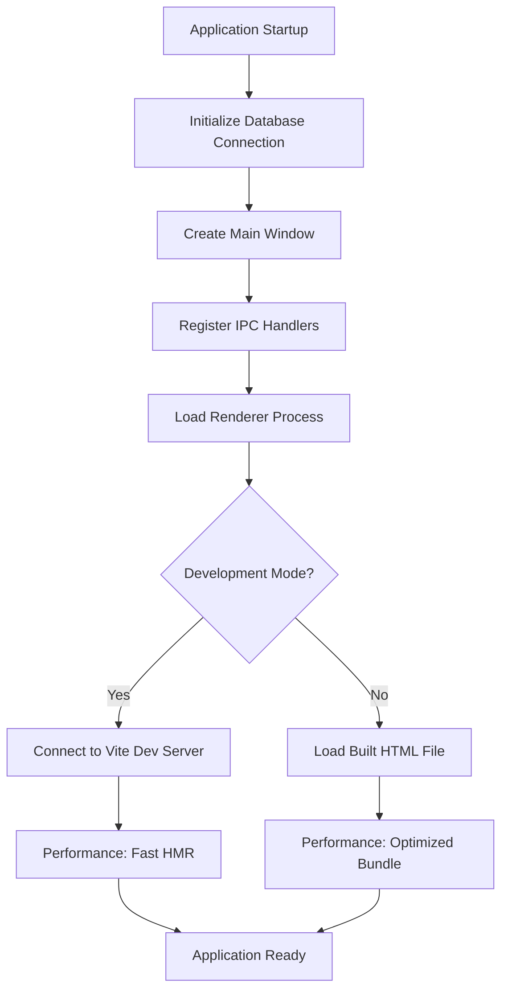
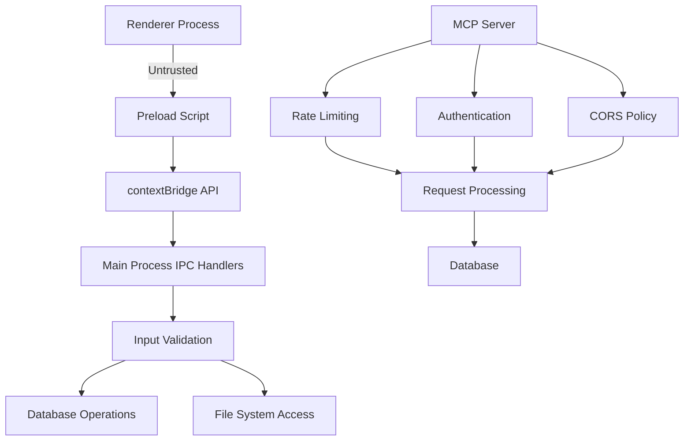
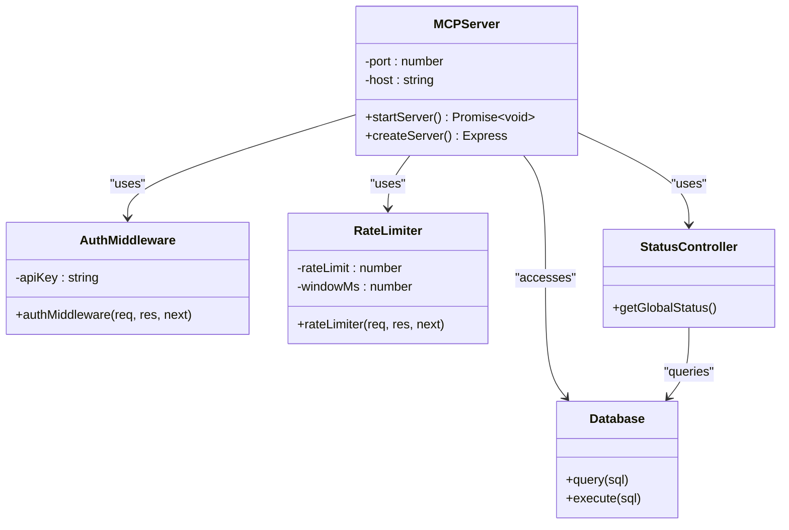
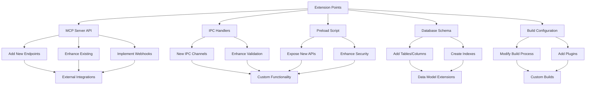

# Advanced Topics

<cite>
**Referenced Files in This Document**   
- [PERFORMANCE.md](file://AI/PERFORMANCE.md)
- [SECURITY.md](file://AI/SECURITY.md)
- [mcp.md](file://AI/mcp.md)
- [mcp-server.ts](file://src/server/mcp-server.ts)
- [init.ts](file://src/database/init.ts)
- [index.ts](file://src/main/index.ts)
- [index.ts](file://src/preload/index.ts)
- [auth.ts](file://src/server/middleware/auth.ts)
- [rateLimiter.ts](file://src/server/middleware/rateLimiter.ts)
- [mcpRepo.ts](file://src/database/mcpRepo.ts)
- [vite.config.ts](file://configs/vite.config.ts)
- [tsup.config.ts](file://configs/tsup.config.ts)
</cite>

## Table of Contents
1. [Performance Optimization](#performance-optimization)
2. [Security Considerations](#security-considerations)
3. [MCP Server Integration](#mcp-server-integration)
4. [Extension and Customization](#extension-and-customization)

## Performance Optimization

The LifeOS Electron application implements several performance optimization techniques to ensure a responsive user experience. The application targets a cold start time-to-interactive (TTI) of under 2 seconds on mid-tier hardware and maintains interaction latency below 100ms with a 60fps target for animations.

Key performance strategies include code-splitting of views and lazy-loading of heavy editors and previews to reduce initial bundle size. Long lists such as Kanban lanes and note lists are virtualized to minimize DOM overhead and memory consumption. React component re-renders are minimized through memoization of selectors and avoidance of unnecessary state updates.

For database operations, the application uses `better-sqlite3` which provides synchronous, high-performance SQLite access. Database writes are batched where possible to reduce I/O operations, and operations like search and autosave are debounced to prevent excessive processing. The database schema includes strategic indexes on frequently queried fields such as project position, task status, due dates, and activity timestamps to optimize query performance.

**Diagram sources**
- [init.ts](file://src/database/init.ts#L0-L143)
- [index.ts](file://src/main/index.ts#L0-L109)
- [vite.config.ts](file://configs/vite.config.ts#L0-L23)

**Section sources**
- [PERFORMANCE.md](file://AI/PERFORMANCE.md#L0-L18)
- [init.ts](file://src/database/init.ts#L0-L143)
- [index.ts](file://src/main/index.ts#L0-L109)

## Security Considerations

LifeOS implements a comprehensive security model for a desktop application with local data storage and network services. The threat model accounts for malicious content in notes/attachments, potential IPC misuse from the renderer process, unsanitized inputs reaching the database or filesystem, and supply-chain risks from dependencies.

The application follows Electron security best practices by disabling `nodeIntegration` and enabling `contextIsolation` in the main window configuration. A strict Content Security Policy prevents execution of inline scripts and use of `eval`. The preload script exposes only a minimal, validated API surface to the renderer process through `contextBridge`, limiting potential attack vectors.

All IPC communications are validated using schemas (Zod) and guard types to prevent malformed data from reaching critical functions. File paths are sanitized to prevent directory traversal attacks by rejecting user-provided segments containing `..`. Attachment size is limited, and MIME types are verified using magic bytes rather than file extensions.

For network services, the MCP server binds to `localhost` by default, restricting access to local processes. Optional API key authentication via the `X-API-Key` header can be configured for additional protection. Rate limiting middleware prevents abuse with a default limit of 100 requests per minute, and CORS configuration can restrict allowed origins.

**Diagram sources**
- [index.ts](file://src/main/index.ts#L0-L109)
- [index.ts](file://src/preload/index.ts#L0-L201)
- [auth.ts](file://src/server/middleware/auth.ts#L0-L26)
- [rateLimiter.ts](file://src/server/middleware/rateLimiter.ts#L0-L69)

**Section sources**
- [SECURITY.md](file://AI/SECURITY.md#L0-L21)
- [index.ts](file://src/main/index.ts#L0-L109)
- [index.ts](file://src/preload/index.ts#L0-L201)
- [auth.ts](file://src/server/middleware/auth.ts#L0-L26)

## MCP Server Integration

The MCP (Model Context Protocol) server provides a robust API integration point for the LifeOS application, enabling external tools and AI models to interact with core functionality. Implemented as a Node.js Express server, the MCP server exposes RESTful endpoints for all major application modules including tasks, projects, habits, notebooks, Q&A, and activities.

The server can operate in two modes: as a separate process (recommended) or integrated with the main Electron process via IPC. When running as a separate process, it shares the same SQLite database as the main application, enabling concurrent access while maintaining data consistency. The server is configured through environment variables including port, host, API key, and rate limiting parameters.

Key architectural components include modular routing with separate routers for each domain (tasks, projects, habits, etc.), standardized error handling with consistent JSON responses, and middleware for authentication, rate limiting, and request logging. The server implements comprehensive CRUD operations for all entities with proper validation and error handling.

The MCP server is automatically started when the Electron application launches if auto-start is enabled in the configuration. Configuration is stored in the `mcp_config` database table and can be updated dynamically through IPC calls. The server provides a health check endpoint and comprehensive status information through the `/api/status` endpoint.

**Diagram sources**
- [mcp-server.ts](file://src/server/mcp-server.ts#L0-L79)
- [mcp.md](file://AI/mcp.md#L0-L616)
- [mcpRepo.ts](file://src/database/mcpRepo.ts#L0-L58)
- [status.ts](file://src/server/routes/status.ts#L0-L7)

**Section sources**
- [mcp.md](file://AI/mcp.md#L0-L616)
- [mcp-server.ts](file://src/server/mcp-server.ts#L0-L79)
- [mcp.ts](file://src/main/ipc/mcp.ts#L0-L150)
- [mcpRepo.ts](file://src/database/mcpRepo.ts#L0-L58)

## Extension and Customization

LifeOS provides multiple extension points for customizing and extending the application beyond its current capabilities. The MCP server API serves as the primary integration mechanism, allowing external applications, scripts, and AI models to read and modify application data programmatically.

Developers can extend functionality through the MCP server by implementing new endpoints or enhancing existing ones. The modular architecture with separate controllers, services, and repositories for each domain makes it straightforward to add new features. Future enhancements could include WebSocket support for real-time updates, GraphQL endpoints for flexible querying, batch operations for efficiency, and webhooks for event-driven integrations.

The application's build system, configured through `tsup.config.ts` and `vite.config.ts`, supports customization of the compilation process. The Electron main process can be extended by adding new IPC handlers in the `src/main/ipc/` directory, while the renderer process can be enhanced with additional React components in the `src/renderer/components/` directory.

For advanced customization, developers can modify the database schema through migration scripts in the `init.ts` file or extend the type system in `src/common/types.ts`. The preload script configuration in `src/preload/index.ts` allows controlled exposure of additional Electron APIs to the renderer process while maintaining security boundaries.

**Diagram sources**
- [mcp.md](file://AI/mcp.md#L0-L616)
- [mcp-server.ts](file://src/server/mcp-server.ts#L0-L79)
- [index.ts](file://src/main/ipc/mcp.ts#L0-L150)
- [index.ts](file://src/preload/index.ts#L0-L201)
- [init.ts](file://src/database/init.ts#L0-L143)
- [tsup.config.ts](file://configs/tsup.config.ts#L0-L30)

**Section sources**
- [mcp.md](file://AI/mcp.md#L0-L616)
- [mcp-server.ts](file://src/server/mcp-server.ts#L0-L79)
- [index.ts](file://src/main/ipc/mcp.ts#L0-L150)
- [index.ts](file://src/preload/index.ts#L0-L201)
- [init.ts](file://src/database/init.ts#L0-L143)