# Extension Points

<cite>
**Referenced Files in This Document**   
- [mcp-server.ts](file://src/server/mcp-server.ts)
- [auth.ts](file://src/server/middleware/auth.ts)
- [rateLimiter.ts](file://src/server/middleware/rateLimiter.ts)
- [tasksController.ts](file://src/server/controllers/tasksController.ts)
- [habitsController.ts](file://src/server/controllers/habitsController.ts)
- [projectsController.ts](file://src/server/controllers/projectsController.ts)
- [notebooksController.ts](file://src/server/controllers/notebooksController.ts)
- [notesController.ts](file://src/server/controllers/notesController.ts)
- [qaController.ts](file://src/server/controllers/qaController.ts)
- [activitiesController.ts](file://src/server/controllers/activitiesController.ts)
- [settingsController.ts](file://src/server/controllers/settingsController.ts)
- [statusController.ts](file://src/server/controllers/statusController.ts)
- [tasks.ts](file://src/server/routes/tasks.ts)
- [habits.ts](file://src/server/routes/habits.ts)
- [projects.ts](file://src/server/routes/projects.ts)
- [notebooks.ts](file://src/server/routes/notebooks.ts)
- [notes.ts](file://src/server/routes/notes.ts)
- [qa.ts](file://src/server/routes/qa.ts)
- [activities.ts](file://src/server/routes/activities.ts)
- [settings.ts](file://src/server/routes/settings.ts)
- [status.ts](file://src/server/routes/status.ts)
- [tasksRepo.ts](file://src/database/tasksRepo.ts)
- [habitsRepo.ts](file://src/database/habitsRepo.ts)
- [types.ts](file://src/common/types.ts)
- [mcp.md](file://AI/mcp.md)
- [mcp.ts](file://src/main/ipc/mcp.ts)
</cite>

## Table of Contents
1. [Introduction](#introduction)
2. [API Overview](#api-overview)
3. [Authentication and Security](#authentication-and-security)
4. [Rate Limiting](#rate-limiting)
5. [CORS Configuration](#cors-configuration)
6. [Error Handling](#error-handling)
7. [Module Endpoints](#module-endpoints)
8. [Global Status Endpoint](#global-status-endpoint)
9. [Usage Examples](#usage-examples)
10. [Configuration](#configuration)
11. [Integration with Electron App](#integration-with-electron-app)
12. [Future Enhancements](#future-enhancements)
13. [Security Considerations](#security-considerations)

## Introduction

The MCP Server extension point provides a RESTful HTTP API interface to expose LifeOS functionality for integration with AI models and external tools. The server runs on port 3000 by default (configurable) and provides comprehensive endpoints for all core modules including Tasks, Projects, Habits, Notebooks, Notes, Q&A, Activities, and Settings. This documentation details the API design, endpoints, authentication strategy, and implementation details.

**Section sources**
- [mcp-server.ts](file://src/server/mcp-server.ts#L1-L80)
- [mcp.md](file://AI/mcp.md#L354-L390)

## API Overview

The MCP Server implements a RESTful API design with JSON endpoints organized by module. All endpoints follow a consistent pattern with standardized request and response formats. The server is built using Express.js and provides clean, predictable routes for all LifeOS functionality.

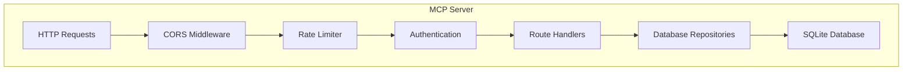

**Diagram sources**
- [mcp-server.ts](file://src/server/mcp-server.ts#L1-L80)
- [auth.ts](file://src/server/middleware/auth.ts#L1-L25)
- [rateLimiter.ts](file://src/server/middleware/rateLimiter.ts#L1-L69)

**Section sources**
- [mcp-server.ts](file://src/server/mcp-server.ts#L1-L80)
- [README.md](file://src/server/README.md#L1-L292)

## Authentication and Security

The MCP Server implements a flexible authentication strategy with optional API key protection. By default, the server binds to localhost for security, and API key authentication is enforced when configured.

### Authentication Strategy

The server uses middleware to handle authentication for all endpoints except the health check:

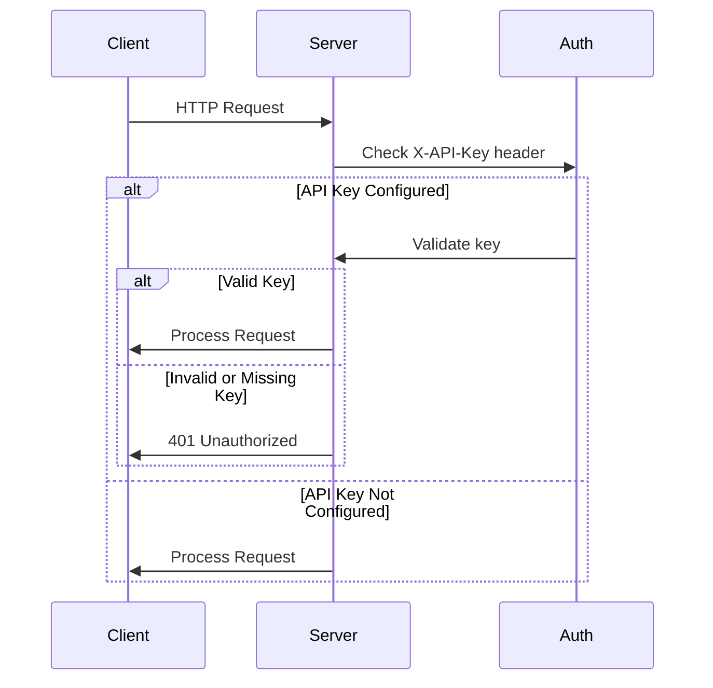

**Diagram sources**
- [auth.ts](file://src/server/middleware/auth.ts#L1-L25)
- [mcp-server.ts](file://src/server/mcp-server.ts#L1-L80)

**Section sources**
- [auth.ts](file://src/server/middleware/auth.ts#L1-L25)
- [mcp.md](file://AI/mcp.md#L354-L390)

## Rate Limiting

The MCP Server implements rate limiting to prevent abuse and ensure system stability. The default limit is 100 requests per minute per IP address, which is configurable via environment variables.

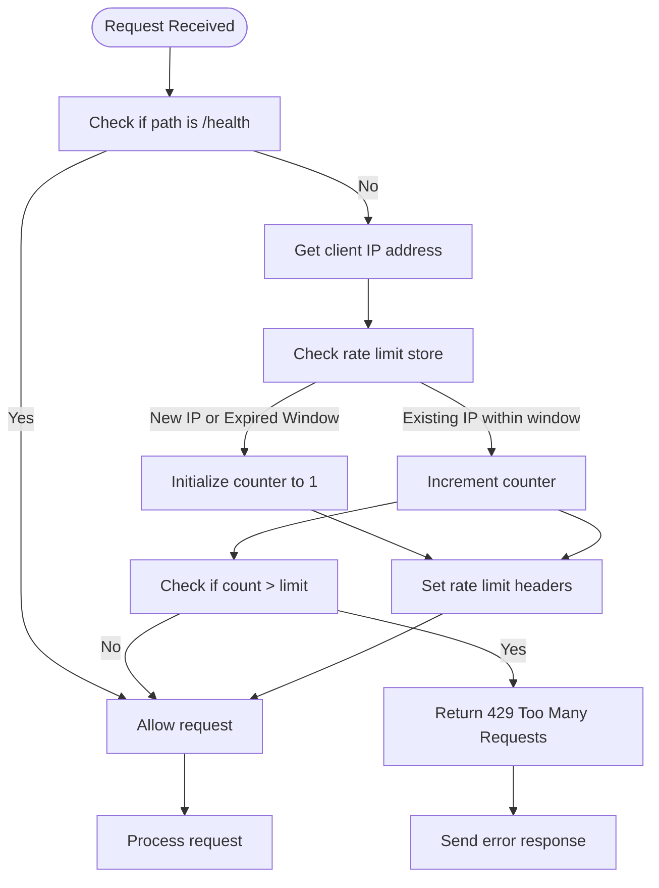

**Diagram sources**
- [rateLimiter.ts](file://src/server/middleware/rateLimiter.ts#L1-L69)

**Section sources**
- [rateLimiter.ts](file://src/server/middleware/rateLimiter.ts#L1-L69)

## CORS Configuration

The MCP Server includes CORS middleware to control cross-origin resource sharing. The allowed origins are configurable via environment variables, with a default setting of '*' (allow all origins).

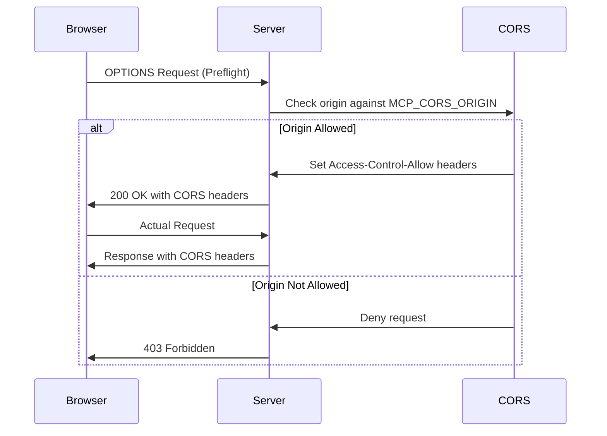

**Diagram sources**
- [mcp-server.ts](file://src/server/mcp-server.ts#L1-L80)

## Error Handling

The MCP Server implements standardized error responses with consistent formatting across all endpoints. Errors are handled by a dedicated middleware that formats responses according to a predefined schema.

### Error Response Format

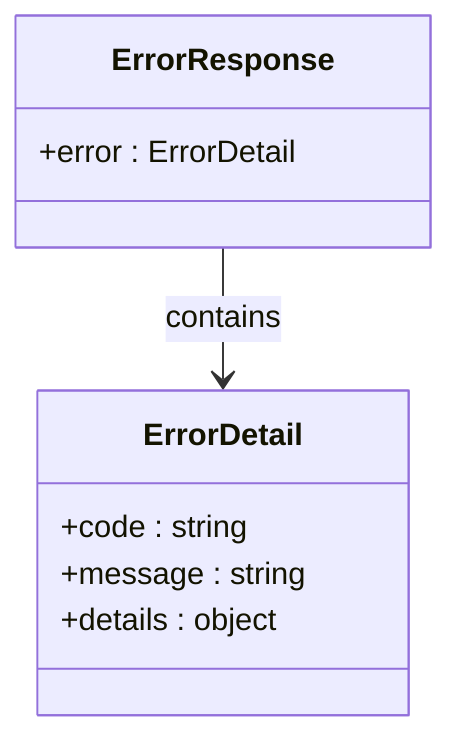

**Diagram sources**
- [errorHandler.ts](file://src/server/middleware/errorHandler.ts#L1-L70)

**Section sources**
- [errorHandler.ts](file://src/server/middleware/errorHandler.ts#L1-L70)
- [mcp.md](file://AI/mcp.md#L354-L390)

## Module Endpoints

The MCP Server exposes RESTful endpoints for all core LifeOS modules. Each module follows a consistent pattern with standardized HTTP methods and URL structures.

### Tasks Module

The Tasks module provides endpoints for managing tasks within projects.

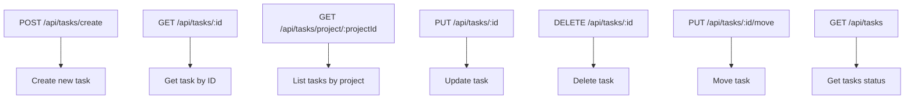

**Diagram sources**
- [tasks.ts](file://src/server/routes/tasks.ts#L1-L25)
- [tasksController.ts](file://src/server/controllers/tasksController.ts#L1-L139)

**Section sources**
- [tasks.ts](file://src/server/routes/tasks.ts#L1-L25)
- [tasksController.ts](file://src/server/controllers/tasksController.ts#L1-L139)
- [tasksRepo.ts](file://src/database/tasksRepo.ts#L1-L199)

### Habits Module

The Habits module provides endpoints for managing habit tracking and completion logging.

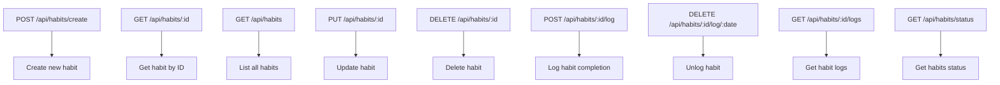

**Diagram sources**
- [habits.ts](file://src/server/routes/habits.ts#L1-L31)
- [habitsController.ts](file://src/server/controllers/habitsController.ts#L1-L131)

**Section sources**
- [habits.ts](file://src/server/routes/habits.ts#L1-L31)
- [habitsController.ts](file://src/server/controllers/habitsController.ts#L1-L131)
- [habitsRepo.ts](file://src/database/habitsRepo.ts#L1-L199)

### Projects Module

The Projects module provides endpoints for managing projects and their organization.

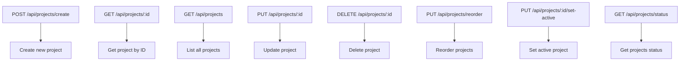

**Section sources**
- [projects.ts](file://src/server/routes/projects.ts)
- [projectsController.ts](file://src/server/controllers/projectsController.ts)

### Notebooks Module

The Notebooks module provides endpoints for managing notebooks and their organization.

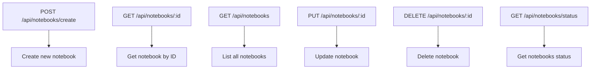

**Section sources**
- [notebooks.ts](file://src/server/routes/notebooks.ts)
- [notebooksController.ts](file://src/server/controllers/notebooksController.ts)

### Notes Module

The Notes module provides endpoints for managing individual notes within notebooks.

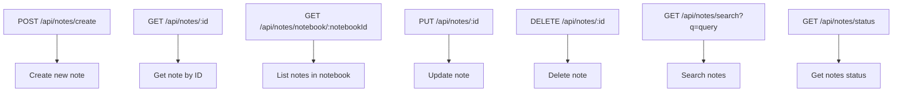

**Section sources**
- [notes.ts](file://src/server/routes/notes.ts)
- [notesController.ts](file://src/server/controllers/notesController.ts)

### Q&A Module

The Q&A module provides endpoints for managing question and answer collections.

```mermaid
flowchart TD
A[POST /api/qa/collections/create] --> B[Create collection]
C[GET /api/qa/collections/:id] --> D[Get collection]
E[GET /api/qa/collections] --> F[List collections]
G[PUT /api/qa/collections/:id] --> H[Update collection]
I[DELETE /api/qa/collections/:id] --> J[Delete collection]
K[POST /api/qa/questions/create] --> L[Create question]
M[GET /api/qa/questions/:id] --> N[Get question]
O[GET /api/qa/questions?collectionId=X] --> P[List questions]
Q[PUT /api/qa/questions/:id] --> R[Update question]
S[DELETE /api/qa/questions/:id] --> T[Delete question]
U[POST /api/qa/answers/create] --> V[Create answer]
W[GET /api/qa/answers/:questionId] --> X[Get answers]
Y[PUT /api/qa/answers/:id] --> Z[Update answer]
AA[DELETE /api/qa/answers/:id] --> AB[Delete answer]
AC[GET /api/qa/status] --> AD[Get Q&A status]
```

**Section sources**
- [qa.ts](file://src/server/routes/qa.ts)
- [qaController.ts](file://src/server/controllers/qaController.ts)

### Activities Module

The Activities module provides endpoints for retrieving activity data and statistics.

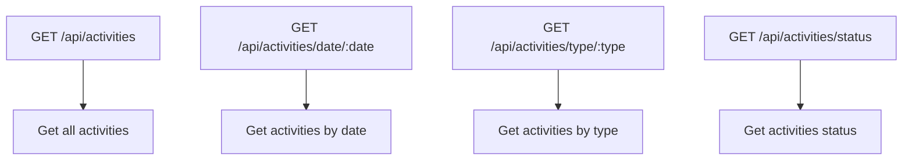

**Section sources**
- [activities.ts](file://src/server/routes/activities.ts)
- [activitiesController.ts](file://src/server/controllers/activitiesController.ts)

### Settings Module

The Settings module provides endpoints for managing application settings.

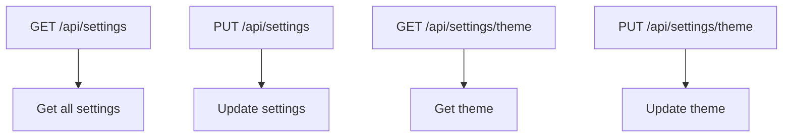

**Section sources**
- [settings.ts](file://src/server/routes/settings.ts)
- [settingsController.ts](file://src/server/controllers/settingsController.ts)

## Global Status Endpoint

The global status endpoint provides comprehensive system health information and module statistics, serving as a central monitoring point for the entire system.

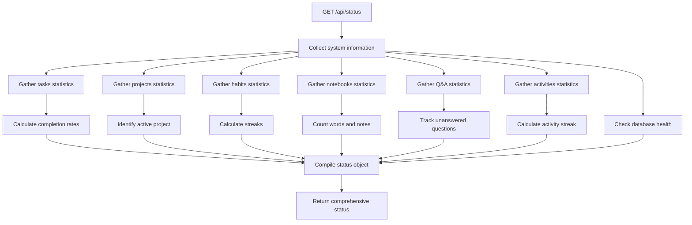

**Diagram sources**
- [status.ts](file://src/server/routes/status.ts#L1-L7)
- [statusController.ts](file://src/server/controllers/statusController.ts#L1-L150)

**Section sources**
- [status.ts](file://src/server/routes/status.ts#L1-L7)
- [statusController.ts](file://src/server/controllers/statusController.ts#L1-L150)

## Usage Examples

This section provides practical examples of using the MCP Server API for common operations.

### Create a Task

```bash
curl -X POST http://localhost:3000/api/tasks/create \
  -H "Content-Type: application/json" \
  -H "X-API-Key: your_key" \
  -d '{
    "projectId": 1,
    "title": "Implement feature X",
    "description": "Complete implementation",
    "status": "To-Do",
    "estimatedMinutes": 120
  }'
```

**Section sources**
- [tasksController.ts](file://src/server/controllers/tasksController.ts#L1-L139)
- [tasksRepo.ts](file://src/database/tasksRepo.ts#L1-L199)

### Log a Habit

```bash
curl -X POST http://localhost:3000/api/habits/1/log \
  -H "Content-Type: application/json" \
  -H "X-API-Key: your_key" \
  -d '{
    "loggedDate": "2024-10-27",
    "count": 1,
    "note": "Completed successfully"
  }'
```

**Section sources**
- [habitsController.ts](file://src/server/controllers/habitsController.ts#L1-L131)
- [habitsRepo.ts](file://src/database/habitsRepo.ts#L1-L199)

### Retrieve Project Status

```bash
curl http://localhost:3000/api/projects/status \
  -H "X-API-Key: your_key"
```

**Section sources**
- [projectsController.ts](file://src/server/controllers/projectsController.ts)
- [projectsRepo.ts](file://src/database/projectsRepo.ts)

## Configuration

The MCP Server can be configured through environment variables, allowing customization of key parameters without code changes.

### Environment Variables

| Variable | Default | Description |
|--------|--------|-------------|
| MCP_SERVER_PORT | 3000 | Server port |
| MCP_SERVER_HOST | localhost | Server host |
| MCP_API_KEY | (none) | Optional API key for authentication |
| MCP_RATE_LIMIT | 100 | Requests per minute limit |
| MCP_LOG_LEVEL | info | Logging verbosity |
| MCP_CORS_ORIGIN | * | Allowed CORS origins |

**Section sources**
- [mcp-server.ts](file://src/server/mcp-server.ts#L1-L80)
- [README.md](file://src/server/README.md#L1-L292)

## Integration with Electron App

The MCP Server can be integrated with the Electron application, allowing both to run simultaneously and communicate through IPC.

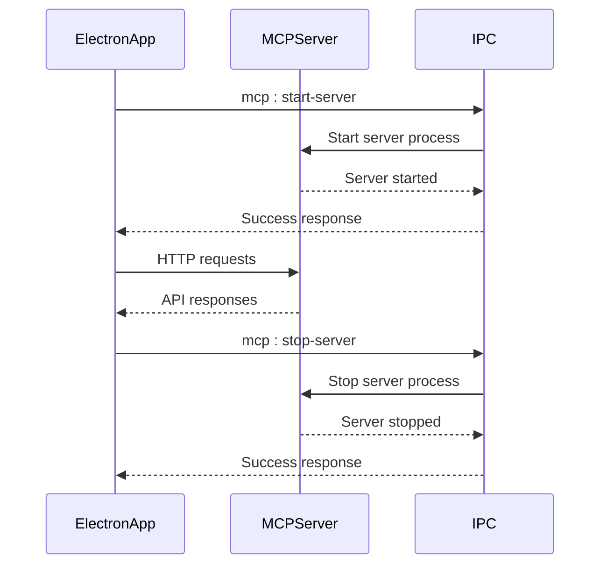

**Diagram sources**
- [mcp.ts](file://src/main/ipc/mcp.ts#L1-L150)

**Section sources**
- [mcp.ts](file://src/main/ipc/mcp.ts#L1-L150)

## Future Enhancements

The MCP Server architecture is designed to support future enhancements that will expand its capabilities and integration options.

### Planned Features

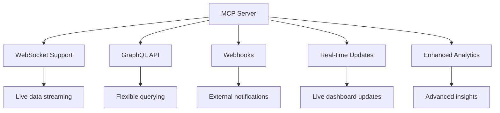

## Security Considerations

The MCP Server implements multiple security measures to protect data and prevent abuse.

### Security Architecture

```mermaid
graph TD
A[Client Request] --> B[Network Level]
B --> C[localhost binding]
A --> D[Transport Level]
D --> E[HTTPS (future)]
A --> F[Application Level]
F --> G[API Key Authentication]
F --> H[Rate Limiting]
F --> I[CORS Protection]
F --> J[Input Validation]
F --> K[SQL Injection Prevention]
G --> L[Secure headers]
H --> M[Request tracking]
I --> N[Origin validation]
J --> O[Zod schemas]
K --> P[Parameterized queries]
```

**Section sources**
- [auth.ts](file://src/server/middleware/auth.ts#L1-L25)
- [rateLimiter.ts](file://src/server/middleware/rateLimiter.ts#L1-L69)
- [tasksRepo.ts](file://src/database/tasksRepo.ts#L1-L199)
- [mcp.md](file://AI/mcp.md#L354-L390)