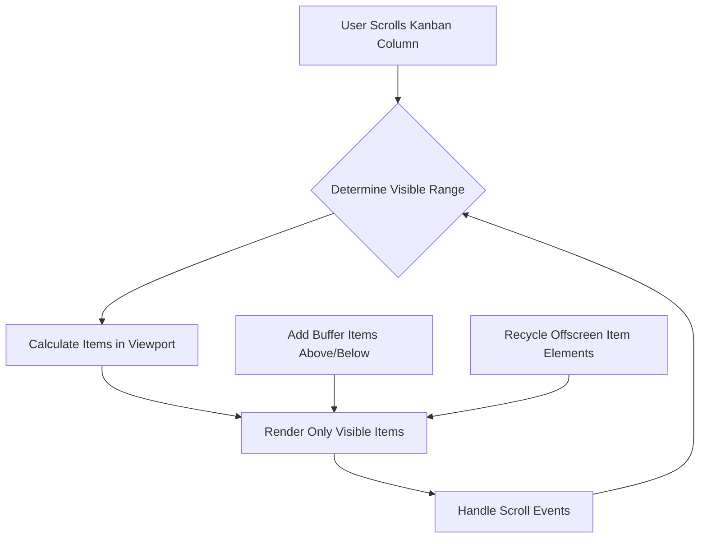
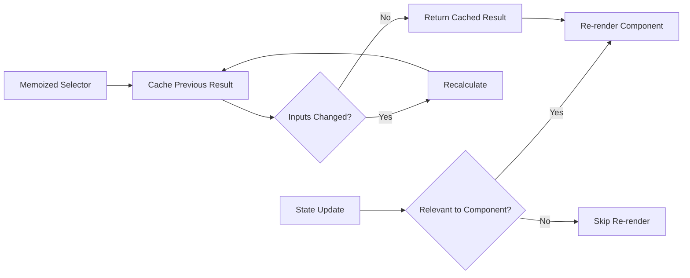
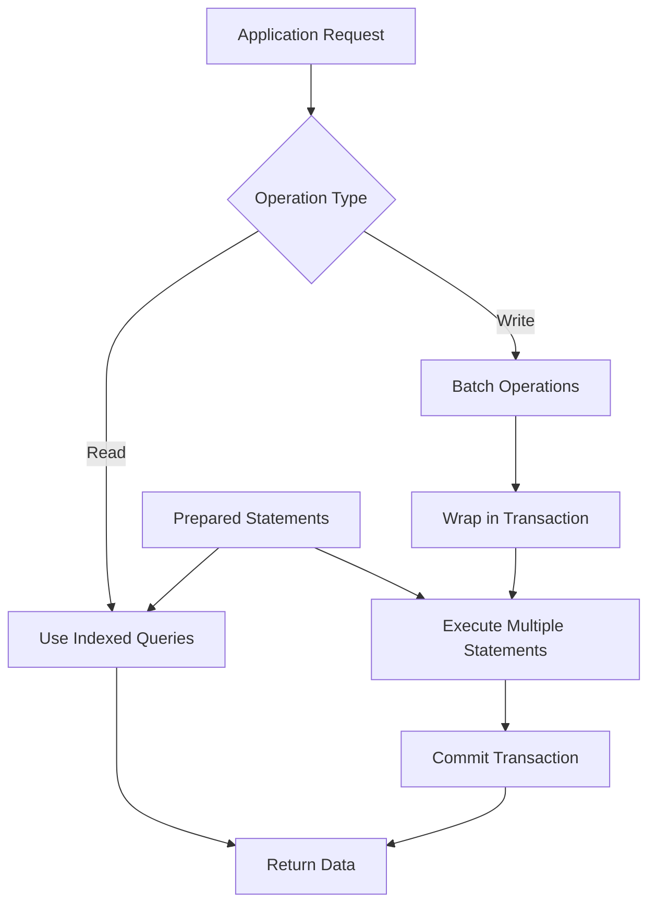
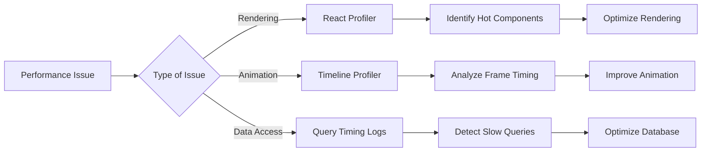

# Performance Optimization

<cite>
**Referenced Files in This Document**   
- [PERFORMANCE.md](file://AI/PERFORMANCE.md)
- [KanbanColumn.tsx](file://src/renderer/components/KanbanColumn.tsx)
- [KanbanPage.tsx](file://src/renderer/pages/KanbanPage.tsx)
- [init.ts](file://src/database/init.ts)
- [tasks.ts](file://src/store/tasks.ts)
- [App.tsx](file://src/renderer/App.tsx)
- [Dashboard.tsx](file://src/renderer/pages/Dashboard.tsx)
</cite>

## Table of Contents
1. [Performance Budgets](#performance-budgets)
2. [Core Optimization Strategies](#core-optimization-strategies)
3. [Code Splitting and Lazy Loading](#code-splitting-and-lazy-loading)
4. [List Virtualization](#list-virtualization)
5. [State Management and Memoization](#state-management-and-memoization)
6. [Database Performance](#database-performance)
7. [Debouncing and Throttling](#debouncing-and-throttling)
8. [Performance Profiling](#performance-profiling)
9. [Common Performance Issues](#common-performance-issues)
10. [Conclusion](#conclusion)

## Performance Budgets

The LifeOS application adheres to strict performance budgets to ensure a responsive and smooth user experience across mid-tier hardware. These budgets serve as measurable targets for development and optimization efforts.

The primary performance metrics are:
- **Cold start Time to Interactive (TTI) under 2 seconds**: This ensures that users can begin interacting with the application quickly after launch, minimizing wait times and improving perceived performance.
- **Interaction latency under 100ms**: This target ensures that user interactions feel instantaneous, maintaining a 60fps frame rate for animations and smooth UI responsiveness.

These budgets are monitored through continuous profiling and are considered critical success factors for the application's usability and user satisfaction.

**Section sources**
- [PERFORMANCE.md](file://AI/PERFORMANCE.md#L3-L6)

## Core Optimization Strategies

LifeOS employs a comprehensive set of optimization strategies to meet its performance budgets and deliver a responsive user experience. These strategies address performance at multiple levels of the application architecture, from UI rendering to database operations.

The optimization approach follows a holistic philosophy that balances immediate performance gains with long-term maintainability. Key strategic pillars include:
- Minimizing initial bundle size through code splitting
- Optimizing rendering performance through virtualization and memoization
- Enhancing data access speed with efficient database operations
- Reducing unnecessary computations through debouncing and throttling
- Implementing proactive performance monitoring and profiling

These strategies work in concert to create a performant application that can handle large datasets and complex user interactions without compromising responsiveness.

**Section sources**
- [PERFORMANCE.md](file://AI/PERFORMANCE.md#L8-L11)

## Code Splitting and Lazy Loading

LifeOS implements code splitting and lazy loading to optimize the initial load time and reduce the memory footprint of the application. This strategy ensures that only the necessary code is loaded when required, improving the cold start TTI metric.

The application architecture is organized into distinct feature modules (Dashboard, Kanban, Notebook, Habits, QA, Settings) that can be loaded on demand. When a user navigates to a specific feature, only the code required for that feature is loaded, rather than loading the entire application bundle upfront.

This approach is implemented using React's lazy loading capabilities combined with React Router for route-based code splitting. The main application entry point loads only the core framework and navigation components initially, with feature-specific code dynamically imported when the corresponding route is accessed.

**Section sources**
- [App.tsx](file://src/renderer/App.tsx#L100-L130)

## List Virtualization

To maintain smooth scrolling and interaction performance with potentially large datasets, LifeOS implements virtualization for long lists in key components such as Kanban lanes and note lists. This optimization renders only the items currently visible in the viewport, dramatically reducing the number of DOM nodes and React components that need to be managed.

The Kanban board implementation in `KanbanColumn.tsx` demonstrates this approach, where task cards are rendered only for tasks that are currently visible. As users scroll through a column with many tasks, the component dynamically updates which task cards are rendered based on the scroll position.

This virtualization strategy significantly reduces memory usage and improves rendering performance, especially when dealing with hundreds of tasks across multiple projects. It ensures that interaction latency remains under 100ms even with large datasets, as the browser only needs to manage a small subset of the total items at any given time.

**Diagram sources**
- [KanbanColumn.tsx](file://src/renderer/components/KanbanColumn.tsx#L50-L80)
- [KanbanPage.tsx](file://src/renderer/pages/KanbanPage.tsx#L300-L350)

**Section sources**
- [KanbanColumn.tsx](file://src/renderer/components/KanbanColumn.tsx#L1-L103)
- [KanbanPage.tsx](file://src/renderer/pages/KanbanPage.tsx#L1-L520)

## State Management and Memoization

LifeOS employs a sophisticated state management strategy using Zustand to optimize rendering performance and prevent unnecessary re-renders. The application leverages memoization extensively to ensure that components only update when their specific data dependencies change.

The store architecture is designed with performance in mind, using selector functions to derive specific data slices rather than passing entire state objects to components. This approach, combined with React's `useMemo` and `useCallback` hooks, minimizes the computational overhead of state updates.

In the Kanban implementation, the `filteredTasks` variable is memoized using `React.useMemo` to prevent recalculation on every render. This is particularly important when applying filters like hiding old completed tasks, as the filtering operation can be computationally expensive with large datasets.

**Diagram sources**
- [tasks.ts](file://src/store/tasks.ts#L1-L132)
- [KanbanPage.tsx](file://src/renderer/pages/KanbanPage.tsx#L40-L50)

**Section sources**
- [tasks.ts](file://src/store/tasks.ts#L1-L132)
- [KanbanPage.tsx](file://src/renderer/pages/KanbanPage.tsx#L40-L50)

## Database Performance

LifeOS prioritizes database performance through the use of `better-sqlite3`, a synchronous SQLite wrapper that provides fast, direct database access. This choice enables efficient data operations while maintaining data consistency and integrity.

The database initialization in `init.ts` demonstrates several performance-oriented practices:
- Database operations are batched where possible to minimize I/O overhead
- Indexes are created on frequently queried columns to accelerate data retrieval
- Transactions are used to group related operations, ensuring atomicity and improving performance

The synchronous nature of `better-sqlite3` eliminates the overhead of asynchronous callbacks and promise chains, resulting in faster execution of database operations. This is particularly beneficial for operations that require multiple sequential queries, as there is no context switching between the JavaScript event loop and database operations.

Additionally, the database schema includes carefully designed indexes on key columns such as `tasks.project_id`, `tasks.status`, and `activities.created_at`, which significantly accelerate common query patterns used throughout the application.

**Diagram sources**
- [init.ts](file://src/database/init.ts#L1-L143)
- [database.ts](file://src/main/ipc/database.ts#L1-L54)

**Section sources**
- [init.ts](file://src/database/init.ts#L1-L143)

## Debouncing and Throttling

LifeOS implements debouncing for search and autosave operations to optimize performance and reduce unnecessary system load. This technique prevents excessive function calls during rapid user interactions, ensuring that resource-intensive operations are executed at appropriate intervals.

For search functionality, input is debounced to avoid triggering search queries on every keystroke. Instead, the search operation is delayed until the user has paused typing for a specified duration, typically 300-500 milliseconds. This prevents the application from performing expensive search operations on incomplete or rapidly changing search terms.

Similarly, the autosave feature for notes and tasks uses debouncing to batch save operations. Rather than saving immediately on every change, the application waits for a brief period of inactivity before persisting changes to the database. This reduces the number of write operations and prevents excessive disk I/O, while still ensuring that user data is saved promptly.

These debouncing strategies strike a balance between responsiveness and efficiency, ensuring that the application remains reactive to user input while avoiding unnecessary computational overhead.

**Section sources**
- [PERFORMANCE.md](file://AI/PERFORMANCE.md#L11-L12)
- [NotebookPage.tsx](file://src/renderer/pages/NotebookPage.tsx#L124-L174)

## Performance Profiling

LifeOS incorporates comprehensive performance profiling tools and techniques to identify and address performance bottlenecks. The development team uses a combination of specialized tools to monitor different aspects of application performance.

The React Profiler is used to identify renderer hotspots and understand component rendering patterns. This tool helps developers identify components that are re-rendering unnecessarily or taking excessive time to render, allowing for targeted optimization.

For drag-and-drop interactions and animations, the Timeline profiler is used to analyze performance and ensure smooth 60fps rendering. This is particularly important for the Kanban board's drag-and-drop functionality, where smooth animations enhance the user experience.

Database operations are monitored through query timing logs, which capture the execution time of database operations. This allows developers to identify slow queries and optimize database access patterns. The logs help ensure that database operations meet the sub-100ms latency target, contributing to the overall responsiveness of the application.

**Diagram sources**
- [PERFORMANCE.md](file://AI/PERFORMANCE.md#L13-L18)
- [KanbanPage.tsx](file://src/renderer/pages/KanbanPage.tsx#L200-L300)

**Section sources**
- [PERFORMANCE.md](file://AI/PERFORMANCE.md#L13-L18)

## Common Performance Issues

Despite the comprehensive optimization strategies, certain performance issues may still arise in the LifeOS application. Understanding these common issues and their solutions is essential for maintaining optimal performance.

One potential issue is memory leaks in event listeners, particularly in components that handle drag-and-drop operations or window events. These can occur when event listeners are not properly cleaned up when components are unmounted. The solution is to ensure that all event listeners are removed in cleanup functions, typically using the `return` function in React's `useEffect` hook.

Inefficient state updates can also impact performance, particularly when large state objects are updated frequently. This can trigger unnecessary re-renders across multiple components. The solution is to use granular state management, updating only the specific parts of the state that have changed, and leveraging memoization to prevent unnecessary re-renders.

Another common issue is the over-fetching of data, where components request more data than they need to render. This can be addressed by implementing data fetching strategies that retrieve only the necessary data, using GraphQL-like field selection or API endpoints that support partial responses.

**Section sources**
- [App.tsx](file://src/renderer/App.tsx#L150-L175)
- [Dashboard.tsx](file://src/renderer/pages/Dashboard.tsx#L50-L100)

## Conclusion

The LifeOS application demonstrates a comprehensive approach to performance optimization, addressing responsiveness and efficiency across all layers of the application architecture. By adhering to strict performance budgets and implementing a range of optimization strategies, the application delivers a smooth and responsive user experience even with large datasets.

The combination of code splitting, list virtualization, efficient state management, optimized database operations, and strategic debouncing creates a performant foundation that scales well with increasing data volume and user interactions. Continuous profiling and monitoring ensure that performance remains a priority throughout the development lifecycle.

These optimization efforts collectively contribute to meeting the cold start TTI under 2 seconds and interaction latency under 100ms budgets, resulting in an application that feels fast and responsive to users. As the application evolves, these performance principles will continue to guide development decisions and ensure that LifeOS remains a high-performing productivity tool.