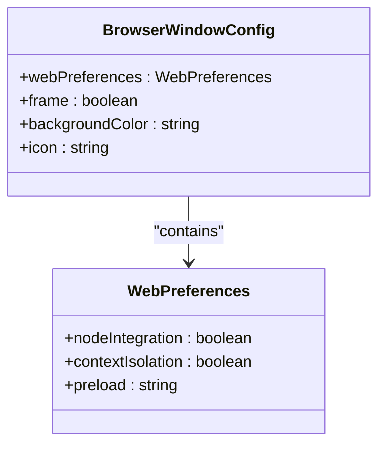
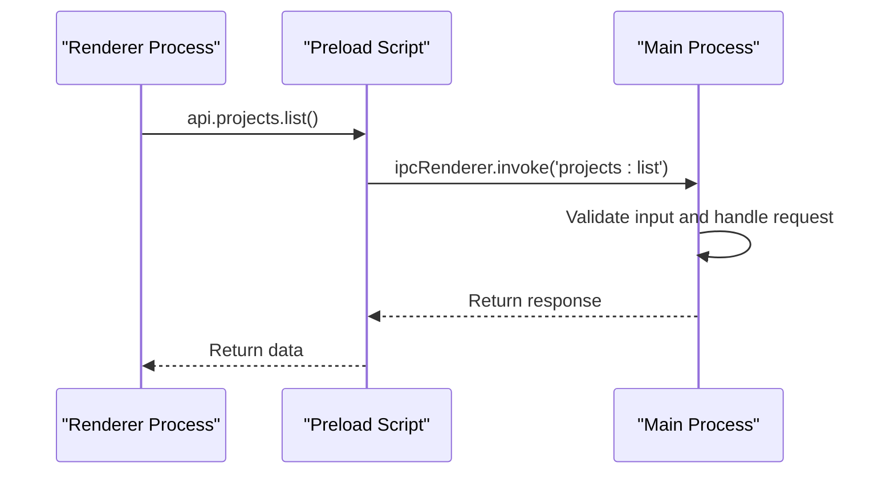
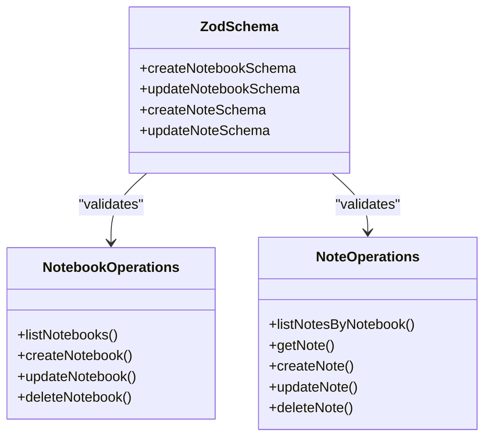
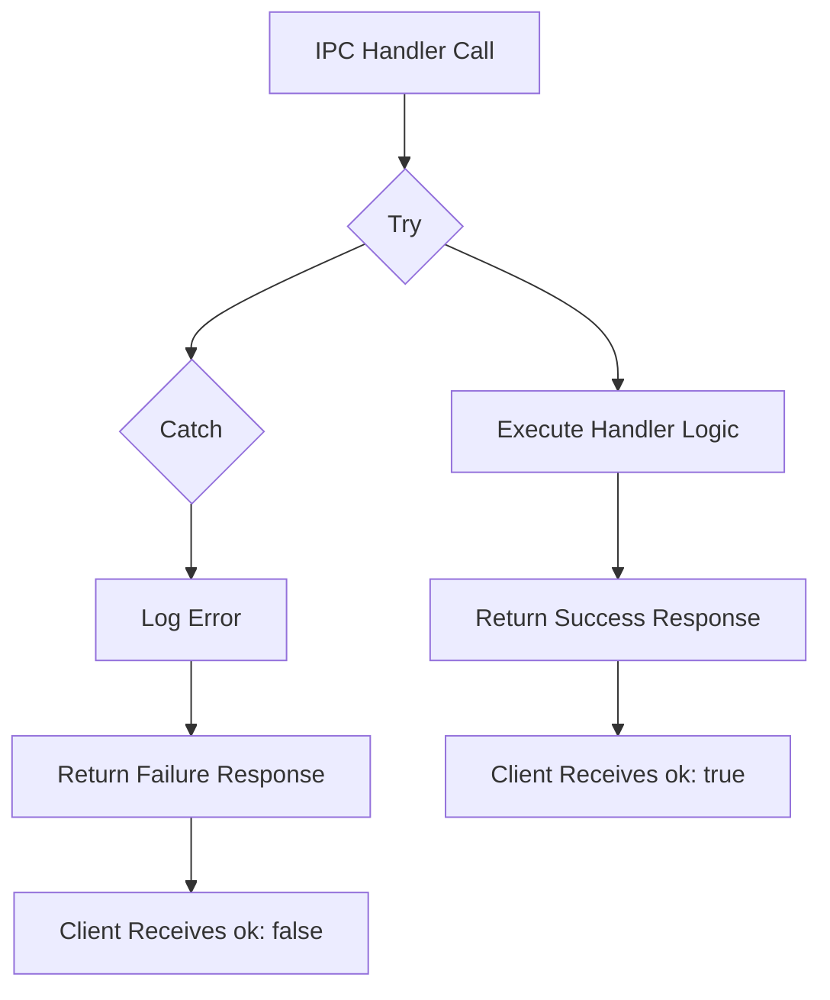
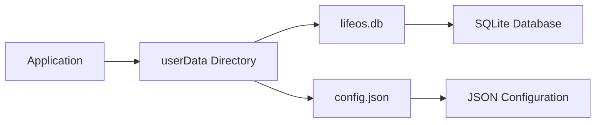
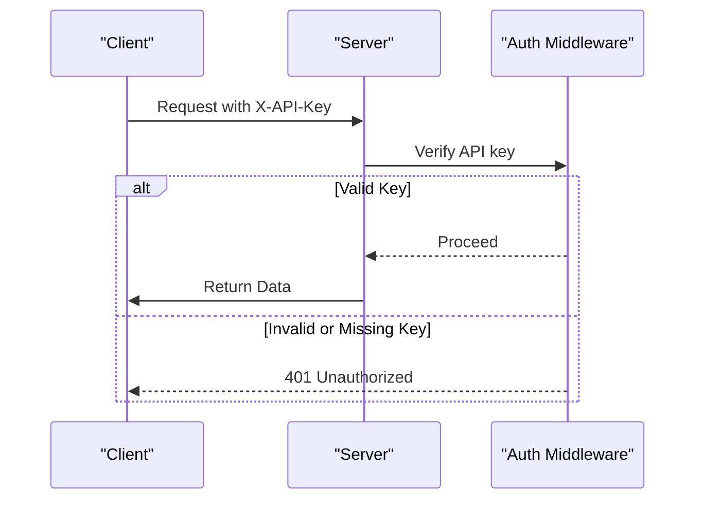
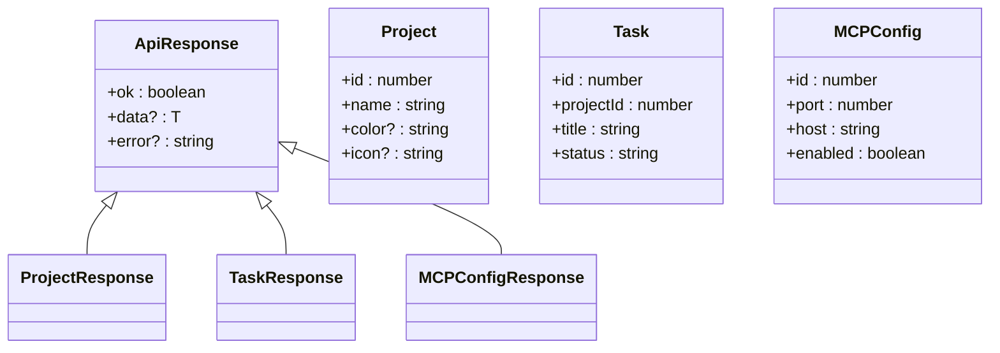

# Security Considerations

<cite>
**Referenced Files in This Document**   
- [SECURITY.md](file://AI/SECURITY.md)
- [index.ts](file://src/main/index.ts)
- [index.ts](file://src/preload/index.ts)
- [auth.ts](file://src/server/middleware/auth.ts)
- [notebookRepo.ts](file://src/database/notebookRepo.ts)
- [init.ts](file://src/database/init.ts)
- [response.ts](file://src/main/utils/response.ts)
- [types.ts](file://src/common/types.ts)
- [package.json](file://package.json)
</cite>

## Table of Contents
1. [Threat Model](#threat-model)
2. [Hardening Measures](#hardening-measures)
3. [Sensitive Data Handling](#sensitive-data-handling)
4. [Dependency Security](#dependency-security)
5. [Secure Development Practices](#secure-development-practices)

## Threat Model

The LifeOS desktop application faces several security threats that must be addressed through architectural design and implementation practices. The primary threat vectors include:

- **Malicious content in notes and attachments**: Users may input or upload content containing scripts or other executable code that could be rendered or processed in unsafe ways.
- **IPC misuse from renderer**: The renderer process could attempt to invoke IPC handlers with invalid or malicious parameters, potentially leading to data corruption or unauthorized operations.
- **Unsanitized inputs reaching database or filesystem**: User-provided data could contain injection attacks or path traversal attempts if not properly validated before storage or file operations.
- **Supply-chain vulnerabilities**: Third-party dependencies could contain security flaws or malicious code that compromise the application's integrity.

These threats are mitigated through a defense-in-depth approach that combines Electron security best practices, input validation, and secure coding patterns.

**Section sources**
- [SECURITY.md](file://AI/SECURITY.md#L3-L10)

## Hardening Measures

LifeOS implements multiple security hardening measures to protect against the identified threat model. These measures follow Electron security recommendations and secure application development principles.

### Electron Security Configuration

The application disables dangerous Electron features and enables protective mechanisms in the main process window configuration:



**Diagram sources**
- [index.ts](file://src/main/index.ts#L45-L55)

The `nodeIntegration` is explicitly disabled to prevent the renderer process from accessing Node.js APIs directly, while `contextIsolation` is enabled to ensure that the preload script and the web content run in separate JavaScript contexts. This prevents potential prototype pollution attacks and ensures that the preload APIs are securely exposed.

### Content Security Policy

Although not explicitly defined in the provided code, the application follows the principle of strict Content Security Policy (CSP) by avoiding inline scripts and `eval()` usage. The renderer process loads content through Vite in development and static files in production, minimizing the risk of XSS attacks.

### Preload Script Security

The preload script exposes a minimal, validated API surface to the renderer process using Electron's `contextBridge`. This approach follows the principle of least privilege:



**Diagram sources**
- [index.ts](file://src/preload/index.ts#L1-L201)
- [index.ts](file://src/main/index.ts#L53)

The preload script exposes only necessary APIs through well-defined interfaces, with all IPC communication properly typed and structured. This prevents arbitrary code execution from the renderer process.

### Input Validation with Zod

All IPC handlers validate incoming data using Zod schemas, providing runtime type checking and input sanitization. For example, the notebook functionality implements comprehensive validation:



**Diagram sources**
- [notebookRepo.ts](file://src/database/notebookRepo.ts#L20-L50)

The Zod schemas enforce constraints such as minimum and maximum string lengths, required fields, and data types, preventing malformed or malicious data from being processed.

### IPC Error Handling

All IPC handlers use a consistent error handling wrapper that prevents unhandled exceptions from crashing the application and provides structured error responses:



**Diagram sources**
- [response.ts](file://src/main/utils/response.ts#L1-L25)

The `wrapIpc` utility function ensures that all IPC handlers return a consistent `ApiResponse` structure, with errors properly caught and formatted without exposing sensitive stack traces to the client.

### File Path Sanitization

While specific path sanitization code is not visible in the provided files, the security documentation explicitly mentions protection against directory traversal attacks. The application likely implements path validation when handling file operations to prevent access to locations outside permitted directories.

### Attachment Security

The application implements controls for file attachments, including size limitations and MIME type verification through magic bytes analysis. This prevents denial-of-service attacks from excessively large files and ensures that file types match their declared content, mitigating the risk of disguised malicious files.

**Section sources**
- [SECURITY.md](file://AI/SECURITY.md#L12-L15)
- [index.ts](file://src/main/index.ts#L45-L55)
- [index.ts](file://src/preload/index.ts#L1-L201)
- [notebookRepo.ts](file://src/database/notebookRepo.ts#L20-L50)
- [response.ts](file://src/main/utils/response.ts#L1-L25)

## Sensitive Data Handling

LifeOS follows secure practices for handling sensitive data, ensuring user privacy and preventing unauthorized access to confidential information.

### Data Storage Strategy

The application stores no secrets in the codebase or configuration files. All user data is stored locally on the user's machine in the Electron userData directory:



**Diagram sources**
- [init.ts](file://src/database/init.ts#L10-L25)

The database file (`lifeos.db`) contains all application data, including notes, projects, tasks, and habits, while configuration is stored in JSON format. This approach ensures that sensitive data remains under the user's control and is not transmitted to external servers without explicit user action.

### Configuration Management

Configuration data is stored in plain JSON format within the userData directory, making it easily accessible for user backup and migration. The absence of encrypted configuration files simplifies the user experience while relying on the operating system's file permissions for basic protection.

### Future Encryption Considerations

The security documentation notes that future versions may implement encryption for backups and exports when the user sets a passphrase. This would provide an additional layer of protection for data that is transferred between devices or stored in cloud services.

**Section sources**
- [SECURITY.md](file://AI/SECURITY.md#L17-L21)
- [init.ts](file://src/database/init.ts#L10-L25)

## Dependency Security

LifeOS maintains the security of its dependency chain through several practices designed to prevent supply-chain attacks and vulnerability exploitation.

### Dependency Management

The application uses npm for package management with a locked `package-lock.json` file that ensures consistent dependency versions across installations. This prevents malicious actors from compromising the application through dependency confusion attacks or version drift.

### Regular Audits

The development team conducts regular dependency audits to identify and remediate known vulnerabilities. The `package.json` file lists all direct dependencies with specific version ranges that balance stability with security updates:

```mermaid
graph TD
A[Application] --> B[zod@3.23.8]
A --> C[better-sqlite3@9.4.3]
A --> D[express@4.18.2]
A --> E[react@18.3.1]
A --> F[electron@28.2.0]
B --> G[Input Validation]
C --> H[Database Access]
D --> I[Server Middleware]
E --> J[UI Rendering]
F --> K[Desktop Integration]
```

**Diagram sources**
- [package.json](file://package.json#L50-L80)

### Lockfile Integrity

The `package-lock.json` file is committed to version control, ensuring that all developers and build environments use identical dependency versions. This practice prevents discrepancies that could introduce security vulnerabilities during deployment.

**Section sources**
- [package.json](file://package.json#L50-L80)
- [SECURITY.md](file://AI/SECURITY.md#L15)

## Secure Development Practices

LifeOS incorporates secure development practices throughout its codebase to prevent common security pitfalls and ensure long-term maintainability.

### API Key Validation

The server middleware implements proper API key validation for protected endpoints, ensuring that only authorized clients can access sensitive functionality:



**Diagram sources**
- [auth.ts](file://src/server/middleware/auth.ts#L1-L26)

The `authMiddleware` function checks for the presence of a valid API key in the `X-API-Key` header, rejecting requests that do not provide the correct key. This protects the MCP server endpoints from unauthorized access.

### Type Safety

The application leverages TypeScript extensively to ensure type safety across the codebase. Shared types between the main and renderer processes prevent type-related vulnerabilities and ensure consistency in data structures:



**Diagram sources**
- [types.ts](file://src/common/types.ts#L1-L116)

The shared `types.ts` file defines interfaces used across the application, ensuring that data passed between processes adheres to expected structures and reducing the risk of type confusion vulnerabilities.

### Common Security Pitfalls to Avoid

Developers working on LifeOS should avoid the following common security pitfalls:

1. **Never enable `nodeIntegration` in production**: This would allow renderer code to execute arbitrary Node.js code, creating a severe security vulnerability.

2. **Always validate IPC inputs**: Even with TypeScript, runtime validation with Zod is essential to prevent malformed data from causing unexpected behavior.

3. **Avoid storing sensitive data in plaintext**: While current configuration is stored in JSON, any future implementation of authentication credentials or API secrets should use proper encryption.

4. **Keep dependencies updated**: Regularly audit and update dependencies to address known vulnerabilities.

5. **Implement proper error handling**: Never expose stack traces or internal error details to the user interface, as this could leak sensitive information about the application structure.

**Section sources**
- [auth.ts](file://src/server/middleware/auth.ts#L1-L26)
- [types.ts](file://src/common/types.ts#L1-L116)
- [SECURITY.md](file://AI/SECURITY.md#L12-L15)