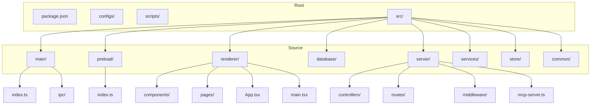
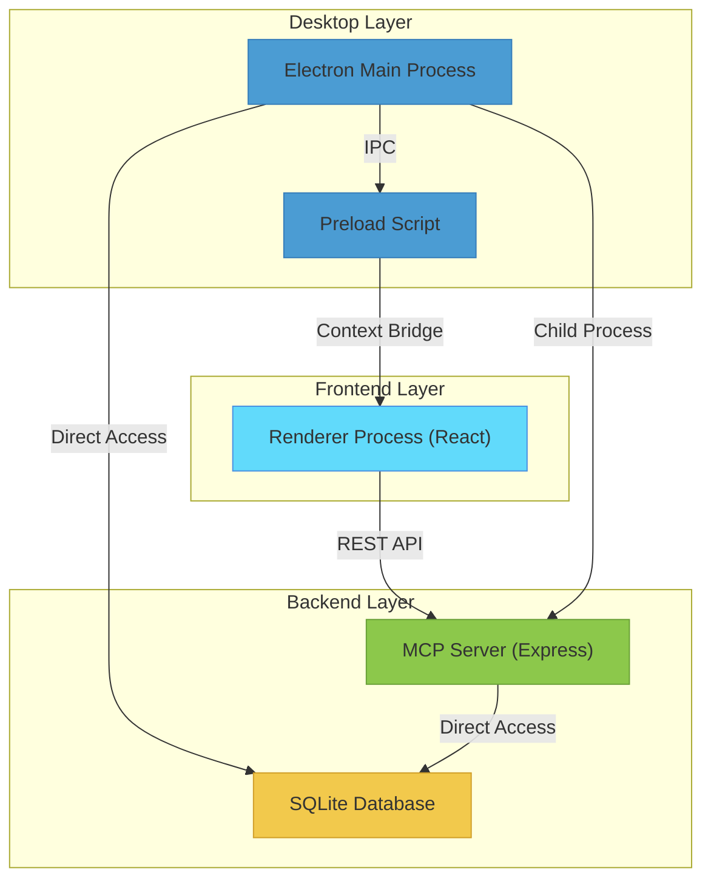
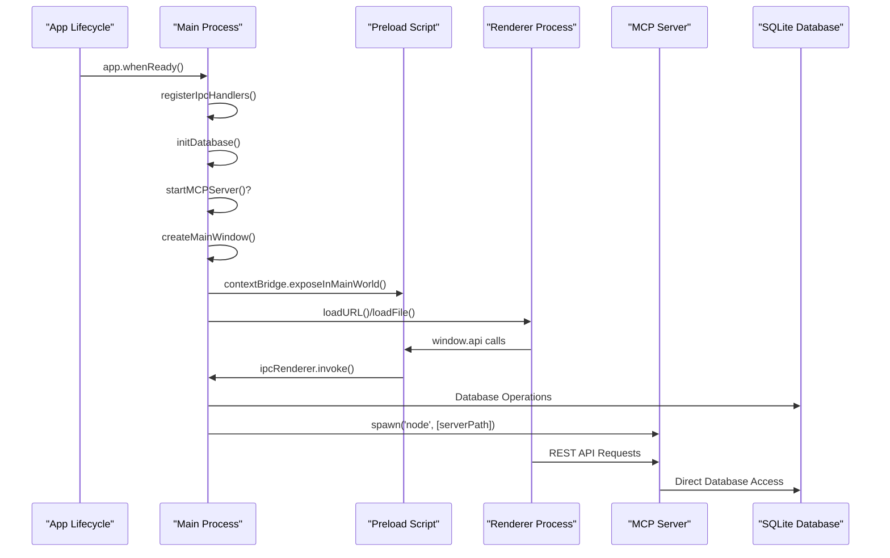
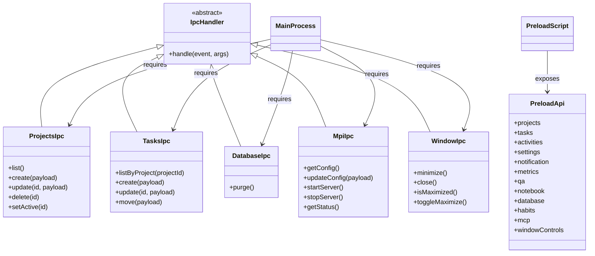
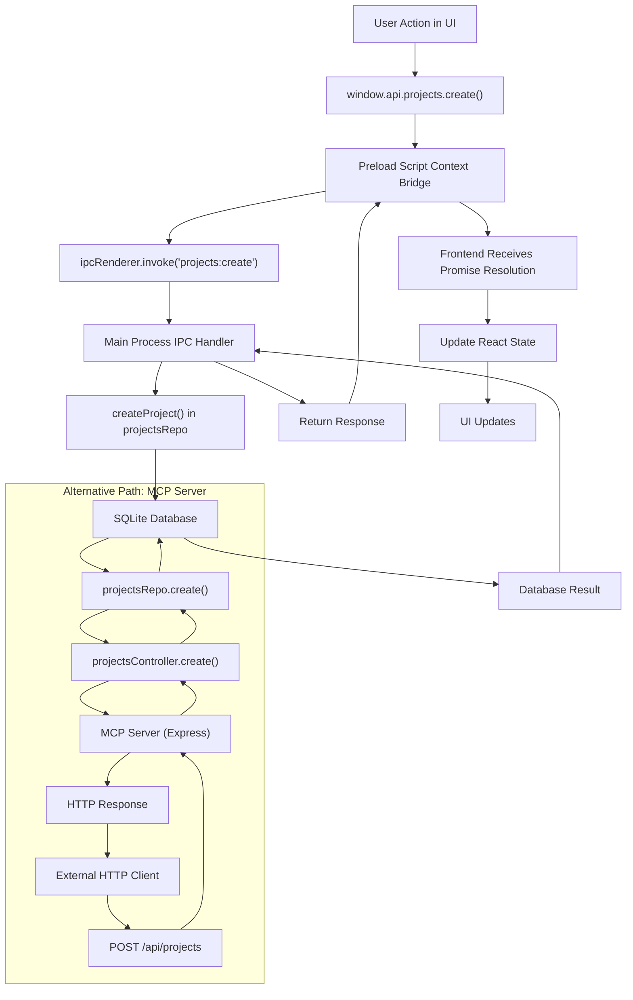
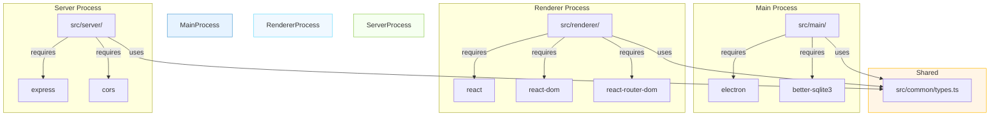

# Architecture

<cite>
**Referenced Files in This Document**   
- [main/index.ts](file://src/main/index.ts)
- [preload/index.ts](file://src/preload/index.ts)
- [renderer/main.tsx](file://src/renderer/main.tsx)
- [renderer/App.tsx](file://src/renderer/App.tsx)
- [server/mcp-server.ts](file://src/server/mcp-server.ts)
- [main/ipc/mcp.ts](file://src/main/ipc/mcp.ts)
- [database/init.ts](file://src/database/init.ts)
- [common/types.ts](file://src/common/types.ts)
- [configs/vite.config.ts](file://configs/vite.config.ts)
- [configs/tsup.config.ts](file://configs/tsup.config.ts)
</cite>

## Table of Contents
1. [Introduction](#introduction)
2. [Project Structure](#project-structure)
3. [Core Components](#core-components)
4. [Architecture Overview](#architecture-overview)
5. [Detailed Component Analysis](#detailed-component-analysis)
6. [Dependency Analysis](#dependency-analysis)
7. [Performance Considerations](#performance-considerations)
8. [Troubleshooting Guide](#troubleshooting-guide)
9. [Conclusion](#conclusion)

## Introduction
LifeOS is a local-first productivity suite built as a hybrid desktop application using Electron, React, and Express. The architecture follows a multi-process model with clear separation between frontend, backend, and desktop layers. This document details the architectural design, component interactions, data flows, and integration patterns that enable LifeOS to provide a seamless desktop experience while maintaining data privacy through local storage.

## Project Structure

The LifeOS application follows a well-organized directory structure that separates concerns across different layers of the application:

**Diagram sources**
- [package.json](file://package.json#L1-L109)
- [src/main/index.ts](file://src/main/index.ts#L1-L110)

**Section sources**
- [package.json](file://package.json#L1-L109)
- [src/main/index.ts](file://src/main/index.ts#L1-L110)

## Core Components

LifeOS architecture consists of three main processes: the Electron main process, the renderer process (React frontend), and a standalone Express server process. The main process manages application lifecycle and native desktop interactions, the renderer process handles the user interface using React, and the server process provides a REST API for external integrations.

The application uses SQLite for local data persistence, with database initialization handled in the main process. State management in the frontend is implemented using Zustand, while the backend services handle business logic such as metrics calculation and settings management.

**Section sources**
- [src/main/index.ts](file://src/main/index.ts#L1-L110)
- [src/renderer/main.tsx](file://src/renderer/main.tsx#L1-L18)
- [src/server/mcp-server.ts](file://src/server/mcp-server.ts#L1-L80)

## Architecture Overview

LifeOS employs a hybrid desktop application architecture with multiple processes communicating through well-defined interfaces. The system consists of three primary layers: the desktop layer (Electron), the frontend layer (React), and the backend layer (Express).

**Diagram sources**
- [src/main/index.ts](file://src/main/index.ts#L1-L110)
- [src/preload/index.ts](file://src/preload/index.ts#L1-L202)
- [src/renderer/main.tsx](file://src/renderer/main.tsx#L1-L18)
- [src/server/mcp-server.ts](file://src/server/mcp-server.ts#L1-L80)

**Section sources**
- [src/main/index.ts](file://src/main/index.ts#L1-L110)
- [src/server/mcp-server.ts](file://src/server/mcp-server.ts#L1-L80)

## Detailed Component Analysis

### Process Architecture Analysis

LifeOS implements a multi-process Electron architecture that separates concerns between different application layers. The main process handles application lifecycle, window management, and direct database access, while the renderer process focuses on UI rendering and user interactions.

The MCP (Microservice Communication Protocol) server runs as a standalone Express server within the Electron application, allowing external applications to interact with LifeOS data through a REST API. This server can be started and stopped programmatically from the main process, providing flexibility in deployment and usage scenarios.

**Diagram sources**
- [src/main/index.ts](file://src/main/index.ts#L1-L110)
- [src/preload/index.ts](file://src/preload/index.ts#L1-L202)
- [src/server/mcp-server.ts](file://src/server/mcp-server.ts#L1-L80)

**Section sources**
- [src/main/index.ts](file://src/main/index.ts#L1-L110)
- [src/preload/index.ts](file://src/preload/index.ts#L1-L202)

### IPC Communication Analysis

The Inter-Process Communication (IPC) system in LifeOS follows a secure pattern using Electron's context bridge to expose a controlled API from the main process to the renderer process. The preload script defines the API surface that the renderer can access, while the main process registers IPC handlers for each available operation.

Each IPC handler follows a consistent pattern of wrapping responses with success and failure methods to ensure standardized communication. The API includes operations for projects, tasks, settings, notifications, and other application features, with each handler validating input and returning appropriate responses.

**Diagram sources**
- [src/main/ipc/projects.ts](file://src/main/ipc/projects.ts#L1-L84)
- [src/main/ipc/tasks.ts](file://src/main/ipc/tasks.ts)
- [src/main/ipc/database.ts](file://src/main/ipc/database.ts#L1-L55)
- [src/main/ipc/mcp.ts](file://src/main/ipc/mcp.ts#L1-L151)
- [src/main/ipc/window.ts](file://src/main/ipc/window.ts#L1-L27)
- [src/preload/index.ts](file://src/preload/index.ts#L1-L202)

**Section sources**
- [src/main/ipc/projects.ts](file://src/main/ipc/projects.ts#L1-L84)
- [src/preload/index.ts](file://src/preload/index.ts#L1-L202)

### Data Flow Analysis

The data flow in LifeOS follows a well-defined pattern across the different layers of the application. User interactions in the React frontend trigger API calls through the context bridge, which are handled by IPC handlers in the main process that interact with the database.

For external integrations, the MCP server provides a REST API that directly accesses the same SQLite database, ensuring data consistency across different access methods. The application also implements a notification system that allows the main process to show notifications in response to various events.

**Diagram sources**
- [src/renderer/App.tsx](file://src/renderer/App.tsx#L1-L176)
- [src/main/ipc/projects.ts](file://src/main/ipc/projects.ts#L1-L84)
- [src/database/projectsRepo.ts]
- [src/server/controllers/projectsController.ts]
- [src/server/routes/projects.ts]

**Section sources**
- [src/renderer/App.tsx](file://src/renderer/App.tsx#L1-L176)
- [src/main/ipc/projects.ts](file://src/main/ipc/projects.ts#L1-L84)

## Dependency Analysis

The LifeOS application has a well-defined dependency structure that separates concerns between different components. The main process depends on Electron and better-sqlite3 for desktop integration and database access, while the renderer process depends on React and related libraries for UI rendering.

The MCP server has its own set of dependencies including Express, CORS, and middleware components, allowing it to function as a standalone service. The common types are shared across all processes to ensure type consistency.

**Diagram sources**
- [package.json](file://package.json#L1-L109)
- [src/common/types.ts](file://src/common/types.ts#L1-L117)

**Section sources**
- [package.json](file://package.json#L1-L109)
- [src/common/types.ts](file://src/common/types.ts#L1-L117)

## Performance Considerations

The LifeOS architecture includes several performance considerations to ensure a responsive user experience. The application uses Vite for fast development builds and hot module replacement, while tsup is used to bundle the main process code efficiently.

Database operations are optimized with appropriate indexes on frequently queried columns, and the application implements a transaction-based approach for operations that affect multiple records. The IPC communication is designed to be asynchronous, preventing the renderer process from blocking during data operations.

The separation of the MCP server allows external clients to access data without affecting the main application performance, and the server can be started only when needed, conserving system resources.

## Troubleshooting Guide

When troubleshooting LifeOS architecture issues, consider the following common scenarios:

1. **IPC Communication Failures**: Check that the preload script is properly configured and that the context bridge is exposing the expected API. Verify that IPC handlers are registered in the main process before the renderer attempts to use them.

2. **Database Connection Issues**: Ensure the userData path is accessible and that the SQLite database file can be created. Check that foreign key constraints are properly enabled.

3. **MCP Server Startup Problems**: Verify that the server binary has been built and exists at the expected path. Check that the port is not already in use by another process.

4. **Type Consistency Errors**: When sharing types between processes, ensure that the common types are correctly imported and that there are no version conflicts between dependencies.

**Section sources**
- [src/main/index.ts](file://src/main/index.ts#L1-L110)
- [src/main/ipc/mcp.ts](file://src/main/ipc/mcp.ts#L1-L151)
- [src/database/init.ts](file://src/database/init.ts#L1-L144)

## Conclusion

LifeOS implements a sophisticated hybrid desktop application architecture that effectively combines Electron, React, and Express to create a powerful productivity suite. The multi-process design with clear separation of concerns allows for a responsive user interface while maintaining data privacy through local storage.

The architecture demonstrates several best practices, including secure IPC communication using context isolation, consistent API design across different access methods, and efficient resource management. The MCP server provides a flexible integration point for external tools while maintaining the core application's integrity.

This architectural approach enables LifeOS to deliver a native desktop experience with the flexibility of web technologies, creating a robust foundation for future enhancements and integrations.