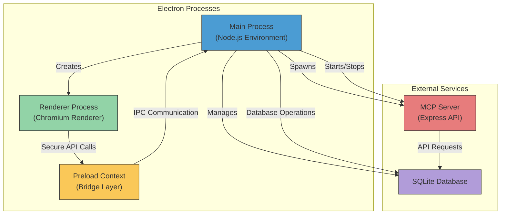
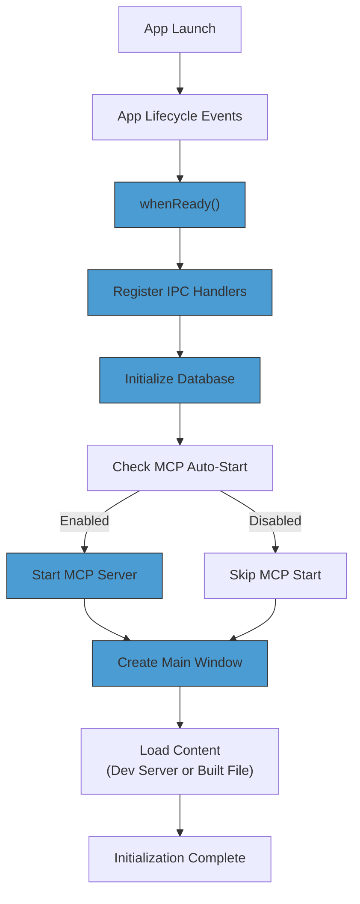
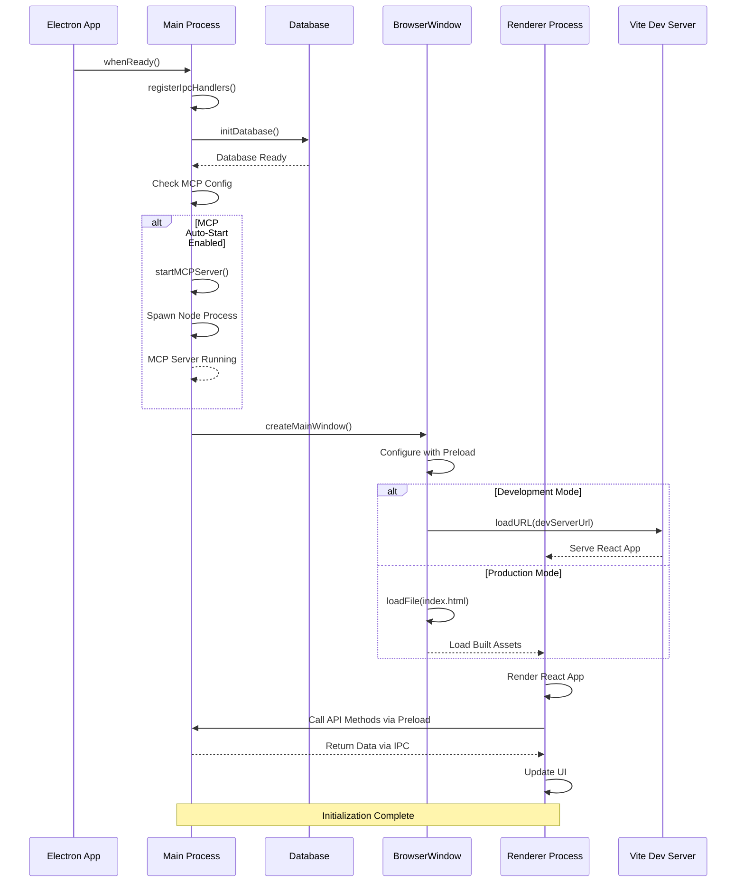
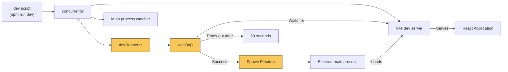

# Electron Multi-Process Architecture

<cite>
**Referenced Files in This Document**   
- [src/main/index.ts](file://src/main/index.ts)
- [src/preload/index.ts](file://src/preload/index.ts)
- [src/renderer/main.tsx](file://src/renderer/main.tsx)
- [src/main/devRunner.ts](file://src/main/devRunner.ts)
- [configs/vite.config.ts](file://configs/vite.config.ts)
- [src/main/ipc/window.ts](file://src/main/ipc/window.ts)
- [src/database/init.ts](file://src/database/init.ts)
- [src/main/ipc/mcp.ts](file://src/main/ipc/mcp.ts)
- [src/main/ipc/projects.ts](file://src/main/ipc/projects.ts)
- [src/main/ipc/tasks.ts](file://src/main/ipc/tasks.ts)
- [src/common/types.ts](file://src/common/types.ts)
- [src/server/mcp-server.ts](file://src/server/mcp-server.ts)
- [src/database/mcpRepo.ts](file://src/database/mcpRepo.ts)
- [src/services/settings.ts](file://src/services/settings.ts)
</cite>

## Table of Contents
1. [Introduction](#introduction)
2. [Process Architecture Overview](#process-architecture-overview)
3. [Main Process Responsibilities](#main-process-responsibilities)
4. [Renderer Process Responsibilities](#renderer-process-responsibilities)
5. [Preload Scripts and Context Isolation](#preload-scripts-and-context-isolation)
6. [Inter-Process Communication (IPC) Mechanism](#inter-process-communication-ipc-mechanism)
7. [Application Initialization Sequence](#application-initialization-sequence)
8. [MCP Server Integration](#mcp-server-integration)
9. [Development Environment Integration](#development-environment-integration)
10. [Security and Performance Implications](#security-and-performance-implications)

## Introduction
LifeOS implements a multi-process Electron architecture that separates concerns between desktop integration, UI rendering, and backend services. This document details the architectural decisions, process responsibilities, communication mechanisms, and initialization sequence that enable LifeOS to provide a secure, performant, and maintainable desktop application experience.

**Section sources**
- [src/main/index.ts](file://src/main/index.ts#L1-L110)
- [src/renderer/main.tsx](file://src/renderer/main.tsx#L1-L18)

## Process Architecture Overview



**Diagram sources**
- [src/main/index.ts](file://src/main/index.ts#L1-L110)
- [src/preload/index.ts](file://src/preload/index.ts#L1-L202)
- [src/server/mcp-server.ts](file://src/server/mcp-server.ts#L1-L80)

**Section sources**
- [src/main/index.ts](file://src/main/index.ts#L1-L110)
- [src/preload/index.ts](file://src/preload/index.ts#L1-L202)

## Main Process Responsibilities

The main process in LifeOS handles critical application lifecycle management, window creation, system integration, and inter-process coordination. It serves as the central orchestrator that manages the application's desktop presence and coordinates between various components.

Key responsibilities include:
- Application lifecycle management (startup, shutdown, activation)
- BrowserWindow creation and management with custom frame configuration
- Database initialization and connection management
- IPC handler registration for renderer communication
- MCP server process management (spawning, monitoring, termination)
- System-level event handling (window close, app activation)

The main process initializes the SQLite database before window creation, ensuring data persistence is available before the UI becomes interactive. It also conditionally auto-starts the MCP server based on user configuration, demonstrating its role as the central coordination point for application services.



**Diagram sources**
- [src/main/index.ts](file://src/main/index.ts#L1-L110)
- [src/database/init.ts](file://src/database/init.ts#L1-L144)
- [src/main/ipc/mcp.ts](file://src/main/ipc/mcp.ts#L1-L151)

**Section sources**
- [src/main/index.ts](file://src/main/index.ts#L1-L110)
- [src/database/init.ts](file://src/database/init.ts#L1-L144)

## Renderer Process Responsibilities

The renderer process in LifeOS is responsible for UI rendering and user interaction using React. It operates in a secure sandboxed environment separate from Node.js capabilities, focusing exclusively on presentation logic and user experience.

Key responsibilities include:
- Rendering React components for the application interface
- Managing UI state and user interactions
- Making secure API calls to the main process via the preload bridge
- Displaying data received from the main process
- Handling client-side routing and navigation

The renderer process loads the React application either from the Vite development server during development or from the built static files in production. It imports and renders the App component through React's StrictMode, ensuring best practices in development.

**Section sources**
- [src/renderer/main.tsx](file://src/renderer/main.tsx#L1-L18)
- [src/renderer/App.tsx](file://src/renderer/App.tsx)

## Preload Scripts and Context Isolation

LifeOS implements a robust security model using Electron's context isolation and preload scripts to safely expose limited Node.js and Electron APIs to the renderer process.

The preload script (`src/preload/index.ts`) serves as a secure bridge between the isolated renderer context and the privileged main process. It uses Electron's `contextBridge` API to expose a carefully curated set of functions that wrap IPC communication, preventing direct access to potentially dangerous APIs.

Key security features:
- Context isolation enabled (`contextIsolation: true`)
- Node integration disabled (`nodeIntegration: false`)
- Preload script as the only communication channel
- Type-safe API exposure using TypeScript interfaces
- Granular method exposure for specific functionality

The preload script exposes two main objects to the renderer:
- `api`: Domain-specific methods for data operations (projects, tasks, settings, etc.)
- `windowControls`: Window management functions (minimize, close, maximize)

This approach follows the principle of least privilege, exposing only the necessary functionality while maintaining a strong security boundary.

```mermaid
classDiagram
class PreloadContext {
+api : Object
+windowControls : Object
-contextBridge.exposeInMainWorld()
-ipcRenderer.invoke()
}
class RendererContext {
+window.api : PreloadApi
+window.windowControls : WindowControls
}
class MainProcess {
+ipcMain.handle()
+BrowserWindow
+Electron APIs
}
RendererContext --> PreloadContext : "contextBridge"
PreloadContext --> MainProcess : "ipcRenderer.invoke()"
MainProcess --> PreloadContext : "ipcMain.handle()"
note right of PreloadContext
Secure bridge layer that exposes
limited, type-safe APIs to renderer
using context isolation
end
note right of RendererContext
Sandboxed environment with no
direct Node.js access; can only
use exposed APIs
end
note left of MainProcess
Privileged process with full
access to system resources,
databases, and Electron APIs
end
```

**Diagram sources**
- [src/preload/index.ts](file://src/preload/index.ts#L1-L202)
- [src/main/index.ts](file://src/main/index.ts#L1-L110)

**Section sources**
- [src/preload/index.ts](file://src/preload/index.ts#L1-L202)
- [src/main/index.ts](file://src/main/index.ts#L1-L110)

## Inter-Process Communication (IPC) Mechanism

LifeOS implements a structured IPC communication pattern that enables secure data exchange between the renderer and main processes. The architecture follows a request-response model using Electron's `ipcRenderer.invoke()` and `ipcMain.handle()` APIs.

The communication flow:
1. Renderer calls exposed API method via `window.api`
2. Preload script forwards request using `ipcRenderer.invoke()`
3. Main process handler processes the request and returns a response
4. Response is sent back through the IPC channel
5. Renderer receives the Promise result

Key characteristics:
- Asynchronous communication using Promises
- Type-safe interfaces defined in `src/common/types.ts`
- Structured response format with `ApiResponse<T>` wrapper
- Error handling through unified response pattern
- Domain-specific handlers organized by functionality

The IPC handlers are modularized by domain (projects, tasks, settings, etc.) and registered centrally in the main process initialization. Each handler uses a wrapper function (`wrapIpc`) to standardize error handling and response formatting.

**Section sources**
- [src/preload/index.ts](file://src/preload/index.ts#L1-L202)
- [src/main/ipc/projects.ts](file://src/main/ipc/projects.ts#L1-L84)
- [src/main/ipc/tasks.ts](file://src/main/ipc/tasks.ts#L1-L37)
- [src/common/types.ts](file://src/common/types.ts#L1-L117)

## Application Initialization Sequence

The LifeOS application follows a well-defined initialization sequence that ensures proper setup of all components before the user interface becomes interactive.



**Diagram sources**
- [src/main/index.ts](file://src/main/index.ts#L1-L110)
- [src/database/init.ts](file://src/database/init.ts#L1-L144)
- [src/main/ipc/mcp.ts](file://src/main/ipc/mcp.ts#L1-L151)
- [src/renderer/main.tsx](file://src/renderer/main.tsx#L1-L18)

**Section sources**
- [src/main/index.ts](file://src/main/index.ts#L1-L110)
- [src/database/init.ts](file://src/database/init.ts#L1-L144)

## MCP Server Integration

LifeOS integrates a separate MCP (Microservice Communication Protocol) server as a backend service that runs alongside the main Electron application. This server provides a REST API interface for data operations and is implemented as an Express application.

Key integration points:
- The main process spawns the MCP server as a child Node.js process
- Server configuration is stored in the SQLite database (`mcp_config` table)
- Auto-start behavior is configurable by the user
- The renderer can interact with the server through the main process IPC
- Server exposes API routes for various domains (tasks, projects, habits, etc.)

The MCP server runs on a configurable port (default 3000) and host, allowing external applications to potentially integrate with LifeOS data. This architecture enables separation of concerns between the desktop application interface and the data API layer.

**Section sources**
- [src/main/ipc/mcp.ts](file://src/main/ipc/mcp.ts#L1-L151)
- [src/server/mcp-server.ts](file://src/server/mcp-server.ts#L1-L80)
- [src/database/mcpRepo.ts](file://src/database/mcpRepo.ts#L1-L59)

## Development Environment Integration

LifeOS implements a sophisticated development environment that integrates Vite's fast development server with Electron's desktop capabilities through a custom dev runner.

The development workflow:
1. Vite development server starts and serves the React application
2. Custom dev runner (`devRunner.ts`) waits for the Vite server to be ready
3. Electron main process starts with development environment variables
4. Main window loads the Vite server URL instead of static files
5. Hot module replacement enables fast development iteration

The `devRunner.ts` script orchestrates this process by:
- Spawning the Electron process with proper environment configuration
- Setting the `VITE_DEV_SERVER_URL` environment variable
- Ensuring the Vite server is ready before launching Electron
- Inheriting stdio for unified logging

This approach provides developers with Vite's rapid refresh capabilities while maintaining the full Electron desktop application context.



**Diagram sources**
- [src/main/devRunner.ts](file://src/main/devRunner.ts#L1-L40)
- [configs/vite.config.ts](file://configs/vite.config.ts#L1-L24)
- [package.json](file://package.json#L1-L109)

**Section sources**
- [src/main/devRunner.ts](file://src/main/devRunner.ts#L1-L40)
- [configs/vite.config.ts](file://configs/vite.config.ts#L1-L24)

## Security and Performance Implications

The multi-process architecture of LifeOS provides significant security and performance benefits through process isolation and separation of concerns.

### Security Benefits
- **Context isolation**: Prevents renderer code from accessing Node.js APIs directly
- **Preload script mediation**: All IPC calls go through a controlled, type-safe interface
- **Node integration disabled**: Renderer cannot execute arbitrary system commands
- **Sandboxed renderer**: Chromium security model protects against XSS and other web vulnerabilities
- **Principle of least privilege**: Each process has only the permissions it needs

### Performance Benefits
- **Process separation**: Heavy UI rendering doesn't block main thread operations
- **Database operations offloaded**: Data persistence handled in main process
- **Independent scaling**: Renderer can be optimized for UI performance while main process handles system integration
- **Memory management**: Processes can be managed independently
- **Development speed**: Vite integration enables fast refresh without full Electron restart

### Architectural Rationale for Process Separation
The decision to split functionality across multiple processes follows established best practices for Electron applications:

1. **UI and desktop logic separation**: Keeps presentation concerns separate from system integration
2. **Security boundary**: Prevents potential security vulnerabilities in web content from compromising system access
3. **Maintainability**: Clear separation of concerns makes codebase easier to understand and modify
4. **Testability**: Components can be tested independently
5. **Scalability**: Services like the MCP server can be developed and deployed independently

This architecture balances the need for desktop integration capabilities with the security requirements of a modern web application, providing a robust foundation for the LifeOS application.

**Section sources**
- [src/main/index.ts](file://src/main/index.ts#L1-L110)
- [src/preload/index.ts](file://src/preload/index.ts#L1-L202)
- [src/main/ipc/mcp.ts](file://src/main/ipc/mcp.ts#L1-L151)
- [src/services/settings.ts](file://src/services/settings.ts#L1-L46)