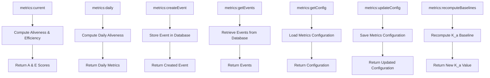
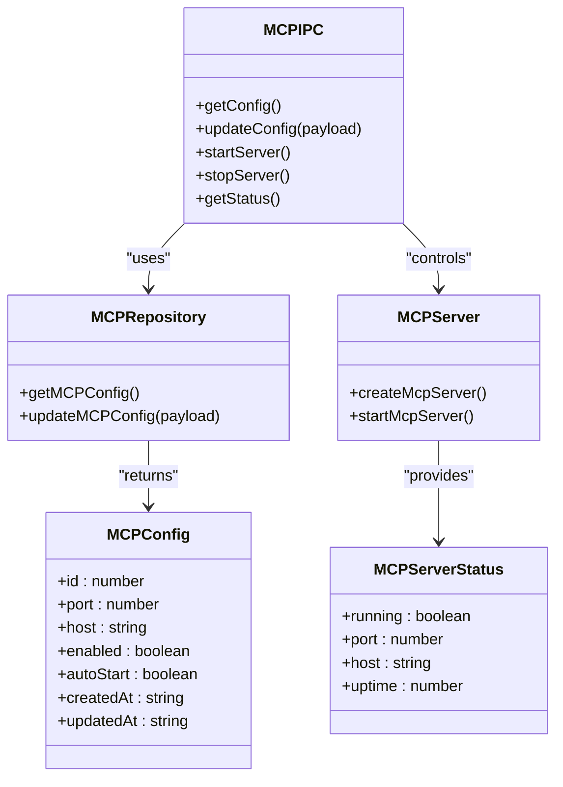
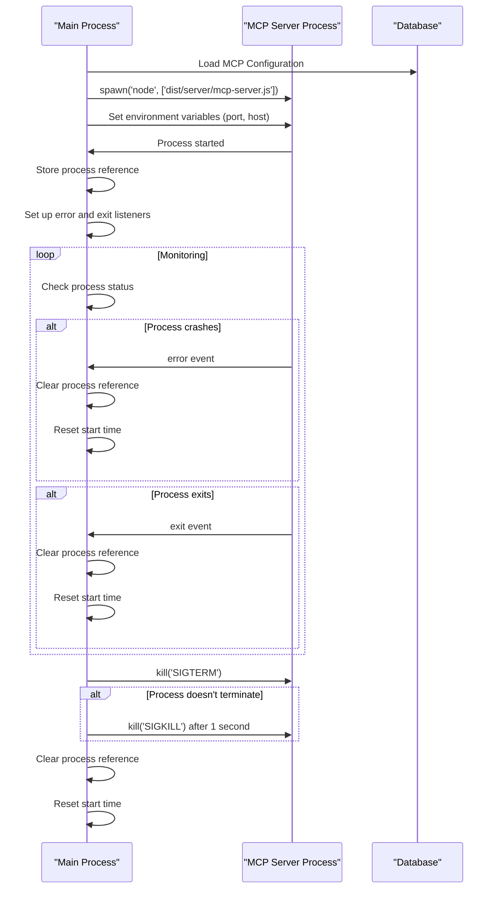
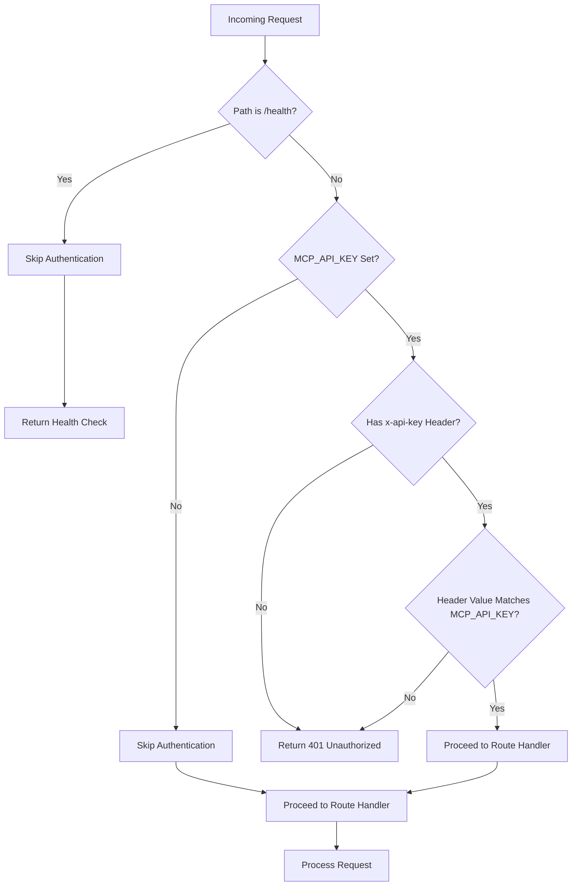
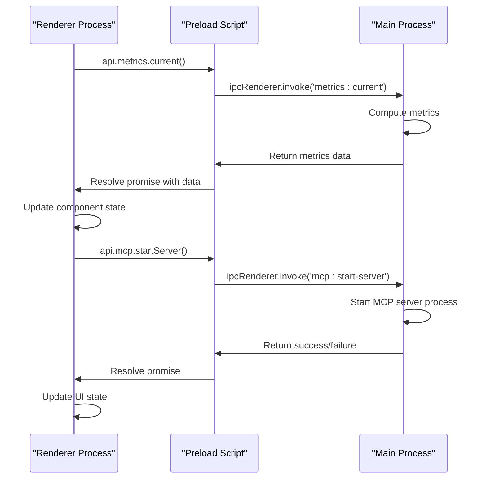
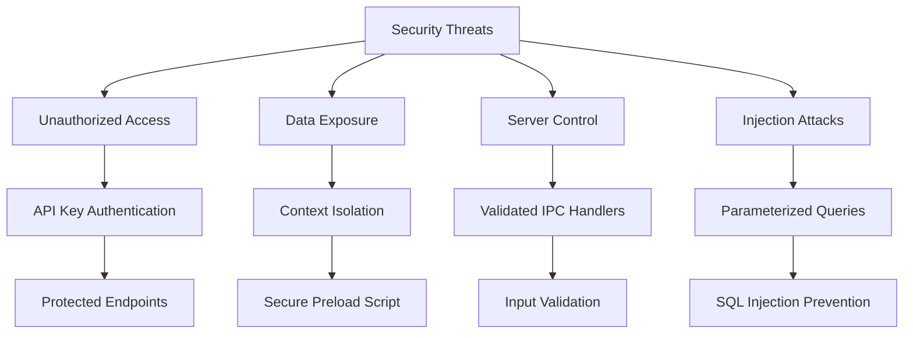
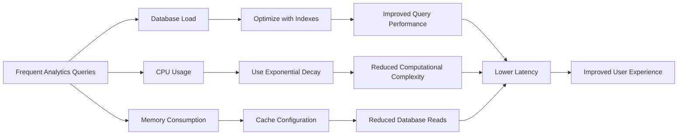
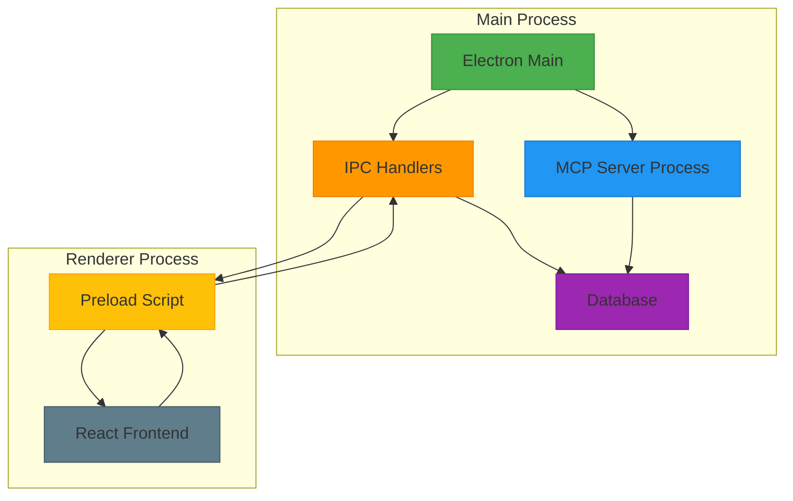

# Analytics and Metrics IPC Services

<cite>
**Referenced Files in This Document**   
- [metrics.ts](file://src/main/ipc/metrics.ts)
- [mcp.ts](file://src/main/ipc/mcp.ts)
- [mcp-server.ts](file://src/server/mcp-server.ts)
- [auth.ts](file://src/server/middleware/auth.ts)
- [statusController.ts](file://src/server/controllers/statusController.ts)
- [status.ts](file://src/server/routes/status.ts)
- [DashboardStats.tsx](file://src/renderer/components/DashboardStats.tsx)
- [SettingsPage.tsx](file://src/renderer/pages/SettingsPage.tsx)
- [index.ts](file://src/main/index.ts)
- [index.ts](file://src/preload/index.ts)
- [scoring.ts](file://src/services/scoring.ts)
- [mcpRepo.ts](file://src/database/mcpRepo.ts)
- [types.ts](file://src/common/types.ts)
</cite>

## Table of Contents
1. [Introduction](#introduction)
2. [Metrics IPC Handler](#metrics-ipc-handler)
3. [MCP Server Integration](#mcp-server-integration)
4. [Process Lifecycle Management](#process-lifecycle-management)
5. [API Key Authentication](#api-key-authentication)
6. [Frontend Integration](#frontend-integration)
7. [Security Considerations](#security-considerations)
8. [Performance Implications](#performance-implications)
9. [Architecture Overview](#architecture-overview)

## Introduction
This document provides comprehensive documentation for the analytics and external service IPC handlers in the LifeOS application. It details the metrics IPC handler that provides access to activity analytics, event tracking, and baseline recomputation. The document also covers the MCP server integration including configuration retrieval, start/stop controls, and status monitoring. The interaction between the main process and the standalone Express server is explained, including process lifecycle management. The API key authentication flow and server configuration through environment variables are documented. Examples of how the frontend uses these IPC channels are provided, showing metrics display in DashboardStats.tsx and MCP server control from SettingsPage.tsx. Security considerations for exposing server controls and performance implications of frequent analytics queries are addressed.

## Metrics IPC Handler

The metrics IPC handler provides a comprehensive analytics system that tracks user activity and computes performance metrics. It exposes several IPC channels for retrieving current metrics, daily metrics, creating events, retrieving events, getting and updating configuration, and recomputing baselines.

The handler uses a sophisticated scoring engine to calculate Aliveness (A) and Efficiency (E) scores based on user activities. Aliveness measures overall engagement through event tracking with exponential decay, while Efficiency evaluates task completion performance with multiple weighted components.

**Diagram sources**
- [metrics.ts](file://src/main/ipc/metrics.ts#L1-L151)

**Section sources**
- [metrics.ts](file://src/main/ipc/metrics.ts#L1-L151)
- [scoring.ts](file://src/services/scoring.ts#L1-L531)

## MCP Server Integration

The MCP server integration provides a standalone Express server that exposes REST APIs for various application modules. The integration includes configuration management, server control, and status monitoring through IPC handlers.

The MCP server configuration is stored in the database and includes port, host, enabled status, and auto-start preferences. The integration allows for dynamic configuration updates, server start/stop controls, and real-time status monitoring.

**Diagram sources**
- [mcp.ts](file://src/main/ipc/mcp.ts#L1-L151)
- [mcpRepo.ts](file://src/database/mcpRepo.ts#L1-L58)
- [types.ts](file://src/common/types.ts#L1-L116)

**Section sources**
- [mcp.ts](file://src/main/ipc/mcp.ts#L1-L151)
- [mcpRepo.ts](file://src/database/mcpRepo.ts#L1-L58)
- [types.ts](file://src/common/types.ts#L1-L116)

## Process Lifecycle Management

The process lifecycle management system handles the creation, monitoring, and termination of the MCP server process. The main Electron process manages the MCP server as a child process, ensuring proper startup, shutdown, and error handling.

When the MCP server is started, it is spawned as a separate Node.js process with environment variables for configuration. The main process monitors the server process for errors and exit events, updating the internal state accordingly. The server can be gracefully stopped using SIGTERM, with a fallback to SIGKILL if necessary.

**Diagram sources**
- [mcp.ts](file://src/main/ipc/mcp.ts#L1-L151)
- [index.ts](file://src/main/index.ts#L1-L122)

**Section sources**
- [mcp.ts](file://src/main/ipc/mcp.ts#L1-L151)
- [index.ts](file://src/main/index.ts#L1-L122)

## API Key Authentication

The API key authentication system protects the MCP server endpoints from unauthorized access. When an API key is configured via the MCP_API_KEY environment variable, all requests to protected endpoints must include a valid API key in the x-api-key header.

The authentication middleware skips validation for health check endpoints while enforcing it for all other API routes. This provides a way to check server availability without authentication while protecting sensitive data and server controls.

**Diagram sources**
- [auth.ts](file://src/server/middleware/auth.ts#L1-L26)
- [mcp-server.ts](file://src/server/mcp-server.ts#L1-L89)

**Section sources**
- [auth.ts](file://src/server/middleware/auth.ts#L1-L26)
- [mcp-server.ts](file://src/server/mcp-server.ts#L1-L89)

## Frontend Integration

The frontend integrates with the analytics and MCP server IPC handlers through the preload script, which exposes a structured API to the renderer process. This allows React components to communicate with the main process securely using Electron's context bridge.

The DashboardStats component displays key metrics from the analytics system, while the SettingsPage component provides controls for the MCP server. Both components use the window.api interface to make IPC calls and update their state based on the responses.

**Diagram sources**
- [index.ts](file://src/preload/index.ts#L1-L201)
- [DashboardStats.tsx](file://src/renderer/components/DashboardStats.tsx#L1-L187)
- [SettingsPage.tsx](file://src/renderer/pages/SettingsPage.tsx#L1-L659)

**Section sources**
- [index.ts](file://src/preload/index.ts#L1-L201)
- [DashboardStats.tsx](file://src/renderer/components/DashboardStats.tsx#L1-L187)
- [SettingsPage.tsx](file://src/renderer/pages/SettingsPage.tsx#L1-L659)

## Security Considerations

The system implements several security measures to protect against unauthorized access and potential vulnerabilities. The MCP server can be secured with an API key that must be provided in the x-api-key header for all non-health-check requests. This prevents unauthorized clients from accessing sensitive data or controlling the server.

Server controls are exposed through IPC handlers that validate input and handle errors gracefully. The system uses Electron's context isolation and preload scripts to prevent direct access to Node.js APIs from the renderer process, mitigating potential XSS attacks.

The MCP server configuration is stored in the database with proper escaping to prevent SQL injection. Environment variables are used for sensitive configuration, keeping credentials out of the codebase.

**Diagram sources**
- [auth.ts](file://src/server/middleware/auth.ts#L1-L26)
- [mcp.ts](file://src/main/ipc/mcp.ts#L1-L151)
- [mcpRepo.ts](file://src/database/mcpRepo.ts#L1-L58)
- [index.ts](file://src/preload/index.ts#L1-L201)

**Section sources**
- [auth.ts](file://src/server/middleware/auth.ts#L1-L26)
- [mcp.ts](file://src/main/ipc/mcp.ts#L1-L151)
- [mcpRepo.ts](file://src/database/mcpRepo.ts#L1-L58)

## Performance Implications

The analytics system has several performance considerations due to the computational complexity of the scoring algorithms and database queries. The Aliveness and Efficiency calculations involve multiple database queries and complex mathematical operations that can impact performance with large datasets.

To mitigate performance issues, the system uses exponential decay functions that reduce the weight of older events, focusing computation on recent activities. The metrics queries are optimized with appropriate database indexes, and the system caches configuration data to avoid repeated database reads.

Frequent analytics queries should be batched or throttled to prevent excessive database load. The system provides both current and daily metrics endpoints to allow clients to choose the appropriate level of detail for their use case.

**Diagram sources**
- [metrics.ts](file://src/main/ipc/metrics.ts#L1-L151)
- [scoring.ts](file://src/services/scoring.ts#L1-L531)
- [statusController.ts](file://src/server/controllers/statusController.ts#L1-L150)

**Section sources**
- [metrics.ts](file://src/main/ipc/metrics.ts#L1-L151)
- [scoring.ts](file://src/services/scoring.ts#L1-L531)
- [statusController.ts](file://src/server/controllers/statusController.ts#L1-L150)

## Architecture Overview

The overall architecture consists of the main Electron process, the MCP server process, and the renderer process, connected through IPC channels and a shared database. The main process manages both the Electron application and the MCP server lifecycle, while the renderer process provides the user interface.

The MCP server exposes REST APIs for various modules, protected by API key authentication. The frontend components use the preload script to access IPC handlers for both analytics and server control functionality. The database serves as the central data store for both the Electron application and the MCP server.

**Diagram sources**
- [index.ts](file://src/main/index.ts#L1-L122)
- [mcp-server.ts](file://src/server/mcp-server.ts#L1-L89)
- [index.ts](file://src/preload/index.ts#L1-L201)
- [metrics.ts](file://src/main/ipc/metrics.ts#L1-L151)
- [mcp.ts](file://src/main/ipc/mcp.ts#L1-L151)

**Section sources**
- [index.ts](file://src/main/index.ts#L1-L122)
- [mcp-server.ts](file://src/server/mcp-server.ts#L1-L89)
- [index.ts](file://src/preload/index.ts#L1-L201)