# Data Management IPC Handlers

<cite>
**Referenced Files in This Document**   
- [projects.ts](file://src/main/ipc/projects.ts)
- [tasks.ts](file://src/main/ipc/tasks.ts)
- [habits.ts](file://src/main/ipc/habits.ts)
- [qa.ts](file://src/main/ipc/qa.ts)
- [notebook.ts](file://src/main/ipc/notebook.ts)
- [activities.ts](file://src/main/ipc/activities.ts)
- [projectsRepo.ts](file://src/database/projectsRepo.ts)
- [tasksRepo.ts](file://src/database/tasksRepo.ts)
- [habitsRepo.ts](file://src/database/habitsRepo.ts)
- [qaRepo.ts](file://src/database/qaRepo.ts)
- [notebookRepo.ts](file://src/database/notebookRepo.ts)
- [activitiesRepo.ts](file://src/database/activitiesRepo.ts)
- [KanbanPage.tsx](file://src/renderer/pages/KanbanPage.tsx)
- [HabitsPage.tsx](file://src/renderer/pages/HabitsPage.tsx)
- [QA.tsx](file://src/renderer/pages/QA.tsx)
- [NotebookPage.tsx](file://src/renderer/pages/NotebookPage.tsx)
- [types.ts](file://src/common/types.ts)
</cite>

## Table of Contents
1. [Introduction](#introduction)
2. [Core Data Entities](#core-data-entities)
3. [IPC Handler Architecture](#ipc-handler-architecture)
4. [Projects Management](#projects-management)
5. [Tasks Management](#tasks-management)
6. [Habits Management](#habits-management)
7. [QA Collections Management](#qa-collections-management)
8. [Notebooks Management](#notebooks-management)
9. [Activities Management](#activities-management)
10. [Frontend Integration](#frontend-integration)
11. [Data Consistency and Performance](#data-consistency-and-performance)
12. [Error Handling Strategies](#error-handling-strategies)

## Introduction

The LifeOS application implements a comprehensive data management system through Electron's Inter-Process Communication (IPC) mechanism, enabling seamless interaction between the frontend renderer process and the main process. This documentation details the implementation of CRUD operations for core data entities including projects, tasks, habits, QA collections, notebooks, and activities. The system follows a well-defined architecture where IPC handlers in the main process delegate database operations to repository methods, ensuring proper separation of concerns and maintainability.

The data management system is designed to support real-time updates, data consistency, and efficient performance even under high-frequency operations. Each core entity has dedicated IPC handlers and repository implementations that enforce validation rules, maintain relationships, and provide appropriate response formats. The frontend components interact with these handlers through a well-defined API exposed via the `window.api` object, enabling rich user experiences with features like drag-and-drop task management, habit tracking, and markdown-based note editing.

**Section sources**
- [projects.ts](file://src/main/ipc/projects.ts)
- [tasks.ts](file://src/main/ipc/tasks.ts)
- [habits.ts](file://src/main/ipc/habits.ts)

## Core Data Entities

LifeOS manages several core data entities that form the foundation of its productivity and knowledge management capabilities. Each entity has a well-defined structure with specific fields and relationships that support the application's functionality.

The **Project** entity serves as a container for tasks and provides organizational structure. Each project has a name, optional color and icon for visual identification, a position for ordering, and timestamps for creation and updates. Projects can be archived but not permanently deleted, maintaining data integrity.

The **Task** entity represents individual work items within a project. Tasks have a rich set of attributes including title, description, status (such as "To-Do", "In Progress", "Completed"), due date, priority, tags, and position within their status column. Additionally, tasks support time tracking with estimated and actual start/end dates and minutes, enabling detailed productivity analysis.

The **Habit** entity tracks recurring behaviors with configurable frequency (daily, weekly, monthly) and target counts. Each habit has completion statistics including current and longest streaks, and a 30-day completion rate. Habit logs record daily completion with optional count and notes, supporting flexible tracking patterns.

The **QA Collection** entity organizes questions and answers for knowledge management. Each collection contains multiple questions, which in turn can have multiple answers. Questions can be marked as unanswered, in progress, or answered based on their answer status, providing visual feedback on knowledge gaps.

The **Notebook** entity manages collections of markdown-formatted notes. Notebooks support rich text editing with preview capabilities, word counting, and tagging. Notes can be pinned for quick access and organized within their parent notebook.

The **Activity** entity records system events and user actions, providing an audit trail and enabling analytics. Activities have types, messages, and optional metadata, and can be associated with other entities through entity type and ID.


**Diagram sources**
- [types.ts](file://src/common/types.ts)
- [projectsRepo.ts](file://src/database/projectsRepo.ts)
- [tasksRepo.ts](file://src/database/tasksRepo.ts)
- [habitsRepo.ts](file://src/database/habitsRepo.ts)
- [qaRepo.ts](file://src/database/qaRepo.ts)
- [notebookRepo.ts](file://src/database/notebookRepo.ts)
- [activitiesRepo.ts](file://src/database/activitiesRepo.ts)

## IPC Handler Architecture

The IPC handler architecture in LifeOS follows a clean separation of concerns, with distinct layers for communication, business logic, and data persistence. The architecture is designed to be scalable, maintainable, and secure, leveraging Electron's IPC system to safely expose backend functionality to the frontend.

At the core of the architecture are the IPC handlers located in the `src/main/ipc` directory. These handlers use Electron's `ipcMain.handle` method to register asynchronous handlers for specific channels. Each handler follows a consistent pattern: it receives a request with optional arguments, processes the request by calling appropriate repository methods, and returns a response. The handlers are wrapped with the `wrapIpc` utility function, which provides standardized error handling and response formatting.

The repository layer, located in `src/database`, contains the business logic and database operations. Repository functions are responsible for data validation, transaction management, and complex operations that involve multiple database interactions. They use Zod for schema validation, ensuring that all data conforms to expected types and constraints before being persisted.

The database layer uses SQLite with a custom initialization system that provides a singleton database connection. This ensures that all operations use the same connection, preventing potential issues with concurrent access. The database schema is managed through SQL statements in the repository files, with foreign key relationships and appropriate indexes for performance.

Data flows through the system in a unidirectional manner: frontend components make requests through the `window.api` interface, which are handled by IPC handlers in the main process. These handlers call repository methods that interact with the database, and the results are returned through the IPC channel back to the frontend. This architecture ensures that the frontend remains decoupled from the database implementation details.


**Diagram sources**
- [projects.ts](file://src/main/ipc/projects.ts)
- [tasks.ts](file://src/main/ipc/tasks.ts)
- [habits.ts](file://src/main/ipc/habits.ts)
- [projectsRepo.ts](file://src/database/projectsRepo.ts)
- [tasksRepo.ts](file://src/database/tasksRepo.ts)
- [habitsRepo.ts](file://src/database/habitsRepo.ts)
- [init.ts](file://src/database/init.ts)

## Projects Management

The projects management system in LifeOS provides comprehensive CRUD operations for project entities through dedicated IPC handlers and repository methods. The implementation ensures data consistency, proper ordering, and integration with application settings.

The `projects.ts` IPC handler exposes several operations through distinct channels: `projects:list` retrieves all projects with the active project ID, `projects:create` creates a new project, `projects:update` modifies existing project properties, `projects:reorder` updates the position of multiple projects, `projects:set-active` changes the active project in settings, and `projects:delete` removes a project and handles cleanup.

The `projectsRepo.ts` repository implements these operations with careful attention to data integrity. When creating a project, the system automatically assigns a position based on the maximum existing position, ensuring proper ordering. The `listProjects` function includes logic to validate the active project ID, automatically updating it if the current active project is no longer valid (e.g., after deletion). This prevents application state inconsistencies.

Project deletion is implemented as a transactional operation that removes all associated tasks and activities before deleting the project itself. This cascade deletion ensures referential integrity and prevents orphaned records. The repository uses parameterized queries to prevent SQL injection and Zod for input validation, ensuring that only properly formatted data is accepted.

The response format for project operations follows a consistent pattern defined in the `ApiResponse` interface, with `ok` indicating success or failure, `data` containing the result, and `error` providing details in case of failure. This standardized format simplifies error handling in the frontend.


**Diagram sources**
- [projects.ts](file://src/main/ipc/projects.ts)
- [projectsRepo.ts](file://src/database/projectsRepo.ts)
- [types.ts](file://src/common/types.ts)

**Section sources**
- [projects.ts](file://src/main/ipc/projects.ts)
- [projectsRepo.ts](file://src/database/projectsRepo.ts)

## Tasks Management

The tasks management system in LifeOS provides robust CRUD operations for task entities with support for complex workflows including drag-and-drop reordering and status changes. The implementation is designed to handle the dynamic nature of task management while maintaining data consistency.

The `tasks.ts` IPC handler exposes four primary operations: `tasks:list-by-project` retrieves all tasks for a specific project, `tasks:create` creates a new task, `tasks:update` modifies task properties, and `tasks:move` handles the complex operation of moving a task between status columns or projects. The `move` operation is particularly important as it supports the Kanban board's drag-and-drop functionality.

The `tasksRepo.ts` repository implements these operations with sophisticated logic for position management. When creating a task, the system automatically assigns a position within the specified status column by finding the maximum existing position and incrementing it. This ensures that new tasks appear at the bottom of their column by default.

The `moveTask` function is implemented as a wrapper around `updateTask`, allowing it to leverage the existing update logic while providing a simplified interface for the common operation of changing a task's project, status, and position simultaneously. This approach reduces code duplication and ensures consistent behavior.

Task updates include sophisticated event tracking through the `eventsRepo`. When a task's status changes, the system records this transition and emits an event that can trigger notifications or other side effects. For example, when a task moves to "In Progress" status, a notification event is emitted.

The repository also implements cascade operations for data consistency. When a task is updated, the system tracks the old status to determine if a state transition has occurred, enabling proper event emission and analytics tracking.

```mermaid
flowchart TD
A[Create Task] --> B{Validate Input}
B --> |Valid| C[Find Max Position]
C --> D[Insert Task with Position]
D --> E[Record Initial State]
E --> F[Emit Creation Event]
F --> G[Return Task]
H[Move Task] --> I{Validate Move}
I --> |Valid| J[Update Task Properties]
J --> K{Status Changed?}
K --> |Yes| L[Record State Transition]
K --> |No| M[Update Position Only]
L --> N[Emit Status Change Event]
M --> O[Return Updated Task]
N --> O
P[Update Task] --> Q{Validate Changes}
Q --> |Valid| R[Apply Field Updates]
R --> S{Status Changed?}
S --> |Yes| T[Record State Transition]
S --> |No| U[Update Fields Only]
T --> V[Emit Status Event if Appropriate]
U --> W[Return Updated Task]
V --> W
style A fill:#4CAF50,stroke:#333
style B fill:#2196F3,stroke:#333
style C fill:#2196F3,stroke:#333
style D fill:#4CAF50,stroke:#333
style E fill:#FF9800,stroke:#333
style F fill:#FF9800,stroke:#333
style G fill:#4CAF50,stroke:#333
style H fill:#4CAF50,stroke:#333
style I fill:#2196F3,stroke:#333
style J fill:#4CAF50,stroke:#333
style K fill:#2196F3,stroke:#333
style L fill:#FF9800,stroke:#333
style M fill:#FF9800,stroke:#333
style N fill:#FF9800,stroke:#333
style O fill:#4CAF50,stroke:#333
style P fill:#4CAF50,stroke:#333
style Q fill:#2196F3,stroke:#333
style R fill:#4CAF50,stroke:#333
style S fill:#2196F3,stroke:#333
style T fill:#FF9800,stroke:#333
style U fill:#FF9800,stroke:#333
style V fill:#FF9800,stroke:#333
style W fill:#4CAF50,stroke:#333
```



**Diagram sources**
- [tasks.ts](file://src/main/ipc/tasks.ts)
- [tasksRepo.ts](file://src/database/tasksRepo.ts)
- [eventsRepo.ts](file://src/database/eventsRepo.ts)

**Section sources**
- [tasks.ts](file://src/main/ipc/tasks.ts)
- [tasksRepo.ts](file://src/database/tasksRepo.ts)

## Habits Management

The habits management system in LifeOS provides comprehensive tracking capabilities for recurring behaviors with sophisticated statistics and validation. The implementation supports daily, weekly, and monthly frequencies with customizable target counts and detailed completion tracking.

The `habits.ts` IPC handler exposes a complete set of operations for habit management: `habits:list` retrieves all habits with completion status for the current day, `habits:get` retrieves a specific habit, `habits:create` creates a new habit, `habits:update` modifies habit properties, `habits:delete` removes a habit, `habits:log` records a completion, `habits:unlog` removes a completion, `habits:getLogs` retrieves historical logs, and `habits:getStats` provides aggregate statistics.

The `habitsRepo.ts` repository implements these operations with advanced logic for streak calculation and completion rate tracking. The `calculateStreak` function determines both current and longest streaks by analyzing the pattern of completion logs, accounting for the habit's frequency (daily, weekly, monthly). The `calculateCompletionRate` function computes a 30-day completion rate based on the target count, providing a meaningful metric for habit consistency.

Habit logging uses an upsert pattern with SQLite's `ON CONFLICT` clause, allowing users to increment their count for a given day rather than being limited to a single completion. This supports habits that can be performed multiple times per day. The `logHabit` function also emits events that can trigger notifications or other side effects.

The repository includes sophisticated validation through Zod schemas, ensuring that all inputs meet the required constraints for length, type, and value. For example, habit names must be between 1 and 200 characters, and frequencies must be one of the allowed values.


**Diagram sources**
- [habits.ts](file://src/main/ipc/habits.ts)
- [habitsRepo.ts](file://src/database/habitsRepo.ts)

**Section sources**
- [habits.ts](file://src/main/ipc/habits.ts)
- [habitsRepo.ts](file://src/database/habitsRepo.ts)

## QA Collections Management

The QA collections management system in LifeOS provides a structured approach to knowledge management through hierarchical organization of questions and answers. The implementation supports rich text content, partial answers, and automatic status tracking based on answer completeness.

The `qa.ts` IPC handler exposes operations organized into three categories: collections, questions, and answers. Collection operations include `qa:listCollections`, `qa:createCollection`, `qa:updateCollection`, and `qa:deleteCollection`. Question operations include `qa:listQuestions`, `qa:createQuestion`, `qa:updateQuestion`, `qa:deleteQuestion`. Answer operations include `qa:listAnswers`, `qa:createAnswer`, `qa:updateAnswer`, `qa:deleteAnswer`. Additionally, `qa:getStats` provides aggregate statistics across all collections.

The `qaRepo.ts` repository implements these operations with careful attention to the hierarchical relationships between collections, questions, and answers. When listing collections, the repository performs a LEFT JOIN with questions to include question count and answered count in the result, reducing the need for multiple queries. Similarly, when listing questions, the repository includes answer count and partial answer count.

A key feature of the implementation is the automatic status management of questions based on their answers. The `updateQuestionStatus` function is called whenever answers are created, updated, or deleted, automatically setting the question status to "unanswered", "in progress", or "answered" based on the presence and completeness of answers. This eliminates the need for manual status updates and ensures consistency.

Answer creation and updates emit events that include word count metrics, enabling analytics on knowledge creation. The repository uses JSON serialization for tags, allowing flexible metadata without requiring additional database tables.


**Diagram sources**
- [qa.ts](file://src/main/ipc/qa.ts)
- [qaRepo.ts](file://src/database/qaRepo.ts)

**Section sources**
- [qa.ts](file://src/main/ipc/qa.ts)
- [qaRepo.ts](file://src/database/qaRepo.ts)

## Notebooks Management

The notebooks management system in LifeOS provides a powerful environment for creating and organizing markdown-formatted notes with rich metadata and search capabilities. The implementation supports hierarchical organization through notebooks and notes, with features for pinning, tagging, and full-text search.

The `notebook.ts` IPC handler exposes operations for both notebooks and notes. Notebook operations include `notebook:listNotebooks`, `notebook:createNotebook`, `notebook:updateNotebook`, and `notebook:deleteNotebook`. Note operations include `notebook:listNotes`, `notebook:getNote`, `notebook:createNote`, `notebook:updateNote`, `notebook:deleteNote`. Additional operations include `notebook:searchNotes` for full-text search and `notebook:getStats` for aggregate statistics.

The `notebookRepo.ts` repository implements these operations with attention to performance and data integrity. When listing notebooks, the repository performs a LEFT JOIN with notes to include note count in the result, optimizing data retrieval. The `searchNotes` function implements full-text search across note titles and content, with a limit of 50 results to prevent performance issues with large datasets.

A key feature of the implementation is the automatic word counting in notes. The `countWords` helper function removes markdown syntax before counting words, providing a more accurate measure of content length. This count is stored in the database and updated whenever a note is created or modified.

Note creation and updates emit events that include word count metrics, enabling analytics on writing activity. The repository uses JSON serialization for tags, allowing flexible metadata without requiring additional database tables. The `updateNote` function includes special handling for content updates, recalculating the word count and emitting events when content changes.


**Diagram sources**
- [notebook.ts](file://src/main/ipc/notebook.ts)
- [notebookRepo.ts](file://src/database/notebookRepo.ts)

**Section sources**
- [notebook.ts](file://src/main/ipc/notebook.ts)
- [notebookRepo.ts](file://src/database/notebookRepo.ts)

## Activities Management

The activities management system in LifeOS provides a comprehensive audit trail and analytics capability by recording significant events and user actions throughout the application. The implementation supports flexible categorization, filtering, and statistical analysis of activities.

The `activities.ts` IPC handler exposes several operations through the `registerActivitiesHandlers` function: `activities:create` creates a new activity record, `activities:getAll` retrieves all activities with optional limit, `activities:getByDateRange` retrieves activities within a specific date range, `activities:getByType` retrieves activities of a specific type, `activities:getStats` provides aggregate statistics, `activities:delete` removes a specific activity, and `activities:clear` removes all activities.

The `activitiesRepo.ts` repository implements these operations with a focus on performance and flexibility. The `createActivity` function accepts a rich input structure that includes type, message, entity references, and arbitrary metadata, enabling detailed event recording. The metadata field is stored as JSON, allowing for flexible data storage without schema changes.

The repository provides multiple retrieval methods optimized for different use cases. The `getByDateRange` function uses SQLite's date functions to efficiently filter activities by date, while `getByType` allows for quick filtering by activity category. The `getActivityStats` function provides comprehensive statistics including total count, counts by type, and activity in the last 7 and 30 days, enabling meaningful analytics.

Activity deletion is implemented with a simple delete operation, while `clearAllActivities` provides a bulk deletion capability. Both operations return the number of affected rows, allowing the frontend to confirm the operation's success.


**Diagram sources**
- [activities.ts](file://src/main/ipc/activities.ts)
- [activitiesRepo.ts](file://src/database/activitiesRepo.ts)

**Section sources**
- [activities.ts](file://src/main/ipc/activities.ts)
- [activitiesRepo.ts](file://src/database/activitiesRepo.ts)

## Frontend Integration

The frontend components in LifeOS integrate with the IPC handlers through a well-defined API exposed via the `window.api` object, enabling rich user experiences with real-time data synchronization. The integration pattern follows a consistent approach across different pages, with components making IPC calls and handling responses appropriately.

The **KanbanPage.tsx** component provides a visual task management interface with drag-and-drop functionality. It integrates with multiple IPC handlers: `window.api.tasks.listByProject` to load tasks for the active project, `window.api.tasks.create` to add new tasks, `window.api.tasks.update` to modify task properties, and `window.api.tasks.move` to handle drag-and-drop reordering. The component also integrates with the settings handler to persist user preferences like hiding old completed tasks.

The **HabitsPage.tsx** component provides a habit tracking interface with visual indicators for streaks and completion rates. It integrates with `window.api.habits.list` to load all habits, `window.api.habits.create` to add new habits, `window.api.habits.log` to record completions, and `window.api.habits.unlog` to remove completions. The component uses a store pattern with `useHabits` to manage local state while synchronizing with the backend.

The **QA.tsx** component provides a knowledge management interface with a three-pane layout for collections, questions, and answers. It integrates with `window.api.qa.listCollections`, `window.api.qa.listQuestions`, and `window.api.qa.listAnswers` to load hierarchical data, and with create, update, and delete operations for all entity types. The component uses markdown rendering for answers and provides inline editing capabilities.

The **NotebookPage.tsx** component provides a markdown-based note-taking interface with fullscreen support. It integrates with `window.api.notebook.listNotebooks`, `window.api.notebook.listNotes`, and note operations, providing a rich editing experience with live preview. The component implements auto-save functionality through keyboard shortcuts and explicit save buttons.

All frontend components follow a consistent error handling pattern, catching exceptions from IPC calls and logging them to the console. They also integrate with the notification system to provide user feedback on successful operations.


**Diagram sources**
- [KanbanPage.tsx](file://src/renderer/pages/KanbanPage.tsx)
- [HabitsPage.tsx](file://src/renderer/pages/HabitsPage.tsx)
- [QA.tsx](file://src/renderer/pages/QA.tsx)
- [NotebookPage.tsx](file://src/renderer/pages/NotebookPage.tsx)

**Section sources**
- [KanbanPage.tsx](file://src/renderer/pages/KanbanPage.tsx)
- [HabitsPage.tsx](file://src/renderer/pages/HabitsPage.tsx)
- [QA.tsx](file://src/renderer/pages/QA.tsx)
- [NotebookPage.tsx](file://src/renderer/pages/NotebookPage.tsx)

## Data Consistency and Performance

The LifeOS data management system addresses data consistency and performance challenges through several architectural patterns and implementation strategies. These approaches ensure reliable operation even under high-frequency updates and complex user interactions.

Data consistency is maintained through transactional operations in the repository layer. When deleting a project, for example, the system uses a database transaction to ensure that all associated tasks and activities are removed atomically. This prevents partial deletions that could leave the database in an inconsistent state. Similarly, complex operations like moving tasks between columns are implemented as atomic updates rather than separate delete and create operations.

Race conditions in high-frequency updates are mitigated through several strategies. The system uses optimistic concurrency control, where updates include a `updated_at` timestamp that is automatically set by the database. While not explicitly checking for concurrent modifications, this approach provides a clear audit trail of changes. For operations that could conflict, such as multiple users or processes updating the same entity, the last write wins, with the understanding that the application is primarily single-user.

Performance optimization for bulk operations is achieved through several techniques. The repository methods are designed to minimize database round-trips by using batch operations where appropriate. For example, when reordering projects, the system uses a single transaction with multiple update statements rather than individual updates. The database schema includes appropriate indexes on frequently queried fields like `project_id`, `status`, and `created_at` to speed up queries.

The system also implements efficient data retrieval patterns. List operations include related entity counts through JOINs, reducing the need for additional queries. For example, when listing projects, the query includes the count of associated tasks, eliminating the need for separate count queries. Similarly, when listing habits, the system calculates completion statistics in memory after retrieval rather than using complex database aggregations.

Caching is implemented at the application level through component state and stores. The frontend components maintain local copies of data, reducing the need for repeated IPC calls. For example, the Kanban page loads all tasks for a project once and maintains them in component state, updating only when specific operations require a refresh.


**Diagram sources**
- [projectsRepo.ts](file://src/database/projectsRepo.ts)
- [tasksRepo.ts](file://src/database/tasksRepo.ts)
- [habitsRepo.ts](file://src/database/habitsRepo.ts)
- [qaRepo.ts](file://src/database/qaRepo.ts)
- [notebookRepo.ts](file://src/database/notebookRepo.ts)

**Section sources**
- [projectsRepo.ts](file://src/database/projectsRepo.ts)
- [tasksRepo.ts](file://src/database/tasksRepo.ts)
- [habitsRepo.ts](file://src/database/habitsRepo.ts)

## Error Handling Strategies

The LifeOS data management system implements comprehensive error handling strategies at multiple levels to ensure robust operation and provide meaningful feedback to users. The approach combines graceful degradation, informative error messages, and systematic logging to maintain application stability.

At the IPC handler level, the `wrapIpc` utility function provides standardized error handling for most operations. This wrapper catches exceptions, converts them to a consistent response format with an `ok: false` flag and error message, and logs errors to the console. This prevents unhandled promise rejections and ensures that all IPC calls return a predictable response structure.

For operations that require more granular error handling, such as the activities handler, explicit try-catch blocks are used within each handler. This allows for operation-specific error handling while still providing a consistent response format. The error messages are extracted from the caught exceptions and returned to the frontend for display or logging.

The repository layer implements validation with Zod schemas, which provide detailed error messages when input data does not conform to expected types and constraints. These validation errors are propagated through the IPC layer to the frontend, allowing for form validation and user feedback. For example, if a task title is too long, the validation error will specify the maximum length allowed.

Database operations include specific error handling for common issues like record not found. When attempting to update or delete a non-existent record, the repository methods throw descriptive errors that are caught by the IPC handlers and returned to the frontend. This allows the UI to handle these cases appropriately, such as showing a message that the item has already been deleted.

The frontend components implement their own error handling by catching exceptions from IPC calls and logging them to the console. While not always displaying error messages to users (to avoid cluttering the interface), the components ensure that errors do not crash the application. In some cases, such as failed saves, the components may show notifications to inform users of issues.

```mermaid
flowchart TD
A[IPC Handler] --> B{Operation}
B --> C[Use wrapIpc Wrapper]
C --> D[Catch All Exceptions]
D --> E[Format Error Response]
E --> F[Log to Console]
F --> G[Return {ok: false, error: message}]
H[IPC Handler] --> I{Complex Operation}
I --> J[Explicit try-catch]
J --> K[Handle Specific Errors]
K --> L[Format Response]
L --> M[Log Error]
M --> N[Return Error]
O[Repository] --> P[Validate with Zod]
P --> Q{Valid?}
Q --> |No| R[Throw Validation Error]
Q --> |Yes| S[Proceed with Operation]
S --> T{Database Error?}
T --> |Yes| U[Throw Descriptive Error]
T --> |No| V[Return Result]
W[Frontend] --> X[Call IPC Method]
X --> Y{Success?}
Y --> |No| Z[Catch Exception]
Z --> AA[Log to Console]
AA --> AB[Handle as Needed]
style A fill:#4CAF50,stroke:#333
style B fill:#2196F3,stroke:#333
style C fill:#FF9800,stroke:#333
style D fill:#FF9800,stroke:#333
style E fill:#FF9800,stroke:#333
style F fill:#FF9800,stroke:#333
style G fill:#4CAF50,stroke:#333
style H fill:#4CAF50,stroke:#333
style I fill:#2196F3,stroke:#333
style J fill:#FF9800,stroke:#333
style K fill:#FF9800,stroke:#333
style L fill:#FF9800,stroke:#333
style M fill:#FF9800,stroke:#333
style N fill:#4CAF50,stroke:#333
style O fill:#4CAF50,stroke:#333
style P fill:#2196F3,stroke:#333
style Q fill:#2196F3,stroke:#333
style R fill:#FF5252,stroke:#333
style S fill:#2196F3,stroke:#333
style T fill:#2196F3,stroke:#333
style U fill:#FF5252,stroke:#333
style V fill:#4CAF50,stroke:#333
style W fill:#4CAF50,stroke:#333
style X fill:#2196F3,stroke:#333
style Y fill:#2196F3,stroke:#333
style Z fill:#FF9800,stroke:#333
style AA fill:#FF9800,stroke:#333
style AB fill:#4CAF50,stroke:#333
```

**Diagram sources**
- [projects.ts](file://src/main/ipc/projects.ts)
- [tasks.ts](file://src/main/ipc/tasks.ts)
- [habits.ts](file://src/main/ipc/habits.ts)
- [utils/response.ts](file://src/main/utils/response.ts)
- [projectsRepo.ts](file://src/database/projectsRepo.ts)
- [tasksRepo.ts](file://src/database/tasksRepo.ts)
- [habitsRepo.ts](file://src/database/habitsRepo.ts)

**Section sources**
- [projects.ts](file://src/main/ipc/projects.ts)
- [tasks.ts](file://src/main/ipc/tasks.ts)
- [habits.ts](file://src/main/ipc/habits.ts)
- [utils/response.ts](file://src/main/utils/response.ts)