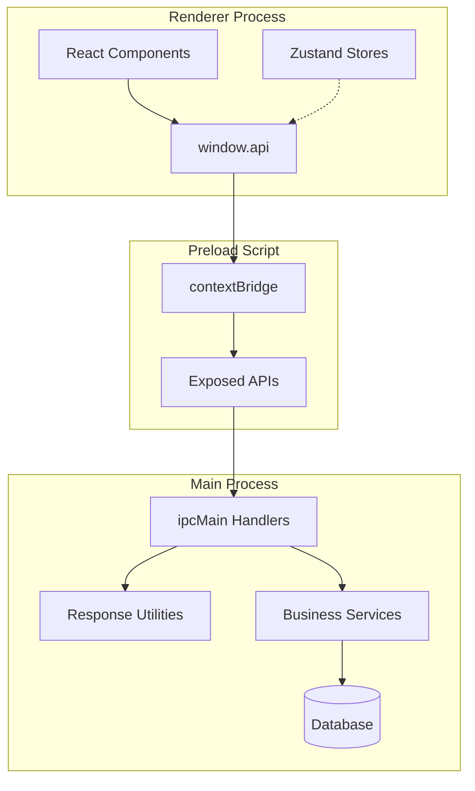
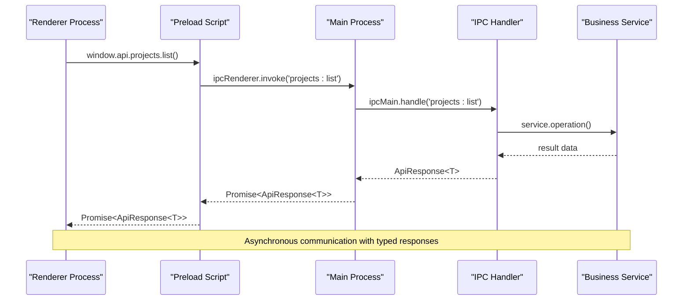
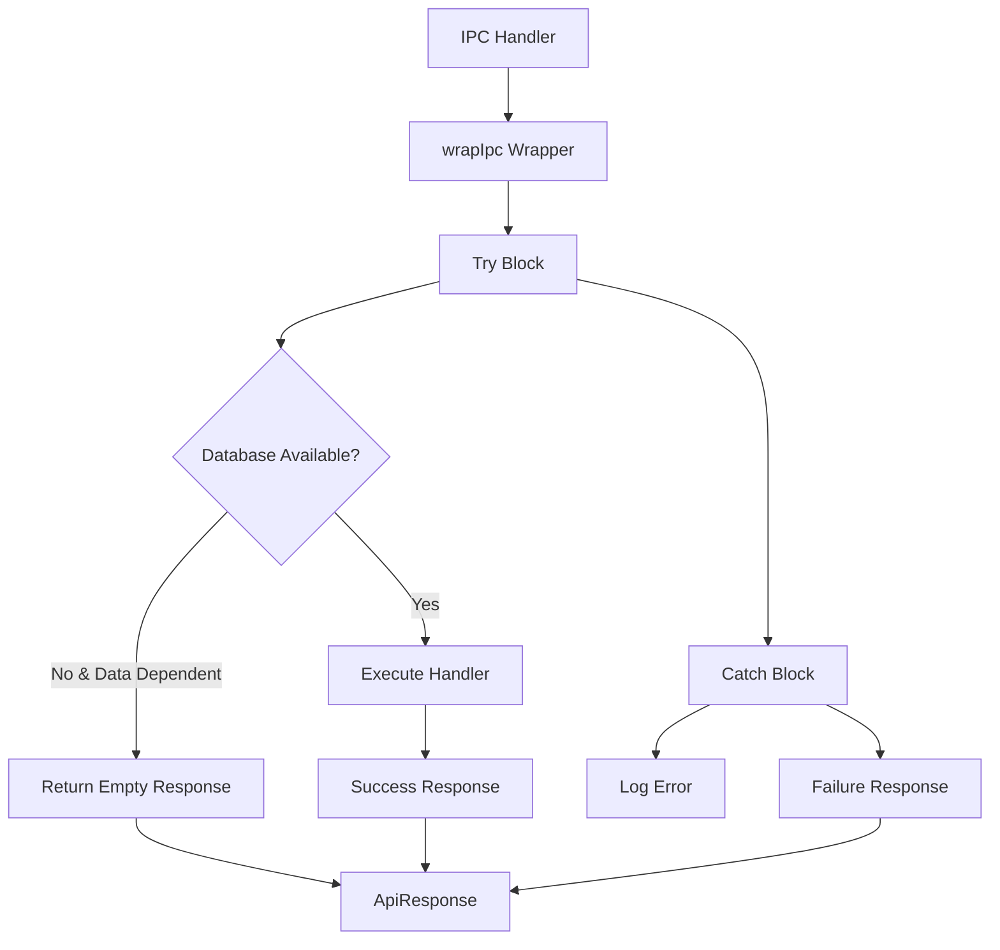
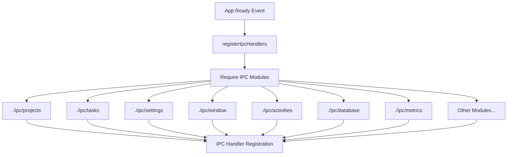
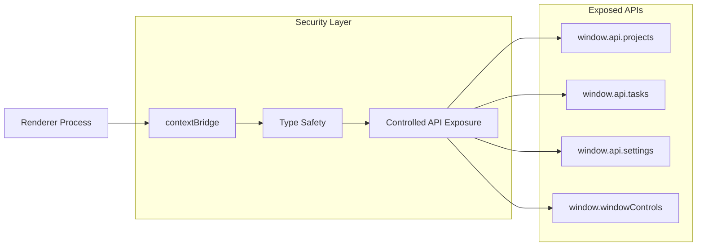
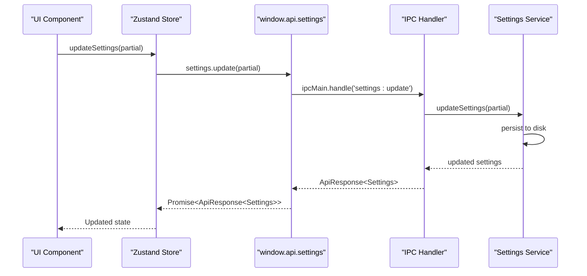
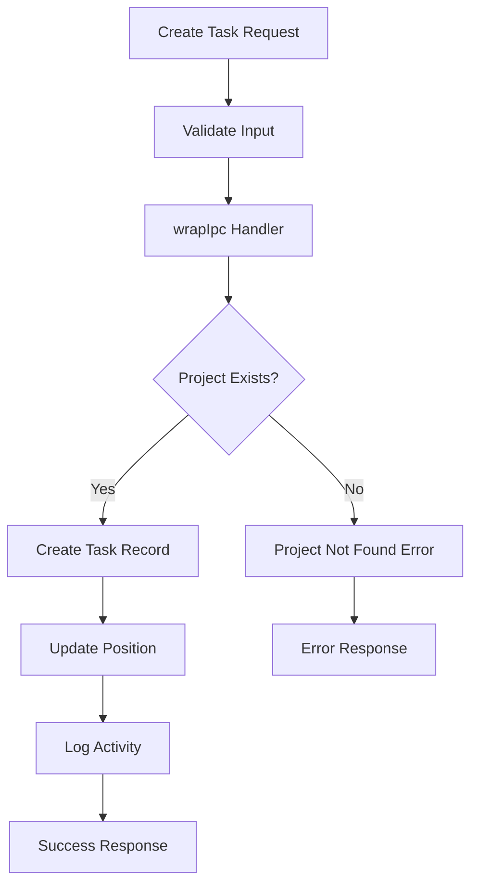
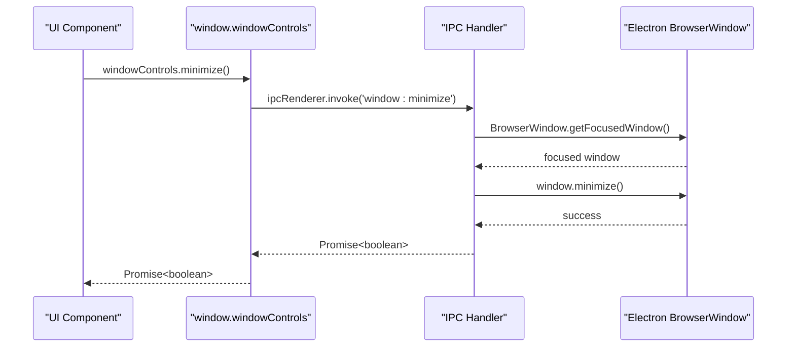
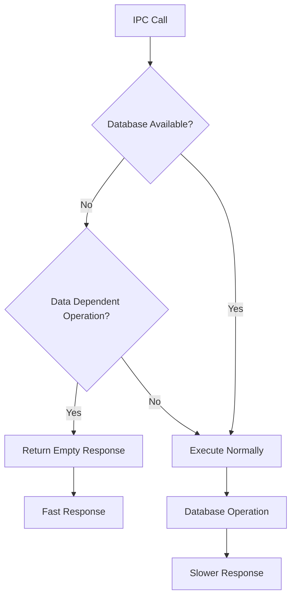
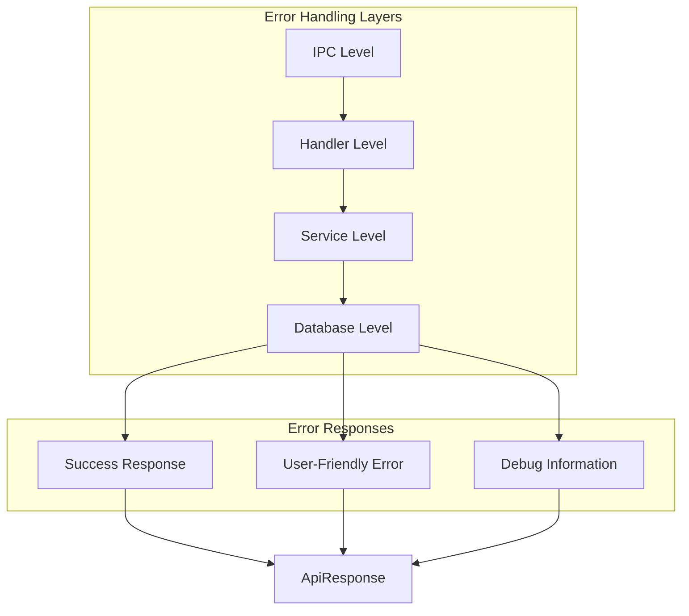

# IPC Communication System

<cite>
**Referenced Files in This Document**
- [src/main/index.ts](file://src/main/index.ts)
- [src/preload/index.ts](file://src/preload/index.ts)
- [src/main/utils/response.ts](file://src/main/utils/response.ts)
- [src/main/ipc/projects.ts](file://src/main/ipc/projects.ts)
- [src/main/ipc/tasks.ts](file://src/main/ipc/tasks.ts)
- [src/main/ipc/settings.ts](file://src/main/ipc/settings.ts)
- [src/main/ipc/window.ts](file://src/main/ipc/window.ts)
- [src/main/ipc/database.ts](file://src/main/ipc/database.ts)
- [src/main/ipc/activities.ts](file://src/main/ipc/activities.ts)
- [src/main/ipc/metrics.ts](file://src/main/ipc/metrics.ts)
- [src/common/types.ts](file://src/common/types.ts)
- [src/renderer/store/projects.ts](file://src/renderer/store/projects.ts)
- [src/renderer/store/tasks.ts](file://src/renderer/store/tasks.ts)
- [src/renderer/pages/Dashboard.tsx](file://src/renderer/pages/Dashboard.tsx)
- [src/renderer/global.d.ts](file://src/renderer/global.d.ts)
</cite>

## Table of Contents
1. [Introduction](#introduction)
2. [System Architecture](#system-architecture)
3. [Core IPC Patterns](#core-ipc-patterns)
4. [Response Wrapping System](#response-wrapping-system)
5. [Handler Registration Mechanism](#handler-registration-mechanism)
6. [Security Implementation](#security-implementation)
7. [Common IPC Patterns](#common-ipc-patterns)
8. [Type Safety and TypeScript Integration](#type-safety-and-typescript-integration)
9. [Performance Considerations](#performance-considerations)
10. [Error Handling Strategies](#error-handling-strategies)
11. [Best Practices](#best-practices)
12. [Troubleshooting Guide](#troubleshooting-guide)

## Introduction

LifeOS implements a sophisticated Inter-Process Communication (IPC) system that enables secure and efficient communication between the Electron main process and renderer processes. The system follows a structured pattern using `ipcMain.handle()` for asynchronous request-response communication, with comprehensive error handling, type safety, and security measures.

The IPC system serves as the backbone for all cross-process communication, handling everything from database operations and settings management to window controls and real-time notifications. It provides a clean abstraction layer that separates concerns between the UI layer and the business logic layer.

## System Architecture

The LifeOS IPC system is built on Electron's IPC framework with several key architectural components:



**Diagram sources**
- [src/preload/index.ts](file://src/preload/index.ts#L180-L202)
- [src/main/index.ts](file://src/main/index.ts#L10-L18)
- [src/main/utils/response.ts](file://src/main/utils/response.ts#L1-L37)

**Section sources**
- [src/main/index.ts](file://src/main/index.ts#L10-L18)
- [src/preload/index.ts](file://src/preload/index.ts#L180-L202)

## Core IPC Patterns

### Request-Response Pattern with ipcMain.handle()

LifeOS primarily uses the `ipcMain.handle()` pattern for asynchronous communication, which provides a promise-based interface for request-response interactions:



**Diagram sources**
- [src/preload/index.ts](file://src/preload/index.ts#L18-L25)
- [src/main/ipc/projects.ts](file://src/main/ipc/projects.ts#L8-L20)

### Handler Implementation Patterns

Each IPC module follows a consistent pattern for implementing handlers:

1. **Direct Handlers**: Simple synchronous operations
2. **Wrapped Handlers**: Operations with automatic error wrapping
3. **Database Operations**: Data-dependent operations with availability checks

**Section sources**
- [src/main/ipc/window.ts](file://src/main/ipc/window.ts#L3-L26)
- [src/main/ipc/projects.ts](file://src/main/ipc/projects.ts#L8-L83)
- [src/main/ipc/database.ts](file://src/main/ipc/database.ts#L47-L54)

## Response Wrapping System

LifeOS implements a comprehensive response wrapping system that standardizes error handling and provides consistent API responses across all IPC operations.

### ApiResponse Type Definition

The system uses a standardized response format:

```typescript
interface ApiResponse<T> {
  ok: boolean;
  data?: T;
  error?: string;
}
```

### Response Utility Functions

The response utility module provides three primary functions:

1. **success<T>(data: T)**: Creates successful responses
2. **failure(error: string)**: Creates error responses
3. **wrapIpc<T>(handler: T)**: Higher-order function that wraps handlers with automatic error handling



**Diagram sources**
- [src/main/utils/response.ts](file://src/main/utils/response.ts#L14-L36)

### Automatic Error Handling

The `wrapIpc` function provides comprehensive error handling:

- **Database Availability Checks**: Automatically handles database unavailability scenarios
- **Graceful Degradation**: Returns empty responses when database is unavailable
- **Error Logging**: Comprehensive error logging for debugging
- **Type Safety**: Maintains type information through generics

**Section sources**
- [src/main/utils/response.ts](file://src/main/utils/response.ts#L14-L36)

## Handler Registration Mechanism

LifeOS implements a centralized handler registration system that ensures all IPC handlers are properly registered before the application starts.

### Centralized Registration

The main process registers all IPC handlers through a central function:



**Diagram sources**
- [src/main/index.ts](file://src/main/index.ts#L10-L18)

### Module-Level Registration

Individual IPC modules can choose between two registration patterns:

1. **Immediate Registration**: Handlers are registered immediately when the module loads
2. **Centralized Registration**: Handlers are registered through the central system

**Section sources**
- [src/main/index.ts](file://src/main/index.ts#L10-L18)
- [src/main/ipc/settings.ts](file://src/main/ipc/settings.ts#L5-L27)

## Security Implementation

LifeOS implements robust security measures to protect against common IPC vulnerabilities and ensure safe communication between processes.

### Context Isolation

The application uses Electron's context isolation feature to prevent renderer processes from accessing Node.js APIs directly:

```typescript
webPreferences: {
  nodeIntegration: false,
  contextIsolation: true,
  preload: path.join(__dirname, '../preload/index.js')
}
```

### Preload Script Security

The preload script acts as a secure bridge between the renderer and main processes:



**Diagram sources**
- [src/preload/index.ts](file://src/preload/index.ts#L180-L202)
- [src/main/index.ts](file://src/main/index.ts#L39-L45)

### Secure API Exposure

The preload script exposes only necessary APIs through the `contextBridge`:

- **Selective Exposure**: Only specific API methods are exposed
- **Type Safety**: Strong typing prevents type coercion attacks
- **Namespace Organization**: APIs are organized into logical namespaces

**Section sources**
- [src/preload/index.ts](file://src/preload/index.ts#L180-L202)
- [src/main/index.ts](file://src/main/index.ts#L39-L45)

## Common IPC Patterns

LifeOS implements several common IPC patterns that demonstrate best practices for different types of operations.

### Settings Management Pattern

Settings operations demonstrate the typical CRUD pattern with immediate persistence:



**Diagram sources**
- [src/main/ipc/settings.ts](file://src/main/ipc/settings.ts#L5-L27)
- [src/renderer/store/projects.ts](file://src/renderer/store/projects.ts#L35-L71)

### Task Management Pattern

Task operations showcase complex data manipulation with validation:



**Diagram sources**
- [src/main/ipc/tasks.ts](file://src/main/ipc/tasks.ts#L18-L36)
- [src/renderer/store/tasks.ts](file://src/renderer/store/tasks.ts#L40-L77)

### Window Control Pattern

Window operations demonstrate simple synchronous operations:



**Diagram sources**
- [src/main/ipc/window.ts](file://src/main/ipc/window.ts#L3-L26)
- [src/preload/index.ts](file://src/preload/index.ts#L192-L198)

**Section sources**
- [src/main/ipc/settings.ts](file://src/main/ipc/settings.ts#L5-L27)
- [src/main/ipc/tasks.ts](file://src/main/ipc/tasks.ts#L18-L36)
- [src/main/ipc/window.ts](file://src/main/ipc/window.ts#L3-L26)

## Type Safety and TypeScript Integration

LifeOS leverages TypeScript extensively to provide compile-time type safety and excellent developer experience.

### Shared Type Definitions

Common types are defined in a shared location and imported across the application:

```typescript
// Common interface definitions
interface Project {
  id: number;
  name: string;
  color?: string | null;
  icon?: string | null;
  position: number;
  createdAt: string;
  updatedAt: string;
}

interface ApiResponse<T> {
  ok: boolean;
  data?: T;
  error?: string;
}
```

### Strong Typing in Preload Scripts

Preload scripts use TypeScript to enforce strict type checking:

```typescript
const api = {
  projects: {
    list: () => ipcRenderer.invoke('projects:list') as Promise<ApiResponse<ProjectsListResult>>,
    create: (payload: CreateProjectInput) =>
      ipcRenderer.invoke('projects:create', payload) as Promise<ApiResponse<Project>>
  }
};
```

### Generic Response Types

The response wrapper maintains type information through generics:

```typescript
export function wrapIpc<T extends (...args: any[]) => any>(handler: T) {
  return async (...args: Parameters<T>): Promise<ApiResponse<Awaited<ReturnType<T>>>>
}
```

**Section sources**
- [src/common/types.ts](file://src/common/types.ts#L1-L117)
- [src/preload/index.ts](file://src/preload/index.ts#L18-L25)
- [src/main/utils/response.ts](file://src/main/utils/response.ts#L14-L36)

## Performance Considerations

LifeOS implements several performance optimization strategies for high-frequency IPC calls.

### Database Availability Optimization

The system includes intelligent database availability checks to prevent unnecessary database operations:



**Diagram sources**
- [src/main/utils/response.ts](file://src/main/utils/response.ts#L16-L22)

### Batch Operations

For operations involving multiple items, the system supports batch processing:

```typescript
// Example from Dashboard.tsx
const tasksPromises = projectsRes.data.projects.map(p => 
  window.api.tasks.listByProject(p.id)
);
const tasksResults = await Promise.all(tasksPromises);
```

### Memory Management

The system implements proper cleanup and memory management:

- **Event Listener Cleanup**: Proper removal of event listeners in React components
- **Store State Management**: Efficient state updates with minimal re-renders
- **Connection Pooling**: Reuse of database connections where appropriate

**Section sources**
- [src/main/utils/response.ts](file://src/main/utils/response.ts#L16-L22)
- [src/renderer/pages/Dashboard.tsx](file://src/renderer/pages/Dashboard.tsx#L50-L70)

## Error Handling Strategies

LifeOS implements a multi-layered error handling approach that provides both user-friendly error messages and comprehensive debugging information.

### Layered Error Handling



**Diagram sources**
- [src/main/utils/response.ts](file://src/main/utils/response.ts#L23-L36)

### Error Classification

The system distinguishes between different types of errors:

1. **User Errors**: Intended for display to end users (validation failures, permission issues)
2. **System Errors**: Internal system failures requiring logging and potential recovery
3. **Network Errors**: Database connectivity issues and timeouts
4. **Application Errors**: Business logic violations and unexpected states

### Graceful Degradation

When critical systems are unavailable, the application provides graceful degradation:

- **Database Unavailable**: Return empty collections instead of failing
- **Network Issues**: Retry mechanisms with exponential backoff
- **Resource Exhaustion**: Fallback to cached data or reduced functionality

**Section sources**
- [src/main/utils/response.ts](file://src/main/utils/response.ts#L23-L36)

## Best Practices

Based on the LifeOS implementation, several best practices emerge for IPC system design.

### Handler Design Principles

1. **Single Responsibility**: Each handler should have a single, well-defined purpose
2. **Consistent Naming**: Use consistent naming conventions across all handlers
3. **Parameter Validation**: Validate input parameters before processing
4. **Error Boundaries**: Always wrap handlers with error handling utilities

### Performance Guidelines

1. **Avoid Blocking Operations**: Keep IPC handlers lightweight and async
2. **Batch Operations**: Group related operations when possible
3. **Caching Strategies**: Implement appropriate caching for frequently accessed data
4. **Memory Efficiency**: Clean up resources promptly after operations

### Security Considerations

1. **Principle of Least Privilege**: Expose only necessary APIs to the renderer
2. **Input Validation**: Validate all inputs from the renderer side
3. **Output Sanitization**: Sanitize data before sending to the renderer
4. **Error Information**: Avoid exposing sensitive information in error messages

### Development Workflow

1. **Type Safety First**: Define types before implementing handlers
2. **Testing Strategy**: Implement comprehensive unit tests for handlers
3. **Documentation**: Document complex IPC operations and their expected behavior
4. **Monitoring**: Implement logging and monitoring for production deployments

## Troubleshooting Guide

Common issues and their solutions when working with the LifeOS IPC system.

### Handler Registration Issues

**Problem**: Handlers not responding or throwing "not found" errors
**Solution**: Verify that handlers are properly registered in the central registration function and that modules are required correctly.

**Problem**: Handlers working inconsistently
**Solution**: Check that handlers are registered before the main window is created and that there are no race conditions.

### Type Safety Issues

**Problem**: TypeScript compilation errors with IPC calls
**Solution**: Ensure that all types are properly imported and that the preload script types match the main process signatures.

**Problem**: Runtime type errors despite TypeScript compilation
**Solution**: Verify that the preload script is properly exposing the APIs and that the renderer process has access to the typed definitions.

### Performance Issues

**Problem**: Slow IPC responses affecting UI responsiveness
**Solution**: Implement proper batching, caching, and consider moving heavy operations to worker threads.

**Problem**: Memory leaks in long-running applications
**Solution**: Ensure proper cleanup of event listeners, database connections, and other resources.

### Security Concerns

**Problem**: Unexpected API exposure or security vulnerabilities
**Solution**: Review the preload script to ensure only necessary APIs are exposed and that context isolation is properly configured.

**Problem**: Cross-site scripting (XSS) vulnerabilities
**Solution**: Implement proper input validation and sanitization, especially for data sent to the renderer.

**Section sources**
- [src/main/index.ts](file://src/main/index.ts#L10-L18)
- [src/preload/index.ts](file://src/preload/index.ts#L180-L202)
- [src/main/utils/response.ts](file://src/main/utils/response.ts#L16-L36)