# IPC Core Mechanism and Architecture

<cite>
**Referenced Files in This Document**
- [src/main/index.ts](file://src/main/index.ts)
- [src/preload/index.ts](file://src/preload/index.ts)
- [src/main/utils/response.ts](file://src/main/utils/response.ts)
- [src/common/types.ts](file://src/common/types.ts)
- [src/main/ipc/projects.ts](file://src/main/ipc/projects.ts)
- [src/main/ipc/tasks.ts](file://src/main/ipc/tasks.ts)
- [src/main/ipc/database.ts](file://src/main/ipc/database.ts)
- [src/main/ipc/activities.ts](file://src/main/ipc/activities.ts)
- [src/main/ipc/metrics.ts](file://src/main/ipc/metrics.ts)
- [src/main/ipc/window.ts](file://src/main/ipc/window.ts)
- [src/main/ipc/settings.ts](file://src/main/ipc/settings.ts)
- [src/renderer/pages/Dashboard.tsx](file://src/renderer/pages/Dashboard.tsx)
- [src/renderer/global.d.ts](file://src/renderer/global.d.ts)
- [src/database/projectsRepo.ts](file://src/database/projectsRepo.ts)
- [src/database/tasksRepo.ts](file://src/database/tasksRepo.ts)
</cite>

## Table of Contents
1. [Introduction](#introduction)
2. [Architecture Overview](#architecture-overview)
3. [Core IPC Components](#core-ipc-components)
4. [Request-Response Wrapper Pattern](#request-response-wrapper-pattern)
5. [Auto-Registration System](#auto-registration-system)
6. [Context Isolation and Security](#context-isolation-and-security)
7. [Full Communication Flow](#full-communication-flow)
8. [Type Safety and TypeScript Integration](#type-safety-and-typescript-integration)
9. [Performance Considerations](#performance-considerations)
10. [Security Best Practices](#security-best-practices)
11. [Error Handling and Resilience](#error-handling-and-resilience)
12. [Practical Examples](#practical-examples)
13. [Troubleshooting Guide](#troubleshooting-guide)
14. [Conclusion](#conclusion)

## Introduction

LifeOS implements a sophisticated Inter-Process Communication (IPC) mechanism that enables secure and efficient communication between Electron's main process and renderer processes. This system leverages Electron's `ipcMain.handle` for asynchronous communication, implements a standardized response wrapper pattern, and employs context isolation for enhanced security.

The IPC architecture serves as the backbone for all data operations, user interactions, and system integrations within the application, providing a clean separation between the presentation layer and the data persistence layer while maintaining type safety and robust error handling.

## Architecture Overview

The IPC system in LifeOS follows a layered architecture that ensures clear separation of concerns and maintains security boundaries:

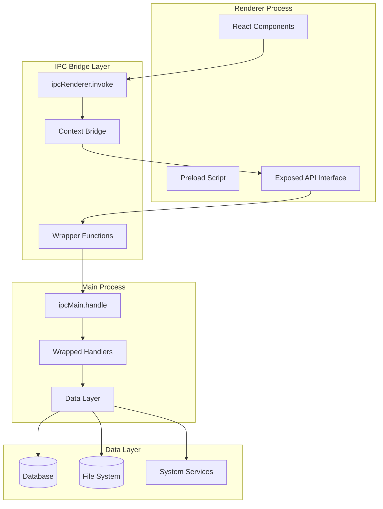

**Diagram sources**
- [src/renderer/pages/Dashboard.tsx](file://src/renderer/pages/Dashboard.tsx#L1-L50)
- [src/preload/index.ts](file://src/preload/index.ts#L1-L202)
- [src/main/index.ts](file://src/main/index.ts#L1-L123)

**Section sources**
- [src/main/index.ts](file://src/main/index.ts#L1-L123)
- [src/preload/index.ts](file://src/preload/index.ts#L1-L202)

## Core IPC Components

### Main Process Handler Registration

The main process uses `ipcMain.handle` to register asynchronous handlers that respond to renderer requests. Each IPC module exports its handlers and registers them during application startup:

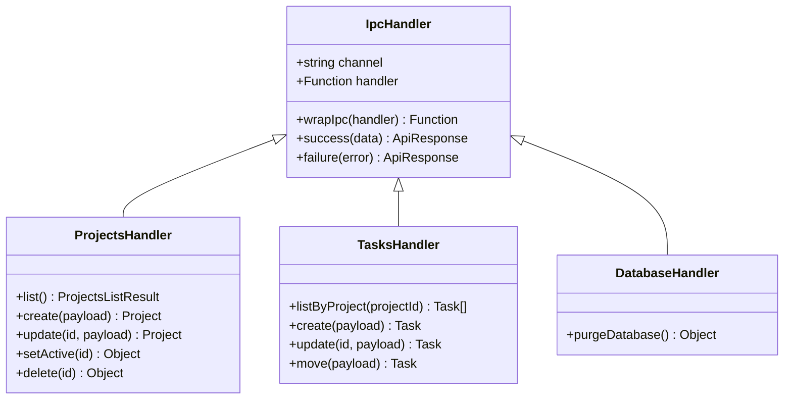

**Diagram sources**
- [src/main/ipc/projects.ts](file://src/main/ipc/projects.ts#L1-L84)
- [src/main/ipc/tasks.ts](file://src/main/ipc/tasks.ts#L1-L37)
- [src/main/ipc/database.ts](file://src/main/ipc/database.ts#L1-L55)

### Renderer Process API Exposure

The preload script exposes a typed API interface through Electron's context bridge, providing safe access to IPC channels:

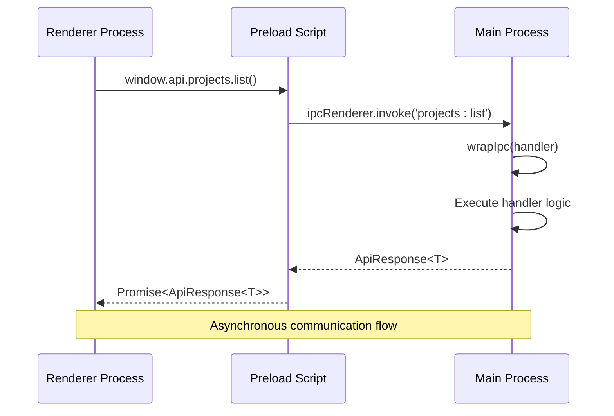

**Diagram sources**
- [src/preload/index.ts](file://src/preload/index.ts#L10-L120)
- [src/main/utils/response.ts](file://src/main/utils/response.ts#L15-L36)

**Section sources**
- [src/main/ipc/projects.ts](file://src/main/ipc/projects.ts#L1-L84)
- [src/main/ipc/tasks.ts](file://src/main/ipc/tasks.ts#L1-L37)
- [src/preload/index.ts](file://src/preload/index.ts#L10-L120)

## Request-Response Wrapper Pattern

LifeOS implements a standardized request-response wrapper pattern through the `response.ts` utility module. This pattern ensures consistent error handling and response formatting across all IPC calls.

### ApiResponse Type Definition

The core ApiResponse type provides a unified structure for all IPC responses:

| Field | Type | Description |
|-------|------|-------------|
| `ok` | `boolean` | Indicates successful operation |
| `data` | `T \| undefined` | Successful response data |
| `error` | `string \| undefined` | Error message if operation failed |

### Wrapper Function Implementation

The `wrapIpc` function provides automatic error handling and database availability checks:

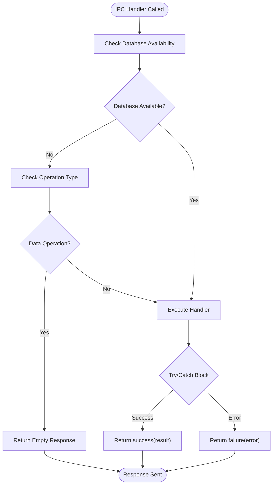

**Diagram sources**
- [src/main/utils/response.ts](file://src/main/utils/response.ts#L15-L36)

### Handler Implementation Patterns

Each IPC handler follows a consistent pattern using the wrapper:

**Section sources**
- [src/main/utils/response.ts](file://src/main/utils/response.ts#L1-L37)
- [src/main/ipc/projects.ts](file://src/main/ipc/projects.ts#L8-L84)
- [src/main/ipc/metrics.ts](file://src/main/ipc/metrics.ts#L15-L152)

## Auto-Registration System

LifeOS implements an elegant auto-registration system where IPC modules are automatically discovered and registered during application startup.

### Module Discovery and Registration

The main process maintains a centralized registration function that loads all IPC modules:

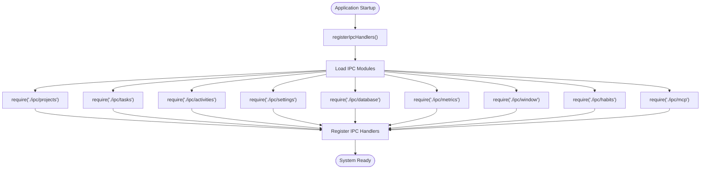

**Diagram sources**
- [src/main/index.ts](file://src/main/index.ts#L12-L18)

### Module Structure Consistency

Each IPC module follows a consistent structure that enables automatic registration:

**Section sources**
- [src/main/index.ts](file://src/main/index.ts#L12-L18)
- [src/main/ipc/projects.ts](file://src/main/ipc/projects.ts#L1-L84)
- [src/main/ipc/tasks.ts](file://src/main/ipc/tasks.ts#L1-L37)

## Context Isolation and Security

LifeOS employs Electron's context isolation feature combined with the context bridge to create a secure communication channel between the renderer and main processes.

### Security Architecture

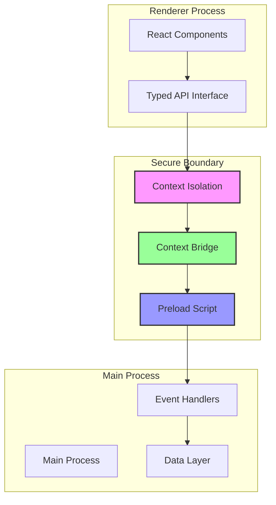

**Diagram sources**
- [src/preload/index.ts](file://src/preload/index.ts#L190-L202)
- [src/main/index.ts](file://src/main/index.ts#L39-L43)

### Context Bridge Implementation

The preload script exposes only the necessary API surface through the context bridge:

| Exposed Interface | Purpose | Security Level |
|-------------------|---------|----------------|
| `window.api` | All IPC operations | High - Typed interface |
| `window.windowControls` | Window management | Medium - Limited scope |

### Security Benefits

1. **Code Injection Prevention**: Context isolation prevents renderer code from accessing Node.js APIs directly
2. **API Surface Control**: Only explicitly exposed methods are accessible from the renderer
3. **Type Safety**: TypeScript enforces strict typing across the boundary
4. **Error Isolation**: Errors in the renderer don't crash the main process

**Section sources**
- [src/preload/index.ts](file://src/preload/index.ts#L190-L202)
- [src/main/index.ts](file://src/main/index.ts#L39-L43)

## Full Communication Flow

Understanding the complete IPC communication flow helps developers implement and debug inter-process communication effectively.

### Typical IPC Call Flow

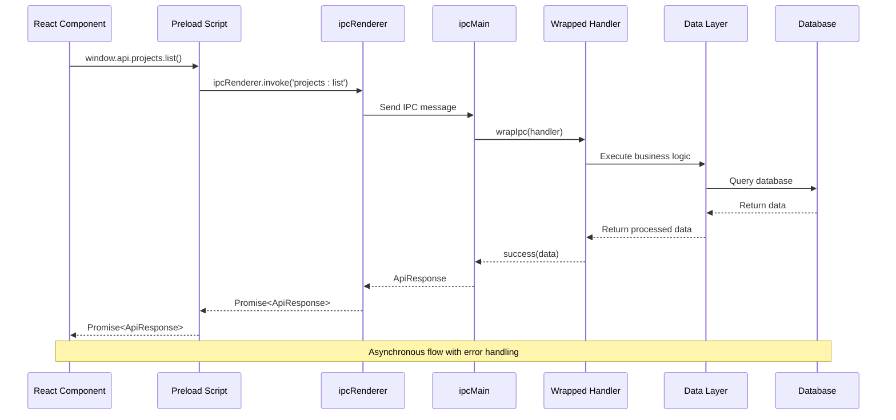

**Diagram sources**
- [src/renderer/pages/Dashboard.tsx](file://src/renderer/pages/Dashboard.tsx#L40-L60)
- [src/preload/index.ts](file://src/preload/index.ts#L10-L20)
- [src/main/utils/response.ts](file://src/main/utils/response.ts#L15-L36)

### Synchronous vs Asynchronous Considerations

LifeOS primarily uses asynchronous IPC calls for several reasons:

1. **Non-blocking UI**: Asynchronous calls prevent UI thread blocking
2. **Database Operations**: Long-running database queries don't freeze the interface
3. **Network Operations**: External service calls remain responsive
4. **Resource Management**: Proper cleanup and resource management

**Section sources**
- [src/renderer/pages/Dashboard.tsx](file://src/renderer/pages/Dashboard.tsx#L40-L60)
- [src/preload/index.ts](file://src/preload/index.ts#L10-L120)

## Type Safety and TypeScript Integration

LifeOS implements comprehensive type safety across the IPC boundary using TypeScript, ensuring compile-time validation and developer experience improvements.

### Type System Architecture

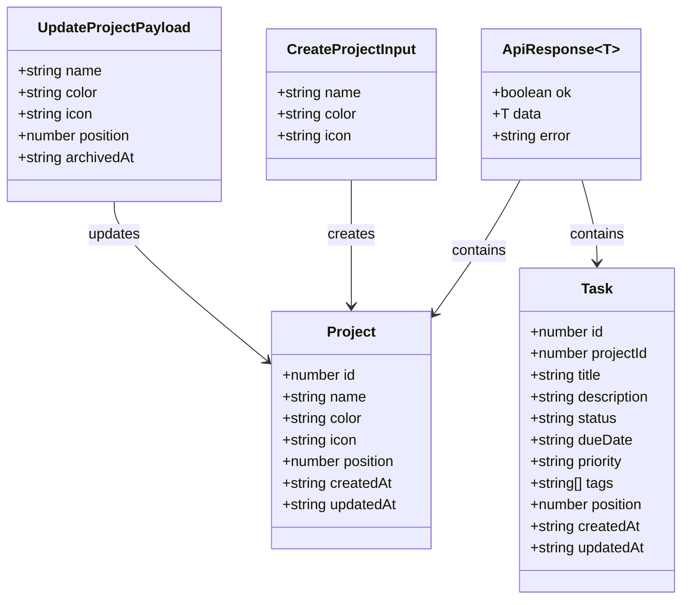

**Diagram sources**
- [src/common/types.ts](file://src/common/types.ts#L1-L117)

### Type Safety Implementation

The type system ensures safety at multiple levels:

| Level | Implementation | Benefit |
|-------|----------------|---------|
| **Parameter Types** | Zod schemas in repositories | Runtime validation |
| **IPC Signatures** | TypeScript interfaces | Compile-time checking |
| **Response Types** | Generic ApiResponse<T> | Consistent error handling |
| **Preload Types** | Explicit interface definition | Secure exposure |

### Repository-Level Validation

Database operations include comprehensive validation using Zod schemas:

**Section sources**
- [src/common/types.ts](file://src/common/types.ts#L1-L117)
- [src/database/projectsRepo.ts](file://src/database/projectsRepo.ts#L10-L25)
- [src/database/tasksRepo.ts](file://src/database/tasksRepo.ts#L10-L35)

## Performance Considerations

The IPC architecture in LifeOS is designed with performance in mind, implementing several optimization strategies for efficient inter-process communication.

### Performance Optimization Strategies

1. **Asynchronous Operations**: All IPC calls are asynchronous to prevent UI blocking
2. **Database Connection Pooling**: Efficient database connection management
3. **Transaction Batching**: Group related operations for better performance
4. **Lazy Loading**: Load data only when needed

### Memory Management

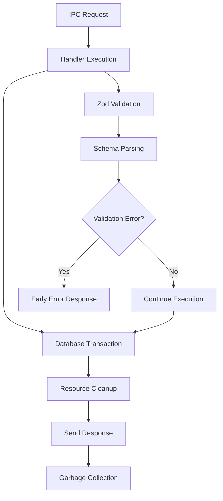

**Diagram sources**
- [src/main/utils/response.ts](file://src/main/utils/response.ts#L15-L36)
- [src/database/projectsRepo.ts](file://src/database/projectsRepo.ts#L10-L25)

### Performance Monitoring

Key performance indicators tracked in the system:

| Metric | Measurement | Impact |
|--------|-------------|---------|
| **IPC Latency** | Request-to-response time | User experience |
| **Database Queries** | Query execution time | System responsiveness |
| **Memory Usage** | Heap allocation patterns | Stability |
| **Error Rate** | Failure percentage | Reliability |

**Section sources**
- [src/main/utils/response.ts](file://src/main/utils/response.ts#L15-L36)
- [src/main/ipc/database.ts](file://src/main/ipc/database.ts#L10-L55)

## Security Best Practices

LifeOS implements multiple layers of security to protect against common vulnerabilities and ensure safe inter-process communication.

### Security Architecture Layers

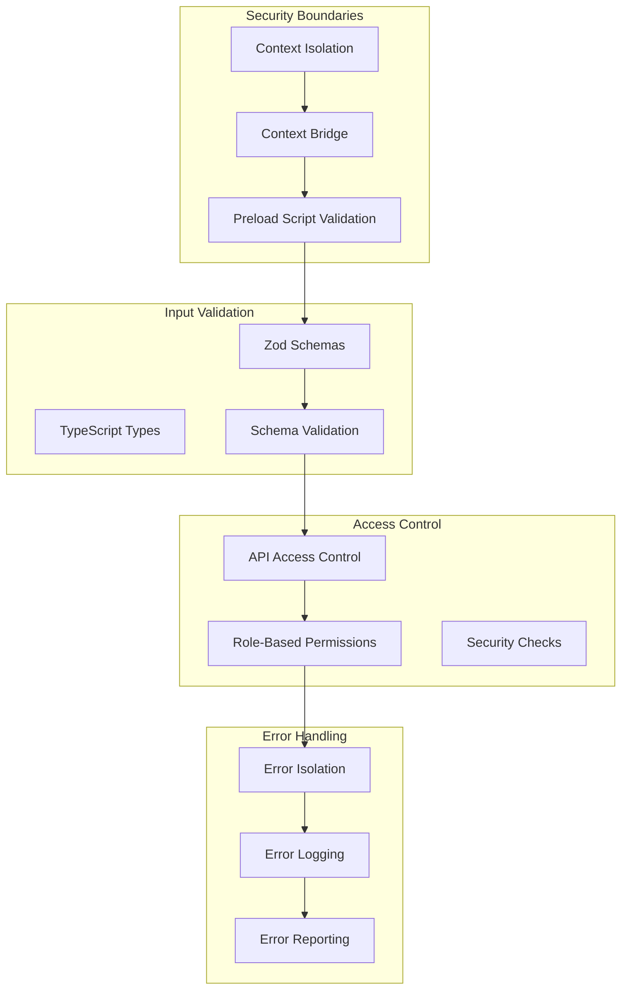

**Diagram sources**
- [src/preload/index.ts](file://src/preload/index.ts#L190-L202)
- [src/main/utils/response.ts](file://src/main/utils/response.ts#L15-L36)

### Security Measures Implemented

1. **Context Isolation**: Prevents direct access to Node.js APIs
2. **Input Validation**: Comprehensive validation using Zod schemas
3. **Type Safety**: Compile-time type checking prevents runtime errors
4. **Error Isolation**: Errors don't leak sensitive information
5. **Database Protection**: SQL injection prevention through prepared statements

### Vulnerability Mitigation

| Threat | Mitigation | Implementation |
|--------|------------|----------------|
| **SQL Injection** | Prepared statements | Database layer |
| **Code Injection** | Context isolation | Electron security |
| **Information Disclosure** | Error wrapping | Response utility |
| **API Abuse** | Typed interfaces | TypeScript enforcement |

**Section sources**
- [src/preload/index.ts](file://src/preload/index.ts#L190-L202)
- [src/main/utils/response.ts](file://src/main/utils/response.ts#L15-L36)
- [src/database/projectsRepo.ts](file://src/database/projectsRepo.ts#L10-L25)

## Error Handling and Resilience

LifeOS implements comprehensive error handling strategies that ensure system stability and provide meaningful feedback to users.

### Error Handling Architecture

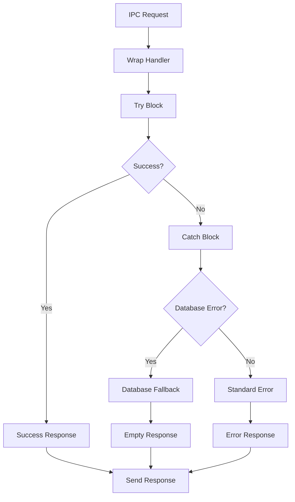

**Diagram sources**
- [src/main/utils/response.ts](file://src/main/utils/response.ts#L15-L36)

### Error Classification

The system handles different types of errors with appropriate responses:

| Error Type | Handling Strategy | User Impact |
|------------|------------------|-------------|
| **Database Unavailable** | Graceful degradation | Empty data sets |
| **Validation Errors** | Immediate rejection | Clear error messages |
| **Network Errors** | Retry mechanisms | Offline functionality |
| **System Errors** | Detailed logging | Error reporting |

### Resilience Features

1. **Graceful Degradation**: System continues operating with reduced functionality
2. **Automatic Recovery**: System attempts to recover from transient failures
3. **Comprehensive Logging**: All errors are logged for debugging
4. **User-Friendly Messages**: Technical errors are translated to user-friendly messages

**Section sources**
- [src/main/utils/response.ts](file://src/main/utils/response.ts#L15-L36)
- [src/main/ipc/database.ts](file://src/main/ipc/database.ts#L10-L55)

## Practical Examples

This section demonstrates real-world usage patterns of the IPC system through concrete examples from the LifeOS codebase.

### Example 1: Project Management Workflow

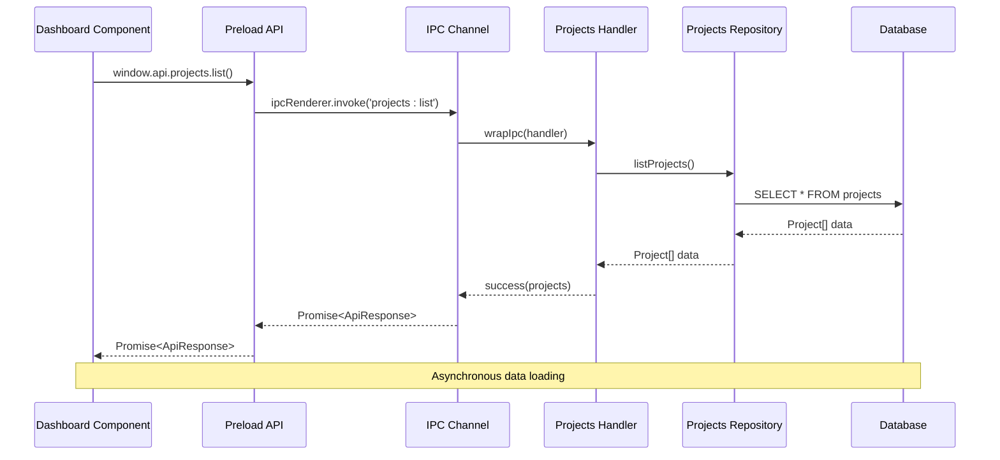

**Diagram sources**
- [src/renderer/pages/Dashboard.tsx](file://src/renderer/pages/Dashboard.tsx#L40-L60)
- [src/main/ipc/projects.ts](file://src/main/ipc/projects.ts#L8-L25)

### Example 2: Task Creation Process

The task creation process demonstrates the complete IPC flow with validation and database operations:

**Section sources**
- [src/renderer/pages/Dashboard.tsx](file://src/renderer/pages/Dashboard.tsx#L40-L60)
- [src/main/ipc/tasks.ts](file://src/main/ipc/tasks.ts#L20-L37)
- [src/database/tasksRepo.ts](file://src/database/tasksRepo.ts#L50-L80)

### Example 3: Database Purge Operation

The database purge operation showcases error handling and transaction management:

**Section sources**
- [src/main/ipc/database.ts](file://src/main/ipc/database.ts#L10-L55)
- [src/main/utils/response.ts](file://src/main/utils/response.ts#L15-L36)

## Troubleshooting Guide

Common issues and their solutions when working with the IPC system.

### Common Issues and Solutions

| Issue | Symptoms | Solution |
|-------|----------|----------|
| **Handler Not Found** | "Handler not found" error | Verify module is imported in `registerIpcHandlers()` |
| **Type Errors** | TypeScript compilation errors | Check type definitions in `types.ts` |
| **Database Connection** | "Database not initialized" | Ensure database initialization completes |
| **Context Bridge Error** | "api is undefined" | Verify preload script is loaded correctly |

### Debugging Techniques

1. **Console Logging**: Use `console.log` in IPC handlers for debugging
2. **Error Tracking**: Monitor error logs for patterns
3. **Type Checking**: Leverage TypeScript for early error detection
4. **Unit Testing**: Test IPC handlers independently

### Performance Debugging

Monitor these metrics for performance issues:

- IPC latency measurements
- Memory usage patterns
- Database query performance
- Handler execution times

**Section sources**
- [src/main/utils/response.ts](file://src/main/utils/response.ts#L15-L36)
- [src/main/index.ts](file://src/main/index.ts#L60-L85)

## Conclusion

The IPC core mechanism in LifeOS represents a well-architected solution for secure, type-safe, and performant inter-process communication in Electron applications. The system's key strengths include:

### Architectural Excellence

- **Clean Separation of Concerns**: Clear boundaries between renderer, preload, and main processes
- **Type Safety**: Comprehensive TypeScript integration ensuring compile-time validation
- **Security First**: Multiple layers of security including context isolation and input validation
- **Performance Optimization**: Asynchronous operations and efficient resource management

### Developer Experience

- **Consistent Patterns**: Standardized handler patterns and response formats
- **Comprehensive Tooling**: Built-in error handling and debugging support
- **Extensible Design**: Easy addition of new IPC modules and handlers
- **Robust Testing**: Clear separation enables effective unit testing

### Future-Proofing

The architecture supports future enhancements through its modular design, allowing for:
- Additional IPC channels without breaking existing functionality
- Enhanced security measures as threats evolve
- Performance optimizations as application complexity grows
- New data sources and external integrations

This IPC system serves as a solid foundation for building secure, scalable desktop applications with rich user experiences while maintaining the reliability and performance expectations of modern software systems.