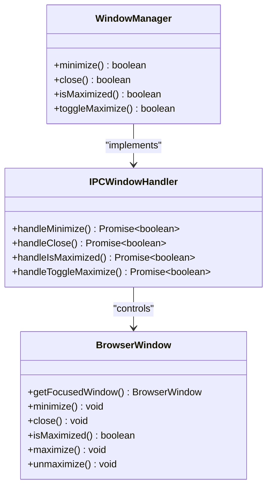
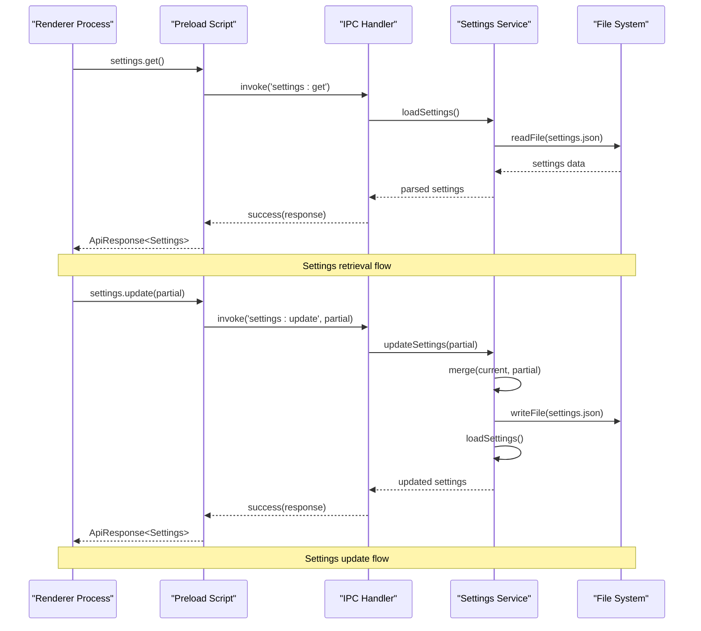
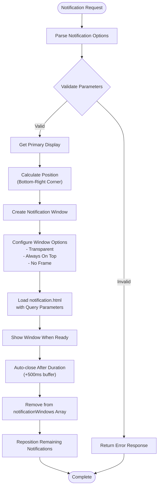
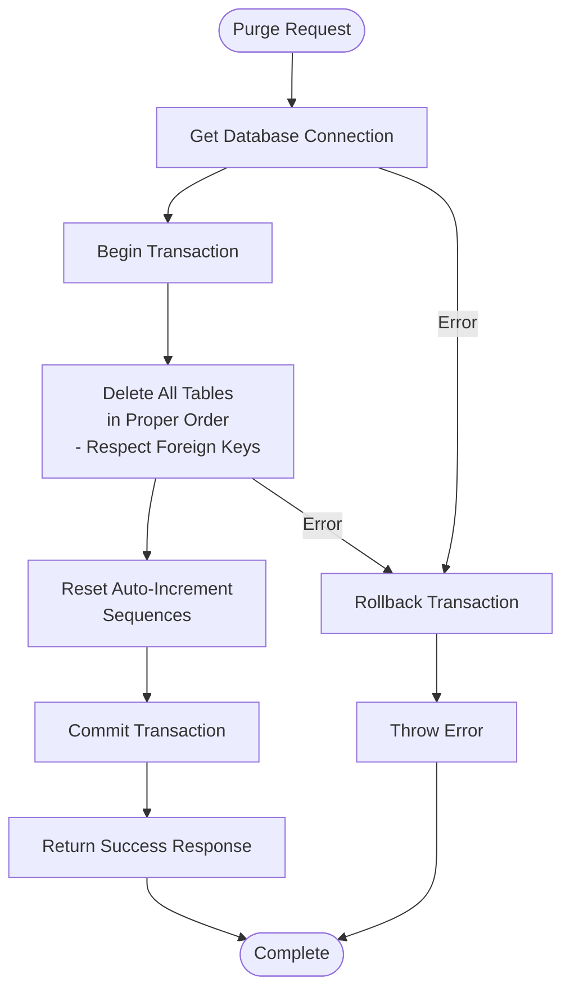
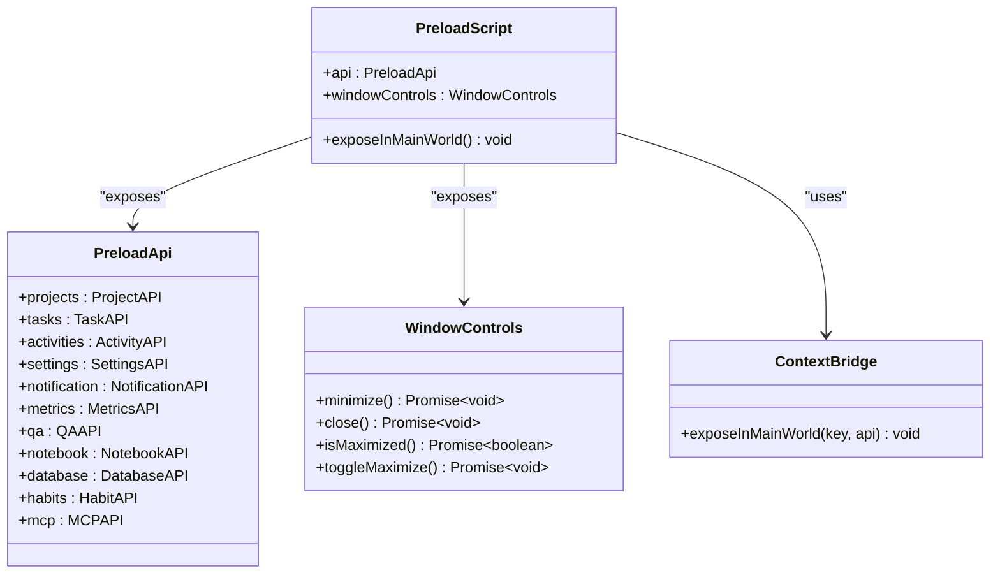
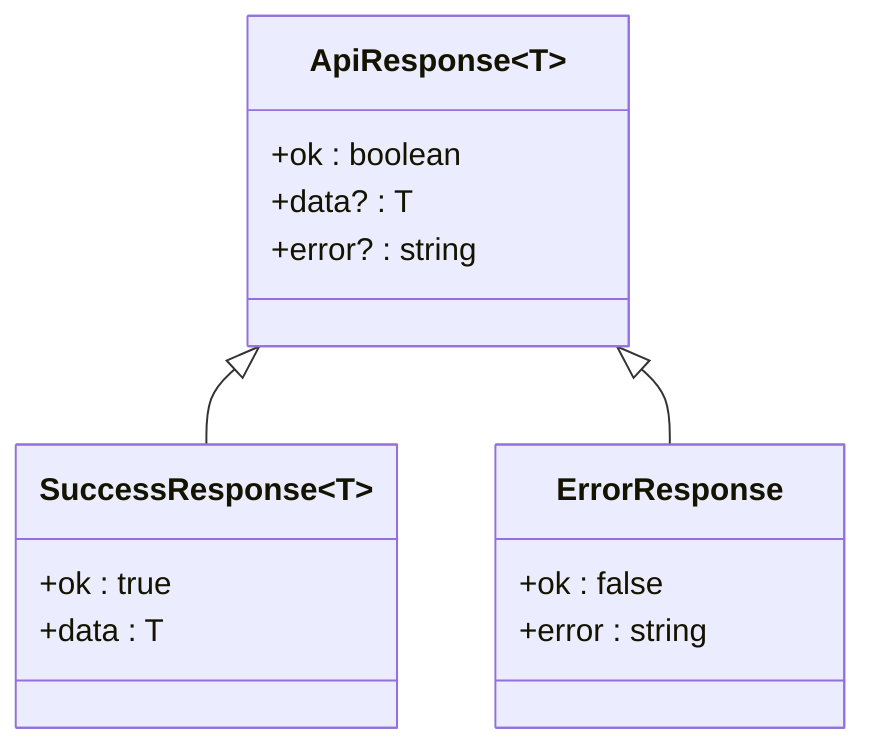

# System and Window Controls IPC

<cite>
**Referenced Files in This Document**
- [src/main/ipc/window.ts](file://src/main/ipc/window.ts)
- [src/main/ipc/settings.ts](file://src/main/ipc/settings.ts)
- [src/main/ipc/notification.ts](file://src/main/ipc/notification.ts)
- [src/main/ipc/database.ts](file://src/main/ipc/database.ts)
- [src/preload/index.ts](file://src/preload/index.ts)
- [src/renderer/components/TitleBar.tsx](file://src/renderer/components/TitleBar.tsx)
- [src/services/settings.ts](file://src/services/settings.ts)
- [src/database/init.ts](file://src/database/init.ts)
- [notification.html](file://notification.html)
- [src/main/utils/response.ts](file://src/main/utils/response.ts)
- [src/main/index.ts](file://src/main/index.ts)
</cite>

## Table of Contents
1. [Introduction](#introduction)
2. [Window Management IPC Handlers](#window-management-ipc-handlers)
3. [Settings Management System](#settings-management-system)
4. [Notification System](#notification-system)
5. [Database Operations](#database-operations)
6. [Preload Script Architecture](#preload-script-architecture)
7. [Security Considerations](#security-considerations)
8. [Error Handling and Validation](#error-handling-and-validation)
9. [Usage Examples](#usage-examples)
10. [Best Practices](#best-practices)

## Introduction

LifeOS implements a comprehensive Inter-Process Communication (IPC) system that enables secure communication between the Electron main process and renderer processes. This system provides essential functionality for window management, settings persistence, desktop notifications, and database operations while maintaining strict security boundaries through the contextBridge API.

The IPC architecture follows a modular design pattern where each major functionality area has dedicated handlers registered during application initialization. All system-level operations are protected by security measures including context isolation, type validation, and comprehensive error handling.

## Window Management IPC Handlers

### Architecture Overview

The window management system provides four core operations through IPC handlers that control the main application window's state and behavior.



**Diagram sources**
- [src/main/ipc/window.ts](file://src/main/ipc/window.ts#L1-L27)

### Window Control Operations

#### Minimize Operation
The minimize handler retrieves the currently focused window and triggers its minimize operation. This ensures that window controls operate on the active application window regardless of multi-window scenarios.

#### Close Operation
The close handler performs similar focused window detection and initiates the window closure process. This provides a clean shutdown mechanism that respects application state and user preferences.

#### Maximized State Detection
The isMaximized handler returns the current maximization state of the focused window, enabling renderer components to display appropriate UI states and provide visual feedback to users.

#### Toggle Maximize
The toggleMaximize handler implements bidirectional window state management, switching between maximized and restored states based on the current window condition.

**Section sources**
- [src/main/ipc/window.ts](file://src/main/ipc/window.ts#L1-L27)

## Settings Management System

### Persistence Architecture

The settings system implements a robust persistence mechanism that handles configuration data across application sessions while maintaining data integrity and providing real-time synchronization capabilities.



**Diagram sources**
- [src/main/ipc/settings.ts](file://src/main/ipc/settings.ts#L1-L28)
- [src/services/settings.ts](file://src/services/settings.ts#L1-L46)

### Settings Data Model

The settings system manages application configuration through a typed interface that supports various customization options:

| Setting Property | Type | Description | Default Behavior |
|------------------|------|-------------|------------------|
| `activeProjectId` | `number \| undefined` | Currently selected project identifier | No active project initially |
| `theme` | `'light' \| 'dark'` | Application theme preference | Light theme by default |
| `hideOldCompletedTasks` | `boolean` | Task filtering preference | False (show all tasks) |

### Event Broadcasting and Synchronization

While the current implementation focuses on synchronous settings operations, the architecture supports future enhancements for event-driven synchronization across multiple application windows and processes.

**Section sources**
- [src/main/ipc/settings.ts](file://src/main/ipc/settings.ts#L1-L28)
- [src/services/settings.ts](file://src/services/settings.ts#L1-L46)

## Notification System

### Desktop Notification Architecture

The notification system creates temporary browser windows that render native desktop notifications with customizable appearance and behavior. This approach leverages Electron's window management capabilities while providing a consistent cross-platform notification experience.



**Diagram sources**
- [src/main/ipc/notification.ts](file://src/main/ipc/notification.ts#L1-L115)

### Notification Window Configuration

The notification system implements sophisticated positioning and sizing logic to ensure optimal user experience:

#### Layout Calculations
- **Window Dimensions**: Fixed 400px width × 100px height
- **Positioning**: Bottom-right corner with configurable margins
- **Stacking**: Automatic vertical stacking with 16px spacing between notifications
- **Display Awareness**: Respects primary display work area boundaries

#### Visual Customization
The notification system supports multiple visual themes through CSS classes:
- **Info**: Default blue gradient with informational icon
- **Success**: Green gradient with checkmark icon
- **Error**: Red gradient with error icon
- **Warning**: Orange gradient with warning icon

#### Animation and Timing
- **Entrance Animation**: Smooth slide-in effect from right side
- **Progress Bar**: Visual countdown indicator synchronized with duration
- **Auto-dismiss**: Configurable duration with 500ms grace period

**Section sources**
- [src/main/ipc/notification.ts](file://src/main/ipc/notification.ts#L1-L115)
- [notification.html](file://notification.html#L1-L176)

## Database Operations

### Database Purge Functionality

The database purge operation implements a comprehensive data cleanup mechanism that removes all application data while preserving the database schema structure. This operation is designed for complete data reset scenarios and includes safety measures to prevent accidental data loss.



**Diagram sources**
- [src/main/ipc/database.ts](file://src/main/ipc/database.ts#L1-L55)

### Safety Considerations

#### Transaction-Based Operations
The purge operation uses SQLite transactions to ensure atomicity, guaranteeing that either all data is removed or no changes occur. This prevents partial cleanup scenarios that could leave the database in an inconsistent state.

#### Foreign Key Constraint Management
Tables are deleted in dependency order to respect foreign key relationships, preventing constraint violations that would abort the operation. The deletion sequence follows the logical hierarchy of application data.

#### Auto-Increment Sequence Reset
After data removal, auto-increment sequences are reset to ensure new records receive appropriate identifiers without conflicts from previously deleted data.

#### Error Recovery
Comprehensive error handling ensures that any failure during the purge process triggers automatic rollback, maintaining database integrity and providing meaningful error messages to users.

**Section sources**
- [src/main/ipc/database.ts](file://src/main/ipc/database.ts#L1-L55)

## Preload Script Architecture

### Context Bridge Implementation

The preload script serves as the secure bridge between the main Electron process and renderer processes, exposing only authorized APIs through the contextBridge mechanism.



**Diagram sources**
- [src/preload/index.ts](file://src/preload/index.ts#L1-L202)

### API Surface Exposure

The preload script exposes two primary interfaces:

#### Main API Interface
The comprehensive API provides access to all application functionality including project management, task tracking, activity logging, settings, notifications, metrics, Q&A, notebook operations, database management, habit tracking, and MCP server control.

#### Window Controls Interface
The specialized windowControls interface provides direct access to window management operations with minimal overhead and maximum security.

### Type Safety and Declaration

The preload script includes TypeScript declarations that enable compile-time type checking and IntelliSense support for renderer processes, ensuring safe API usage across the application.

**Section sources**
- [src/preload/index.ts](file://src/preload/index.ts#L1-L202)

## Security Considerations

### Context Isolation and Sandboxing

LifeOS implements multiple layers of security to protect against malicious code execution and unauthorized system access:

#### Context Isolation
Electron's context isolation feature prevents renderer processes from accessing Node.js APIs directly, requiring explicit exposure through the contextBridge mechanism.

#### API Surface Restriction
Only approved APIs are exposed through the contextBridge, with each exposed function undergoing security review and validation.

#### Parameter Validation
All IPC handlers implement parameter validation to prevent injection attacks and ensure data integrity.

### Window Security Measures

#### Focused Window Targeting
Window control operations target only the focused window, preventing unauthorized manipulation of other application windows.

#### Permission Boundaries
Each IPC handler operates within defined permission boundaries, ensuring that operations cannot exceed their intended scope.

### Data Protection

#### Settings File Security
Settings files are stored in the application's user data directory with appropriate file permissions to prevent unauthorized access.

#### Database Integrity
Database operations use prepared statements and transactions to prevent SQL injection and ensure data consistency.

## Error Handling and Validation

### Standardized Response Format

The IPC system implements a standardized response format that provides consistent error reporting and success confirmation across all operations.



**Diagram sources**
- [src/main/utils/response.ts](file://src/main/utils/response.ts#L1-L35)

### Error Handling Strategies

#### Graceful Degradation
When the database is unavailable, IPC handlers return empty responses rather than failing, allowing the application to continue functioning in limited capacity.

#### Comprehensive Logging
All errors are logged with sufficient context for debugging while avoiding sensitive information disclosure.

#### Type-Safe Error Messages
Error messages are consistently formatted and include appropriate error codes for client-side handling.

**Section sources**
- [src/main/utils/response.ts](file://src/main/utils/response.ts#L1-L35)

## Usage Examples

### TitleBar Component Integration

The TitleBar component demonstrates practical usage of window controls through the preload API:

```typescript
// Example usage from TitleBar.tsx
async function onMinimize() {
  // @ts-ignore - exposed by preload
  await window.windowControls.minimize();
}

async function onToggleMax() {
  // @ts-ignore
  await window.windowControls.toggleMaximize();
  // flip local state (best-effort)
  setIsMax((v) => !v);
}

async function onClose() {
  // @ts-ignore
  await window.windowControls.close();
}
```

### Settings Management Usage

Applications can retrieve and update settings asynchronously:

```typescript
// Retrieve current settings
const settingsResponse = await window.api.settings.get();
if (settingsResponse.ok) {
  const currentSettings = settingsResponse.data;
}

// Update settings partially
const updateResponse = await window.api.settings.update({
  theme: 'dark',
  hideOldCompletedTasks: true
});
```

### Notification System Usage

Trigger desktop notifications from renderer processes:

```typescript
// Show success notification
await window.api.notification.show({
  type: 'success',
  title: 'Operation Complete',
  message: 'Your task has been saved successfully',
  duration: 3000
});

// Show error notification
await window.api.notification.show({
  type: 'error',
  title: 'Save Failed',
  message: 'Please check your internet connection',
  duration: 5000
});
```

**Section sources**
- [src/renderer/components/TitleBar.tsx](file://src/renderer/components/TitleBar.tsx#L1-L63)

## Best Practices

### Window Management Best Practices

#### State Synchronization
Maintain local state synchronization with window operations to provide immediate visual feedback while handling asynchronous operations gracefully.

#### Error Handling
Always handle potential failures in window control operations, particularly when dealing with multiple windows or window state changes.

#### User Experience
Provide visual indicators for window state changes and ensure that UI controls reflect the current window state accurately.

### Settings Management Best Practices

#### Atomic Updates
Use partial updates for settings to avoid overwriting unrelated configuration options.

#### Validation
Implement client-side validation for settings changes before sending them to the main process.

#### Caching
Consider implementing client-side caching for frequently accessed settings to reduce IPC overhead.

### Notification System Best Practices

#### Duration Management
Choose appropriate notification durations based on the importance and complexity of the message content.

#### Visual Consistency
Use consistent notification types and styling to maintain a cohesive user experience.

#### Accessibility
Ensure that notification content is accessible to users with disabilities, including proper contrast ratios and screen reader support.

### Database Operations Best Practices

#### Transaction Usage
Wrap critical database operations in transactions to ensure data consistency and provide rollback capabilities.

#### Backup Considerations
Implement backup mechanisms before performing destructive operations like database purges.

#### Performance Monitoring
Monitor database operation performance and implement timeouts to prevent UI blocking.

### Security Best Practices

#### Input Validation
Validate all input parameters in IPC handlers to prevent injection attacks and ensure data integrity.

#### Permission Auditing
Regularly audit exposed APIs to ensure they remain within acceptable security boundaries.

#### Error Information
Be cautious about error message content to avoid leaking sensitive system information.