# Application Lifecycle Management

<cite>
**Referenced Files in This Document**
- [src/main/index.ts](file://src/main/index.ts)
- [src/main/devRunner.ts](file://src/main/devRunner.ts)
- [src/main/ipc/mcp.ts](file://src/main/ipc/mcp.ts)
- [src/main/ipc/window.ts](file://src/main/ipc/window.ts)
- [src/database/init.ts](file://src/database/init.ts)
- [src/database/mcpRepo.ts](file://src/database/mcpRepo.ts)
- [src/server/mcp-server.ts](file://src/server/mcp-server.ts)
- [src/preload/index.ts](file://src/preload/index.ts)
- [src/common/types.ts](file://src/common/types.ts)
- [package.json](file://package.json)
</cite>

## Table of Contents
1. [Introduction](#introduction)
2. [Application Lifecycle Overview](#application-lifecycle-overview)
3. [Initialization Sequence](#initialization-sequence)
4. [Platform-Specific Behaviors](#platform-specific-behaviors)
5. [Error Handling and Recovery](#error-handling-and-recovery)
6. [Graceful Shutdown Procedures](#graceful-shutdown-procedures)
7. [MCP Server Management](#mcp-server-management)
8. [Window Management](#window-management)
9. [Development vs Production Modes](#development-vs-production-modes)
10. [Best Practices and Recommendations](#best-practices-and-recommendations)

## Introduction

LifeOS is an Electron-based productivity application that manages a complex application lifecycle involving database initialization, MCP (Model Context Protocol) server management, and window creation. The application follows a structured initialization flow designed to ensure reliable startup, proper resource management, and graceful shutdown procedures across different platforms.

This documentation provides comprehensive coverage of the application lifecycle, from initial launch to shutdown, including platform-specific behaviors, error handling mechanisms, and the rationale behind the ordered initialization sequence.

## Application Lifecycle Overview

The LifeOS application lifecycle follows a well-defined sequence of events managed by Electron's main process. The lifecycle encompasses several critical phases:

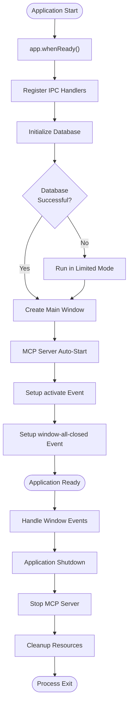

**Diagram sources**
- [src/main/index.ts](file://src/main/index.ts#L65-L121)

**Section sources**
- [src/main/index.ts](file://src/main/index.ts#L65-L121)

## Initialization Sequence

The application initialization follows a carefully orchestrated sequence designed to ensure proper resource availability and error handling:

### Phase 1: IPC Handler Registration

The first step in the initialization sequence is registering all Inter-Process Communication (IPC) handlers. This ensures that the renderer process can communicate with the main process before any window is created.

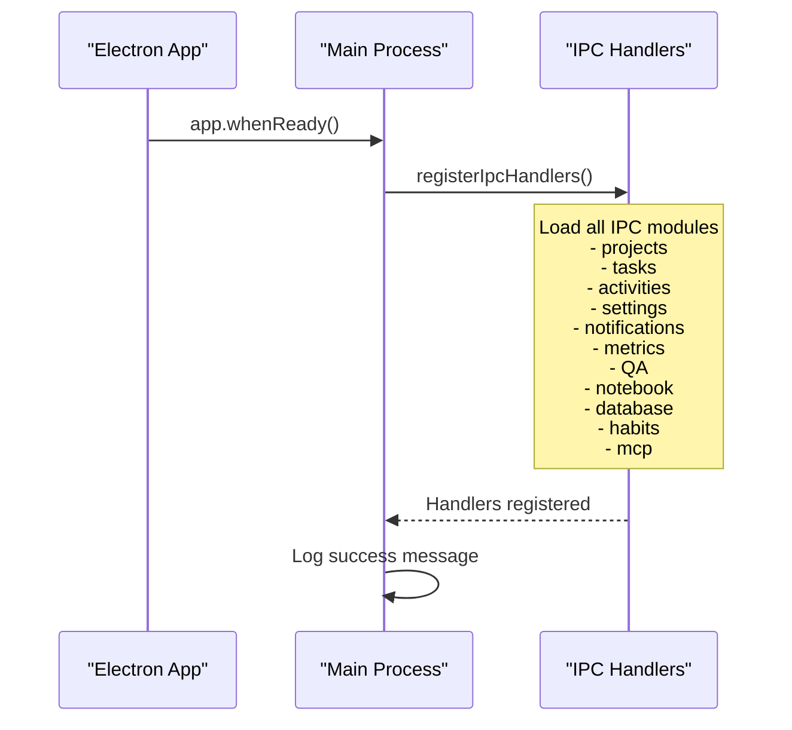

**Diagram sources**
- [src/main/index.ts](file://src/main/index.ts#L15-L25)

### Phase 2: Database Initialization

The database initialization occurs immediately after IPC handler registration. This critical phase establishes the application's data persistence layer.

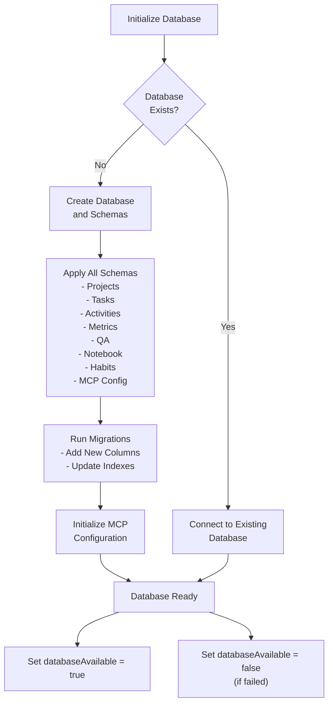

**Diagram sources**
- [src/database/init.ts](file://src/database/init.ts#L20-L40)
- [src/main/index.ts](file://src/main/index.ts#L35-L50)

### Phase 3: Window Creation

Once the database is initialized (or determined to be unavailable), the main application window is created. This window serves as the primary interface for user interaction.

### Phase 4: MCP Server Auto-Start

After window creation, the application attempts to start the MCP server if configured for auto-start. This process is skipped in development mode due to potential native module build issues.

**Section sources**
- [src/main/index.ts](file://src/main/index.ts#L15-L121)
- [src/database/init.ts](file://src/database/init.ts#L20-L149)

## Platform-Specific Behaviors

LifeOS implements platform-specific behaviors to provide optimal user experience across different operating systems:

### macOS Dock Reactivation

On macOS, the application responds to the `activate` event by recreating the main window if no windows are currently open. This behavior aligns with macOS conventions for application activation.

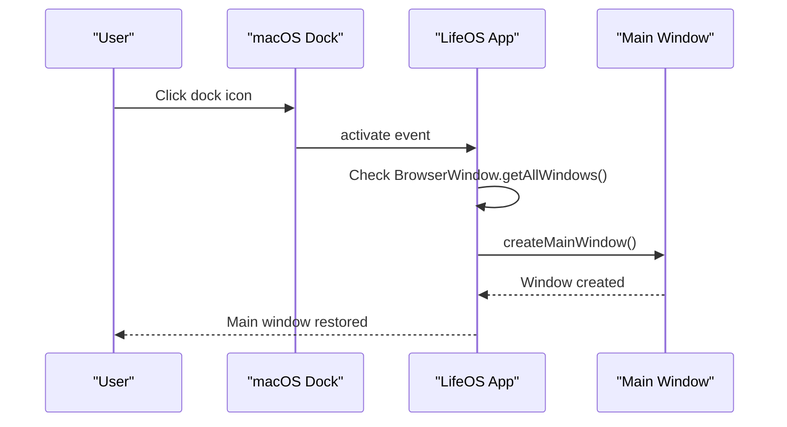

**Diagram sources**
- [src/main/index.ts](file://src/main/index.ts#L115-L119)

### Windows/Linux Window Closure

On Windows and Linux, the application quits when all windows are closed, following the convention for standalone applications.

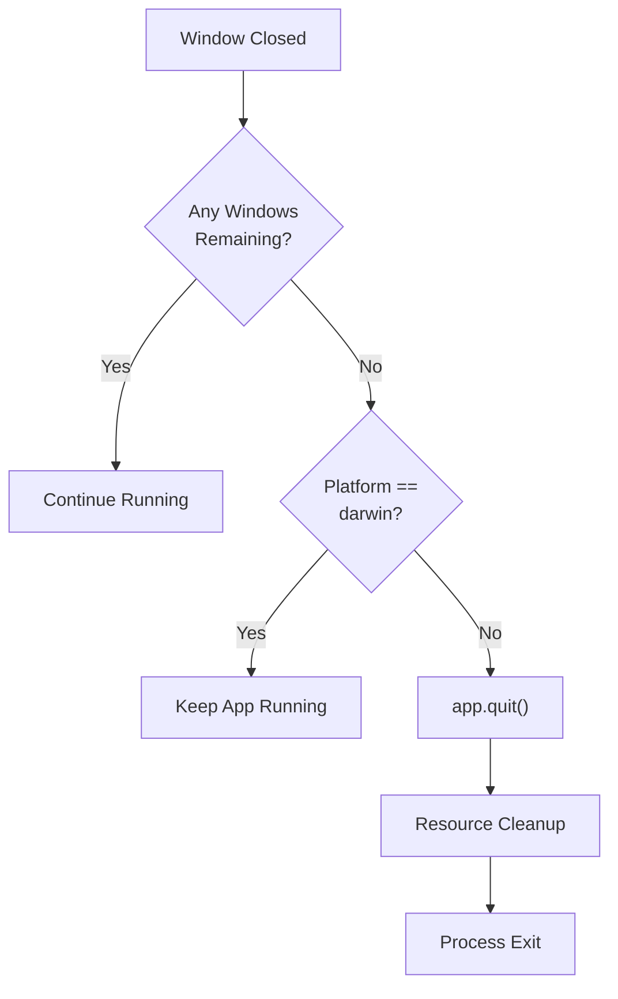

**Diagram sources**
- [src/main/index.ts](file://src/main/index.ts#L121-L123)

**Section sources**
- [src/main/index.ts](file://src/main/index.ts#L115-L123)

## Error Handling and Recovery

LifeOS implements comprehensive error handling throughout the initialization process to ensure graceful degradation and user feedback:

### Database Initialization Errors

When database initialization fails, the application continues running in a limited mode, disabling database-dependent features while maintaining core functionality.

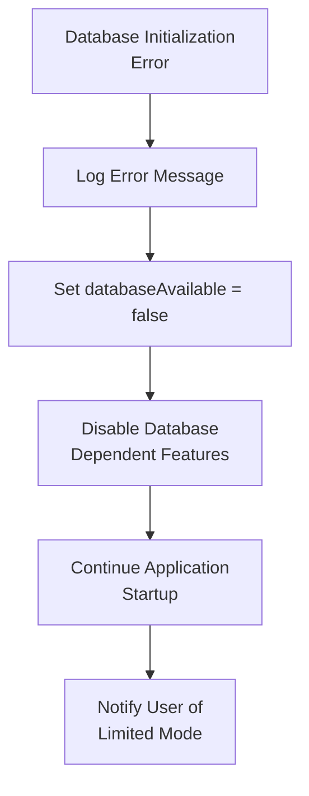

**Diagram sources**
- [src/main/index.ts](file://src/main/index.ts#L35-L50)
- [src/database/init.ts](file://src/database/init.ts#L25-L35)

### MCP Server Startup Failures

MCP server startup failures are logged as warnings and do not prevent the application from starting. The server can be manually started later if needed.

### General Application Errors

If any critical initialization step fails, the application gracefully exits using `app.quit()` to prevent unstable operation.

**Section sources**
- [src/main/index.ts](file://src/main/index.ts#L75-L85)
- [src/database/init.ts](file://src/database/init.ts#L25-L35)

## Graceful Shutdown Procedures

LifeOS implements proper shutdown procedures to ensure clean resource cleanup and data persistence:

### MCP Server Shutdown

The MCP server is stopped gracefully using signal-based termination with fallback to forced termination if necessary.

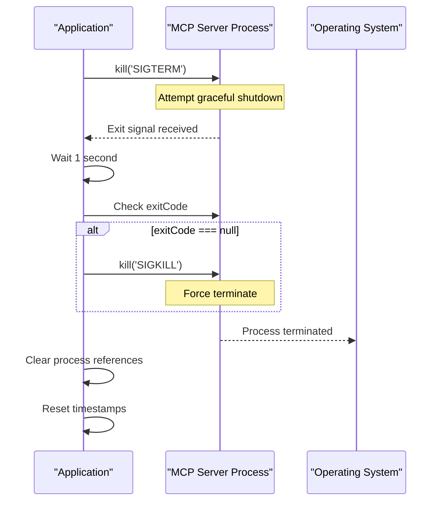

**Diagram sources**
- [src/main/ipc/mcp.ts](file://src/main/ipc/mcp.ts#L65-L85)

### Resource Cleanup

During shutdown, the application ensures proper cleanup of:
- MCP server processes
- Database connections
- Window instances
- IPC handlers

**Section sources**
- [src/main/ipc/mcp.ts](file://src/main/ipc/mcp.ts#L65-L85)

## MCP Server Management

The Model Context Protocol (MCP) server is a critical component of LifeOS that provides AI capabilities through external model providers.

### Server Architecture

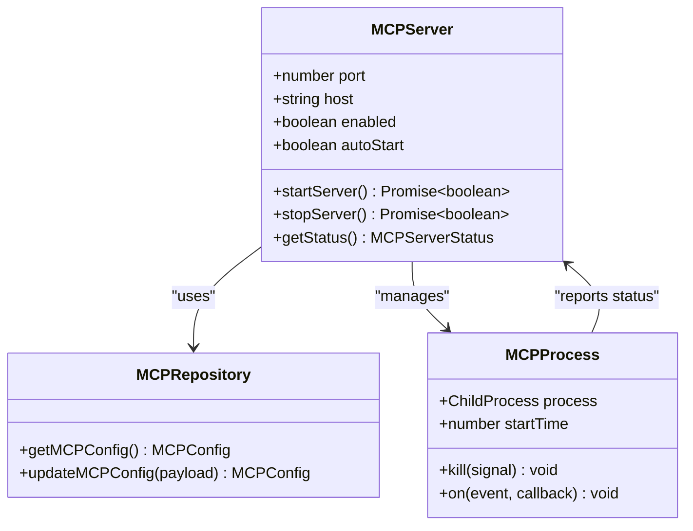

**Diagram sources**
- [src/main/ipc/mcp.ts](file://src/main/ipc/mcp.ts#L10-L151)
- [src/database/mcpRepo.ts](file://src/database/mcpRepo.ts#L1-L58)

### Auto-Start Configuration

The MCP server auto-start behavior is controlled by configuration stored in the database:

| Configuration Option | Type | Default | Description |
|---------------------|------|---------|-------------|
| `enabled` | boolean | true | Whether MCP server is enabled |
| `autoStart` | boolean | true | Whether to auto-start on app launch |
| `port` | number | 3000 | Server listening port |
| `host` | string | 'localhost' | Server binding address |

### Server Lifecycle Management

The MCP server follows a specific lifecycle managed through IPC handlers:

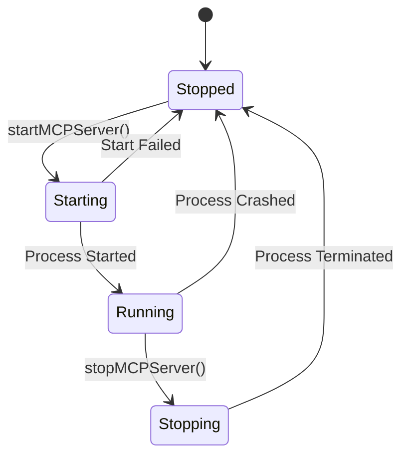

**Diagram sources**
- [src/main/ipc/mcp.ts](file://src/main/ipc/mcp.ts#L10-L151)

**Section sources**
- [src/main/ipc/mcp.ts](file://src/main/ipc/mcp.ts#L10-L151)
- [src/database/mcpRepo.ts](file://src/database/mcpRepo.ts#L1-L58)
- [src/server/mcp-server.ts](file://src/server/mcp-server.ts#L1-L89)

## Window Management

LifeOS implements sophisticated window management with support for custom titlebars and cross-platform window controls.

### Window Creation Process

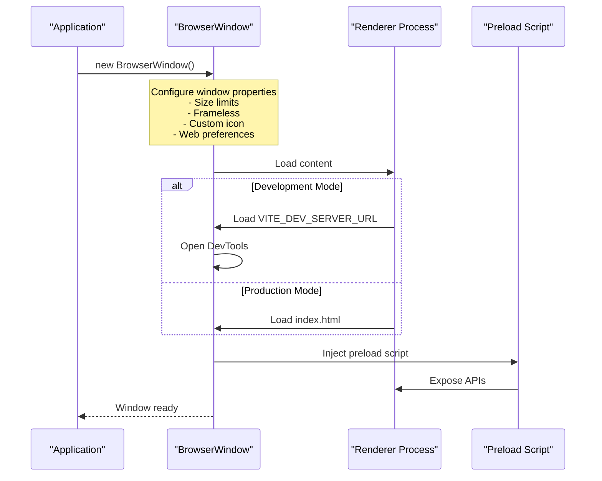

**Diagram sources**
- [src/main/index.ts](file://src/main/index.ts#L27-L60)

### Cross-Platform Window Controls

The application provides consistent window control functionality across platforms:

| Operation | Windows/Linux | macOS | Implementation |
|-----------|---------------|-------|----------------|
| Minimize | Button | Traffic light | `window.minimize()` |
| Maximize | Button | Traffic light | `window.maximize()` / `window.unmaximize()` |
| Close | Button | Traffic light | `window.close()` |

### Custom Titlebar Implementation

LifeOS uses a custom titlebar for consistent appearance across platforms, with platform-specific styling and controls.

**Section sources**
- [src/main/index.ts](file://src/main/index.ts#L27-L60)
- [src/main/ipc/window.ts](file://src/main/ipc/window.ts#L1-L26)
- [src/preload/index.ts](file://src/preload/index.ts#L190-L201)

## Development vs Production Modes

LifeOS adapts its behavior between development and production environments to optimize developer experience and application performance.

### Development Mode Features

- **Hot Reloading**: Uses Vite dev server for live reloading
- **Debug Tools**: Automatic DevTools opening
- **Source Maps**: Full debugging capabilities
- **MCP Server Skipping**: Skips MCP auto-start due to native module issues

### Production Mode Features

- **Static Assets**: Loads pre-built HTML/CSS/JS
- **Optimized Performance**: Production-optimized builds
- **Full MCP Server**: Complete MCP server functionality
- **Resource Bundling**: Packaged assets for distribution

### Environment Detection

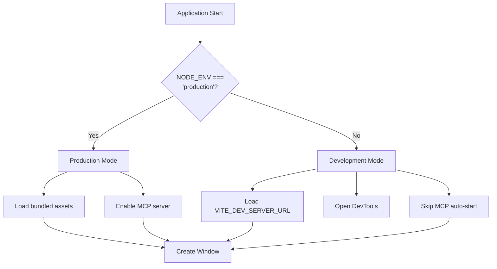

**Diagram sources**
- [src/main/index.ts](file://src/main/index.ts#L6-L10)
- [src/main/devRunner.ts](file://src/main/devRunner.ts#L1-L39)

**Section sources**
- [src/main/index.ts](file://src/main/index.ts#L6-L10)
- [src/main/devRunner.ts](file://src/main/devRunner.ts#L1-L39)

## Best Practices and Recommendations

Based on the LifeOS architecture, several best practices emerge for Electron application lifecycle management:

### Initialization Order

1. **Register IPC Handlers First**: Ensure all communication channels are available before creating windows
2. **Initialize Critical Services**: Database and essential services before UI creation
3. **Handle Failures Gracefully**: Implement fallback modes for non-critical components
4. **Platform Awareness**: Respect platform-specific conventions and behaviors

### Error Handling Strategies

1. **Progressive Enhancement**: Start with minimal functionality and enhance based on available resources
2. **User Communication**: Inform users when features are disabled due to errors
3. **Logging**: Comprehensive logging for debugging and monitoring
4. **Graceful Degradation**: Maintain core functionality even when non-critical components fail

### Resource Management

1. **Process Isolation**: Separate long-running processes (like MCP server) from the main application
2. **Signal Handling**: Properly handle shutdown signals for clean process termination
3. **Memory Management**: Monitor and manage memory usage in long-running applications
4. **Connection Pooling**: Implement connection pooling for database and network resources

### Testing and Validation

1. **Environment Testing**: Test both development and production configurations
2. **Platform Testing**: Verify behavior across different operating systems
3. **Failure Simulation**: Test error handling with simulated failures
4. **Performance Monitoring**: Monitor startup time and resource usage

The LifeOS application lifecycle management demonstrates a robust approach to Electron application development, emphasizing reliability, platform awareness, and graceful error handling. This architecture provides a solid foundation for building complex desktop applications with multiple interconnected services.