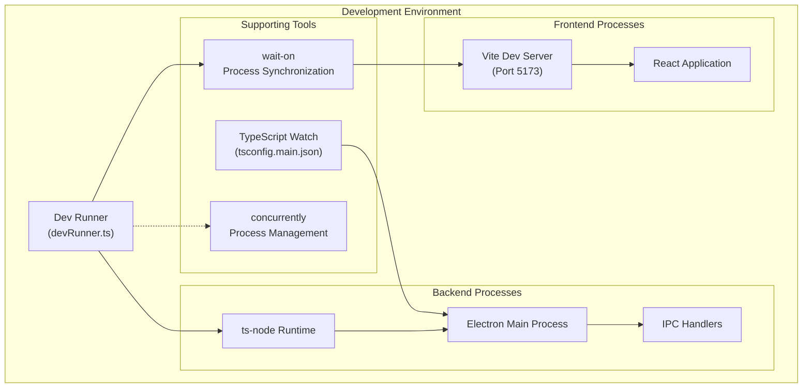
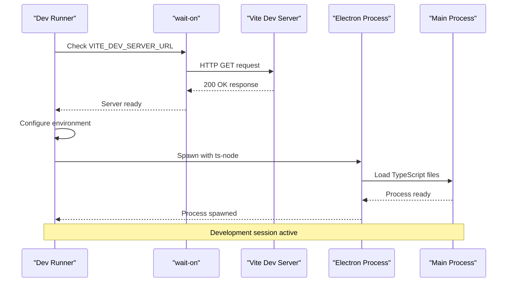
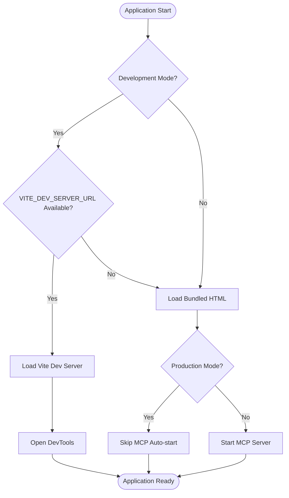
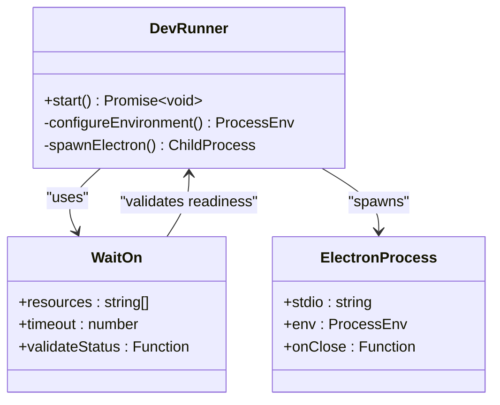
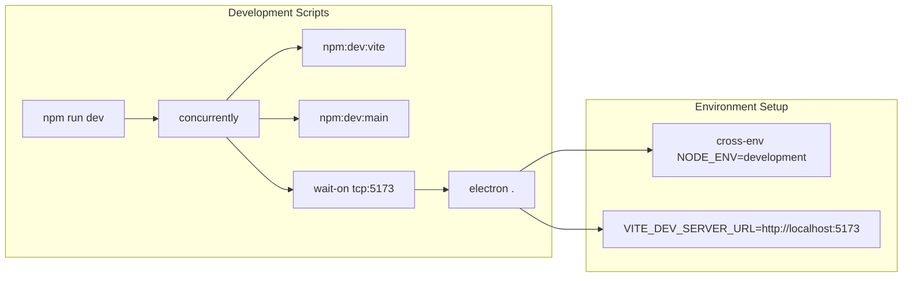

# Development Environment Integration

<cite>
**Referenced Files in This Document**
- [devRunner.ts](file://src/main/devRunner.ts)
- [package.json](file://package.json)
- [vite.config.ts](file://configs/vite.config.ts)
- [tsup.config.ts](file://configs/tsup.config.ts)
- [tsconfig.json](file://tsconfig.json)
- [tsconfig.main.json](file://tsconfig.main.json)
- [tsconfig.server.json](file://tsconfig.server.json)
- [index.ts](file://src/main/index.ts)
- [README.md](file://README.md)
</cite>

## Table of Contents
1. [Introduction](#introduction)
2. [Development Architecture Overview](#development-architecture-overview)
3. [Dev Runner Implementation](#dev-runner-implementation)
4. [Vite Development Server Integration](#vite-development-server-integration)
5. [Electron Main Process Orchestration](#electron-main-process-orchestration)
6. [Environment Variable Management](#environment-variable-management)
7. [Process Spawning and Communication](#process-spawning-and-communication)
8. [Development Workflow Configuration](#development-workflow-configuration)
9. [Troubleshooting Guide](#troubleshooting-guide)
10. [Customization Examples](#customization-examples)
11. [Best Practices](#best-practices)

## Introduction

LifeOS employs a sophisticated development environment integration that seamlessly combines Vite's fast development server with Electron's main process capabilities. The development runner serves as the orchestration layer that coordinates TypeScript compilation, hot reloading, and process communication between the frontend and backend systems.

This integration enables developers to work with modern JavaScript/TypeScript applications while maintaining the robustness and security of Electron's architecture. The system leverages advanced tools like `wait-on` for process synchronization, `ts-node` for runtime TypeScript execution, and concurrent process management for optimal development experience.

## Development Architecture Overview

The LifeOS development environment follows a multi-process architecture that separates concerns between the frontend development server and the Electron main process:



**Diagram sources**
- [devRunner.ts](file://src/main/devRunner.ts#L1-L40)
- [package.json](file://package.json#L8-L12)
- [vite.config.ts](file://configs/vite.config.ts#L1-L24)

The architecture ensures that the development server starts before Electron launches, preventing race conditions and ensuring reliable application startup. The system maintains separate compilation processes for optimal performance and developer experience.

**Section sources**
- [devRunner.ts](file://src/main/devRunner.ts#L1-L40)
- [package.json](file://package.json#L8-L12)

## Dev Runner Implementation

The development runner serves as the central coordination point for the entire development environment. It implements a sophisticated startup sequence that ensures proper timing and synchronization between all development processes.

### Core Functionality

The dev runner performs several critical functions:

1. **Server Readiness Validation**: Uses `wait-on` to confirm the Vite development server is fully operational
2. **Environment Preparation**: Configures appropriate environment variables for development
3. **Process Orchestration**: Spawns Electron with TypeScript support and proper configuration
4. **Error Handling**: Provides comprehensive error reporting and graceful failure handling

### Startup Sequence



**Diagram sources**
- [devRunner.ts](file://src/main/devRunner.ts#L6-L15)
- [devRunner.ts](file://src/main/devRunner.ts#L20-L35)

**Section sources**
- [devRunner.ts](file://src/main/devRunner.ts#L1-L40)

## Vite Development Server Integration

The Vite development server provides rapid hot module replacement and efficient asset bundling for the React frontend. The server configuration is optimized for development speed and developer productivity.

### Server Configuration

The Vite configuration establishes several key development parameters:

- **Port Configuration**: Fixed to port 5173 with strict port enforcement
- **Root Directory**: Points to the renderer source directory
- **Build Output**: Directs compiled assets to the distribution folder
- **Alias Resolution**: Provides convenient path aliases for imports

### Hot Reload Capabilities

The Vite server enables real-time development through:

- **File Watching**: Monitors source files for changes
- **Hot Module Replacement**: Updates components without full page reload
- **Fast Refresh**: Maintains component state during updates
- **Asset Optimization**: Handles CSS, images, and other assets efficiently

**Section sources**
- [vite.config.ts](file://configs/vite.config.ts#L1-L24)

## Electron Main Process Orchestration

The Electron main process serves as the backbone of the development environment, managing application lifecycle, IPC communication, and resource loading. The development runner ensures proper coordination between the main process and the Vite development server.

### Process Coordination

The main process initialization follows a carefully orchestrated sequence:

1. **IPC Handler Registration**: Loads all inter-process communication handlers
2. **Database Initialization**: Establishes local data persistence
3. **Window Creation**: Sets up the main application window
4. **Development Mode Detection**: Determines whether to load from development server or bundled files

### Window Loading Strategy

The application implements intelligent window loading based on the environment:



**Diagram sources**
- [index.ts](file://src/main/index.ts#L35-L50)
- [index.ts](file://src/main/index.ts#L75-L122)

**Section sources**
- [index.ts](file://src/main/index.ts#L1-L123)

## Environment Variable Management

The development environment relies on careful environment variable configuration to ensure proper operation across different development scenarios. The system manages both Node.js and Electron-specific environment variables.

### Key Environment Variables

| Variable | Purpose | Development Value | Production Value |
|----------|---------|-------------------|------------------|
| `NODE_ENV` | Environment mode | `development` | `production` |
| `VITE_DEV_SERVER_URL` | Development server URL | `http://localhost:5173` | N/A |
| `ELECTRON_RUN_AS_NODE` | Node execution mode | Removed | Preserved |

### Environment Configuration Process

The dev runner creates a specialized environment object that:

1. **Extends Current Environment**: Inherits all existing environment variables
2. **Sets Development Mode**: Explicitly marks the environment as development
3. **Configures Server URL**: Specifies the Vite development server endpoint
4. **Removes Conflicting Flags**: Eliminates Electron-specific Node flags

### TypeScript Execution Environment

The system uses `ts-node` for runtime TypeScript compilation, requiring specific configuration:

- **Registration**: `ts-node/register` enables TypeScript support
- **Compiler Options**: Inherits TypeScript configuration from `tsconfig.main.json`
- **Module Resolution**: Supports ES modules and CommonJS interoperability

**Section sources**
- [devRunner.ts](file://src/main/devRunner.ts#L16-L25)
- [tsconfig.main.json](file://tsconfig.main.json#L1-L29)

## Process Spawning and Communication

The development runner implements sophisticated process management to coordinate between the Vite development server and Electron main process. This section details the technical implementation of process spawning and inter-process communication.

### Child Process Management

The `spawn` function creates a new Electron process with specific configuration:



**Diagram sources**
- [devRunner.ts](file://src/main/devRunner.ts#L20-L35)

### Process Communication Patterns

The system implements several communication patterns:

1. **Synchronous Validation**: `wait-on` ensures server readiness before proceeding
2. **Asynchronous Spawning**: Electron process runs independently after validation
3. **Exit Code Propagation**: Child process exit codes are properly handled
4. **Stdio Inheritance**: Console output is forwarded to parent process

### Error Handling and Recovery

The development runner implements comprehensive error handling:

- **Startup Failures**: Graceful handling of process spawning failures
- **Timeout Management**: 60-second timeout for server readiness
- **Status Validation**: HTTP status code verification for server health
- **Logging**: Comprehensive error logging for debugging

**Section sources**
- [devRunner.ts](file://src/main/devRunner.ts#L20-L35)
- [devRunner.ts](file://src/main/devRunner.ts#L36-L40)

## Development Workflow Configuration

The development workflow is configured through npm scripts that leverage multiple tools for optimal development experience. The system uses `concurrently` for parallel process management and `wait-on` for process synchronization.

### Script Configuration

The development scripts demonstrate sophisticated process orchestration:



**Diagram sources**
- [package.json](file://package.json#L8-L12)

### Parallel Process Management

The development workflow executes multiple processes simultaneously:

1. **Vite Development Server**: Handles frontend compilation and hot reload
2. **TypeScript Watch**: Compiles main process TypeScript files
3. **Electron Launcher**: Starts the Electron application after server readiness

### Process Synchronization

The `wait-on` tool ensures proper process synchronization by:

- **TCP Port Checking**: Validates that port 5173 is available
- **HTTP Endpoint Validation**: Confirms the Vite server responds with 200 status
- **Timeout Management**: Prevents indefinite waiting with 60-second limit
- **Status Validation**: Ensures only successful HTTP responses trigger continuation

**Section sources**
- [package.json](file://package.json#L8-L12)

## Troubleshooting Guide

This section provides comprehensive guidance for resolving common development startup issues in the LifeOS environment.

### Port Conflicts

**Problem**: Vite development server fails to start due to port 5173 being occupied.

**Symptoms**:
- `EADDRINUSE` error in terminal
- Vite server fails to bind to port
- Development environment fails to initialize

**Solutions**:
1. **Check Port Usage**: Use `netstat -ano | findstr :5173` (Windows) or `lsof -i :5173` (Linux/macOS)
2. **Kill Conflicting Process**: Terminate the process using the port
3. **Change Port**: Modify `vite.config.ts` to use a different port
4. **Automatic Port Selection**: Remove `strictPort: true` to allow automatic port selection

### File Watching Problems

**Problem**: Changes to TypeScript files don't trigger compilation.

**Symptoms**:
- Code changes not reflected in running application
- TypeScript watch process appears to be stuck
- Manual restart required for changes to take effect

**Solutions**:
1. **Check File System Limits**: Increase file watcher limits on your operating system
2. **Verify File Paths**: Ensure all source files are within watched directories
3. **Restart TypeScript Watch**: Stop and restart the `dev:main` script
4. **Check for Excluded Files**: Verify files aren't excluded in `tsconfig.main.json`

### Process Communication Errors

**Problem**: Electron fails to communicate with the development server.

**Symptoms**:
- Blank application screen
- Console errors about missing resources
- Network timeouts in development tools

**Solutions**:
1. **Verify Server Status**: Check if Vite server is running and accessible
2. **Check Environment Variables**: Ensure `VITE_DEV_SERVER_URL` is properly set
3. **Network Connectivity**: Verify localhost connectivity and firewall settings
4. **Process Restart**: Restart the entire development environment

### TypeScript Compilation Issues

**Problem**: TypeScript errors prevent development server startup.

**Symptoms**:
- Compilation errors in terminal
- Red squiggly lines in IDE
- Failed type checking

**Solutions**:
1. **Run Type Checks**: Execute `npm run typecheck` to identify issues
2. **Check Configuration**: Verify `tsconfig.main.json` and `tsconfig.json` settings
3. **Clear Cache**: Delete `node_modules/.cache` and restart
4. **Dependency Issues**: Update TypeScript and related dependencies

### Memory and Performance Issues

**Problem**: Development environment becomes slow or unresponsive.

**Symptoms**:
- High memory usage
- Slow compilation times
- Application freezes during development

**Solutions**:
1. **Increase Memory Limits**: Adjust Node.js memory allocation
2. **Optimize Imports**: Reduce unnecessary module imports
3. **Disable Extensions**: Temporarily disable IDE extensions
4. **System Resources**: Monitor CPU and memory usage

**Section sources**
- [devRunner.ts](file://src/main/devRunner.ts#L6-L15)
- [vite.config.ts](file://configs/vite.config.ts#L15-L17)

## Customization Examples

This section provides practical examples for customizing the development runner for different development workflows and requirements.

### Custom Development Server Configuration

**Example**: Using a custom port for the development server:

```typescript
// Modified devRunner.ts excerpt
const devServerUrl = process.env.VITE_DEV_SERVER_URL ?? 'http://localhost:3000'; // Custom port
await waitOn({
  resources: [devServerUrl],
  timeout: 60_000,
  validateStatus: status => status === 200
});
```

**Implementation Steps**:
1. Update `VITE_DEV_SERVER_URL` environment variable
2. Modify Vite configuration port setting
3. Update wait-on resource URL
4. Restart development environment

### Custom Environment Variables

**Example**: Adding custom environment variables for development:

```typescript
const env: NodeJS.ProcessEnv = {
  ...process.env,
  NODE_ENV: 'development',
  VITE_DEV_SERVER_URL: devServerUrl,
  CUSTOM_FEATURE_FLAG: 'true',
  DEBUG_MODE: 'verbose'
};
```

**Use Cases**:
- Feature flag management
- Debug mode configuration
- Third-party service integration
- Development-specific API endpoints

### Alternative Process Management

**Example**: Using a different process manager:

```typescript
// Alternative to concurrently
import { exec } from 'child_process';

// Start Vite server
exec('npm run dev:vite', (error, stdout, stderr) => {
  if (error) {
    console.error(`Vite server error: ${error}`);
    return;
  }
  console.log(`Vite server: ${stdout}`);
});

// Start main process
exec('npm run dev:main', (error, stdout, stderr) => {
  if (error) {
    console.error(`Main process error: ${error}`);
    return;
  }
  console.log(`Main process: ${stdout}`);
});
```

### Custom Wait Conditions

**Example**: Implementing custom wait conditions:

```typescript
await waitOn({
  resources: [
    'tcp:5173',
    'http://localhost:5173/health',
    'file://./src/main/index.ts'
  ],
  interval: 1000,
  delay: 5000,
  timeout: 120_000
});
```

**Advanced Scenarios**:
- Multi-service dependencies
- File-based readiness indicators
- Custom HTTP endpoints
- Composite wait conditions

### Development Workflow Customization

**Example**: Adding pre/post hooks to development scripts:

```json
{
  "scripts": {
    "dev": "concurrently -k \"npm:dev:vite\" \"npm:dev:main\" \"wait-on tcp:5173 && cross-env NODE_ENV=development VITE_DEV_SERVER_URL=http://localhost:5173 electron .\"",
    "dev:pre": "echo 'Starting development environment...' && npm run typecheck",
    "dev:post": "echo 'Development environment ready!' && npm run lint"
  }
}
```

**Section sources**
- [devRunner.ts](file://src/main/devRunner.ts#L6-L15)
- [package.json](file://package.json#L8-L12)

## Best Practices

This section outlines recommended practices for maintaining and extending the development environment integration.

### Development Environment Maintenance

1. **Regular Updates**: Keep development dependencies updated to latest stable versions
2. **Configuration Validation**: Regularly validate Vite and TypeScript configurations
3. **Performance Monitoring**: Monitor development server performance and optimize as needed
4. **Error Logging**: Implement comprehensive error logging for development issues

### Code Organization

1. **Separation of Concerns**: Maintain clear separation between development and production code
2. **Environment Detection**: Use consistent environment detection patterns throughout the codebase
3. **Configuration Management**: Centralize configuration in dedicated configuration files
4. **Type Safety**: Leverage TypeScript for compile-time error detection

### Performance Optimization

1. **Incremental Compilation**: Utilize TypeScript's incremental compilation features
2. **File Watching Optimization**: Configure appropriate file watchers for your development environment
3. **Memory Management**: Monitor and optimize memory usage in development processes
4. **Network Efficiency**: Minimize network requests during development

### Security Considerations

1. **Environment Isolation**: Ensure development and production environments are properly isolated
2. **Dependency Auditing**: Regularly audit dependencies for security vulnerabilities
3. **Access Control**: Implement appropriate access controls for development resources
4. **Data Protection**: Protect sensitive development data and credentials

### Team Collaboration

1. **Documentation**: Maintain comprehensive documentation of development setup procedures
2. **Standardization**: Standardize development environment setup across team members
3. **Version Control**: Properly version control development configuration files
4. **Communication**: Establish clear communication channels for development issues

**Section sources**
- [devRunner.ts](file://src/main/devRunner.ts#L1-L40)
- [package.json](file://package.json#L1-L109)