# Main Process Architecture

<cite>
**Referenced Files in This Document**
- [src/main/index.ts](file://src/main/index.ts)
- [src/main/devRunner.ts](file://src/main/devRunner.ts)
- [src/main/ipc/window.ts](file://src/main/ipc/window.ts)
- [src/main/ipc/mcp.ts](file://src/main/ipc/mcp.ts)
- [src/main/ipc/projects.ts](file://src/main/ipc/projects.ts)
- [src/main/ipc/settings.ts](file://src/main/ipc/settings.ts)
- [src/main/utils/response.ts](file://src/main/utils/response.ts)
- [src/preload/index.ts](file://src/preload/index.ts)
- [src/database/init.ts](file://src/database/init.ts)
- [src/database/mcpRepo.ts](file://src/database/mcpRepo.ts)
- [src/server/mcp-server.ts](file://src/server/mcp-server.ts)
- [configs/vite.config.ts](file://configs/vite.config.ts)
- [package.json](file://package.json)
- [src/common/types.ts](file://src/common/types.ts)
</cite>

## Table of Contents
1. [Introduction](#introduction)
2. [Application Architecture Overview](#application-architecture-overview)
3. [Initialization Sequence](#initialization-sequence)
4. [Development vs Production Environment Handling](#development-vs-production-environment-handling)
5. [Database Initialization and Management](#database-initialization-and-management)
6. [Window Creation and Lifecycle](#window-creation-and-lifecycle)
7. [IPC Communication Architecture](#ipc-communication-architecture)
8. [MCP Server Orchestration](#mcp-server-orchestration)
9. [Security Implementation](#security-implementation)
10. [Error Handling and Recovery](#error-handling-and-recovery)
11. [Process Separation Benefits](#process-separation-benefits)
12. [Configuration Management](#configuration-management)
13. [Conclusion](#conclusion)

## Introduction

The LifeOS Electron main process serves as the central orchestrator for the entire application, managing application lifecycle, window creation, database initialization, and inter-process communication. Built with modern TypeScript practices and following Electron's security-first approach, the main process implements a robust architecture that separates concerns while maintaining tight integration between components.

This document provides comprehensive coverage of the main process architecture, including its initialization sequence, environment-specific behavior, security considerations, and integration patterns with both the renderer process and external MCP (Model Context Protocol) servers.

## Application Architecture Overview

The LifeOS main process follows a modular architecture pattern where responsibilities are clearly separated across different modules and subsystems.

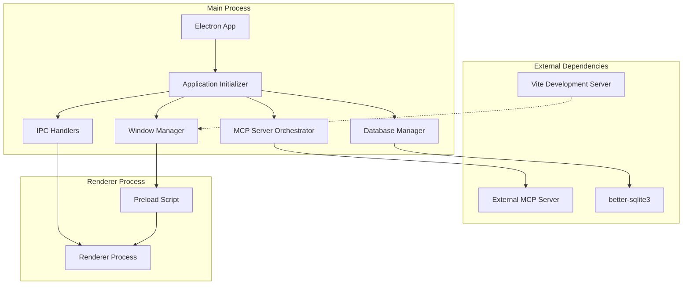

**Diagram sources**
- [src/main/index.ts](file://src/main/index.ts#L1-L123)
- [src/main/devRunner.ts](file://src/main/devRunner.ts#L1-L40)
- [src/database/init.ts](file://src/database/init.ts#L1-L150)

The architecture emphasizes:
- **Separation of Concerns**: Each module handles specific responsibilities
- **Environment Awareness**: Different behavior for development and production
- **Security First**: Strict isolation between processes
- **Modular Design**: Easy maintenance and extension

**Section sources**
- [src/main/index.ts](file://src/main/index.ts#L1-L123)
- [src/main/devRunner.ts](file://src/main/devRunner.ts#L1-L40)

## Initialization Sequence

The application initialization follows a carefully orchestrated sequence that ensures proper startup order and graceful error handling.

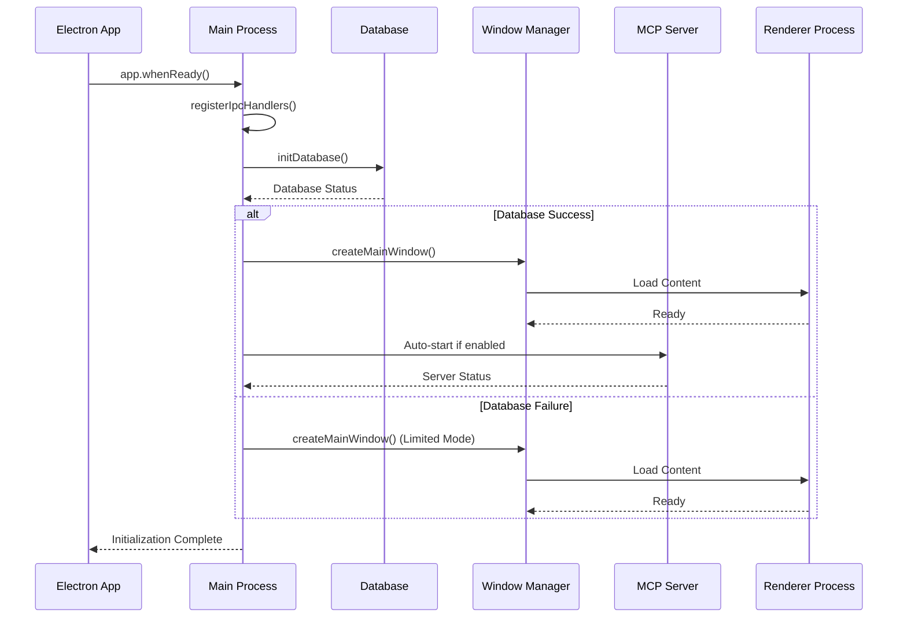

**Diagram sources**
- [src/main/index.ts](file://src/main/index.ts#L75-L123)
- [src/database/init.ts](file://src/database/init.ts#L20-L40)

### Initialization Phases

1. **IPC Handler Registration** (`registerIpcHandlers`)
   - Loads all IPC handler modules
   - Ensures Electron is ready before registration
   - Prevents race conditions during startup

2. **Database Initialization** (`initDatabase`)
   - Creates user data directory if needed
   - Establishes SQLite connection
   - Applies migrations and schema
   - Handles initialization failures gracefully

3. **Window Creation** (`createMainWindow`)
   - Sets up BrowserWindow with custom preferences
   - Loads appropriate content (dev/prod)
   - Configures security settings

4. **MCP Server Orchestration** (Conditional)
   - Checks MCP configuration
   - Starts server if auto-start enabled
   - Handles server lifecycle management

**Section sources**
- [src/main/index.ts](file://src/main/index.ts#L75-L123)
- [src/database/init.ts](file://src/database/init.ts#L20-L40)

## Development vs Production Environment Handling

The main process implements sophisticated environment detection and behavior adaptation to provide optimal development and production experiences.

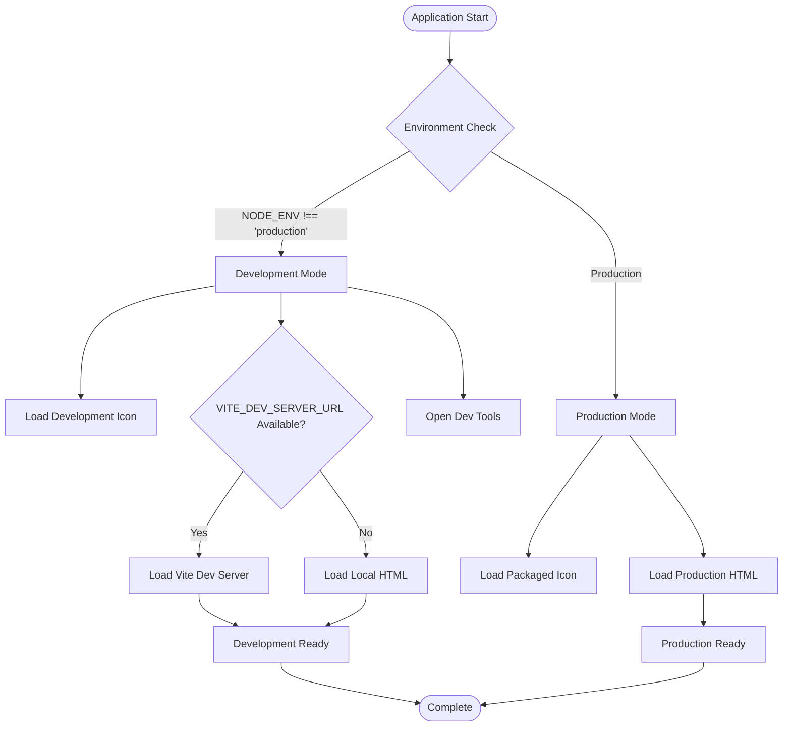

**Diagram sources**
- [src/main/index.ts](file://src/main/index.ts#L40-L65)
- [src/main/devRunner.ts](file://src/main/devRunner.ts#L1-L40)

### Development Environment Features

- **Hot Module Replacement**: Integration with Vite development server
- **Source Maps**: Enhanced debugging capabilities
- **Development Icons**: Project root logo for easy identification
- **Automatic Dev Tools**: Opened for debugging convenience
- **Error Reporting**: Detailed error messages and stack traces

### Production Environment Features

- **Packaged Resources**: Optimized resource loading
- **Secure Loading**: HTTPS and local file restrictions
- **Optimized Performance**: Compiled assets and minimal overhead
- **Stable Icons**: Embedded application icons

**Section sources**
- [src/main/index.ts](file://src/main/index.ts#L40-L65)
- [src/main/devRunner.ts](file://src/main/devRunner.ts#L1-L40)
- [configs/vite.config.ts](file://configs/vite.config.ts#L1-L24)

## Database Initialization and Management

The database initialization system provides robust data persistence with automatic migration support and graceful failure handling.

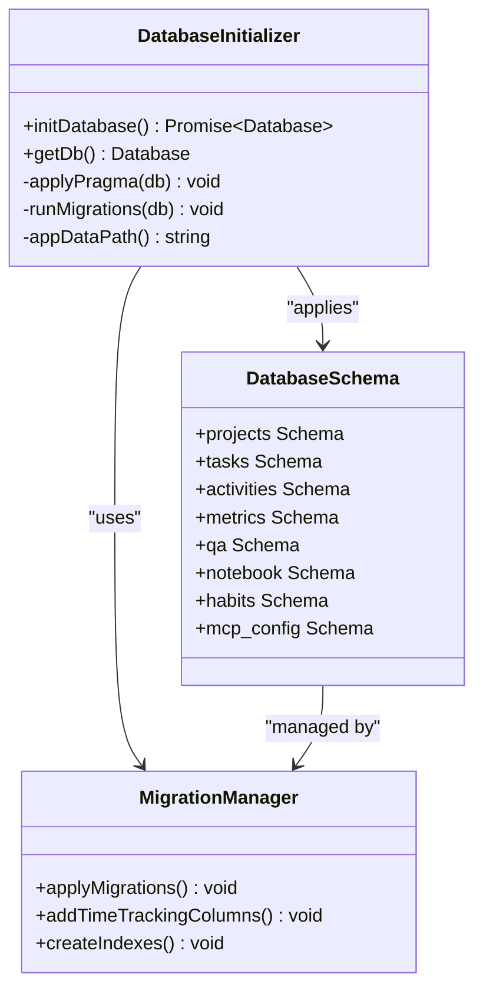

**Diagram sources**
- [src/database/init.ts](file://src/database/init.ts#L1-L150)

### Database Features

- **User Data Isolation**: Stores data in platform-appropriate user data directory
- **Automatic Migration**: Handles schema evolution and column additions
- **Foreign Key Support**: Enforces referential integrity
- **Index Optimization**: Creates performance-optimized indexes
- **Graceful Degradation**: Continues operation without database in development

### Schema Management

The database maintains multiple specialized schemas:

| Schema | Purpose | Key Tables |
|--------|---------|------------|
| Projects | Project management | projects, project_settings |
| Tasks | Task tracking | tasks, task_metadata |
| Activities | Audit trail | activities, activity_logs |
| Metrics | Performance tracking | metrics_events, metrics_config |
| QA | Question/answer system | qa_collections, qa_questions, qa_answers |
| Notebook | Note-taking | notebooks, notes, note_tags |
| Habits | Habit tracking | habits, habit_logs |
| MCP Config | Server configuration | mcp_config |

**Section sources**
- [src/database/init.ts](file://src/database/init.ts#L20-L150)

## Window Creation and Lifecycle

The window management system creates a secure, feature-rich browser window with custom titlebar support and responsive design capabilities.

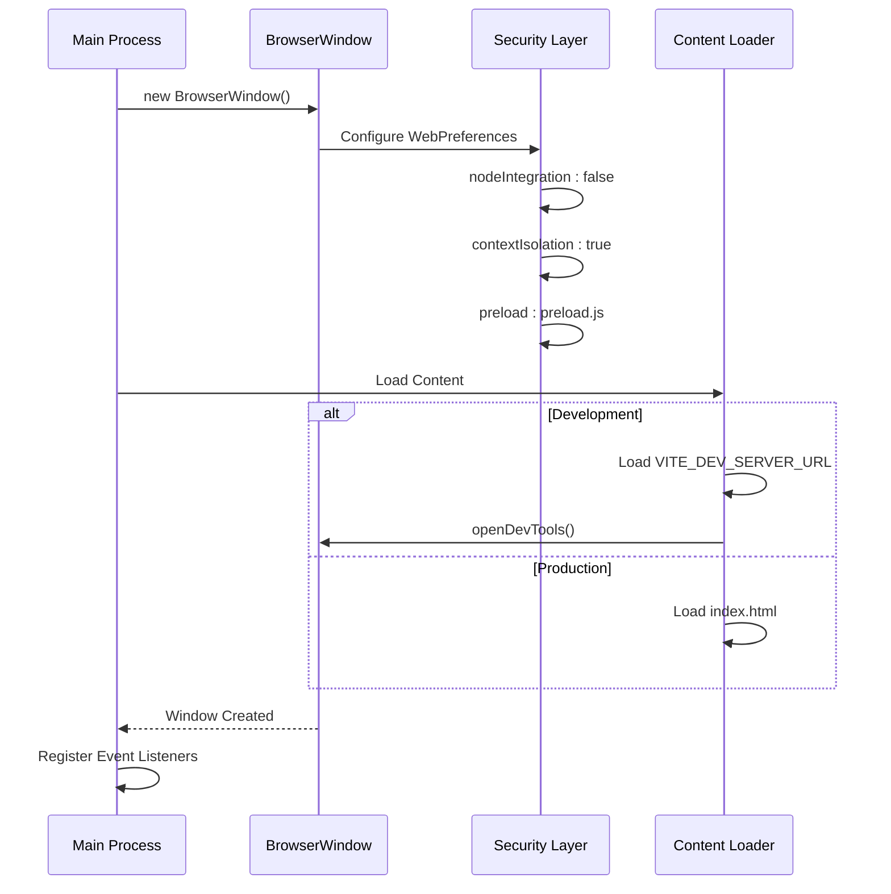

**Diagram sources**
- [src/main/index.ts](file://src/main/index.ts#L40-L65)

### Window Configuration

The main window is configured with specific security and usability features:

- **Custom Titlebar**: Frameless window with custom controls
- **Responsive Dimensions**: Minimum size constraints (800x600)
- **Security Hardening**: Disabled Node.js integration
- **Context Isolation**: Secure IPC communication channel
- **Preload Script**: Controlled API exposure to renderer

### Security Configuration

The window implements Electron's security best practices:

| Setting | Value | Purpose |
|---------|-------|---------|
| nodeIntegration | false | Prevents Node.js access in renderer |
| contextIsolation | true | Isolates preload script context |
| preload | preload.js | Controlled API bridge |
| webSecurity | true | Enforces same-origin policy |
| disableWebSecurity | false | Maintains security boundaries |

**Section sources**
- [src/main/index.ts](file://src/main/index.ts#L40-L65)

## IPC Communication Architecture

The Inter-Process Communication (IPC) system provides secure, typed communication between the main process and renderer process through a well-organized handler architecture.

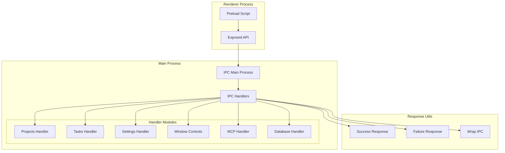

**Diagram sources**
- [src/preload/index.ts](file://src/preload/index.ts#L1-L202)
- [src/main/ipc/projects.ts](file://src/main/ipc/projects.ts#L1-L84)
- [src/main/ipc/settings.ts](file://src/main/ipc/settings.ts#L1-L28)
- [src/main/utils/response.ts](file://src/main/utils/response.ts#L1-L50)

### IPC Handler Organization

The IPC system is organized into specialized modules, each handling specific application domains:

| Handler | Purpose | Key Functions |
|---------|---------|---------------|
| window.ts | Window control | minimize, maximize, close, toggle |
| projects.ts | Project management | CRUD operations, reordering |
| tasks.ts | Task management | CRUD operations, status changes |
| settings.ts | Application settings | get, update, configuration |
| mcp.ts | MCP server control | start, stop, status, configuration |
| database.ts | Database operations | backup, restore, purge |
| activities.ts | Activity logging | create, query, stats |
| metrics.ts | Performance metrics | events, scoring, baselines |
| qa.ts | Q&A system | collections, questions, answers |
| notebook.ts | Note-taking | CRUD operations, search |
| habits.ts | Habit tracking | logs, statistics, goals |

### Response Pattern

All IPC handlers follow a consistent response pattern using utility functions:

```typescript
// Example response structure
interface ApiResponse<T> {
  ok: boolean;
  data?: T;
  error?: string;
}
```

**Section sources**
- [src/preload/index.ts](file://src/preload/index.ts#L1-L202)
- [src/main/ipc/window.ts](file://src/main/ipc/window.ts#L1-L27)
- [src/main/ipc/projects.ts](file://src/main/ipc/projects.ts#L1-L84)
- [src/main/ipc/settings.ts](file://src/main/ipc/settings.ts#L1-L28)
- [src/common/types.ts](file://src/common/types.ts#L1-L117)

## MCP Server Orchestration

The Model Context Protocol (MCP) server orchestration provides seamless integration with external AI services through a dedicated server process managed by the main process.

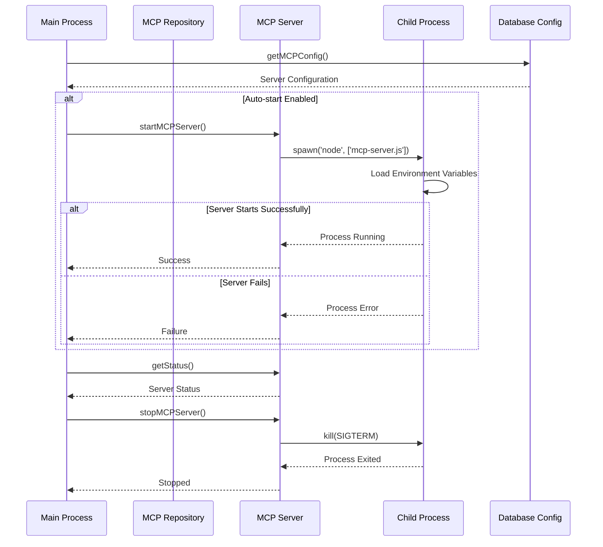

**Diagram sources**
- [src/main/ipc/mcp.ts](file://src/main/ipc/mcp.ts#L1-L151)
- [src/database/mcpRepo.ts](file://src/database/mcpRepo.ts#L1-L59)
- [src/server/mcp-server.ts](file://src/server/mcp-server.ts#L1-L80)

### MCP Server Features

- **Process Isolation**: Runs as separate Node.js process
- **Configuration Management**: Persistent server settings
- **Auto-start Capability**: Conditional server startup
- **Status Monitoring**: Real-time server health checks
- **Graceful Shutdown**: Proper process termination

### Server Configuration

The MCP server configuration is managed through the database and supports:

| Parameter | Type | Default | Description |
|-----------|------|---------|-------------|
| port | number | 3000 | Server listening port |
| host | string | localhost | Network interface binding |
| enabled | boolean | true | Enable/disable server |
| autoStart | boolean | true | Auto-start on app launch |

**Section sources**
- [src/main/ipc/mcp.ts](file://src/main/ipc/mcp.ts#L1-L151)
- [src/database/mcpRepo.ts](file://src/database/mcpRepo.ts#L1-L59)
- [src/server/mcp-server.ts](file://src/server/mcp-server.ts#L1-L80)

## Security Implementation

The main process implements comprehensive security measures following Electron's security guidelines and industry best practices.

### Security Architecture

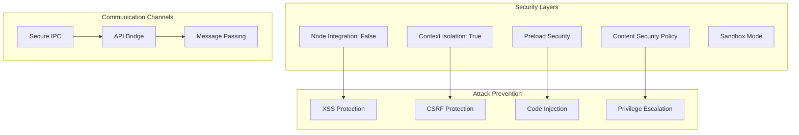

**Diagram sources**
- [src/main/index.ts](file://src/main/index.ts#L40-L65)
- [src/preload/index.ts](file://src/preload/index.ts#L1-L202)

### Security Measures

1. **Node.js Integration Control**
   - `nodeIntegration: false` - Prevents Node.js access in renderer
   - `contextIsolation: true` - Isolates preload script context
   - Custom API exposure through preload script

2. **Preload Script Security**
   - Controlled API surface exposed to renderer
   - Type-safe communication channels
   - Request/response pattern enforcement

3. **Process Isolation**
   - Main process handles sensitive operations
   - Renderer process receives only necessary APIs
   - Child processes for MCP server

4. **Communication Security**
   - Typed IPC message passing
   - Error boundary implementation
   - Response validation patterns

**Section sources**
- [src/main/index.ts](file://src/main/index.ts#L40-L65)
- [src/preload/index.ts](file://src/preload/index.ts#L1-L202)

## Error Handling and Recovery

The main process implements comprehensive error handling strategies to ensure application stability and provide meaningful feedback to users.

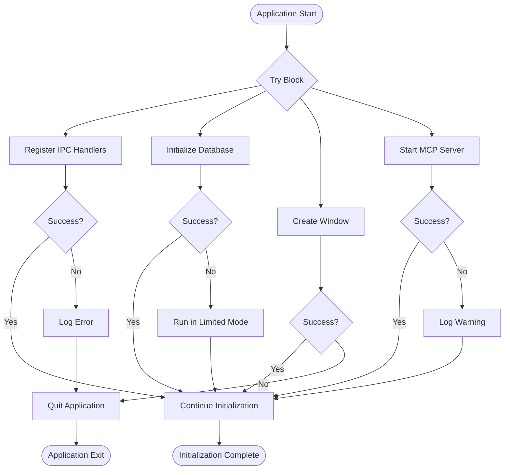

**Diagram sources**
- [src/main/index.ts](file://src/main/index.ts#L75-L123)

### Error Handling Strategies

1. **Database Failures**
   - Graceful degradation to limited functionality
   - Clear logging of initialization failures
   - User notification of reduced capabilities

2. **Window Creation Failures**
   - Immediate application termination
   - Comprehensive error reporting
   - Platform-specific cleanup

3. **MCP Server Failures**
   - Non-blocking error handling
   - Warning-level logging
   - Continued application operation

4. **IPC Handler Failures**
   - Automatic error wrapping
   - Consistent response patterns
   - Debug information preservation

### Recovery Mechanisms

- **Automatic Restart**: Application restart on critical failures
- **Graceful Degradation**: Reduced functionality modes
- **State Persistence**: Configuration and settings preservation
- **Logging Integration**: Comprehensive error tracking

**Section sources**
- [src/main/index.ts](file://src/main/index.ts#L75-L123)
- [src/database/init.ts](file://src/database/init.ts#L20-L40)

## Process Separation Benefits

The LifeOS architecture leverages process separation to enhance both security and stability, providing clear boundaries between different system components.

### Architectural Benefits

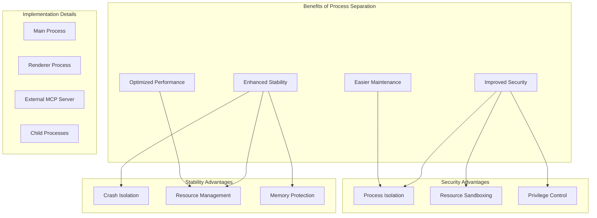

### Specific Benefits

1. **Crash Isolation**
   - Renderer process crashes don't affect main process
   - MCP server failures don't impact UI
   - Database errors don't crash the application

2. **Security Boundaries**
   - Node.js APIs isolated from renderer
   - Preload script provides controlled API access
   - Child processes operate with minimal privileges

3. **Resource Management**
   - Memory usage isolated per process
   - CPU resources allocated appropriately
   - File system access controlled

4. **Maintenance Advantages**
   - Clear separation of concerns
   - Easier debugging and testing
   - Modular component development

**Section sources**
- [src/main/index.ts](file://src/main/index.ts#L1-L123)
- [src/main/ipc/mcp.ts](file://src/main/ipc/mcp.ts#L1-L151)

## Configuration Management

The main process implements a comprehensive configuration management system that handles environment variables, application settings, and runtime behavior customization.

### Configuration Architecture

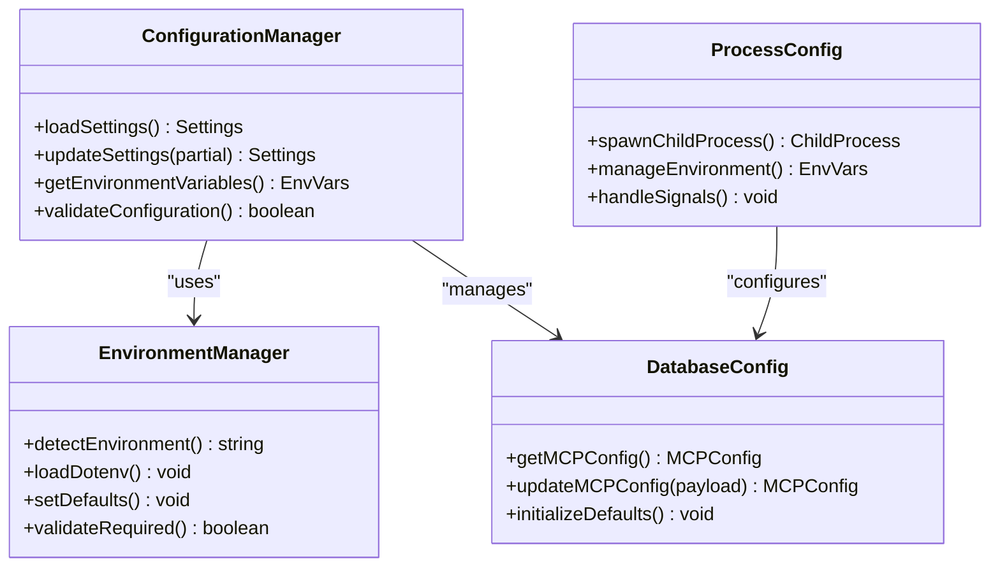

**Diagram sources**
- [src/main/ipc/settings.ts](file://src/main/ipc/settings.ts#L1-L28)
- [src/database/mcpRepo.ts](file://src/database/mcpRepo.ts#L1-L59)

### Configuration Sources

1. **Environment Variables**
   - `NODE_ENV`: Development/Production detection
   - `VITE_DEV_SERVER_URL`: Development server URL
   - `MCP_SERVER_PORT`: MCP server port
   - `MCP_SERVER_HOST`: MCP server host

2. **Database Configuration**
   - MCP server settings persistence
   - Application preferences storage
   - User customization options

3. **Runtime Configuration**
   - Development mode flags
   - Feature toggles
   - Performance settings

**Section sources**
- [src/main/index.ts](file://src/main/index.ts#L1-L123)
- [src/main/ipc/settings.ts](file://src/main/ipc/settings.ts#L1-L28)
- [src/database/mcpRepo.ts](file://src/database/mcpRepo.ts#L1-L59)

## Conclusion

The LifeOS main process architecture demonstrates a mature, security-conscious approach to Electron application development. Through careful separation of concerns, robust error handling, and comprehensive security measures, the architecture provides a solid foundation for a complex productivity application.

Key architectural strengths include:

- **Modular Design**: Clean separation between IPC handlers, database management, and external service orchestration
- **Security Focus**: Implementation of Electron's security best practices with context isolation and controlled API exposure
- **Environment Awareness**: Sophisticated handling of development and production environments
- **Resilience**: Graceful error handling and fallback mechanisms
- **Extensibility**: Well-defined patterns for adding new features and services

The architecture successfully balances functionality, security, and maintainability while providing a solid foundation for future enhancements and feature additions. The process separation model ensures that individual components can be developed, tested, and maintained independently while working together cohesively as a unified application.