# Window Creation and Management

<cite>
**Referenced Files in This Document**
- [src/main/index.ts](file://src/main/index.ts)
- [src/main/ipc/window.ts](file://src/main/ipc/window.ts)
- [src/preload/index.ts](file://src/preload/index.ts)
- [src/renderer/components/TitleBar.tsx](file://src/renderer/components/TitleBar.tsx)
- [src/renderer/global.d.ts](file://src/renderer/global.d.ts)
- [configs/vite.config.ts](file://configs/vite.config.ts)
- [src/database/init.ts](file://src/database/init.ts)
- [src/main/ipc/notification.ts](file://src/main/ipc/notification.ts)
- [package.json](file://package.json)
</cite>

## Table of Contents
1. [Introduction](#introduction)
2. [Window Creation Architecture](#window-creation-architecture)
3. [Main Window Configuration](#main-window-configuration)
4. [Environment-Specific Loading](#environment-specific-loading)
5. [Preload Script Security](#preload-script-security)
6. [Window Lifecycle Management](#window-lifecycle-management)
7. [Error Handling and Recovery](#error-handling-and-recovery)
8. [Multi-Window Support](#multi-window-support)
9. [Window State Persistence](#window-state-persistence)
10. [Custom Titlebar Implementation](#custom-titlebar-implementation)
11. [Best Practices and Guidelines](#best-practices-and-guidelines)

## Introduction

LifeOS implements a sophisticated window management system built on Electron that provides seamless development and production experiences while maintaining security and performance standards. The system features custom titlebars, environment-specific loading mechanisms, robust error handling, and comprehensive window lifecycle management.

The window creation process is orchestrated through a centralized `createMainWindow` function that handles configuration, environment detection, and resource loading while maintaining security boundaries through preload scripts and context isolation.

## Window Creation Architecture

The window management system follows a layered architecture that separates concerns between main process window creation, renderer process UI control, and security isolation through preload scripts.

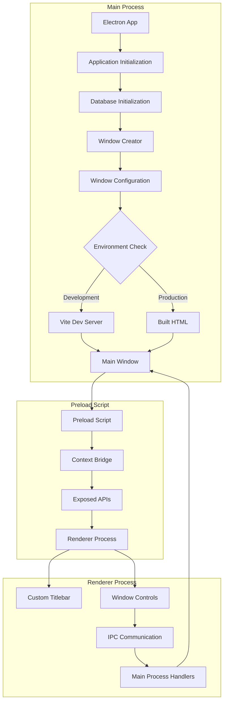

**Diagram sources**
- [src/main/index.ts](file://src/main/index.ts#L25-L60)
- [src/preload/index.ts](file://src/preload/index.ts#L1-L202)
- [src/main/ipc/window.ts](file://src/main/ipc/window.ts#L1-L27)

**Section sources**
- [src/main/index.ts](file://src/main/index.ts#L1-L123)
- [src/preload/index.ts](file://src/preload/index.ts#L1-L202)

## Main Window Configuration

The `createMainWindow` function serves as the central orchestrator for window creation, implementing comprehensive configuration options that optimize the user experience across different platforms and use cases.

### Core Configuration Options

The main window is configured with specific dimensions and appearance settings designed for productivity applications:

| Configuration Option | Value | Purpose |
|---------------------|-------|---------|
| Width | 1200px | Provides ample horizontal space for task management |
| Height | 800px | Balanced vertical space for dashboard and content |
| MinWidth | 800px | Minimum usability threshold |
| MinHeight | 600px | Essential content visibility |
| Frame | false | Enables custom titlebar implementation |
| BackgroundColor | '#121212' | Dark theme foundation with good contrast |

### Security Configuration

The window security is implemented through strict context isolation and node integration controls:

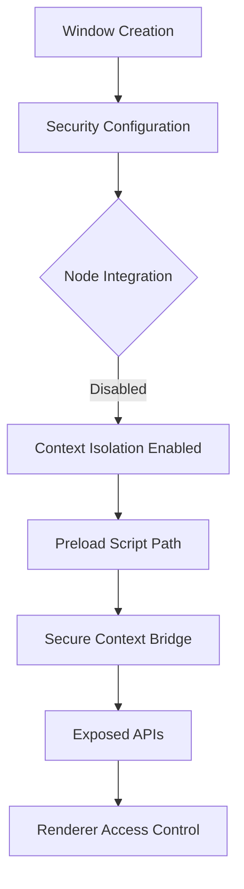

**Diagram sources**
- [src/main/index.ts](file://src/main/index.ts#L35-L45)
- [src/preload/index.ts](file://src/preload/index.ts#L190-L202)

**Section sources**
- [src/main/index.ts](file://src/main/index.ts#L25-L60)

## Environment-Specific Loading

LifeOS implements intelligent environment detection that automatically selects the appropriate loading mechanism based on the current runtime context.

### Development Mode Loading

During development, the application connects to the Vite development server for rapid iteration and hot reloading capabilities:

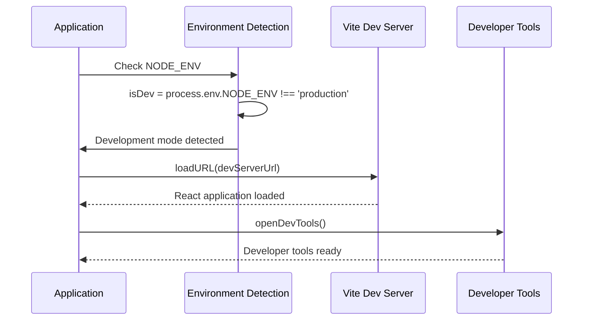

**Diagram sources**
- [src/main/index.ts](file://src/main/index.ts#L47-L52)
- [configs/vite.config.ts](file://configs/vite.config.ts#L15-L17)

### Production Mode Loading

In production, the application loads pre-built static assets for optimal performance and distribution:

The production loading mechanism ensures reliable asset delivery through path resolution and error handling:

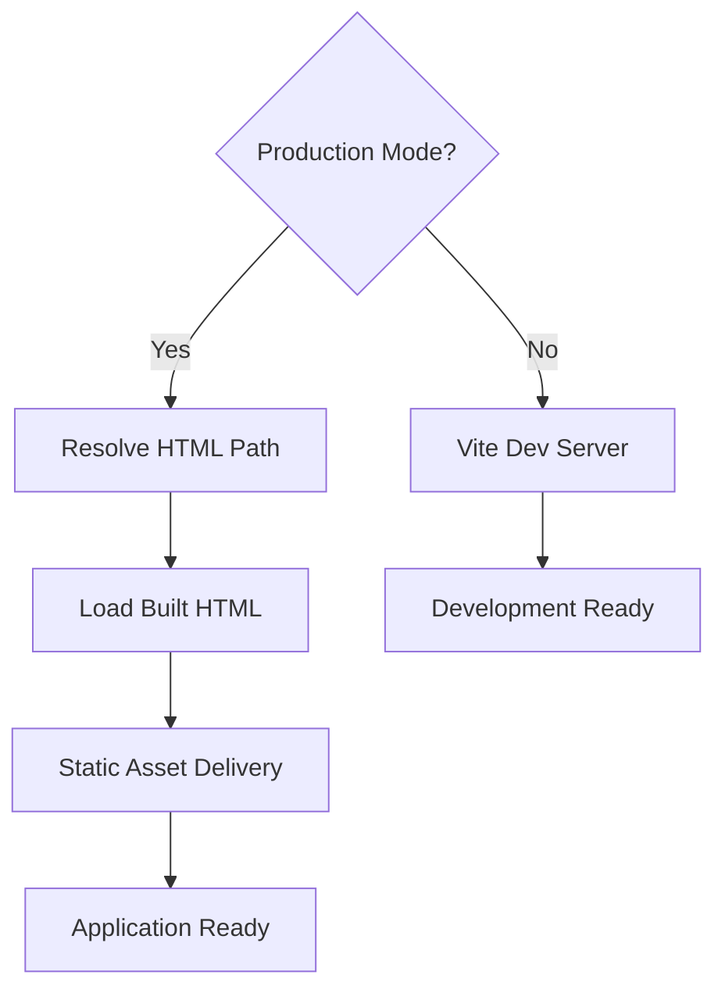

**Diagram sources**
- [src/main/index.ts](file://src/main/index.ts#L53-L56)

**Section sources**
- [src/main/index.ts](file://src/main/index.ts#L47-L56)
- [configs/vite.config.ts](file://configs/vite.config.ts#L1-L24)

## Preload Script Security

The preload script implements a secure communication bridge between the main process and renderer process while maintaining strict security boundaries.

### Context Bridge Implementation

The preload script exposes a controlled API surface through Electron's context bridge system:

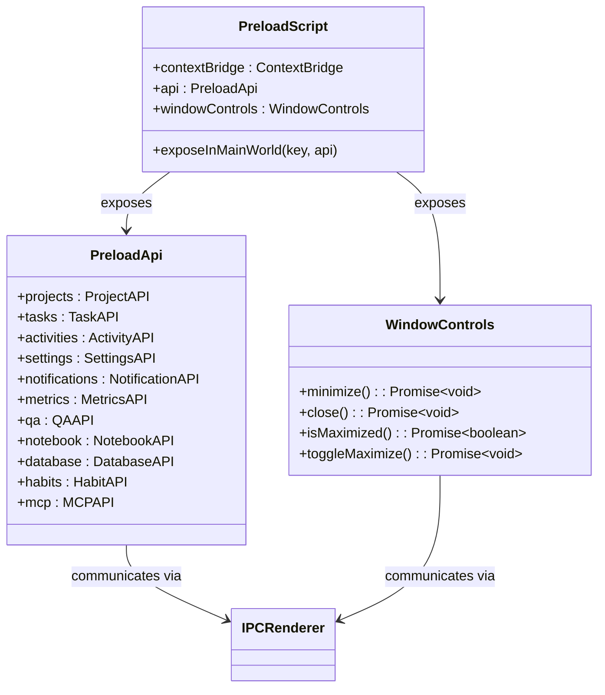

**Diagram sources**
- [src/preload/index.ts](file://src/preload/index.ts#L190-L202)
- [src/renderer/global.d.ts](file://src/renderer/global.d.ts#L1-L14)

### API Surface Exposure

The preload script carefully exposes only necessary functionality through typed interfaces:

| API Category | Methods Available | Security Level |
|-------------|------------------|----------------|
| Projects | list, create, update, delete, setActive | High |
| Tasks | listByProject, create, update, move | High |
| Activities | create, getAll, getByDateRange, delete, clear | Medium |
| Settings | get, update | Low |
| Notifications | show | Low |
| Metrics | current, daily, createEvent, getEvents | Medium |
| QA | CRUD operations for questions and answers | Medium |
| Notebook | CRUD operations for notes and notebooks | Medium |
| Habits | CRUD operations for habits | Medium |
| MCP | Configuration and server control | Low |

**Section sources**
- [src/preload/index.ts](file://src/preload/index.ts#L1-L202)
- [src/renderer/global.d.ts](file://src/renderer/global.d.ts#L1-L14)

## Window Lifecycle Management

The window lifecycle management system handles creation, state monitoring, and cleanup operations throughout the application's runtime.

### Window Reference Management

The main window reference is maintained through a global variable that enables centralized control:

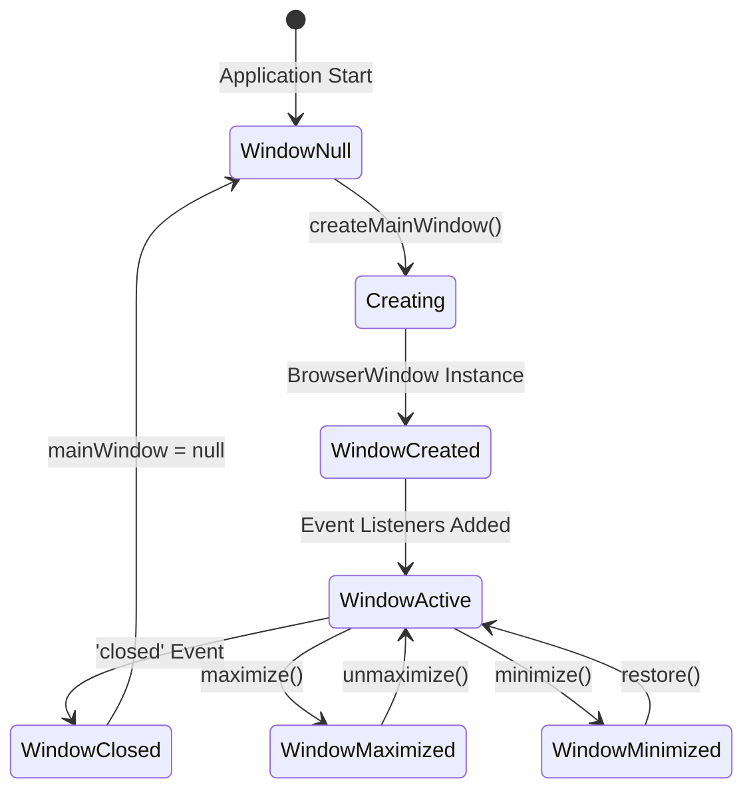

**Diagram sources**
- [src/main/index.ts](file://src/main/index.ts#L61-L63)

### Event Handling

The window system implements comprehensive event handling for various lifecycle scenarios:

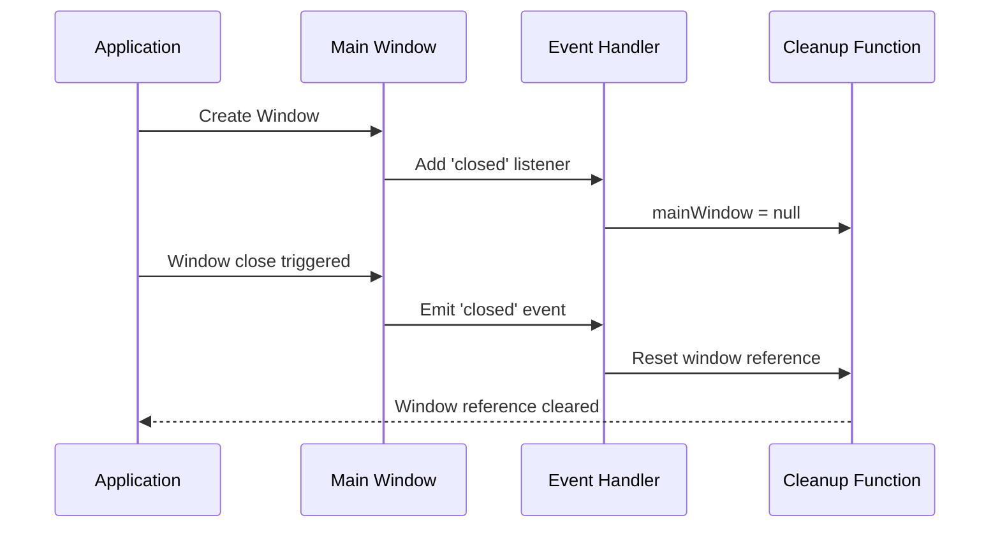

**Diagram sources**
- [src/main/index.ts](file://src/main/index.ts#L61-L63)

**Section sources**
- [src/main/index.ts](file://src/main/index.ts#L61-L63)

## Error Handling and Recovery

The window creation system implements robust error handling mechanisms to ensure graceful degradation and user experience continuity.

### Database Initialization Error Handling

The application gracefully handles database initialization failures by setting a flag and continuing in limited mode:

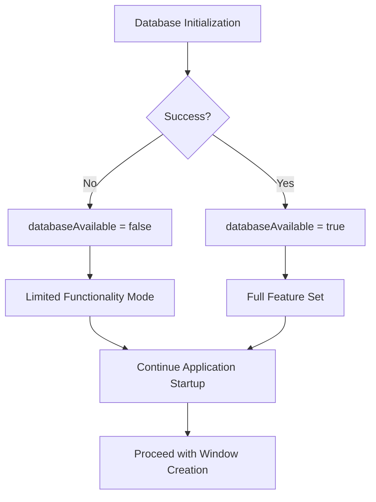

**Diagram sources**
- [src/main/index.ts](file://src/main/index.ts#L75-L85)
- [src/database/init.ts](file://src/database/init.ts#L20-L35)

### Application Startup Error Handling

The main application startup includes comprehensive error handling for all initialization phases:

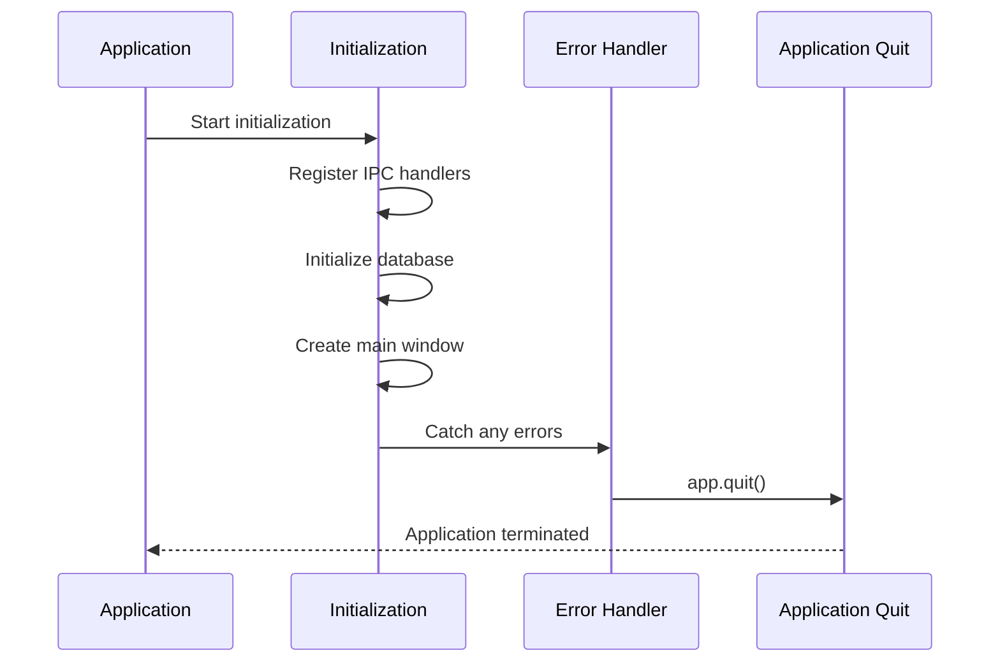

**Diagram sources**
- [src/main/index.ts](file://src/main/index.ts#L87-L100)

### Window Creation Error Recovery

The window creation process includes fallback mechanisms and graceful degradation:

| Error Scenario | Recovery Strategy | User Impact |
|---------------|------------------|-------------|
| Database Failure | Limited mode with reduced functionality | Core features still available |
| Window Load Failure | Application termination | Clear error indication |
| IPC Handler Registration | Graceful degradation | Reduced inter-process communication |
| Development Server Unavailable | Fallback to production mode | Automatic recovery |

**Section sources**
- [src/main/index.ts](file://src/main/index.ts#L75-L100)
- [src/database/init.ts](file://src/database/init.ts#L20-L35)

## Multi-Window Support

While LifeOS primarily focuses on a single main window, the architecture supports multi-window scenarios through the existing IPC infrastructure.

### Current Window Management Approach

The application currently maintains a single main window reference but is designed to support additional windows:

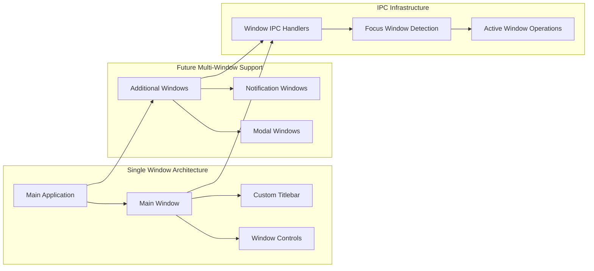

**Diagram sources**
- [src/main/ipc/window.ts](file://src/main/ipc/window.ts#L1-L27)
- [src/main/ipc/notification.ts](file://src/main/ipc/notification.ts#L1-L113)

### Notification Window Implementation

The notification system demonstrates multi-window capabilities through transient windows:

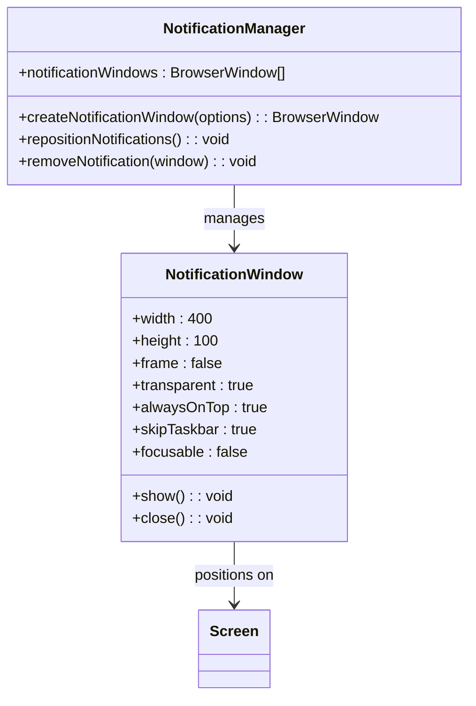

**Diagram sources**
- [src/main/ipc/notification.ts](file://src/main/ipc/notification.ts#L15-L50)

**Section sources**
- [src/main/ipc/window.ts](file://src/main/ipc/window.ts#L1-L27)
- [src/main/ipc/notification.ts](file://src/main/ipc/notification.ts#L1-L113)

## Window State Persistence

The window management system implements state persistence through IPC communication and local state synchronization.

### Maximization State Synchronization

Window state is synchronized between the main process and renderer process through dedicated IPC handlers:

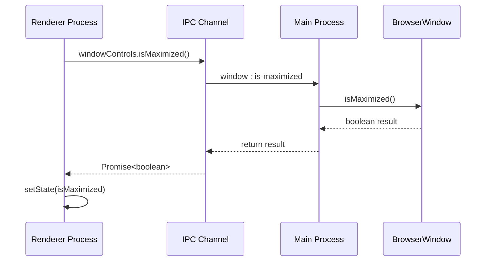

**Diagram sources**
- [src/main/ipc/window.ts](file://src/main/ipc/window.ts#L14-L17)
- [src/renderer/components/TitleBar.tsx](file://src/renderer/components/TitleBar.tsx#L8-L16)

### State Management Patterns

The application implements several patterns for window state management:

| State Type | Storage Location | Synchronization Method | Persistence Level |
|-----------|-----------------|----------------------|------------------|
| Maximization State | Local React State | Polling on Mount | Session |
| Window Position | BrowserWindow | IPC Events | Session |
| Window Size | BrowserWindow | IPC Events | Session |
| Focus State | BrowserWindow | IPC Queries | Real-time |

**Section sources**
- [src/main/ipc/window.ts](file://src/main/ipc/window.ts#L14-L25)
- [src/renderer/components/TitleBar.tsx](file://src/renderer/components/TitleBar.tsx#L8-L16)

## Custom Titlebar Implementation

LifeOS implements a custom titlebar system that provides consistent branding and platform-appropriate styling across different operating systems.

### Titlebar Architecture

The custom titlebar system separates concerns between presentation, control logic, and platform adaptation:

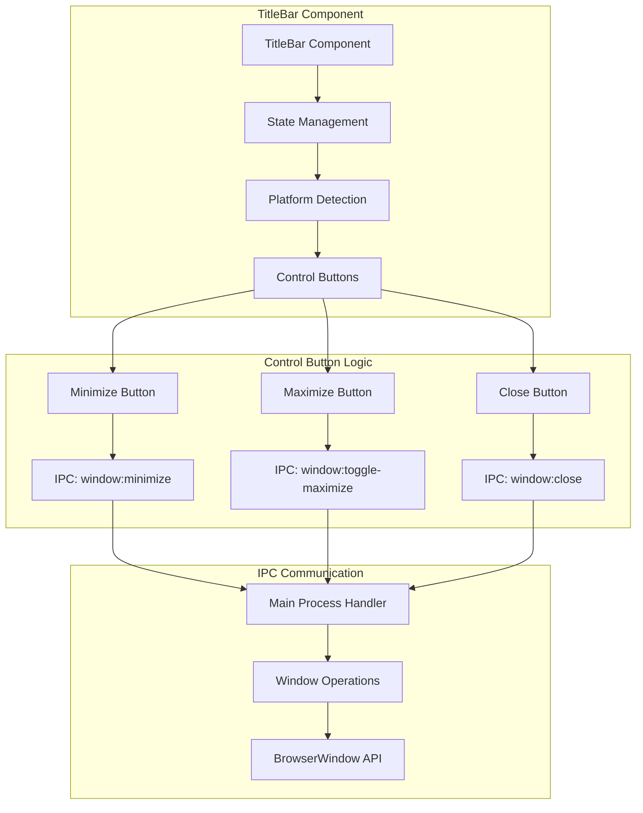

**Diagram sources**
- [src/renderer/components/TitleBar.tsx](file://src/renderer/components/TitleBar.tsx#L1-L63)
- [src/main/ipc/window.ts](file://src/main/ipc/window.ts#L1-L27)

### Platform-Specific Adaptations

The titlebar adapts its appearance based on the target platform:

| Platform | Control Style | Color Scheme | Accessibility Features |
|----------|--------------|--------------|----------------------|
| Windows | Traditional minimize/maximize/close | System theme aware | Standard button sizes |
| macOS | Traffic light controls | Native macOS appearance | Touch bar compatible |
| Linux | Standard window controls | GTK theme integration | XDG compliance |

### Titlebar State Management

The titlebar component maintains synchronization with the underlying window state:

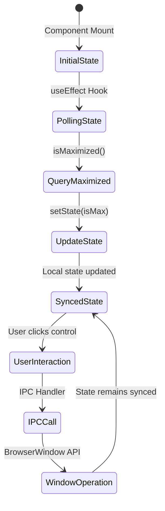

**Diagram sources**
- [src/renderer/components/TitleBar.tsx](file://src/renderer/components/TitleBar.tsx#L8-L16)

**Section sources**
- [src/renderer/components/TitleBar.tsx](file://src/renderer/components/TitleBar.tsx#L1-L63)
- [src/main/ipc/window.ts](file://src/main/ipc/window.ts#L1-L27)

## Best Practices and Guidelines

### Window Creation Guidelines

When implementing window-related functionality in LifeOS, follow these established patterns:

1. **Security First**: Always use context isolation and disable node integration for renderer processes
2. **Environment Awareness**: Implement proper environment detection for development vs production
3. **Error Resilience**: Provide graceful degradation when window creation fails
4. **Resource Management**: Properly clean up window references and event listeners
5. **State Synchronization**: Maintain consistent state between main and renderer processes

### Performance Considerations

- **Lazy Loading**: Load heavy resources only when needed
- **Memory Management**: Clean up unused window instances promptly
- **IPC Efficiency**: Minimize IPC calls for frequently accessed data
- **Asset Optimization**: Use compressed assets in production builds

### Security Recommendations

- **Preload Script Validation**: Regularly audit preload script exposure
- **Content Security Policy**: Implement CSP headers for additional protection
- **Input Sanitization**: Sanitize all user inputs before processing
- **Error Information**: Avoid exposing sensitive information in error messages

### Development Workflow

- **Hot Reloading**: Leverage Vite's development server for rapid iteration
- **Debugging**: Use developer tools for renderer process debugging
- **Testing**: Implement automated tests for window lifecycle events
- **Monitoring**: Log window creation and error events for production monitoring

**Section sources**
- [src/main/index.ts](file://src/main/index.ts#L1-L123)
- [src/preload/index.ts](file://src/preload/index.ts#L1-L202)
- [src/main/ipc/window.ts](file://src/main/ipc/window.ts#L1-L27)