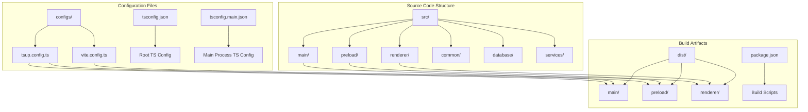
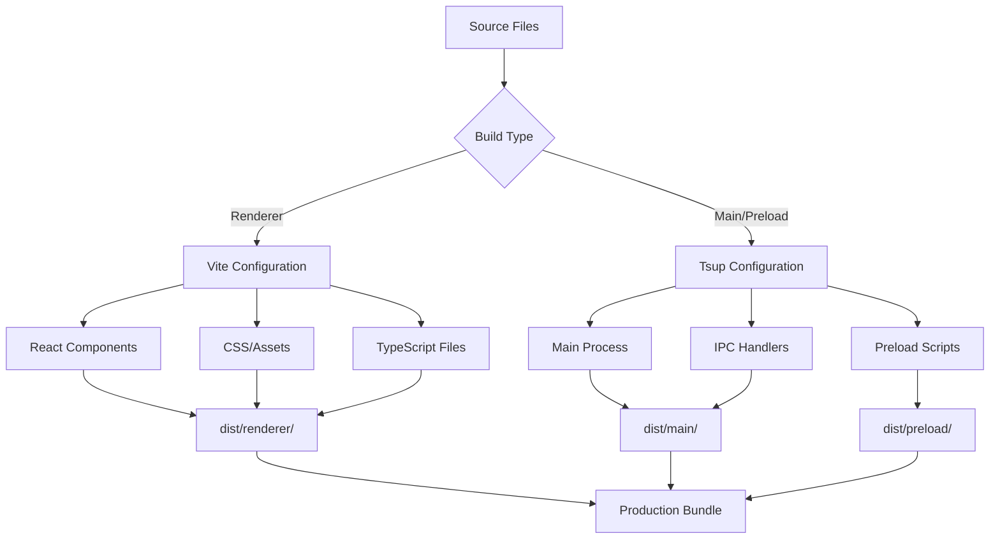
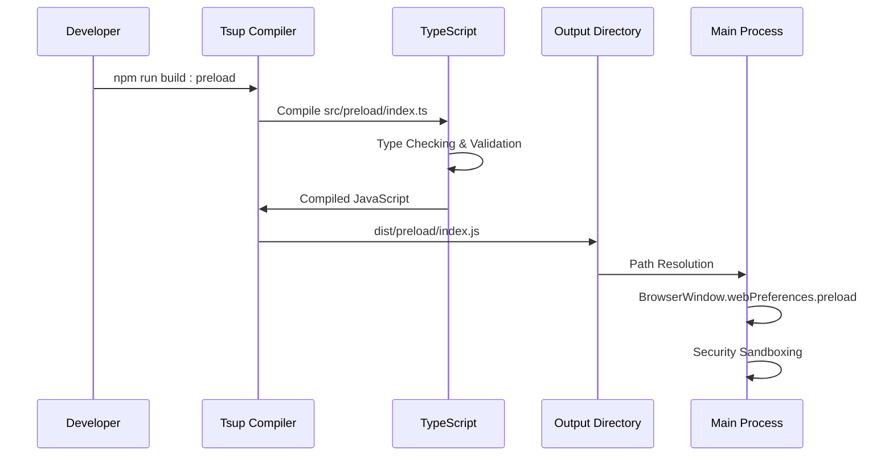
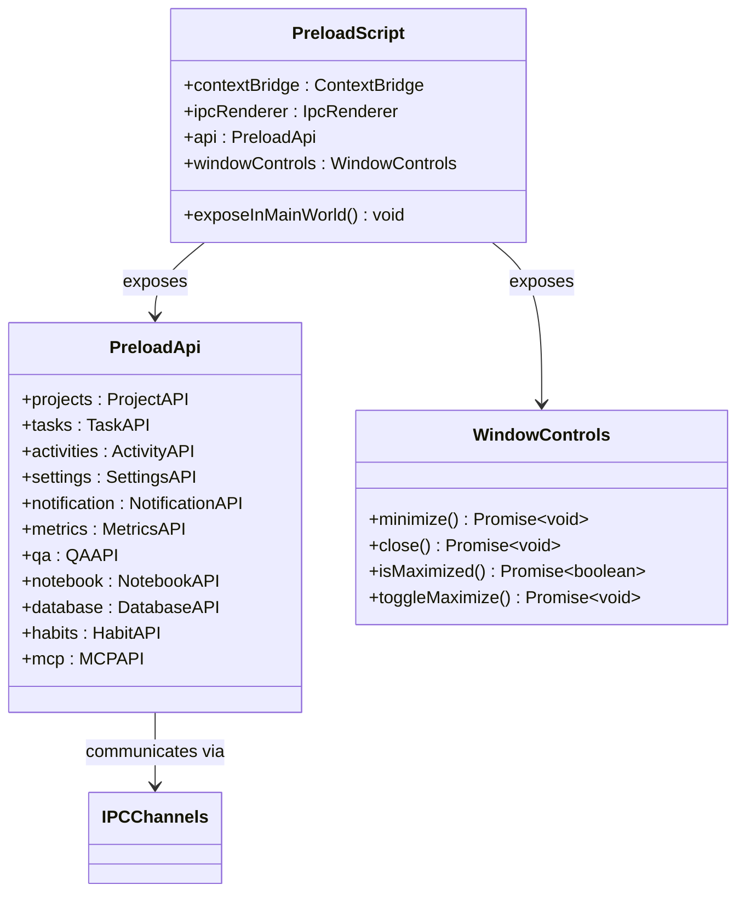
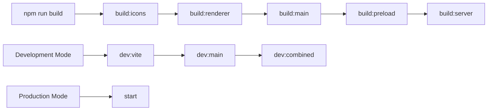
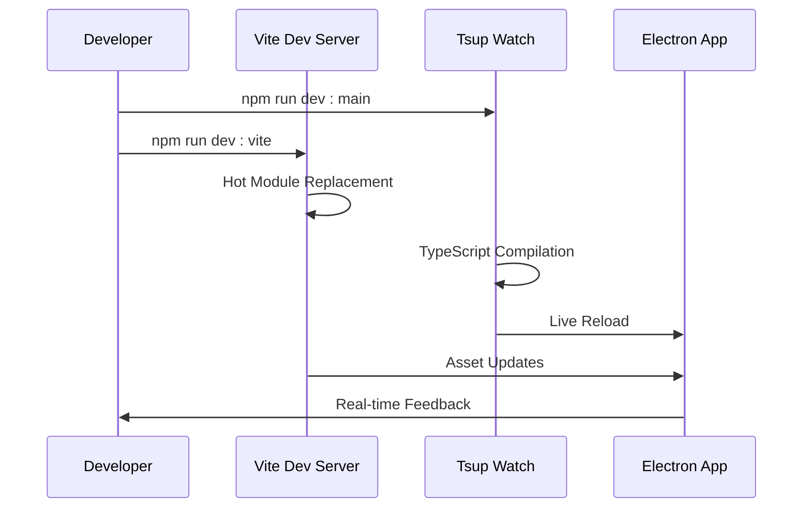

# Build Configuration and Compilation Pipeline

<cite>
**Referenced Files in This Document**
- [configs/tsup.config.ts](file://configs/tsup.config.ts)
- [package.json](file://package.json)
- [src/preload/index.ts](file://src/preload/index.ts)
- [src/main/index.ts](file://src/main/index.ts)
- [configs/vite.config.ts](file://configs/vite.config.ts)
- [tsconfig.json](file://tsconfig.json)
- [tsconfig.main.json](file://tsconfig.main.json)
- [src/renderer/global.d.ts](file://src/renderer/global.d.ts)
- [src/common/types.ts](file://src/common/types.ts)
</cite>

## Table of Contents
1. [Introduction](#introduction)
2. [Project Structure Overview](#project-structure-overview)
3. [Build Configuration Architecture](#build-configuration-architecture)
4. [Preload Script Compilation Pipeline](#preload-script-compilation-pipeline)
5. [TypeScript Configuration Management](#typescript-configuration-management)
6. [Build Scripts and Automation](#build-scripts-and-automation)
7. [Path Resolution and Output Management](#path-resolution-and-output-management)
8. [Development vs Production Workflows](#development-vs-production-workflows)
9. [Troubleshooting Common Build Issues](#troubleshooting-common-build-issues)
10. [Best Practices and Recommendations](#best-practices-and-recommendations)

## Introduction

LifeOS employs a sophisticated multi-stage build configuration designed to handle the complexities of an Electron application with separate main process, renderer process, and preload script compilation requirements. The build system leverages modern tools including TypeScript, Vite, and Tsup to create efficient, type-safe, and optimized bundles for both development and production environments.

The compilation pipeline is specifically designed to address the unique challenges of Electron applications, particularly the need to compile preload scripts separately from main and renderer bundles while maintaining proper type safety and path resolution across the application architecture.

## Project Structure Overview

The LifeOS project follows a modular architecture with distinct separation of concerns:



**Diagram sources**
- [src/main/index.ts](file://src/main/index.ts#L1-L123)
- [src/preload/index.ts](file://src/preload/index.ts#L1-L202)
- [configs/tsup.config.ts](file://configs/tsup.config.ts#L1-L31)

**Section sources**
- [package.json](file://package.json#L1-L109)
- [tsconfig.json](file://tsconfig.json#L1-L19)

## Build Configuration Architecture

The build system employs a dual-tool approach combining Vite for renderer bundling and Tsup for main process and preload script compilation:



**Diagram sources**
- [configs/vite.config.ts](file://configs/vite.config.ts#L1-L24)
- [configs/tsup.config.ts](file://configs/tsup.config.ts#L1-L31)

### Tsup Configuration Details

The Tsup configuration serves as the primary bundler for Node.js-based components, providing specialized settings for different build targets:

| Configuration Parameter | Value | Purpose |
|------------------------|-------|---------|
| **entry** | Multiple entry points | Supports modular IPC handler compilation |
| **platform** | node | Ensures Node.js compatibility |
| **target** | node18 | Targets modern Node.js runtime |
| **format** | cjs | CommonJS format for Electron compatibility |
| **external** | electron, better-sqlite3 | Prevents bundling Electron APIs |
| **sourcemap** | true | Enables debugging support |
| **minify** | false | Maintains readable production code |
| **dts** | false | Delegates type generation elsewhere |

**Section sources**
- [configs/tsup.config.ts](file://configs/tsup.config.ts#L1-L31)

## Preload Script Compilation Pipeline

The preload script compilation represents a critical component of the build pipeline, requiring special handling due to its unique role in the Electron security model:



**Diagram sources**
- [src/preload/index.ts](file://src/preload/index.ts#L1-L202)
- [src/main/index.ts](file://src/main/index.ts#L40-L50)

### Preload Script Architecture

The preload script implements a comprehensive API bridge between the secure renderer process and the main process:



**Diagram sources**
- [src/preload/index.ts](file://src/preload/index.ts#L15-L180)
- [src/renderer/global.d.ts](file://src/renderer/global.d.ts#L1-L16)

**Section sources**
- [src/preload/index.ts](file://src/preload/index.ts#L1-L202)
- [src/renderer/global.d.ts](file://src/renderer/global.d.ts#L1-L16)

## TypeScript Configuration Management

The project employs a hierarchical TypeScript configuration system to manage different compilation contexts:

### Root Configuration (tsconfig.json)

The root configuration establishes the foundation for React-based renderer development:

| Compiler Option | Value | Impact |
|----------------|-------|---------|
| **target** | ES2020 | Modern JavaScript features |
| **module** | ESNext | Tree-shaking optimization |
| **moduleResolution** | Node | Node.js module resolution |
| **jsx** | react-jsx | React component compilation |
| **strict** | true | Enhanced type safety |
| **baseUrl** | ./src | Relative path resolution |

### Main Process Configuration (tsconfig.main.json)

The main process configuration extends the root with Node.js-specific settings:

| Configuration Aspect | Purpose | Implementation |
|---------------------|---------|----------------|
| **Module System** | CommonJS compatibility | `"module": "commonjs"` |
| **Target Environment** | Node.js runtime | `"target": "ES2020"` |
| **Type Definitions** | Node.js APIs | `"types": ["node"]` |
| **Source Maps** | Debugging support | `"sourceMap": true` |
| **Included Paths** | Multi-module support | Includes main, preload, common |

**Section sources**
- [tsconfig.json](file://tsconfig.json#L1-L19)
- [tsconfig.main.json](file://tsconfig.main.json#L1-L29)

## Build Scripts and Automation

The build system provides comprehensive automation through npm scripts that orchestrate the compilation of different application components:



**Diagram sources**
- [package.json](file://package.json#L8-L20)

### Key Build Commands

| Command | Purpose | Target Output |
|---------|---------|---------------|
| **npm run build:preload** | Compile preload script | `dist/preload/index.js` |
| **npm run build:main** | Compile main process | `dist/main/index.js` |
| **npm run build:renderer** | Bundle renderer assets | `dist/renderer/` |
| **npm run build:server** | Compile MCP server | `dist/server/mcp-server.js` |
| **npm run build** | Complete application build | All components |

**Section sources**
- [package.json](file://package.json#L8-L20)

## Path Resolution and Output Management

The build system implements sophisticated path resolution mechanisms to ensure proper module linking across the application architecture:

### Preload Script Path Resolution

The preload script path is resolved using Node.js path resolution relative to the main process:

```mermaid
flowchart TD
A[Main Process Entry Point] --> B[path.join(__dirname, '../preload/index.js')]
B --> C[dist/preload/index.js]
D[Development Mode] --> E[__dirname resolves to src/main/]
F[Production Mode] --> G[__dirname resolves to dist/main/]
E --> H[Relative path calculation]
G --> H
H --> I[Final preload path]
```

**Diagram sources**
- [src/main/index.ts](file://src/main/index.ts#L44)

### Output Directory Structure

The build system produces a structured output directory that mirrors the source organization:

| Source Directory | Output Directory | Purpose |
|-----------------|------------------|---------|
| **src/main** | **dist/main** | Main process JavaScript |
| **src/preload** | **dist/preload** | Preload script bundle |
| **src/renderer** | **dist/renderer** | Bundled frontend assets |
| **src/server** | **dist/server** | MCP server code |

**Section sources**
- [src/main/index.ts](file://src/main/index.ts#L40-L50)
- [configs/tsup.config.ts](file://configs/tsup.config.ts#L1-L31)

## Development vs Production Workflows

The build system adapts its behavior based on the environment to optimize developer experience and production performance:

### Development Workflow

During development, the system prioritizes fast iteration and debugging capabilities:



### Production Workflow

Production builds focus on optimization, security, and deployment readiness:

| Optimization Feature | Implementation | Benefit |
|---------------------|----------------|---------|
| **Source Maps** | Enabled in development | Debugging support |
| **Minification** | Disabled in development | Readable code |
| **Type Generation** | Separate process | Clean build artifacts |
| **External Dependencies** | Excluded from bundle | Reduced bundle size |
| **Platform Targeting** | Node.js 18 | Runtime compatibility |

**Section sources**
- [configs/tsup.config.ts](file://configs/tsup.config.ts#L10-L15)
- [package.json](file://package.json#L8-L20)

## Troubleshooting Common Build Issues

### Missing Exports or Type Resolution Errors

Common issues and their solutions:

#### Issue: Preload API Types Not Resolved
**Symptoms**: TypeScript errors in renderer process when accessing `window.api`
**Solution**: Verify type declaration inclusion in compiler options

#### Issue: Incorrect Preload Path
**Symptoms**: Electron fails to load preload script
**Solution**: Check path resolution in BrowserWindow configuration

#### Issue: External Dependencies Not Found
**Symptoms**: Runtime errors for electron or better-sqlite3
**Solution**: Ensure proper external configuration in Tsup

### Build Performance Issues

#### Slow Compilation Times
**Causes**: Large TypeScript files, complex type checking
**Solutions**: Implement incremental compilation, optimize type definitions

#### Memory Usage During Build
**Causes**: Large bundle sizes, inefficient caching
**Solutions**: Enable tree shaking, optimize asset loading

### Debugging Strategies

1. **Enable Verbose Logging**: Use `DEBUG=tsup` for detailed compilation output
2. **Check Source Maps**: Verify sourcemap generation for proper debugging
3. **Validate Type Definitions**: Ensure all exported types are properly declared
4. **Test Path Resolution**: Verify preload script path resolution in both development and production

**Section sources**
- [configs/tsup.config.ts](file://configs/tsup.config.ts#L20-L25)
- [src/preload/index.ts](file://src/preload/index.ts#L190-L202)

## Best Practices and Recommendations

### Build Configuration Guidelines

1. **Separate Concerns**: Maintain distinct build configurations for different application components
2. **External Dependencies**: Properly externalize Node.js APIs to reduce bundle size
3. **Type Safety**: Leverage TypeScript for compile-time error detection
4. **Path Management**: Use consistent path resolution strategies across development and production

### Performance Optimization

1. **Incremental Builds**: Utilize watch modes for development efficiency
2. **Parallel Processing**: Run independent build processes concurrently
3. **Asset Optimization**: Implement appropriate asset bundling strategies
4. **Bundle Analysis**: Regularly analyze bundle sizes and dependencies

### Security Considerations

1. **Context Isolation**: Ensure proper context isolation in preload scripts
2. **API Exposure**: Limit exposed APIs to necessary functionality only
3. **Type Safety**: Maintain strong typing to prevent runtime errors
4. **Path Validation**: Validate all file paths and API endpoints

### Maintenance and Scalability

1. **Modular Architecture**: Design components to be easily testable and maintainable
2. **Configuration Management**: Centralize shared configuration values
3. **Documentation**: Maintain comprehensive build system documentation
4. **Testing**: Implement automated testing for build processes

The LifeOS build configuration demonstrates a sophisticated approach to managing complex Electron application compilation requirements while maintaining developer productivity and application performance. The careful separation of concerns, robust type safety, and flexible configuration system provide a solid foundation for both development and production deployments.