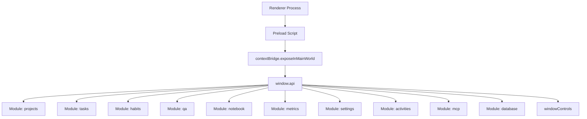
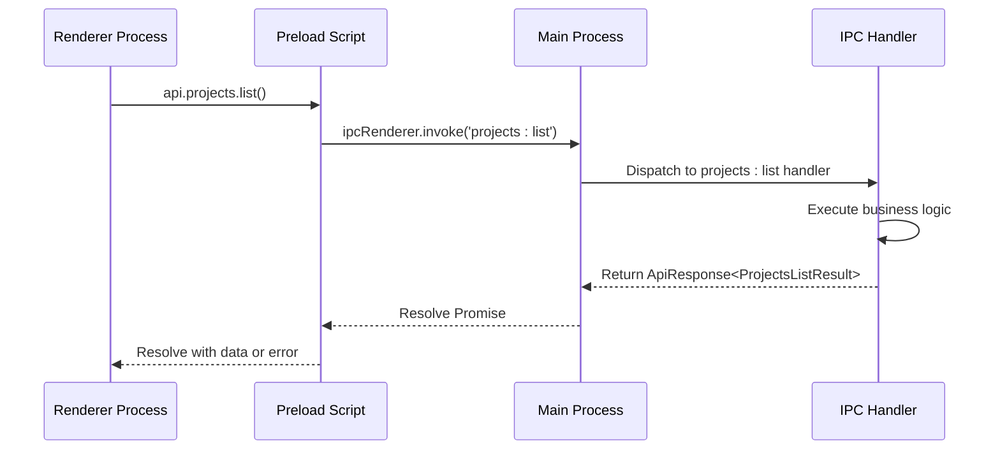
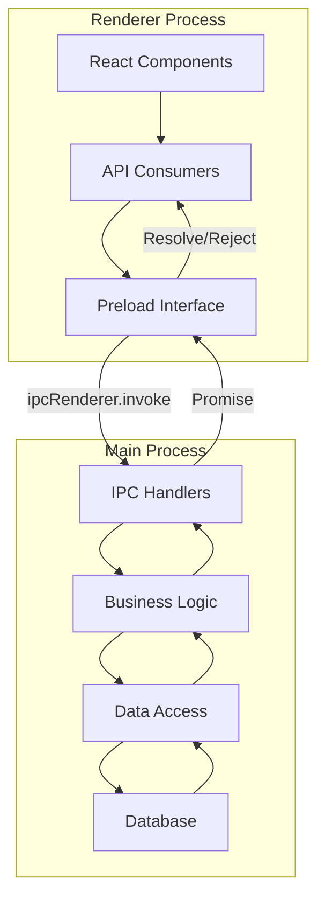

# IPC API Surface and Method Exposure

<cite>
**Referenced Files in This Document**   
- [index.ts](file://src/preload/index.ts)
- [types.ts](file://src/common/types.ts)
- [response.ts](file://src/main/utils/response.ts)
- [projects.ts](file://src/main/ipc/projects.ts)
- [tasks.ts](file://src/main/ipc/tasks.ts)
- [activities.ts](file://src/main/ipc/activities.ts)
- [settings.ts](file://src/main/ipc/settings.ts)
- [notification.ts](file://src/main/ipc/notification.ts)
- [metrics.ts](file://src/main/ipc/metrics.ts)
- [qa.ts](file://src/main/ipc/qa.ts)
- [notebook.ts](file://src/main/ipc/notebook.ts)
- [database.ts](file://src/main/ipc/database.ts)
- [habits.ts](file://src/main/ipc/habits.ts)
- [mcp.ts](file://src/main/ipc/mcp.ts)
- [window.ts](file://src/main/ipc/window.ts)
- [index.ts](file://src/main/index.ts)
- [global.d.ts](file://src/renderer/global.d.ts)
</cite>

## Table of Contents
1. [Introduction](#introduction)
2. [API Structure and Organization](#api-structure-and-organization)
3. [Request-Response Contract](#request-response-contract)
4. [Module-Specific API Endpoints](#module-specific-api-endpoints)
5. [Error Handling and Graceful Degradation](#error-handling-and-graceful-degradation)
6. [Security and Context Isolation](#security-and-context-isolation)
7. [Development Guidelines for New API Methods](#development-guidelines-for-new-api-methods)
8. [Architecture Flow Diagram](#architecture-flow-diagram)
9. [Conclusion](#conclusion)

## Introduction

The IPC API surface in the LifeOS application provides a secure and structured communication channel between the renderer process (frontend) and the main process (backend). This documentation details how the API is exposed through the preload script, the hierarchical organization of methods under the `api` object, and the corresponding IPC handlers in the main process. The design enables modular feature development while maintaining type safety and preventing namespace collisions.

**Section sources**
- [index.ts](file://src/preload/index.ts#L1-L202)
- [global.d.ts](file://src/renderer/global.d.ts#L1-L16)

## API Structure and Organization

The API is organized hierarchically by functional modules (projects, tasks, habits, QA, notebook, etc.), each containing related operations. This modular structure prevents namespace collisions and supports independent development of features. The API is exposed to the renderer process via Electron's `contextBridge`, making it available as `window.api`.

Each module follows a consistent naming convention: `[module]:[operation]` (e.g., `projects:list`, `tasks:create`). This pattern enables intuitive discovery and maintains separation between different domain areas of the application.



**Diagram sources**
- [index.ts](file://src/preload/index.ts#L1-L202)
- [index.ts](file://src/main/index.ts#L1-L123)

**Section sources**
- [index.ts](file://src/preload/index.ts#L1-L202)

## Request-Response Contract

The communication between renderer and main processes follows a standardized request-response contract using Electron's `ipcRenderer.invoke` and `ipcMain.handle`. All API methods return a Promise that resolves to an `ApiResponse<T>` type, ensuring consistent handling of success and error states.

The `ApiResponse<T>` interface (defined in `types.ts`) has the following structure:
- `ok: boolean` - Indicates success (true) or failure (false)
- `data?: T` - Present on success, containing the response payload
- `error?: string` - Present on failure, containing error message

Methods in the preload script use TypeScript generics to maintain type safety, casting responses as `Promise<ApiResponse<T>>` where T corresponds to the expected data type (e.g., `Project`, `Task[]`, `Settings`).



**Diagram sources**
- [index.ts](file://src/preload/index.ts#L1-L202)
- [projects.ts](file://src/main/ipc/projects.ts#L1-L84)
- [types.ts](file://src/common/types.ts#L1-L117)

**Section sources**
- [index.ts](file://src/preload/index.ts#L1-L202)
- [types.ts](file://src/common/types.ts#L1-L117)

## Module-Specific API Endpoints

### Projects Module
The projects module manages project lifecycle operations including listing, creation, updating, activation, and deletion. The `projects:list` method returns both projects and the currently active project ID, enabling UI synchronization.

**Section sources**
- [index.ts](file://src/preload/index.ts#L13-L30)
- [projects.ts](file://src/main/ipc/projects.ts#L1-L84)

### Tasks Module
The tasks module provides operations for task management within projects, including listing by project, creation, updating, and moving tasks between projects and statuses.

**Section sources**
- [index.ts](file://src/preload/index.ts#L31-L43)
- [tasks.ts](file://src/main/ipc/tasks.ts#L1-L37)

### Habits Module
The habits module supports habit tracking with operations for listing, creating, updating, deleting, and logging habit completions. It also provides statistical data about habit performance.

**Section sources**
- [index.ts](file://src/preload/index.ts#L145-L165)
- [habits.ts](file://src/main/ipc/habits.ts#L1-L101)

### QA Module
The QA module manages question-answer collections with hierarchical operations for collections, questions, and answers. Each level supports CRUD operations and maintains relationships through foreign key references.

**Section sources**
- [index.ts](file://src/preload/index.ts#L98-L119)
- [qa.ts](file://src/main/ipc/qa.ts#L1-L124)

### Notebook Module
The notebook module provides a hierarchical note-taking system with notebooks containing notes. It supports rich operations including search functionality and statistical analysis of notebook usage.

**Section sources**
- [index.ts](file://src/preload/index.ts#L118-L139)
- [notebook.ts](file://src/main/ipc/notebook.ts#L1-L106)

### Other Modules
Additional modules include:
- **Metrics**: Performance scoring and event tracking
- **Settings**: Application configuration persistence
- **Activities**: Activity logging and analytics
- **MCP**: Server management for the Mind Control Protocol
- **Database**: Administrative operations like data purging

**Section sources**
- [index.ts](file://src/preload/index.ts#L1-L202)
- [metrics.ts](file://src/main/ipc/metrics.ts#L1-L152)
- [settings.ts](file://src/main/ipc/settings.ts#L1-L28)
- [activities.ts](file://src/main/ipc/activities.ts#L1-L72)
- [mcp.ts](file://src/main/ipc/mcp.ts#L1-L152)
- [database.ts](file://src/main/ipc/database.ts#L1-L55)

## Error Handling and Graceful Degradation

The API implements comprehensive error handling through the `wrapIpc` utility function, which standardizes response formatting and error recovery. All handlers are wrapped with error boundary protection that catches exceptions and returns properly formatted error responses.

The system includes graceful degradation for database unavailability. When the database is not initialized or unavailable, certain operations return empty responses rather than failing catastrophically, allowing the application to remain functional in limited mode.

```mermaid
flowchart TD
A[IPC Handler Call] --> B{Database Available?}
B --> |Yes| C[Execute Handler Logic]
B --> |No| D{Operation Depends on Database?}
D --> |Yes| E[Return Empty Response]
D --> |No| F[Execute Handler Logic]
C --> G{Success?}
G --> |Yes| H[Return success(data)]
G --> |No| I[Return failure(error)]
F --> G
H --> J[Resolve Promise]
I --> J
E --> J
```

**Diagram sources**
- [response.ts](file://src/main/utils/response.ts#L1-L37)
- [index.ts](file://src/main/index.ts#L1-L123)

**Section sources**
- [response.ts](file://src/main/utils/response.ts#L1-L37)

## Security and Context Isolation

The API exposure follows Electron's security best practices through context isolation and the `contextBridge`. The preload script acts as a secure intermediary, exposing only the intended API surface to the renderer process while preventing direct access to Node.js APIs or Electron internals.

The `contextBridge.exposeInMainWorld` method selectively exposes the `api` object and `windowControls`, ensuring that only approved functionality is available to the renderer. This approach mitigates risks of prototype pollution and unauthorized access to privileged operations.

**Section sources**
- [index.ts](file://src/preload/index.ts#L1-L202)
- [index.ts](file://src/main/index.ts#L1-L123)

## Development Guidelines for New API Methods

When adding new API methods, follow these guidelines to maintain consistency, security, and type safety:

1. **Hierarchical Organization**: Place new methods in the appropriate module based on functionality. Create new modules only when existing ones don't fit.

2. **Naming Convention**: Use the format `[module]:[operation]` with lowercase letters and colons (e.g., `habits:log-completion`).

3. **Type Safety**: Define TypeScript interfaces for all request payloads and response types in `types.ts` or module-specific type files.

4. **Error Handling**: Wrap all main process handlers with `wrapIpc` or implement equivalent error boundary protection.

5. **Security Review**: Ensure new methods don't expose sensitive system operations without appropriate validation and authorization.

6. **Documentation**: Add JSDoc comments to both preload and main process implementations, describing parameters, return values, and potential errors.

7. **Testing**: Implement unit tests for both the IPC handler and any business logic it invokes.

**Section sources**
- [index.ts](file://src/preload/index.ts#L1-L202)
- [response.ts](file://src/main/utils/response.ts#L1-L37)
- [types.ts](file://src/common/types.ts#L1-L117)

## Architecture Flow Diagram



**Diagram sources**
- [index.ts](file://src/preload/index.ts#L1-L202)
- [projects.ts](file://src/main/ipc/projects.ts#L1-L84)
- [tasks.ts](file://src/main/ipc/tasks.ts#L1-L37)
- [index.ts](file://src/main/index.ts#L1-L123)

## Conclusion

The IPC API surface in LifeOS provides a robust, secure, and well-structured communication layer between the renderer and main processes. The hierarchical organization by functional modules enables modular development while preventing namespace collisions. The consistent request-response contract with proper typing ensures reliability and maintainability. The implementation follows security best practices through context isolation and selective API exposure. This architecture supports the application's evolution while maintaining stability and type safety across the codebase.