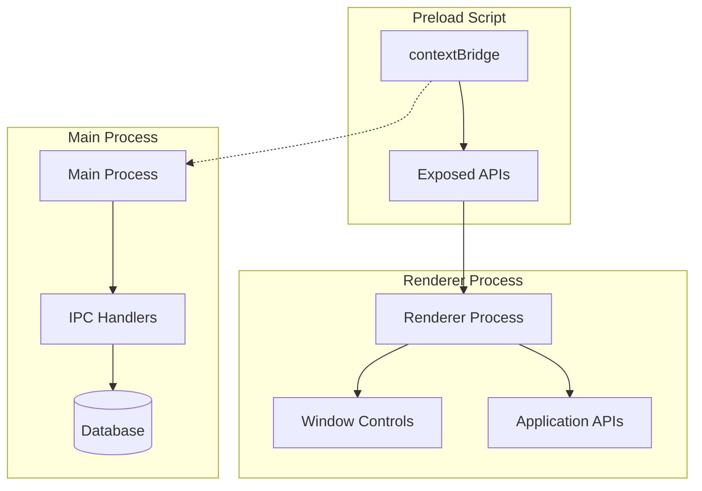
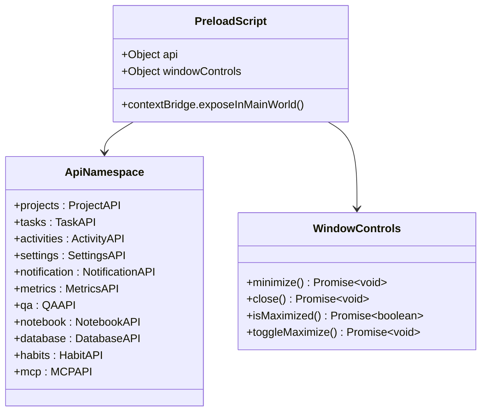
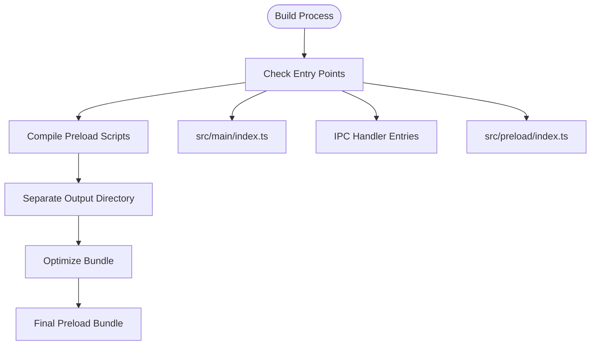
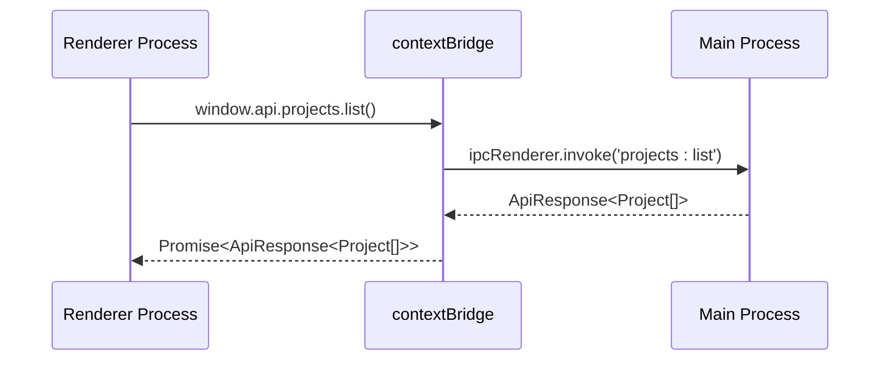
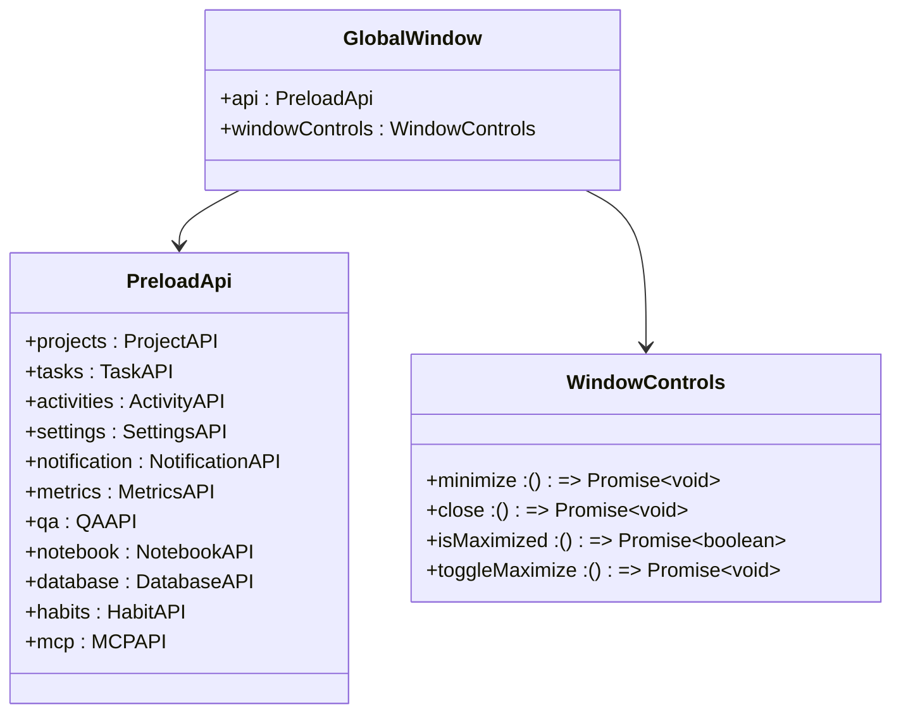
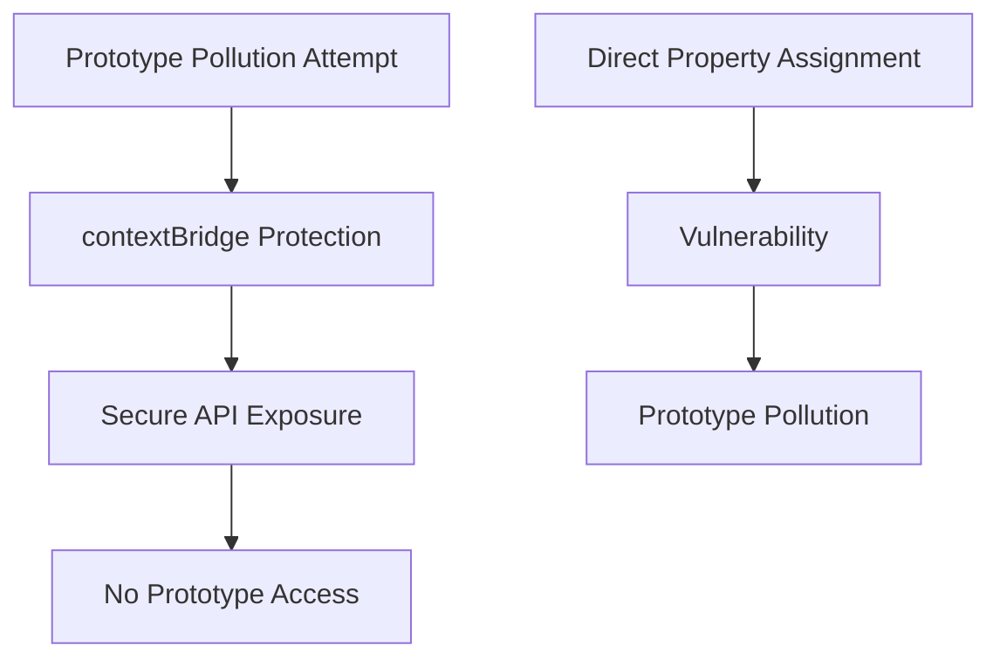

# Preload Script and Context Isolation

<cite>
**Referenced Files in This Document**
- [src/preload/index.ts](file://src/preload/index.ts)
- [configs/tsup.config.ts](file://configs/tsup.config.ts)
- [src/main/index.ts](file://src/main/index.ts)
- [src/main/ipc/projects.ts](file://src/main/ipc/projects.ts)
- [src/main/ipc/window.ts](file://src/main/ipc/window.ts)
- [src/main/ipc/mcp.ts](file://src/main/ipc/mcp.ts)
- [src/main/utils/response.ts](file://src/main/utils/response.ts)
- [src/renderer/App.tsx](file://src/renderer/App.tsx)
- [src/renderer/global.d.ts](file://src/renderer/global.d.ts)
- [src/common/types.ts](file://src/common/types.ts)
- [src/database/init.ts](file://src/database/init.ts)
- [package.json](file://package.json)
</cite>

## Table of Contents
1. [Introduction](#introduction)
2. [Security Model Overview](#security-model-overview)
3. [Preload Script Architecture](#preload-script-architecture)
4. [Build Configuration](#build-configuration)
5. [API Exposure Patterns](#api-exposure-patterns)
6. [Renderer Process Integration](#renderer-process-integration)
7. [Security Benefits](#security-benefits)
8. [Common Pitfalls and Solutions](#common-pitfalls-and-solutions)
9. [Best Practices](#best-practices)
10. [Troubleshooting Guide](#troubleshooting-guide)

## Introduction

LifeOS implements a sophisticated preload script architecture that serves as the critical security bridge between Electron's main process and renderer processes. This architecture leverages Electron's context isolation mechanism to provide controlled API exposure while preventing prototype pollution and remote code execution vulnerabilities.

The preload script acts as a secure intermediary, exposing only carefully crafted IPC channels through the `contextBridge` API while maintaining `contextIsolation: true`. This design ensures that renderer processes can communicate with the main process securely without compromising the application's security model.

## Security Model Overview

Electron's security model relies heavily on context isolation to prevent malicious code from accessing sensitive Node.js APIs. When `contextIsolation: true` is enabled, the renderer process operates in a completely isolated JavaScript context that cannot directly access Node.js APIs or the main process.



**Diagram sources**
- [src/main/index.ts](file://src/main/index.ts#L39-L45)
- [src/preload/index.ts](file://src/preload/index.ts#L195-L202)

**Section sources**
- [src/main/index.ts](file://src/main/index.ts#L39-L45)
- [src/preload/index.ts](file://src/preload/index.ts#L1-L202)

## Preload Script Architecture

The LifeOS preload script implements a comprehensive API exposure system that organizes functionality into logical groups while maintaining strict security boundaries.

### Core API Structure

The preload script exposes two primary namespaces through the `contextBridge`:

1. **`window.api`** - Application-specific APIs for data operations
2. **`window.windowControls`** - System-level window control operations



**Diagram sources**
- [src/preload/index.ts](file://src/preload/index.ts#L195-L202)

### API Organization Pattern

The API is organized into functional domains, each providing specific capabilities:

#### Projects Management
- List, create, update, and delete projects
- Set active project and reorder operations
- Project-specific task filtering

#### Task Management  
- CRUD operations for tasks within projects
- Status transitions and priority updates
- Position-based ordering and movement

#### Activity Tracking
- Create and retrieve activity logs
- Date range filtering and statistics
- Type-based categorization

#### Settings Management
- Application-wide configuration
- User preference persistence
- Theme and appearance settings

**Section sources**
- [src/preload/index.ts](file://src/preload/index.ts#L10-L194)

## Build Configuration

The build system uses `tsup` to compile preload scripts separately from the main application code, ensuring proper module resolution and security isolation.

### TSUP Configuration

The build configuration in `tsup.config.ts` demonstrates careful separation of concerns:



**Diagram sources**
- [configs/tsup.config.ts](file://configs/tsup.config.ts#L1-L31)

### Compilation Strategy

The build system employs several key strategies:

1. **Separate Compilation**: Preload scripts are compiled independently to ensure proper context isolation
2. **Format Control**: Uses CommonJS format for compatibility with Electron's module system
3. **External Dependencies**: Excludes Electron and SQLite dependencies to prevent bundling conflicts
4. **Source Maps**: Enables debugging support for development environments

**Section sources**
- [configs/tsup.config.ts](file://configs/tsup.config.ts#L1-L31)
- [package.json](file://package.json#L15-L17)

## API Exposure Patterns

LifeOS implements sophisticated API exposure patterns that balance functionality with security while maintaining type safety across contexts.

### Safe API Design Principles

#### Explicit Channel Exposure
The preload script uses `contextBridge.exposeInMainWorld()` to explicitly expose only intended APIs:



**Diagram sources**
- [src/preload/index.ts](file://src/preload/index.ts#L195-L202)
- [src/renderer/App.tsx](file://src/renderer/App.tsx#L75-L85)

#### Type Safety Implementation
The application maintains type safety through comprehensive TypeScript definitions:

| API Category | Type Coverage | Validation |
|--------------|---------------|------------|
| Project Operations | `CreateProjectInput`, `UpdateProjectPayload` | Runtime validation |
| Task Management | `CreateTaskInput`, `UpdateTaskPayload` | Schema validation |
| Activity Logging | `CreateActivityInput` | Metadata validation |
| Settings | `Settings` interface | Partial update support |
| Notifications | `NotificationOptions` | Message formatting |

### IPC Communication Flow

Each API endpoint follows a standardized pattern for secure communication:

1. **Request Validation**: Input parameters are validated before IPC transmission
2. **Response Wrapping**: All responses are wrapped in `ApiResponse<T>` for consistent error handling
3. **Error Propagation**: Errors are caught and transformed into user-friendly messages
4. **Async Operations**: All IPC calls are asynchronous to prevent blocking the renderer

**Section sources**
- [src/preload/index.ts](file://src/preload/index.ts#L10-L194)
- [src/main/utils/response.ts](file://src/main/utils/response.ts#L1-L37)

## Renderer Process Integration

The renderer process integrates with the preload script through strongly-typed interfaces that provide seamless API access while maintaining security boundaries.

### TypeScript Integration

The application defines comprehensive type definitions that enable IntelliSense and compile-time validation:



**Diagram sources**
- [src/renderer/global.d.ts](file://src/renderer/global.d.ts#L1-L16)

### Usage Patterns in Components

Renderer components consume the exposed APIs through familiar Promise-based patterns:

#### Project Management Example
Components can perform CRUD operations on projects using the exposed API:

```typescript
// Example usage pattern (not actual code)
const response = await window.api.projects.list();
if (response.ok && response.data) {
  // Process project data
  setProjects(response.data.projects);
}
```

#### Window Control Integration
System-level operations are handled through the window controls namespace:

```typescript
// Example usage pattern (not actual code)
await window.windowControls.toggleMaximize();
const isMaximized = await window.windowControls.isMaximized();
```

**Section sources**
- [src/renderer/App.tsx](file://src/renderer/App.tsx#L75-L175)
- [src/renderer/global.d.ts](file://src/renderer/global.d.ts#L1-L16)

## Security Benefits

The preload script architecture provides multiple layers of security protection against common attack vectors.

### Prototype Pollution Prevention

By using `contextBridge` instead of direct property assignment, the application prevents prototype pollution attacks:



### Remote Code Execution Mitigation

The architecture prevents remote code execution by:

1. **Strict API Surface**: Only explicitly exposed APIs are accessible
2. **Input Validation**: All inputs are validated before processing
3. **Output Sanitization**: Responses are sanitized before delivery
4. **Context Isolation**: Complete separation between contexts

### Error Boundary Protection

The response wrapper system provides controlled error handling:

| Protection Layer | Implementation | Benefit |
|------------------|----------------|---------|
| Input Validation | Type checking and runtime validation | Prevents malformed requests |
| Error Wrapping | `ApiResponse<T>` pattern | Standardized error responses |
| Exception Handling | Try-catch blocks around IPC calls | Graceful degradation |
| Database Availability | Conditional operations | Failsafe mode support |

**Section sources**
- [src/main/utils/response.ts](file://src/main/utils/response.ts#L15-L37)

## Common Pitfalls and Solutions

Understanding common pitfalls helps developers avoid security vulnerabilities and maintain code quality.

### Circular Dependency Issues

#### Problem
Circular dependencies between preload scripts and main process modules can cause initialization failures.

#### Solution
Implement proper module loading order and use lazy imports:

```typescript
// Correct approach - lazy loading
require('./ipc/projects'); // Loaded after Electron is ready
```

### Type Safety Across Contexts

#### Problem
Type definitions must be synchronized between main and renderer processes.

#### Solution
Use shared type definitions and compile-time validation:

```typescript
// Shared type definition approach
import type { Project, ApiResponse } from '../common/types';
```

### Memory Leak Prevention

#### Problem
Improper cleanup of IPC listeners can cause memory leaks.

#### Solution
Implement proper event listener cleanup:

```typescript
// Proper cleanup pattern
mainWindow.on('closed', () => {
  mainWindow = null;
});
```

### Async Operation Management

#### Problem
Uncaught promise rejections in IPC operations can crash the application.

#### Solution
Implement comprehensive error handling:

```typescript
// Robust error handling pattern
try {
  const response = await window.api.projects.create(payload);
  if (response.ok) {
    // Handle success
  } else {
    // Handle error
  }
} catch (error) {
  // Handle network or system errors
}
```

**Section sources**
- [src/main/index.ts](file://src/main/index.ts#L100-L123)
- [src/renderer/App.tsx](file://src/renderer/App.tsx#L95-L175)

## Best Practices

Following established best practices ensures maintainable and secure preload script architecture.

### API Design Guidelines

1. **Single Responsibility**: Each API endpoint should have a single, well-defined purpose
2. **Consistent Naming**: Use consistent naming patterns across all API categories
3. **Comprehensive Documentation**: Document all API endpoints with clear descriptions
4. **Version Compatibility**: Plan for API versioning as the application evolves

### Security Implementation

1. **Defense in Depth**: Implement multiple security layers
2. **Principle of Least Privilege**: Expose only necessary functionality
3. **Regular Audits**: Conduct security reviews of API exposure
4. **Monitoring**: Log API usage for security monitoring

### Performance Optimization

1. **Lazy Loading**: Load IPC handlers only when needed
2. **Caching Strategies**: Implement appropriate caching for frequently accessed data
3. **Batch Operations**: Group related operations to reduce IPC overhead
4. **Connection Pooling**: Manage database connections efficiently

### Development Workflow

1. **TypeScript Strict Mode**: Enable strict type checking
2. **Linting**: Implement comprehensive linting rules
3. **Testing**: Write unit tests for preload script functionality
4. **Documentation**: Maintain up-to-date API documentation

## Troubleshooting Guide

Common issues and their solutions help developers quickly resolve problems in production environments.

### Initialization Problems

#### Issue: Preload script fails to load
**Symptoms**: APIs not available in renderer process
**Solution**: Verify preload script path and compilation

#### Issue: Context isolation disabled
**Symptoms**: Node.js APIs accessible in renderer
**Solution**: Ensure `contextIsolation: true` in BrowserWindow options

### Communication Failures

#### Issue: IPC calls timeout
**Symptoms**: Promises never resolve
**Solution**: Check main process IPC handler registration

#### Issue: Type mismatches
**Symptoms**: Runtime type errors
**Solution**: Verify TypeScript definitions match implementation

### Performance Issues

#### Issue: Slow API responses
**Symptoms**: UI freezing during operations
**Solution**: Implement request debouncing and caching

#### Issue: Memory leaks
**Symptoms**: Increasing memory usage over time
**Solution**: Review event listener cleanup and object references

### Debugging Techniques

1. **Console Logging**: Use appropriate logging levels
2. **Development Tools**: Leverage Electron DevTools
3. **Network Monitoring**: Monitor IPC communication
4. **Memory Profiling**: Use memory profiling tools

**Section sources**
- [src/main/index.ts](file://src/main/index.ts#L50-L85)
- [src/main/utils/response.ts](file://src/main/utils/response.ts#L15-L37)

## Conclusion

The LifeOS preload script architecture demonstrates a mature approach to Electron security implementation. By leveraging context isolation, explicit API exposure, and comprehensive type safety, the application achieves a robust security model while maintaining developer productivity.

Key architectural strengths include:

- **Security-First Design**: Built-in protection against common attack vectors
- **Type Safety**: Comprehensive TypeScript integration for reliable development
- **Modular Organization**: Clean separation of concerns across API categories
- **Performance Optimization**: Efficient IPC communication patterns
- **Maintainability**: Clear patterns and consistent implementation

This architecture serves as a reference implementation for secure Electron applications, demonstrating how to balance functionality with security in modern desktop application development.