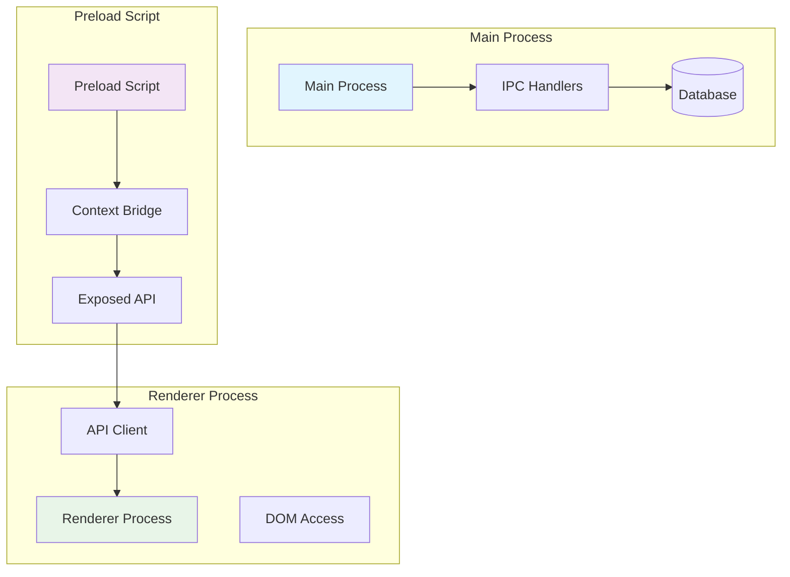
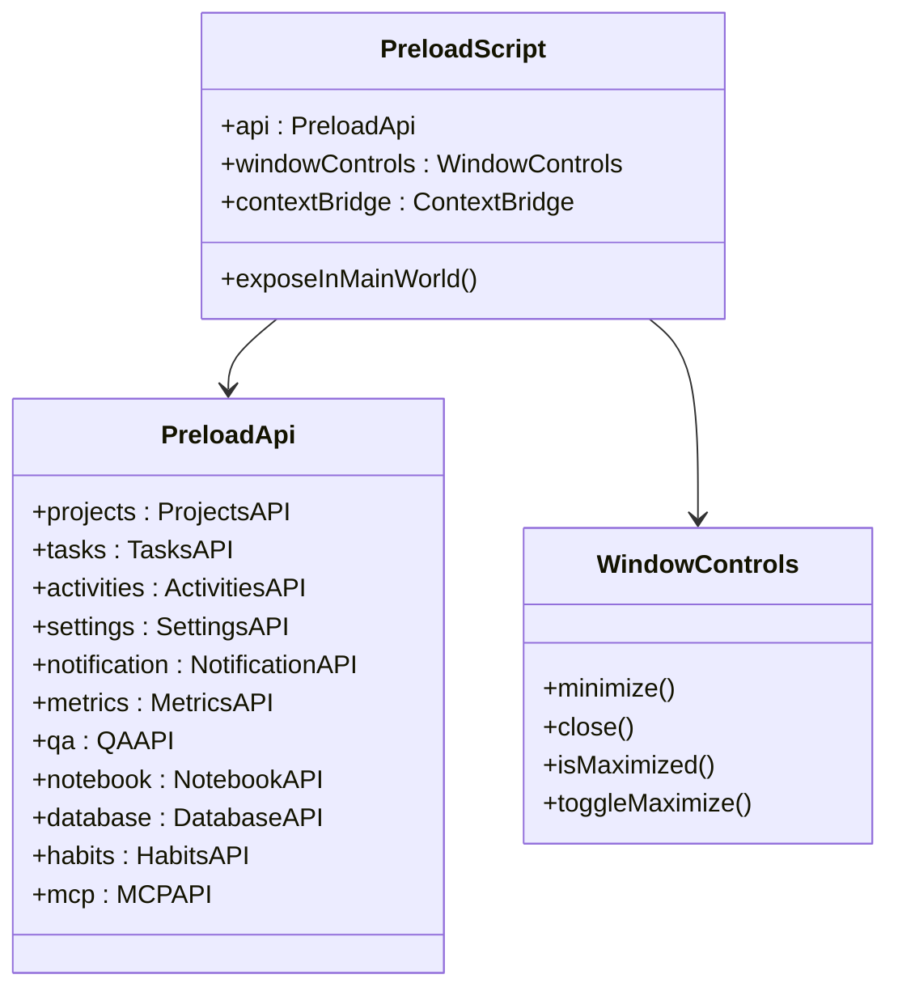
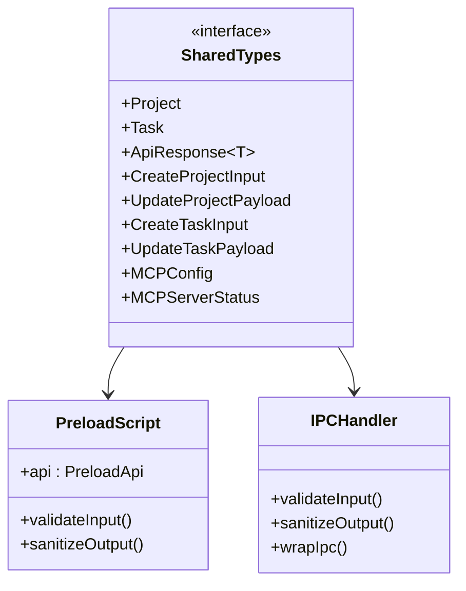
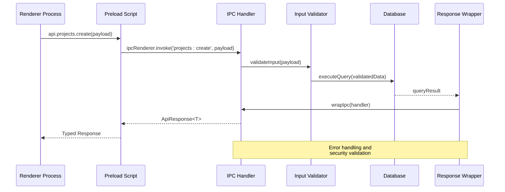
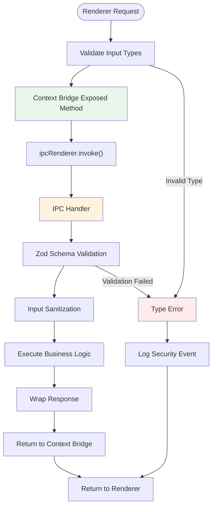
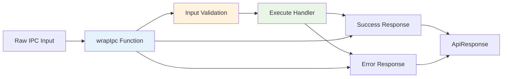

# Security Model and Context Isolation

<cite>
**Referenced Files in This Document**
- [src/preload/index.ts](file://src/preload/index.ts)
- [src/common/types.ts](file://src/common/types/types.ts)
- [src/main/index.ts](file://src/main/index.ts)
- [src/main/utils/response.ts](file://src/main/utils/response.ts)
- [src/main/ipc/projects.ts](file://src/main/ipc/projects.ts)
- [src/main/ipc/tasks.ts](file://src/main/ipc/tasks.ts)
- [src/main/ipc/window.ts](file://src/main/ipc/window.ts)
- [src/main/ipc/activities.ts](file://src/main/ipc/activities.ts)
- [src/main/ipc/settings.ts](file://src/main/ipc/settings.ts)
- [src/database/projectsRepo.ts](file://src/database/projectsRepo.ts)
- [src/services/settings.ts](file://src/services/settings.ts)
- [AI/SECURITY.md](file://AI/SECURITY.md)
- [package.json](file://package.json)
</cite>

## Table of Contents
1. [Introduction](#introduction)
2. [Context Isolation Architecture](#context-isolation-architecture)
3. [Preload Script Security Model](#preload-script-security-model)
4. [Type Safety Across Process Boundaries](#type-safety-across-process-boundaries)
5. [IPC Communication Security](#ipc-communication-security)
6. [Prototype Pollution Mitigation](#prototype-pollution-mitigation)
7. [Security Best Practices](#security-best-practices)
8. [Common Security Pitfalls](#common-security-pitfalls)
9. [Secure Coding Patterns](#secure-coding-patterns)
10. [Conclusion](#conclusion)

## Introduction

LifeOS implements a robust security architecture designed to protect against common Electron vulnerabilities while maintaining functional capabilities. The security model centers around context isolation, controlled API exposure through context bridge, and strict type validation across process boundaries. This document explores how the application enforces secure communication between renderer and main processes, mitigates prototype pollution attacks, and prevents unauthorized access to Electron's internal APIs.

The security architecture follows the principle of least privilege, exposing only necessary functionality through carefully crafted interfaces while preventing direct access to potentially dangerous Electron APIs.

## Context Isolation Architecture

### Secure Process Separation

LifeOS enables Electron's context isolation by setting `contextIsolation: true` in the web preferences, creating a secure boundary between the renderer process and the main process.

**Diagram sources**
- [src/main/index.ts](file://src/main/index.ts#L35-L40)
- [src/preload/index.ts](file://src/preload/index.ts#L1-L20)

### Why Context Isolation: False is Dangerous

Setting `contextIsolation: false` would expose the renderer process to severe security risks:

- **Direct Node.js Access**: Renderer could execute arbitrary Node.js code
- **Prototype Pollution**: Attackers could modify JavaScript prototypes
- **Electron API Exposure**: Direct access to Electron's internal APIs
- **File System Access**: Unrestricted file system operations
- **Network Access**: Direct network requests bypassing security controls

LifeOS maintains `contextIsolation: true` to prevent these vulnerabilities while still enabling necessary functionality through the context bridge.

**Section sources**
- [src/main/index.ts](file://src/main/index.ts#L35-L40)

## Preload Script Security Model

### Controlled API Surface

The preload script exposes a minimal, controlled API surface through the context bridge, preventing direct access to Electron's internal APIs.

**Diagram sources**
- [src/preload/index.ts](file://src/preload/index.ts#L180-L202)

### API Wrapping Pattern

The preload script wraps all IPC calls through typed interfaces, ensuring type safety and preventing direct access to Electron's IPC mechanisms.

**Section sources**
- [src/preload/index.ts](file://src/preload/index.ts#L1-L202)

## Type Safety Across Process Boundaries

### Shared Type Definitions

LifeOS uses TypeScript interfaces defined in shared modules to ensure type safety across process boundaries, preventing runtime type errors and security vulnerabilities.

**Diagram sources**
- [src/common/types.ts](file://src/common/types.ts#L1-L117)
- [src/preload/index.ts](file://src/preload/index.ts#L1-L15)

### Explicit Type Annotations

The preload script uses explicit type annotations to ensure that only validated data flows between processes:

- **Input Validation**: All incoming data is typed and validated
- **Output Sanitization**: All outgoing data maintains type safety
- **Generic Constraints**: Type parameters ensure proper data flow

**Section sources**
- [src/common/types.ts](file://src/common/types.ts#L1-L117)
- [src/preload/index.ts](file://src/preload/index.ts#L1-L15)

## IPC Communication Security

### Wrapped IPC Handlers

LifeOS implements a wrapping pattern for IPC handlers that provides consistent error handling, validation, and security enforcement.

**Diagram sources**
- [src/main/utils/response.ts](file://src/main/utils/response.ts#L15-L36)
- [src/preload/index.ts](file://src/preload/index.ts#L18-L25)

### Input Validation Pipeline

Each IPC handler implements a multi-layered validation pipeline:

1. **TypeScript Type Checking**: Compile-time validation
2. **Runtime Schema Validation**: Zod schema validation
3. **Parameter Sanitization**: Input sanitization
4. **Permission Checking**: Access control validation

**Section sources**
- [src/main/utils/response.ts](file://src/main/utils/response.ts#L15-L36)
- [src/main/ipc/projects.ts](file://src/main/ipc/projects.ts#L1-L84)
- [src/database/projectsRepo.ts](file://src/database/projectsRepo.ts#L10-L25)

## Prototype Pollution Mitigation

### Controlled API Exposure

The context bridge pattern prevents prototype pollution by exposing only controlled methods rather than allowing direct access to JavaScript objects.

**Diagram sources**
- [src/preload/index.ts](file://src/preload/index.ts#L18-L202)
- [src/main/utils/response.ts](file://src/main/utils/response.ts#L15-L36)

### Preventing Prototype Attacks

The security model prevents prototype pollution through several mechanisms:

- **Immutable API Objects**: API objects are not modifiable from renderer side
- **Controlled Method Exposure**: Only specific methods are exposed
- **Type Enforcement**: TypeScript prevents prototype manipulation
- **Runtime Validation**: Input validation prevents malicious payloads

**Section sources**
- [src/preload/index.ts](file://src/preload/index.ts#L180-L202)

## Security Best Practices

### Defense in Depth Approach

LifeOS implements multiple layers of security controls:

1. **Process Isolation**: Separate main and renderer processes
2. **API Boundary Control**: Controlled API exposure through context bridge
3. **Input Validation**: Multi-layered input validation
4. **Error Handling**: Graceful error handling without information leakage
5. **Type Safety**: Compile-time and runtime type checking

### Security Configuration

The application follows Electron security best practices:

- **Disable Node.js Integration**: `nodeIntegration: false`
- **Enable Context Isolation**: `contextIsolation: true`
- **Minimal API Exposure**: Only necessary APIs exposed
- **Strict Content Security Policy**: Prevents XSS attacks
- **Regular Dependency Updates**: Maintains security patches

**Section sources**
- [src/main/index.ts](file://src/main/index.ts#L35-L40)
- [AI/SECURITY.md](file://AI/SECURITY.md#L1-L22)

## Common Security Pitfalls

### Over-Exposing IPC Channels

**Problem**: Exposing too many IPC channels creates attack vectors.

**Solution**: LifeOS exposes only essential functionality through typed APIs.

### Leaking Sensitive Methods

**Problem**: Exposing internal methods allows bypassing security controls.

**Solution**: All functionality goes through validated IPC handlers with proper permissions.

### Inadequate Input Validation

**Problem**: Failing to validate input data leads to injection attacks.

**Solution**: Multi-layered validation using TypeScript types and Zod schemas.

### Improper Error Handling

**Problem**: Revealing internal error details to attackers.

**Solution**: Generic error messages without sensitive information disclosure.

**Section sources**
- [src/main/utils/response.ts](file://src/main/utils/response.ts#L15-L36)
- [src/main/ipc/projects.ts](file://src/main/ipc/projects.ts#L1-L84)

## Secure Coding Patterns

### WrapIpc Pattern

The `wrapIpc` function provides consistent error handling and security enforcement across all IPC handlers.

**Diagram sources**
- [src/main/utils/response.ts](file://src/main/utils/response.ts#L15-L36)

### Type-Safe API Design

LifeOS demonstrates secure API design through:

- **Explicit Interface Definitions**: Clear API contracts
- **Generic Type Constraints**: Type-safe data flow
- **Optional Property Handling**: Safe handling of nullable fields
- **Union Type Validation**: Proper handling of multiple possible types

### Database Access Control

All database operations go through validated repositories with proper transaction handling and error isolation.

**Section sources**
- [src/main/utils/response.ts](file://src/main/utils/response.ts#L15-L36)
- [src/database/projectsRepo.ts](file://src/database/projectsRepo.ts#L10-L25)
- [src/services/settings.ts](file://src/services/settings.ts#L1-L46)

## Conclusion

LifeOS implements a comprehensive security architecture that effectively mitigates common Electron vulnerabilities while maintaining functional capabilities. The combination of context isolation, controlled API exposure, type safety, and multi-layered validation creates a robust defense against attacks including prototype pollution, IPC misuse, and input injection.

Key security achievements include:

- **Zero Prototype Pollution Risk**: Through controlled API exposure and context isolation
- **Type Safety Across Processes**: Ensuring compile-time and runtime validation
- **Secure IPC Communication**: With wrapped handlers and input validation
- **Defense in Depth**: Multiple security layers protecting against various attack vectors

The security model serves as a template for building secure Electron applications, demonstrating how to balance functionality with security through careful API design and process separation.