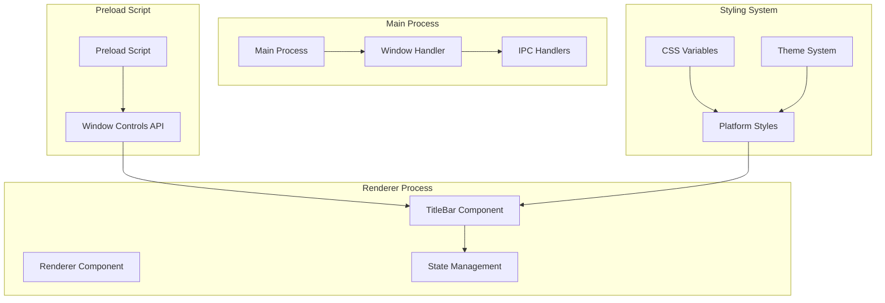
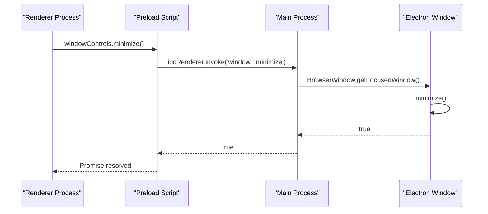
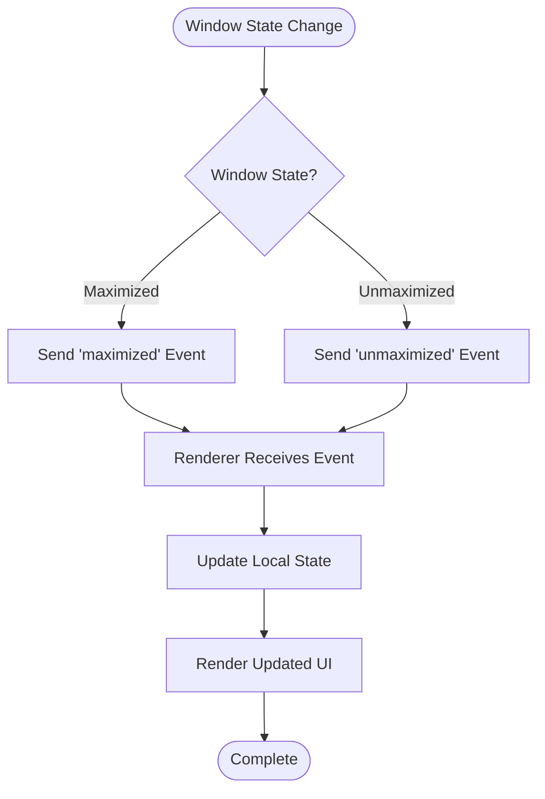
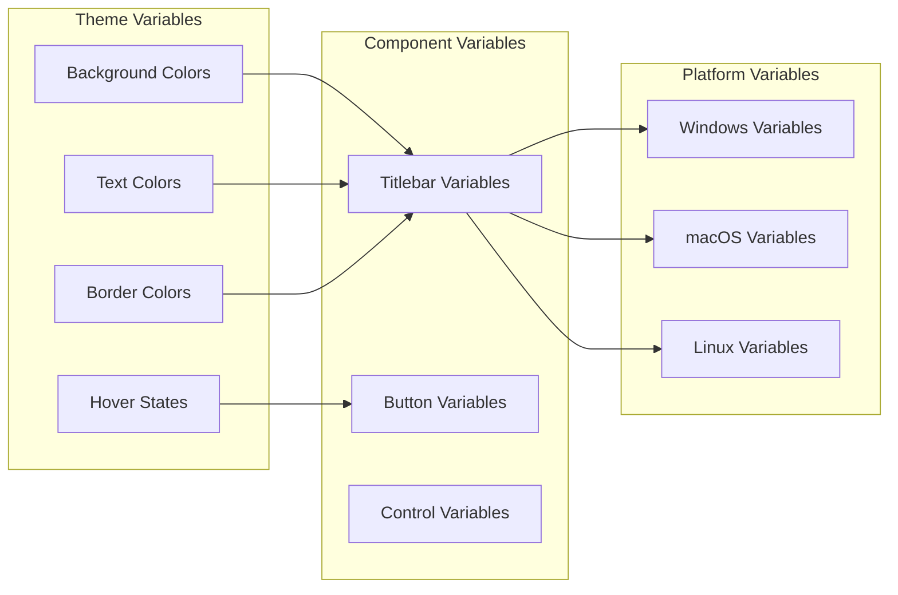
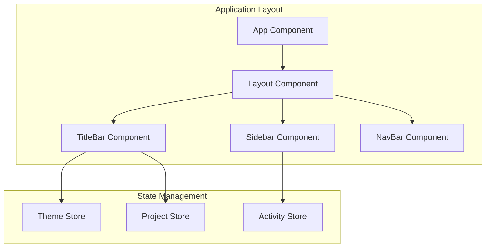

# Custom Titlebar Implementation and Integration

<cite>
**Referenced Files in This Document**
- [AI/CUSTOM-UI.md](file://AI/CUSTOM-UI.md)
- [src/renderer/components/TitleBar.tsx](file://src/renderer/components/TitleBar.tsx)
- [src/main/ipc/window.ts](file://src/main/ipc/window.ts)
- [src/preload/index.ts](file://src/preload/index.ts)
- [src/main/index.ts](file://src/main/index.ts)
- [src/renderer/styles.css](file://src/renderer/styles.css)
- [src/renderer/App.tsx](file://src/renderer/App.tsx)
- [src/store/theme.ts](file://src/store/theme.ts)
</cite>

## Table of Contents
1. [Introduction](#introduction)
2. [Design Goals and Architecture](#design-goals-and-architecture)
3. [Platform-Specific Implementations](#platform-specific-implementations)
4. [IPC Communication System](#ipc-communication-system)
5. [State Synchronization Mechanism](#state-synchronization-mechanism)
6. [Accessibility Features](#accessibility-features)
7. [Styling and Theming System](#styling-and-theming-system)
8. [Performance Optimizations](#performance-optimizations)
9. [Integration with Application Architecture](#integration-with-application-architecture)
10. [Future Enhancement Opportunities](#future-enhancement-opportunities)

## Introduction

LifeOS implements a sophisticated custom titlebar system that replaces Electron's default titlebar with a fully customizable, cross-platform solution. This implementation prioritizes native feel, brand consistency, accessibility, and performance while maintaining seamless integration with the application's architecture.

The custom titlebar system consists of several interconnected components: a main process handler for window controls, a renderer component for UI presentation, IPC communication channels for state synchronization, and comprehensive accessibility features including keyboard navigation and screen reader support.

## Design Goals and Architecture

### Core Design Principles

The custom titlebar implementation is built around four fundamental design goals:

**Native Feel**: Platform-appropriate styling and behavior that respects each operating system's conventions while maintaining a cohesive LifeOS identity.

**Brand Consistency**: Unified visual language that reinforces LifeOS branding through consistent typography, color schemes, and interactive elements.

**Accessibility**: Comprehensive support for keyboard navigation, screen readers, and assistive technologies to ensure inclusivity.

**Performance**: Smooth animations, responsive interactions, and efficient resource utilization through optimized rendering and event handling.

### System Architecture Overview

**Diagram sources**
- [src/main/index.ts](file://src/main/index.ts#L32-L45)
- [src/preload/index.ts](file://src/preload/index.ts#L184-L192)
- [src/renderer/components/TitleBar.tsx](file://src/renderer/components/TitleBar.tsx#L1-L63)

**Section sources**
- [AI/CUSTOM-UI.md](file://AI/CUSTOM-UI.md#L4-L12)
- [src/main/index.ts](file://src/main/index.ts#L32-L45)

## Platform-Specific Implementations

### Windows Titlebar Configuration

The Windows implementation follows Microsoft's Fluent Design principles with a standardized height of 32px and system theme awareness.

**Layout Components**:
- **Left Section**: App logo (LifeOS icon) and application title
- **Right Section**: Standard minimize, maximize, and close buttons
- **Height**: 32px (matches Windows standard titlebar height)
- **Color Scheme**: System theme-aware with automatic light/dark mode adaptation

**Traffic Light Buttons**:
- **Minimize**: Standard horizontal line button
- **Maximize/Restore**: Square button for expanded state, plus sign for minimized
- **Close**: Red circular button with X icon

### macOS Titlebar Configuration

The macOS implementation adheres to Apple's Human Interface Guidelines with traffic light buttons positioned on the left side.

**Layout Components**:
- **Left Section**: Traffic light buttons (red, yellow, green) in standard positions
- **Center Section**: Application title centered with appropriate spacing
- **Right Section**: Custom controls for search, settings, and other application-specific actions
- **Height**: 28px (standard macOS titlebar height)

**Traffic Light Button Specifications**:
- **Close Button**: Red circle (standard macOS close indicator)
- **Minimize Button**: Yellow circle (standard macOS minimize indicator)
- **Maximize Button**: Green circle (standard macOS maximize indicator)

### Linux Titlebar Configuration

The Linux implementation adapts to various desktop environments while maintaining consistent visual standards.

**Layout Components**:
- **Left Section**: Application icon and title with appropriate spacing
- **Right Section**: Window controls that adapt to the specific desktop environment
- **Height**: 32px (matches standard Linux titlebar height)
- **Behavior**: Respects desktop environment conventions for window management

**Platform Detection and Adaptation**:
The system automatically detects the operating system and applies appropriate styling and behavior modifications through CSS selectors and JavaScript runtime detection.

**Section sources**
- [AI/CUSTOM-UI.md](file://AI/CUSTOM-UI.md#L14-L36)
- [src/renderer/styles.css](file://src/renderer/styles.css#L20-L69)

## IPC Communication System

### Main Process Window Control Handlers

The main process implements comprehensive IPC handlers for all window control operations, ensuring secure and reliable communication between the renderer and main processes.

**Diagram sources**
- [src/main/ipc/window.ts](file://src/main/ipc/window.ts#L3-L10)
- [src/preload/index.ts](file://src/preload/index.ts#L184-L192)

### Available IPC Endpoints

| Endpoint | Purpose | Parameters | Return Type |
|----------|---------|------------|-------------|
| `window:minimize` | Minimize focused window | None | `Promise<boolean>` |
| `window:close` | Close focused window | None | `Promise<boolean>` |
| `window:is-maximized` | Check window maximized state | None | `Promise<boolean>` |
| `window:toggle-maximize` | Toggle window maximization | None | `Promise<boolean>` |

### Security Model

The IPC communication system implements a secure bridge through the preload script, exposing only necessary window control APIs to the renderer process while maintaining isolation and preventing unauthorized access to Electron's main process capabilities.

**Section sources**
- [src/main/ipc/window.ts](file://src/main/ipc/window.ts#L1-L27)
- [src/preload/index.ts](file://src/preload/index.ts#L184-L192)

## State Synchronization Mechanism

### Maximization State Tracking

The state synchronization system maintains real-time synchronization of window maximization state between the main process and renderer components through event-driven communication.

**Diagram sources**
- [src/main/ipc/window.ts](file://src/main/ipc/window.ts#L18-L26)
- [src/renderer/components/TitleBar.tsx](file://src/renderer/components/TitleBar.tsx#L8-L16)

### Renderer State Management

The renderer component implements local state management for maximization status with automatic synchronization through event listeners.

**State Initialization**:
- On component mount, the renderer polls the main process for current maximization state
- Local state is maintained and updated through event-driven notifications
- Best-effort state synchronization with manual state flipping for immediate feedback

**Event Listener Management**:
- Proper cleanup of event listeners to prevent memory leaks
- Automatic registration and deregistration of state change listeners
- Error handling for failed state synchronization attempts

### Synchronization Reliability

The system implements multiple fallback mechanisms to ensure state consistency:
- Immediate local state updates for responsive UI feedback
- Periodic polling for state verification
- Graceful degradation when synchronization fails

**Section sources**
- [src/renderer/components/TitleBar.tsx](file://src/renderer/components/TitleBar.tsx#L8-L35)
- [src/main/ipc/window.ts](file://src/main/ipc/window.ts#L18-L26)

## Accessibility Features

### Keyboard Navigation Support

The custom titlebar implements comprehensive keyboard navigation support following established accessibility guidelines and platform conventions.

**Alt+F4 Keyboard Shortcut**:
- **Purpose**: Close the application window
- **Implementation**: Global keyboard event listener that intercepts Alt+F4 combinations
- **Behavior**: Triggers the close window action regardless of focus state
- **Accessibility**: Provides alternative exit method for keyboard-only users

**Alt+F10 Keyboard Shortcut**:
- **Purpose**: Focus the titlebar area for enhanced keyboard navigation
- **Implementation**: Focus management system that moves focus to titlebar controls
- **Behavior**: Enables sequential keyboard navigation through window controls
- **Accessibility**: Facilitates comprehensive keyboard-only operation

### Screen Reader Support

The titlebar implementation includes extensive ARIA labeling and semantic markup for optimal screen reader compatibility.

**ARIA Label Implementation**:
- **Minimize Button**: `aria-label="Minimize"`
- **Maximize/Restore Button**: Dynamic labeling ("Maximize" or "Restore" based on current state)
- **Close Button**: `aria-label="Close"`
- **Titlebar Container**: Semantic role identification for screen reader navigation

**Focus Management**:
- Clear visual focus indicators for keyboard navigation
- Logical tab order through titlebar controls
- Focus trapping and restoration for modal interactions

### Visual Accessibility Features

**High Contrast Support**:
- Automatic adaptation to system high contrast modes
- Enhanced focus indicators for improved visibility
- Color contrast ratios meeting WCAG AA standards

**Reduced Motion Support**:
- Respects user preferences for reduced motion
- Disables unnecessary animations when preferred
- Maintains functionality while respecting user preferences

**Section sources**
- [AI/CUSTOM-UI.md](file://AI/CUSTOM-UI.md#L377-L400)
- [src/renderer/components/TitleBar.tsx](file://src/renderer/components/TitleBar.tsx#L45-L51)

## Styling and Theming System

### CSS Variable Architecture

The styling system employs a comprehensive CSS variable architecture that enables dynamic theming and consistent visual design across all platforms.

**Diagram sources**
- [src/store/theme.ts](file://src/store/theme.ts#L47-L87)
- [src/renderer/styles.css](file://src/renderer/styles.css#L20-L69)

### Dark Mode Implementation

The theme system implements a sophisticated dark mode with automatic system preference detection and manual override capabilities.

**Dark Mode Variables**:
- Background: `#121212` (LifeOS primary dark background)
- Surface: `#1e1e1e` (Secondary surface elements)
- Text Primary: `#ffffff` (High contrast text)
- Border: `rgba(255,255,255,0.12)` (Subtle borders)
- Hover: `rgba(255,255,255,0.05)` (Subtle hover effects)

**Light Mode Fallback**:
- Softer light mode with reduced contrast for eye comfort
- Alternative color palette with lighter backgrounds
- Maintained accessibility standards across both themes

### Platform-Specific Styling

The system applies platform-specific styling through CSS selectors that target different operating systems.

**Windows Styling**:
- Standard Windows titlebar height (32px)
- Windows-themed button appearances
- System theme integration

**macOS Styling**:
- Reduced height (28px) for macOS conventions
- Traffic light button styling
- Native macOS visual effects

**Linux Styling**:
- Flexible height adapting to desktop environment
- Desktop environment aware button placement
- Consistent visual appearance across distributions

### Drag Behavior Configuration

The `-webkit-app-region` CSS property manages drag behavior for window movement while allowing interactive elements to remain functional.

**Drag Regions**:
- **Titlebar**: Entire titlebar area is draggable
- **Interactive Elements**: Buttons and controls are marked as non-draggable
- **Edge Cases**: Specific handling for resize handles and other OS-specific elements

**Section sources**
- [src/store/theme.ts](file://src/store/theme.ts#L47-L87)
- [src/renderer/styles.css](file://src/renderer/styles.css#L20-L69)
- [AI/CUSTOM-UI.md](file://AI/CUSTOM-UI.md#L291-L376)

## Performance Optimizations

### Event Delegation and Memory Management

The titlebar implementation incorporates several performance optimization strategies to ensure smooth operation and efficient resource utilization.

**Event Listener Optimization**:
- Single event listener for titlebar-wide interactions
- Efficient event bubbling and propagation
- Automatic cleanup of event listeners on component unmount

**State Polling Efficiency**:
- One-time state polling on component mount
- Debounced state updates for rapid state changes
- Minimal network requests for state synchronization

**Rendering Optimizations**:
- Pure component patterns for minimal re-renders
- Memoized calculations for expensive operations
- Efficient DOM manipulation through React's virtual DOM

### Animation Performance

The system implements hardware-accelerated animations with performance-conscious timing and easing functions.

**Transition Properties**:
- `will-change: background-color` for GPU acceleration
- 150ms duration for smooth but responsive animations
- Ease-out timing functions for natural motion

**Hardware Acceleration**:
- CSS transforms for position changes
- Layer promotion for complex animations
- GPU-accelerated opacity changes

### Resource Management

**Memory Leak Prevention**:
- Proper cleanup of IPC listeners and event handlers
- Weak references for long-lived subscriptions
- Garbage collection friendly code patterns

**Network Efficiency**:
- Batched state updates to minimize IPC calls
- Caching of frequently accessed state information
- Lazy loading of non-critical resources

**Section sources**
- [AI/CUSTOM-UI.md](file://AI/CUSTOM-UI.md#L401-L433)
- [src/renderer/components/TitleBar.tsx](file://src/renderer/components/TitleBar.tsx#L8-L16)

## Integration with Application Architecture

### Component Integration

The custom titlebar integrates seamlessly with LifeOS's React-based architecture, serving as the primary header component for the application layout.

**Diagram sources**
- [src/renderer/App.tsx](file://src/renderer/App.tsx#L25-L45)
- [src/renderer/components/TitleBar.tsx](file://src/renderer/components/TitleBar.tsx#L1-L63)

### Layout Coordination

The titlebar coordinates with the overall application layout to ensure proper spacing and alignment across different screen sizes and orientations.

**Responsive Design**:
- Adaptive height for different platforms
- Flexible content arrangement based on available space
- Consistent spacing and alignment with main content area

**Content Integration**:
- Project switcher integration within titlebar
- User menu and profile access points
- Application-wide navigation controls

### State Synchronization

The titlebar participates in the application's state management system, receiving updates from various stores and maintaining consistency across the interface.

**Store Integration**:
- Theme preferences for visual consistency
- Project state for active project indicators
- Activity state for recent activity displays

**Event Propagation**:
- Window state changes propagate to all relevant components
- User preference changes trigger visual updates
- Application state changes update titlebar indicators

**Section sources**
- [src/renderer/App.tsx](file://src/renderer/App.tsx#L25-L45)
- [src/renderer/components/TitleBar.tsx](file://src/renderer/components/TitleBar.tsx#L1-L63)

## Future Enhancement Opportunities

### Advanced Features

The current implementation provides a solid foundation for future enhancements that could further improve the user experience and expand functionality.

**Custom Drag Areas**:
- Implementation of custom drag regions beyond the titlebar
- Edge and corner dragging for window resizing
- Multi-touch gesture support for touch-enabled devices

**Window Snapping**:
- Automatic window snapping to screen edges
- Grid-based window positioning
- Smart workspace integration

**Multi-Window Support**:
- Titlebar for multiple concurrent windows
- Tabbed interface within titlebar
- Window switching and management controls

**Custom Themes**:
- User-defined titlebar color schemes
- Icon customization options
- Layout modification capabilities

**Animation Effects**:
- Smooth transitions between maximized and restored states
- Micro-interactions for button hover and click
- Animated state changes for improved user feedback

### Technical Improvements

**Enhanced Performance**:
- Virtual scrolling for large titlebar content
- Optimized rendering for high-DPI displays
- Improved memory usage patterns

**Accessibility Enhancements**:
- Voice command integration
- Enhanced screen reader compatibility
- Additional keyboard shortcuts and navigation aids

**Cross-Platform Consistency**:
- Unified behavior across all supported platforms
- Platform-specific optimizations for each operating system
- Consistent visual appearance with platform conventions

**Section sources**
- [AI/CUSTOM-UI.md](file://AI/CUSTOM-UI.md#L467-L475)