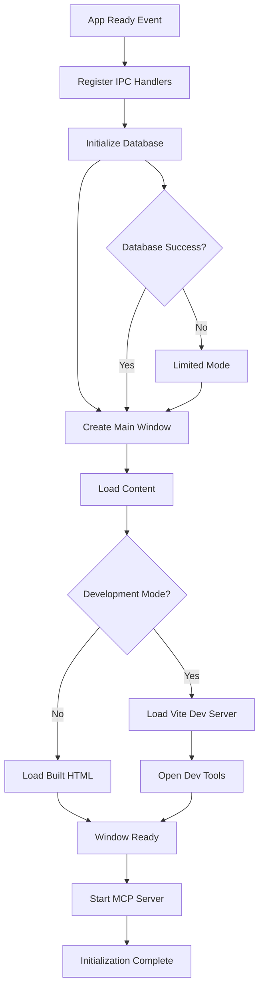
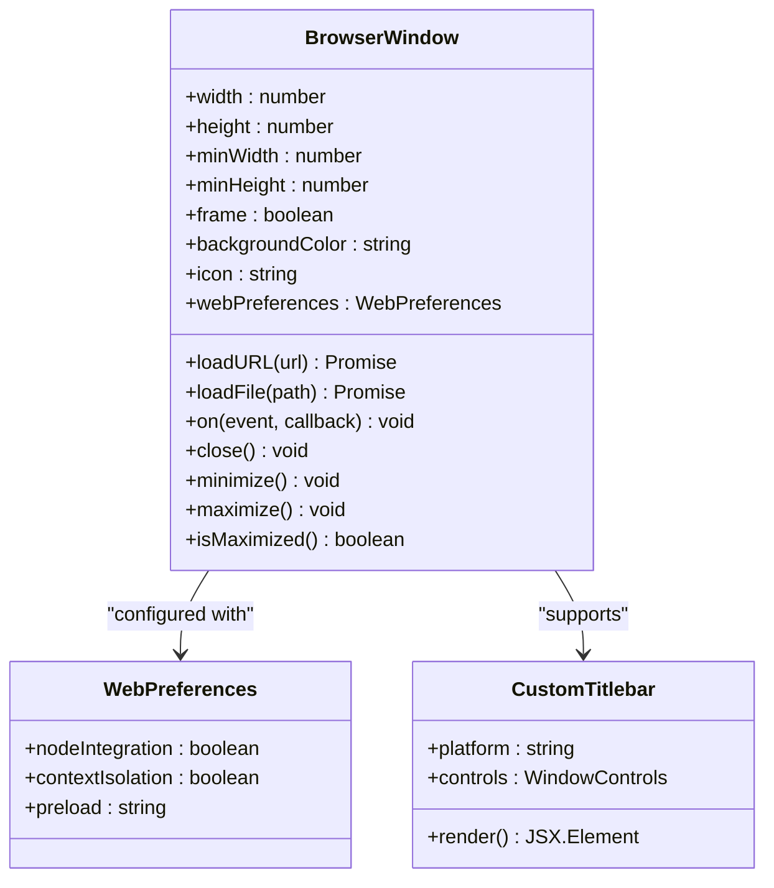
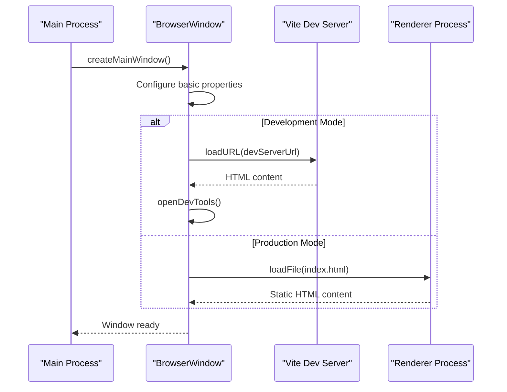
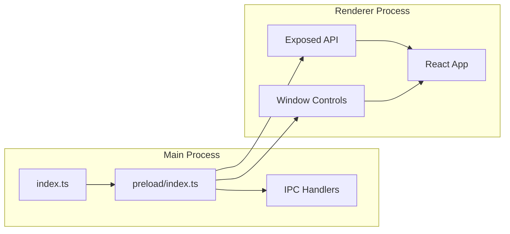
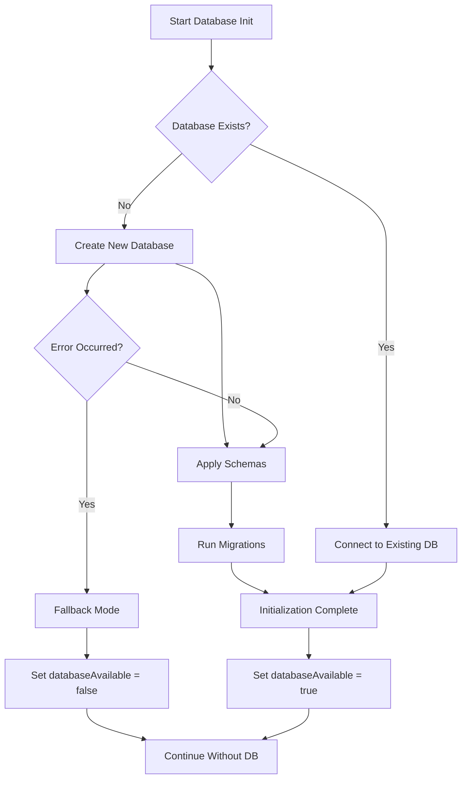
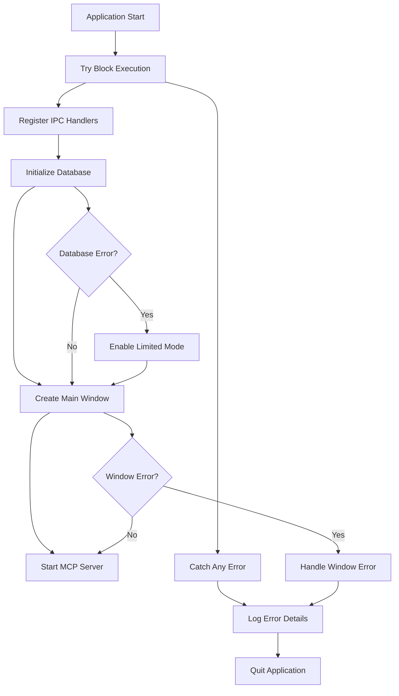

# Window Creation and Configuration

<cite>
**Referenced Files in This Document**
- [src/main/index.ts](file://src/main/index.ts)
- [src/main/window.ts](file://src/main/window.ts)
- [src/preload/index.ts](file://src/preload/index.ts)
- [src/database/init.ts](file://src/database/init.ts)
- [src/main/ipc/window.ts](file://src/main/ipc/window.ts)
- [configs/vite.config.ts](file://configs/vite.config.ts)
- [configs/tsup.config.ts](file://configs/tsup.config.ts)
- [package.json](file://package.json)
- [src/renderer/index.html](file://src/renderer/index.html)
- [AI/CUSTOM-UI.md](file://AI/CUSTOM-UI.md)
</cite>

## Table of Contents
1. [Introduction](#introduction)
2. [Window Creation Architecture](#window-creation-architecture)
3. [Core Window Configuration](#core-window-configuration)
4. [Environment-Specific Behaviors](#environment-specific-behaviors)
5. [Security and WebPreferences](#security-and-webpreferences)
6. [Database Integration](#database-integration)
7. [Cross-Platform Considerations](#cross-platform-considerations)
8. [Error Handling](#error-handling)
9. [Best Practices](#best-practices)
10. [Troubleshooting](#troubleshooting)

## Introduction

LifeOS implements a sophisticated window creation system using Electron's BrowserWindow API, designed to provide a modern, custom-titled desktop application experience. The window creation process is carefully orchestrated to handle development and production environments differently while maintaining security, performance, and cross-platform compatibility.

The main window serves as the primary interface for the productivity operating system, integrating multiple modules including task management, note-taking, habit tracking, and analytics. The window configuration emphasizes custom UI elements, secure communication channels, and optimal user experience across different platforms.

## Window Creation Architecture

The window creation process follows a structured approach with clear separation of concerns between the main process, preload scripts, and renderer components.

**Diagram sources**
- [src/main/index.ts](file://src/main/index.ts#L75-L122)

**Section sources**
- [src/main/index.ts](file://src/main/index.ts#L75-L122)

## Core Window Configuration

The `createMainWindow` function implements the core window configuration with several critical parameters optimized for LifeOS's requirements.

### Basic Window Properties

The window is configured with specific dimensions and constraints to ensure optimal user experience:

- **Default Size**: 1200×800 pixels for comfortable workspace
- **Minimum Size**: 800×600 pixels to maintain usability
- **Frameless Design**: `frame: false` enables custom titlebar implementation
- **Background Color**: Dark theme background (#121212) for improved readability
- **Platform Icons**: Environment-specific icon resolution

### Frameless Window Implementation

The frameless window design allows for complete customization of the titlebar while maintaining essential window functionality:

**Diagram sources**
- [src/main/index.ts](file://src/main/index.ts#L35-L55)
- [src/preload/index.ts](file://src/preload/index.ts#L1-L50)

**Section sources**
- [src/main/index.ts](file://src/main/index.ts#L35-L55)

## Environment-Specific Behaviors

LifeOS implements distinct behaviors for development and production environments to optimize the development workflow and final application performance.

### Development Mode Configuration

During development, the application loads content from the Vite development server:

- **Vite Dev Server URL**: Retrieved from `process.env.VITE_DEV_SERVER_URL`
- **Hot Reload**: Automatic reloading of frontend changes
- **Developer Tools**: Automatically opened for debugging
- **Source Maps**: Enabled for better debugging experience

### Production Mode Configuration

In production, the application loads pre-built static content:

- **Built HTML Path**: Resolved from compiled renderer directory
- **Static Assets**: Optimized bundle loading
- **Performance**: Reduced startup time and memory usage
- **Security**: Hardened security settings

**Diagram sources**
- [src/main/index.ts](file://src/main/index.ts#L57-L65)
- [configs/vite.config.ts](file://configs/vite.config.ts#L15-L20)

**Section sources**
- [src/main/index.ts](file://src/main/index.ts#L57-L65)

## Security and WebPreferences

LifeOS implements robust security measures through careful configuration of the BrowserWindow's webPreferences property.

### Security Configuration

The webPreferences are configured with security-first principles:

- **Node Integration**: Disabled (`nodeIntegration: false`) to prevent direct Node.js access
- **Context Isolation**: Enabled (`contextIsolation: true`) for secure IPC communication
- **Preload Script**: Specifies the secure bridge between main and renderer processes

### Preload Script Architecture

The preload script establishes a secure API surface for the renderer process:

**Diagram sources**
- [src/preload/index.ts](file://src/preload/index.ts#L190-L202)
- [src/main/index.ts](file://src/main/index.ts#L45-L47)

### API Exposure Pattern

The preload script exposes APIs through the `contextBridge` mechanism, providing controlled access to main process functionality:

- **API Namespace**: `window.api` for all application features
- **Window Controls**: `windowControls` for window manipulation
- **Type Safety**: Comprehensive TypeScript definitions
- **Error Handling**: Graceful degradation when APIs are unavailable

**Section sources**
- [src/preload/index.ts](file://src/preload/index.ts#L190-L202)
- [src/main/index.ts](file://src/main/index.ts#L45-L47)

## Database Integration

The window creation process integrates closely with database initialization to ensure proper application state management.

### Database Initialization Flow

The database initialization occurs before window creation, with fallback mechanisms for development environments:

**Diagram sources**
- [src/database/init.ts](file://src/database/init.ts#L15-L35)

### Database Availability Flag

The application maintains a global flag `databaseAvailable` to indicate database status:

- **Production**: Database is mandatory for full functionality
- **Development**: Database failure triggers limited mode
- **Feature Detection**: Applications can adapt UI based on database availability

**Section sources**
- [src/main/index.ts](file://src/main/index.ts#L10-L11)
- [src/database/init.ts](file://src/database/init.ts#L15-L35)

## Cross-Platform Considerations

LifeOS window creation handles platform-specific requirements and user expectations across Windows, macOS, and Linux.

### Icon Resolution Strategy

The application implements platform-appropriate icon resolution:

- **Development**: Project root SVG icon for easy access
- **Production**: Packaged resources path for distribution
- **Format Support**: SVG format for scalable graphics
- **Path Resolution**: Dynamic path construction based on environment

### Platform-Specific Window Behavior

While the core window configuration remains consistent, the custom titlebar adapts to platform conventions:

- **macOS**: Traffic light controls (red, yellow, green)
- **Windows**: Standard minimize/maximize/close buttons
- **Linux**: Platform-dependent window controls
- **Drag Regions**: Consistent draggable areas across platforms

### Environment Variable Handling

The application uses environment variables for cross-platform compatibility:

- **NODE_ENV**: Determines development vs production mode
- **VITE_DEV_SERVER_URL**: Development server configuration
- **resourcesPath**: Production resource location

**Section sources**
- [src/main/index.ts](file://src/main/index.ts#L20-L25)
- [AI/CUSTOM-UI.md](file://AI/CUSTOM-UI.md#L110-L226)

## Error Handling

LifeOS implements comprehensive error handling throughout the window creation and initialization process.

### Initialization Error Management

The main process includes robust error handling for various failure scenarios:

**Diagram sources**
- [src/main/index.ts](file://src/main/index.ts#L75-L122)

### Error Recovery Strategies

The application implements several error recovery mechanisms:

- **Graceful Degradation**: Limited functionality when databases fail
- **Application Termination**: Safe shutdown on critical errors
- **Logging**: Comprehensive error logging for debugging
- **User Feedback**: Informative error messages when possible

### Window-Specific Error Handling

Window creation includes specific error handling for common failure scenarios:

- **Loading Failures**: Network timeouts, file not found
- **IPC Communication**: Handler registration failures
- **Resource Loading**: Icon and asset loading issues
- **Platform Compatibility**: OS-specific initialization problems

**Section sources**
- [src/main/index.ts](file://src/main/index.ts#L75-L122)
- [src/database/init.ts](file://src/database/init.ts#L30-L35)

## Best Practices

LifeOS window creation demonstrates several best practices for Electron application development.

### Modular Architecture

The window creation process follows modular design principles:

- **Separation of Concerns**: Clear distinction between main process, preload, and renderer
- **Reusability**: Configurable window options for different contexts
- **Testability**: Isolated components for easier testing
- **Maintainability**: Well-organized code structure

### Performance Optimization

Several performance optimizations are implemented:

- **Lazy Loading**: Database initialization before window creation
- **Resource Management**: Proper cleanup of window instances
- **Memory Efficiency**: Minimal resource usage in development mode
- **Startup Optimization**: Parallel initialization where possible

### Security Implementation

Security best practices are embedded throughout the window creation:

- **Minimal Permissions**: Restricted webPreferences configuration
- **Secure Communication**: Context isolation and preload script security
- **Error Boundaries**: Comprehensive error handling prevents security leaks
- **Validation**: Input validation for all IPC communications

### Development Experience

The development workflow is optimized for developer productivity:

- **Hot Reload**: Automatic frontend updates during development
- **Debugging Tools**: Integrated developer tools
- **Environment Detection**: Automatic mode switching
- **Build Optimization**: Efficient compilation pipeline

**Section sources**
- [src/main/index.ts](file://src/main/index.ts#L15-L25)
- [configs/tsup.config.ts](file://configs/tsup.config.ts#L1-L31)

## Troubleshooting

Common issues and solutions for LifeOS window creation and configuration.

### Development Mode Issues

**Problem**: Vite development server not starting
- **Solution**: Verify `VITE_DEV_SERVER_URL` environment variable
- **Check**: Port 5173 availability and firewall settings
- **Alternative**: Restart development server and rebuild

**Problem**: Hot reload not working
- **Solution**: Ensure file watching permissions are correct
- **Check**: TypeScript compilation errors preventing reload
- **Alternative**: Manual refresh of browser window

### Production Mode Issues

**Problem**: Application fails to load in production
- **Solution**: Verify build artifacts in `dist/` directory
- **Check**: Correct file paths in production configuration
- **Alternative**: Rebuild application with `npm run build`

**Problem**: Database initialization failure
- **Solution**: Check user data directory permissions
- **Check**: Disk space availability for database creation
- **Alternative**: Clear corrupted database files

### Cross-Platform Compatibility

**Problem**: Window sizing issues on different platforms
- **Solution**: Adjust minimum dimensions for platform-specific requirements
- **Check**: DPI scaling settings affecting window calculations
- **Alternative**: Platform-specific window configuration

**Problem**: Icon display issues
- **Solution**: Verify icon file format and path resolution
- **Check**: Icon file accessibility in production builds
- **Alternative**: Use platform-appropriate icon formats

### Security and WebPreferences

**Problem**: Preload script loading failures
- **Solution**: Verify preload script path and compilation
- **Check**: Context isolation configuration
- **Alternative**: Review security policy settings

**Problem**: IPC communication errors
- **Solution**: Ensure proper handler registration order
- **Check**: API exposure through context bridge
- **Alternative**: Debug IPC message routing

**Section sources**
- [src/main/index.ts](file://src/main/index.ts#L75-L122)
- [src/database/init.ts](file://src/database/init.ts#L30-L35)