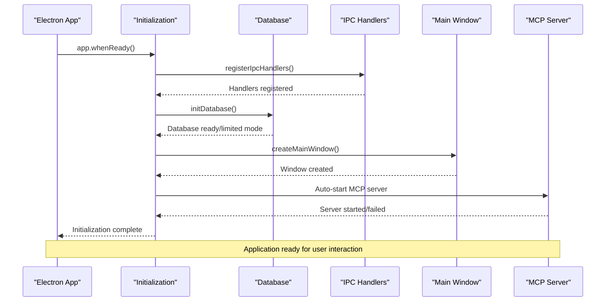
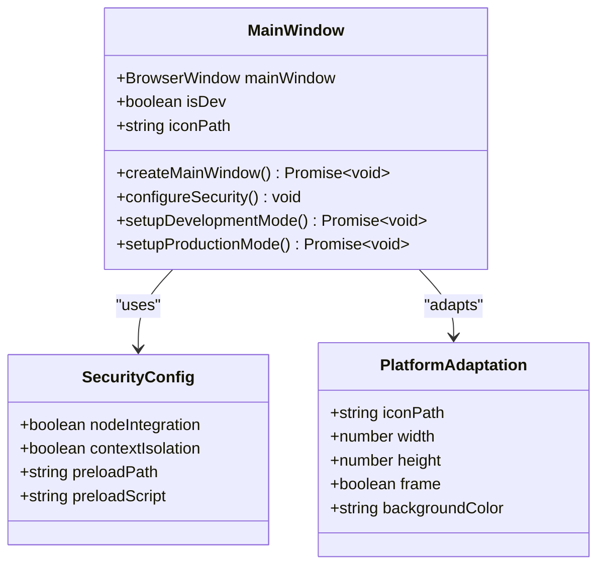
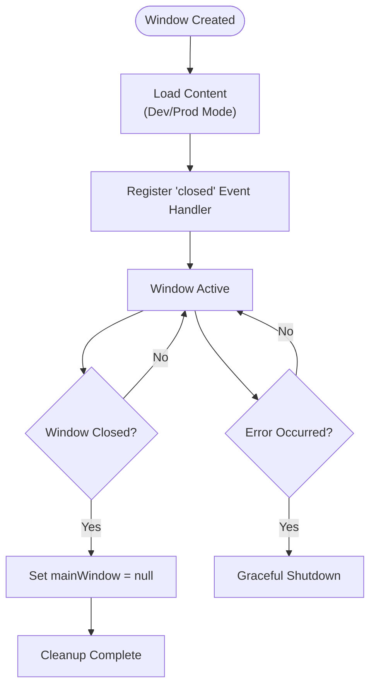
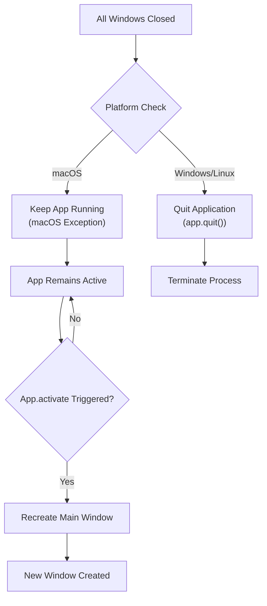
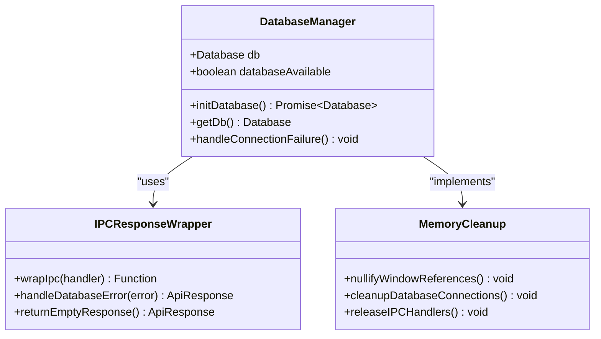
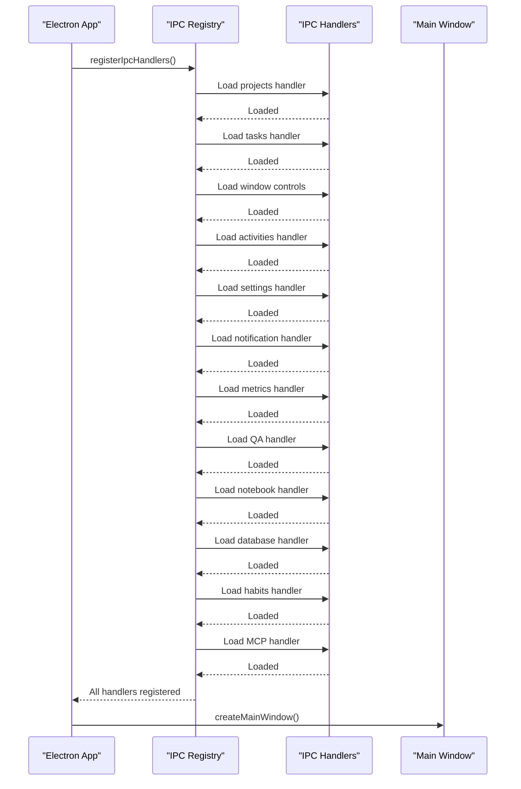
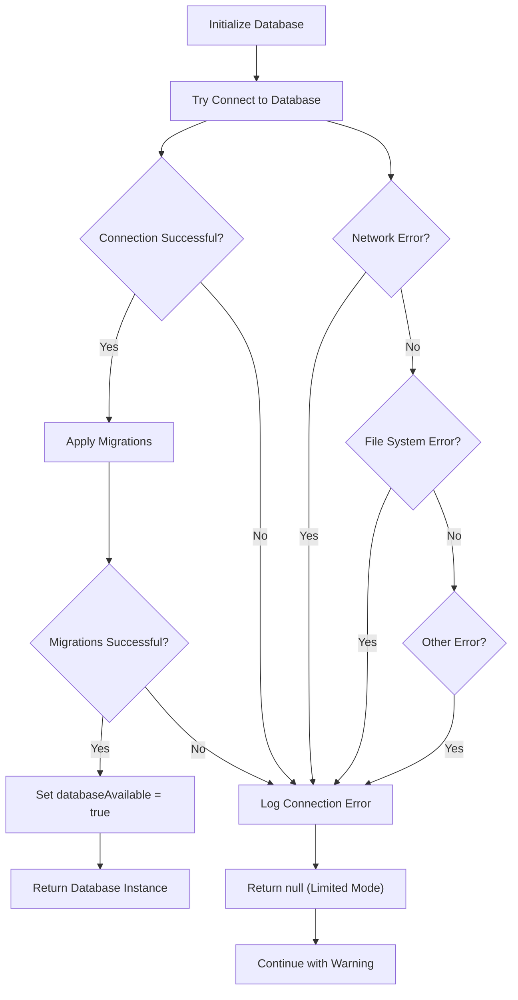
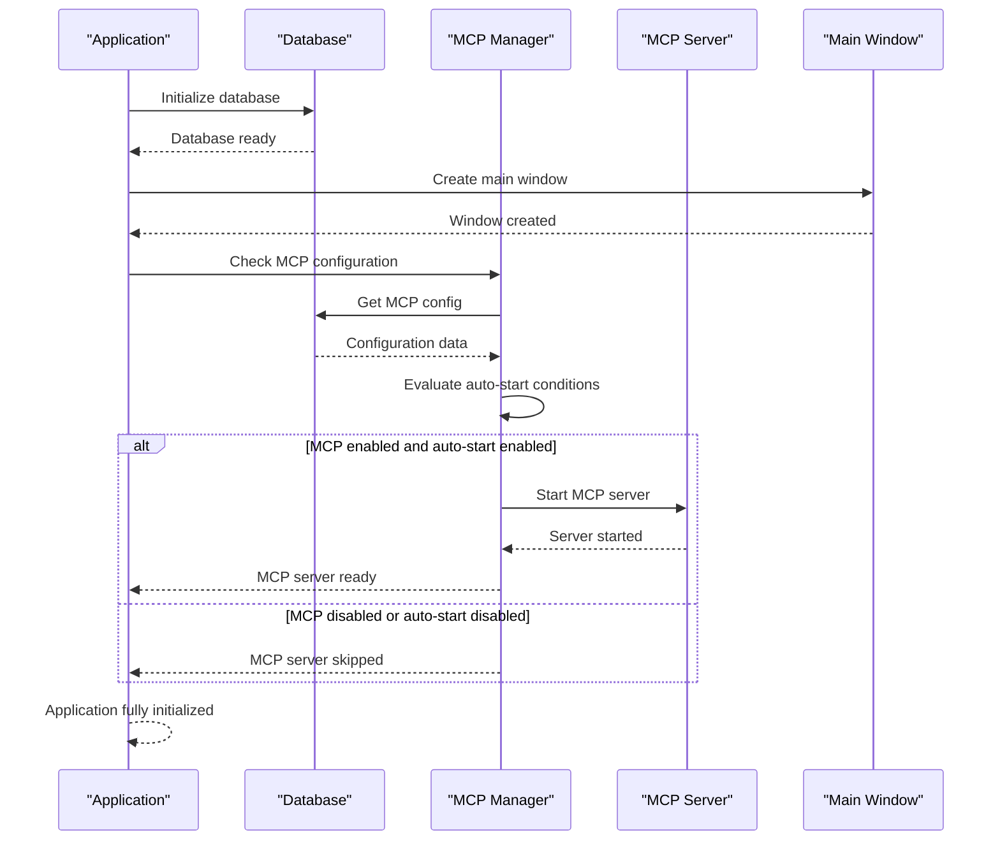

# Window Lifecycle Management

<cite>
**Referenced Files in This Document**
- [src/main/index.ts](file://src/main/index.ts)
- [src/main/ipc/window.ts](file://src/main/ipc/window.ts)
- [src/preload/index.ts](file://src/preload/index.ts)
- [src/database/init.ts](file://src/database/init.ts)
- [src/main/ipc/mcp.ts](file://src/main/ipc/mcp.ts)
- [src/main/utils/response.ts](file://src/main/utils/response.ts)
- [src/database/mcpRepo.ts](file://src/database/mcpRepo.ts)
- [package.json](file://package.json)
</cite>

## Table of Contents
1. [Introduction](#introduction)
2. [Application Initialization Flow](#application-initialization-flow)
3. [Window Creation and Management](#window-creation-and-management)
4. [Lifecycle Event Handlers](#lifecycle-event-handlers)
5. [Memory Management and Cleanup](#memory-management-and-cleanup)
6. [Platform-Specific Behavior](#platform-specific-behavior)
7. [IPC Communication Setup](#ipc-communication-setup)
8. [Error Handling Strategies](#error-handling-strategies)
9. [MCP Server Integration](#mcp-server-integration)
10. [Best Practices and Recommendations](#best-practices-and-recommendations)

## Introduction

LifeOS implements a sophisticated Electron window lifecycle management system that ensures proper resource allocation, memory management, and platform-specific behavior handling. The application follows a carefully orchestrated sequence of initialization steps, including database setup, IPC handler registration, and window creation, while maintaining robust error handling and graceful degradation capabilities.

The window lifecycle management encompasses several critical aspects:
- **Application readiness coordination** between database initialization and window creation
- **Memory leak prevention** through proper cleanup of window references
- **Platform-specific adaptations** for macOS, Windows, and Linux
- **IPC communication readiness** before window rendering
- **Graceful error handling** during lifecycle transitions
- **MCP server integration** for AI assistant functionality

## Application Initialization Flow

The application initialization follows a structured sequence designed to ensure all dependencies are properly established before user interaction begins.

**Diagram sources**
- [src/main/index.ts](file://src/main/index.ts#L75-L121)

The initialization process begins with `app.whenReady()` which ensures the Electron framework is fully prepared before proceeding with application setup. This guarantees that all subsequent operations have access to the complete Electron API surface.

**Section sources**
- [src/main/index.ts](file://src/main/index.ts#L75-L121)

## Window Creation and Management

The main window creation process involves multiple configuration steps and platform-specific considerations to ensure optimal user experience across different operating systems.

### Window Configuration

The main window is configured with specific dimensions, security preferences, and platform adaptations:

**Diagram sources**
- [src/main/index.ts](file://src/main/index.ts#L32-L65)

### Window Lifecycle Events

The window implements critical lifecycle event handlers to manage its state and prevent memory leaks:

**Diagram sources**
- [src/main/index.ts](file://src/main/index.ts#L58-L65)

**Section sources**
- [src/main/index.ts](file://src/main/index.ts#L32-L65)

## Lifecycle Event Handlers

LifeOS implements comprehensive lifecycle event handlers that manage application behavior across different scenarios and platforms.

### 'closed' Event Handler

The most critical lifecycle event is the 'closed' event handler, which prevents memory leaks by properly nullifying the mainWindow reference:

The 'closed' event handler is registered immediately after window creation and serves as the primary mechanism for memory leak prevention. When the window closes, the handler sets the mainWindow global variable to null, allowing the garbage collector to reclaim the associated memory resources.

### 'window-all-closed' Event Handler

This event manages platform-specific application termination behavior:

**Diagram sources**
- [src/main/index.ts](file://src/main/index.ts#L117-L121)

The 'window-all-closed' event implements the macOS platform exception where closing all windows doesn't terminate the application. Instead, the application remains active in the background, ready to recreate windows when activated.

### 'activate' Event Handler

The activate event handler ensures application resurrection when no windows exist:

This handler is crucial for macOS applications, where the dock icon click triggers the activate event. It checks if any windows exist and creates a new main window if necessary, ensuring the application remains responsive to user interactions.

**Section sources**
- [src/main/index.ts](file://src/main/index.ts#L110-L121)

## Memory Management and Cleanup

LifeOS implements robust memory management strategies to prevent memory leaks and ensure efficient resource utilization throughout the application lifecycle.

### Reference Nullification Strategy

The primary memory leak prevention mechanism involves immediate nullification of window references upon closure:

The 'closed' event handler performs the critical cleanup operation by setting the mainWindow global variable to null. This action removes the strong reference to the BrowserWindow instance, enabling garbage collection of the associated memory resources.

### Database Connection Management

The application maintains careful control over database connections and handles connection failures gracefully:

**Diagram sources**
- [src/main/index.ts](file://src/main/index.ts#L7-L8)
- [src/main/utils/response.ts](file://src/main/utils/response.ts#L18-L35)

### Resource Cleanup Coordination

The application coordinates cleanup across multiple resource types during shutdown scenarios, ensuring comprehensive memory management.

**Section sources**
- [src/main/index.ts](file://src/main/index.ts#L58-L65)
- [src/main/utils/response.ts](file://src/main/utils/response.ts#L18-L35)

## Platform-Specific Behavior

LifeOS adapts its window lifecycle behavior to accommodate platform-specific conventions and user expectations across different operating systems.

### macOS Platform Adaptations

macOS requires special handling for window lifecycle events due to its unique application model:

- **Dock-based activation**: Clicking the dock icon triggers the activate event rather than creating new windows
- **Background persistence**: Closing all windows doesn't terminate the application
- **Menu bar integration**: Applications remain accessible through the menu bar

### Windows and Linux Behavior

These platforms follow the traditional desktop application model where window closure directly affects application lifecycle:

- **Immediate termination**: Closing the last window terminates the application
- **Taskbar integration**: Applications are managed through the taskbar
- **Standard window controls**: Full window management through standard UI elements

### Cross-Platform Consistency

Despite platform differences, LifeOS maintains consistent behavior through unified event handling patterns and abstraction layers.

**Section sources**
- [src/main/index.ts](file://src/main/index.ts#L117-L121)

## IPC Communication Setup

LifeOS establishes inter-process communication channels before window creation to ensure immediate availability of all functionality upon application startup.

### IPC Handler Registration Order

The application follows a specific sequence for registering IPC handlers to ensure proper initialization order:

**Diagram sources**
- [src/main/index.ts](file://src/main/index.ts#L14-L25)

### Pre-Window Communication Readiness

All IPC handlers are loaded and registered before window creation, ensuring that the renderer process can immediately utilize all application features upon startup. This approach eliminates race conditions and provides consistent functionality availability.

### Window Control IPC Implementation

The window control IPC handlers provide essential window manipulation capabilities:

| Handler | Purpose | Parameters | Return Type |
|---------|---------|------------|-------------|
| `window:minimize` | Minimize focused window | None | `Promise<boolean>` |
| `window:close` | Close focused window | None | `Promise<boolean>` |
| `window:is-maximized` | Check window maximization state | None | `Promise<boolean>` |
| `window:toggle-maximize` | Toggle window maximization | None | `Promise<boolean>` |

**Section sources**
- [src/main/index.ts](file://src/main/index.ts#L14-L25)
- [src/main/ipc/window.ts](file://src/main/ipc/window.ts#L1-L27)

## Error Handling Strategies

LifeOS implements comprehensive error handling strategies throughout the window lifecycle to ensure graceful degradation and user-friendly error experiences.

### Database Initialization Error Handling

The database initialization process includes robust error handling for various failure scenarios:

**Diagram sources**
- [src/database/init.ts](file://src/database/init.ts#L20-L35)

### Application-Level Error Recovery

The top-level application initialization includes error recovery mechanisms that can gracefully handle initialization failures:

- **Database failure tolerance**: The application continues in limited mode if database initialization fails
- **IPC registration protection**: Failed IPC registrations don't prevent window creation
- **MCP server fallback**: MCP server startup failures are logged but don't block application startup

### IPC Error Handling Wrapper

LifeOS implements a centralized error handling wrapper for IPC handlers that provides consistent error responses and graceful degradation:

The error handling wrapper intercepts exceptions from IPC handlers and converts them into standardized ApiResponse objects. When the database is unavailable, the wrapper returns empty responses for data-dependent operations rather than failing requests.

**Section sources**
- [src/database/init.ts](file://src/database/init.ts#L20-L35)
- [src/main/index.ts](file://src/main/index.ts#L95-L105)
- [src/main/utils/response.ts](file://src/main/utils/response.ts#L18-L35)

## MCP Server Integration

LifeOS integrates the MCP (Model Context Protocol) server into the window lifecycle management system, providing AI assistant functionality that starts automatically when enabled.

### MCP Server Lifecycle Coordination

The MCP server integration occurs after successful application initialization and follows the established lifecycle patterns:

**Diagram sources**
- [src/main/index.ts](file://src/main/index.ts#L85-L105)
- [src/main/ipc/mcp.ts](file://src/main/ipc/mcp.ts#L15-L50)

### MCP Server Startup Conditions

The MCP server startup follows specific conditional logic based on configuration and environment:

- **Development mode exclusion**: MCP server auto-start is skipped in development mode due to native module build issues
- **Configuration validation**: The server only starts if MCP is enabled and auto-start is configured
- **Binary verification**: The system verifies the existence of the compiled MCP server binary before attempting startup

### MCP Server Management

The MCP server implements comprehensive lifecycle management with proper error handling and state tracking:

| Operation | Purpose | Error Handling | State Management |
|-----------|---------|----------------|------------------|
| Start | Launch MCP server process | Process error listeners | Track startup time |
| Stop | Terminate MCP server | SIGTERM/SIGKILL fallback | Clear state variables |
| Status | Check server health | Graceful degradation | Uptime calculation |
| Configuration | Update server settings | Validation and persistence | Real-time updates |

**Section sources**
- [src/main/index.ts](file://src/main/index.ts#L85-L105)
- [src/main/ipc/mcp.ts](file://src/main/ipc/mcp.ts#L15-L84)

## Best Practices and Recommendations

Based on the LifeOS implementation, several best practices emerge for Electron window lifecycle management:

### Initialization Sequence Best Practices

1. **Order Dependencies**: Always initialize dependencies in the correct order - database → IPC handlers → window creation
2. **Graceful Degradation**: Implement fallback mechanisms for optional components like databases
3. **Error Boundaries**: Wrap critical initialization code in try-catch blocks with appropriate error handling
4. **Logging Integration**: Provide comprehensive logging for debugging and monitoring

### Memory Management Guidelines

1. **Immediate Cleanup**: Nullify window references immediately upon closure
2. **Resource Tracking**: Monitor resource usage and implement cleanup strategies
3. **Event Listener Management**: Remove event listeners when windows are destroyed
4. **IPC Handler Cleanup**: Ensure IPC handlers are properly registered before window creation

### Platform-Specific Considerations

1. **macOS Adaptation**: Implement the activate event handler for macOS-specific behavior
2. **Cross-Platform Testing**: Test lifecycle events across all target platforms
3. **User Expectation Alignment**: Follow platform conventions for application behavior
4. **Graceful Fallbacks**: Provide alternative behaviors when platform-specific features aren't available

### Error Handling Strategies

1. **Centralized Wrapping**: Use wrapper functions for consistent error handling across IPC handlers
2. **User-Friendly Messages**: Convert technical errors into user-friendly messages when appropriate
3. **Logging Integration**: Implement comprehensive logging for debugging and monitoring
4. **Recovery Mechanisms**: Provide mechanisms for recovering from transient failures

### Performance Optimization

1. **Lazy Loading**: Load heavy resources only when needed
2. **Resource Pooling**: Reuse expensive resources when possible
3. **Efficient Cleanup**: Implement efficient cleanup strategies to minimize memory usage
4. **Monitoring Integration**: Track performance metrics and optimize accordingly