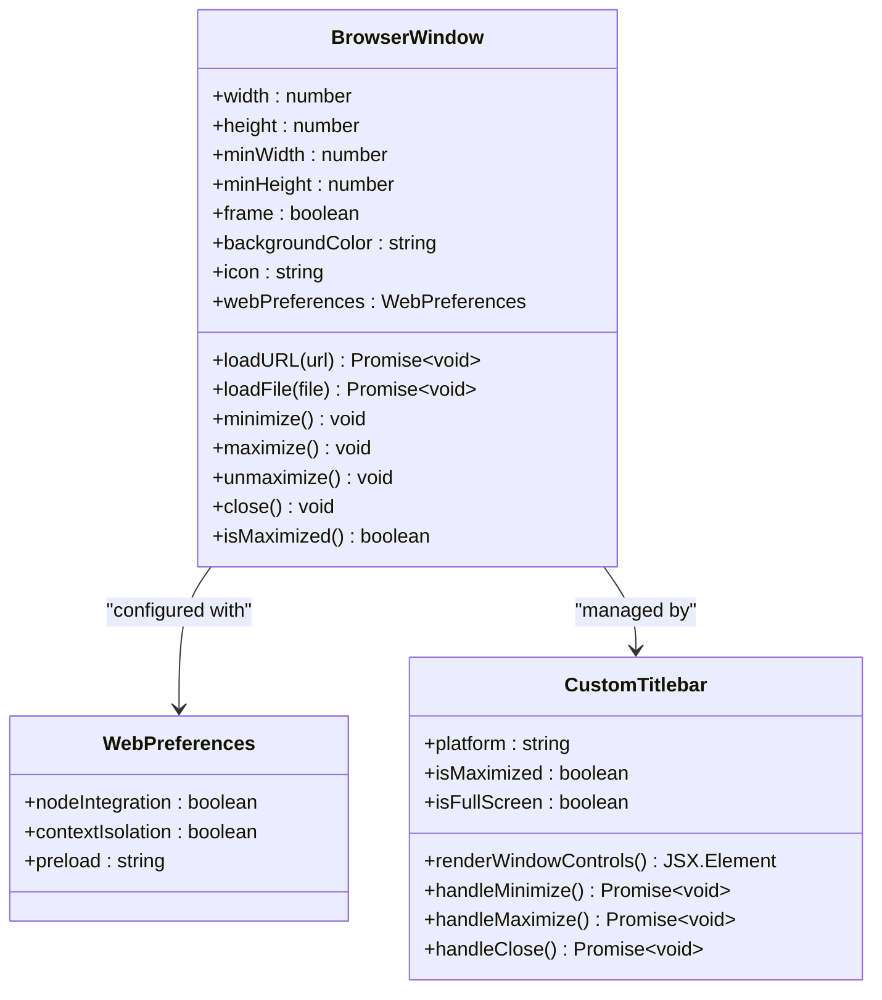
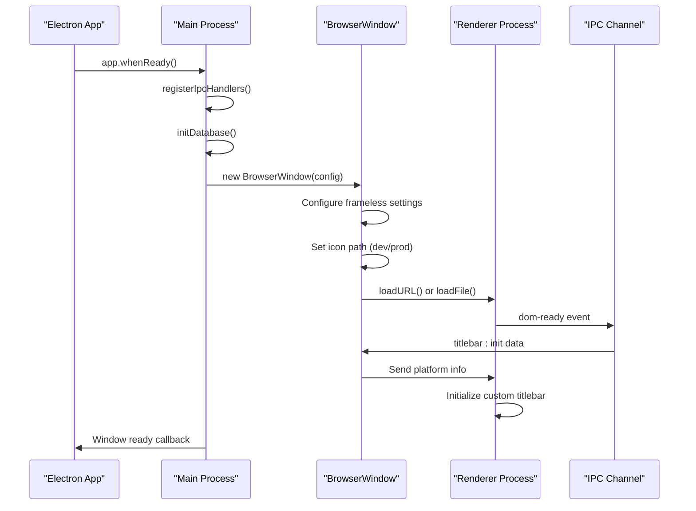
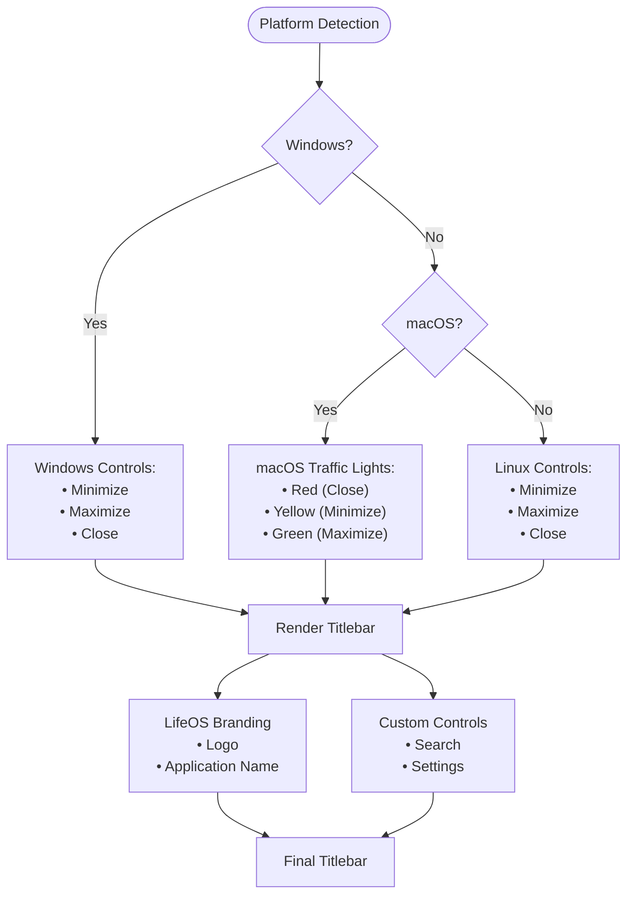
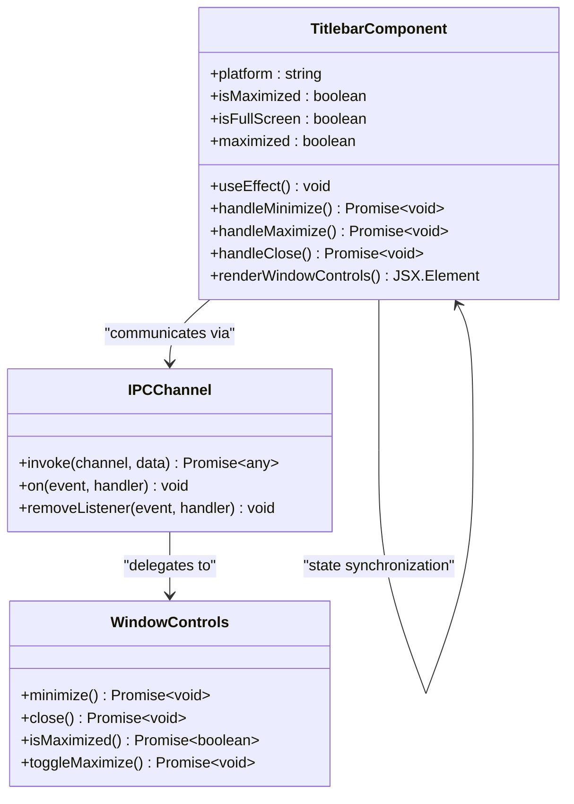
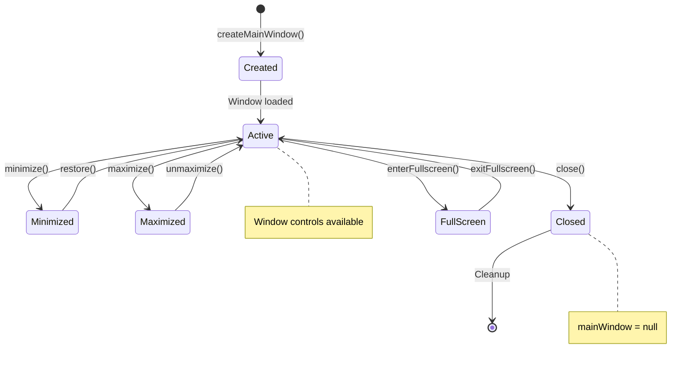
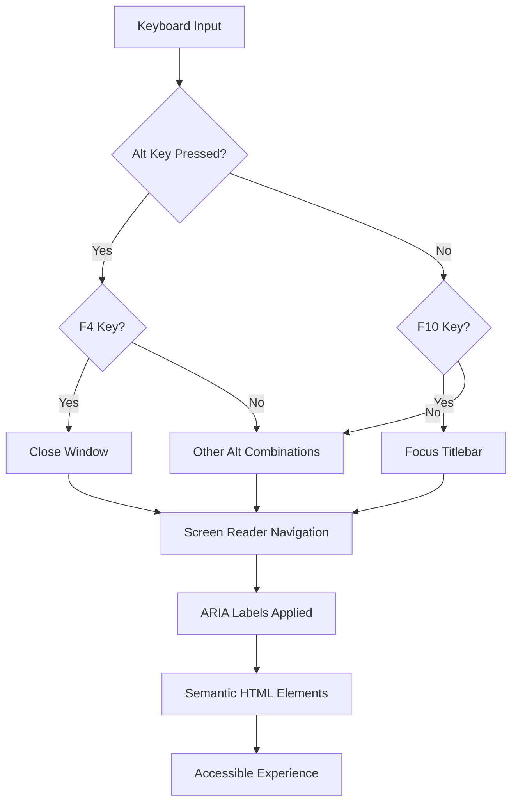
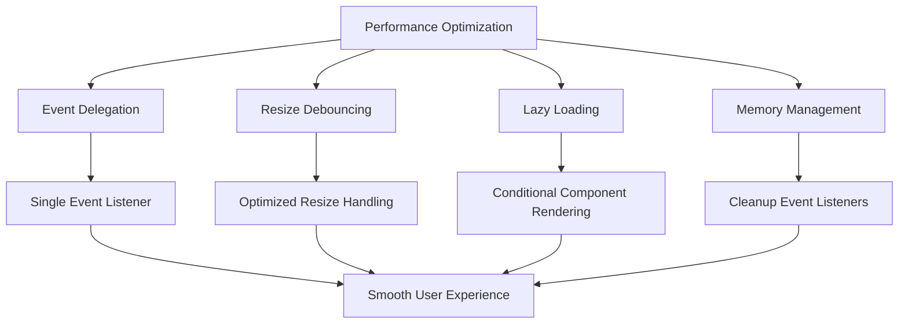

# Window and Display Management

<cite>
**Referenced Files in This Document**
- [src/main/index.ts](file://src/main/index.ts)
- [src/main/ipc/window.ts](file://src/main/ipc/window.ts)
- [src/preload/index.ts](file://src/preload/index.ts)
- [src/renderer/components/TitleBar.tsx](file://src/renderer/components/TitleBar.tsx)
- [src/renderer/components/CustomTitlebar.tsx](file://src/renderer/components/CustomTitlebar.tsx)
- [src/renderer/styles.css](file://src/renderer/styles.css)
- [src/renderer/global.d.ts](file://src/renderer/global.d.ts)
- [AI/CUSTOM-UI.md](file://AI/CUSTOM-UI.md)
- [package.json](file://package.json)
</cite>

## Table of Contents
1. [Introduction](#introduction)
2. [Custom Window Architecture](#custom-window-architecture)
3. [Window Creation Process](#window-creation-process)
4. [Custom Titlebar Implementation](#custom-titlebar-implementation)
5. [Window Lifecycle Management](#window-lifecycle-management)
6. [Responsive Sizing and Multi-Monitor Support](#responsive-sizing-and-multi-monitor-support)
7. [Accessibility Features](#accessibility-features)
8. [Platform-Specific Behaviors](#platform-specific-behaviors)
9. [Performance Optimization](#performance-optimization)
10. [Troubleshooting Guide](#troubleshooting-guide)
11. [Best Practices](#best-practices)

## Introduction

LifeOS implements a sophisticated custom window management system that removes default operating system window frames and replaces them with a branded, cross-platform titlebar. This approach enables a consistent user experience while maintaining native platform integration for optimal performance and accessibility.

The window management system consists of three main components:
- **Custom BrowserWindow Configuration**: Frameless windows with hidden titlebars
- **Custom Titlebar Implementation**: Platform-aware window controls and branding
- **IPC Communication Layer**: Secure communication between main and renderer processes

## Custom Window Architecture

### BrowserWindow Configuration

LifeOS creates custom windows using Electron's BrowserWindow class with specific configuration options designed for frameless operation:



**Diagram sources**
- [src/main/index.ts](file://src/main/index.ts#L25-L45)
- [src/renderer/components/CustomTitlebar.tsx](file://src/renderer/components/CustomTitlebar.tsx#L110-L226)

### Key Configuration Properties

The window configuration includes several critical properties for custom UI implementation:

| Property | Value | Purpose |
|----------|-------|---------|
| `frame` | `false` | Removes default OS window frame |
| `titleBarStyle` | `'hidden'` | Hides default titlebar while keeping traffic lights on macOS |
| `width` | `1200` | Initial window width in pixels |
| `height` | `800` | Initial window height in pixels |
| `minWidth` | `800` | Minimum width constraint |
| `minHeight` | `600` | Minimum height constraint |
| `backgroundColor` | `'#121212'` | Dark theme background color |
| `icon` | Platform-dependent | Application icon path |

**Section sources**
- [src/main/index.ts](file://src/main/index.ts#L25-L45)

## Window Creation Process

### Main Process Window Initialization

The window creation process begins in the main process with careful attention to development and production environment differences:



**Diagram sources**
- [src/main/index.ts](file://src/main/index.ts#L47-L85)

### Icon Path Resolution

The application resolves icon paths differently based on the execution environment:

- **Development Environment**: Uses SVG icon from project root
- **Production Environment**: References packaged resources in `process.resourcesPath`

This ensures proper icon display across different deployment scenarios while maintaining development flexibility.

**Section sources**
- [src/main/index.ts](file://src/main/index.ts#L18-L22)

### Development vs Production Loading

The window loading mechanism adapts to the current environment:

- **Development Mode**: Loads from Vite dev server URL
- **Production Mode**: Loads pre-built HTML file from distribution directory

This dual-mode approach enables rapid development iteration while ensuring production builds maintain optimal performance.

**Section sources**
- [src/main/index.ts](file://src/main/index.ts#L50-L58)

## Custom Titlebar Implementation

### Platform-Aware Design

LifeOS implements platform-specific titlebar designs that match native conventions while maintaining brand consistency:



**Diagram sources**
- [src/renderer/components/CustomTitlebar.tsx](file://src/renderer/components/CustomTitlebar.tsx#L140-L180)

### Titlebar Component Architecture

The custom titlebar component maintains state synchronization between the main and renderer processes:



**Diagram sources**
- [src/renderer/components/CustomTitlebar.tsx](file://src/renderer/components/CustomTitlebar.tsx#L110-L140)
- [src/preload/index.ts](file://src/preload/index.ts#L180-L190)

### State Management and Synchronization

The titlebar maintains synchronized state through a combination of local React state and IPC communication:

- **Local State**: React state for immediate UI updates
- **IPC Events**: Real-time synchronization of window state changes
- **Best-Effort Updates**: Optimistic UI updates with fallback mechanisms

**Section sources**
- [src/renderer/components/CustomTitlebar.tsx](file://src/renderer/components/CustomTitlebar.tsx#L115-L130)

## Window Lifecycle Management

### Window State Events

LifeOS handles various window lifecycle events to maintain UI consistency and proper resource management:



**Diagram sources**
- [src/main/index.ts](file://src/main/index.ts#L87-L95)
- [src/main/ipc/window.ts](file://src/main/ipc/window.ts#L1-L26)

### Platform-Specific Quit Behavior

The application implements platform-aware quit behavior:

- **macOS**: Window closure doesn't quit the application
- **Windows/Linux**: Closing the last window quits the application

This follows platform conventions while providing consistent user experience across operating systems.

**Section sources**
- [src/main/index.ts](file://src/main/index.ts#L90-L95)

### Window Control IPC Handlers

The main process provides IPC handlers for window control operations:

| Handler | Purpose | Parameters | Return Type |
|---------|---------|------------|-------------|
| `window:minimize` | Minimize focused window | None | `boolean` |
| `window:close` | Close focused window | None | `boolean` |
| `window:is-maximized` | Check if window is maximized | None | `boolean` |
| `window:toggle-maximize` | Toggle window maximization | None | `boolean` |

**Section sources**
- [src/main/ipc/window.ts](file://src/main/ipc/window.ts#L1-L26)

## Responsive Sizing and Multi-Monitor Support

### Size Constraints and Minimum Dimensions

LifeOS implements responsive design principles through carefully defined size constraints:

- **Minimum Width**: 800px for adequate content display
- **Minimum Height**: 600px for functional layout
- **Initial Size**: 1200x800 for balanced content-to-screen ratio
- **Proportional Scaling**: Maintains aspect ratio within constraints

### Multi-Monitor Considerations

While the current implementation focuses on single-display scenarios, the architecture supports multi-monitor considerations:

- **Primary Display Detection**: Uses Electron's `screen.getPrimaryDisplay()` for positioning
- **Work Area Awareness**: Respects taskbar and dock placements
- **Position Calculation**: Calculates positions relative to available work area

**Section sources**
- [AI/CUSTOM-UI.md](file://AI/CUSTOM-UI.md#L300-L320)

## Accessibility Features

### Keyboard Navigation Support

LifeOS implements comprehensive keyboard accessibility for custom window controls:



**Diagram sources**
- [AI/CUSTOM-UI.md](file://AI/CUSTOM-UI.md#L377-L390)

### Screen Reader Support

The titlebar implementation includes comprehensive screen reader support:

- **ARIA Labels**: Descriptive labels for all interactive elements
- **Role Attributes**: Proper semantic roles for accessibility
- **State Announcements**: Dynamic state changes announced to screen readers
- **Focus Management**: Logical focus order and focus indicators

### Color Contrast and Visual Accessibility

The dark theme implementation prioritizes visual accessibility:

- **High Contrast**: Text against background with sufficient contrast ratios
- **Color Independence**: Information conveyed through multiple modalities
- **Scalable Text**: CSS variables for theme-aware typography
- **Reduced Motion**: Respect for user motion preferences

**Section sources**
- [AI/CUSTOM-UI.md](file://AI/CUSTOM-UI.md#L390-L410)
- [src/renderer/styles.css](file://src/renderer/styles.css#L1-L20)

## Platform-Specific Behaviors

### Windows Platform Integration

Windows-specific implementations focus on native appearance and behavior:

- **Window Controls**: Standard minimize, maximize, close buttons
- **Drag Region**: `-webkit-app-region: drag` for titlebar dragging
- **No-Drag Regions**: `-webkit-app-region: no-drag` for interactive elements
- **System Theme**: Respects Windows theme colors and settings

### macOS Platform Adaptation

macOS implementation leverages native traffic light controls:

- **Traffic Light Buttons**: Native red, yellow, green close/minimize/maximize
- **Title Centering**: Application title centered in the titlebar
- **Dock Integration**: Proper macOS dock behavior and focus management
- **Mission Control**: Seamless integration with macOS window management

### Linux Platform Compatibility

Linux implementation provides consistent behavior across desktop environments:

- **Standard Controls**: Consistent minimize, maximize, close buttons
- **Desktop Environment Awareness**: Adapts to different window managers
- **Theme Integration**: Respects GTK and other Linux theme systems
- **Keyboard Shortcuts**: Standard Linux keyboard shortcuts

**Section sources**
- [src/renderer/components/CustomTitlebar.tsx](file://src/renderer/components/CustomTitlebar.tsx#L140-L180)

## Performance Optimization

### Rendering Performance

LifeOS implements several performance optimization strategies for smooth window management:



**Diagram sources**
- [AI/CUSTOM-UI.md](file://AI/CUSTOM-UI.md#L410-L430)

### Animation Performance

The titlebar implements hardware-accelerated animations:

- **CSS Transitions**: Hardware-accelerated background color changes
- **Will-Change Property**: Optimizes animation performance
- **Transition Timing**: Smooth 150ms easing for user feedback
- **Background Optimization**: Efficient background color transitions

### Memory Management

Proper memory management prevents leaks and ensures long-running stability:

- **Event Listener Cleanup**: Removal of event listeners on component unmount
- **IPC Handler Cleanup**: Proper cleanup of IPC event handlers
- **State Management**: Efficient state updates to prevent unnecessary re-renders

**Section sources**
- [AI/CUSTOM-UI.md](file://AI/CUSTOM-UI.md#L410-L430)

## Troubleshooting Guide

### Common Window Issues

#### Titlebar Not Responding
**Symptoms**: Window controls don't respond to clicks
**Causes**: 
- IPC channel disconnected
- Event listeners not properly attached
- Platform detection failure

**Solutions**:
1. Verify IPC handlers are registered
2. Check event listener attachment in React components
3. Validate platform detection logic

#### Window Size Constraints Not Working
**Symptoms**: Window resizes below minimum dimensions
**Causes**:
- Incorrect BrowserWindow configuration
- CSS conflicts affecting layout
- Platform-specific size handling issues

**Solutions**:
1. Verify `minWidth` and `minHeight` in BrowserWindow config
2. Check CSS `box-sizing` and layout calculations
3. Test on target platforms for platform-specific behaviors

#### Custom Titlebar Positioning Issues
**Symptoms**: Titlebar appears in wrong location or overlaps content
**Causes**:
- CSS `position` or `z-index` conflicts
- Incorrect `padding` or `margin` values
- Platform-specific styling differences

**Solutions**:
1. Verify CSS specificity and stacking context
2. Check platform-specific style overrides
3. Test with different content sizes and window dimensions

### Debugging Window State

#### Window State Synchronization
Monitor window state changes through IPC events:

```typescript
// Debug window state changes
window.electronAPI.on('titlebar:maximized', (maximized) => {
  console.log('Window maximized state:', maximized);
});
```

#### Platform Detection Verification
Ensure proper platform detection:

```typescript
// Verify platform detection
console.log('Current platform:', process.platform);
```

**Section sources**
- [src/renderer/components/CustomTitlebar.tsx](file://src/renderer/components/CustomTitlebar.tsx#L115-L130)

## Best Practices

### Window Management Guidelines

1. **Always Handle Window Closure**: Implement proper cleanup in `closed` event handlers
2. **Respect Platform Conventions**: Follow platform-specific window management patterns
3. **Maintain Accessibility**: Ensure all window controls are keyboard-navigable and screen-reader friendly
4. **Optimize Performance**: Use efficient event handling and memory management
5. **Test Across Platforms**: Verify functionality on Windows, macOS, and Linux

### Custom Titlebar Implementation

1. **Separate Concerns**: Keep window logic separate from UI presentation
2. **State Synchronization**: Maintain consistent state between main and renderer processes
3. **Graceful Degradation**: Handle IPC failures gracefully with fallback mechanisms
4. **Responsive Design**: Test with various window sizes and content densities
5. **Accessibility First**: Implement accessibility features from the beginning

### Security Considerations

1. **Context Isolation**: Enable `contextIsolation` in BrowserWindow configuration
2. **Preload Script Security**: Use secure IPC patterns in preload scripts
3. **Node Integration**: Disable `nodeIntegration` for security
4. **Content Security Policy**: Implement appropriate CSP headers

**Section sources**
- [src/main/index.ts](file://src/main/index.ts#L35-L40)
- [src/preload/index.ts](file://src/preload/index.ts#L180-L190)