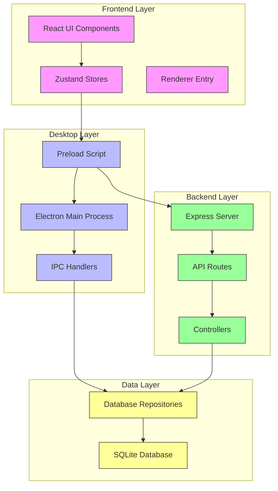
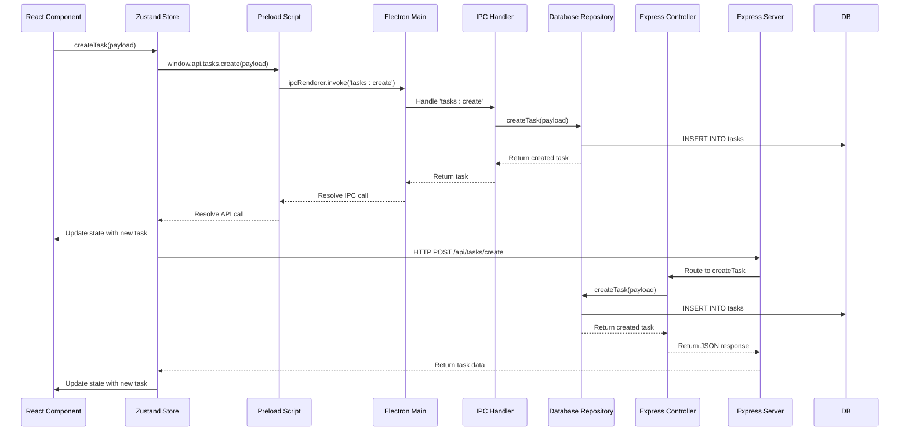
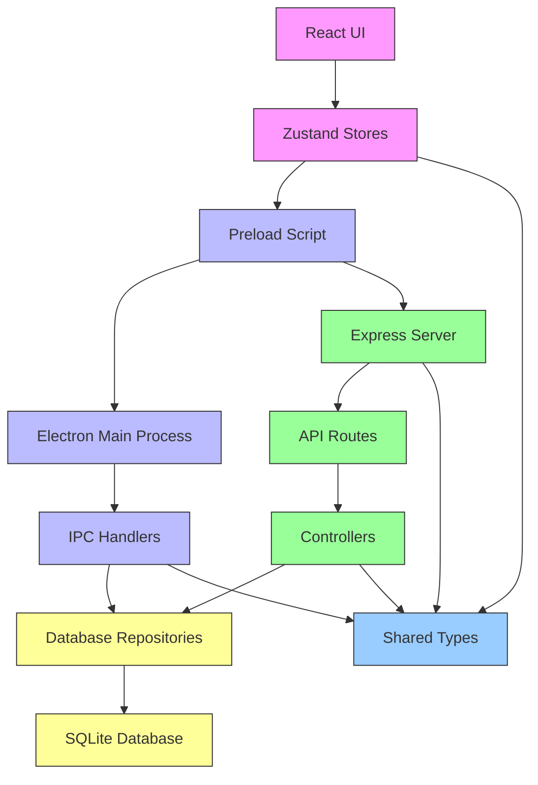

# Frontend-Backend-Desktop Layer Separation

<cite>
**Referenced Files in This Document**   
- [main/index.ts](file://src/main/index.ts)
- [preload/index.ts](file://src/preload/index.ts)
- [renderer/App.tsx](file://src/renderer/App.tsx)
- [store/tasks.ts](file://src/store/tasks.ts)
- [server/mcp-server.ts](file://src/server/mcp-server.ts)
- [main/ipc/tasks.ts](file://src/main/ipc/tasks.ts)
- [server/routes/tasks.ts](file://src/server/routes/tasks.ts)
- [database/tasksRepo.ts](file://src/database/tasksRepo.ts)
- [server/controllers/tasksController.ts](file://src/server/controllers/tasksController.ts)
- [common/types.ts](file://src/common/types.ts)
- [configs/vite.config.ts](file://configs/vite.config.ts)
- [configs/tsup.config.ts](file://configs/tsup.config.ts)
</cite>

## Table of Contents
1. [Introduction](#introduction)
2. [Project Structure](#project-structure)
3. [Core Components](#core-components)
4. [Architecture Overview](#architecture-overview)
5. [Detailed Component Analysis](#detailed-component-analysis)
6. [Dependency Analysis](#dependency-analysis)
7. [Performance Considerations](#performance-considerations)
8. [Troubleshooting Guide](#troubleshooting-guide)
9. [Conclusion](#conclusion)

## Introduction
LifeOS implements a strict architectural separation between its frontend (React UI), backend (Express API), and desktop (Electron) layers. This hybrid approach enables independent development, testing, and deployment of each layer while maintaining a cohesive user experience. The architecture leverages Electron's capabilities to run a local Express server (MCP Server) that provides RESTful APIs for both the desktop application and potential external clients. This document details the boundaries and interfaces between these layers, explaining how UI components interact with state management stores, how stores communicate with backend APIs, and how the Electron main process mediates system-level operations.

## Project Structure
The LifeOS project follows a clear directory structure that enforces layer separation. The `src` directory contains distinct subdirectories for each architectural layer: `renderer` for the React frontend, `server` for the Express backend API, `main` for Electron's main process, `preload` for the secure IPC bridge, `database` for data access, `store` for Zustand state management, and `common` for shared types.



**Diagram sources**
- [src/main/index.ts](file://src/main/index.ts)
- [src/preload/index.ts](file://src/preload/index.ts)
- [src/renderer/App.tsx](file://src/renderer/App.tsx)
- [src/server/mcp-server.ts](file://src/server/mcp-server.ts)
- [src/database/tasksRepo.ts](file://src/database/tasksRepo.ts)

**Section sources**
- [src/main/index.ts](file://src/main/index.ts)
- [src/preload/index.ts](file://src/preload/index.ts)
- [src/renderer/App.tsx](file://src/renderer/App.tsx)
- [src/server/mcp-server.ts](file://src/server/mcp-server.ts)
- [src/database/init.ts](file://src/database/init.ts)

## Core Components
The core components of LifeOS are organized by architectural layer. The frontend layer uses React components managed by Zustand stores for state management. The desktop layer consists of Electron's main process that manages windows and system interactions, with IPC handlers that bridge the renderer and main processes. The backend layer is an Express server that exposes REST APIs for data operations. All layers share type definitions through the `common` directory, ensuring type safety across the application. The strict separation allows each layer to be developed and tested independently while communicating through well-defined interfaces.

**Section sources**
- [src/renderer/App.tsx](file://src/renderer/App.tsx)
- [src/store/tasks.ts](file://src/store/tasks.ts)
- [src/main/index.ts](file://src/main/index.ts)
- [src/server/mcp-server.ts](file://src/server/mcp-server.ts)
- [src/common/types.ts](file://src/common/types.ts)

## Architecture Overview
LifeOS employs a hybrid architecture that combines Electron's desktop capabilities with a local Express server (MCP Server) to create a robust productivity application. The architecture separates concerns into distinct layers: the React-based frontend handles user interface rendering, the Electron main process manages desktop-specific operations like window management and system notifications, and the Express backend provides a RESTful API for data operations. These layers communicate through well-defined interfaces: the frontend uses Zustand stores that call Electron's IPC to access both main process functionality and the local Express API. This separation enables independent development and testing of each layer while providing a unified user experience.

```mermaid
graph TB
subgraph "Frontend"
UI[React Components]
Store[Zustand Store]
end
subgraph "Desktop"
Preload[Preload Script]
Main[Electron Main Process]
IPC[IPC Handlers]
end
subgraph "Backend"
Express[Express Server]
Routes[API Routes]
Controllers[Controllers]
end
subgraph "Data"
Repos[Database Repositories]
DB[(SQLite)]
end
UI --> Store
Store --> |window.api| Preload
Preload < --> |ipcRenderer| Main
Main --> IPC
IPC --> Repos
Preload --> |HTTP Client| Express
Express --> Routes
Routes --> Controllers
Controllers --> Repos
Repos --> DB
classDef frontend fill:#f9f,stroke:#333;
classDef desktop fill:#bbf,stroke:#333;
classDef backend fill:#9f9,stroke:#333;
classDef data fill:#ff9,stroke:#333;
class UI,Store frontend
class Preload,Main,IPC desktop
class Express,Routes,Controllers backend
class Repos,DB data
```

**Diagram sources**
- [src/renderer/App.tsx](file://src/renderer/App.tsx)
- [src/store/tasks.ts](file://src/store/tasks.ts)
- [src/preload/index.ts](file://src/preload/index.ts)
- [src/main/index.ts](file://src/main/index.ts)
- [src/server/mcp-server.ts](file://src/server/mcp-server.ts)
- [src/database/tasksRepo.ts](file://src/database/tasksRepo.ts)

## Detailed Component Analysis

### Task Management Component Analysis
The task management functionality in LifeOS demonstrates the complete flow across all architectural layers. The React UI components interact with a Zustand store that handles state management and API communication. The store uses the `window.api` interface exposed by the preload script to make IPC calls to the Electron main process or HTTP requests to the local Express server. The main process IPC handlers delegate to database repositories for data persistence, while the Express controllers provide a RESTful interface to the same repositories.

#### Component Interaction Flow


**Diagram sources**
- [src/renderer/components/TaskCard.tsx](file://src/renderer/components/TaskCard.tsx)
- [src/store/tasks.ts](file://src/store/tasks.ts)
- [src/preload/index.ts](file://src/preload/index.ts)
- [src/main/ipc/tasks.ts](file://src/main/ipc/tasks.ts)
- [src/database/tasksRepo.ts](file://src/database/tasksRepo.ts)
- [src/server/controllers/tasksController.ts](file://src/server/controllers/tasksController.ts)
- [src/server/routes/tasks.ts](file://src/server/routes/tasks.ts)

#### State Management Architecture
```mermaid
classDiagram
class TasksState {
+tasksByProject : Record~number, Task[]~
+loading : Record~number, boolean~
+error? : string
+loadTasks(projectId : number) : Promise~void~
+createTask(payload : CreateTaskInput) : Promise~void~
+updateTask(id : number, payload : UpdateTaskPayload) : Promise~void~
+moveTask(args : MoveTaskArgs) : Promise~void~
}
class useTasksStore {
-create : Zustand.CreateStore~TasksState~
+useTasks(projectId? : number) : TasksHookResult
}
class ApiResponse~T~ {
+ok : boolean
+data? : T
+error? : string
}
class Task {
+id : number
+projectId : number
+title : string
+description? : string | null
+status : string
+dueDate? : string | null
+priority? : string | null
+tags? : string[]
+position : number
+createdAt : string
+updatedAt : string
}
useTasksStore --> TasksState : "implements"
TasksState --> Task : "contains"
TasksState --> ApiResponse~Task~ : "returns"
TasksState --> ApiResponse~Task[]~ : "returns"
TasksState --> ApiResponse~boolean~ : "returns"
classDef class fill : #f9f,stroke : #333;
classDef interface fill : #ff9,stroke : #333;
classDef type fill : #9cf,stroke : #333;
class TasksState,useTasksStore class
class ApiResponse~T~ type
class Task interface
```

**Diagram sources**
- [src/store/tasks.ts](file://src/store/tasks.ts)
- [src/common/types.ts](file://src/common/types.ts)

**Section sources**
- [src/store/tasks.ts](file://src/store/tasks.ts)
- [src/common/types.ts](file://src/common/types.ts)
- [src/renderer/pages/KanbanPage.tsx](file://src/renderer/pages/KanbanPage.tsx)

## Dependency Analysis
The dependency graph of LifeOS shows a clear separation of concerns with well-defined interfaces between layers. The frontend layer depends on the preload script for IPC communication and on shared types from the common directory. The desktop layer (Electron main process) depends on IPC handlers and the database layer, while the backend layer (Express server) depends on controllers and the same database layer. The database layer is the central dependency used by both the desktop and backend layers for data persistence. This architecture avoids circular dependencies and allows each layer to be developed and tested independently.



**Diagram sources**
- [package.json](file://package.json)
- [src/renderer/App.tsx](file://src/renderer/App.tsx)
- [src/preload/index.ts](file://src/preload/index.ts)
- [src/main/index.ts](file://src/main/index.ts)
- [src/server/mcp-server.ts](file://src/server/mcp-server.ts)
- [src/database/tasksRepo.ts](file://src/database/tasksRepo.ts)
- [src/common/types.ts](file://src/common/types.ts)

**Section sources**
- [package.json](file://package.json)
- [tsconfig.json](file://tsconfig.json)
- [configs/vite.config.ts](file://configs/vite.config.ts)
- [configs/tsup.config.ts](file://configs/tsup.config.ts)

## Performance Considerations
The layered architecture of LifeOS provides several performance benefits. The separation allows for independent optimization of each layer: the frontend can implement efficient React rendering patterns, the backend can optimize API response times, and the desktop layer can manage system resources effectively. The use of a local Express server enables caching strategies and connection pooling for database operations. The Zustand state management in the frontend reduces unnecessary re-renders through selective state subscription. The IPC communication between layers is asynchronous, preventing the UI from blocking during data operations. This architecture also facilitates performance monitoring and profiling of individual layers without interference from other components.

## Troubleshooting Guide
When troubleshooting issues in LifeOS, it's important to identify which architectural layer is affected. For UI issues, check the React components and Zustand stores. For data persistence problems, examine the database repositories and SQLite operations. For API-related issues, review the Express routes and controllers. For desktop-specific problems like window management or system notifications, investigate the Electron main process and IPC handlers. The preload script is a common source of issues when the `window.api` interface is not properly exposed. Logging is implemented across all layers, with the main process and Express server providing detailed logs for debugging. The strict layer separation simplifies troubleshooting by isolating concerns and reducing the potential for cascading failures.

**Section sources**
- [src/main/index.ts](file://src/main/index.ts)
- [src/server/mcp-server.ts](file://src/server/mcp-server.ts)
- [src/main/utils/response.ts](file://src/main/utils/response.ts)
- [src/server/middleware/logging.ts](file://src/server/middleware/logging.ts)
- [src/server/utils/logger.ts](file://src/server/utils/logger.ts)

## Conclusion
LifeOS demonstrates a well-architected hybrid application that effectively separates concerns between frontend, backend, and desktop layers. This strict layer separation enables independent development, testing, and deployment of each component while maintaining a cohesive user experience. The architecture leverages Electron's capabilities to run a local Express server, providing both desktop integration and RESTful API access. The use of Zustand for state management, TypeScript for type safety, and SQLite for local data storage creates a robust foundation for a productivity application. This architectural approach allows for future extensibility, including potential web client development and API integration with external services, while maintaining the core principle of data privacy through local-first storage.