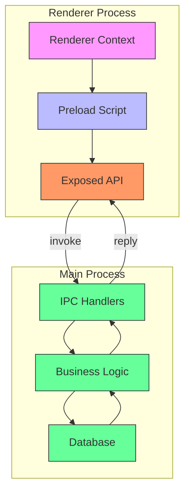
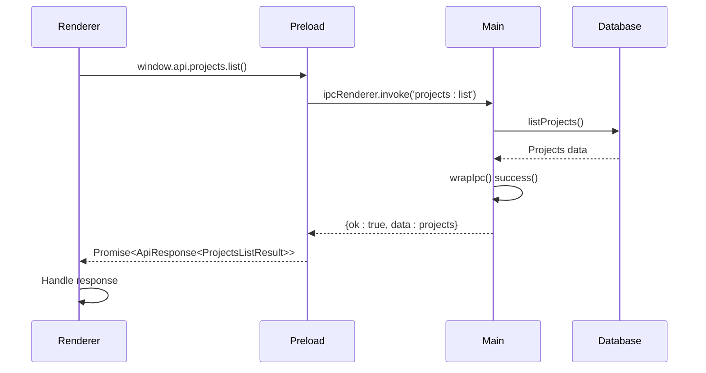

# Electron IPC Communication

<cite>
**Referenced Files in This Document**   
- [main/index.ts](file://src/main/index.ts)
- [preload/index.ts](file://src/preload/index.ts)
- [main/utils/response.ts](file://src/main/utils/response.ts)
- [common/types.ts](file://src/common/types.ts)
- [main/ipc/projects.ts](file://src/main/ipc/projects.ts)
- [main/ipc/tasks.ts](file://src/main/ipc/tasks.ts)
- [main/ipc/habits.ts](file://src/main/ipc/habits.ts)
- [main/ipc/mcp.ts](file://src/main/ipc/mcp.ts)
- [main/ipc/settings.ts](file://src/main/ipc/settings.ts)
- [main/ipc/database.ts](file://src/main/ipc/database.ts)
- [store/projects.ts](file://src/store/projects.ts)
- [store/tasks.ts](file://src/store/tasks.ts)
- [store/habits.ts](file://src/store/habits.ts)
- [renderer/App.tsx](file://src/renderer/App.tsx)
</cite>

## Table of Contents
1. [Introduction](#introduction)
2. [Security Architecture](#security-architecture)
3. [IPC Channel Naming Convention](#ipc-channel-naming-convention)
4. [Request-Response Pattern](#request-response-pattern)
5. [Centralized IPC Handling](#centralized-ipc-handling)
6. [Main Process IPC Registration](#main-process-ipc-registration)
7. [Renderer Process IPC Invocation](#renderer-process-ipc-invocation)
8. [Error Handling and Logging](#error-handling-and-logging)
9. [Module-Specific IPC Examples](#module-specific-ipc-examples)
10. [Adding New IPC Handlers](#adding-new-ipc-handlers)
11. [Conclusion](#conclusion)

## Introduction
This document provides comprehensive documentation on Electron's Inter-Process Communication (IPC) system in LifeOS. The IPC system enables secure communication between the main and renderer processes, following Electron's best practices for security and maintainability. The architecture implements a robust pattern for handling asynchronous operations, with proper error handling, response wrapping, and type safety throughout the application.

**Section sources**
- [main/index.ts](file://src/main/index.ts#L1-L122)
- [preload/index.ts](file://src/preload/index.ts#L1-L201)

## Security Architecture
LifeOS implements a secure IPC architecture by leveraging Electron's `contextIsolation` feature and minimal API exposure through preload scripts. The `contextIsolation` is enabled in the BrowserWindow configuration, preventing the renderer process from accessing Node.js APIs directly and mitigating potential security risks.

The preload script acts as a bridge between the isolated renderer context and the main process, exposing only a minimal, well-defined API surface. Using `contextBridge.exposeInMainWorld()`, the preload script exposes a carefully curated `api` object that contains domain-specific methods for IPC communication. This approach follows the principle of least privilege, ensuring that the renderer process can only perform authorized operations.



**Diagram sources**
- [main/index.ts](file://src/main/index.ts#L50-L55)
- [preload/index.ts](file://src/preload/index.ts#L1-L201)

**Section sources**
- [main/index.ts](file://src/main/index.ts#L50-L55)
- [preload/index.ts](file://src/preload/index.ts#L1-L201)

## IPC Channel Naming Convention
LifeOS follows a consistent channel naming convention of `app/<domain>/<action>` for IPC communication. This hierarchical structure organizes IPC channels by domain (such as projects, tasks, habits, etc.) and action (such as list, create, update, delete), making the API intuitive and easy to navigate.

The naming convention follows the pattern `<domain>:<action>`, where:
- `<domain>` represents the functional area (e.g., projects, tasks, habits, mcp)
- `<action>` represents the specific operation to be performed

This convention is consistently applied across all IPC handlers, providing a predictable and maintainable API structure. For example:
- `projects:list` - Retrieve all projects
- `tasks:create` - Create a new task
- `habits:log` - Log a habit completion
- `mcp:start-server` - Start the MCP server

The domain-based organization allows for logical grouping of related functionality and makes it easy to locate and understand the purpose of each IPC channel.

**Section sources**
- [preload/index.ts](file://src/preload/index.ts#L1-L201)
- [main/ipc/projects.ts](file://src/main/ipc/projects.ts#L1-L83)
- [main/ipc/tasks.ts](file://src/main/ipc/tasks.ts#L1-L36)

## Request-Response Pattern
LifeOS implements a standardized request-response pattern for IPC communication using the `ApiResponse` wrapper interface. This pattern ensures consistent handling of both successful outcomes and errors across all IPC operations.

The `ApiResponse<T>` interface, defined in `common/types.ts`, has the following structure:
- `ok: boolean` - Indicates whether the operation was successful
- `data?: T` - Contains the response data when successful
- `error?: string` - Contains an error message when the operation failed

This pattern enables the renderer process to handle responses uniformly, regardless of the specific IPC call. The response wrapper provides type safety through generics, ensuring that the data type is properly defined and checked at compile time.



**Diagram sources**
- [common/types.ts](file://src/common/types.ts#L1-L116)
- [main/utils/response.ts](file://src/main/utils/response.ts#L1-L36)
- [preload/index.ts](file://src/preload/index.ts#L1-L201)

**Section sources**
- [common/types.ts](file://src/common/types.ts#L1-L116)
- [main/utils/response.ts](file://src/main/utils/response.ts#L1-L36)

## Centralized IPC Handling
The IPC system in LifeOS features centralized handling with validation through the `wrapIpc()` utility function. This function serves as a higher-order function that wraps IPC handlers, providing consistent error handling, response formatting, and database availability checks.

The `wrapIpc()` function performs several critical functions:
1. **Error Handling**: Catches exceptions and converts them to standardized `ApiResponse` failures
2. **Response Wrapping**: Ensures all successful responses are wrapped in the `success()` utility
3. **Database Availability**: Checks if the database is available before executing data-dependent operations
4. **Graceful Degradation**: Returns empty responses when the database is not available, allowing the application to function in limited mode

This centralized approach eliminates code duplication and ensures consistent behavior across all IPC handlers. By wrapping each handler function, the system maintains a uniform interface and reduces the risk of inconsistent error handling or response formatting.

```mermaid
flowchart TD
A[IPC Handler Call] --> B{wrapIpc()}
B --> C[Check Database Availability]
C --> |Unavailable| D[Return Empty Response]
C --> |Available| E[Execute Handler]
E --> F{Success?}
F --> |Yes| G[Return success(result)]
F --> |No| H[Log Error]
H --> I[Return failure(error)]
D --> J[Response]
G --> J
I --> J
```

**Diagram sources**
- [main/utils/response.ts](file://src/main/utils/response.ts#L1-L36)
- [main/ipc/projects.ts](file://src/main/ipc/projects.ts#L1-L83)

**Section sources**
- [main/utils/response.ts](file://src/main/utils/response.ts#L1-L36)

## Main Process IPC Registration
IPC handlers in the main process are registered in `main/index.ts` through the `registerIpcHandlers()` function. This function uses dynamic imports with `require()` to load and register all IPC handler modules after Electron is ready.

The registration process follows these steps:
1. Define the `registerIpcHandlers()` function that imports all IPC modules
2. Call this function during the `app.whenReady()` lifecycle event
3. Each imported module registers its handlers using `ipcMain.handle()`

This approach ensures that IPC handlers are only registered when the Electron app is fully initialized, preventing race conditions. The modular structure allows each domain (projects, tasks, habits, etc.) to have its own dedicated handler file, promoting separation of concerns and maintainability.

Each IPC handler uses the `ipcMain.handle()` method to register an asynchronous handler function that can perform database operations, service calls, or other business logic. The handler functions typically accept parameters from the renderer process and return a promise that resolves to an `ApiResponse`.

**Section sources**
- [main/index.ts](file://src/main/index.ts#L1-L122)
- [main/ipc/projects.ts](file://src/main/ipc/projects.ts#L1-L83)

## Renderer Process IPC Invocation
In the renderer process, IPC calls are invoked through the `window.api` object exposed by the preload script. This object provides a clean, type-safe interface for communicating with the main process, abstracting the underlying IPC mechanism.

Stores in the renderer process (implemented with Zustand) invoke IPC methods through `window.api.<domain>.<action>()` and handle pending states and errors appropriately. The invocation pattern typically follows these steps:
1. Set loading state to true
2. Call the appropriate `window.api` method
3. Handle the `ApiResponse` result
4. Update state with success data or handle error
5. Set loading state to false

The stores manage both the data state and the UI state (loading, error), providing a complete abstraction for components. This pattern ensures that components don't need to directly handle IPC calls or response parsing, promoting reusability and separation of concerns.

```mermaid
flowchart TD
A[Component] --> B[Store Hook]
B --> C[Set Loading State]
C --> D[Call window.api.method()]
D --> E{Response ok?}
E --> |Yes| F[Update State with Data]
E --> |No| G[Handle Error]
F --> H[Set Loading False]
G --> H
H --> I[Component Updates]
```

**Diagram sources**
- [preload/index.ts](file://src/preload/index.ts#L1-L201)
- [store/projects.ts](file://src/store/projects.ts#L1-L86)

**Section sources**
- [preload/index.ts](file://src/preload/index.ts#L1-L201)
- [store/projects.ts](file://src/store/projects.ts#L1-L86)
- [store/tasks.ts](file://src/store/tasks.ts#L1-L132)
- [store/habits.ts](file://src/store/habits.ts#L1-L160)

## Error Handling and Logging
The IPC system in LifeOS implements comprehensive error handling and logging to ensure reliability and debuggability. Errors are handled at multiple levels, from the individual handler functions to the centralized `wrapIpc()` utility.

Key aspects of the error handling system include:
- **Centralized Error Wrapping**: The `wrapIpc()` function catches all errors and converts them to standardized `ApiResponse` failures
- **Console Logging**: All errors are logged to the console with the `[IPC Error]` prefix for easy identification
- **Graceful Degradation**: When the database is not available, certain operations return empty responses instead of failing
- **Type-Safe Errors**: Error messages are properly typed and included in the `ApiResponse` interface

The system distinguishes between different types of errors, such as database connectivity issues, validation errors, and operational errors. This allows for appropriate handling at the UI level, where different error types might trigger different user notifications or recovery strategies.

**Section sources**
- [main/utils/response.ts](file://src/main/utils/response.ts#L1-L36)
- [main/ipc/projects.ts](file://src/main/ipc/projects.ts#L1-L83)
- [main/ipc/mcp.ts](file://src/main/ipc/mcp.ts#L1-L150)

## Module-Specific IPC Examples
The IPC system in LifeOS is implemented across multiple modules, each following the same patterns but with domain-specific functionality. Here are examples from key modules:

### Tasks Module
The tasks module implements CRUD operations for tasks, with handlers for listing tasks by project, creating, updating, and moving tasks. The `tasks:list-by-project` handler retrieves tasks for a specific project, while `tasks:move` handles reorganizing tasks across projects and statuses.

### Habits Module
The habits module includes functionality for habit tracking, with handlers for listing habits, creating new habits, logging completions, and retrieving statistics. The `habits:log` handler records habit completions with date, count, and optional notes, while `habits:getStats` calculates progress metrics.

### MCP Module
The MCP module handles server management, with handlers for retrieving and updating configuration, starting and stopping the server, and checking status. These handlers interact with the MCP server process, managing its lifecycle and configuration.

Each module follows the same architectural patterns, ensuring consistency across the application while providing specialized functionality for its domain.

```mermaid
classDiagram
class ProjectsAPI {
+list() Promise~ApiResponse~ProjectsListResult~~
+create(payload) Promise~ApiResponse~Project~~
+update(id, payload) Promise~ApiResponse~Project~~
+setActive(id) Promise~ApiResponse~{id : number}~~
+delete(id) Promise~ApiResponse~{success : boolean}~~
}
class TasksAPI {
+listByProject(projectId) Promise~ApiResponse~Task[]~~
+create(payload) Promise~ApiResponse~Task~~
+update(id, payload) Promise~ApiResponse~Task~~
+move(payload) Promise~ApiResponse~Task~~
}
class HabitsAPI {
+list() Promise~ApiResponse~any[]~~
+create(input) Promise~ApiResponse~any~~
+update(args) Promise~ApiResponse~any~~
+delete(id) Promise~ApiResponse~any~~
+log(args) Promise~ApiResponse~any~~
+unlog(args) Promise~ApiResponse~any~~
}
class MCPAPI {
+getConfig() Promise~ApiResponse~MCPConfig~~
+updateConfig(payload) Promise~ApiResponse~MCPConfig~~
+startServer() Promise~ApiResponse~{running : boolean}~~
+stopServer() Promise~ApiResponse~{running : boolean}~~
+getStatus() Promise~ApiResponse~MCPServerStatus~~
}
ProjectsAPI <|-- PreloadAPI
TasksAPI <|-- PreloadAPI
HabitsAPI <|-- PreloadAPI
MCPAPI <|-- PreloadAPI
```

**Diagram sources**
- [main/ipc/tasks.ts](file://src/main/ipc/tasks.ts#L1-L36)
- [main/ipc/habits.ts](file://src/main/ipc/habits.ts#L1-L100)
- [main/ipc/mcp.ts](file://src/main/ipc/mcp.ts#L1-L150)

**Section sources**
- [main/ipc/tasks.ts](file://src/main/ipc/tasks.ts#L1-L36)
- [main/ipc/habits.ts](file://src/main/ipc/habits.ts#L1-L100)
- [main/ipc/mcp.ts](file://src/main/ipc/mcp.ts#L1-L150)

## Adding New IPC Handlers
To add new IPC handlers in LifeOS, follow these steps:

1. **Create Handler File**: Add a new file in the `src/main/ipc/` directory for your domain (e.g., `src/main/ipc/newModule.ts`)

2. **Import Dependencies**: Import `ipcMain` from Electron, `wrapIpc` from utilities, and any required services or repositories

3. **Register Handlers**: Use `ipcMain.handle()` to register handlers with the appropriate channel names following the `<domain>:<action>` pattern

4. **Wrap with wrapIpc**: Wrap each handler function with `wrapIpc()` to ensure consistent error handling and response formatting

5. **Register in Main**: Add a `require()` statement for your new module in the `registerIpcHandlers()` function in `main/index.ts`

6. **Expose in Preload**: Add the new methods to the `api` object in `preload/index.ts` with proper typing

7. **Add Types**: Define any new types in `common/types.ts` or appropriate type files

When securing IPC handlers with Zod validation (not currently implemented but recommended), you would:
- Define Zod schemas for input validation
- Validate incoming payloads before processing
- Return appropriate error responses for invalid inputs
- Consider implementing middleware for common validation patterns

This structured approach ensures that new IPC handlers integrate seamlessly with the existing system while maintaining security and consistency.

**Section sources**
- [main/index.ts](file://src/main/index.ts#L1-L122)
- [preload/index.ts](file://src/preload/index.ts#L1-L201)
- [main/utils/response.ts](file://src/main/utils/response.ts#L1-L36)

## Conclusion
The Electron IPC system in LifeOS provides a secure, maintainable, and scalable architecture for inter-process communication. By following Electron best practices with `contextIsolation` and preload scripts, the system ensures that the renderer process has minimal access to Node.js APIs while still enabling rich functionality.

The consistent use of the `app/<domain>/<action>` channel naming convention, standardized `ApiResponse` wrapper, and centralized `wrapIpc()` handling creates a predictable and reliable API surface. The separation of concerns between main process handlers, preload bridge, and renderer stores promotes maintainability and testability.

The implementation demonstrates a mature approach to Electron application architecture, balancing security, performance, and developer experience. Future enhancements could include formal input validation with Zod, more comprehensive error categorization, and enhanced monitoring of IPC performance.