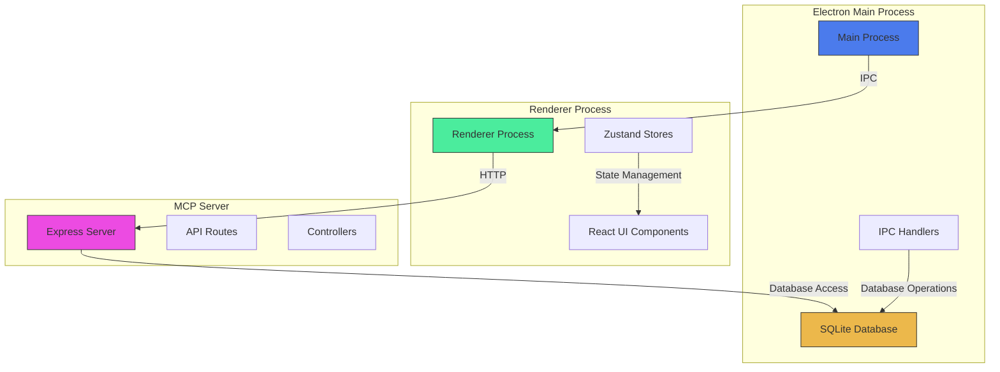
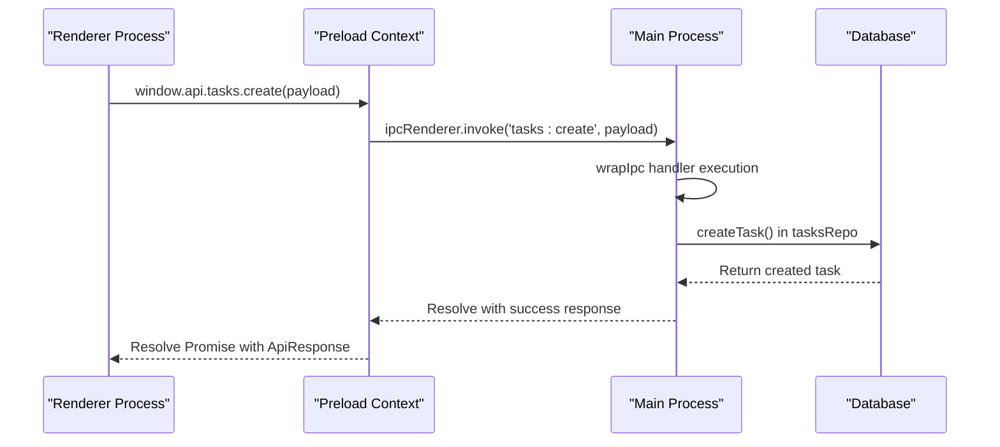
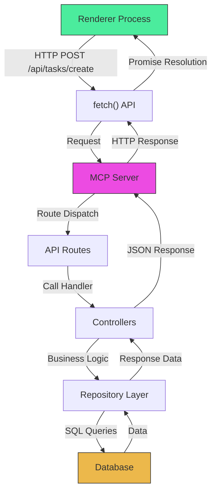
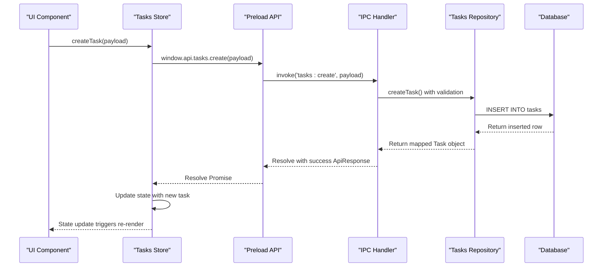
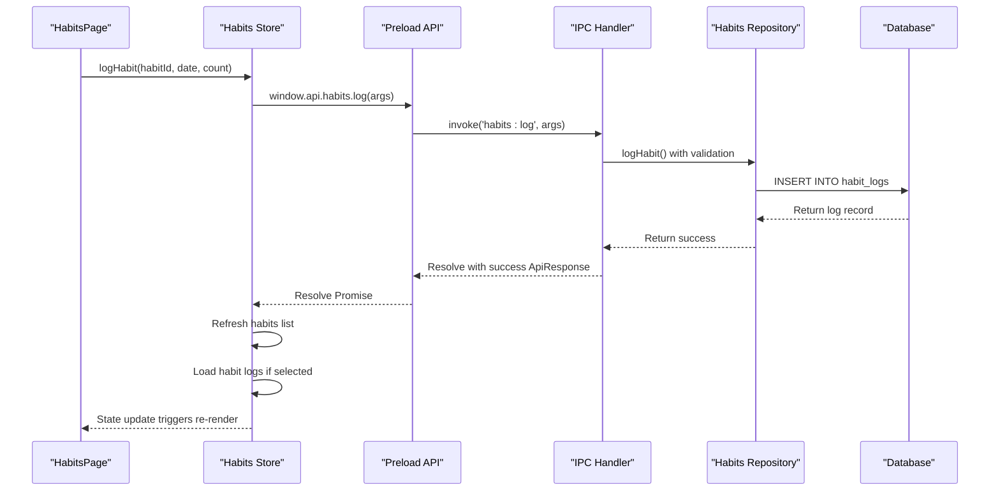
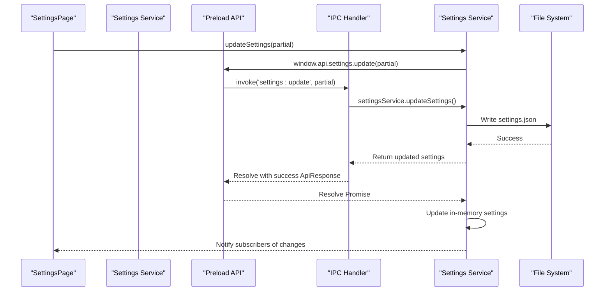
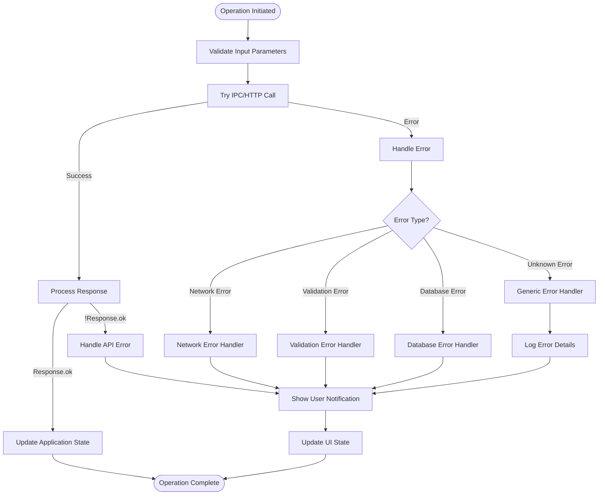
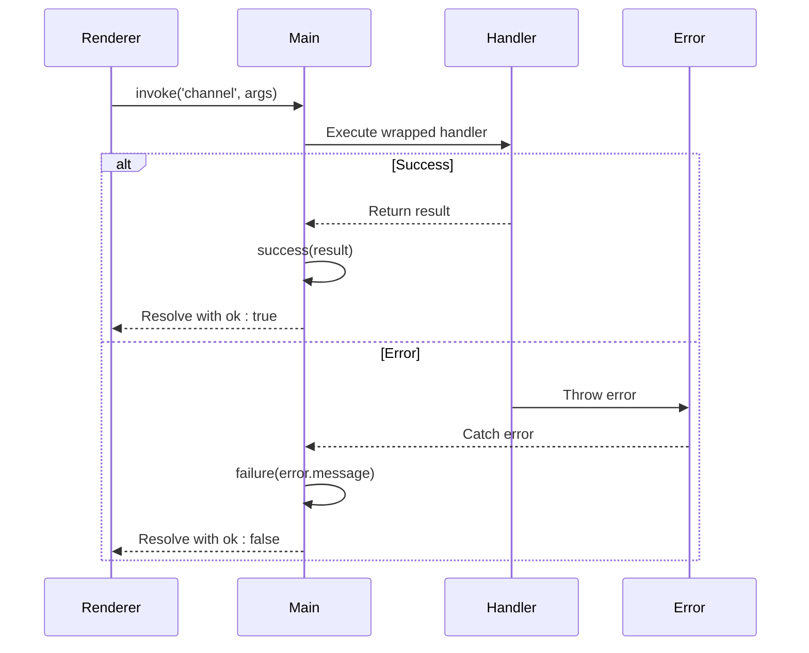
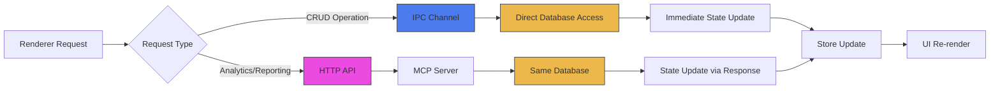
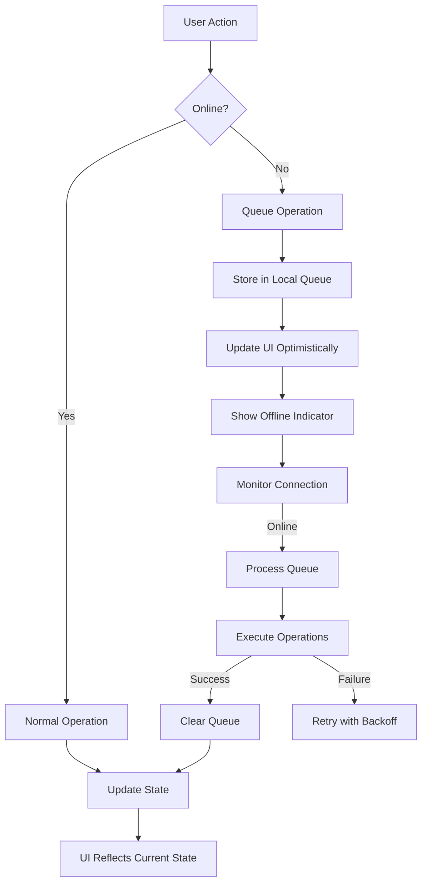

# Inter-Process Communication & Data Flow

<cite>
**Referenced Files in This Document**   
- [main/index.ts](file://src/main/index.ts)
- [preload/index.ts](file://src/preload/index.ts)
- [renderer/App.tsx](file://src/renderer/App.tsx)
- [renderer/store/tasks.ts](file://src/store/tasks.ts)
- [main/ipc/tasks.ts](file://src/main/ipc/tasks.ts)
- [main/ipc/settings.ts](file://src/main/ipc/settings.ts)
- [main/ipc/mcp.ts](file://src/main/ipc/mcp.ts)
- [server/mcp-server.ts](file://src/server/mcp-server.ts)
- [server/routes/tasks.ts](file://src/server/routes/tasks.ts)
- [server/controllers/tasksController.ts](file://src/server/controllers/tasksController.ts)
- [database/tasksRepo.ts](file://src/database/tasksRepo.ts)
- [database/mcpRepo.ts](file://src/database/mcpRepo.ts)
- [common/types.ts](file://src/common/types.ts)
- [main/utils/response.ts](file://src/main/utils/response.ts)
</cite>

## Table of Contents
1. [Introduction](#introduction)
2. [Architecture Overview](#architecture-overview)
3. [IPC Communication Pattern](#ipc-communication-pattern)
4. [HTTP REST API Architecture](#http-rest-api-architecture)
5. [Data Flow for Key Operations](#data-flow-for-key-operations)
6. [Error Propagation Mechanisms](#error-propagation-mechanisms)
7. [Data Consistency and Synchronization](#data-consistency-and-synchronization)
8. [Latency and Offline Considerations](#latency-and-offline-considerations)
9. [Debugging Across Process Boundaries](#debugging-across-process-boundaries)
10. [Conclusion](#conclusion)

## Introduction
LifeOS implements a dual communication architecture that enables seamless interaction between its three main processes: the Electron main process, the renderer process, and the MCP (Microservice Communication Protocol) server. This document details the inter-process communication mechanisms, focusing on Electron IPC for main-renderer interaction and HTTP REST calls between the renderer and MCP server. The analysis covers data flow patterns for core operations such as task creation, habit tracking, and settings updates, along with error handling, data consistency strategies, and debugging approaches.

**Section sources**
- [main/index.ts](file://src/main/index.ts#L1-L119)
- [preload/index.ts](file://src/preload/index.ts#L1-L201)

## Architecture Overview



**Diagram sources**
- [main/index.ts](file://src/main/index.ts#L1-L119)
- [preload/index.ts](file://src/preload/index.ts#L1-L201)
- [server/mcp-server.ts](file://src/server/mcp-server.ts#L1-L79)

**Section sources**
- [main/index.ts](file://src/main/index.ts#L1-L119)
- [server/mcp-server.ts](file://src/server/mcp-server.ts#L1-L79)

## IPC Communication Pattern

The Electron IPC (Inter-Process Communication) system facilitates secure communication between the main and renderer processes through a well-defined API exposed via the preload script. The architecture follows a request-response pattern using `ipcRenderer.invoke` and `ipcMain.handle` methods, ensuring asynchronous communication without blocking the renderer process.



**Diagram sources**
- [preload/index.ts](file://src/preload/index.ts#L1-L201)
- [main/ipc/tasks.ts](file://src/main/ipc/tasks.ts#L1-L36)
- [database/tasksRepo.ts](file://src/database/tasksRepo.ts#L1-L210)

**Section sources**
- [preload/index.ts](file://src/preload/index.ts#L1-L201)
- [main/ipc/tasks.ts](file://src/main/ipc/tasks.ts#L1-L36)
- [main/utils/response.ts](file://src/main/utils/response.ts#L1-L25)

## HTTP REST API Architecture

The MCP server provides a RESTful API interface that allows the renderer process to communicate with backend services through standard HTTP methods. The Express-based server implements a conventional routing-controller-repository pattern, with middleware for CORS, authentication, logging, and error handling.



**Diagram sources**
- [server/mcp-server.ts](file://src/server/mcp-server.ts#L1-L79)
- [server/routes/tasks.ts](file://src/server/routes/tasks.ts#L1-L25)
- [server/controllers/tasksController.ts](file://src/server/controllers/tasksController.ts#L1-L139)

**Section sources**
- [server/mcp-server.ts](file://src/server/mcp-server.ts#L1-L79)
- [server/routes/tasks.ts](file://src/server/routes/tasks.ts#L1-L25)
- [server/controllers/tasksController.ts](file://src/server/controllers/tasksController.ts#L1-L139)

## Data Flow for Key Operations

### Task Creation Sequence



**Diagram sources**
- [renderer/store/tasks.ts](file://src/store/tasks.ts#L1-L132)
- [preload/index.ts](file://src/preload/index.ts#L1-L201)
- [main/ipc/tasks.ts](file://src/main/ipc/tasks.ts#L1-L36)
- [database/tasksRepo.ts](file://src/database/tasksRepo.ts#L1-L210)

### Habit Tracking Flow



**Diagram sources**
- [store/habits.ts](file://src/store/habits.ts#L1-L160)
- [preload/index.ts](file://src/preload/index.ts#L1-L201)
- [main/ipc/habits.ts](file://src/main/ipc/habits.ts#L1-L30)

### Settings Update Process



**Diagram sources**
- [main/ipc/settings.ts](file://src/main/ipc/settings.ts#L1-L27)
- [services/settings.ts](file://src/services/settings.ts#L1-L50)
- [preload/index.ts](file://src/preload/index.ts#L1-L201)

**Section sources**
- [main/ipc/settings.ts](file://src/main/ipc/settings.ts#L1-L27)
- [services/settings.ts](file://src/services/settings.ts#L1-L50)

## Error Propagation Mechanisms

The system implements a consistent error handling strategy across both IPC and HTTP communication layers, using a standardized `ApiResponse` interface to encapsulate success and error states.



The `wrapIpc` utility function in the main process ensures consistent error wrapping for all IPC handlers, capturing errors and returning standardized failure responses:



**Diagram sources**
- [main/utils/response.ts](file://src/main/utils/response.ts#L1-L25)
- [common/types.ts](file://src/common/types.ts#L1-L116)

**Section sources**
- [main/utils/response.ts](file://src/main/utils/response.ts#L1-L25)
- [common/types.ts](file://src/common/types.ts#L1-L116)

## Data Consistency and Synchronization

LifeOS faces data consistency challenges due to its dual communication architecture, where data can be accessed through both IPC (direct database access) and HTTP (via MCP server) pathways. The system employs several strategies to maintain consistency across these channels.

### Synchronization Strategy



The primary strategy is to route all data modification operations (Create, Update, Delete) through the IPC channel for immediate consistency, while using the HTTP API primarily for read-heavy operations and analytics. This ensures that:

1. **Write operations** use IPC for lowest latency and immediate database persistence
2. **Read operations** can use either channel depending on data freshness requirements
3. **State stores** in the renderer process act as a single source of truth, updated after successful operations

### Conflict Resolution

When data is modified through different channels, the system relies on the following principles:

- **Last write wins**: The most recent successful operation determines the final state
- **Client-side state precedence**: The renderer store state takes precedence over stale data
- **Automatic refresh**: After mutations, relevant data is re-fetched to ensure consistency

**Section sources**
- [renderer/store/tasks.ts](file://src/store/tasks.ts#L1-L132)
- [renderer/store/habits.ts](file://src/store/habits.ts#L1-L160)
- [main/ipc/tasks.ts](file://src/main/ipc/tasks.ts#L1-L36)

## Latency and Offline Considerations

The dual communication architecture is designed to optimize for both performance and reliability, with specific considerations for latency and offline operation.

### Latency Comparison

| Operation Type | IPC Latency | HTTP Latency | Notes |
|----------------|-----------|------------|-------|
| Task Creation | ~5-10ms | ~50-100ms | IPC avoids network stack |
| Settings Update | ~3-8ms | ~40-80ms | IPC writes directly to file |
| Habit Logging | ~4-12ms | ~45-90ms | IPC has direct DB access |
| Data Query | ~6-15ms | ~55-110ms | HTTP includes serialization overhead |

### Offline Operation Strategy



The system handles offline scenarios by:

1. **Optimistic UI updates**: Immediately reflecting user actions in the interface
2. **Operation queuing**: Storing pending operations in memory
3. **Connection monitoring**: Detecting when connectivity is restored
4. **Batch processing**: Executing queued operations when back online
5. **Error handling**: Managing conflicts or failures during sync

**Section sources**
- [renderer/store/tasks.ts](file://src/store/tasks.ts#L1-L132)
- [renderer/store/habits.ts](file://src/store/habits.ts#L1-L160)
- [main/ipc/mcp.ts](file://src/main/ipc/mcp.ts#L1-L150)

## Debugging Across Process Boundaries

Effective debugging in LifeOS requires tracing messages across the three-process architecture. The system provides several mechanisms to facilitate this.

### Debugging Tools and Techniques

```mermaid
flowchart LR
A[Renderer Process] --> |console.log| B[DevTools Console]
C[Main Process] --> |console.log| D[Main Process Terminal]
E[MCP Server] --> |logger.info| F[Server Terminal]
G[IPC Messages] --> |console.log in handlers| D
H[HTTP Requests] --> |requestLogger middleware| F
I[Error Tracking] --> |console.error| All Outputs
style A fill:#4BEC9D,stroke:#333
style C fill:#4B7BEC,stroke:#333
style E fill:#EC4BE2,stroke:#333
```

### Message Tracing Strategy

1. **Renderer-side tracing**: Use browser DevTools to monitor API calls and store updates
2. **Main process logging**: Check terminal output for IPC handler execution and database operations
3. **Server logging**: Monitor MCP server terminal for HTTP request processing
4. **Correlation IDs**: Implement request tracing across boundaries (currently not implemented but recommended)

### Common Debugging Scenarios

| Issue | Diagnostic Steps | Tools |
|------|------------------|-------|
| IPC Call Not Responding | 1. Check if handler is registered<br>2. Verify channel name<br>3. Check error handling | Main process logs, renderer console |
| HTTP Request Failing | 1. Verify server is running<br>2. Check CORS configuration<br>3. Validate request payload | Server logs, browser Network tab |
| Data Inconsistency | 1. Trace operation path<br>2. Check database state<br>3. Verify store updates | Database browser, store state inspection |
| Performance Issues | 1. Measure IPC vs HTTP latency<br>2. Check database query performance<br>3. Monitor process resource usage | Performance profiler, logging |

**Section sources**
- [main/ipc/tasks.ts](file://src/main/ipc/tasks.ts#L1-L36)
- [server/mcp-server.ts](file://src/server/mcp-server.ts#L1-L79)
- [main/utils/response.ts](file://src/main/utils/response.ts#L1-L25)
- [server/middleware/logging.ts](file://src/server/middleware/logging.ts#L1-L20)

## Conclusion
LifeOS implements a sophisticated dual communication architecture that leverages Electron IPC for low-latency main-renderer interactions and HTTP REST APIs for renderer-MCP server communication. This design enables responsive user interfaces while maintaining a clean separation of concerns between processes. The system ensures data consistency through centralized state management in renderer stores and employs robust error handling across all communication channels. For optimal performance, write operations use the direct IPC pathway, while read operations can leverage either channel based on requirements. The architecture supports offline operation through optimistic UI updates and operation queuing, with comprehensive logging facilities to aid debugging across process boundaries. Future enhancements could include distributed tracing with correlation IDs to further improve observability in this multi-process environment.