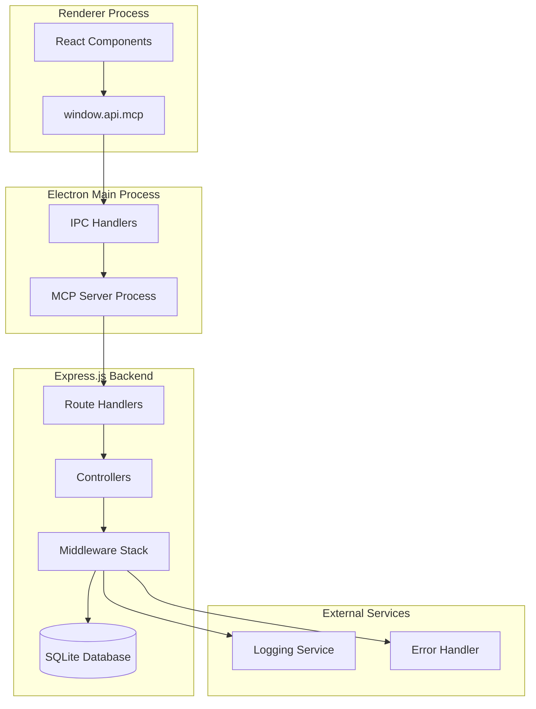
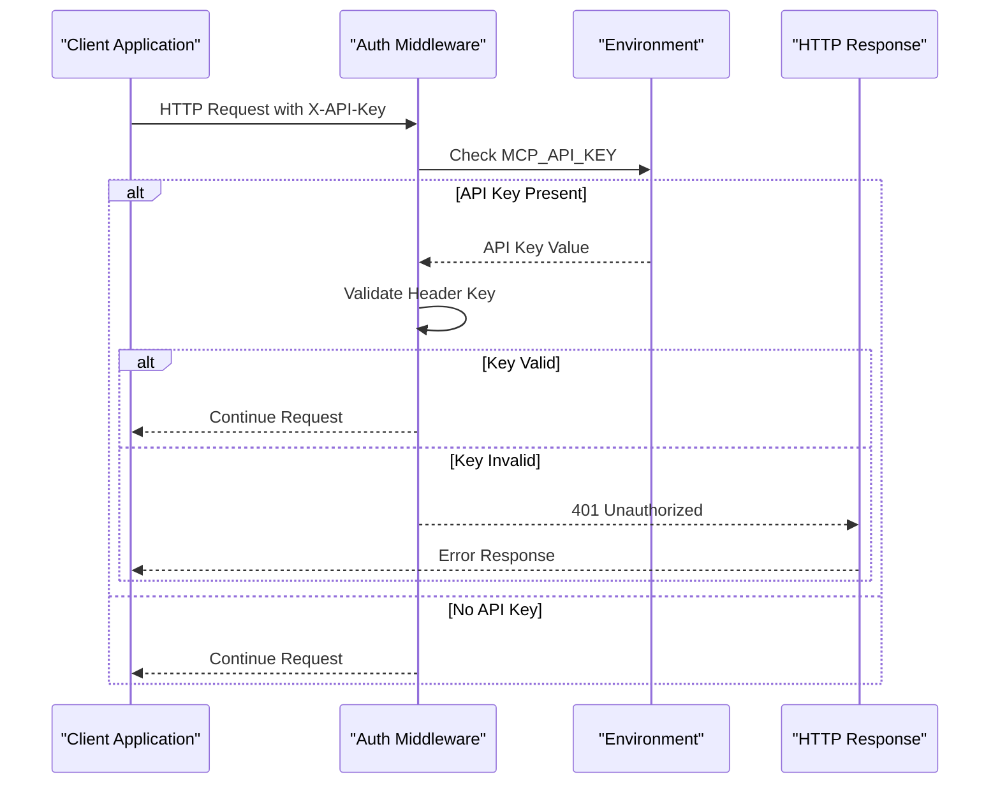
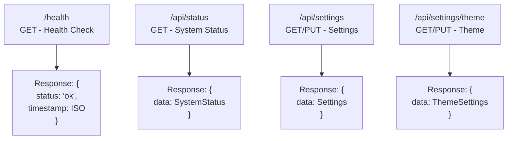
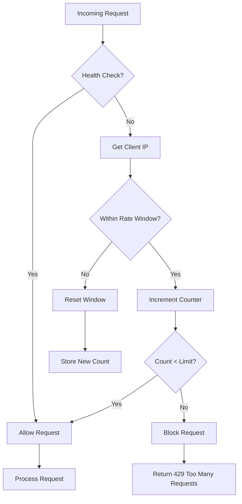
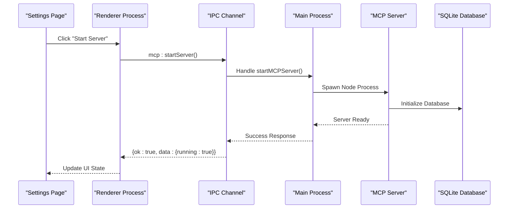
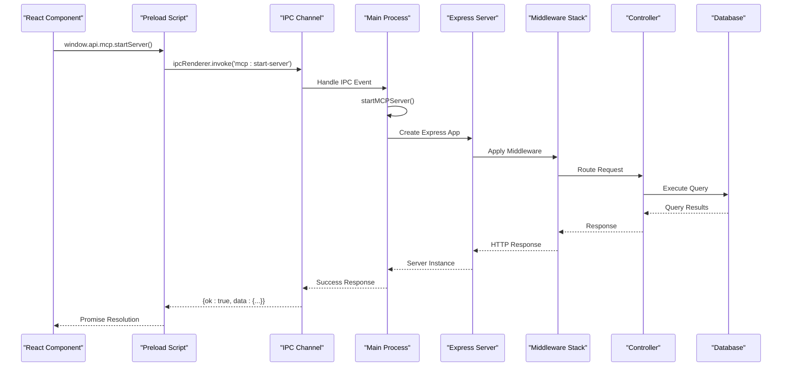
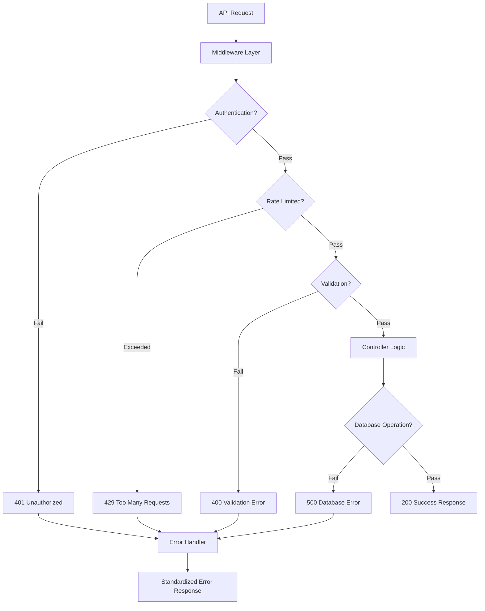

# MCP Server REST API Communication

<cite>
**Referenced Files in This Document**
- [mcp-server.ts](file://src/server/mcp-server.ts)
- [mcp.ts](file://src/main/ipc/mcp.ts)
- [MCPStatusIndicator.tsx](file://src/renderer/components/MCPStatusIndicator.tsx)
- [index.ts](file://src/preload/index.ts)
- [SettingsPage.tsx](file://src/renderer/pages/SettingsPage.tsx)
- [mcpRepo.ts](file://src/database/mcpRepo.ts)
- [types.ts](file://src/common/types.ts)
- [auth.ts](file://src/server/middleware/auth.ts)
- [rateLimiter.ts](file://src/server/middleware/rateLimiter.ts)
- [errorHandler.ts](file://src/server/middleware/errorHandler.ts)
- [logger.ts](file://src/server/utils/logger.ts)
- [statusController.ts](file://src/server/controllers/statusController.ts)
- [status.ts](file://src/server/routes/status.ts)
- [tasks.ts](file://src/server/routes/tasks.ts)
- [settings.ts](file://src/server/routes/settings.ts)
- [activities.ts](file://src/server/routes/activities.ts)
</cite>

## Table of Contents
1. [Introduction](#introduction)
2. [System Architecture](#system-architecture)
3. [Environment Configuration](#environment-configuration)
4. [Authentication and Security](#authentication-and-security)
5. [API Endpoint Structure](#api-endpoint-structure)
6. [Request/Response Formats](#requestresponse-formats)
7. [Error Handling Schema](#error-handling-schema)
8. [Rate Limiting](#rate-limiting)
9. [CORS Configuration](#cors-configuration)
10. [API Usage Examples](#api-usage-examples)
11. [Communication Flow Diagrams](#communication-flow-diagrams)
12. [Debugging and Troubleshooting](#debugging-and-troubleshooting)
13. [Best Practices](#best-practices)

## Introduction

The MCP (Mind Control Panel) Server in LifeOS provides a comprehensive REST API communication layer that enables seamless interaction between the renderer process and the Express.js backend. This system facilitates data operations, server management, and real-time status monitoring through a standardized HTTP interface.

The MCP Server operates as a standalone Express.js application that handles various data modules including tasks, projects, habits, notebooks, Q&A, activities, and settings. It implements robust security measures, rate limiting, and comprehensive error handling to ensure reliable operation in both development and production environments.

## System Architecture

The MCP Server follows a layered architecture that separates concerns between presentation, business logic, and data persistence:



**Diagram sources**
- [mcp-server.ts](file://src/server/mcp-server.ts#L1-L90)
- [mcp.ts](file://src/main/ipc/mcp.ts#L1-L151)
- [index.ts](file://src/preload/index.ts#L164-L200)

**Section sources**
- [mcp-server.ts](file://src/server/mcp-server.ts#L1-L90)
- [mcp.ts](file://src/main/ipc/mcp.ts#L1-L151)

## Environment Configuration

The MCP Server relies on several environment variables for configuration and deployment flexibility:

| Variable | Description | Default Value | Required |
|----------|-------------|---------------|----------|
| `MCP_SERVER_PORT` | Server listening port | `3000` | No |
| `MCP_SERVER_HOST` | Server binding address | `localhost` | No |
| `MCP_API_KEY` | Optional API authentication key | None | No |
| `MCP_CORS_ORIGIN` | Allowed CORS origins | `*` | No |
| `MCP_RATE_LIMIT` | Requests per minute limit | `100` | No |
| `MCP_LOG_LEVEL` | Logging verbosity level | `info` | No |

### Configuration Example

```bash
# Development environment
MCP_SERVER_PORT=3000
MCP_SERVER_HOST=localhost
MCP_LOG_LEVEL=debug

# Production environment
MCP_SERVER_PORT=8080
MCP_API_KEY=your-secret-api-key-here
MCP_CORS_ORIGIN=https://your-domain.com
MCP_RATE_LIMIT=200
MCP_LOG_LEVEL=warn
```

**Section sources**
- [mcp-server.ts](file://src/server/mcp-server.ts#L17-L18)
- [logger.ts](file://src/server/utils/logger.ts#L1-L48)

## Authentication and Security

The MCP Server implements a flexible authentication system designed for both local development and production deployments:

### Authentication Strategy

1. **Local Development**: No authentication required (binds to localhost)
2. **Production Deployment**: Optional API key authentication via `X-API-Key` header
3. **Health Check**: Public access for monitoring systems

### API Key Authentication



**Diagram sources**
- [auth.ts](file://src/server/middleware/auth.ts#L1-L25)

### Security Practices

- **Local Binding**: Defaults to localhost for development isolation
- **Optional Authentication**: API keys for production deployments
- **CORS Protection**: Configurable origin restrictions
- **Rate Limiting**: Prevents abuse and ensures fair resource usage
- **Secure Headers**: Automatic security header injection

**Section sources**
- [auth.ts](file://src/server/middleware/auth.ts#L1-L25)

## API Endpoint Structure

The MCP Server exposes a comprehensive REST API organized into logical modules:

### Base URL Structure

```
GET /health           # Health check endpoint
POST /api/{module}/create  # Create new resources
GET /api/{module}/{id}     # Retrieve specific resource
PUT /api/{module}/{id}     # Update existing resource
DELETE /api/{module}/{id}  # Delete resource
GET /api/{module}          # List all resources
```

### Available Modules

| Module | Base Path | Operations | Description |
|--------|-----------|------------|-------------|
| Tasks | `/api/tasks` | CRUD + Move | Task management with status tracking |
| Projects | `/api/projects` | CRUD + Active | Project organization and active project |
| Habits | `/api/habits` | CRUD + Logging | Habit tracking and completion logs |
| Notebooks | `/api/notebooks` | CRUD + Notes | Notebook organization and note management |
| Notes | `/api/notes` | CRUD + Search | Individual note operations |
| Q&A | `/api/qa` | CRUD + Collections | Question and answer management |
| Activities | `/api/activities` | CRUD + Stats | User activity tracking |
| Settings | `/api/settings` | CRUD + Theme | Application settings and theme management |
| Status | `/api/status` | GET | Comprehensive system status report |

### Special Endpoints



**Diagram sources**
- [mcp-server.ts](file://src/server/mcp-server.ts#L34-L42)
- [status.ts](file://src/server/routes/status.ts#L1-L8)
- [settings.ts](file://src/server/routes/settings.ts#L1-L17)

**Section sources**
- [mcp-server.ts](file://src/server/mcp-server.ts#L34-L42)
- [tasks.ts](file://src/server/routes/tasks.ts#L1-L26)
- [settings.ts](file://src/server/routes/settings.ts#L1-L17)
- [activities.ts](file://src/server/routes/activities.ts#L1-L17)

## Request/Response Formats

### Standard Response Format

All API endpoints return responses in a consistent JSON format:

```typescript
interface ApiResponse<T> {
  ok: boolean;
  data?: T;
  error?: string;
}
```

### Request Body Validation

The server uses Zod for runtime validation of request payloads:

```typescript
// Example validation schema
const createTaskSchema = z.object({
  projectId: z.number(),
  title: z.string().min(1),
  description: z.string().optional(),
  status: z.enum(['Backlog', 'To-Do', 'In Progress', 'Completed']),
  dueDate: z.string().optional(),
  priority: z.enum(['Low', 'Medium', 'High']).optional(),
  tags: z.array(z.string()).optional()
});
```

### Content-Type Requirements

- **Requests**: `application/json` or `application/x-www-form-urlencoded`
- **Responses**: `application/json` only
- **File Uploads**: Up to 10MB limit for JSON payloads

**Section sources**
- [types.ts](file://src/common/types.ts#L35-L40)
- [errorHandler.ts](file://src/server/middleware/errorHandler.ts#L15-L30)

## Error Handling Schema

The MCP Server implements a standardized error response format with specific error codes:

### Standard Error Response

```typescript
interface ErrorResponse {
  error: {
    code: string;
    message: string;
    details?: any;
  }
}
```

### Error Codes and HTTP Statuses

| Error Code | HTTP Status | Description | Example Scenario |
|------------|-------------|-------------|------------------|
| `UNAUTHORIZED` | 401 | Invalid or missing API key | Missing X-API-Key header |
| `VALIDATION_ERROR` | 400 | Request data validation failed | Invalid task title length |
| `NOT_FOUND` | 404 | Resource not found | Non-existent task ID |
| `DATABASE_ERROR` | 500 | Database operation failed | Constraint violation |
| `INTERNAL_SERVER_ERROR` | 500 | Unexpected server error | Unhandled exception |

### Error Response Examples

```json
// Validation Error
{
  "error": {
    "code": "VALIDATION_ERROR",
    "message": "Invalid request data",
    "details": [
      {
        "code": "too_small",
        "path": ["title"],
        "message": "String must contain at least 1 character(s)"
      }
    ]
  }
}

// Unauthorized Access
{
  "error": {
    "code": "UNAUTHORIZED",
    "message": "Invalid or missing API key"
  }
}

// Resource Not Found
{
  "error": {
    "code": "NOT_FOUND",
    "message": "Task with ID 123 not found"
  }
}
```

**Section sources**
- [errorHandler.ts](file://src/server/middleware/errorHandler.ts#L15-L69)

## Rate Limiting

The MCP Server implements sliding window rate limiting to prevent abuse and ensure fair resource allocation:

### Rate Limiting Configuration

```typescript
const RATE_LIMIT = Number(process.env.MCP_RATE_LIMIT) || 100; // requests per minute
const WINDOW_MS = 60 * 1000; // 1 minute
```

### Rate Limiting Algorithm



**Diagram sources**
- [rateLimiter.ts](file://src/server/middleware/rateLimiter.ts#L1-L39)

### Rate Limiting Behavior

- **Sliding Window**: Tracks requests over 1-minute windows
- **Per-IP Basis**: Each client IP has independent rate limits
- **Health Check Exemption**: Monitoring endpoints bypass rate limiting
- **Automatic Cleanup**: Expired rate limit entries are automatically removed

**Section sources**
- [rateLimiter.ts](file://src/server/middleware/rateLimiter.ts#L1-L39)

## CORS Configuration

The MCP Server provides flexible Cross-Origin Resource Sharing (CORS) configuration:

### Default CORS Settings

```typescript
app.use(cors({
  origin: process.env.MCP_CORS_ORIGIN || '*',
  credentials: true
}));
```

### CORS Configuration Options

| Setting | Default | Description |
|---------|---------|-------------|
| `origin` | `'*'` | Allowed origins (wildcard or specific domains) |
| `credentials` | `true` | Enable cookies and authorization headers |
| `methods` | `GET,HEAD,PUT,PATCH,POST,DELETE` | Allowed HTTP methods |
| `allowedHeaders` | `Content-Type,X-API-Key` | Permitted request headers |

### Production CORS Setup

```javascript
// For production deployments
const corsOptions = {
  origin: ['https://yourdomain.com', 'https://app.yourdomain.com'],
  credentials: true,
  optionsSuccessStatus: 200
};
```

**Section sources**
- [mcp-server.ts](file://src/server/mcp-server.ts#L22-L26)

## API Usage Examples

### Starting and Stopping the Server

The renderer process communicates with the MCP Server through the `window.api.mcp` interface:

```typescript
// Start MCP Server
await window.api.mcp.startServer();

// Stop MCP Server  
await window.api.mcp.stopServer();

// Get Server Status
const status = await window.api.mcp.getStatus();
console.log(`Server running: ${status.data.running}`);
console.log(`Uptime: ${status.data.uptime}ms`);
```

### Fetching Status Information

```typescript
// Get comprehensive system status
const statusResponse = await window.api.mcp.getStatus();
if (statusResponse.ok && statusResponse.data) {
  const serverStatus = statusResponse.data;
  console.log(`Server: ${serverStatus.running ? 'Running' : 'Stopped'}`);
  console.log(`Port: ${serverStatus.port}`);
  console.log(`Uptime: ${formatUptime(serverStatus.uptime)}`);
}
```

### Updating Configuration

```typescript
// Update server port
const updateResponse = await window.api.mcp.updateConfig({ 
  port: 8080 
});
if (updateResponse.ok && updateResponse.data) {
  console.log(`Port updated to: ${updateResponse.data.port}`);
}

// Toggle auto-start
const configResponse = await window.api.mcp.updateConfig({ 
  autoStart: true 
});
```

### Real-World Usage Patterns



**Diagram sources**
- [SettingsPage.tsx](file://src/renderer/pages/SettingsPage.tsx#L50-L85)
- [mcp.ts](file://src/main/ipc/mcp.ts#L100-L125)

**Section sources**
- [SettingsPage.tsx](file://src/renderer/pages/SettingsPage.tsx#L50-L85)
- [index.ts](file://src/preload/index.ts#L178-L185)

## Communication Flow Diagrams

### Complete API Call Flow



**Diagram sources**
- [index.ts](file://src/preload/index.ts#L178-L185)
- [mcp.ts](file://src/main/ipc/mcp.ts#L100-L125)
- [mcp-server.ts](file://src/server/mcp-server.ts#L50-L75)

### Error Handling Flow



**Diagram sources**
- [errorHandler.ts](file://src/server/middleware/errorHandler.ts#L15-L69)
- [auth.ts](file://src/server/middleware/auth.ts#L1-L25)
- [rateLimiter.ts](file://src/server/middleware/rateLimiter.ts#L1-L39)

**Section sources**
- [index.ts](file://src/preload/index.ts#L178-L185)
- [mcp.ts](file://src/main/ipc/mcp.ts#L100-L125)

## Debugging and Troubleshooting

### Common Issues and Solutions

#### Network Connectivity Issues

**Problem**: Cannot connect to MCP Server
**Symptoms**: 
- Connection refused errors
- Timeout exceptions
- "Failed to start MCP server" messages

**Solutions**:
1. Verify server is running: `curl http://localhost:3000/health`
2. Check port availability: `netstat -an | grep 3000`
3. Review firewall settings
4. Verify environment variables

#### Authentication Problems

**Problem**: 401 Unauthorized responses
**Symptoms**:
- API key validation failures
- Missing X-API-Key header

**Solutions**:
1. Verify `MCP_API_KEY` environment variable
2. Check header format: `X-API-Key: your-api-key`
3. Ensure API key matches server configuration

#### Rate Limiting Issues

**Problem**: 429 Too Many Requests
**Symptoms**:
- Frequent rate limit errors
- Slow API responses

**Solutions**:
1. Reduce request frequency
2. Increase rate limit: `MCP_RATE_LIMIT=200`
3. Implement exponential backoff in client code

#### Database Connection Issues

**Problem**: Database initialization failures
**Symptoms**:
- Server startup errors
- "Failed to initialize database" messages

**Solutions**:
1. Check database file permissions
2. Verify disk space availability
3. Review database schema integrity

### Debugging Tools and Techniques

#### Enable Debug Logging

```bash
# Set log level to debug
MCP_LOG_LEVEL=debug npm run mcp:dev

# Monitor server logs
tail -f mcp-server.log
```

#### Health Check Monitoring

```bash
# Check server health
curl -H "X-API-Key: your-key" http://localhost:3000/health

# Monitor system status
curl -H "X-API-Key: your-key" http://localhost:3000/api/status
```

#### Network Diagnostics

```bash
# Test connectivity
telnet localhost 3000

# Check port usage
lsof -i :3000

# Monitor traffic
tcpdump -i lo0 -A 'port 3000'
```

**Section sources**
- [logger.ts](file://src/server/utils/logger.ts#L1-L48)
- [mcp.ts](file://src/main/ipc/mcp.ts#L15-L50)

## Best Practices

### Development Guidelines

1. **Environment Separation**: Use different configurations for development and production
2. **Error Handling**: Always check response `ok` property before accessing data
3. **Resource Cleanup**: Properly handle server lifecycle (start/stop)
4. **Rate Awareness**: Respect rate limits and implement retry logic

### Production Deployment

1. **Security Hardening**: Enable API keys and restrict CORS origins
2. **Monitoring**: Implement comprehensive logging and health checks
3. **Scaling**: Consider load balancing for high-traffic scenarios
4. **Backup**: Regular database backups and disaster recovery procedures

### Performance Optimization

1. **Connection Pooling**: Reuse database connections where possible
2. **Caching**: Implement appropriate caching strategies
3. **Compression**: Enable gzip compression for large responses
4. **Async Operations**: Use async/await for non-blocking operations

### Security Considerations

1. **API Key Management**: Store API keys securely and rotate regularly
2. **Input Validation**: Validate all user inputs at multiple layers
3. **Access Control**: Implement proper authorization checks
4. **Audit Logging**: Log all API access for security monitoring

**Section sources**
- [mcp-server.ts](file://src/server/mcp-server.ts#L1-L90)
- [auth.ts](file://src/server/middleware/auth.ts#L1-L25)
- [rateLimiter.ts](file://src/server/middleware/rateLimiter.ts#L1-L39)