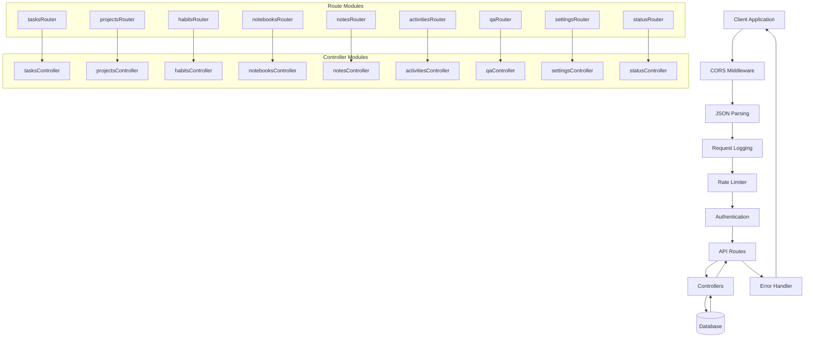
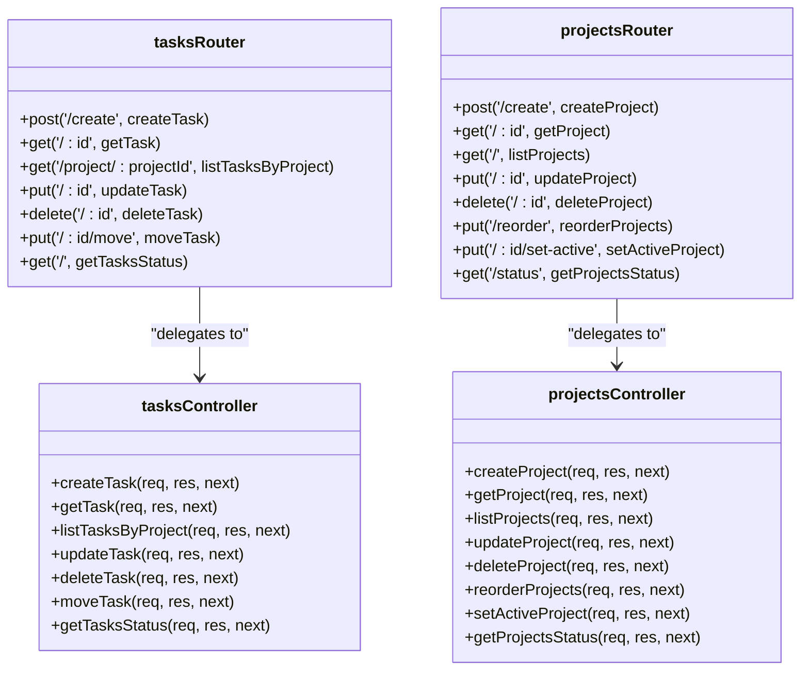
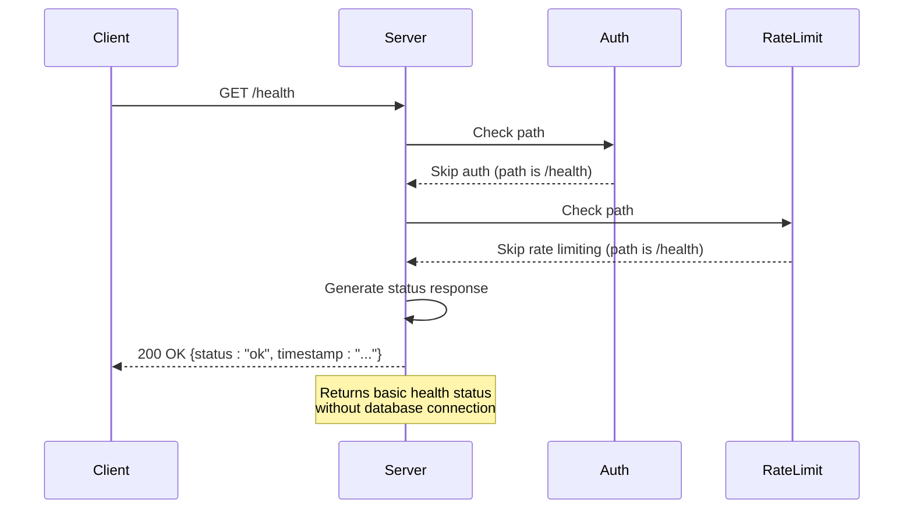
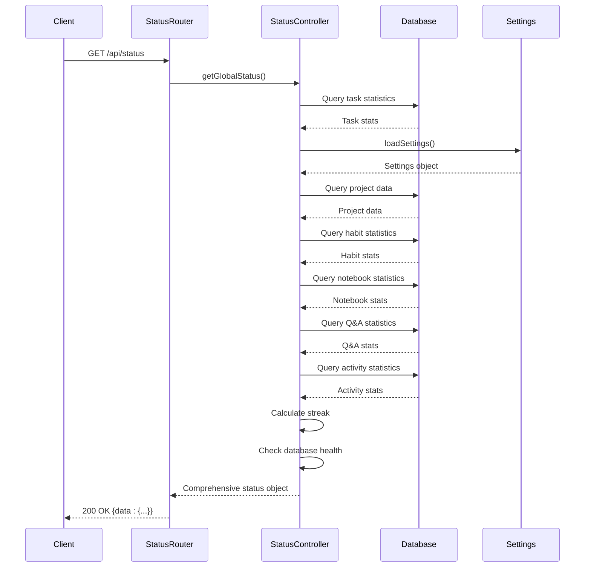
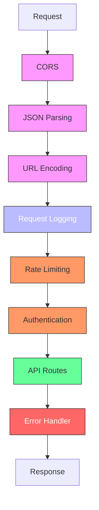

# API Routing System

<cite>
**Referenced Files in This Document**   
- [mcp-server.ts](file://src/server/mcp-server.ts)
- [tasks.ts](file://src/server/routes/tasks.ts)
- [projects.ts](file://src/server/routes/projects.ts)
- [habits.ts](file://src/server/routes/habits.ts)
- [notebooks.ts](file://src/server/routes/notebooks.ts)
- [notes.ts](file://src/server/routes/notes.ts)
- [activities.ts](file://src/server/routes/activities.ts)
- [qa.ts](file://src/server/routes/qa.ts)
- [settings.ts](file://src/server/routes/settings.ts)
- [status.ts](file://src/server/routes/status.ts)
- [tasksController.ts](file://src/server/controllers/tasksController.ts)
- [statusController.ts](file://src/server/controllers/statusController.ts)
- [errorHandler.ts](file://src/server/middleware/errorHandler.ts)
- [logging.ts](file://src/server/middleware/logging.ts)
- [auth.ts](file://src/server/middleware/auth.ts)
- [rateLimiter.ts](file://src/server/middleware/rateLimiter.ts)
- [logger.ts](file://src/server/utils/logger.ts)
</cite>

## Table of Contents
1. [Introduction](#introduction)
2. [Project Structure](#project-structure)
3. [Core Components](#core-components)
4. [Architecture Overview](#architecture-overview)
5. [Detailed Component Analysis](#detailed-component-analysis)
6. [Dependency Analysis](#dependency-analysis)
7. [Performance Considerations](#performance-considerations)
8. [Troubleshooting Guide](#troubleshooting-guide)
9. [Conclusion](#conclusion)

## Introduction
The MCP Server implements a modular Express.js routing system designed for scalability and maintainability. The API follows a consistent pattern of route organization, controller delegation, and middleware application. This documentation details the routing architecture, including the base path structure, modular route organization, health check implementation, middleware pipeline, and best practices for extending the API.

## Project Structure

The server-side routing system is organized in a clear, domain-driven structure within the `src/server` directory:

```mermaid
flowchart TD
A[src/server] --> B[controllers]
A --> C[middleware]
A --> D[routes]
A --> E[utils]
A --> F[mcp-server.ts]
B --> B1[tasksController.ts]
B --> B2[projectsController.ts]
B --> B3[habitsController.ts]
B --> B4[notebooksController.ts]
B --> B5[notesController.ts]
B --> B6[activitiesController.ts]
B --> B7[qaController.ts]
B --> B8[settingsController.ts]
B --> B9[statusController.ts]
C --> C1[errorHandler.ts]
C --> C2[logging.ts]
C --> C3[auth.ts]
C --> C4[rateLimiter.ts]
D --> D1[tasks.ts]
D --> D2[projects.ts]
D --> D3[habits.ts]
D --> D4[notebooks.ts]
D --> D5[notes.ts]
D --> D6[activities.ts]
D --> D7[qa.ts]
D --> D8[settings.ts]
D --> D9[status.ts]
E --> E1[logger.ts]
```



**Diagram sources**
- [mcp-server.ts](file://src/server/mcp-server.ts#L1-L80)
- [routes](file://src/server/routes/)

**Section sources**
- [mcp-server.ts](file://src/server/mcp-server.ts#L1-L80)

## Core Components

The routing system consists of three primary component types:
- **Route modules**: Define URL patterns and HTTP methods, delegate to controllers
- **Controllers**: Handle business logic and data operations
- **Middleware**: Process requests before they reach routes

Each domain module (tasks, projects, habits, etc.) follows this pattern, ensuring consistency across the API surface.

**Section sources**
- [mcp-server.ts](file://src/server/mcp-server.ts#L1-L80)
- [tasks.ts](file://src/server/routes/tasks.ts#L1-L25)
- [tasksController.ts](file://src/server/controllers/tasksController.ts#L1-L139)

## Architecture Overview

The MCP Server routing architecture follows a layered approach with clear separation of concerns:



**Diagram sources**
- [mcp-server.ts](file://src/server/mcp-server.ts#L1-L80)
- [routes](file://src/server/routes/)
- [controllers](file://src/server/controllers/)

## Detailed Component Analysis

### Route Organization and Mounting Strategy

The MCP Server uses a modular route mounting strategy with a consistent base path pattern of `/api/*`. Each domain module has its own route file that exports a configured Express Router instance.

```mermaid
flowchart TD
Server[mcp-server.ts] --> Tasks[app.use('/api/tasks', tasksRouter)]
Server --> Projects[app.use('/api/projects', projectsRouter)]
Server --> Habits[app.use('/api/habits', habitsRouter)]
Server --> Notebooks[app.use('/api/notebooks', notebooksRouter)]
Server --> Notes[app.use('/api/notes', notesRouter)]
Server --> Activities[app.use('/api/activities', activitiesRouter)]
Server --> QA[app.use('/api/qa', qaRouter)]
Server --> Settings[app.use('/api/settings', settingsRouter)]
Server --> Status[app.use('/api/status', statusRouter)]
Tasks --> TasksRoutes[tasks.ts]
Projects --> ProjectsRoutes[projects.ts]
Habits --> HabitsRoutes[habits.ts]
Notebooks --> NotebooksRoutes[notebooks.ts]
Notes --> NotesRoutes[notes.ts]
Activities --> ActivitiesRoutes[activities.ts]
QA --> QARoutes[qa.ts]
Settings --> SettingsRoutes[settings.ts]
Status --> StatusRoutes[status.ts]
```

**Diagram sources**
- [mcp-server.ts](file://src/server/mcp-server.ts#L1-L80)
- [tasks.ts](file://src/server/routes/tasks.ts#L1-L25)

**Section sources**
- [mcp-server.ts](file://src/server/mcp-server.ts#L1-L80)
- [tasks.ts](file://src/server/routes/tasks.ts#L1-L25)

### Controller Delegation Pattern

Each route delegates to its corresponding controller, following a consistent import and delegation pattern. The controllers handle business logic and database operations.



**Diagram sources**
- [tasks.ts](file://src/server/routes/tasks.ts#L1-L25)
- [tasksController.ts](file://src/server/controllers/tasksController.ts#L1-L139)
- [projects.ts](file://src/server/routes/projects.ts#L1-L28)

### Health Check Endpoint Implementation

The health check endpoint provides system monitoring capabilities and is accessible at the root path `/health`. It bypasses authentication and rate limiting middleware.



**Diagram sources**
- [mcp-server.ts](file://src/server/mcp-server.ts#L1-L80)
- [auth.ts](file://src/server/middleware/auth.ts#L1-L26)
- [rateLimiter.ts](file://src/server/middleware/rateLimiter.ts#L1-L69)

**Section sources**
- [mcp-server.ts](file://src/server/mcp-server.ts#L1-L80)
- [auth.ts](file://src/server/middleware/auth.ts#L1-L26)

### Status Endpoint Implementation

The comprehensive status endpoint at `/api/status` provides detailed system metrics across all modules, serving as a dashboard for system health.



**Diagram sources**
- [status.ts](file://src/server/routes/status.ts#L1-L7)
- [statusController.ts](file://src/server/controllers/statusController.ts#L1-L150)

**Section sources**
- [status.ts](file://src/server/routes/status.ts#L1-L7)
- [statusController.ts](file://src/server/controllers/statusController.ts#L1-L150)

### Middleware Application Order

The middleware pipeline follows a specific order that impacts request processing, with each middleware layer adding functionality before requests reach the routes.



**Diagram sources**
- [mcp-server.ts](file://src/server/mcp-server.ts#L1-L80)
- [logging.ts](file://src/server/middleware/logging.ts#L1-L22)
- [rateLimiter.ts](file://src/server/middleware/rateLimiter.ts#L1-L69)
- [auth.ts](file://src/server/middleware/auth.ts#L1-L26)
- [errorHandler.ts](file://src/server/middleware/errorHandler.ts#L1-L69)

**Section sources**
- [mcp-server.ts](file://src/server/mcp-server.ts#L1-L80)
- [logging.ts](file://src/server/middleware/logging.ts#L1-L22)

## Dependency Analysis

The routing system has a clear dependency hierarchy, with the main server file importing and composing all route modules.

```mermaid
graph TD
mcp-server --> tasksRouter
mcp-server --> projectsRouter
mcp-server --> habitsRouter
mcp-server --> notebooksRouter
mcp-server --> notesRouter
mcp-server --> activitiesRouter
mcp-server --> qaRouter
mcp-server --> settingsRouter
mcp-server --> statusRouter
mcp-server --> errorHandler
mcp-server --> requestLogger
mcp-server --> authMiddleware
mcp-server --> rateLimiter
tasksRouter --> tasksController
projectsRouter --> projectsController
habitsRouter --> habitsController
notebooksRouter --> notebooksController
notesRouter --> notesController
activitiesRouter --> activitiesController
qaRouter --> qaController
settingsRouter --> settingsController
statusRouter --> statusController
tasksController --> tasksRepo
projectsController --> projectsRepo
habitsController --> habitsRepo
notebooksController --> notebookRepo
notesController --> notebookRepo
activitiesController --> activitiesRepo
qaController --> qaRepo
statusController --> habitsRepo
statusController --> notebookRepo
statusController --> qaRepo
statusController --> activitiesRepo
statusController --> projectsRepo
statusController --> settings
class mcp-server,type1
class tasksRouter,projectsRouter,habitsRouter,notebooksRouter,notesRouter,activitiesRouter,qaRouter,settingsRouter,statusRouter,type2
class tasksController,projectsController,habitsController,notebooksController,notesController,activitiesController,qaController,settingsController,statusController,type3
class tasksRepo,projectsRepo,habitsRepo,notebookRepo,activitiesRepo,qaRepo,type4
classDef type1 fill:#2ecc71,stroke:#333,color:#fff;
classDef type2 fill:#3498db,stroke:#333,color:#fff;
classDef type3 fill:#9b59b6,stroke:#333,color:#fff;
classDef type4 fill:#e67e22,stroke:#333,color:#fff;
```

**Diagram sources**
- [mcp-server.ts](file://src/server/mcp-server.ts#L1-L80)
- [routes](file://src/server/routes/)
- [controllers](file://src/server/controllers/)
- [database](file://src/database/)

**Section sources**
- [mcp-server.ts](file://src/server/mcp-server.ts#L1-L80)
- [routes](file://src/server/routes/)
- [controllers](file://src/server/controllers/)

## Performance Considerations

The routing system incorporates several performance and reliability features:

- **Rate Limiting**: Prevents abuse with configurable limits (default: 100 requests/minute)
- **Efficient Logging**: Logs requests and responses with timing information
- **CORS Configuration**: Configurable origin policies for security
- **Error Handling**: Centralized error processing with appropriate HTTP status codes
- **Health Check Optimization**: Lightweight endpoint that doesn't require database connections

The middleware order is optimized to fail fast for unauthorized or rate-limited requests before processing heavier operations.

**Section sources**
- [rateLimiter.ts](file://src/server/middleware/rateLimiter.ts#L1-L69)
- [logging.ts](file://src/server/middleware/logging.ts#L1-L22)
- [auth.ts](file://src/server/middleware/auth.ts#L1-L26)

## Troubleshooting Guide

Common issues and their solutions:

1. **401 Unauthorized Errors**: Ensure the `X-API-Key` header is present and matches the `MCP_API_KEY` environment variable, or disable API key requirement by not setting the environment variable.

2. **429 Too Many Requests**: The rate limiter has been triggered. Wait for the reset time indicated in the `Retry-After` header, or increase the `MCP_RATE_LIMIT` environment variable.

3. **404 Not Found**: Verify the API path includes the `/api/` prefix and the correct module name (e.g., `/api/tasks/123` not `/tasks/123`).

4. **500 Internal Server Errors**: Check server logs for detailed error information. The error handler provides different levels of detail based on the `NODE_ENV` environment variable.

5. **CORS Issues**: Configure the `MCP_CORS_ORIGIN` environment variable to match your client application's origin, or set it to `*` for development.

6. **Health Check Failures**: The `/health` endpoint should always succeed. If it fails, check server startup logs for initialization errors.

**Section sources**
- [errorHandler.ts](file://src/server/middleware/errorHandler.ts#L1-L69)
- [auth.ts](file://src/server/middleware/auth.ts#L1-L26)
- [rateLimiter.ts](file://src/server/middleware/rateLimiter.ts#L1-L69)
- [mcp-server.ts](file://src/server/mcp-server.ts#L1-L80)

## Conclusion

The MCP Server's routing system demonstrates a well-architected Express.js application with modular design principles. Key strengths include:

- Consistent `/api/*` base path structure for all endpoints
- Modular route organization by domain (tasks, projects, habits, etc.)
- Clear separation between route definitions and controller logic
- Comprehensive middleware pipeline for security, logging, and rate limiting
- Health check endpoint for system monitoring
- Standardized error handling across all routes
- Scalable architecture that makes adding new modules straightforward

To add a new route module, create corresponding files in the routes and controllers directories, import them in `mcp-server.ts`, and mount the router with the appropriate `/api/*` path. This consistent pattern ensures maintainability and scalability as the application grows.