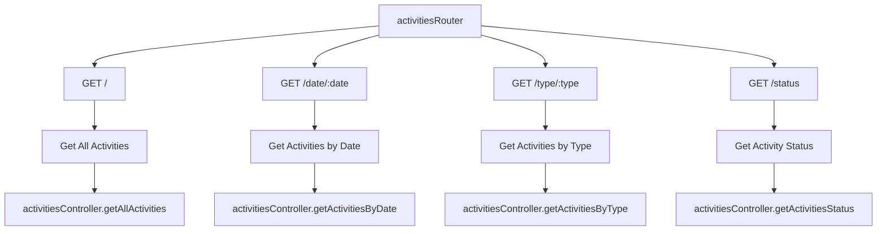
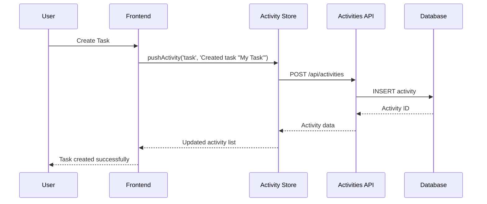
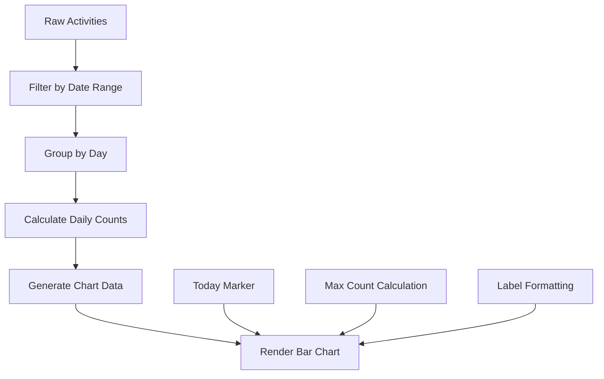
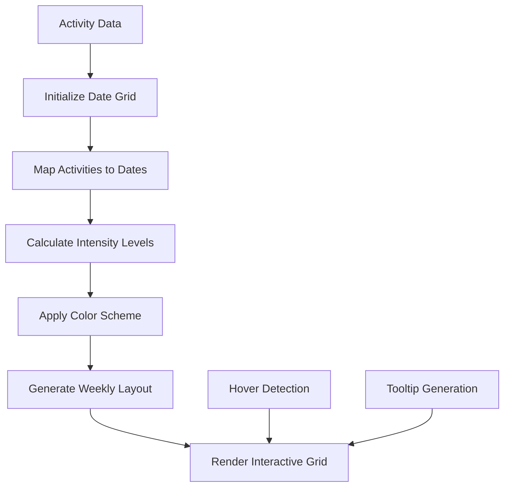
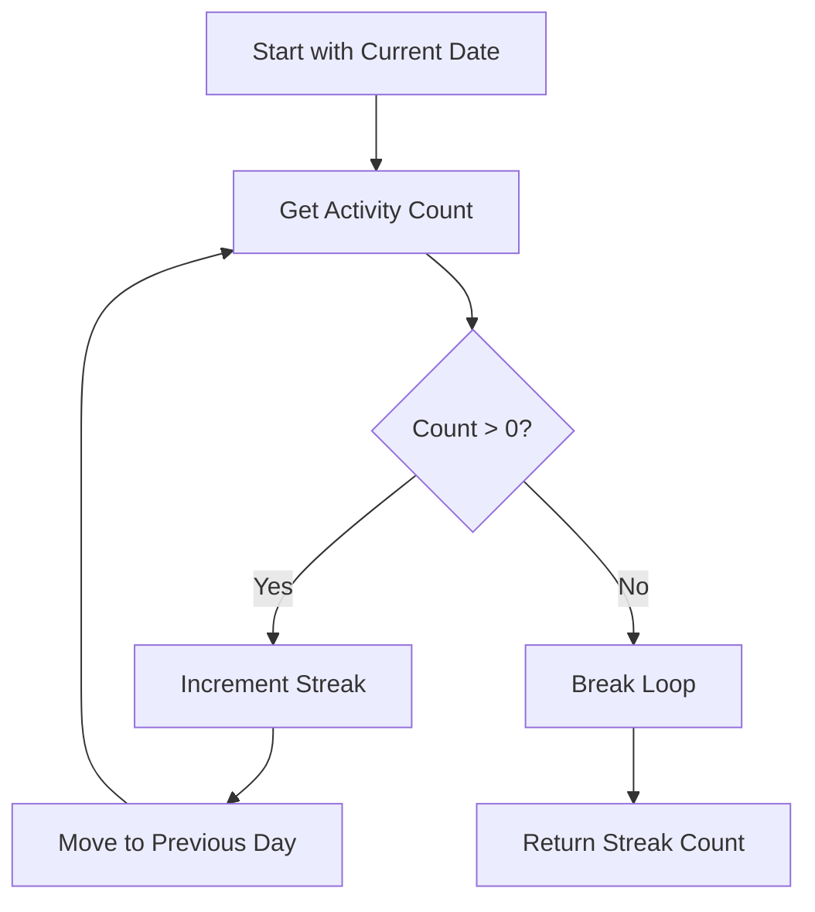

# Activities API Routes

<cite>
**Referenced Files in This Document**
- [activities.ts](file://src/server/routes/activities.ts)
- [activitiesController.ts](file://src/server/controllers/activitiesController.ts)
- [activitiesRepo.ts](file://src/database/activitiesRepo.ts)
- [ActivityChart.tsx](file://src/renderer/components/ActivityChart.tsx)
- [ActivityHeatmap.tsx](file://src/renderer/components/ActivityHeatmap.tsx)
- [activity.ts](file://src/store/activity.ts)
- [activities.ts](file://src/main/ipc/activities.ts)
- [init.ts](file://src/database/init.ts)
- [KanbanPage.tsx](file://src/renderer/pages/KanbanPage.tsx)
- [Dashboard.tsx](file://src/renderer/pages/Dashboard.tsx)
</cite>

## Table of Contents
1. [Introduction](#introduction)
2. [API Route Structure](#api-route-structure)
3. [Data Model](#data-model)
4. [Endpoint Documentation](#endpoint-documentation)
5. [Activity Recording](#activity-recording)
6. [Frontend Integration](#frontend-integration)
7. [Analytics and Statistics](#analytics-and-statistics)
8. [Performance Considerations](#performance-considerations)
9. [Pagination Strategies](#pagination-strategies)
10. [Error Handling](#error-handling)
11. [Best Practices](#best-practices)

## Introduction

The Activities API provides comprehensive functionality for recording, retrieving, and analyzing user activities within the LifeOS application. This system tracks user interactions with tasks, projects, habits, and other application features to provide insights into productivity patterns and usage analytics.

The activities system serves multiple purposes:
- **Audit Trail**: Maintains a chronological record of user actions
- **Analytics**: Provides data for productivity metrics and trends
- **Visualization**: Powers dashboard components like ActivityChart and ActivityHeatmap
- **Performance Monitoring**: Tracks system usage patterns for optimization

## API Route Structure

The activities router is organized around four primary endpoints that handle different aspects of activity management:



**Diagram sources**
- [activities.ts](file://src/server/routes/activities.ts#L1-L17)

**Section sources**
- [activities.ts](file://src/server/routes/activities.ts#L1-L17)

## Data Model

The activities system uses a structured data model to capture comprehensive information about user actions:

### ActivityRow Interface

The core database representation defines the following structure:

| Field | Type | Description | Constraints |
|-------|------|-------------|-------------|
| `id` | `number` | Unique identifier | Primary Key, Auto-increment |
| `type` | `string` | Activity category/type | Not Null |
| `message` | `string` | Human-readable description | Not Null |
| `entity_type` | `string \| null` | Related entity type (task, project, etc.) | Nullable |
| `entity_id` | `number \| null` | Related entity identifier | Nullable |
| `metadata` | `string \| null` | Additional JSON metadata | Nullable |
| `created_at` | `string` | Timestamp of activity | Not Null, ISO format |

### CreateActivityInput Interface

When creating new activities, the input structure allows for flexible data capture:

| Field | Type | Description | Default |
|-------|------|-------------|---------|
| `type` | `string` | Activity category | Required |
| `message` | `string` | Description text | Required |
| `entity_type` | `string` | Related entity type | Optional |
| `entity_id` | `number` | Related entity ID | Optional |
| `metadata` | `Record<string, any>` | Additional data | Optional |

**Section sources**
- [activitiesRepo.ts](file://src/database/activitiesRepo.ts#L3-L16)

## Endpoint Documentation

### GET /activities/

**Purpose**: Retrieve all recorded activities with configurable limits

**Parameters**:
- `limit` (query): Maximum number of activities to return (default: 500)

**Response Structure**:
```typescript
{
  data: ActivityRow[]
}
```

**Implementation Details**:
- Orders activities by `created_at` in descending order
- Applies pagination through the `limit` parameter
- Uses SQLite prepared statements for security
- Returns raw database rows for efficiency

**Example Usage**:
```javascript
// Get latest 100 activities
fetch('/api/activities?limit=100')

// Get all activities (with caution for large datasets)
fetch('/api/activities')
```

### GET /activities/date/:date

**Purpose**: Retrieve activities for a specific calendar date

**Parameters**:
- `date` (path): Target date in YYYY-MM-DD format

**Response Structure**:
```typescript
{
  data: ActivityRow[]
}
```

**Implementation Details**:
- Uses SQLite date functions for efficient date range queries
- Handles timezone-neutral date comparisons
- Returns activities ordered by timestamp

### GET /activities/type/:type

**Purpose**: Retrieve activities of a specific type

**Parameters**:
- `type` (path): Activity type identifier
- `limit` (query): Maximum results (default: 100)

**Response Structure**:
```typescript
{
  data: ActivityRow[]
}
```

**Common Activity Types**:
- `task`: Task-related actions (create, update, delete, move)
- `project`: Project management activities
- `habit`: Habit tracking events
- `notebook`: Notebook interactions
- `settings`: Application configuration changes

### GET /activities/status

**Purpose**: Retrieve comprehensive activity statistics and analytics

**Response Structure**:
```typescript
{
  data: {
    today: number,
    thisWeek: number,
    thisMonth: number,
    byType: Record<string, number>,
    streak: number,
    lastActivityAt: string | null,
    heatmapData: Array<{
      date: string,
      count: number
    }>
  }
}
```

**Analytics Features**:
- **Temporal Aggregation**: Counts by today, week, and month
- **Type Distribution**: Breakdown by activity type
- **Streak Calculation**: Current activity streak detection
- **Heatmap Data**: 90-day activity intensity data
- **Last Activity Tracking**: Timestamp of most recent action

**Section sources**
- [activitiesController.ts](file://src/server/controllers/activitiesController.ts#L1-L110)

## Activity Recording

### Automatic Activity Creation

The system automatically creates activities for various user actions throughout the application:

#### Task Management Activities
Activities are generated for all task-related operations:



**Diagram sources**
- [KanbanPage.tsx](file://src/renderer/pages/KanbanPage.tsx#L179)
- [activity.ts](file://src/store/activity.ts#L35-L50)

#### Activity Types and Patterns

Common activity patterns include:

| Activity Type | Message Pattern | Example |
|---------------|-----------------|---------|
| `task` | `"Created task \"[title]\""` | `"Created task \"Write Report\""` |
| `task` | `"Updated task"` | `"Updated task"` |
| `task` | `"Deleted task: [title]"` | `"Deleted task: Write Report"` |
| `task` | `"Moved task \"[title]\" to [status]"` | `"Moved task \"Meeting Notes\" to Done"` |
| `task` | `"Restored \"[title]\" to Backlog"` | `"Restored \"Old Task\" to Backlog"` |

### Manual Activity Creation

Applications can programmatically create activities for custom events:

```typescript
// Example: Creating a custom activity
await window.api.activities.create({
  type: 'custom_feature',
  message: 'User accessed advanced analytics',
  entity_type: 'dashboard',
  entity_id: 123,
  metadata: {
    feature: 'advanced_analytics',
    duration_ms: 1500,
    viewport_width: 1920
  }
});
```

**Section sources**
- [KanbanPage.tsx](file://src/renderer/pages/KanbanPage.tsx#L87-L118)
- [activity.ts](file://src/store/activity.ts#L35-L50)

## Frontend Integration

### ActivityChart Component

The ActivityChart component visualizes daily activity patterns using a bar chart:

#### Key Features
- **Configurable Time Range**: Displays configurable number of days (default: 14)
- **Color Coding**: Distinct colors for today vs. past days
- **Interactive Tooltips**: Shows exact activity counts on hover
- **Responsive Design**: Adapts to different screen sizes

#### Data Processing
The component transforms raw activity data into chart-ready format:



**Diagram sources**
- [ActivityChart.tsx](file://src/renderer/components/ActivityChart.tsx#L15-L50)

### ActivityHeatmap Component

The ActivityHeatmap provides a calendar-style visualization of activity intensity:

#### Advanced Features
- **90-Day History**: Comprehensive historical view
- **Intensity Coloring**: Color-coded activity levels
- **Type Breakdown**: Hover reveals activity type distribution
- **Automatic Scrolling**: Focuses on current date
- **Responsive Layout**: Adapts to available space

#### Heatmap Algorithm
The component implements sophisticated date range processing:



**Diagram sources**
- [ActivityHeatmap.tsx](file://src/renderer/components/ActivityHeatmap.tsx#L15-L80)

### Store Integration

The activity store manages client-side state and provides reactive updates:

#### Store Operations
- **Load Activities**: Fetches activities from API with automatic parsing
- **Push Activity**: Creates new activities and updates local state
- **Clear Activities**: Removes all activities (admin functionality)
- **State Persistence**: Maintains activity history across sessions

**Section sources**
- [ActivityChart.tsx](file://src/renderer/components/ActivityChart.tsx#L1-L230)
- [ActivityHeatmap.tsx](file://src/renderer/components/ActivityHeatmap.tsx#L1-L266)
- [activity.ts](file://src/store/activity.ts#L1-L69)

## Analytics and Statistics

### Activity Statistics

The `/activities/status` endpoint provides comprehensive analytics:

#### Temporal Metrics
- **Today's Activities**: Count of activities from current day
- **This Week**: Activities from Monday to current day
- **This Month**: Activities from first day to current day

#### Type Distribution
The system tracks activity distribution by type for trend analysis:

```typescript
{
  byType: {
    'task': 150,
    'habit': 45,
    'project': 23,
    'notebook': 12,
    'settings': 8
  }
}
```

#### Streak Calculation Algorithm
The streak calculation uses a backward-iterative approach:



**Diagram sources**
- [activitiesController.ts](file://src/server/controllers/activitiesController.ts#L45-L65)

#### Heatmap Data Generation
The heatmap generates 90-day intensity data for calendar visualization:

| Intensity Level | Light Mode Color | Dark Mode Color |
|-----------------|------------------|-----------------|
| 0 activities | `rgba(0, 0, 0, 0.08)` | `rgba(255, 255, 255, 0.04)` |
| 1-2 activities | `rgba(3, 218, 198, 0.3)` | `rgba(3, 218, 198, 0.2)` |
| 3-5 activities | `rgba(3, 218, 198, 0.5)` | `rgba(3, 218, 198, 0.4)` |
| 6-10 activities | `rgba(3, 218, 198, 0.7)` | `rgba(3, 218, 198, 0.6)` |
| 10+ activities | `rgba(3, 218, 198, 0.95)` | `rgba(3, 218, 198, 0.9)` |

**Section sources**
- [activitiesController.ts](file://src/server/controllers/activitiesController.ts#L66-L110)

## Performance Considerations

### Database Optimization

The activities system implements several performance optimizations:

#### Index Strategy
- **Primary Index**: `idx_activities_created_at` (descending order)
- **Type Index**: `idx_activities_type` for type-based queries
- **Composite Index**: Combined indexes for date-range queries

#### Query Optimization
- **Prepared Statements**: Prevent SQL injection and improve performance
- **Parameterized Queries**: Efficient reuse of compiled query plans
- **Date Functions**: SQLite date functions for efficient temporal queries

### Memory Management

#### Client-Side Considerations
- **Lazy Loading**: Activities loaded on demand
- **Pagination**: Default limits prevent memory overload
- **Cleanup**: Automatic cleanup of old activities

#### Server-Side Considerations
- **Connection Pooling**: Efficient database connection management
- **Query Caching**: Frequently accessed statistics cached
- **Resource Limits**: Built-in limits prevent resource exhaustion

### Scalability Patterns

#### Horizontal Scaling Considerations
- **Sharded Storage**: Future support for activity sharding
- **Async Processing**: Background processing for heavy analytics
- **Caching Layers**: Redis caching for frequently accessed data

## Pagination Strategies

### Client-Side Pagination

The activity store implements intelligent pagination:

#### Load More Strategy
- **Initial Load**: 500 activities by default
- **Incremental Loading**: Additional loads on demand
- **Memory Management**: Automatic cleanup of old data

#### Filtering and Search
- **Real-time Filtering**: Client-side filtering without API calls
- **Debounced Searches**: Prevent excessive API requests
- **Smart Caching**: Cache filtered results for improved performance

### Server-Side Pagination

#### Query-Level Controls
- **Limit Parameters**: Control result set size
- **Offset-Based**: Traditional offset-based pagination
- **Cursor-Based**: Future support for cursor-based navigation

#### Performance Guidelines
- **Default Limits**: Reasonable defaults prevent abuse
- **Hard Limits**: Maximum limits prevent denial-of-service
- **Rate Limiting**: API rate limiting prevents abuse

**Section sources**
- [activitiesRepo.ts](file://src/database/activitiesRepo.ts#L35-L50)

## Error Handling

### API Error Responses

The activities API implements comprehensive error handling:

#### Standard Error Format
```typescript
{
  ok: false,
  error: "Error message",
  data?: undefined
}
```

#### Common Error Scenarios
- **Database Connection**: Graceful degradation when database unavailable
- **Invalid Parameters**: Clear validation errors for malformed requests
- **Permission Issues**: Appropriate access control responses
- **Resource Not Found**: Specific handling for missing resources

### Client-Side Error Handling

#### Store-Level Protection
- **Try-Catch Blocks**: Comprehensive error catching
- **Fallback Values**: Default values when API fails
- **User Feedback**: Clear error messages for users
- **Retry Logic**: Automatic retry for transient failures

#### Component-Level Resilience
- **Graceful Degradation**: Components work without activity data
- **Loading States**: Clear indication of data loading
- **Error Boundaries**: Isolated error handling for components

**Section sources**
- [activities.ts](file://src/main/ipc/activities.ts#L1-L72)
- [activity.ts](file://src/store/activity.ts#L25-L45)

## Best Practices

### Activity Design Guidelines

#### Message Quality
- **Specificity**: Use descriptive, specific messages
- **Context**: Include relevant context information
- **Consistency**: Maintain consistent message patterns
- **Localization**: Consider internationalization needs

#### Metadata Usage
- **Structured Data**: Use JSON for complex metadata
- **Schema Validation**: Validate metadata structure
- **Size Limits**: Respect storage and performance limits
- **Security**: Sanitize metadata to prevent injection

### Performance Best Practices

#### Query Optimization
- **Index Usage**: Leverage appropriate indexes
- **Query Complexity**: Keep queries simple and efficient
- **Batch Operations**: Group related operations
- **Connection Management**: Proper connection lifecycle

#### Resource Management
- **Memory Usage**: Monitor memory consumption
- **Storage Limits**: Implement reasonable storage limits
- **Cleanup Procedures**: Regular cleanup of old data
- **Monitoring**: Track performance metrics

### Security Considerations

#### Data Protection
- **Input Validation**: Validate all user inputs
- **SQL Injection**: Use prepared statements exclusively
- **Access Control**: Implement appropriate access controls
- **Audit Logging**: Log security-relevant activities

#### Privacy Compliance
- **Data Minimization**: Collect only necessary data
- **Retention Policies**: Implement data retention policies
- **User Consent**: Obtain appropriate consent
- **Data Deletion**: Support data deletion requests