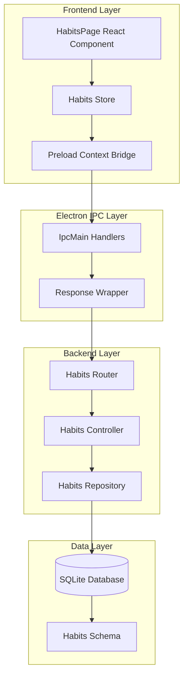
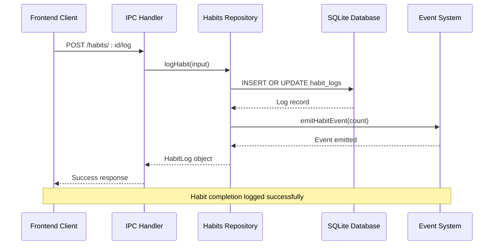
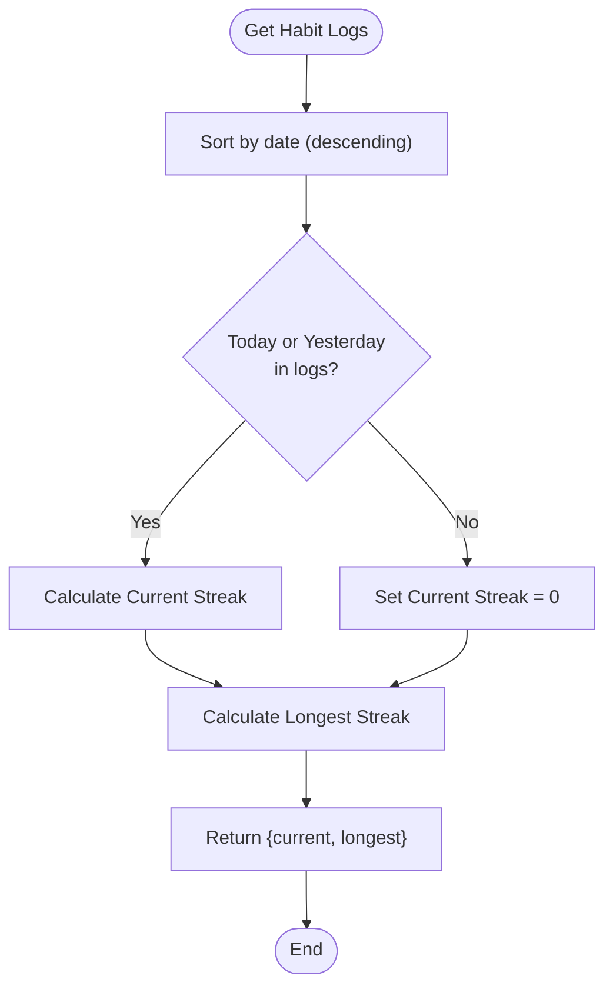
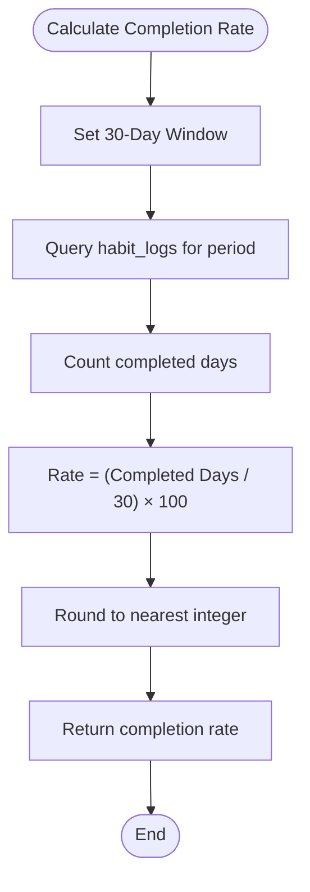
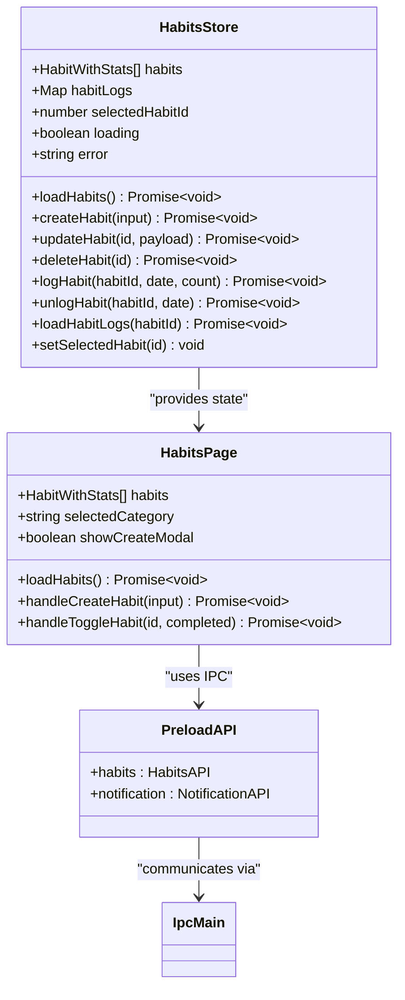
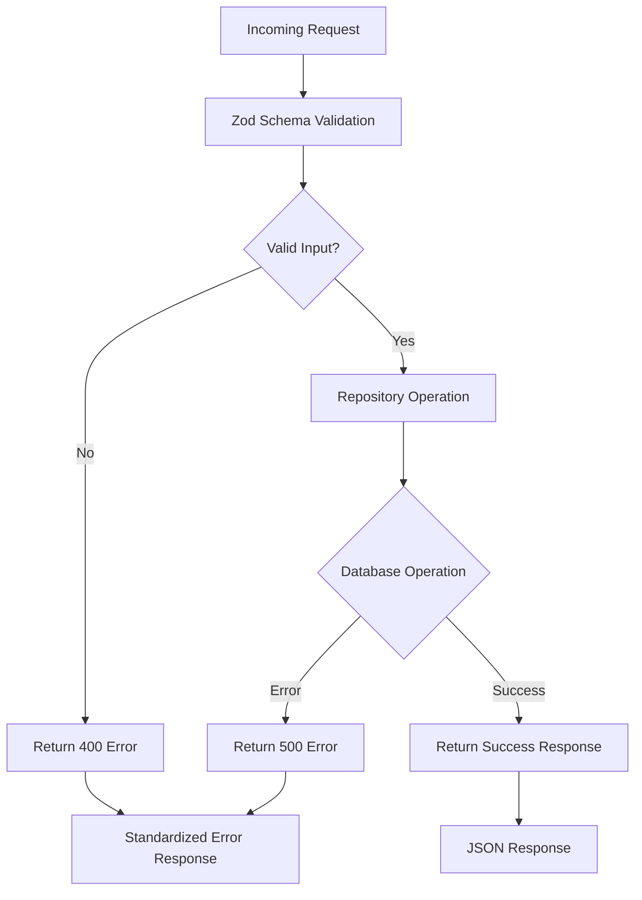

# Habits API Routes

<cite>
**Referenced Files in This Document**
- [src/server/routes/habits.ts](file://src/server/routes/habits.ts)
- [src/server/controllers/habitsController.ts](file://src/server/controllers/habitsController.ts)
- [src/database/habitsRepo.ts](file://src/database/habitsRepo.ts)
- [src/database/habitsSchema.ts](file://src/database/habitsSchema.ts)
- [src/renderer/pages/HabitsPage.tsx](file://src/renderer/pages/HabitsPage.tsx)
- [src/store/habits.ts](file://src/store/habits.ts)
- [src/main/ipc/habits.ts](file://src/main/ipc/habits.ts)
- [src/preload/index.ts](file://src/preload/index.ts)
- [src/common/types.ts](file://src/common/types.ts)
- [src/main/utils/response.ts](file://src/main/utils/response.ts)
</cite>

## Table of Contents
1. [Introduction](#introduction)
2. [API Architecture Overview](#api-architecture-overview)
3. [Route Endpoints](#route-endpoints)
4. [Data Contracts](#data-contracts)
5. [Habit Entity Structure](#habit-entity-structure)
6. [Habit Logging System](#habit-logging-system)
7. [Statistics and Analytics](#statistics-and-analytics)
8. [Frontend Integration](#frontend-integration)
9. [Error Handling](#error-handling)
10. [Usage Examples](#usage-examples)
11. [Common Error Cases](#common-error-cases)

## Introduction

The Habits API provides a comprehensive RESTful interface for managing personal habits within the LifeOS application. Built on Express.js and integrated with Electron's IPC system, it offers full CRUD operations for habit management, completion tracking, and statistical analysis. The API follows a layered architecture with clear separation between routing, controllers, repositories, and data persistence.

## API Architecture Overview

The Habits API follows a multi-layered architecture pattern that ensures clean separation of concerns and maintainable code structure.



**Diagram sources**
- [src/renderer/pages/HabitsPage.tsx](file://src/renderer/pages/HabitsPage.tsx#L1-L50)
- [src/store/habits.ts](file://src/store/habits.ts#L1-L30)
- [src/preload/index.ts](file://src/preload/index.ts#L1-L50)
- [src/main/ipc/habits.ts](file://src/main/ipc/habits.ts#L1-L30)
- [src/server/routes/habits.ts](file://src/server/routes/habits.ts#L1-L32)

**Section sources**
- [src/server/routes/habits.ts](file://src/server/routes/habits.ts#L1-L32)
- [src/server/controllers/habitsController.ts](file://src/server/controllers/habitsController.ts#L1-L132)
- [src/database/habitsRepo.ts](file://src/database/habitsRepo.ts#L1-L395)

## Route Endpoints

The Habits API exposes ten primary endpoints organized under the `/habits` route prefix. Each endpoint serves a specific purpose in the habit management lifecycle.

### Core CRUD Operations

| Endpoint | Method | Description | Parameters |
|----------|--------|-------------|------------|
| `/habits/create` | POST | Create a new habit | Habit creation payload |
| `/habits/:id` | GET | Retrieve a specific habit | Habit ID (path parameter) |
| `/habits/` | GET | List all habits | `includeArchived` query parameter |
| `/habits/:id` | PUT | Update an existing habit | Habit ID (path parameter) + update payload |
| `/habits/:id` | DELETE | Delete a habit | Habit ID (path parameter) |

### Habit Completion Management

| Endpoint | Method | Description | Parameters |
|----------|--------|-------------|------------|
| `/habits/:id/log` | POST | Log habit completion | Habit ID (path parameter) + log payload |
| `/habits/:id/log/:date` | DELETE | Remove habit completion | Habit ID (path parameter) + date (path parameter) |
| `/habits/:id/logs` | GET | Get habit completion logs | Habit ID (path parameter) + optional `limit` query parameter |

### Statistics and Status

| Endpoint | Method | Description | Parameters |
|----------|--------|-------------|------------|
| `/habits/status` | GET | Get overall habits status | None |

**Section sources**
- [src/server/routes/habits.ts](file://src/server/routes/habits.ts#L5-L31)

## Data Contracts

The Habits API uses structured data contracts defined through TypeScript interfaces and Zod validation schemas to ensure data integrity and type safety.

### Habit Creation Payload

```typescript
interface CreateHabitInput {
  name: string;           // Required, 1-200 characters
  description?: string;   // Optional, max 1000 characters
  icon?: string;         // Optional, max 30 characters
  color?: string;        // Optional, max 20 characters
  category?: string;     // Optional, max 50 characters
  frequency?: 'daily' | 'weekly' | 'monthly'; // Default: 'daily'
  targetCount?: number;  // Positive integer, default: 1
}
```

### Habit Update Payload

```typescript
interface UpdateHabitInput {
  id: number;            // Required, positive integer
  payload: {
    name?: string;
    description?: string | null;
    icon?: string | null;
    color?: string | null;
    category?: string | null;
    frequency?: 'daily' | 'weekly' | 'monthly';
    targetCount?: number;
    position?: number;
    archivedAt?: string | null;
  }
}
```

### Habit Log Payload

```typescript
interface HabitLogInput {
  habitId: number;       // Required, positive integer
  loggedDate: string;    // YYYY-MM-DD format
  count?: number;        // Positive integer, default: 1
  note?: string;         // Optional, max 500 characters
}
```

**Section sources**
- [src/database/habitsRepo.ts](file://src/database/habitsRepo.ts#L25-L50)
- [src/common/types.ts](file://src/common/types.ts#L1-L50)

## Habit Entity Structure

Habits are represented as structured entities with comprehensive metadata and calculated statistics. The entity model supports rich habit management capabilities.

### Core Habit Properties

| Property | Type | Description | Constraints |
|----------|------|-------------|-------------|
| `id` | number | Unique identifier | Auto-incremented |
| `name` | string | Habit display name | Required, 1-200 chars |
| `description` | string \| null | Extended description | Optional, max 1000 chars |
| `icon` | string \| null | Emoji or icon representation | Optional, max 30 chars |
| `color` | string \| null | Color theme identifier | Optional, max 20 chars |
| `category` | string \| null | Habit categorization | Optional, max 50 chars |
| `frequency` | 'daily' \| 'weekly' \| 'monthly' | Execution frequency | Required |
| `targetCount` | number | Target completion count | Positive integer |
| `position` | number | Display ordering | Integer |
| `archivedAt` | string \| null | Archive timestamp | ISO format or null |

### Calculated Statistics

| Property | Type | Description | Calculation Method |
|----------|------|-------------|-------------------|
| `createdAt` | string | Creation timestamp | Database auto-generated |
| `updatedAt` | string | Last modification timestamp | Database auto-updated |
| `currentStreak` | number | Current consecutive completion streak | Date continuity analysis |
| `longestStreak` | number | Maximum achieved streak | Historical record |
| `completionRate` | number | 30-day completion percentage | Percentage calculation |

### Dynamic Habit Properties

| Property | Type | Description | Purpose |
|----------|------|-------------|---------|
| `todayCompleted` | boolean | Whether habit was completed today | Real-time status |
| `todayCount` | number | Current count for today's completion | Progress tracking |

**Section sources**
- [src/database/habitsRepo.ts](file://src/database/habitsRepo.ts#L5-L25)
- [src/database/habitsRepo.ts](file://src/database/habitsRepo.ts#L140-L180)

## Habit Logging System

The habit logging system provides sophisticated completion tracking with support for multiple completion counts, notes, and automatic streak calculations.

### Logging Workflow



**Diagram sources**
- [src/main/ipc/habits.ts](file://src/main/ipc/habits.ts#L45-L55)
- [src/database/habitsRepo.ts](file://src/database/habitsRepo.ts#L320-L340)

### Log Persistence Strategy

The logging system uses SQLite's `ON CONFLICT` clause to handle multiple completions on the same day:

- **First Completion**: Creates new log entry
- **Subsequent Completions**: Updates existing entry with cumulative count
- **Atomic Operation**: Ensures data consistency during concurrent access

### Streak Calculation Algorithm

The streak calculation algorithm analyzes completion history to determine current and longest streaks:



**Diagram sources**
- [src/database/habitsRepo.ts](file://src/database/habitsRepo.ts#L55-L125)

**Section sources**
- [src/database/habitsRepo.ts](file://src/database/habitsRepo.ts#L55-L125)
- [src/database/habitsRepo.ts](file://src/database/habitsRepo.ts#L320-L350)

## Statistics and Analytics

The API provides comprehensive statistical analysis of habit performance and user engagement patterns.

### Global Habit Statistics

The `/habits/status` endpoint aggregates system-wide habit metrics:

| Metric | Type | Description | Calculation |
|--------|------|-------------|-------------|
| `total` | number | Total habit count | Count of all habits |
| `active` | number | Active habit count | Count of non-archived habits |
| `archived` | number | Archived habit count | Total - Active |
| `completedToday` | number | Habits completed today | Distinct habit IDs with today's logs |
| `avgCompletionRate` | number | Average 30-day completion rate | Mean of individual habit rates |
| `bestStreak` | number | Highest current streak | Maximum current streak among all habits |

### Individual Habit Analytics

Each habit includes detailed performance metrics:

| Statistic | Type | Description | Calculation |
|-----------|------|-------------|-------------|
| `currentStreak` | number | Consecutive completion days | Date continuity analysis |
| `longestStreak` | number | Maximum historical streak | Historical record |
| `completionRate` | number | 30-day completion percentage | (Completed days / 30) × 100 |
| `todayCompleted` | boolean | Today's completion status | Boolean flag |
| `todayCount` | number | Today's completion count | Current progress toward target |

### Completion Rate Calculation

The completion rate is calculated over a 30-day rolling window:



**Diagram sources**
- [src/database/habitsRepo.ts](file://src/database/habitsRepo.ts#L127-L140)

**Section sources**
- [src/server/controllers/habitsController.ts](file://src/server/controllers/habitsController.ts#L100-L131)
- [src/database/habitsRepo.ts](file://src/database/habitsRepo.ts#L370-L395)

## Frontend Integration

The Habits API integrates seamlessly with the React-based frontend through a comprehensive state management system and IPC communication layer.

### State Management Architecture



**Diagram sources**
- [src/store/habits.ts](file://src/store/habits.ts#L5-L25)
- [src/renderer/pages/HabitsPage.tsx](file://src/renderer/pages/HabitsPage.tsx#L100-L150)
- [src/preload/index.ts](file://src/preload/index.ts#L150-L200)

### IPC Communication Flow

The frontend communicates with the backend through Electron's IPC system:

1. **React Component** triggers actions via the Habits Store
2. **Store** makes IPC calls to the preload script
3. **Preload Script** invokes main process handlers
4. **Main Process** executes database operations
5. **Response** flows back through the chain with error handling

### Habit Management UI Integration

The HabitsPage component demonstrates comprehensive habit management:

- **Creation Modal**: Form-based habit creation with validation
- **Grid Layout**: Visual representation of habits with status indicators
- **Filtering**: Category-based habit filtering
- **Real-time Updates**: Automatic refresh after modifications
- **Statistics Display**: Overview cards showing key metrics

**Section sources**
- [src/renderer/pages/HabitsPage.tsx](file://src/renderer/pages/HabitsPage.tsx#L1-L299)
- [src/store/habits.ts](file://src/store/habits.ts#L1-L161)
- [src/preload/index.ts](file://src/preload/index.ts#L150-L200)

## Error Handling

The Habits API implements comprehensive error handling across all layers of the application stack.

### Error Response Structure

All API endpoints return standardized error responses:

```typescript
interface ErrorResponse {
  ok: false;
  error: string;
}
```

### Common Error Scenarios

| Error Type | HTTP Status | Description | Resolution |
|------------|-------------|-------------|------------|
| `NOT_FOUND` | 404 | Habit not found | Verify habit ID exists |
| `VALIDATION_ERROR` | 400 | Invalid input data | Check payload against schema |
| `DATABASE_ERROR` | 500 | Database operation failed | Retry operation |
| `CONFLICT` | 409 | Duplicate log entry | Use appropriate update strategy |

### Error Handling Stack



**Diagram sources**
- [src/main/utils/response.ts](file://src/main/utils/response.ts#L15-L35)
- [src/server/controllers/habitsController.ts](file://src/server/controllers/habitsController.ts#L5-L15)

### Frontend Error Handling

The frontend implements robust error handling through the Zustand store:

- **Loading States**: Prevent concurrent operations
- **Error Propagation**: Display user-friendly error messages
- **Automatic Recovery**: Retry mechanisms for transient failures
- **State Cleanup**: Reset error state after successful operations

**Section sources**
- [src/main/utils/response.ts](file://src/main/utils/response.ts#L15-L37)
- [src/store/habits.ts](file://src/store/habits.ts#L40-L80)

## Usage Examples

### Creating a New Habit

**Request:**
```http
POST /habits/create
Content-Type: application/json

{
  "name": "Morning Meditation",
  "description": "Practice mindfulness for 10 minutes",
  "icon": "🧘‍♂️",
  "color": "#65a30d",
  "category": "Health",
  "frequency": "daily",
  "targetCount": 1
}
```

**Response:**
```json
{
  "ok": true,
  "data": {
    "id": 1,
    "name": "Morning Meditation",
    "description": "Practice mindfulness for 10 minutes",
    "icon": "🧘‍♂️",
    "color": "#65a30d",
    "category": "Health",
    "frequency": "daily",
    "targetCount": 1,
    "position": 0,
    "archivedAt": null,
    "createdAt": "2024-01-15T08:00:00.000Z",
    "updatedAt": "2024-01-15T08:00:00.000Z",
    "currentStreak": 0,
    "longestStreak": 0,
    "completionRate": 0
  }
}
```

### Logging Habit Completion

**Request:**
```http
POST /habits/1/log
Content-Type: application/json

{
  "loggedDate": "2024-01-15",
  "count": 1,
  "note": "Felt refreshed after meditation"
}
```

**Response:**
```json
{
  "ok": true,
  "data": {
    "id": 101,
    "habitId": 1,
    "loggedDate": "2024-01-15",
    "count": 1,
    "note": "Felt refreshed after meditation",
    "createdAt": "2024-01-15T08:30:00.000Z"
  }
}
```

### Getting Habit Status

**Request:**
```http
GET /habits/status
```

**Response:**
```json
{
  "ok": true,
  "data": {
    "total": 5,
    "active": 4,
    "archived": 1,
    "completedToday": 3,
    "avgCompletionRate": 85,
    "bestStreak": 15,
    "habits": [
      {
        "id": 1,
        "name": "Morning Meditation",
        "frequency": "daily",
        "currentStreak": 15,
        "completionRate": 90,
        "todayCompleted": true
      }
    ]
  }
}
```

**Section sources**
- [src/server/controllers/habitsController.ts](file://src/server/controllers/habitsController.ts#L5-L25)
- [src/database/habitsRepo.ts](file://src/database/habitsRepo.ts#L200-L230)

## Common Error Cases

### Invalid Habit Name

**Request:**
```http
POST /habits/create
Content-Type: application/json

{
  "name": "",
  "frequency": "daily"
}
```

**Response:**
```json
{
  "ok": false,
  "error": "Validation failed: name must be at least 1 character(s)"
}
```

### Habit Not Found

**Request:**
```http
GET /habits/999
```

**Response:**
```json
{
  "ok": false,
  "error": "Habit not found"
}
```

### Invalid Date Format

**Request:**
```http
POST /habits/1/log
Content-Type: application/json

{
  "loggedDate": "15-01-2024",
  "count": 1
}
```

**Response:**
```json
{
  "ok": false,
  "error": "Validation failed: loggedDate must match the pattern ^\\d{4}-\\d{2}-\\d{2}$"
}
```

### Database Connection Issues

When the database is unavailable, the system returns graceful fallback responses:

**Response:**
```json
{
  "ok": true,
  "data": []
}
```

### Concurrent Modification Conflicts

While the API handles most conflicts internally (like duplicate logs), explicit conflict scenarios require careful handling:

**Response:**
```json
{
  "ok": false,
  "error": "Habit log not found for unlog operation"
}
```

**Section sources**
- [src/database/habitsRepo.ts](file://src/database/habitsRepo.ts#L25-L50)
- [src/main/utils/response.ts](file://src/main/utils/response.ts#L20-L37)