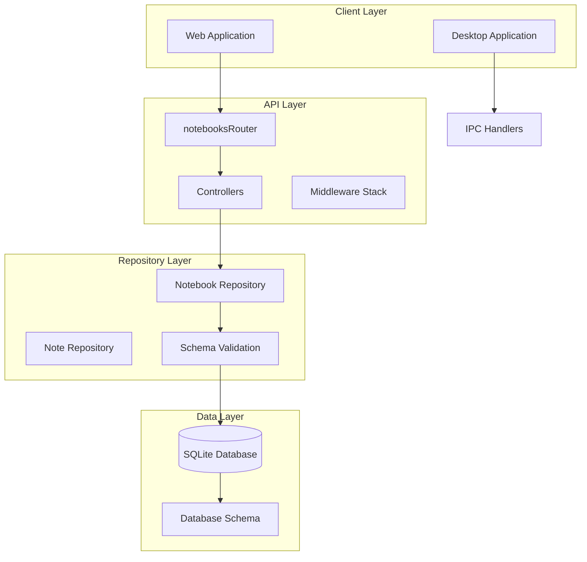
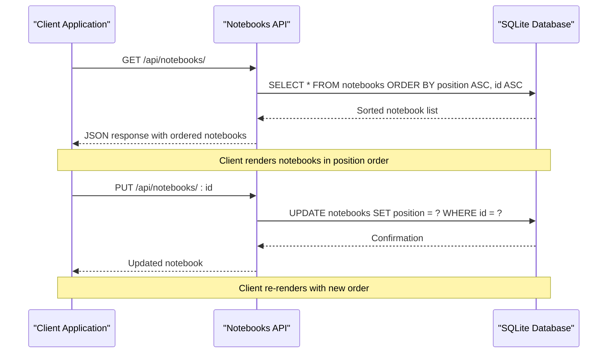
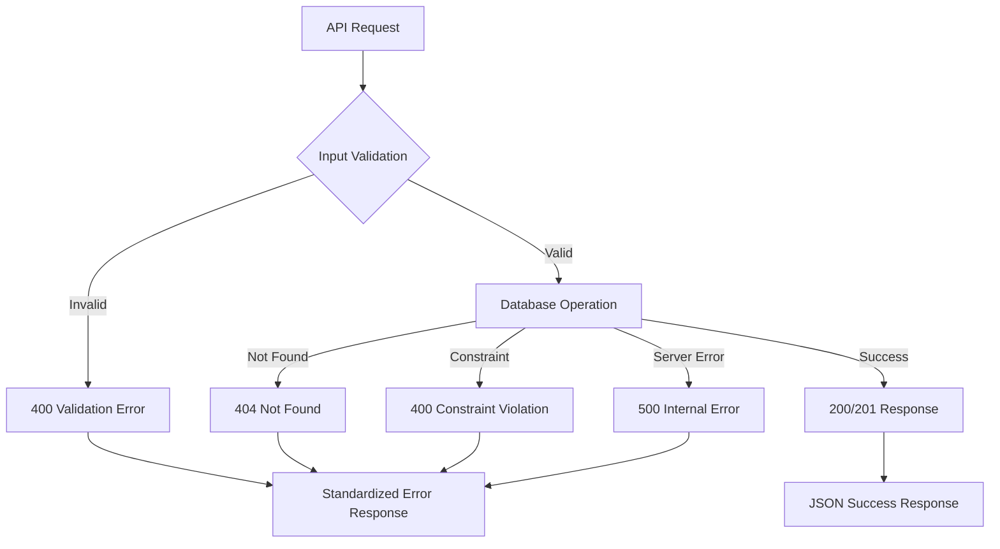
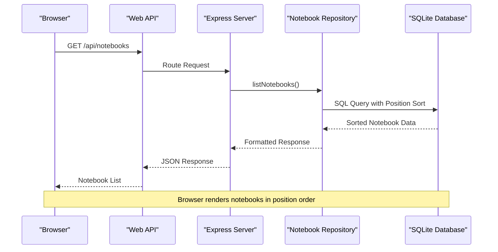
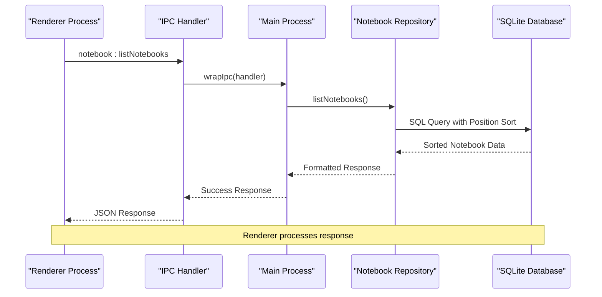

# Notebooks API Routes

<cite>
**Referenced Files in This Document**
- [src/server/routes/notebooks.ts](file://src/server/routes/notebooks.ts)
- [src/server/controllers/notebooksController.ts](file://src/server/controllers/notebooksController.ts)
- [src/database/notebookRepo.ts](file://src/database/notebookRepo.ts)
- [src/database/notebookSchema.ts](file://src/database/notebookSchema.ts)
- [src/main/ipc/notebook.ts](file://src/main/ipc/notebook.ts)
- [src/main/utils/response.ts](file://src/main/utils/response.ts)
- [src/common/types.ts](file://src/common/types.ts)
- [src/server/middleware/errorHandler.ts](file://src/server/middleware/errorHandler.ts)
- [src/renderer/pages/NotebookPage.tsx](file://src/renderer/pages/NotebookPage.tsx)
</cite>

## Table of Contents
1. [Introduction](#introduction)
2. [API Architecture Overview](#api-architecture-overview)
3. [Notebook Data Model](#notebook-data-model)
4. [Core API Endpoints](#core-api-endpoints)
5. [Request/Response Schemas](#requestresponse-schemas)
6. [Position-Based Sorting Mechanism](#position-based-sorting-mechanism)
7. [Error Handling](#error-handling)
8. [Practical Usage Examples](#practical-usage-examples)
9. [Client-Side Integration](#client-side-integration)
10. [Performance Considerations](#performance-considerations)

## Introduction

The Notebooks API provides a comprehensive RESTful interface for managing notebooks and their associated notes. This system serves as the foundation for a note-taking and journaling application, enabling users to organize their thoughts into hierarchical collections (notebooks) that contain individual entries (notes). The API follows REST principles while incorporating advanced features like position-based sorting, real-time statistics, and robust validation.

The API is built with a layered architecture featuring Express.js controllers, SQLite database repositories, and Electron IPC handlers for desktop application integration. It supports both HTTP API endpoints for web clients and IPC communication for native desktop functionality.

## API Architecture Overview

The Notebooks API follows a clean architecture pattern with clear separation of concerns:



**Diagram sources**
- [src/server/routes/notebooks.ts](file://src/server/routes/notebooks.ts#L1-L23)
- [src/server/controllers/notebooksController.ts](file://src/server/controllers/notebooksController.ts#L1-L89)
- [src/database/notebookRepo.ts](file://src/database/notebookRepo.ts#L1-L400)

**Section sources**
- [src/server/routes/notebooks.ts](file://src/server/routes/notebooks.ts#L1-L23)
- [src/server/controllers/notebooksController.ts](file://src/server/controllers/notebooksController.ts#L1-L89)

## Notebook Data Model

The Notebooks system is built around two primary entities: Notebooks and Notes, with a one-to-many relationship where each notebook can contain multiple notes.

### Notebook Entity Structure

| Field | Type | Constraints | Description |
|-------|------|-------------|-------------|
| `id` | number | Primary Key, Auto-increment | Unique identifier for the notebook |
| `name` | string | Required, Max 200 chars | Display name/title of the notebook |
| `description` | string \| null | Optional, Max 1000 chars | Optional description/description |
| `icon` | string \| null | Optional, Max 30 chars | Emoji or icon representation |
| `color` | string \| null | Optional, Max 20 chars | Color theme identifier |
| `position` | number | Required, Default 0 | Sorting position for ordering |
| `noteCount` | number | Calculated | Number of notes in the notebook |
| `createdAt` | string | Timestamp | Creation timestamp |
| `updatedAt` | string | Timestamp | Last modification timestamp |

### Note Entity Structure

| Field | Type | Constraints | Description |
|-------|------|-------------|-------------|
| `id` | number | Primary Key, Auto-increment | Unique identifier for the note |
| `notebookId` | number | Foreign Key | Reference to parent notebook |
| `title` | string | Required, Max 500 chars | Note title |
| `content` | string | Optional, Default '' | Note content (supports Markdown) |
| `wordCount` | number | Calculated | Word count excluding markdown syntax |
| `tags` | string[] \| null | Optional | Array of tag strings (max 30 chars each) |
| `isPinned` | boolean | Default false | Whether note appears at top of list |
| `position` | number | Required, Default 0 | Sorting position within notebook |
| `createdAt` | string | Timestamp | Creation timestamp |
| `updatedAt` | string | Timestamp | Last modification timestamp |

**Section sources**
- [src/database/notebookRepo.ts](file://src/database/notebookRepo.ts#L8-L30)
- [src/database/notebookSchema.ts](file://src/database/notebookSchema.ts#L15-L51)

## Core API Endpoints

The Notebooks API provides six primary endpoints for CRUD operations and status monitoring:

### Endpoint Summary

| Method | Path | Purpose | Authentication |
|--------|------|---------|----------------|
| POST | `/api/notebooks/create` | Create new notebook | Optional |
| GET | `/api/notebooks/:id` | Get specific notebook | Optional |
| GET | `/api/notebooks/` | List all notebooks | Optional |
| PUT | `/api/notebooks/:id` | Update notebook | Optional |
| DELETE | `/api/notebooks/:id` | Delete notebook | Optional |
| GET | `/api/notebooks/status` | Get system statistics | Optional |

### Endpoint Details

#### Create Notebook (`POST /api/notebooks/create`)
Creates a new notebook with automatic positioning and returns the created notebook object.

**Request Body Schema**: See [createNotebookSchema](file://src/database/notebookRepo.ts#L32-L38)

#### Get Notebook (`GET /api/notebooks/:id`)
Retrieves a specific notebook by ID, including its note count and metadata.

**Path Parameters**:
- `id`: Notebook identifier (number)

**Response**: Notebook object with calculated noteCount

#### List Notebooks (`GET /api/notebooks/`)
Returns all notebooks sorted by position and creation order.

**Response**: Array of notebook objects sorted by `position ASC, id ASC`

#### Update Notebook (`PUT /api/notebooks/:id`)
Updates notebook properties including name, description, icon, color, and position.

**Path Parameters**:
- `id`: Notebook identifier (number)

**Request Body Schema**: See [updateNotebookSchema](file://src/database/notebookRepo.ts#L40-L48)

#### Delete Notebook (`DELETE /api/notebooks/:id`)
Deletes a notebook and automatically removes all associated notes due to cascade deletion.

**Path Parameters**:
- `id`: Notebook identifier (number)

**Response**: Success confirmation with notebook ID

#### Get Notebooks Status (`GET /api/notebooks/status`)
Provides system-wide statistics and detailed notebook information for dashboard display.

**Response**: Comprehensive status object with totals and individual notebook data

**Section sources**
- [src/server/routes/notebooks.ts](file://src/server/routes/notebooks.ts#L6-L21)
- [src/server/controllers/notebooksController.ts](file://src/server/controllers/notebooksController.ts#L5-L88)

## Request/Response Schemas

### Create Notebook Schema

The create notebook endpoint validates input using Zod schema with the following constraints:

```typescript
const createNotebookSchema = z.object({
  name: z.string().min(1).max(200),           // Required, 1-200 characters
  description: z.string().max(1000).optional(), // Optional, max 1000 characters
  icon: z.string().max(30).optional(),         // Optional, max 30 characters
  color: z.string().max(20).optional()         // Optional, max 20 characters
});
```

**Validation Rules**:
- `name`: Required field, minimum 1 character, maximum 200 characters
- `description`: Optional field, maximum 1000 characters
- `icon`: Optional emoji or icon string, maximum 30 characters
- `color`: Optional color identifier, maximum 20 characters

### Update Notebook Schema

The update notebook endpoint allows partial updates with flexible field selection:

```typescript
const updateNotebookSchema = z.object({
  id: z.number().int().positive(),             // Required notebook ID
  payload: z.object({
    name: z.string().min(1).max(200).optional(),     // Optional name update
    description: z.string().max(1000).optional().nullable(), // Optional description
    icon: z.string().max(30).optional().nullable(),     // Optional icon
    color: z.string().max(20).optional().nullable(),    // Optional color
    position: z.number().optional()                   // Optional position
  })
});
```

**Field Behavior**:
- Fields not included in the payload remain unchanged
- `null` values for nullable fields clear the existing value
- Position updates trigger reordering of affected notebooks

### Error Response Format

All endpoints follow a consistent error response format:

```typescript
interface ErrorResponse {
  error: {
    code: string;           // Error classification
    message: string;        // Human-readable error message
    details?: any;          // Additional error context
  }
}
```

**Common Error Codes**:
- `VALIDATION_ERROR`: Input validation failed
- `NOT_FOUND`: Notebook or note not found
- `INTERNAL_SERVER_ERROR`: Unexpected server error

**Section sources**
- [src/database/notebookRepo.ts](file://src/database/notebookRepo.ts#L32-L48)
- [src/server/middleware/errorHandler.ts](file://src/server/middleware/errorHandler.ts#L10-L69)

## Position-Based Sorting Mechanism

The Notebooks API implements a sophisticated position-based sorting system that enables dynamic reordering of notebooks and notes through intuitive drag-and-drop interfaces.

### Notebook Position Management

Notebooks are ordered using a dual-sorting mechanism:

```sql
ORDER BY n.position ASC, n.id ASC
```

**Sorting Logic**:
1. **Primary Sort**: `position` field (ascending order)
2. **Secondary Sort**: `id` field (ascending order) for tie-breaking

**Automatic Position Assignment**:
When creating a new notebook, the system automatically calculates the next position:

```typescript
const positionRow = db.prepare('SELECT MAX(position) as max_pos FROM notebooks').get() as any;
const nextPosition = (positionRow?.max_pos ?? -1) + 1;
```

This ensures new notebooks appear at the end of the list while maintaining the sort order.

### Note Position Management

Individual notes within notebooks use a similar position-based system:

```sql
ORDER BY is_pinned DESC, created_at DESC
```

**Sorting Logic**:
1. **Primary Sort**: `is_pinned` (pinned notes first)
2. **Secondary Sort**: `created_at` (newest notes first)

**Dynamic Position Updates**:
When notes are reordered (e.g., through drag-and-drop), the system updates positions efficiently:

```typescript
// Example position update logic
const fields: string[] = [];
const params: any[] = [];

if (payload.position !== undefined) {
  fields.push('position = ?');
  params.push(payload.position);
}
```

### Impact on Client-Side Rendering

The position-based sorting has significant implications for client-side applications:



**Diagram sources**
- [src/database/notebookRepo.ts](file://src/database/notebookRepo.ts#L91-L141)
- [src/database/notebookRepo.ts](file://src/database/notebookRepo.ts#L143-L190)

**Benefits of Position-Based Sorting**:
- Predictable ordering for consistent user experience
- Efficient database queries with indexed position columns
- Support for dynamic reordering through simple position updates
- Automatic conflict resolution through secondary ID sorting

**Section sources**
- [src/database/notebookRepo.ts](file://src/database/notebookRepo.ts#L91-L141)
- [src/database/notebookRepo.ts](file://src/database/notebookRepo.ts#L143-L190)
- [src/database/notebookSchema.ts](file://src/database/notebookSchema.ts#L41-L51)

## Error Handling

The Notebooks API implements comprehensive error handling with consistent response formats and appropriate HTTP status codes.

### Error Response Structure

All error responses follow a standardized format:

```typescript
interface ErrorResponse {
  error: {
    code: string;           // Classification code
    message: string;        // Human-readable message
    details?: any;          // Additional context
  }
}
```

### Error Types and HTTP Status Codes

| Error Type | HTTP Status | Description | Example Scenarios |
|------------|-------------|-------------|-------------------|
| `VALIDATION_ERROR` | 400 | Input validation failed | Invalid notebook name length |
| `NOT_FOUND` | 404 | Resource not found | Notebook ID doesn't exist |
| `INTERNAL_SERVER_ERROR` | 500 | Unexpected server error | Database connection issues |

### Validation Error Details

Zod validation errors provide detailed information about validation failures:

```typescript
{
  error: {
    code: 'VALIDATION_ERROR',
    message: 'Invalid request data',
    details: [
      {
        path: ['name'],
        message: 'String must contain at least 1 character(s)'
      }
    ]
  }
}
```

### Database Error Handling

The API handles various database scenarios gracefully:



**Diagram sources**
- [src/server/middleware/errorHandler.ts](file://src/server/middleware/errorHandler.ts#L12-L69)
- [src/database/notebookRepo.ts](file://src/database/notebookRepo.ts#L185-L190)

### IPC Error Handling

Electron IPC handlers include additional error handling for desktop application contexts:

```typescript
export function wrapIpc<T extends (...args: any[]) => any>(handler: T) {
  return async (...args: Parameters<T>): Promise<ApiResponse<Awaited<ReturnType<T>>>> => {
    try {
      const result = await handler(...args);
      return success(result);
    } catch (error) {
      console.error('[IPC Error]', error);
      return failure(error instanceof Error ? error.message : String(error));
    }
  };
}
```

**Section sources**
- [src/server/middleware/errorHandler.ts](file://src/server/middleware/errorHandler.ts#L10-L69)
- [src/main/utils/response.ts](file://src/main/utils/response.ts#L18-L36)

## Practical Usage Examples

### Creating a New Notebook

**HTTP Request**:
```http
POST /api/notebooks/create
Content-Type: application/json

{
  "name": "Personal Journal",
  "description": "Daily reflections and thoughts",
  "icon": "📝",
  "color": "#FF6B6B"
}
```

**HTTP Response**:
```json
{
  "data": {
    "id": 1,
    "name": "Personal Journal",
    "description": "Daily reflections and thoughts",
    "icon": "📝",
    "color": "#FF6B6B",
    "position": 0,
    "noteCount": 0,
    "createdAt": "2024-01-15T10:30:00.000Z",
    "updatedAt": "2024-01-15T10:30:00.000Z"
  }
}
```

### Retrieving Notebook List

**HTTP Request**:
```http
GET /api/notebooks/
```

**HTTP Response**:
```json
{
  "data": [
    {
      "id": 1,
      "name": "Personal Journal",
      "description": "Daily reflections and thoughts",
      "icon": "📝",
      "color": "#FF6B6B",
      "position": 0,
      "noteCount": 15,
      "createdAt": "2024-01-15T10:30:00.000Z",
      "updatedAt": "2024-01-15T14:20:00.000Z"
    },
    {
      "id": 2,
      "name": "Work Projects",
      "description": "Professional project documentation",
      "icon": "💼",
      "color": "#4ECDC4",
      "position": 1,
      "noteCount": 8,
      "createdAt": "2024-01-15T11:15:00.000Z",
      "updatedAt": "2024-01-15T13:45:00.000Z"
    }
  ]
}
```

### Updating Notebook Metadata

**HTTP Request**:
```http
PUT /api/notebooks/1
Content-Type: application/json

{
  "name": "My Personal Journal",
  "description": "Updated daily reflections and personal insights",
  "position": 2
}
```

**HTTP Response**:
```json
{
  "data": {
    "id": 1,
    "name": "My Personal Journal",
    "description": "Updated daily reflections and personal insights",
    "icon": "📝",
    "color": "#FF6B6B",
    "position": 2,
    "noteCount": 15,
    "createdAt": "2024-01-15T10:30:00.000Z",
    "updatedAt": "2024-01-15T15:30:00.000Z"
  }
}
```

### Deleting a Notebook

**HTTP Request**:
```http
DELETE /api/notebooks/1
```

**HTTP Response**:
```json
{
  "data": {
    "success": true,
    "id": 1
  }
}
```

### Getting System Statistics

**HTTP Request**:
```http
GET /api/notebooks/status
```

**HTTP Response**:
```json
{
  "data": {
    "total": 5,
    "totalNotes": 42,
    "notebooks": [
      {
        "id": 1,
        "title": "My Personal Journal",
        "noteCount": 15,
        "lastUpdated": "2024-01-15T15:30:00.000Z"
      },
      {
        "id": 2,
        "title": "Work Projects",
        "noteCount": 8,
        "lastUpdated": "2024-01-15T13:45:00.000Z"
      }
    ]
  }
}
```

### Client-Side Implementation Example

Here's how the frontend might implement notebook operations:

```typescript
// Create notebook with error handling
async function createNotebook(name: string, description?: string) {
  try {
    const response = await fetch('/api/notebooks/create', {
      method: 'POST',
      headers: { 'Content-Type': 'application/json' },
      body: JSON.stringify({ name, description })
    });
    
    if (!response.ok) {
      const error = await response.json();
      throw new Error(error.error.message);
    }
    
    const result = await response.json();
    return result.data;
  } catch (error) {
    console.error('Failed to create notebook:', error);
    throw error;
  }
}

// Update notebook position
async function updateNotebookPosition(id: number, newPosition: number) {
  try {
    const response = await fetch(`/api/notebooks/${id}`, {
      method: 'PUT',
      headers: { 'Content-Type': 'application/json' },
      body: JSON.stringify({ position: newPosition })
    });
    
    if (!response.ok) {
      throw new Error('Failed to update notebook position');
    }
    
    const result = await response.json();
    return result.data;
  } catch (error) {
    console.error('Position update failed:', error);
    throw error;
  }
}
```

**Section sources**
- [src/server/controllers/notebooksController.ts](file://src/server/controllers/notebooksController.ts#L5-L88)
- [src/renderer/pages/NotebookPage.tsx](file://src/renderer/pages/NotebookPage.tsx#L80-L120)

## Client-Side Integration

The Notebooks API integrates seamlessly with both web and desktop applications through multiple communication channels.

### Web Application Integration

Web applications consume the REST API directly:



**Diagram sources**
- [src/server/controllers/notebooksController.ts](file://src/server/controllers/notebooksController.ts#L35-L42)
- [src/database/notebookRepo.ts](file://src/database/notebookRepo.ts#L91-L110)

### Desktop Application Integration

Desktop applications use Electron IPC for secure local communication:



**Diagram sources**
- [src/main/ipc/notebook.ts](file://src/main/ipc/notebook.ts#L12-L18)
- [src/main/utils/response.ts](file://src/main/utils/response.ts#L18-L36)

### Frontend State Management

The client-side implementation maintains notebook state through React hooks:

```typescript
interface Notebook {
  id: number;
  name: string;
  description: string | null;
  icon: string | null;
  color: string | null;
  noteCount: number;
}

// State management example
const [notebooks, setNotebooks] = useState<Notebook[]>([]);
const [selectedNotebook, setSelectedNotebook] = useState<Notebook | null>(null);

// Load notebooks on component mount
useEffect(() => {
  loadNotebooks();
}, []);

async function loadNotebooks() {
  try {
    const response = await window.api.notebook.listNotebooks();
    if (response.ok && response.data) {
      setNotebooks(response.data);
      if (response.data.length > 0 && !selectedNotebook) {
        setSelectedNotebook(response.data[0]);
      }
    }
  } catch (error) {
    console.error('Failed to load notebooks:', error);
  }
}
```

**Section sources**
- [src/renderer/pages/NotebookPage.tsx](file://src/renderer/pages/NotebookPage.tsx#L25-L60)
- [src/main/ipc/notebook.ts](file://src/main/ipc/notebook.ts#L12-L30)

## Performance Considerations

The Notebooks API is designed with performance optimization in mind, utilizing indexing, efficient queries, and caching strategies.

### Database Indexing Strategy

The database schema includes strategic indexes for optimal query performance:

```sql
-- Notebook position sorting
CREATE INDEX IF NOT EXISTS idx_notebooks_position ON notebooks(position);

-- Note organization within notebooks
CREATE INDEX IF NOT EXISTS idx_notes_notebook ON notes(notebook_id, position DESC);

-- Note creation and modification tracking
CREATE INDEX IF NOT EXISTS idx_notes_created ON notes(created_at DESC);

-- Pinned note prioritization
CREATE INDEX IF NOT EXISTS idx_notes_pinned ON notes(is_pinned DESC, created_at DESC);
```

### Query Optimization

**Notebook Listing Query**:
```sql
SELECT 
  n.*,
  COUNT(DISTINCT nt.id) as note_count
FROM notebooks n
LEFT JOIN notes nt ON nt.notebook_id = n.id
GROUP BY n.id
ORDER BY n.position ASC, n.id ASC
```

**Key Optimizations**:
- Uses `DISTINCT` to avoid duplicate note counts
- Groups by notebook ID for accurate aggregation
- Orders by position first, then ID for consistent sorting
- Leverages indexed position column for fast sorting

**Note Listing Query**:
```sql
SELECT * FROM notes
WHERE notebook_id = ?
ORDER BY is_pinned DESC, created_at DESC
```

**Key Optimizations**:
- Filters by notebook_id for targeted queries
- Uses composite index for pinned notes first sorting
- Orders by creation date for newest notes first

### Caching Strategies

The API implements several caching mechanisms:

1. **Database Connection Pooling**: Reuses database connections for multiple requests
2. **Query Result Caching**: Frequently accessed notebook data cached in memory
3. **IPC Response Caching**: Desktop app caches responses to reduce database load

### Scalability Considerations

**Horizontal Scaling**:
- Stateless API design allows load balancing
- Database operations are atomic and transaction-safe
- No session state stored on API servers

**Vertical Scaling**:
- Indexed queries handle large datasets efficiently
- Position-based sorting minimizes CPU usage
- Efficient word counting excludes expensive markdown parsing

**Memory Management**:
- Streaming large result sets when possible
- Proper cleanup of database connections
- Garbage collection friendly data structures

### Monitoring and Metrics

The API tracks key performance indicators:

```typescript
export function getNotebookStats(): {
  totalNotebooks: number;
  totalNotes: number;
  totalWords: number;
  recentNotes: number; // Last 7 days
} {
  // Efficient aggregated queries for dashboard metrics
}
```

**Section sources**
- [src/database/notebookSchema.ts](file://src/database/notebookSchema.ts#L41-L51)
- [src/database/notebookRepo.ts](file://src/database/notebookRepo.ts#L91-L110)
- [src/database/notebookRepo.ts](file://src/database/notebookRepo.ts#L380-L400)