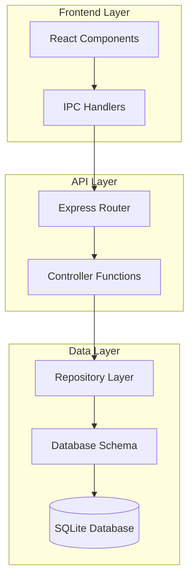
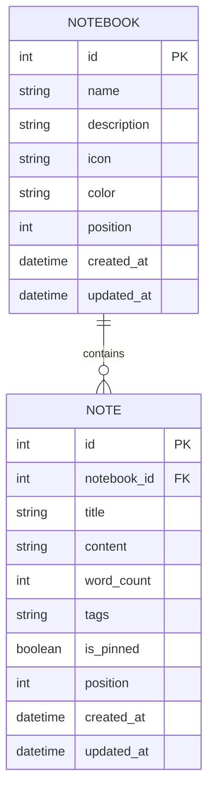
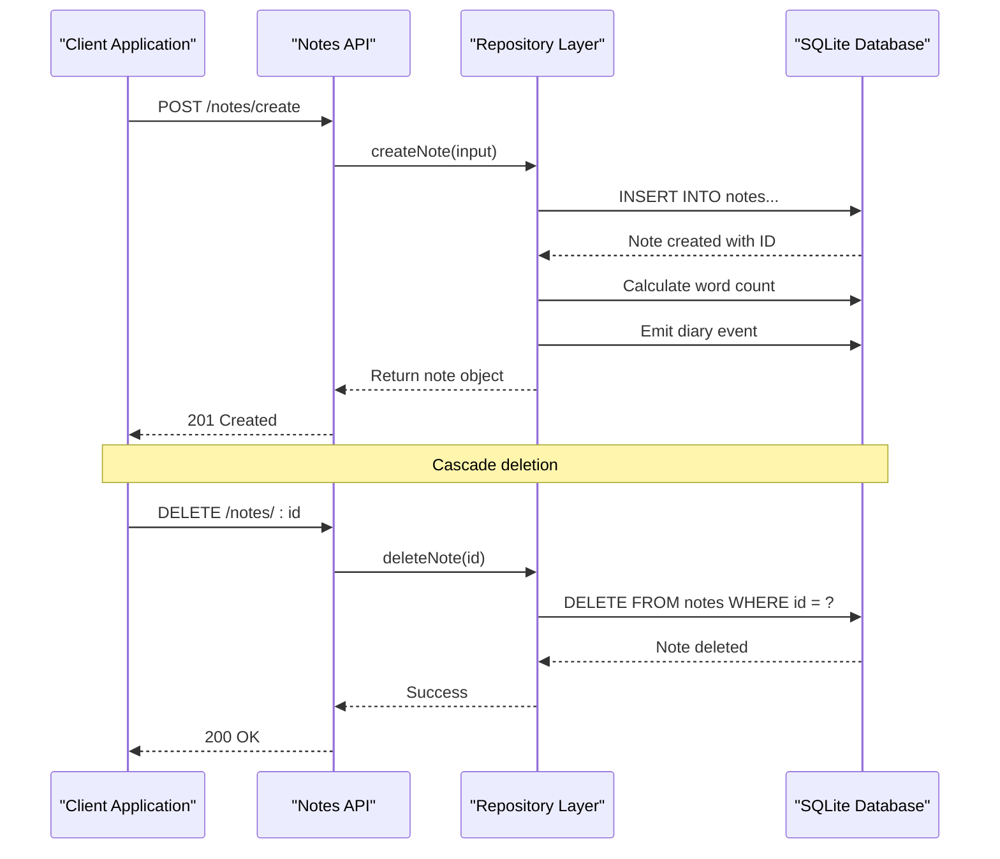
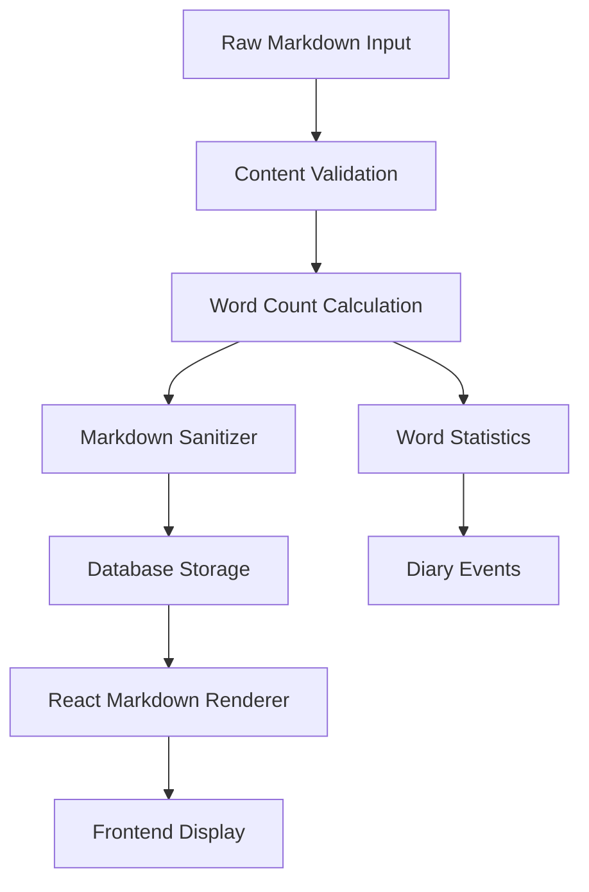
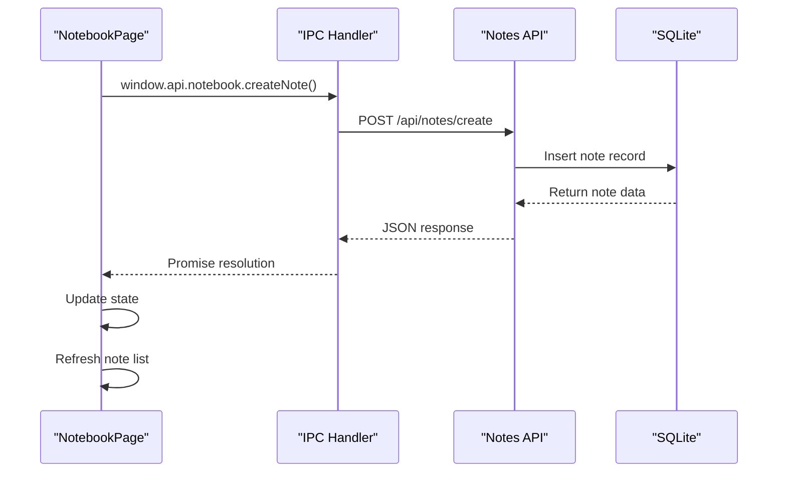

# Notes API Routes Documentation

<cite>
**Referenced Files in This Document**
- [notes.ts](file://src/server/routes/notes.ts)
- [notesController.ts](file://src/server/controllers/notesController.ts)
- [notebookRepo.ts](file://src/database/notebookRepo.ts)
- [notebookSchema.ts](file://src/database/notebookSchema.ts)
- [NotebookPage.tsx](file://src/renderer/pages/NotebookPage.tsx)
- [notebook.ts](file://src/main/ipc/notebook.ts)
- [types.ts](file://src/common/types.ts)
</cite>

## Table of Contents
1. [Introduction](#introduction)
2. [API Architecture Overview](#api-architecture-overview)
3. [Data Model](#data-model)
4. [Route Endpoints](#route-endpoints)
5. [Notebook-Native Relationship](#notebook-native-relationship)
6. [Rich Text Content Support](#rich-text-content-support)
7. [Validation and Error Handling](#validation-and-error-handling)
8. [Frontend Integration](#frontend-integration)
9. [Performance Considerations](#performance-considerations)
10. [Troubleshooting Guide](#troubleshooting-guide)

## Introduction

The Notes API provides a comprehensive RESTful interface for managing notes within notebooks in the LifeOS productivity suite. Built with Express.js and backed by SQLite, this API supports rich text content creation, editing, searching, and organization through a hierarchical notebook structure. The API follows REST principles and integrates seamlessly with the React-based frontend through Electron's IPC communication layer.

## API Architecture Overview

The Notes API follows a layered architecture pattern with clear separation of concerns:



**Diagram sources**
- [notes.ts](file://src/server/routes/notes.ts#L1-L26)
- [notesController.ts](file://src/server/controllers/notesController.ts#L1-L120)
- [notebookRepo.ts](file://src/database/notebookRepo.ts#L1-L400)

**Section sources**
- [notes.ts](file://src/server/routes/notes.ts#L1-L26)
- [notesController.ts](file://src/server/controllers/notesController.ts#L1-L120)

## Data Model

### Note Entity Structure

The Note entity represents individual entries within notebooks and contains the following fields:

| Field | Type | Description | Constraints |
|-------|------|-------------|-------------|
| `id` | Number | Unique identifier | Auto-generated, Primary Key |
| `notebookId` | Number | Foreign key to notebook | Required, Positive integer |
| `title` | String | Note title | Required, Min 1 char, Max 500 chars |
| `content` | String | Note content | Optional, Default empty string |
| `wordCount` | Number | Calculated word count | Auto-calculated |
| `tags` | Array\<String\> | Associated tags | Optional, Max 30 chars each |
| `isPinned` | Boolean | Pin status | Default false |
| `position` | Number | Sort order | Auto-generated |
| `createdAt` | String | Creation timestamp | ISO format |
| `updatedAt` | String | Last update timestamp | ISO format |

### Notebook-Native Relationship

Notes are organized within notebooks through a foreign key relationship:



**Diagram sources**
- [notebookSchema.ts](file://src/database/notebookSchema.ts#L15-L35)
- [notebookRepo.ts](file://src/database/notebookRepo.ts#L18-L30)

**Section sources**
- [notebookRepo.ts](file://src/database/notebookRepo.ts#L18-L30)
- [notebookSchema.ts](file://src/database/notebookSchema.ts#L15-L35)

## Route Endpoints

### 1. Create Note

**Endpoint:** `POST /api/notes/create`

Creates a new note within a specified notebook.

**HTTP Method:** POST  
**URL Parameters:** None  
**Request Body:**
```json
{
  "notebookId": 1,
  "title": "Meeting Notes",
  "content": "# Agenda\n\n1. Discuss project timeline\n2. Review budget allocation\n3. Plan marketing strategy",
  "tags": ["meeting", "work", "planning"]
}
```

**Response:**
```json
{
  "data": {
    "id": 123,
    "notebookId": 1,
    "title": "Meeting Notes",
    "content": "# Agenda...",
    "wordCount": 25,
    "tags": ["meeting", "work", "planning"],
    "isPinned": false,
    "position": 0,
    "createdAt": "2024-01-15T10:30:00.000Z",
    "updatedAt": "2024-01-15T10:30:00.000Z"
  }
}
```

### 2. Get Note by ID

**Endpoint:** `GET /api/notes/:id`

Retrieves a specific note by its ID.

**HTTP Method:** GET  
**URL Parameters:** `id` (Number) - Note identifier  
**Request Body:** None  

**Response:**
```json
{
  "data": {
    "id": 123,
    "notebookId": 1,
    "title": "Meeting Notes",
    "content": "# Agenda...",
    "wordCount": 25,
    "tags": ["meeting", "work", "planning"],
    "isPinned": false,
    "position": 0,
    "createdAt": "2024-01-15T10:30:00.000Z",
    "updatedAt": "2024-01-15T10:30:00.000Z"
  }
}
```

**Error Response (404):**
```json
{
  "error": {
    "code": "NOT_FOUND",
    "message": "Note not found"
  }
}
```

### 3. List Notes by Notebook

**Endpoint:** `GET /api/notes/notebook/:notebookId`

Retrieves all notes within a specific notebook, ordered by pin status and creation date.

**HTTP Method:** GET  
**URL Parameters:** `notebookId` (Number) - Notebook identifier  
**Request Body:** None  

**Response:**
```json
{
  "data": [
    {
      "id": 123,
      "notebookId": 1,
      "title": "Important Meeting Notes",
      "content": "# Agenda...",
      "wordCount": 25,
      "tags": ["meeting", "work"],
      "isPinned": true,
      "position": 0,
      "createdAt": "2024-01-15T10:30:00.000Z",
      "updatedAt": "2024-01-15T10:30:00.000Z"
    },
    {
      "id": 124,
      "notebookId": 1,
      "title": "Random Thoughts",
      "content": "Just some ideas...",
      "wordCount": 15,
      "tags": null,
      "isPinned": false,
      "position": 1,
      "createdAt": "2024-01-15T11:00:00.000Z",
      "updatedAt": "2024-01-15T11:00:00.000Z"
    }
  ]
}
```

### 4. Update Note

**Endpoint:** `PUT /api/notes/:id`

Updates an existing note's properties.

**HTTP Method:** PUT  
**URL Parameters:** `id` (Number) - Note identifier  
**Request Body:**
```json
{
  "title": "Updated Meeting Notes",
  "content": "# Revised Agenda\n\n1. Discuss project timeline\n2. Review budget allocation\n3. Plan marketing strategy",
  "tags": ["meeting", "work", "updated"],
  "isPinned": true
}
```

**Response:**
```json
{
  "data": {
    "id": 123,
    "notebookId": 1,
    "title": "Updated Meeting Notes",
    "content": "# Revised Agenda...",
    "wordCount": 28,
    "tags": ["meeting", "work", "updated"],
    "isPinned": true,
    "position": 0,
    "createdAt": "2024-01-15T10:30:00.000Z",
    "updatedAt": "2024-01-15T11:30:00.000Z"
  }
}
```

### 5. Delete Note

**Endpoint:** `DELETE /api/notes/:id`

Deletes a note by its ID.

**HTTP Method:** DELETE  
**URL Parameters:** `id` (Number) - Note identifier  
**Request Body:** None  

**Response:**
```json
{
  "data": {
    "success": true,
    "id": 123
  }
}
```

### 6. Search Notes

**Endpoint:** `GET /api/notes/search?q=meeting`

Searches notes by title or content.

**HTTP Method:** GET  
**URL Parameters:** `q` (String) - Search query  
**Request Body:** None  

**Response:**
```json
{
  "data": [
    {
      "id": 123,
      "notebookId": 1,
      "title": "Meeting Notes",
      "content": "# Agenda...",
      "wordCount": 25,
      "tags": ["meeting", "work"],
      "isPinned": true,
      "position": 0,
      "createdAt": "2024-01-15T10:30:00.000Z",
      "updatedAt": "2024-01-15T10:30:00.000Z"
    }
  ]
}
```

**Error Response (400):**
```json
{
  "error": {
    "code": "VALIDATION_ERROR",
    "message": "Search query is required"
  }
}
```

### 7. Get Notes Status

**Endpoint:** `GET /api/notes/status`

Retrieves statistics about all notes in the system.

**HTTP Method:** GET  
**URL Parameters:** None  
**Request Body:** None  

**Response:**
```json
{
  "data": {
    "total": 150,
    "byNotebook": [
      { "notebookId": 1, "count": 85 },
      { "notebookId": 2, "count": 45 },
      { "notebookId": 3, "count": 20 }
    ],
    "totalContentLength": 12500,
    "avgNoteLength": 83
  }
}
```

**Section sources**
- [notes.ts](file://src/server/routes/notes.ts#L1-L26)
- [notesController.ts](file://src/server/controllers/notesController.ts#L1-L120)

## Notebook-Native Relationship

### Relationship Maintenance

The API maintains strict referential integrity between notebooks and notes through database constraints:



**Diagram sources**
- [notebookRepo.ts](file://src/database/notebookRepo.ts#L200-L250)
- [notebookSchema.ts](file://src/database/notebookSchema.ts#L25-L35)

### Position Management

Notes within a notebook are automatically ordered by:
1. **Pinned notes first** (highest priority)
2. **Creation date** (most recent first)
3. **Manual position** (if specified)

The API automatically manages position values during CRUD operations to prevent conflicts.

**Section sources**
- [notebookRepo.ts](file://src/database/notebookRepo.ts#L200-L250)
- [notebookSchema.ts](file://src/database/notebookSchema.ts#L25-L35)

## Rich Text Content Support

### Markdown Integration

The API supports rich text content through Markdown formatting:

#### Supported Markdown Features:
- **Headers** (`#`, `##`, `###`)
- **Emphasis** (`*italic*`, `_italic_`, `**bold**`, `__bold__`)
- **Lists** (`- item`, `1. numbered`)
- **Code blocks** (```) and inline code (`)
- **Links** (`[text](url)`)
- **Images** (``)

#### Content Processing Pipeline:



**Diagram sources**
- [notebookRepo.ts](file://src/database/notebookRepo.ts#L60-L75)
- [NotebookPage.tsx](file://src/renderer/pages/NotebookPage.tsx#L550-L580)

### Word Count Tracking

The API automatically calculates and tracks word counts:

- **Real-time calculation** during content updates
- **Markdown removal** for accurate counting
- **Code block exclusion** from word count
- **Event emission** for analytics

**Section sources**
- [notebookRepo.ts](file://src/database/notebookRepo.ts#L60-L75)
- [NotebookPage.tsx](file://src/renderer/pages/NotebookPage.tsx#L550-L580)

## Validation and Error Handling

### Input Validation

The API uses Zod for runtime validation:

#### Create Note Validation:
```typescript
const createNoteSchema = z.object({
  notebookId: z.number().int().positive(),
  title: z.string().min(1).max(500),
  content: z.string().default(''),
  tags: z.array(z.string().max(30)).optional(),
});
```

#### Update Note Validation:
```typescript
const updateNoteSchema = z.object({
  id: z.number().int().positive(),
  payload: z.object({
    title: z.string().min(1).max(500).optional(),
    content: z.string().optional(),
    tags: z.array(z.string().max(30)).optional().nullable(),
    isPinned: z.boolean().optional(),
  })
});
```

### Error Response Patterns

#### Validation Errors (400):
```json
{
  "error": {
    "code": "VALIDATION_ERROR",
    "message": "Invalid input parameters",
    "details": [
      {
        "field": "title",
        "message": "Title must be between 1 and 500 characters"
      }
    ]
  }
}
```

#### Not Found Errors (404):
```json
{
  "error": {
    "code": "NOT_FOUND",
    "message": "Note not found"
  }
}
```

#### Internal Server Errors (500):
```json
{
  "error": {
    "code": "INTERNAL_ERROR",
    "message": "Database operation failed"
  }
}
```

**Section sources**
- [notebookRepo.ts](file://src/database/notebookRepo.ts#L40-L60)
- [notesController.ts](file://src/server/controllers/notesController.ts#L1-L120)

## Frontend Integration

### React Component Integration

The Notes API integrates seamlessly with the NotebookPage component:

#### API Communication Pattern:



**Diagram sources**
- [NotebookPage.tsx](file://src/renderer/pages/NotebookPage.tsx#L80-L120)
- [notebook.ts](file://src/main/ipc/notebook.ts#L40-L60)

### Real-time Updates

The frontend supports real-time note management with:
- **Automatic state synchronization** after API calls
- **Optimistic UI updates** for immediate feedback
- **Error handling** with user-friendly notifications
- **Keyboard shortcuts** (Ctrl/Cmd+S for save)

### Markdown Editor Integration

The API works with the @uiw/react-md-editor for rich text editing:

#### Editor Features:
- **Live preview** of rendered Markdown
- **Syntax highlighting** for code blocks
- **Auto-save** capabilities
- **Fullscreen mode** support

**Section sources**
- [NotebookPage.tsx](file://src/renderer/pages/NotebookPage.tsx#L80-L120)
- [notebook.ts](file://src/main/ipc/notebook.ts#L40-L60)

## Performance Considerations

### Database Optimization

The API includes several performance optimizations:

#### Index Strategy:
- **Primary keys** for fast lookups
- **Composite indexes** for common queries
- **Covering indexes** for filtered selects

#### Query Optimization:
- **Batch operations** for bulk updates
- **Connection pooling** for concurrent requests
- **Lazy loading** for large note collections

### Caching Strategy

While not implemented in the current version, the API design supports future caching enhancements:
- **Redis integration** for frequently accessed notes
- **Browser caching** for static notebook metadata
- **CDN optimization** for rich media content

### Scalability Limits

Current limitations include:
- **SQLite concurrency** (single writer, multiple readers)
- **Memory usage** for large note collections
- **Network latency** for remote database access

## Troubleshooting Guide

### Common Issues and Solutions

#### 1. Note Creation Fails
**Symptoms:** 400 Bad Request response
**Causes:** 
- Missing required fields
- Title too long (>500 chars)
- Invalid notebookId

**Solution:** Validate input against schema requirements

#### 2. Search Returns No Results
**Symptoms:** Empty response from search endpoint
**Causes:**
- Insufficient search query length
- Special characters in query
- Database indexing issues

**Solution:** Ensure query meets minimum length requirements

#### 3. Word Count Inaccurate
**Symptoms:** Incorrect word count reported
**Causes:**
- Markdown syntax interference
- Special characters affecting count
- Encoding issues

**Solution:** Review content sanitization process

#### 4. Performance Degradation
**Symptoms:** Slow response times
**Causes:**
- Large note collections
- Missing database indexes
- Concurrent write operations

**Solution:** Implement pagination and optimize queries

### Debug Information

Enable debug logging to troubleshoot API issues:

```typescript
// Enable debug mode
process.env.DEBUG = 'lifeos:api';
```

Monitor database queries and response times for performance analysis.

**Section sources**
- [notesController.ts](file://src/server/controllers/notesController.ts#L1-L120)
- [notebookRepo.ts](file://src/database/notebookRepo.ts#L350-L400)