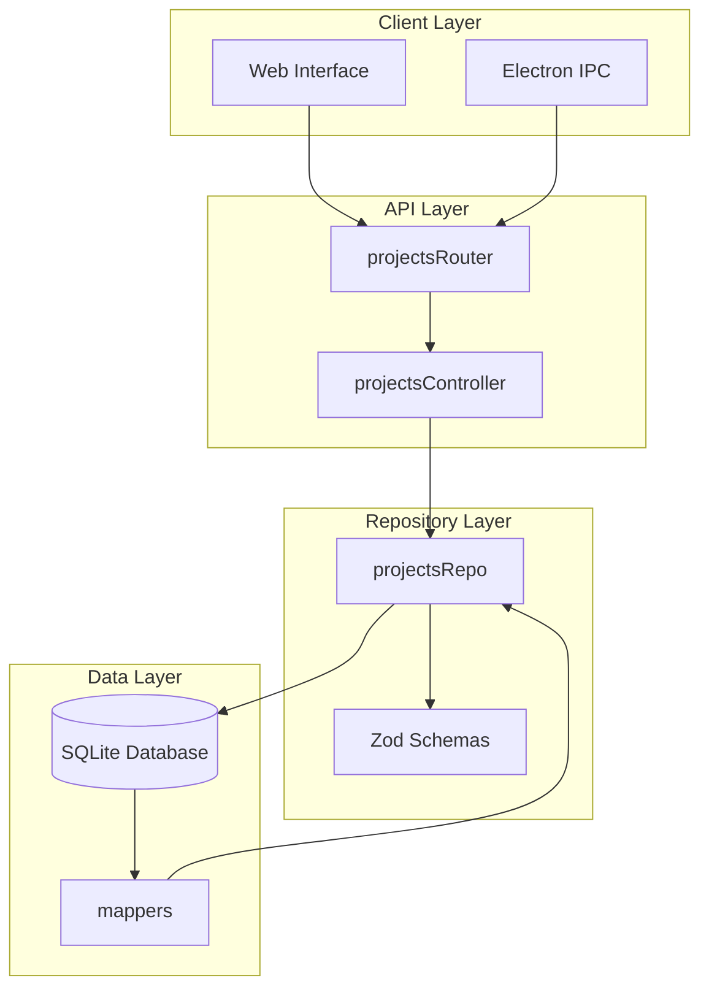
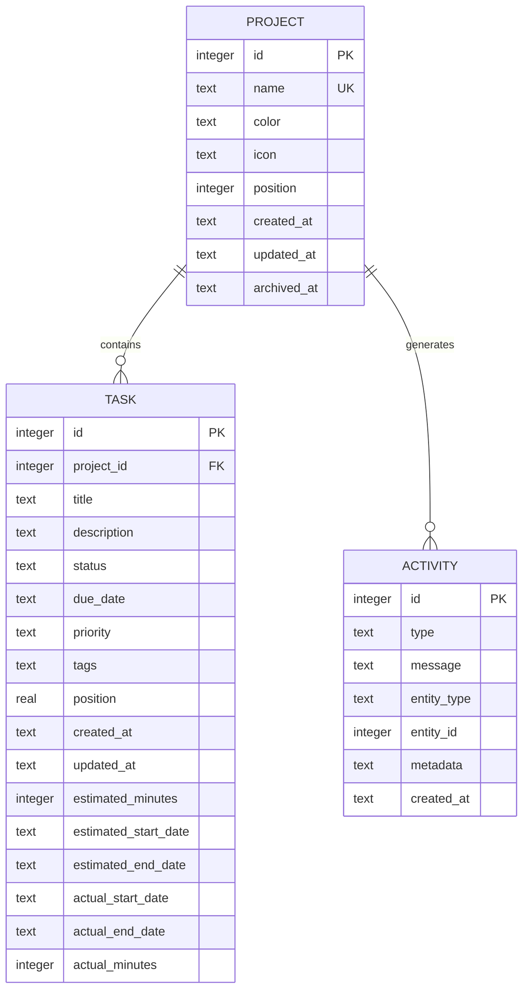
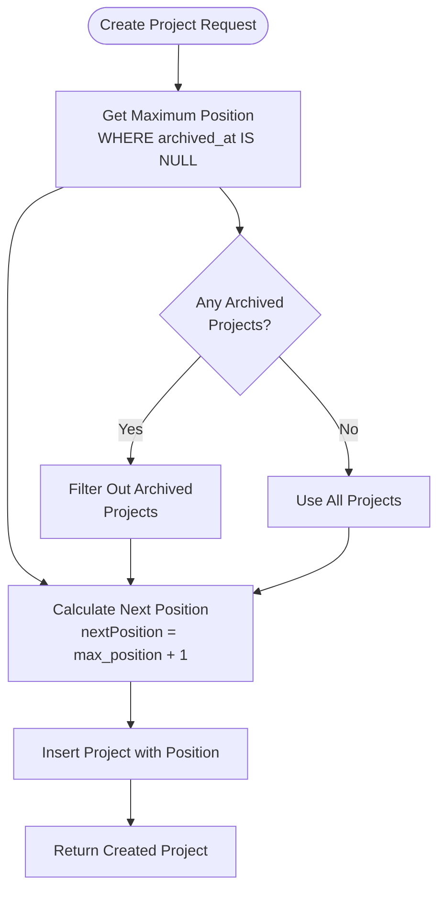
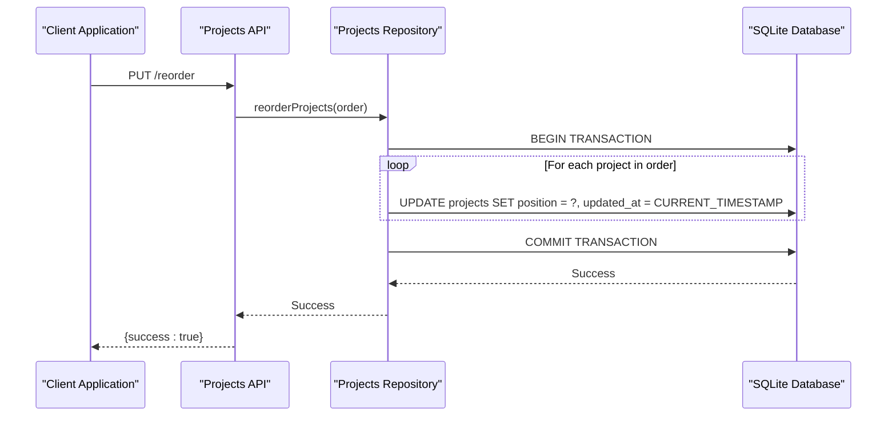
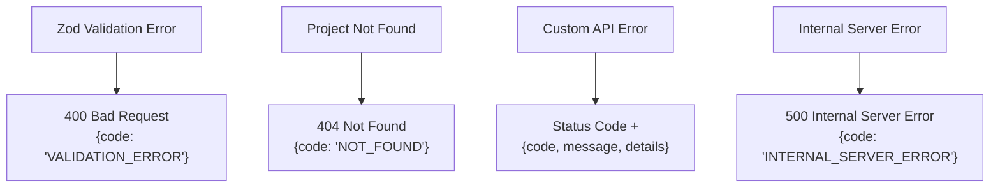
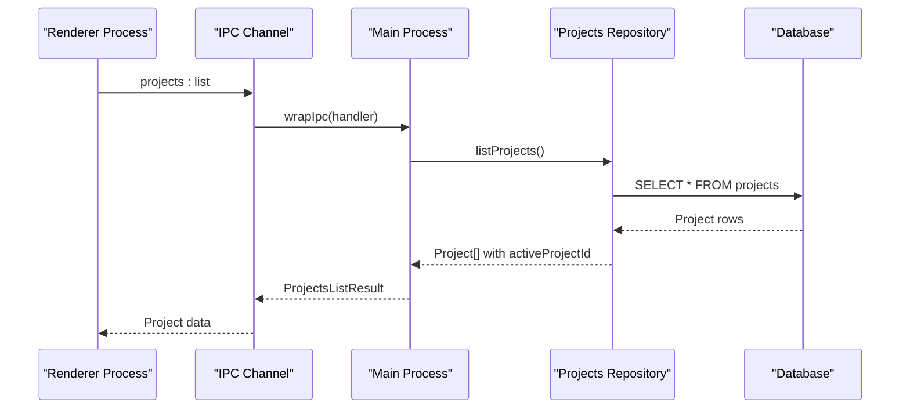
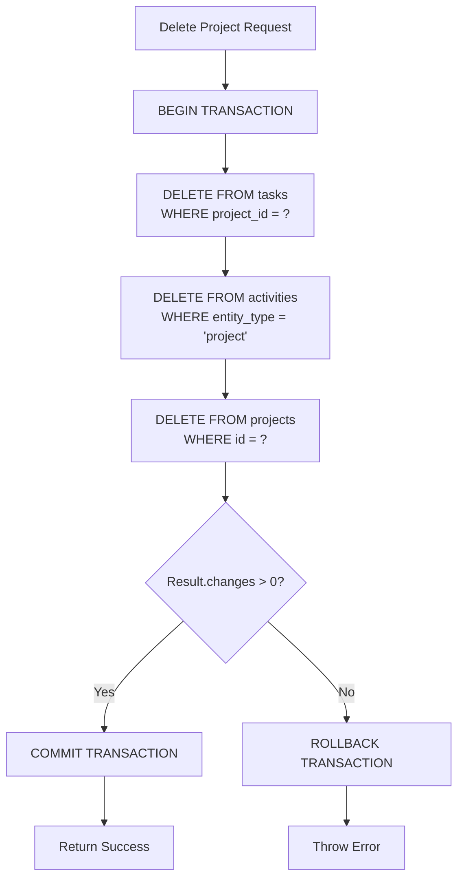
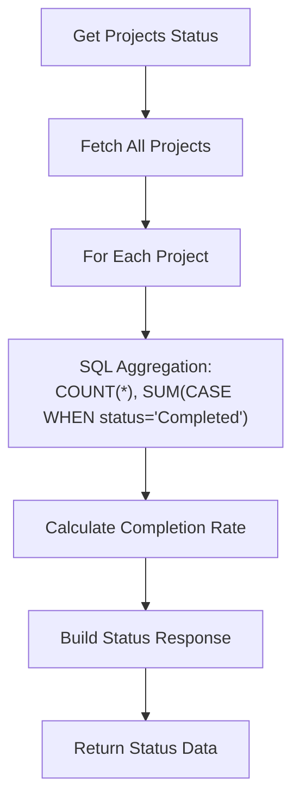

# Projects API Routes

<cite>
**Referenced Files in This Document**
- [projects.ts](file://src/server/routes/projects.ts)
- [projectsController.ts](file://src/server/controllers/projectsController.ts)
- [projectsRepo.ts](file://src/database/projectsRepo.ts)
- [projects.ts](file://src/main/ipc/projects.ts)
- [types.ts](file://src/common/types.ts)
- [types.ts](file://src/database/types.ts)
- [mappers.ts](file://src/database/mappers.ts)
- [init.ts](file://src/database/init.ts)
- [errorHandler.ts](file://src/server/middleware/errorHandler.ts)
</cite>

## Table of Contents
1. [Introduction](#introduction)
2. [API Architecture Overview](#api-architecture-overview)
3. [Project Data Model](#project-data-model)
4. [Route Endpoints](#route-endpoints)
5. [Position-Based Ordering System](#position-based-ordering-system)
6. [Data Validation and Error Handling](#data-validation-and-error-handling)
7. [Integration Patterns](#integration-patterns)
8. [Usage Examples](#usage-examples)
9. [Database Schema](#database-schema)
10. [Best Practices](#best-practices)

## Introduction

The Projects API provides comprehensive CRUD operations for managing projects within the LifeOS application. Built on Express.js, the API follows RESTful principles and integrates with a SQLite database through a repository pattern. The system supports advanced features including position-based ordering, project archiving, and real-time status reporting with task statistics.

## API Architecture Overview

The Projects API follows a layered architecture pattern with clear separation of concerns:



**Diagram sources**
- [projects.ts](file://src/server/routes/projects.ts#L1-L29)
- [projectsController.ts](file://src/server/controllers/projectsController.ts#L1-L134)
- [projectsRepo.ts](file://src/database/projectsRepo.ts#L1-L148)

**Section sources**
- [projects.ts](file://src/server/routes/projects.ts#L1-L29)
- [projectsController.ts](file://src/server/controllers/projectsController.ts#L1-L134)

## Project Data Model

The project system uses a structured data model with comprehensive validation and mapping capabilities:

### Project Interface
The core Project interface defines the essential attributes:

| Field | Type | Description | Constraints |
|-------|------|-------------|-------------|
| `id` | `number` | Unique identifier | Auto-generated, positive integer |
| `name` | `string` | Project display name | Required, min 1 char, max 120 chars |
| `color` | `string \| null` | Theme color | Optional, max 20 chars |
| `icon` | `string \| null` | Icon identifier | Optional, max 30 chars |
| `position` | `number` | Display order | Non-negative integer, auto-managed |
| `createdAt` | `string` | Creation timestamp | ISO format datetime |
| `updatedAt` | `string` | Last modification timestamp | ISO format datetime |

### Database Schema
The underlying SQLite schema enforces data integrity:



**Diagram sources**
- [init.ts](file://src/database/init.ts#L44-L85)
- [types.ts](file://src/database/types.ts#L1-L31)

**Section sources**
- [types.ts](file://src/common/types.ts#L1-L117)
- [types.ts](file://src/database/types.ts#L1-L31)
- [init.ts](file://src/database/init.ts#L44-L85)

## Route Endpoints

The Projects API exposes seven primary endpoints organized by HTTP method and functionality:

### GET /api/projects
**Purpose**: Retrieve all projects with optional filtering
**URL Pattern**: `/api/projects`
**Query Parameters**:
- `includeArchived` (boolean): Include archived projects in results

**Request Example**:
```http
GET /api/projects?includeArchived=true
Authorization: Bearer <token>
```

**Response Structure**:
```json
{
  "data": [
    {
      "id": 1,
      "name": "Personal Projects",
      "color": "#FF6B6B",
      "icon": "calendar",
      "position": 0,
      "createdAt": "2024-01-15T10:30:00Z",
      "updatedAt": "2024-01-15T10:30:00Z"
    }
  ]
}
```

### GET /api/projects/:id
**Purpose**: Fetch a specific project by ID
**URL Pattern**: `/api/projects/:id`
**Parameters**:
- `id` (number): Project identifier

**Request Example**:
```http
GET /api/projects/1
Authorization: Bearer <token>
```

**Response Structure**:
```json
{
  "data": {
    "id": 1,
    "name": "Personal Projects",
    "color": "#FF6B6B",
    "icon": "calendar",
    "position": 0,
    "createdAt": "2024-01-15T10:30:00Z",
    "updatedAt": "2024-01-15T10:30:00Z"
  }
}
```

### POST /api/projects/create
**Purpose**: Create a new project
**URL Pattern**: `/api/projects/create`
**Request Body**:
```json
{
  "name": "New Project",
  "color": "#4ECDC4",
  "icon": "briefcase"
}
```

**Response Structure**:
```json
{
  "data": {
    "id": 2,
    "name": "New Project",
    "color": "#4ECDC4",
    "icon": "briefcase",
    "position": 1,
    "createdAt": "2024-01-15T11:00:00Z",
    "updatedAt": "2024-01-15T11:00:00Z"
  }
}
```

### PUT /api/projects/:id
**Purpose**: Update an existing project
**URL Pattern**: `/api/projects/:id`
**Parameters**:
- `id` (number): Project identifier

**Request Body**:
```json
{
  "name": "Updated Project Name",
  "color": "#F72585",
  "icon": "star",
  "position": 0
}
```

**Response Structure**:
```json
{
  "data": {
    "id": 2,
    "name": "Updated Project Name",
    "color": "#F72585",
    "icon": "star",
    "position": 0,
    "createdAt": "2024-01-15T11:00:00Z",
    "updatedAt": "2024-01-15T11:30:00Z"
  }
}
```

### DELETE /api/projects/:id
**Purpose**: Delete a project and all associated data
**URL Pattern**: `/api/projects/:id`
**Parameters**:
- `id` (number): Project identifier

**Response Structure**:
```json
{
  "data": {
    "success": true,
    "id": 2
  }
}
```

### PUT /api/projects/reorder
**Purpose**: Reorder multiple projects simultaneously
**URL Pattern**: `/api/projects/reorder`
**Request Body**:
```json
{
  "order": [
    { "id": 1, "position": 0 },
    { "id": 2, "position": 1 },
    { "id": 3, "position": 2 }
  ]
}
```

**Response Structure**:
```json
{
  "data": {
    "success": true
  }
}
```

### PUT /api/projects/:id/set-active
**Purpose**: Set a project as the active project
**URL Pattern**: `/api/projects/:id/set-active`
**Parameters**:
- `id` (number): Project identifier

**Response Structure**:
```json
{
  "data": {
    "activeProjectId": 1
  }
}
```

### GET /api/projects/status
**Purpose**: Get comprehensive project status with task statistics
**URL Pattern**: `/api/projects/status`

**Response Structure**:
```json
{
  "data": {
    "total": 3,
    "activeProjectId": 1,
    "projects": [
      {
        "id": 1,
        "name": "Personal Projects",
        "taskCount": 15,
        "completedCount": 8,
        "completionRate": 53,
        "totalEstimatedMinutes": 1200,
        "totalActualMinutes": 950
      }
    ]
  }
}
```

**Section sources**
- [projects.ts](file://src/server/routes/projects.ts#L1-L29)
- [projectsController.ts](file://src/server/controllers/projectsController.ts#L1-L134)

## Position-Based Ordering System

The Projects API implements a sophisticated position-based ordering system that enables flexible project arrangement:

### Automatic Position Management
When creating new projects, the system automatically assigns the next available position:



**Diagram sources**
- [projectsRepo.ts](file://src/database/projectsRepo.ts#L42-L52)

### Reordering Operations
The reorder endpoint allows bulk position updates with transaction safety:



**Diagram sources**
- [projectsRepo.ts](file://src/database/projectsRepo.ts#L108-L120)
- [projectsController.ts](file://src/server/controllers/projectsController.ts#L64-L72)

### Position Constraints
- Positions are non-negative integers
- Archived projects are excluded from position calculations
- Projects maintain their relative positions during updates
- Transaction ensures atomicity for bulk operations

**Section sources**
- [projectsRepo.ts](file://src/database/projectsRepo.ts#L42-L52)
- [projectsRepo.ts](file://src/database/projectsRepo.ts#L108-L120)

## Data Validation and Error Handling

The Projects API implements comprehensive validation and error handling using Zod schemas and custom error middleware:

### Validation Schemas
The system uses strict validation schemas for data integrity:

| Endpoint | Schema | Validation Rules |
|----------|--------|------------------|
| `createProject` | `createProjectSchema` | name: 1-120 chars, color: max 20 chars, icon: max 30 chars |
| `updateProject` | `updateProjectSchema` | id: positive integer, payload fields optional with constraints |

### Error Response Patterns
The API follows standardized error response formats:



**Diagram sources**
- [errorHandler.ts](file://src/server/middleware/errorHandler.ts#L10-L69)

### Common Error Scenarios
- **Duplicate Names**: SQLite UNIQUE constraint violation
- **Invalid Colors**: Color format validation (typically hex codes)
- **Missing Projects**: 404 responses for non-existent project IDs
- **Validation Failures**: 400 responses with detailed error information

**Section sources**
- [projectsRepo.ts](file://src/database/projectsRepo.ts#L7-L20)
- [errorHandler.ts](file://src/server/middleware/errorHandler.ts#L10-L69)

## Integration Patterns

The Projects API integrates with multiple system components through well-defined patterns:

### IPC Communication (Electron)
The main process handles IPC communication for desktop applications:



**Diagram sources**
- [projects.ts](file://src/main/ipc/projects.ts#L6-L25)

### Database Transactions
Critical operations use transactions for data consistency:



**Diagram sources**
- [projectsRepo.ts](file://src/database/projectsRepo.ts#L122-L147)

### Status Reporting
The status endpoint aggregates comprehensive project statistics:



**Diagram sources**
- [projectsController.ts](file://src/server/controllers/projectsController.ts#L74-L133)

**Section sources**
- [projects.ts](file://src/main/ipc/projects.ts#L6-L83)
- [projectsRepo.ts](file://src/database/projectsRepo.ts#L122-L147)
- [projectsController.ts](file://src/server/controllers/projectsController.ts#L74-L133)

## Usage Examples

### Creating a New Project
```javascript
// Basic project creation
fetch('/api/projects/create', {
  method: 'POST',
  headers: { 'Content-Type': 'application/json' },
  body: JSON.stringify({
    name: 'Daily Goals',
    color: '#4CAF50',
    icon: 'check-circle'
  })
})
.then(response => response.json())
.then(data => console.log('Created project:', data.data));
```

### Reordering Projects
```javascript
// Bulk reorder projects
fetch('/api/projects/reorder', {
  method: 'PUT',
  headers: { 'Content-Type': 'application/json' },
  body: JSON.stringify({
    order: [
      { id: 1, position: 2 },
      { id: 2, position: 0 },
      { id: 3, position: 1 }
    ]
  })
});
```

### Managing Active Project
```javascript
// Set active project
fetch('/api/projects/1/set-active', {
  method: 'PUT'
})
.then(response => response.json())
.then(data => console.log('Active project set:', data.data.activeProjectId));
```

### Retrieving Project Status
```javascript
// Get comprehensive project status
fetch('/api/projects/status')
.then(response => response.json())
.then(data => {
  console.log('Total projects:', data.data.total);
  console.log('Active project:', data.data.activeProjectId);
  console.log('Project stats:', data.data.projects);
});
```

### Filtering Archived Projects
```javascript
// List all projects including archived
fetch('/api/projects?includeArchived=true')
.then(response => response.json())
.then(data => console.log('All projects:', data.data));
```

## Database Schema

The Projects API relies on a well-designed SQLite schema with appropriate indexing and constraints:

### Table Structure
```sql
CREATE TABLE projects (
    id INTEGER PRIMARY KEY AUTOINCREMENT,
    name TEXT NOT NULL UNIQUE,
    color TEXT,
    icon TEXT,
    position INTEGER NOT NULL DEFAULT 0,
    created_at TEXT NOT NULL DEFAULT CURRENT_TIMESTAMP,
    updated_at TEXT NOT NULL DEFAULT CURRENT_TIMESTAMP,
    archived_at TEXT
);
```

### Indexes
- `idx_projects_position`: Optimizes position-based queries
- `idx_tasks_project_status`: Speeds up task filtering by project and status
- `idx_activities_created_at`: Enhances activity timeline queries

### Foreign Key Constraints
- Projects cascade delete to related tasks
- Activities maintain referential integrity with projects

**Section sources**
- [init.ts](file://src/database/init.ts#L44-L85)

## Best Practices

### Project Management Guidelines
1. **Naming Conventions**: Use descriptive, unique project names
2. **Color Coding**: Implement consistent color schemes for project categorization
3. **Icon Usage**: Choose meaningful icons that represent project themes
4. **Position Planning**: Consider long-term project organization when setting initial positions

### Performance Optimization
1. **Batch Operations**: Use the reorder endpoint for multiple position changes
2. **Selective Queries**: Utilize `includeArchived` parameter appropriately
3. **Index Utilization**: Leverage position-based ordering for efficient sorting
4. **Transaction Safety**: Rely on database transactions for data consistency

### Error Handling Strategies
1. **Validation First**: Validate input data before database operations
2. **Graceful Degradation**: Handle missing projects gracefully
3. **Meaningful Messages**: Provide clear error messages for user feedback
4. **Logging**: Implement comprehensive error logging for debugging

### Security Considerations
1. **Input Sanitization**: All inputs are validated using Zod schemas
2. **Access Control**: Authentication middleware protects API endpoints
3. **Data Integrity**: Foreign key constraints prevent orphaned records
4. **Transaction Safety**: Atomic operations maintain data consistency