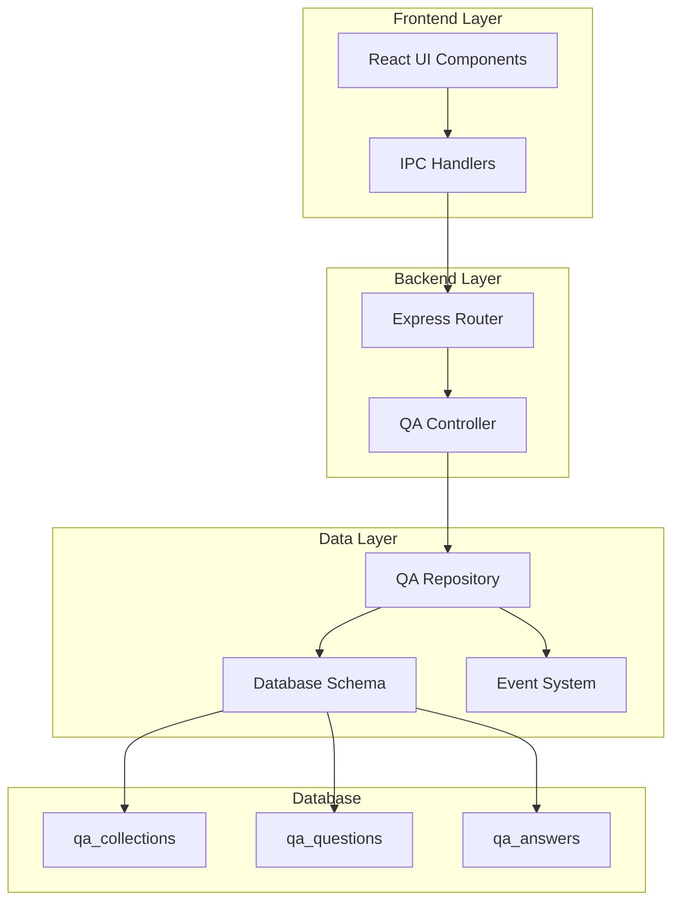
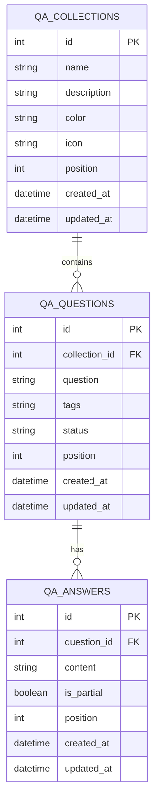
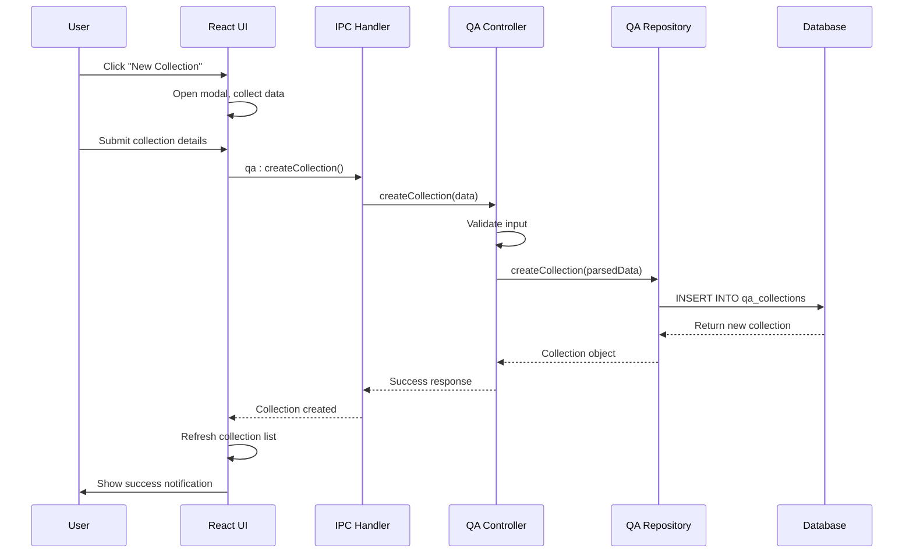
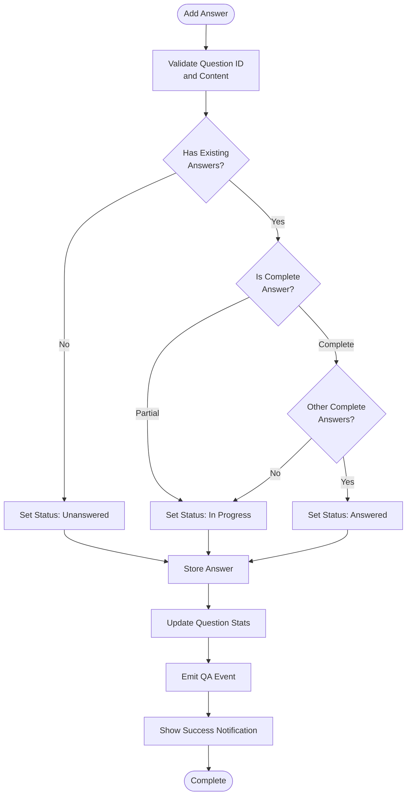
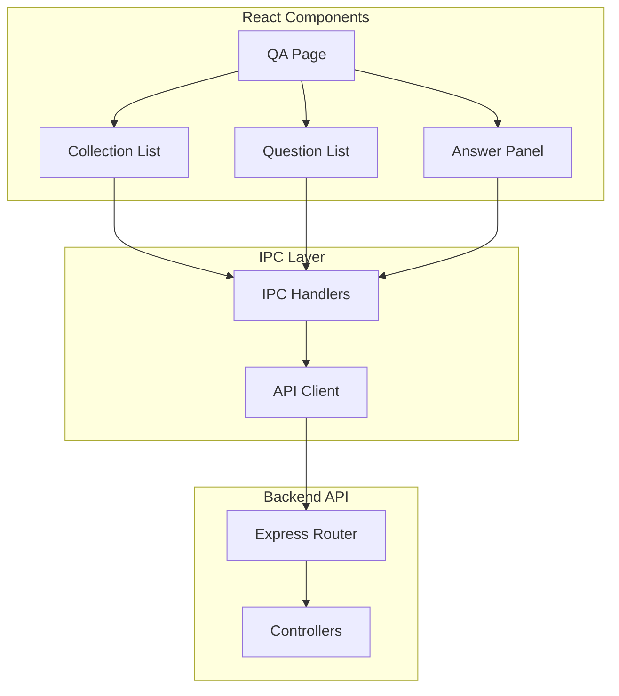

# QA API Routes Documentation

<cite>
**Referenced Files in This Document**
- [src/server/routes/qa.ts](file://src/server/routes/qa.ts)
- [src/server/controllers/qaController.ts](file://src/server/controllers/qaController.ts)
- [src/main/ipc/qa.ts](file://src/main/ipc/qa.ts)
- [src/database/qaRepo.ts](file://src/database/qaRepo.ts)
- [src/database/qaSchema.ts](file://src/database/qaSchema.ts)
- [src/renderer/pages/QA.tsx](file://src/renderer/pages/QA.tsx)
- [src/common/types.ts](file://src/common/types.ts)
- [src/database/eventsRepo.ts](file://src/database/eventsRepo.ts)
- [src/database/init.ts](file://src/database/init.ts)
</cite>

## Table of Contents
1. [Introduction](#introduction)
2. [System Architecture](#system-architecture)
3. [Database Schema](#database-schema)
4. [API Endpoint Reference](#api-endpoint-reference)
5. [Data Models](#data-models)
6. [Request/Response Formats](#requestresponse-formats)
7. [Validation Rules](#validation-rules)
8. [Error Responses](#error-responses)
9. [Common Workflows](#common-workflows)
10. [Frontend Integration](#frontend-integration)
11. [Performance Considerations](#performance-considerations)
12. [Troubleshooting Guide](#troubleshooting-guide)

## Introduction

The QA (Question and Answer) API provides a comprehensive knowledge management system for organizing questions into collections, managing multiple answers per question, and tracking answer completion status. The system supports hierarchical data structures with collections containing questions, which in turn contain multiple answers with partial/completion tracking.

Key features include:
- **Hierarchical Organization**: Collections → Questions → Answers
- **Status Tracking**: Unanswered, In Progress, Answered states
- **Partial/Complete Answers**: Flexible answer management
- **Markdown Support**: Rich text formatting for answers
- **Real-time Statistics**: Dynamic status reporting
- **Event Integration**: Automatic event emission for analytics

## System Architecture

The QA system follows a layered architecture with clear separation between presentation, business logic, and data persistence:



**Diagram sources**
- [src/server/routes/qa.ts](file://src/server/routes/qa.ts#L1-L28)
- [src/server/controllers/qaController.ts](file://src/server/controllers/qaController.ts#L1-L217)
- [src/main/ipc/qa.ts](file://src/main/ipc/qa.ts#L1-L124)
- [src/database/qaRepo.ts](file://src/database/qaRepo.ts#L1-L540)

**Section sources**
- [src/server/routes/qa.ts](file://src/server/routes/qa.ts#L1-L28)
- [src/server/controllers/qaController.ts](file://src/server/controllers/qaController.ts#L1-L217)
- [src/main/ipc/qa.ts](file://src/main/ipc/qa.ts#L1-L124)

## Database Schema

The QA system uses a relational database schema with cascading foreign keys ensuring data integrity:



**Diagram sources**
- [src/database/qaSchema.ts](file://src/database/qaSchema.ts#L10-L50)

### Schema Details

| Table | Purpose | Key Features |
|-------|---------|--------------|
| `qa_collections` | Organize questions into logical groups | Color/icon support, position-based ordering |
| `qa_questions` | Individual questions within collections | Status tracking (unanswered/in_progress/answered) |
| `qa_answers` | Multiple answers per question | Partial/completion flag, markdown support |

**Section sources**
- [src/database/qaSchema.ts](file://src/database/qaSchema.ts#L1-L72)

## API Endpoint Reference

The QA API provides comprehensive CRUD operations across three resource types: collections, questions, and answers.

### Collections Endpoints

| Method | Endpoint | Description | Validation |
|--------|----------|-------------|------------|
| POST | `/api/qa/collections/create` | Create new collection | Name required, max 200 chars |
| GET | `/api/qa/collections/:id` | Get specific collection | ID must exist |
| GET | `/api/qa/collections` | List all collections | Ordered by position |
| PUT | `/api/qa/collections/:id` | Update collection | ID and payload validation |
| DELETE | `/api/qa/collections/:id` | Delete collection | Cascade deletes questions |

### Questions Endpoints

| Method | Endpoint | Description | Validation |
|--------|----------|-------------|------------|
| POST | `/api/qa/questions/create` | Create new question | Collection ID, question text required |
| GET | `/api/qa/questions/:id` | Get specific question | ID and collection ID required |
| GET | `/api/qa/questions` | List questions by collection | Collection ID query parameter |
| PUT | `/api/qa/questions/:id` | Update question | ID and payload validation |
| DELETE | `/api/qa/questions/:id` | Delete question | Cascade deletes answers |

### Answers Endpoints

| Method | Endpoint | Description | Validation |
|--------|----------|-------------|------------|
| POST | `/api/qa/answers/create` | Create new answer | Question ID, content required |
| GET | `/api/qa/answers/:questionId` | List answers by question | Question ID required |
| PUT | `/api/qa/answers/:id` | Update answer | ID and payload validation |
| DELETE | `/api/qa/answers/:id` | Delete answer | Question status updates |

### Status Endpoint

| Method | Endpoint | Description | Response |
|--------|----------|-------------|----------|
| GET | `/api/qa/status` | Get system statistics | Comprehensive QA status report |

**Section sources**
- [src/server/routes/qa.ts](file://src/server/routes/qa.ts#L5-L27)
- [src/server/controllers/qaController.ts](file://src/server/controllers/qaController.ts#L5-L216)

## Data Models

### Collection Model

```typescript
interface QACollection {
  id: number;
  name: string;
  description: string | null;
  color: string | null;
  icon: string | null;
  position: number;
  questionCount: number;
  answeredCount: number;
  createdAt: string;
  updatedAt: string;
}
```

### Question Model

```typescript
interface QAQuestion {
  id: number;
  collectionId: number;
  question: string;
  tags: string[] | null;
  status: string;
  position: number;
  answerCount: number;
  partialAnswerCount: number;
  createdAt: string;
  updatedAt: string;
}
```

### Answer Model

```typescript
interface QAAnswer {
  id: number;
  questionId: number;
  content: string;
  isPartial: boolean;
  position: number;
  createdAt: string;
  updatedAt: string;
}
```

**Section sources**
- [src/database/qaRepo.ts](file://src/database/qaRepo.ts#L10-L40)
- [src/renderer/pages/QA.tsx](file://src/renderer/pages/QA.tsx#L5-L25)

## Request/Response Formats

### Collection Operations

#### Create Collection Request
```json
{
  "name": "Personal Finance",
  "description": "Financial planning and budgeting questions",
  "color": "#FF5252",
  "icon": "💰"
}
```

#### Create Collection Response
```json
{
  "data": {
    "id": 1,
    "name": "Personal Finance",
    "description": "Financial planning and budgeting questions",
    "color": "#FF5252",
    "icon": "💰",
    "position": 0,
    "questionCount": 0,
    "answeredCount": 0,
    "createdAt": "2024-01-15T10:30:00Z",
    "updatedAt": "2024-01-15T10:30:00Z"
  }
}
```

### Question Operations

#### Create Question Request
```json
{
  "collectionId": 1,
  "question": "How do I create a monthly budget?",
  "tags": ["budgeting", "finance"]
}
```

#### Question Response with Stats
```json
{
  "data": {
    "id": 5,
    "collectionId": 1,
    "question": "How do I create a monthly budget?",
    "tags": ["budgeting", "finance"],
    "status": "unanswered",
    "position": 0,
    "answerCount": 0,
    "partialAnswerCount": 0,
    "createdAt": "2024-01-15T11:15:00Z",
    "updatedAt": "2024-01-15T11:15:00Z"
  }
}
```

### Answer Operations

#### Create Answer Request
```json
{
  "questionId": 5,
  "content": "Start by tracking your income and expenses for a month.\n\nThen categorize expenses into:\n- Fixed costs (rent, bills)\n- Variable costs (groceries, entertainment)\n- Savings goals\n\nUse the 50/30/20 rule: 50% needs, 30% wants, 20% savings.",
  "isPartial": false
}
```

#### Answer Response
```json
{
  "data": {
    "id": 8,
    "questionId": 5,
    "content": "Step-by-step budget creation guide...",
    "isPartial": false,
    "position": 0,
    "createdAt": "2024-01-15T11:30:00Z",
    "updatedAt": "2024-01-15T11:30:00Z"
  }
}
```

### Status Report Response

```json
{
  "data": {
    "totalQuestions": 15,
    "totalAnswers": 28,
    "byStatus": {
      "unanswered": 5,
      "inProgress": 3,
      "answered": 7
    },
    "answerRate": 47,
    "collections": [
      {
        "name": "Personal Finance",
        "questionCount": 8
      },
      {
        "name": "Health & Fitness",
        "questionCount": 7
      }
    ]
  }
}
```

**Section sources**
- [src/server/controllers/qaController.ts](file://src/server/controllers/qaController.ts#L5-L216)
- [src/database/qaRepo.ts](file://src/database/qaRepo.ts#L100-L200)

## Validation Rules

### Collection Validation

| Field | Type | Required | Constraints | Example |
|-------|------|----------|-------------|---------|
| name | string | Yes | Min: 1, Max: 200 chars | "Personal Finance" |
| description | string | No | Max: 1000 chars | "Financial planning guide" |
| color | string | No | Max: 20 chars | "#FF5252" |
| icon | string | No | Max: 30 chars | "💰" |

### Question Validation

| Field | Type | Required | Constraints | Example |
|-------|------|----------|-------------|---------|
| collectionId | number | Yes | Positive integer | 1 |
| question | string | Yes | Min: 1, Max: 1000 chars | "Budgeting question..." |
| tags | array | No | Array of strings, max 30 chars each | ["budgeting", "finance"] |

### Answer Validation

| Field | Type | Required | Constraints | Example |
|-------|------|----------|-------------|---------|
| questionId | number | Yes | Positive integer | 5 |
| content | string | Yes | Min: 1 char | "Answer content..." |
| isPartial | boolean | No | Defaults to true | false |

**Section sources**
- [src/database/qaRepo.ts](file://src/database/qaRepo.ts#L45-L85)

## Error Responses

### Standard Error Format

```json
{
  "error": {
    "code": "ERROR_CODE",
    "message": "Human-readable error description"
  }
}
```

### Common Error Codes

| Code | HTTP Status | Description | Example Scenario |
|------|-------------|-------------|------------------|
| `NOT_FOUND` | 404 | Resource not found | Collection ID doesn't exist |
| `VALIDATION_ERROR` | 400 | Invalid input data | Missing required field |
| `INTERNAL_ERROR` | 500 | Server-side error | Database constraint violation |

### Specific Error Scenarios

#### Collection Not Found
```json
{
  "error": {
    "code": "NOT_FOUND",
    "message": "Collection not found"
  }
}
```

#### Validation Failure
```json
{
  "error": {
    "code": "VALIDATION_ERROR",
    "message": "collectionId is required"
  }
}
```

#### Database Constraint Violation
```json
{
  "error": {
    "code": "INTERNAL_ERROR",
    "message": "Cannot delete collection with existing questions"
  }
}
```

**Section sources**
- [src/server/controllers/qaController.ts](file://src/server/controllers/qaController.ts#L15-L35)
- [src/server/controllers/qaController.ts](file://src/server/controllers/qaController.ts#L100-L120)

## Common Workflows

### Creating a New QA Collection



**Diagram sources**
- [src/renderer/pages/QA.tsx](file://src/renderer/pages/QA.tsx#L110-L140)
- [src/main/ipc/qa.ts](file://src/main/ipc/qa.ts#L20-L30)
- [src/server/controllers/qaController.ts](file://src/server/controllers/qaController.ts#L5-L10)

### Adding Questions to a Collection

1. **Select Collection**: User chooses target collection from sidebar
2. **Create Question**: User submits question text and optional tags
3. **Store Question**: System validates and stores in database
4. **Update Statistics**: Collection question count increments
5. **Emit Event**: Analytics event recorded for tracking

### Managing Answers with Completion Tracking



**Diagram sources**
- [src/database/qaRepo.ts](file://src/database/qaRepo.ts#L370-L400)
- [src/database/eventsRepo.ts](file://src/database/eventsRepo.ts#L120-L135)

**Section sources**
- [src/renderer/pages/QA.tsx](file://src/renderer/pages/QA.tsx#L110-L220)
- [src/database/qaRepo.ts](file://src/database/qaRepo.ts#L200-L300)

## Frontend Integration

### React Component Architecture

The QA system integrates seamlessly with the React frontend through a well-defined API layer:



**Diagram sources**
- [src/renderer/pages/QA.tsx](file://src/renderer/pages/QA.tsx#L1-L50)
- [src/main/ipc/qa.ts](file://src/main/ipc/qa.ts#L1-L50)

### State Management

The frontend maintains state for:
- **Collections**: List of all QA collections with metadata
- **Selected Items**: Current collection, question, and answer selection
- **Form State**: New item creation forms (collections, questions, answers)
- **Editing State**: Active editing of answers
- **Loading States**: API call progress indicators

### Real-time Updates

The system supports real-time updates through:
- **Automatic Refresh**: Component re-renders when data changes
- **Success Notifications**: User feedback for successful operations
- **Error Handling**: Graceful error display and recovery
- **Status Indicators**: Visual representation of question status

**Section sources**
- [src/renderer/pages/QA.tsx](file://src/renderer/pages/QA.tsx#L40-L80)
- [src/preload/index.ts](file://src/preload/index.ts#L78-L98)

## Performance Considerations

### Database Optimization

The QA system implements several performance optimizations:

| Optimization | Implementation | Benefit |
|--------------|----------------|---------|
| Indexing | Position and status indexes | Fast sorting and filtering |
| Cascading Deletes | Foreign key constraints | Automatic cleanup |
| Batch Queries | Combined statistics queries | Reduced round trips |
| Lazy Loading | On-demand data loading | Improved initial load time |

### Caching Strategy

- **Collection List**: Cached until refresh
- **Question Lists**: Cached per collection
- **Answer Lists**: Cached per question
- **Statistics**: Periodic refresh for real-time data

### Scalability Considerations

- **Hierarchical Data**: Efficient tree traversal through position indexing
- **Large Collections**: Pagination support for extensive QA systems
- **Concurrent Access**: Thread-safe database operations
- **Memory Management**: Efficient state management in React components

**Section sources**
- [src/database/qaSchema.ts](file://src/database/qaSchema.ts#L50-L60)
- [src/database/qaRepo.ts](file://src/database/qaRepo.ts#L100-L150)

## Troubleshooting Guide

### Common Issues and Solutions

#### Collection Creation Failures

**Problem**: Collections fail to create with validation errors
**Solution**: 
- Verify name length (1-200 chars)
- Check for special characters in description
- Ensure color codes are valid hex values

#### Question Status Not Updating

**Problem**: Question status remains "unanswered" despite adding answers
**Solution**:
- Verify answer completeness (isPartial flag)
- Check database foreign key constraints
- Review answer creation timestamps

#### Performance Issues with Large QA Systems

**Problem**: Slow loading times for collections with many questions
**Solution**:
- Implement pagination for question lists
- Optimize database indexes
- Consider lazy loading for answer panels

#### IPC Communication Errors

**Problem**: Frontend cannot communicate with backend
**Solution**:
- Verify IPC handler registration
- Check Electron context isolation settings
- Review preload script configuration

### Debugging Tools

#### Database Queries

Monitor SQL queries for:
- Excessive joins in statistics calculations
- Missing indexes on frequently queried columns
- Long-running transactions

#### Event Tracking

Use the event system to debug:
- QA action frequency
- User engagement patterns
- System performance metrics

**Section sources**
- [src/database/qaRepo.ts](file://src/database/qaRepo.ts#L450-L540)
- [src/database/eventsRepo.ts](file://src/database/eventsRepo.ts#L120-L135)