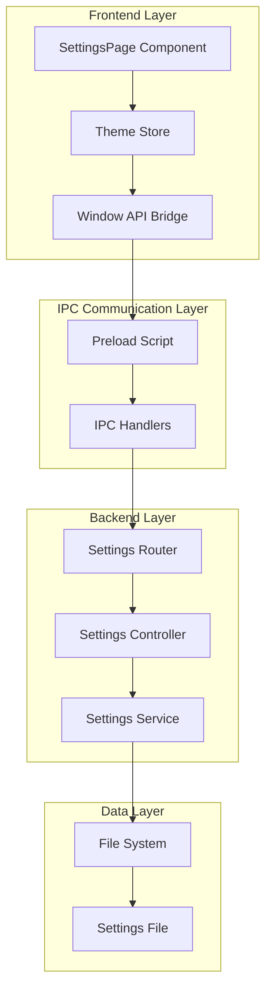
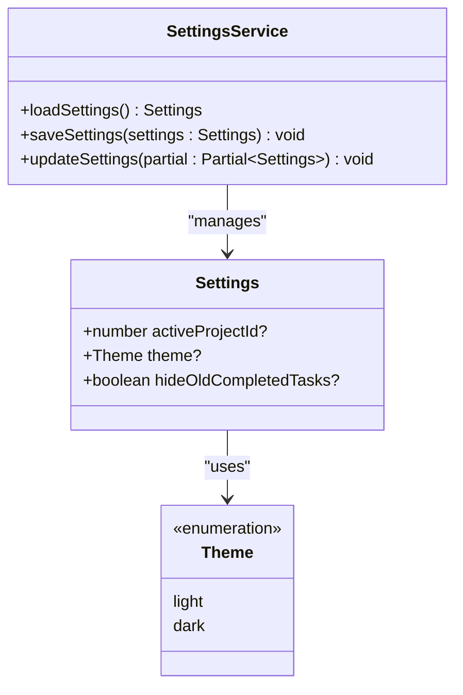
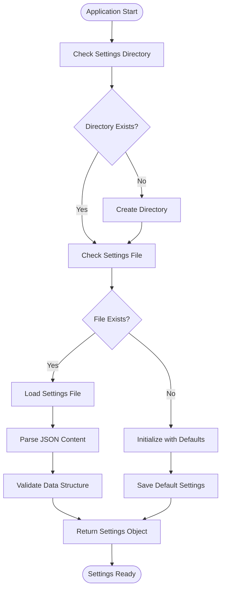
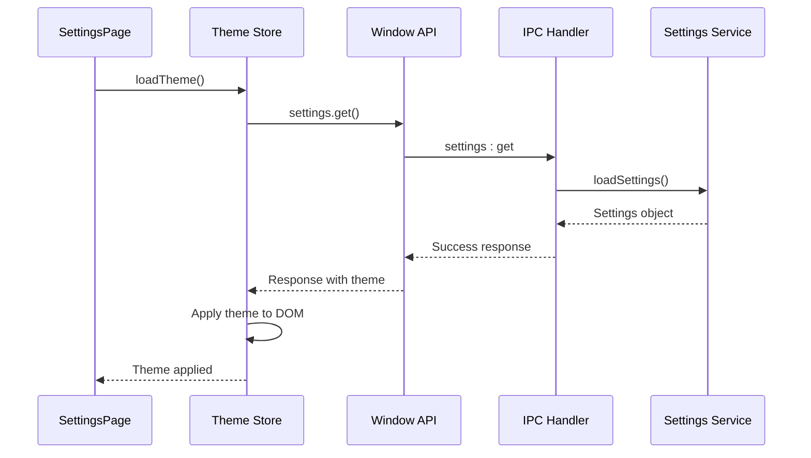
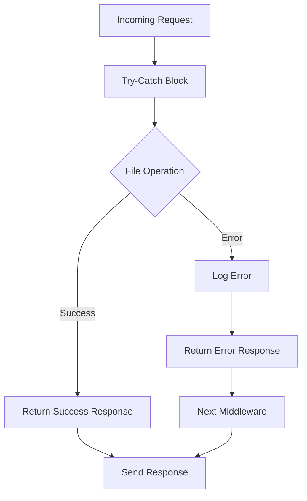

# Settings API Routes

<cite>
**Referenced Files in This Document**
- [src/server/routes/settings.ts](file://src/server/routes/settings.ts)
- [src/server/controllers/settingsController.ts](file://src/server/controllers/settingsController.ts)
- [src/main/ipc/settings.ts](file://src/main/ipc/settings.ts)
- [src/services/settings.ts](file://src/services/settings.ts)
- [src/renderer/pages/SettingsPage.tsx](file://src/renderer/pages/SettingsPage.tsx)
- [src/store/theme.ts](file://src/store/theme.ts)
- [src/preload/index.ts](file://src/preload/index.ts)
- [src/common/types.ts](file://src/common/types.ts)
</cite>

## Table of Contents
1. [Introduction](#introduction)
2. [Architecture Overview](#architecture-overview)
3. [Settings Data Model](#settings-data-model)
4. [API Endpoints](#api-endpoints)
5. [Persistence Mechanism](#persistence-mechanism)
6. [Integration with Frontend Components](#integration-with-frontend-components)
7. [Request Validation and Response Formatting](#request-validation-and-response-formatting)
8. [Common Operations](#common-operations)
9. [Error Handling](#error-handling)
10. [Best Practices](#best-practices)

## Introduction

The Settings API provides a comprehensive interface for managing application preferences and user configurations. Built on Express.js for the backend and Electron's IPC for inter-process communication, it offers both RESTful endpoints and direct frontend integration capabilities. The API handles theme preferences, application state, and various user customization options while maintaining data persistence across application sessions.

## Architecture Overview

The Settings API follows a layered architecture with clear separation of concerns:



**Diagram sources**
- [src/renderer/pages/SettingsPage.tsx](file://src/renderer/pages/SettingsPage.tsx#L1-L20)
- [src/store/theme.ts](file://src/store/theme.ts#L1-L30)
- [src/preload/index.ts](file://src/preload/index.ts#L1-L50)
- [src/main/ipc/settings.ts](file://src/main/ipc/settings.ts#L1-L28)
- [src/server/routes/settings.ts](file://src/server/routes/settings.ts#L1-L17)
- [src/services/settings.ts](file://src/services/settings.ts#L1-L46)

## Settings Data Model

The settings system uses a structured TypeScript interface that defines the shape of user preferences:



**Diagram sources**
- [src/services/settings.ts](file://src/services/settings.ts#L4-L8)
- [src/store/theme.ts](file://src/store/theme.ts#L3-L5)

### Supported Setting Types

The settings object supports the following configuration categories:

| Setting Type | Description | Data Type | Default Value |
|--------------|-------------|-----------|---------------|
| `activeProjectId` | Currently selected project identifier | `number` | `undefined` |
| `theme` | Application theme preference | `'light' \| 'dark'` | `'dark'` |
| `hideOldCompletedTasks` | Hide completed tasks older than 30 days | `boolean` | `false` |

**Section sources**
- [src/services/settings.ts](file://src/services/settings.ts#L4-L8)

## API Endpoints

The Settings API provides four primary endpoints organized into logical groups:

### GET /api/settings/
Retrieves all current application settings.

**Request Format:**
```http
GET /api/settings/
Accept: application/json
```

**Response Format:**
```json
{
  "data": {
    "activeProjectId": 123,
    "theme": "dark",
    "hideOldCompletedTasks": false
  }
}
```

### PUT /api/settings/
Updates multiple settings simultaneously with partial updates.

**Request Format:**
```http
PUT /api/settings/
Content-Type: application/json

{
  "theme": "light",
  "hideOldCompletedTasks": true
}
```

**Response Format:**
```json
{
  "data": {
    "activeProjectId": 123,
    "theme": "light",
    "hideOldCompletedTasks": true
  }
}
```

### GET /api/settings/theme
Retrieves only theme-related settings.

**Request Format:**
```http
GET /api/settings/theme
Accept: application/json
```

**Response Format:**
```json
{
  "data": {
    "theme": "dark"
  }
}
```

### PUT /api/settings/theme
Updates only the theme setting with validation.

**Request Format:**
```http
PUT /api/settings/theme
Content-Type: application/json

{
  "theme": "light"
}
```

**Response Format:**
```json
{
  "data": {
    "theme": "light"
  }
}
```

**Section sources**
- [src/server/routes/settings.ts](file://src/server/routes/settings.ts#L1-L17)
- [src/server/controllers/settingsController.ts](file://src/server/controllers/settingsController.ts#L1-L54)

## Persistence Mechanism

Settings are persisted using a file-based storage system that ensures data durability and cross-session continuity:



**Diagram sources**
- [src/services/settings.ts](file://src/services/settings.ts#L15-L46)

### Storage Location

Settings are stored in the Electron application's user data directory:
- **Path Pattern:** `{UserData}/lifeos/settings.json`
- **Default Location:**
  - Windows: `%APPDATA%/lifeos/settings.json`
  - macOS: `~/Library/Application Support/lifeos/settings.json`
  - Linux: `~/.config/lifeos/settings.json`

### File Format

The settings file uses JSON format with pretty-printing for readability:
```json
{
  "activeProjectId": 123,
  "theme": "dark",
  "hideOldCompletedTasks": false
}
```

**Section sources**
- [src/services/settings.ts](file://src/services/settings.ts#L15-L46)

## Integration with Frontend Components

The Settings API integrates seamlessly with React components through multiple abstraction layers:

### Theme Store Integration

The theme store manages theme state and provides reactive updates:



**Diagram sources**
- [src/renderer/pages/SettingsPage.tsx](file://src/renderer/pages/SettingsPage.tsx#L1-L20)
- [src/store/theme.ts](file://src/store/theme.ts#L15-L40)
- [src/preload/index.ts](file://src/preload/index.ts#L50-L55)

### SettingsPage Component

The SettingsPage component demonstrates comprehensive settings management:

- **Theme Toggle:** Interactive theme switching with visual feedback
- **MCP Server Management:** Configuration of AI assistant server settings
- **Database Operations:** Safe database purging with confirmation dialogs
- **Real-time Updates:** Immediate visual feedback for setting changes

**Section sources**
- [src/renderer/pages/SettingsPage.tsx](file://src/renderer/pages/SettingsPage.tsx#L1-L660)
- [src/store/theme.ts](file://src/store/theme.ts#L1-L89)

## Request Validation and Response Formatting

The API implements robust validation and standardized response formatting:

### Validation Rules

| Endpoint | Validation Rules | Error Response |
|----------|------------------|----------------|
| `/api/settings/theme` | Theme must be 'light' or 'dark' | 400 Bad Request |
| `/api/settings/` | Accepts any valid JSON object | 200 OK |
| `/api/settings/theme` | Accepts any valid JSON object | 200 OK |

### Response Format Standardization

All API endpoints follow a consistent response structure:

```typescript
interface ApiResponse<T> {
  ok: boolean;
  data?: T;
  error?: string;
}
```

**Success Response Example:**
```json
{
  "ok": true,
  "data": {
    "theme": "dark"
  }
}
```

**Error Response Example:**
```json
{
  "ok": false,
  "error": "Invalid theme. Must be \"light\" or \"dark\""
}
```

**Section sources**
- [src/server/controllers/settingsController.ts](file://src/server/controllers/settingsController.ts#L25-L54)
- [src/common/types.ts](file://src/common/types.ts#L35-L40)

## Common Operations

### Reading Current Settings

**Backend Operation:**
```javascript
// Load all settings
const settings = loadSettings();
// Returns: { theme: 'dark', activeProjectId: 123, hideOldCompletedTasks: false }
```

**Frontend Operation:**
```javascript
// Using theme store
const theme = useThemeStore(state => state.theme);
await useThemeStore.getState().loadTheme();
```

### Updating Theme Settings

**Backend Operation:**
```javascript
// Update theme only
const settings = loadSettings();
settings.theme = 'light';
saveSettings(settings);
```

**Frontend Operation:**
```javascript
// Using theme store
await useThemeStore.getState().setTheme('light');
```

### Bulk Settings Update

**Backend Operation:**
```javascript
// Update multiple settings
updateSettings({
  theme: 'dark',
  hideOldCompletedTasks: true
});
```

**Frontend Operation:**
```javascript
// Using IPC directly
const response = await window.api.settings.update({
  theme: 'dark',
  hideOldCompletedTasks: true
});
```

**Section sources**
- [src/services/settings.ts](file://src/services/settings.ts#L40-L46)
- [src/store/theme.ts](file://src/store/theme.ts#L30-L40)
- [src/main/ipc/settings.ts](file://src/main/ipc/settings.ts#L15-L27)

## Error Handling

The Settings API implements comprehensive error handling at multiple levels:

### Backend Error Handling



**Diagram sources**
- [src/server/controllers/settingsController.ts](file://src/server/controllers/settingsController.ts#L5-L15)
- [src/server/controllers/settingsController.ts](file://src/server/controllers/settingsController.ts#L17-L27)

### Error Scenarios

| Scenario | HTTP Status | Error Code | Description |
|----------|-------------|------------|-------------|
| File read/write failure | 500 | `FILE_ERROR` | Unable to access settings file |
| Invalid theme value | 400 | `VALIDATION_ERROR` | Theme must be 'light' or 'dark' |
| JSON parsing error | 500 | `PARSE_ERROR` | Malformed settings file |
| Missing settings file | 200 | N/A | Returns empty settings object |

### Frontend Error Handling

The frontend implements graceful degradation and user-friendly error messages:

```javascript
// Theme store error handling
async loadTheme() {
  try {
    const response = await window.api.settings.get();
    if (response.ok && response.data) {
      const theme = response.data.theme || 'dark';
      set({ theme, isLoaded: true });
      applyTheme(theme);
    }
  } catch (error) {
    console.error('Failed to load theme:', error);
    set({ theme: 'dark', isLoaded: true });
    applyTheme('dark');
  }
}
```

**Section sources**
- [src/server/controllers/settingsController.ts](file://src/server/controllers/settingsController.ts#L5-L15)
- [src/store/theme.ts](file://src/store/theme.ts#L20-L35)

## Best Practices

### Security Considerations

1. **Local-Only Storage:** Settings are stored locally and never transmitted externally
2. **No Sensitive Data:** The settings file does not contain passwords or sensitive information
3. **File Permissions:** Uses Electron's secure userData directory

### Performance Optimization

1. **Lazy Loading:** Settings are loaded only when needed
2. **Caching:** Frontend stores settings in memory for quick access
3. **Atomic Updates:** Settings updates are transactional to prevent corruption

### Development Guidelines

1. **Type Safety:** All settings are strongly typed using TypeScript interfaces
2. **Validation:** Input validation prevents invalid configuration states
3. **Backward Compatibility:** New settings are optional and gracefully handled

### Maintenance Considerations

1. **Versioning:** Settings schema versioning allows for future extensions
2. **Migration:** Automatic migration of settings during application updates
3. **Backup:** Settings are automatically backed up with application data