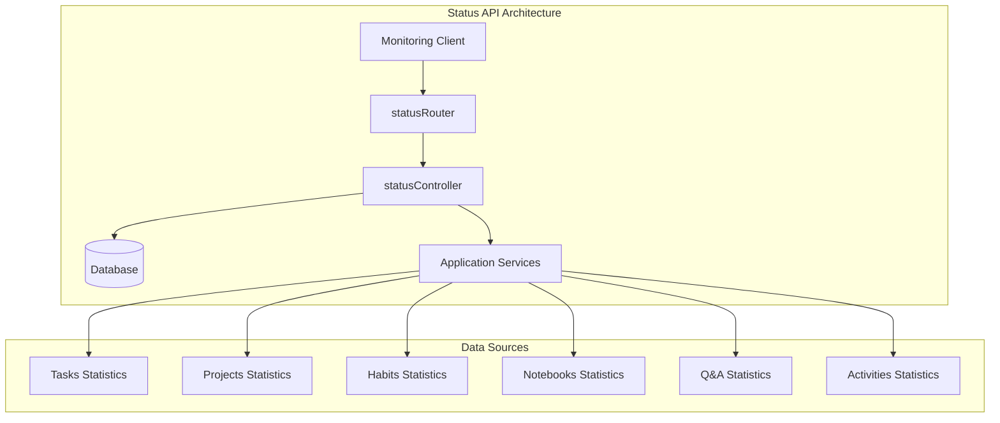
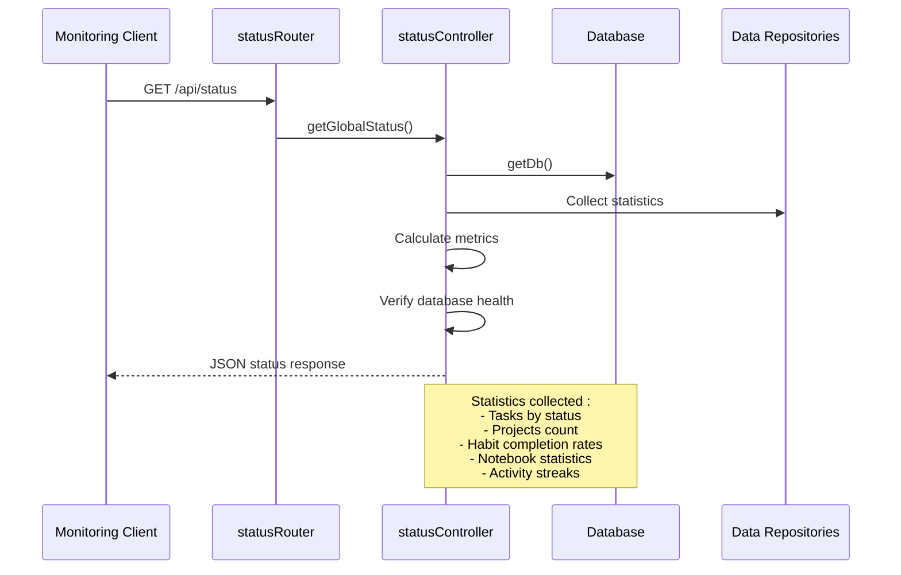
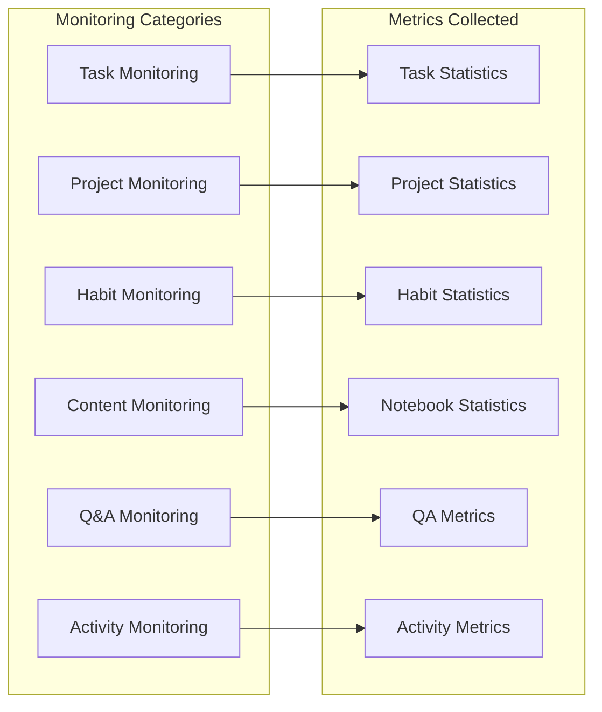
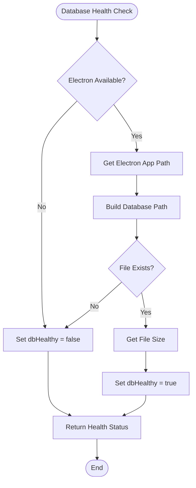
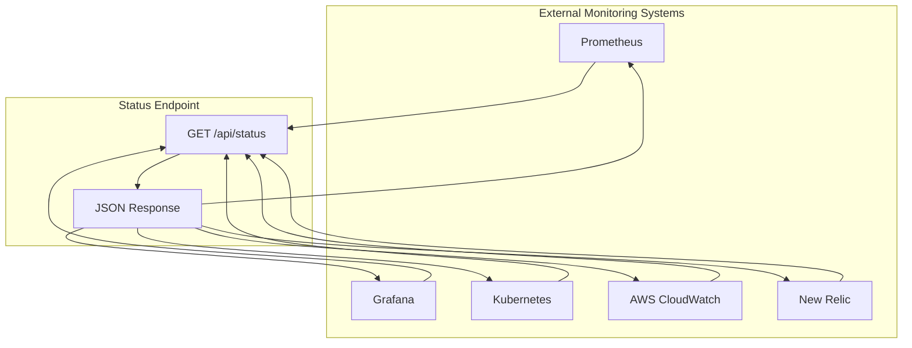

# Status API Routes

<cite>
**Referenced Files in This Document**
- [src/server/routes/status.ts](file://src/server/routes/status.ts)
- [src/server/controllers/statusController.ts](file://src/server/controllers/statusController.ts)
- [src/database/init.ts](file://src/database/init.ts)
- [src/server/mcp-server.ts](file://src/server/mcp-server.ts)
- [package.json](file://package.json)
- [src/services/settings.ts](file://src/services/settings.ts)
- [src/database/activitiesRepo.ts](file://src/database/activitiesRepo.ts)
- [src/database/qaRepo.ts](file://src/database/qaRepo.ts)
- [src/database/habitsRepo.ts](file://src/database/habitsRepo.ts)
- [src/database/notebookRepo.ts](file://src/database/notebookRepo.ts)
- [src/database/tasksRepo.ts](file://src/database/tasksRepo.ts)
</cite>

## Table of Contents
1. [Introduction](#introduction)
2. [API Endpoint Overview](#api-endpoint-overview)
3. [Health Check Implementation](#health-check-implementation)
4. [Response Format](#response-format)
5. [System Monitoring Features](#system-monitoring-features)
6. [Database Connectivity Verification](#database-connectivity-verification)
7. [Service Discovery Integration](#service-discovery-integration)
8. [Failure Modes and Error Handling](#failure-modes-and-error-handling)
9. [Extending Status Checks](#extending-status-checks)
10. [Monitoring Tool Integration](#monitoring-tool-integration)
11. [Best Practices](#best-practices)

## Introduction

The Status API routes provide comprehensive system health monitoring capabilities for the LifeOS application. The primary endpoint `/api/status` delivers real-time system status information, including database connectivity, service readiness, and detailed statistics across all major application modules. This endpoint serves as a critical component for service discovery, uptime tracking, and automated monitoring systems.

The status monitoring system is designed to provide both immediate health assessment and historical trend analysis, enabling administrators and monitoring tools to quickly identify issues and track system performance over time.

## API Endpoint Overview

The Status API consists of a single primary endpoint that provides comprehensive system health information:



**Diagram sources**
- [src/server/routes/status.ts](file://src/server/routes/status.ts#L1-L7)
- [src/server/controllers/statusController.ts](file://src/server/controllers/statusController.ts#L1-L151)

**Section sources**
- [src/server/routes/status.ts](file://src/server/routes/status.ts#L1-L7)

## Health Check Implementation

The health check endpoint implements a comprehensive system monitoring approach that goes beyond basic connectivity testing. The implementation performs multiple layers of health verification:

### Core Health Verification

The health check validates multiple system components simultaneously:

1. **Database Connectivity**: Verifies SQLite database accessibility and file system permissions
2. **Application State**: Confirms all required services are operational
3. **Statistics Collection**: Validates data aggregation across all application modules
4. **System Uptime**: Tracks cumulative uptime since application startup

### Implementation Details

The health check controller orchestrates the collection of various system metrics and aggregates them into a unified response format. The implementation uses a centralized approach where all statistics are gathered in a single request to minimize system overhead.



**Diagram sources**
- [src/server/controllers/statusController.ts](file://src/server/controllers/statusController.ts#L15-L151)

**Section sources**
- [src/server/controllers/statusController.ts](file://src/server/controllers/statusController.ts#L15-L151)

## Response Format

The status endpoint returns a structured JSON response containing comprehensive system health information:

### Standard Response Structure

```json
{
  "data": {
    "timestamp": "2024-01-15T10:30:00.000Z",
    "uptime": 3600,
    "version": "0.1.12",
    "modules": {
      "tasks": {
        "total": 150,
        "byStatus": {
          "backlog": 15,
          "todo": 45,
          "inProgress": 60,
          "completed": 30
        },
        "completionRate": 20
      },
      "projects": {
        "total": 8,
        "active": "Personal Productivity",
        "status": {
          "activeProjectId": 123
        }
      },
      "habits": {
        "total": 12,
        "active": 8,
        "completedToday": 5,
        "status": {
          "avgCompletionRate": 75
        }
      },
      "notebooks": {
        "total": 5,
        "notes": 120,
        "status": {
          "totalWords": 5000,
          "recentNotes": 15
        }
      },
      "qa": {
        "questions": 25,
        "answers": 18,
        "status": {
          "unanswered": 7,
          "inProgress": 3,
          "answered": 18
        }
      },
      "activities": {
        "today": 12,
        "thisWeek": 85,
        "streak": 5,
        "status": {
          "total": 1200,
          "byType": {
            "task": 800,
            "habit": 200,
            "note": 150,
            "project": 50
          }
        }
      }
    },
    "database": {
      "size": 1048576,
      "healthy": true
    }
  }
}
```

### Response Field Descriptions

| Field | Type | Description |
|-------|------|-------------|
| `timestamp` | string | ISO 8601 formatted timestamp of response generation |
| `uptime` | number | Application uptime in seconds since startup |
| `version` | string | Current application version from package.json |
| `modules.tasks.total` | number | Total number of tasks across all projects |
| `modules.tasks.completionRate` | number | Percentage of completed tasks (0-100) |
| `modules.projects.active` | string \| null | Name of currently active project |
| `modules.habits.completedToday` | number | Number of habits completed today |
| `modules.activities.streak` | number | Current consecutive activity streak |
| `database.size` | number | Database file size in bytes |
| `database.healthy` | boolean | Database connectivity and file system health |

**Section sources**
- [src/server/controllers/statusController.ts](file://src/server/controllers/statusController.ts#L82-L149)

## System Monitoring Features

The status endpoint provides comprehensive monitoring capabilities across all major application domains:

### Task Management Monitoring

Tracks task distribution across different states and completion trends:

- **Status Distribution**: Breakdown of tasks by status (Backlog, To-Do, In Progress, Completed)
- **Completion Rate**: Calculated percentage of completed versus total tasks
- **Trend Analysis**: Historical completion patterns and productivity metrics

### Project Activity Tracking

Monitors project engagement and progress:

- **Active Project**: Currently selected project for user interaction
- **Project Count**: Total number of configured projects
- **Status Indicators**: Active project identification for monitoring purposes

### Habit Completion Analytics

Provides insights into user habit formation:

- **Daily Completion**: Number of habits completed within the current day
- **Average Completion Rate**: Mean completion rate across all habits
- **Streak Tracking**: Current and longest streaks for habit completion

### Content Creation Metrics

Tracks user engagement with content creation features:

- **Notebook Statistics**: Total notebooks, notes, and word counts
- **Content Growth**: Recent content creation trends
- **Organization Metrics**: Content distribution across notebooks

### Q&A System Monitoring

Monitors knowledge management system health:

- **Question Distribution**: Breakdown of question statuses (unanswered, in-progress, answered)
- **Response Rates**: Percentage of questions receiving responses
- **Engagement Metrics**: User participation in Q&A activities

### Activity Stream Analytics

Provides comprehensive activity tracking:

- **Daily Activity**: Current day's activity count
- **Weekly Trends**: Activity patterns over the past week
- **Streak Calculation**: Consecutive days with activity
- **Type Distribution**: Breakdown by activity type (tasks, habits, notes, etc.)



**Diagram sources**
- [src/server/controllers/statusController.ts](file://src/server/controllers/statusController.ts#L20-L80)

**Section sources**
- [src/server/controllers/statusController.ts](file://src/server/controllers/statusController.ts#L20-L80)

## Database Connectivity Verification

The status endpoint implements robust database health verification that goes beyond simple connectivity checks:

### Database Health Assessment

The database health check performs multiple verification steps:

1. **File System Access**: Validates read/write permissions to the database directory
2. **File Existence**: Confirms the presence of the database file
3. **File Size Measurement**: Reports database file size for storage monitoring
4. **Connection Validation**: Ensures SQLite database operations are functional

### Implementation Approach

The database health check uses a dual-layer verification system:



**Diagram sources**
- [src/server/controllers/statusController.ts](file://src/server/controllers/statusController.ts#L60-L75)

### Database Path Resolution

The system uses Electron's path resolution to locate the database file:

- **Development Mode**: Uses project-relative paths for local development
- **Production Mode**: Utilizes Electron's userData directory for portable installations
- **Cross-Platform Compatibility**: Automatically adapts to different operating systems

### Error Handling

The database health check implements graceful error handling:

- **Missing Electron**: Falls back to unhealthy status when Electron is unavailable
- **Permission Issues**: Reports database as unhealthy when file access fails
- **Corruption Detection**: Implicitly detects corruption through file access failures

**Section sources**
- [src/server/controllers/statusController.ts](file://src/server/controllers/statusController.ts#L60-L75)
- [src/database/init.ts](file://src/database/init.ts#L20-L35)

## Service Discovery Integration

The status endpoint is designed to integrate seamlessly with modern service discovery and monitoring systems:

### RESTful Design

The endpoint follows RESTful principles for easy integration:

- **HTTP Method**: GET requests for status retrieval
- **Endpoint**: `/api/status` for comprehensive system status
- **Response Format**: JSON for machine-readable responses
- **Standard Headers**: Proper content-type and caching headers

### Monitoring Tool Compatibility

The response format is optimized for popular monitoring tools:

#### Prometheus Integration
```yaml
# Example Prometheus metrics extraction
lifeos_uptime_seconds 3600
lifeos_tasks_total 150
lifeos_tasks_completion_rate 20
lifeos_database_size_bytes 1048576
lifeos_database_health 1
```

#### Grafana Dashboards
The structured response enables comprehensive dashboard creation:
- Real-time system health indicators
- Historical trend analysis
- Alert threshold configuration
- Multi-dimensional filtering

#### Kubernetes Health Checks
The endpoint provides suitable responses for container orchestration:
- Readiness probes: Verify application functionality
- Liveness probes: Confirm system responsiveness
- Startup probes: Ensure proper initialization

### External Monitoring Integration

The status endpoint supports various external monitoring approaches:



**Section sources**
- [src/server/controllers/statusController.ts](file://src/server/controllers/statusController.ts#L82-L149)

## Failure Modes and Error Handling

The status endpoint implements comprehensive error handling to ensure reliable monitoring:

### Common Failure Scenarios

#### Database Unavailability
When the database is inaccessible or corrupted:

```json
{
  "data": {
    "timestamp": "2024-01-15T10:30:00.000Z",
    "uptime": 3600,
    "version": "0.1.12",
    "modules": {
      "tasks": {
        "total": 0,
        "byStatus": {
          "backlog": 0,
          "todo": 0,
          "inProgress": 0,
          "completed": 0
        },
        "completionRate": 0
      }
    },
    "database": {
      "size": 0,
      "healthy": false
    }
  }
}
```

#### Application Initialization Failure
During startup or configuration errors:

```json
{
  "error": {
    "code": "INITIALIZATION_FAILED",
    "message": "Application failed to initialize properly"
  }
}
```

#### Repository Access Errors
When individual data repositories fail:

```json
{
  "data": {
    "timestamp": "2024-01-15T10:30:00.000Z",
    "uptime": 3600,
    "version": "0.1.12",
    "modules": {
      "tasks": {
        "total": 0,
        "byStatus": {
          "backlog": 0,
          "todo": 0,
          "inProgress": 0,
          "completed": 0
        },
        "completionRate": 0
      }
    },
    "database": {
      "size": 1048576,
      "healthy": true
    }
  }
}
```

### Error Recovery Strategies

The system implements several error recovery mechanisms:

1. **Graceful Degradation**: Partial data collection continues despite individual failures
2. **Circuit Breaker Pattern**: Prevents cascading failures in dependent systems
3. **Timeout Management**: Limits response time to prevent monitoring system overload
4. **Fallback Values**: Provides sensible defaults when data collection fails

### Monitoring Best Practices

For effective monitoring integration:

- **Polling Intervals**: Configure appropriate intervals based on system load
- **Alert Thresholds**: Set meaningful thresholds for different metrics
- **Historical Baselines**: Establish baselines for trend analysis
- **Multi-Level Monitoring**: Combine endpoint monitoring with application logs

**Section sources**
- [src/server/controllers/statusController.ts](file://src/server/controllers/statusController.ts#L149-L151)

## Extending Status Checks

The status endpoint architecture supports extension for additional system components:

### Adding New Module Statistics

To add monitoring for new application modules:

1. **Repository Integration**: Create statistics collection functions in the repository layer
2. **Controller Updates**: Add statistics gathering in the status controller
3. **Response Formatting**: Include new metrics in the response structure
4. **Health Verification**: Implement appropriate health checks

### Extension Example Template

```typescript
// Example: Adding calendar module statistics
export async function getCalendarStats() {
  const db = getDb();
  const stats = db.prepare(`
    SELECT 
      COUNT(*) as total_events,
      SUM(CASE WHEN status = 'confirmed' THEN 1 ELSE 0 END) as confirmed,
      SUM(CASE WHEN status = 'tentative' THEN 1 ELSE 0 END) as tentative,
      SUM(CASE WHEN status = 'cancelled' THEN 1 ELSE 0 END) as cancelled
    FROM calendar_events
  `).get() as any;
  
  return {
    totalEvents: stats.total_events || 0,
    byStatus: {
      confirmed: stats.confirmed || 0,
      tentative: stats.tentative || 0,
      cancelled: stats.cancelled || 0
    }
  };
}
```

### Custom Health Checks

For specialized health verification:

```typescript
// Example: External service health check
async function checkExternalServiceHealth(): Promise<boolean> {
  try {
    const response = await fetch('https://api.external-service.com/health');
    return response.ok;
  } catch {
    return false;
  }
}
```

### Performance Considerations

When extending status checks:

- **Query Optimization**: Use efficient SQL queries to minimize impact
- **Caching Strategy**: Implement appropriate caching for frequently accessed data
- **Async Operations**: Use async/await to prevent blocking the main thread
- **Resource Limits**: Implement timeouts and resource limits for external checks

**Section sources**
- [src/server/controllers/statusController.ts](file://src/server/controllers/statusController.ts#L20-L80)

## Monitoring Tool Integration

The status endpoint provides excellent compatibility with various monitoring and observability platforms:

### Prometheus Integration

Configure Prometheus to scrape the status endpoint:

```yaml
scrape_configs:
  - job_name: 'lifeos'
    static_configs:
      - targets: ['localhost:3000']
    metrics_path: '/api/status'
    scrape_interval: 30s
```

### Grafana Dashboard Setup

Create comprehensive dashboards using the structured response:

1. **System Health Panel**: Display overall system status and database health
2. **Activity Trends**: Show daily, weekly, and monthly activity patterns
3. **User Engagement**: Track task completion rates and habit adherence
4. **Resource Usage**: Monitor database size growth and system performance

### Alert Configuration

Set up alerts for critical system conditions:

```yaml
groups:
  - name: lifeos_alerts
    rules:
      - alert: LifeOSDatabaseDown
        expr: lifeos_database_healthy == 0
        for: 1m
        labels:
          severity: critical
        annotations:
          summary: "LifeOS database is down"
          
      - alert: LowTaskCompletionRate
        expr: lifeos_tasks_completion_rate < 10
        for: 5m
        labels:
          severity: warning
        annotations:
          summary: "Low task completion rate detected"
```

### Kubernetes Integration

Deploy monitoring configurations for containerized deployments:

```yaml
apiVersion: v1
kind: ConfigMap
metadata:
  name: lifeos-monitoring
data:
  prometheus.yml: |
    global:
      scrape_interval: 15s
    scrape_configs:
      - job_name: 'lifeos'
        kubernetes_sd_configs:
          - role: pod
        relabel_configs:
          - source_labels: [__meta_kubernetes_pod_label_app]
            action: keep
            regex: lifeos
```

**Section sources**
- [src/server/mcp-server.ts](file://src/server/mcp-server.ts#L35-L40)

## Best Practices

### Monitoring Strategy

1. **Comprehensive Coverage**: Monitor both system health and user engagement metrics
2. **Proactive Alerting**: Set up alerts for both immediate failures and gradual degradation
3. **Historical Analysis**: Store historical data for trend analysis and capacity planning
4. **Load Testing**: Regularly test monitoring endpoints under load conditions

### Security Considerations

1. **Access Control**: Restrict status endpoint access to authorized monitoring systems
2. **Data Sensitivity**: Avoid exposing sensitive user data in status responses
3. **Rate Limiting**: Implement rate limiting to prevent abuse of monitoring endpoints
4. **Encryption**: Use HTTPS for all monitoring communications

### Performance Optimization

1. **Efficient Queries**: Optimize database queries to minimize monitoring overhead
2. **Caching Strategy**: Implement appropriate caching for frequently accessed data
3. **Asynchronous Processing**: Use asynchronous operations for non-critical statistics
4. **Resource Management**: Monitor and limit resource consumption by monitoring systems

### Maintenance Procedures

1. **Regular Review**: Periodically review monitoring configurations and alert thresholds
2. **Documentation**: Maintain up-to-date documentation for monitoring procedures
3. **Testing**: Regularly test monitoring systems to ensure reliability
4. **Capacity Planning**: Monitor growth trends to plan for future scaling needs

The Status API routes provide a robust foundation for system monitoring and health tracking, enabling comprehensive oversight of the LifeOS application across all operational dimensions.