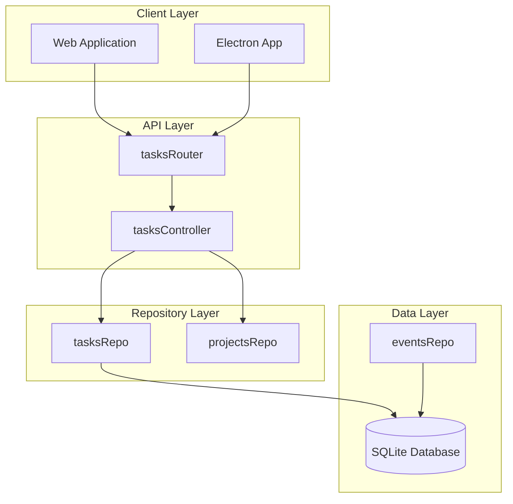
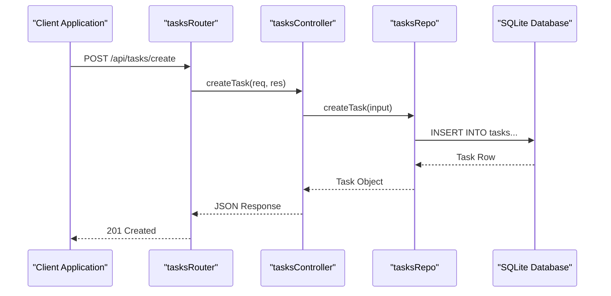
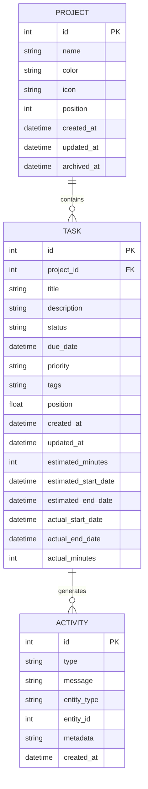
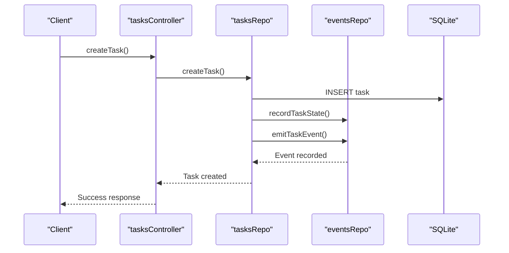

# Tasks API Routes

<cite>
**Referenced Files in This Document**
- [tasks.ts](file://src/server/routes/tasks.ts)
- [tasksController.ts](file://src/server/controllers/tasksController.ts)
- [tasksRepo.ts](file://src/database/tasksRepo.ts)
- [types.ts](file://src/common/types.ts)
- [init.ts](file://src/database/init.ts)
- [types.ts](file://src/database/types.ts)
- [tasks.ts](file://src/main/ipc/tasks.ts)
- [errorHandler.ts](file://src/server/middleware/errorHandler.ts)
- [projectsController.ts](file://src/server/controllers/projectsController.ts)
</cite>

## Table of Contents
1. [Introduction](#introduction)
2. [API Architecture Overview](#api-architecture-overview)
3. [Tasks Router Integration](#tasks-router-integration)
4. [Available Endpoints](#available-endpoints)
5. [Validation Schema](#validation-schema)
6. [Task-Project Relationship](#task-project-relationship)
7. [Common Usage Scenarios](#common-usage-scenarios)
8. [Error Handling](#error-handling)
9. [Response Formats](#response-formats)
10. [Implementation Details](#implementation-details)

## Introduction

The Tasks API provides comprehensive endpoints for managing tasks within projects in the LifeOS application. Built on Express.js, the API follows RESTful principles and includes robust validation, error handling, and real-time event tracking capabilities. Tasks are tightly coupled with projects, allowing for hierarchical organization and efficient querying patterns.

## API Architecture Overview

The Tasks API follows a layered architecture pattern with clear separation of concerns:



**Diagram sources**
- [tasks.ts](file://src/server/routes/tasks.ts#L1-L26)
- [tasksController.ts](file://src/server/controllers/tasksController.ts#L1-L140)
- [tasksRepo.ts](file://src/database/tasksRepo.ts#L1-L211)

**Section sources**
- [tasks.ts](file://src/server/routes/tasks.ts#L1-L26)
- [tasksController.ts](file://src/server/controllers/tasksController.ts#L1-L140)

## Tasks Router Integration

The tasksRouter is a dedicated Express router that handles all task-related operations. It integrates seamlessly with the main Express application through the standard routing mechanism.



**Diagram sources**
- [tasks.ts](file://src/server/routes/tasks.ts#L6-L7)
- [tasksController.ts](file://src/server/controllers/tasksController.ts#L5-L11)
- [tasksRepo.ts](file://src/database/tasksRepo.ts#L58-L95)

**Section sources**
- [tasks.ts](file://src/server/routes/tasks.ts#L1-L26)
- [tasksController.ts](file://src/server/controllers/tasksController.ts#L1-L140)

## Available Endpoints

### 1. Create Task

**Endpoint:** `POST /api/tasks/create`

Creates a new task within a specified project.

**HTTP Method:** POST  
**Content-Type:** `application/json`  
**Authentication:** Required (via middleware)

| Parameter | Type | Location | Required | Description |
|-----------|------|----------|----------|-------------|
| projectId | number | Body | Yes | ID of the project to associate the task with |
| title | string | Body | Yes | Task title (1-200 characters) |
| description | string | Body | No | Task description (up to 4000 characters) |
| status | string | Body | No | Task status (defaults to 'To-Do') |
| dueDate | string | Body | No | ISO 8601 date string |
| priority | string | Body | No | Task priority level |
| tags | string[] | Body | No | Array of tag strings (each up to 30 characters) |
| position | number | Body | No | Task position within status column |

**Response Format:**
```json
{
  "data": {
    "id": 1,
    "projectId": 1,
    "title": "Sample Task",
    "description": "Task description",
    "status": "To-Do",
    "dueDate": "2024-01-15T10:00:00Z",
    "priority": "High",
    "tags": ["urgent", "work"],
    "position": 1,
    "createdAt": "2024-01-10T09:00:00Z",
    "updatedAt": "2024-01-10T09:00:00Z"
  }
}
```

### 2. Get Task by ID

**Endpoint:** `GET /api/tasks/:id`

Retrieves a specific task by its ID.

**HTTP Method:** GET  
**Authentication:** Required

| Parameter | Type | Location | Required | Description |
|-----------|------|----------|----------|-------------|
| id | number | Path | Yes | Task ID to retrieve |

**Response Format:**
```json
{
  "data": {
    "id": 1,
    "projectId": 1,
    "title": "Sample Task",
    "description": "Task description",
    "status": "To-Do",
    "dueDate": "2024-01-15T10:00:00Z",
    "priority": "High",
    "tags": ["urgent", "work"],
    "position": 1,
    "createdAt": "2024-01-10T09:00:00Z",
    "updatedAt": "2024-01-10T09:00:00Z"
  }
}
```

### 3. List Tasks by Project

**Endpoint:** `GET /api/tasks/project/:projectId`

Retrieves all tasks associated with a specific project, ordered by status, position, and ID.

**HTTP Method:** GET  
**Authentication:** Required

| Parameter | Type | Location | Required | Description |
|-----------|------|----------|----------|-------------|
| projectId | number | Path | Yes | Project ID to filter tasks |

**Response Format:**
```json
{
  "data": [
    {
      "id": 1,
      "projectId": 1,
      "title": "First Task",
      "status": "To-Do",
      "position": 1
    },
    {
      "id": 2,
      "projectId": 1,
      "title": "Second Task",
      "status": "In Progress",
      "position": 1
    }
  ]
}
```

### 4. Update Task

**Endpoint:** `PUT /api/tasks/:id`

Updates an existing task with new data.

**HTTP Method:** PUT  
**Content-Type:** `application/json`  
**Authentication:** Required

| Parameter | Type | Location | Required | Description |
|-----------|------|----------|----------|-------------|
| id | number | Path | Yes | Task ID to update |
| title | string | Body | No | Updated task title |
| description | string | Body | No | Updated task description |
| status | string | Body | No | Updated task status |
| dueDate | string | Body | No | Updated due date |
| priority | string | Body | No | Updated priority |
| tags | string[] | Body | No | Updated tags array |
| position | number | Body | No | New task position |
| projectId | number | Body | No | New project ID |
| estimatedMinutes | number | Body | No | Estimated time in minutes |
| estimatedStartDate | string | Body | No | Estimated start date |
| estimatedEndDate | string | Body | No | Estimated end date |
| actualStartDate | string | Body | No | Actual start date |
| actualEndDate | string | Body | No | Actual end date |
| actualMinutes | number | Body | No | Actual time spent |

### 5. Delete Task

**Endpoint:** `DELETE /api/tasks/:id`

Deletes a specific task by ID.

**HTTP Method:** DELETE  
**Authentication:** Required

| Parameter | Type | Location | Required | Description |
|-----------|------|----------|----------|-------------|
| id | number | Path | Yes | Task ID to delete |

**Response Format:**
```json
{
  "data": {
    "success": true,
    "id": 1
  }
}
```

### 6. Move Task

**Endpoint:** `PUT /api/tasks/:id/move`

Moves a task to a different project and/or status column.

**HTTP Method:** PUT  
**Content-Type:** `application/json`  
**Authentication:** Required

| Parameter | Type | Location | Required | Description |
|-----------|------|----------|----------|-------------|
| id | number | Path | Yes | Task ID to move |
| projectId | number | Body | Yes | Target project ID |
| status | string | Body | Yes | Target status column |
| position | number | Body | Yes | Target position within status |

### 7. Get All Tasks Status

**Endpoint:** `GET /api/tasks/`

Retrieves aggregated statistics about all tasks in the system.

**HTTP Method:** GET  
**Authentication:** Required

**Response Format:**
```json
{
  "data": {
    "total": 100,
    "byStatus": {
      "backlog": 10,
      "todo": 30,
      "inProgress": 40,
      "completed": 20
    },
    "byPriority": {
      "critical": 5,
      "high": 25,
      "medium": 40,
      "low": 30
    },
    "avgEstimatedMinutes": 120,
    "avgActualMinutes": 150,
    "completionRate": 20
  }
}
```

**Section sources**
- [tasks.ts](file://src/server/routes/tasks.ts#L1-L26)
- [tasksController.ts](file://src/server/controllers/tasksController.ts#L5-L139)

## Validation Schema

The Tasks API employs Zod-based validation for all incoming requests, ensuring data integrity and type safety.

### Create Task Schema

```typescript
const createTaskSchema = z.object({
  projectId: z.number().int().positive(),
  title: z.string().min(1).max(200),
  description: z.string().max(4000).optional(),
  status: z.string().min(1).max(50).default('To-Do'),
  dueDate: z.string().datetime().optional(),
  priority: z.string().max(50).optional(),
  tags: z.array(z.string().max(30)).optional(),
  position: z.number().optional()
});
```

### Update Task Schema

```typescript
const updateTaskSchema = z.object({
  id: z.number().int().positive(),
  payload: z.object({
    title: z.string().min(1).max(200).optional(),
    description: z.string().max(4000).optional().nullable(),
    status: z.string().min(1).max(50).optional(),
    dueDate: z.string().datetime().optional().nullable(),
    priority: z.string().max(50).optional().nullable(),
    tags: z.array(z.string().max(30)).optional().nullable(),
    position: z.number().optional(),
    projectId: z.number().int().positive().optional(),
    estimatedMinutes: z.number().int().positive().optional().nullable(),
    estimatedStartDate: z.string().datetime().optional().nullable(),
    estimatedEndDate: z.string().datetime().optional().nullable(),
    actualStartDate: z.string().datetime().optional().nullable(),
    actualEndDate: z.string().datetime().optional().nullable(),
    actualMinutes: z.number().int().positive().optional().nullable()
  })
});
```

### Move Task Schema

```typescript
const moveTaskSchema = z.object({
  id: z.number().int().positive(),
  projectId: z.number().int().positive(),
  status: z.string().min(1).max(50),
  position: z.number()
});
```

**Section sources**
- [tasksRepo.ts](file://src/database/tasksRepo.ts#L8-L47)

## Task-Project Relationship

Tasks are designed to be hierarchical children of projects, with strong referential integrity enforced through database constraints.



**Diagram sources**
- [init.ts](file://src/database/init.ts#L40-L60)
- [types.ts](file://src/database/types.ts#L15-L30)

### Filtering and Association Patterns

Tasks can be filtered and queried using several patterns:

1. **Project-based Filtering**: Retrieve all tasks for a specific project using `/api/tasks/project/:projectId`
2. **Status-based Organization**: Tasks are automatically ordered by status, position, and ID
3. **Cross-project Operations**: Tasks can be moved between projects using the move endpoint
4. **Aggregated Statistics**: Get project-level task statistics through the projects controller

**Section sources**
- [tasksRepo.ts](file://src/database/tasksRepo.ts#L52-L57)
- [projectsController.ts](file://src/server/controllers/projectsController.ts#L85-L133)

## Common Usage Scenarios

### Scenario 1: Creating a New Task

```javascript
// Example: Create a task in project 1
fetch('/api/tasks/create', {
  method: 'POST',
  headers: { 'Content-Type': 'application/json' },
  body: JSON.stringify({
    projectId: 1,
    title: 'Implement API Endpoint',
    description: 'Create the tasks API endpoint with proper validation',
    status: 'To-Do',
    priority: 'High',
    tags: ['backend', 'api'],
    dueDate: '2024-01-15T10:00:00Z'
  })
})
.then(response => response.json())
.then(data => console.log('Task created:', data.data));
```

### Scenario 2: Retrieving All Tasks for a Project

```javascript
// Example: Get all tasks for project 1
fetch('/api/tasks/project/1')
.then(response => response.json())
.then(data => {
  console.log('Tasks:', data.data);
  // Tasks will be ordered by status, position, and ID
});
```

### Scenario 3: Updating Task Status

```javascript
// Example: Mark task as completed
fetch('/api/tasks/1', {
  method: 'PUT',
  headers: { 'Content-Type': 'application/json' },
  body: JSON.stringify({
    status: 'Completed',
    actualMinutes: 120,
    actualEndDate: new Date().toISOString()
  })
})
.then(response => response.json())
.then(data => console.log('Task updated:', data.data));
```

### Scenario 4: Moving a Task Between Projects

```javascript
// Example: Move task to another project
fetch('/api/tasks/1/move', {
  method: 'PUT',
  headers: { 'Content-Type': 'application/json' },
  body: JSON.stringify({
    projectId: 2,
    status: 'In Progress',
    position: 1
  })
})
.then(response => response.json())
.then(data => console.log('Task moved:', data.data));
```

### Scenario 5: Getting Task Statistics

```javascript
// Example: Get overall task statistics
fetch('/api/tasks/')
.then(response => response.json())
.then(data => {
  console.log('Task Stats:', {
    totalTasks: data.data.total,
    completionRate: `${data.data.completionRate}%`,
    averageTime: `${data.data.avgActualMinutes} minutes`
  });
});
```

**Section sources**
- [tasksController.ts](file://src/server/controllers/tasksController.ts#L5-L139)
- [tasksRepo.ts](file://src/database/tasksRepo.ts#L58-L210)

## Error Handling

The Tasks API implements comprehensive error handling with standardized response formats and appropriate HTTP status codes.

### Standard Error Response Format

```json
{
  "error": {
    "code": "ERROR_CODE",
    "message": "Human-readable error message",
    "details": {
      // Additional error details (optional)
    }
  }
}
```

### Common Error Codes

| Error Code | HTTP Status | Description | Example Scenario |
|------------|-------------|-------------|------------------|
| `VALIDATION_ERROR` | 400 | Request data failed validation | Invalid task title length |
| `NOT_FOUND` | 404 | Resource not found | Task ID doesn't exist |
| `INTERNAL_SERVER_ERROR` | 500 | Unexpected server error | Database connection failure |

### Validation Error Details

When validation fails, the API returns detailed information about what went wrong:

```json
{
  "error": {
    "code": "VALIDATION_ERROR",
    "message": "Invalid request data",
    "details": [
      {
        "code": "too_small",
        "minimum": 1,
        "type": "string",
        "inclusive": true,
        "path": ["title"],
        "message": "String must contain at least 1 character(s)"
      }
    ]
  }
}
```

**Section sources**
- [errorHandler.ts](file://src/server/middleware/errorHandler.ts#L10-L69)
- [tasksController.ts](file://src/server/controllers/tasksController.ts#L15-L25)

## Response Formats

### Successful Responses

All successful API responses follow a consistent JSON structure:

```json
{
  "data": {
    // Actual response data
  }
}
```

### Status Codes

| HTTP Status | Description | Usage |
|-------------|-------------|-------|
| 200 | OK | Successful GET requests |
| 201 | Created | Successful POST requests |
| 204 | No Content | Successful DELETE requests |
| 400 | Bad Request | Validation errors |
| 404 | Not Found | Resource not found |
| 500 | Internal Server Error | Unexpected server errors |

### Task Object Structure

```typescript
interface Task {
  id: number;
  projectId: number;
  title: string;
  description?: string | null;
  status: string;
  dueDate?: string | null;
  priority?: string | null;
  tags?: string[];
  position: number;
  createdAt: string;
  updatedAt: string;
  estimatedMinutes?: number | null;
  estimatedStartDate?: string | null;
  estimatedEndDate?: string | null;
  actualStartDate?: string | null;
  actualEndDate?: string | null;
  actualMinutes?: number | null;
}
```

**Section sources**
- [types.ts](file://src/common/types.ts#L8-L25)
- [errorHandler.ts](file://src/server/middleware/errorHandler.ts#L10-L69)

## Implementation Details

### Database Schema

The tasks table is designed for efficient querying and hierarchical organization:

```sql
CREATE TABLE tasks (
    id INTEGER PRIMARY KEY AUTOINCREMENT,
    project_id INTEGER NOT NULL REFERENCES projects(id) ON DELETE CASCADE,
    title TEXT NOT NULL,
    description TEXT,
    status TEXT NOT NULL DEFAULT 'To-Do',
    due_date TEXT,
    priority TEXT,
    tags TEXT,
    position REAL NOT NULL DEFAULT 0,
    created_at TEXT NOT NULL DEFAULT CURRENT_TIMESTAMP,
    updated_at TEXT NOT NULL DEFAULT CURRENT_TIMESTAMP,
    estimated_minutes INTEGER,
    estimated_start_date TEXT,
    estimated_end_date TEXT,
    actual_start_date TEXT,
    actual_end_date TEXT,
    actual_minutes INTEGER
);
```

### Indexing Strategy

The database includes several indexes for optimal performance:

- `idx_tasks_project_status`: Speeds up project-based queries
- `idx_tasks_due_date`: Enables due date filtering
- `idx_tasks_updated_at`: Supports sorting by modification time

### Event Tracking

The API includes sophisticated event tracking for task state changes:



**Diagram sources**
- [tasksRepo.ts](file://src/database/tasksRepo.ts#L95-L105)
- [tasksRepo.ts](file://src/database/tasksRepo.ts#L175-L185)

### IPC Integration

The Tasks API is also exposed through Electron's Inter-Process Communication (IPC) system for desktop application functionality:

```typescript
// IPC handler registration
ipcMain.handle('tasks:create', wrapIpc((_, payload) => {
  return createTask({ ...payload, status: payload.status ?? 'To-Do' });
}));
```

**Section sources**
- [init.ts](file://src/database/init.ts#L40-L60)
- [tasks.ts](file://src/main/ipc/tasks.ts#L1-L37)
- [tasksRepo.ts](file://src/database/tasksRepo.ts#L95-L105)