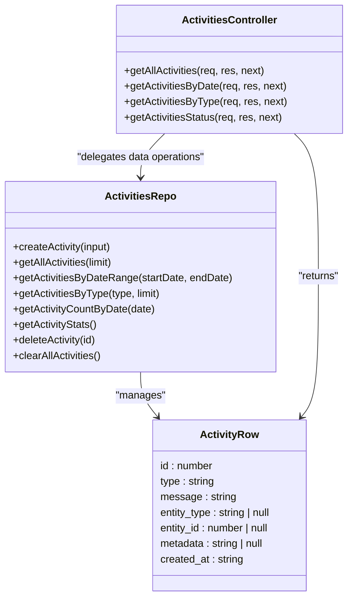
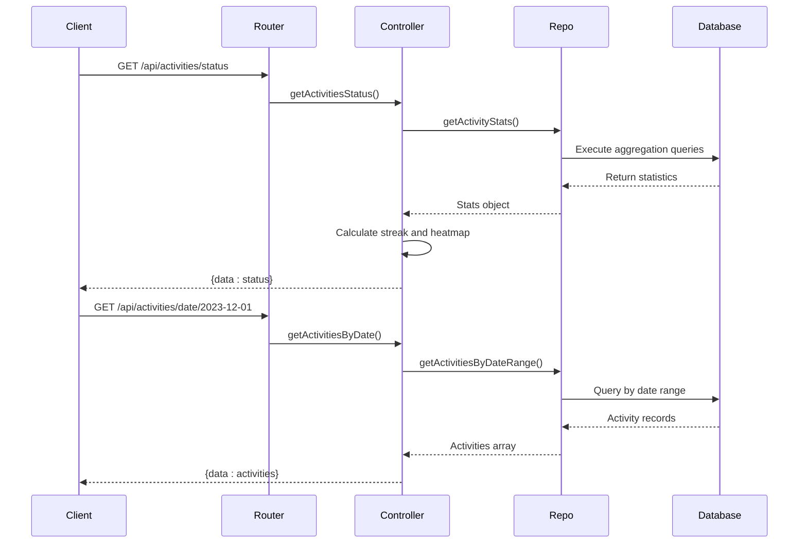
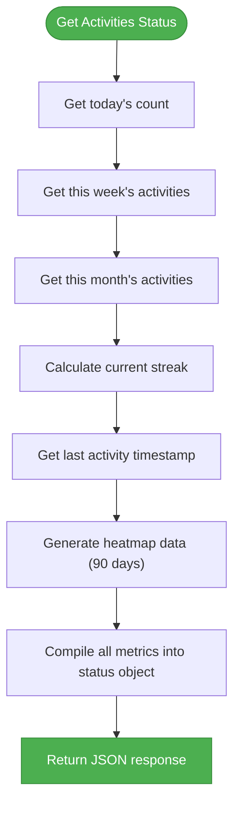
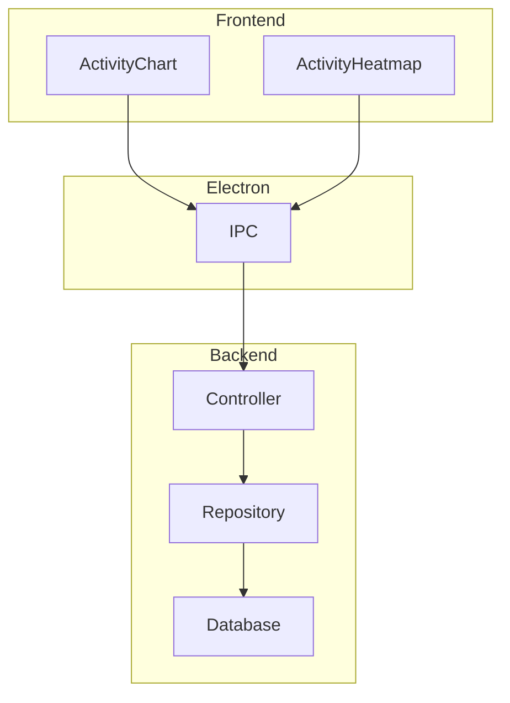

# Activities Controller

<cite>
**Referenced Files in This Document**   
- [activitiesController.ts](file://src/server/controllers/activitiesController.ts)
- [activitiesRepo.ts](file://src/database/activitiesRepo.ts)
- [activities.ts](file://src/server/routes/activities.ts)
- [types.ts](file://src/common/types.ts)
- [activity.ts](file://src/store/activity.ts)
- [init.ts](file://src/database/init.ts)
- [ActivityChart.tsx](file://src/renderer/components/ActivityChart.tsx)
- [ActivityHeatmap.tsx](file://src/renderer/components/ActivityHeatmap.tsx)
</cite>

## Table of Contents
1. [Introduction](#introduction)
2. [Core Functionality](#core-functionality)
3. [API Endpoints](#api-endpoints)
4. [Data Aggregation Methods](#data-aggregation-methods)
5. [Request Parameters and Filtering](#request-parameters-and-filtering)
6. [Response Structures](#response-structures)
7. [Error Handling](#error-handling)
8. [Performance Considerations](#performance-considerations)
9. [Integration with Frontend Components](#integration-with-frontend-components)
10. [Extensibility and Customization](#extensibility-and-customization)

## Introduction

The Activities Controller serves as the central component for recording, retrieving, and analyzing user activity data within the LifeOS application. It provides a comprehensive system for tracking user interactions across various features including tasks, projects, habits, and notebooks. The controller enables analytics and visualization capabilities by exposing RESTful endpoints that support flexible querying, aggregation, and reporting of activity data. This documentation details the architecture, functionality, and usage patterns of the Activities Controller, focusing on its role in supporting data-driven insights through heatmap and chart visualizations.

**Section sources**
- [activitiesController.ts](file://src/server/controllers/activitiesController.ts#L1-L109)
- [activitiesRepo.ts](file://src/database/activitiesRepo.ts#L1-L140)

## Core Functionality

The Activities Controller implements a robust system for managing user activity data through a repository pattern that separates concerns between data access and business logic. It provides comprehensive CRUD operations for activity records while supporting advanced querying capabilities for analytics purposes. The controller leverages the activitiesRepo to interact with the SQLite database, ensuring efficient data retrieval and storage operations. Key responsibilities include logging user actions, supporting date-based and type-based filtering, calculating activity statistics, and generating data structures optimized for visualization components.



**Diagram sources**
- [activitiesController.ts](file://src/server/controllers/activitiesController.ts#L1-L109)
- [activitiesRepo.ts](file://src/database/activitiesRepo.ts#L1-L140)

**Section sources**
- [activitiesController.ts](file://src/server/controllers/activitiesController.ts#L1-L109)
- [activitiesRepo.ts](file://src/database/activitiesRepo.ts#L1-L140)

## API Endpoints

The Activities Controller exposes a set of RESTful endpoints through the activitiesRouter, enabling clients to retrieve activity data based on various criteria. These endpoints support different filtering strategies including date ranges, activity types, and comprehensive status reporting. The controller follows Express.js middleware patterns, with each endpoint wrapped in error handling to ensure robust exception management. The routing configuration establishes clear URL patterns that map directly to controller functions, providing a predictable API surface for frontend consumption.



**Diagram sources**
- [activities.ts](file://src/server/routes/activities.ts#L1-L17)
- [activitiesController.ts](file://src/server/controllers/activitiesController.ts#L1-L109)
- [activitiesRepo.ts](file://src/database/activitiesRepo.ts#L1-L140)

**Section sources**
- [activities.ts](file://src/server/routes/activities.ts#L1-L17)
- [activitiesController.ts](file://src/server/controllers/activitiesController.ts#L1-L109)

## Data Aggregation Methods

The Activities Controller employs sophisticated aggregation methods to generate analytics-ready data for visualization components. The getActivitiesStatus endpoint calculates key metrics including daily, weekly, and monthly activity counts, current streaks, and heatmap data spanning the last 90 days. These aggregations are performed through targeted database queries that leverage SQLite's date functions and counting capabilities. The controller combines multiple query results to construct a comprehensive status object that powers dashboard visualizations, with particular emphasis on temporal patterns and user engagement metrics.



**Diagram sources**
- [activitiesController.ts](file://src/server/controllers/activitiesController.ts#L50-L109)
- [activitiesRepo.ts](file://src/database/activitiesRepo.ts#L80-L138)

**Section sources**
- [activitiesController.ts](file://src/server/controllers/activitiesController.ts#L50-L109)

## Request Parameters and Filtering

The Activities Controller supports flexible filtering through query parameters and route parameters, enabling clients to retrieve specific subsets of activity data. Date-based filtering uses URL path parameters to specify target dates, while type-based filtering allows retrieval of activities by their classification. The controller also supports pagination through the limit query parameter, which controls the number of records returned in list operations. These filtering mechanisms are implemented consistently across endpoints, providing a uniform interface for data retrieval that accommodates various use cases from detailed analysis to summary reporting.

**API Request Parameters**

| Endpoint | Parameter | Type | Required | Default | Description |
|---------|---------|------|----------|---------|-------------|
| GET /activities | limit | number | No | 500 | Maximum number of activities to return |
| GET /activities/date/:date | date | string (YYYY-MM-DD) | Yes | N/A | Target date for activity retrieval |
| GET /activities/type/:type | type | string | Yes | N/A | Activity type to filter by |
| GET /activities/type/:type | limit | number | No | 100 | Maximum number of activities to return |
| GET /activities/status | None | - | - | - | No parameters required |

**Section sources**
- [activitiesController.ts](file://src/server/controllers/activitiesController.ts#L1-L109)
- [activities.ts](file://src/server/routes/activities.ts#L1-L17)

## Response Structures

The Activities Controller returns standardized JSON responses containing activity data in a consistent format. All successful responses follow the pattern { data: responseData }, where responseData varies based on the endpoint. The controller leverages the ApiResponse interface defined in common types to ensure response consistency across the application. For list operations, the response includes arrays of activity objects with complete metadata, while status endpoints return aggregated metrics and calculated values. This structured approach enables reliable client-side processing and integration with visualization components.

**Response Structure for GET /activities/status**

```json
{
  "data": {
    "today": 5,
    "thisWeek": 23,
    "thisMonth": 89,
    "byType": {
      "task": 45,
      "project": 12,
      "habit": 32
    },
    "streak": 7,
    "lastActivityAt": "2023-12-01T14:30:00Z",
    "heatmapData": [
      {
        "date": "2023-09-03",
        "count": 3
      },
      {
        "date": "2023-09-04",
        "count": 5
      }
    ]
  }
}
```

**Section sources**
- [activitiesController.ts](file://src/server/controllers/activitiesController.ts#L50-L109)
- [types.ts](file://src/common/types.ts#L1-L117)

## Error Handling

The Activities Controller implements comprehensive error handling through Express.js middleware patterns, ensuring robust exception management across all endpoints. Each controller function wraps its logic in try-catch blocks, capturing any errors that occur during execution and passing them to the next middleware function for centralized error processing. This approach prevents unhandled exceptions from crashing the server while providing meaningful error information to clients. The error handling strategy focuses on maintaining application stability and providing diagnostic information without exposing sensitive implementation details.

**Section sources**
- [activitiesController.ts](file://src/server/controllers/activitiesController.ts#L1-L109)

## Performance Considerations

The Activities Controller incorporates several performance optimizations to handle large activity logs efficiently. Database queries leverage indexed columns, particularly on the created_at and type fields, to accelerate data retrieval operations. The controller implements pagination through the limit parameter to prevent excessive memory usage when retrieving large datasets. For aggregation operations, the controller uses targeted SQL queries with appropriate date functions rather than loading all data into memory. Additionally, the database schema includes optimized indexes on frequently queried columns, and the repository methods are designed to minimize the number of database round-trips required for common operations.

```mermaid
erDiagram
ACTIVITIES {
integer id PK
string type
string message
string entity_type
integer entity_id
string metadata
datetime created_at
}
index idx_activities_created_at on ACTIVITIES(created_at DESC)
index idx_activities_type on ACTIVITIES(type)
```

**Diagram sources**
- [init.ts](file://src/database/init.ts#L1-L150)
- [activitiesRepo.ts](file://src/database/activitiesRepo.ts#L1-L140)

**Section sources**
- [init.ts](file://src/database/init.ts#L1-L150)
- [activitiesRepo.ts](file://src/database/activitiesRepo.ts#L1-L140)

## Integration with Frontend Components

The Activities Controller serves as the data backbone for several frontend visualization components, particularly the ActivityChart and ActivityHeatmap. These components consume the controller's endpoints to render time-series data and engagement patterns, transforming raw activity records into meaningful visual representations. The controller's API design aligns with the data requirements of these components, providing appropriately structured responses that minimize client-side processing. The integration is facilitated through the IPC layer, which bridges the Electron main process with the renderer process, enabling seamless data flow from the database to the user interface.



**Diagram sources**
- [ActivityChart.tsx](file://src/renderer/components/ActivityChart.tsx#L1-L230)
- [ActivityHeatmap.tsx](file://src/renderer/components/ActivityHeatmap.tsx#L1-L266)
- [activitiesController.ts](file://src/server/controllers/activitiesController.ts#L1-L109)

**Section sources**
- [ActivityChart.tsx](file://src/renderer/components/ActivityChart.tsx#L1-L230)
- [ActivityHeatmap.tsx](file://src/renderer/components/ActivityHeatmap.tsx#L1-L266)
- [activity.ts](file://src/store/activity.ts#L1-L69)

## Extensibility and Customization

The Activities Controller architecture supports extensibility for custom event types and integration with external productivity tools. The flexible activity schema accommodates various event types through the type field, allowing new categories of user actions to be tracked without schema modifications. The metadata field provides additional extensibility by supporting arbitrary JSON data associated with each activity. This design enables integration with external tools by defining custom event types and storing relevant contextual information in the metadata. The controller's modular design also facilitates the addition of new endpoints or modification of existing ones to support specialized reporting requirements or third-party integrations.

**Section sources**
- [activitiesRepo.ts](file://src/database/activitiesRepo.ts#L1-L140)
- [types.ts](file://src/common/types.ts#L1-L117)