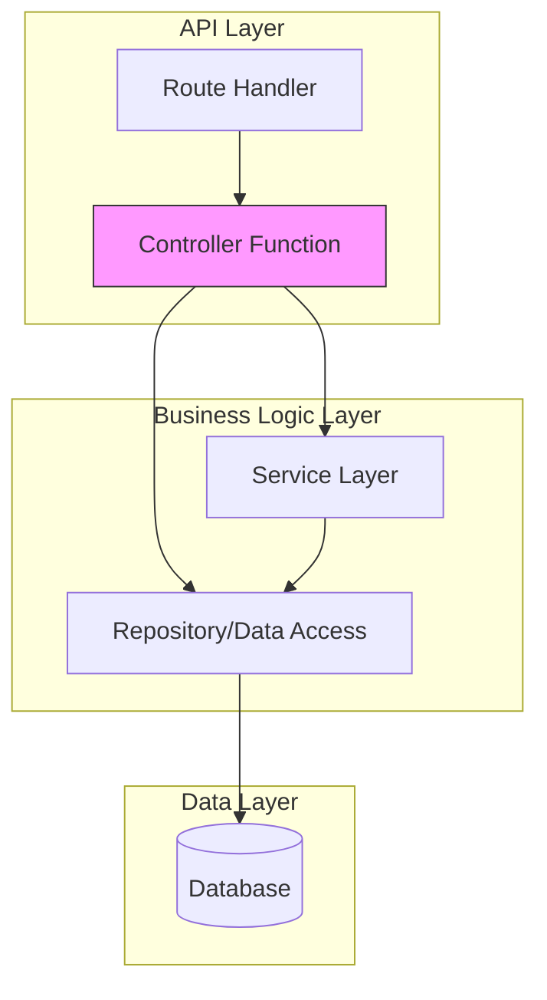
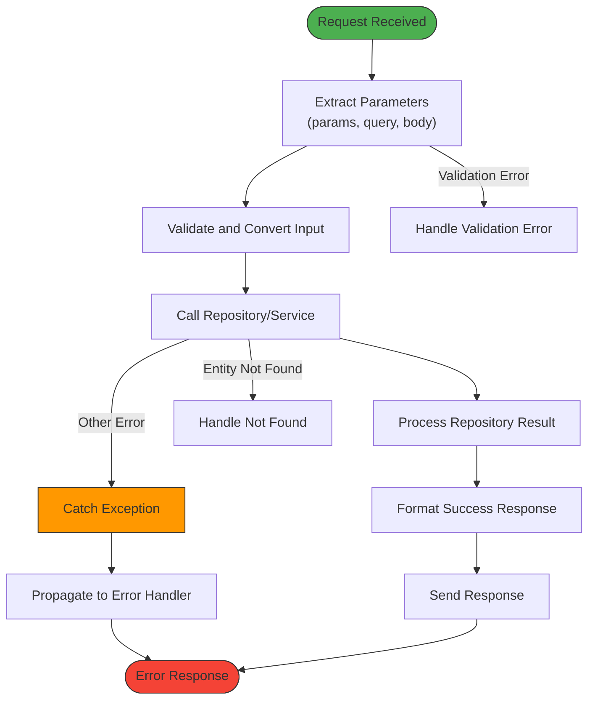
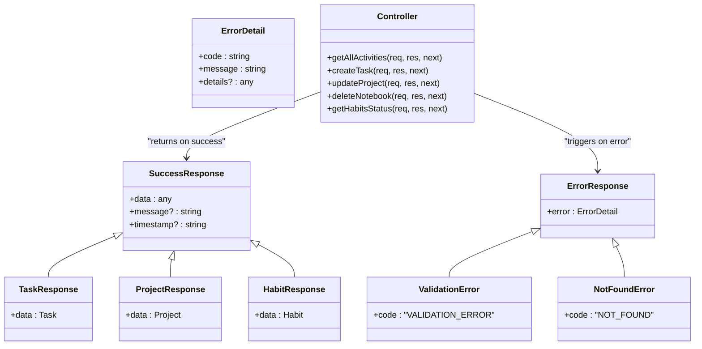
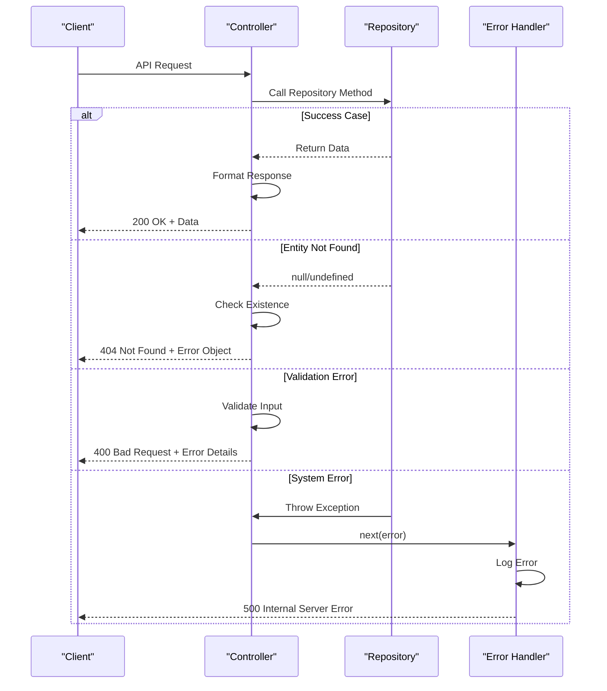
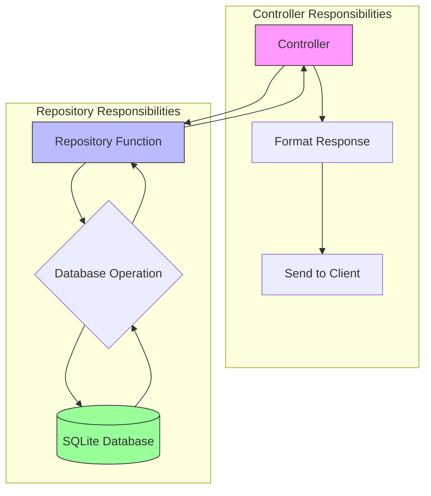
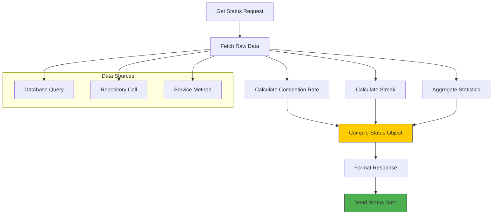
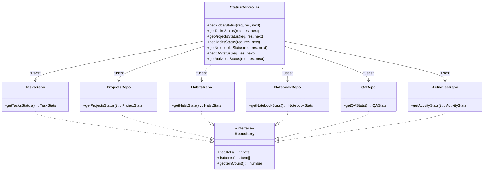
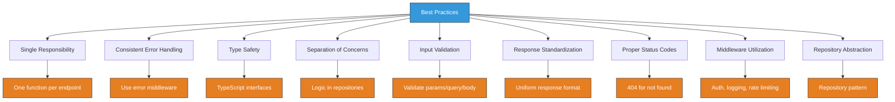
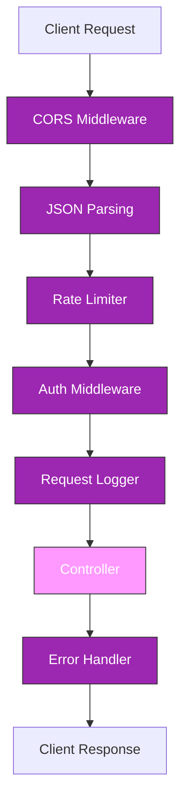

# Controller Layer Architecture

<cite>
**Referenced Files in This Document**   
- [activitiesController.ts](file://src/server/controllers/activitiesController.ts)
- [tasksController.ts](file://src/server/controllers/tasksController.ts)
- [projectsController.ts](file://src/server/controllers/projectsController.ts)
- [notebooksController.ts](file://src/server/controllers/notebooksController.ts)
- [settingsController.ts](file://src/server/controllers/settingsController.ts)
- [habitsController.ts](file://src/server/controllers/habitsController.ts)
- [qaController.ts](file://src/server/controllers/qaController.ts)
- [statusController.ts](file://src/server/controllers/statusController.ts)
- [notesController.ts](file://src/server/controllers/notesController.ts)
- [mcp-server.ts](file://src/server/mcp-server.ts)
- [errorHandler.ts](file://src/server/middleware/errorHandler.ts)
- [init.ts](file://src/database/init.ts)
- [activitiesRepo.ts](file://src/database/activitiesRepo.ts)
- [tasksRepo.ts](file://src/database/tasksRepo.ts)
- [projectsRepo.ts](file://src/database/projectsRepo.ts)
- [notebookRepo.ts](file://src/database/notebookRepo.ts)
- [habitsRepo.ts](file://src/database/habitsRepo.ts)
- [qaRepo.ts](file://src/database/qaRepo.ts)
</cite>

## Table of Contents
1. [Introduction](#introduction)
2. [Controller Layer Overview](#controller-layer-overview)
3. [Request Handling Pattern](#request-handling-pattern)
4. [Response Formatting Standards](#response-formatting-standards)
5. [Error Handling and Propagation](#error-handling-and-propagation)
6. [Controller-Repository Interaction](#controller-repository-interaction)
7. [Complex Operations Implementation](#complex-operations-implementation)
8. [Status and Analytics Controllers](#status-and-analytics-controllers)
9. [Best Practices for Controller Development](#best-practices-for-controller-development)
10. [Middleware Integration](#middleware-integration)
11. [Conclusion](#conclusion)

## Introduction
The controller layer in the MCP Server serves as the critical intermediary between API routes and business logic, orchestrating request processing, data transformation, and response generation. This documentation provides a comprehensive analysis of the controller architecture, detailing the consistent patterns used across all controllers for request validation, error handling, and interaction with repository layers. The controllers follow a standardized approach to ensure maintainability, reliability, and consistency in API responses across the application.

## Controller Layer Overview
The controller layer is organized in a modular fashion, with dedicated controllers for each domain entity such as tasks, projects, habits, notebooks, and settings. Each controller exports multiple handler functions that process specific API endpoints, following a consistent pattern of request processing and response generation. The controllers are designed to be lightweight, focusing primarily on request parameter extraction, input validation, service/repository invocation, and response formatting, while delegating complex business logic to repository and service layers.

**Diagram sources**
- [mcp-server.ts](file://src/server/mcp-server.ts#L1-L90)
- [activitiesController.ts](file://src/server/controllers/activitiesController.ts#L1-L110)

**Section sources**
- [mcp-server.ts](file://src/server/mcp-server.ts#L1-L90)
- [activitiesController.ts](file://src/server/controllers/activitiesController.ts#L1-L110)

## Request Handling Pattern
All controllers follow a consistent asynchronous request handling pattern using Express.js middleware signature with Request, Response, and NextFunction parameters. The pattern begins with parameter extraction from request objects (params, query, body), followed by type conversion and validation. Controllers consistently use try-catch blocks to handle synchronous and asynchronous errors, ensuring that all errors are properly propagated to the centralized error handling middleware.

**Diagram sources**
- [tasksController.ts](file://src/server/controllers/tasksController.ts#L1-L140)
- [projectsController.ts](file://src/server/controllers/projectsController.ts#L1-L134)

**Section sources**
- [tasksController.ts](file://src/server/controllers/tasksController.ts#L1-L140)
- [projectsController.ts](file://src/server/controllers/projectsController.ts#L1-L134)
- [habitsController.ts](file://src/server/controllers/habitsController.ts#L1-L132)

## Response Formatting Standards
The MCP Server controllers adhere to a standardized response format that wraps all successful responses in a consistent structure with a "data" property containing the payload. This uniform response format simplifies client-side processing and ensures predictable API behavior. For error conditions, controllers rely on the centralized error handling middleware to format responses with appropriate HTTP status codes and structured error objects containing error codes and messages.

**Diagram sources**
- [notebooksController.ts](file://src/server/controllers/notebooksController.ts#L1-L89)
- [settingsController.ts](file://src/server/controllers/settingsController.ts#L1-L54)
- [errorHandler.ts](file://src/server/middleware/errorHandler.ts#L1-L70)

**Section sources**
- [notebooksController.ts](file://src/server/controllers/notebooksController.ts#L1-L89)
- [settingsController.ts](file://src/server/controllers/settingsController.ts#L1-L54)

## Error Handling and Propagation
The controller layer implements a robust error handling strategy that distinguishes between expected business logic errors and unexpected system errors. When an entity is not found, controllers return specific 404 responses with structured error objects. For validation errors, controllers either handle them directly or rely on middleware to intercept Zod validation errors. All unhandled exceptions are propagated to the centralized error handling middleware via the next() function, ensuring consistent error response formatting across the application.

**Diagram sources**
- [tasksController.ts](file://src/server/controllers/tasksController.ts#L1-L140)
- [errorHandler.ts](file://src/server/middleware/errorHandler.ts#L1-L70)
- [qaController.ts](file://src/server/controllers/qaController.ts#L1-L217)

**Section sources**
- [errorHandler.ts](file://src/server/middleware/errorHandler.ts#L1-L70)
- [qaController.ts](file://src/server/controllers/qaController.ts#L1-L217)

## Controller-Repository Interaction
Controllers interact with repository layers through direct function calls, maintaining a clear separation of concerns where controllers handle HTTP-specific concerns while repositories manage data access and persistence logic. The repository pattern allows controllers to remain agnostic of the underlying database implementation, promoting testability and maintainability. Controllers import repository modules and invoke their functions with appropriate parameters, then format the returned data for API responses.

**Diagram sources**
- [activitiesController.ts](file://src/server/controllers/activitiesController.ts#L1-L110)
- [activitiesRepo.ts](file://src/database/activitiesRepo.ts#L1-L140)
- [init.ts](file://src/database/init.ts#L1-L150)

**Section sources**
- [activitiesController.ts](file://src/server/controllers/activitiesController.ts#L1-L110)
- [activitiesRepo.ts](file://src/database/activitiesRepo.ts#L1-L140)

## Complex Operations Implementation
Certain controllers implement complex operations that involve multiple data transformations or aggregations. For example, the status controllers calculate metrics such as completion rates, streaks, and statistical summaries by combining data from multiple sources. These operations demonstrate how controllers can orchestrate complex business logic by coordinating calls to multiple repository functions and performing calculations on the aggregated data before formatting the final response.

**Diagram sources**
- [statusController.ts](file://src/server/controllers/statusController.ts#L1-L151)
- [projectsController.ts](file://src/server/controllers/projectsController.ts#L1-L134)
- [habitsController.ts](file://src/server/controllers/habitsController.ts#L1-L132)

**Section sources**
- [statusController.ts](file://src/server/controllers/statusController.ts#L1-L151)
- [projectsController.ts](file://src/server/controllers/projectsController.ts#L1-L134)

## Status and Analytics Controllers
The status and analytics controllers represent a specialized category that aggregates data across multiple domains to provide comprehensive system status and performance metrics. These controllers import multiple repository modules and combine their results to create holistic views of the application state. The getGlobalStatus controller, for instance, consolidates information from tasks, projects, habits, notebooks, Q&A, and activities to provide a complete system overview, demonstrating how controllers can serve as data aggregation points for dashboard and monitoring functionality.

**Diagram sources**
- [statusController.ts](file://src/server/controllers/statusController.ts#L1-L151)
- [tasksController.ts](file://src/server/controllers/tasksController.ts#L1-L140)
- [projectsController.ts](file://src/server/controllers/projectsController.ts#L1-L134)

**Section sources**
- [statusController.ts](file://src/server/controllers/statusController.ts#L1-L151)
- [tasksController.ts](file://src/server/controllers/tasksController.ts#L1-L140)

## Best Practices for Controller Development
The MCP Server controller implementation exemplifies several best practices for maintainable and scalable controller development. Controllers are kept focused on their primary responsibilities of request handling and response formatting, avoiding the inclusion of complex business logic. Each controller function is designed to handle a single responsibility, following the single responsibility principle. Error handling is consistent across all controllers, with proper HTTP status codes and structured error responses. The use of TypeScript interfaces and type annotations ensures type safety throughout the controller layer.

**Section sources**
- [settingsController.ts](file://src/server/controllers/settingsController.ts#L1-L54)
- [notesController.ts](file://src/server/controllers/notesController.ts#L1-L120)
- [qaController.ts](file://src/server/controllers/qaController.ts#L1-L217)

## Middleware Integration
Controllers seamlessly integrate with the Express.js middleware pipeline, benefiting from cross-cutting concerns such as authentication, logging, rate limiting, and error handling. The middleware stack is configured in the MCP server initialization, ensuring that all controller endpoints inherit the same security and operational safeguards. This integration allows controllers to focus on business logic while relying on middleware to handle concerns like request validation, security checks, and performance monitoring.

**Diagram sources**
- [mcp-server.ts](file://src/server/mcp-server.ts#L1-L90)
- [errorHandler.ts](file://src/server/middleware/errorHandler.ts#L1-L70)
- [logging.ts](file://src/server/middleware/logging.ts#L1-L20)

**Section sources**
- [mcp-server.ts](file://src/server/mcp-server.ts#L1-L90)
- [errorHandler.ts](file://src/server/middleware/errorHandler.ts#L1-L70)

## Conclusion
The controller layer architecture in the MCP Server demonstrates a well-structured, maintainable approach to API development with Express.js. By adhering to consistent patterns for request handling, error propagation, and response formatting, the controllers provide a reliable and predictable interface between the client applications and the underlying business logic. The clear separation of concerns between controllers and repositories promotes testability and scalability, while the integration with middleware ensures consistent application of cross-cutting concerns. This architecture enables efficient development of new endpoints while maintaining code quality and system reliability across the application.