# Habits Controller

<cite>
**Referenced Files in This Document**
- [habitsController.ts](file://src/server/controllers/habitsController.ts)
- [habitsRepo.ts](file://src/database/habitsRepo.ts)
- [habitsSchema.ts](file://src/database/habitsSchema.ts)
- [HabitsPage.tsx](file://src/renderer/pages/HabitsPage.tsx)
- [habits.ts](file://src/store/habits.ts)
- [habits.ts](file://src/main/ipc/habits.ts)
- [habits.ts](file://src/server/routes/habits.ts)
- [eventsRepo.ts](file://src/database/eventsRepo.ts)
- [init.ts](file://src/database/init.ts)
</cite>

## Table of Contents
1. [Introduction](#introduction)
2. [System Architecture](#system-architecture)
3. [Core Components](#core-components)
4. [Habit Lifecycle Management](#habit-lifecycle-management)
5. [Streak Calculation and Statistics](#streak-calculation-and-statistics)
6. [Request/Response Schemas](#requestresponse-schemas)
7. [Error Handling and Validation](#error-handling-and-validation)
8. [Frontend Integration](#frontend-integration)
9. [Performance Optimization](#performance-optimization)
10. [Edge Cases and Time Zone Handling](#edge-cases-and-time-zone-handling)
11. [Future Expansion Strategies](#future-expansion-strategies)
12. [Troubleshooting Guide](#troubleshooting-guide)

## Introduction

The Habits Controller is a comprehensive system designed to manage habit tracking operations within the LifeOS productivity suite. It provides a robust foundation for creating, managing, and monitoring daily habits while maintaining accurate streak calculations, completion rates, and statistical analytics. The system integrates seamlessly with the frontend habit calendar and supports various frequency patterns including daily, weekly, and monthly tracking.

The controller operates as part of a layered architecture that separates concerns between presentation, business logic, and data persistence, ensuring maintainable and scalable habit management functionality.

## System Architecture

The Habits Controller follows a multi-layered architecture pattern that ensures clear separation of responsibilities and optimal data flow:

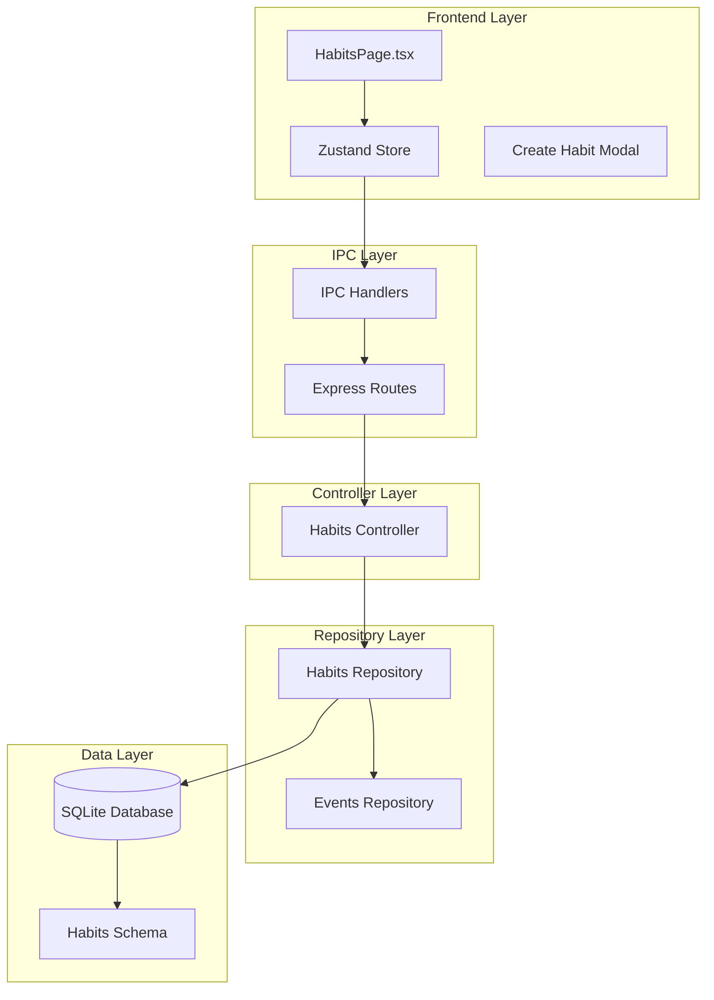

**Diagram sources**
- [HabitsPage.tsx](file://src/renderer/pages/HabitsPage.tsx#L1-L50)
- [habits.ts](file://src/store/habits.ts#L1-L30)
- [habits.ts](file://src/main/ipc/habits.ts#L1-L20)
- [habits.ts](file://src/server/routes/habits.ts#L1-L15)
- [habitsController.ts](file://src/server/controllers/habitsController.ts#L1-L20)

## Core Components

### Habit Data Model

The system defines a comprehensive habit data model that captures all essential attributes for habit tracking:

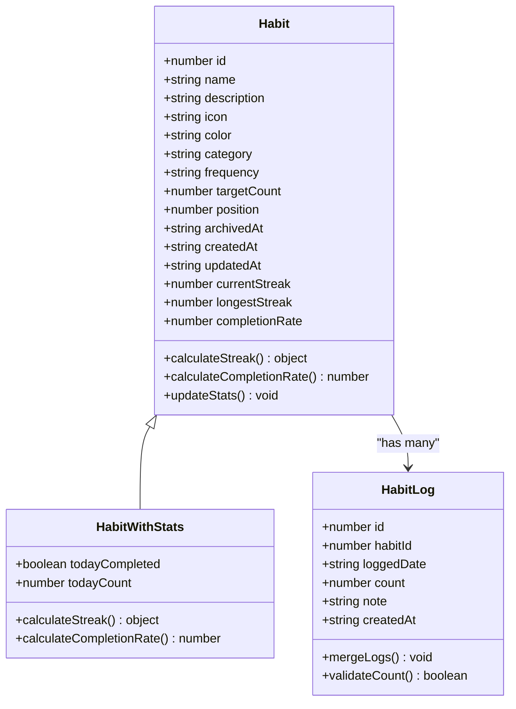

**Diagram sources**
- [habitsRepo.ts](file://src/database/habitsRepo.ts#L5-L30)
- [habitsRepo.ts](file://src/database/habitsRepo.ts#L32-L38)

### Controller Operations

The Habits Controller exposes seven primary operations for habit management:

| Operation | Method | Purpose | Validation |
|-----------|--------|---------|------------|
| Create Habit | POST `/habits/create` | Initialize new habit with frequency and target count | Zod schema validation |
| Get Habit | GET `/habits/:id` | Retrieve specific habit by ID | ID parameter validation |
| List Habits | GET `/habits/` | Fetch all habits with optional archive filtering | Query parameter parsing |
| Update Habit | PUT `/habits/:id` | Modify habit properties | Partial update with schema validation |
| Delete Habit | DELETE `/habits/:id` | Remove habit from tracking | Cascade deletion protection |
| Log Habit | POST `/habits/:id/log` | Record habit completion with count | Date and count validation |
| Unlog Habit | DELETE `/habits/:id/log/:date` | Remove habit completion record | Date format validation |
| Get Habit Logs | GET `/habits/:id/logs` | Retrieve completion history | Limit parameter handling |
| Get Habits Status | GET `/habits/status` | Aggregate habit statistics | Multi-habit aggregation |

**Section sources**
- [habitsController.ts](file://src/server/controllers/habitsController.ts#L5-L131)

## Habit Lifecycle Management

### Habit Creation Process

The habit creation process involves comprehensive validation and automatic initialization of habit statistics:

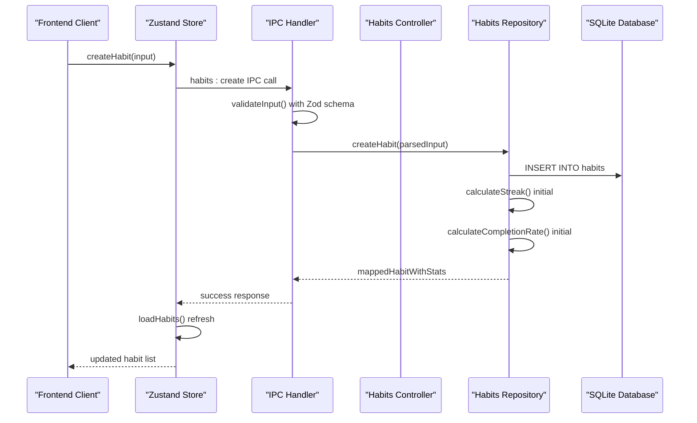

**Diagram sources**
- [habits.ts](file://src/store/habits.ts#L40-L55)
- [habits.ts](file://src/main/ipc/habits.ts#L20-L35)
- [habitsController.ts](file://src/server/controllers/habitsController.ts#L5-L10)

### Habit Completion Logging

The logging system supports flexible completion counting and maintains accurate streak calculations:

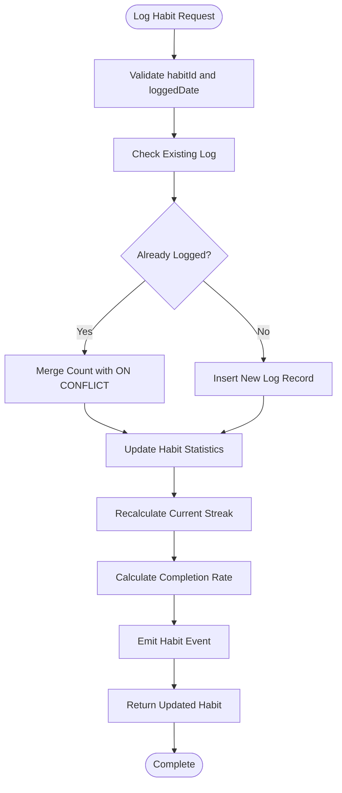

**Diagram sources**
- [habitsRepo.ts](file://src/database/habitsRepo.ts#L320-L340)
- [eventsRepo.ts](file://src/database/eventsRepo.ts#L120-L135)

**Section sources**
- [habitsRepo.ts](file://src/database/habitsRepo.ts#L320-L350)

## Streak Calculation and Statistics

### Streak Calculation Algorithm

The system implements sophisticated streak calculation that handles various frequency patterns and temporal variations:

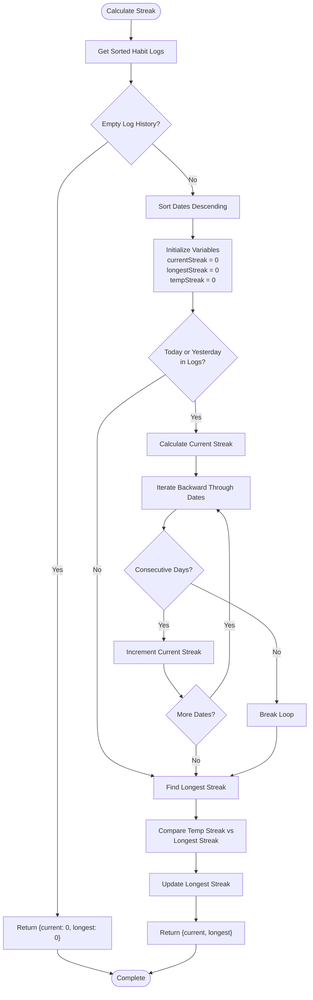

**Diagram sources**
- [habitsRepo.ts](file://src/database/habitsRepo.ts#L50-L110)

### Completion Rate Calculation

The completion rate calculation considers configurable time windows and target counts:

| Parameter | Description | Default Value | Calculation Formula |
|-----------|-------------|---------------|-------------------|
| Time Window | Days to consider for rate calculation | 30 days | `completed_days / days_window` |
| Target Count | Minimum count for completion | 1 | `count >= target_count` |
| Precision | Percentage rounding | 0 decimal places | `Math.round(value * 100)` |
| Weighting | Equal weighting per day | Uniform | No decay applied |

**Section sources**
- [habitsRepo.ts](file://src/database/habitsRepo.ts#L112-L130)

## Request/Response Schemas

### Habit Creation Schema

The system uses Zod for runtime validation with comprehensive field constraints:

| Field | Type | Constraints | Default | Purpose |
|-------|------|-------------|---------|---------|
| name | string | min(1), max(200) | Required | Habit identifier |
| description | string | max(1000) | null | Optional description |
| icon | string | max(30) | null | Emoji or icon code |
| color | string | max(20) | null | Hex color code |
| category | string | max(50) | null | Organizational grouping |
| frequency | enum | daily, weekly, monthly | 'daily' | Tracking interval |
| targetCount | number | int, positive, default(1) | 1 | Required completions |

### Habit Logging Schema

Flexible logging supports partial completions and contextual notes:

| Field | Type | Constraints | Purpose |
|-------|------|-------------|---------|
| habitId | number | int, positive | Reference to habit |
| loggedDate | string | regex(YYYY-MM-DD) | Date of completion |
| count | number | int, positive, default(1) | Quantity completed |
| note | string | max(500) | Optional context |

### Response Formats

The system returns standardized responses with consistent error handling:

```typescript
// Success Response
{
  ok: true,
  data: Habit | HabitLog | Stats
}

// Error Response
{
  ok: false,
  error: string,
  data?: any
}
```

**Section sources**
- [habitsRepo.ts](file://src/database/habitsRepo.ts#L40-L70)

## Error Handling and Validation

### Validation Pipeline

The system implements multi-layered validation:

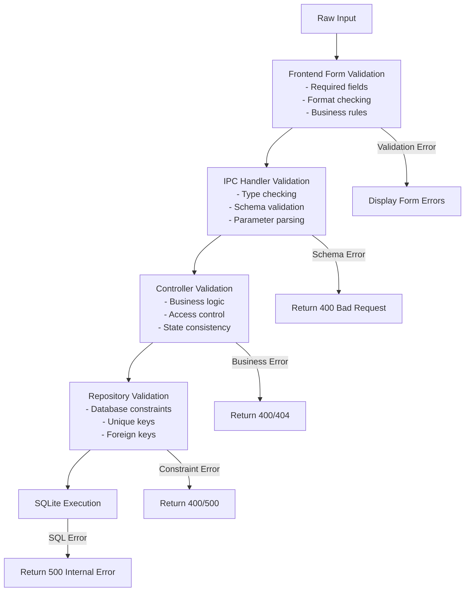

**Diagram sources**
- [habits.ts](file://src/store/habits.ts#L40-L80)
- [habits.ts](file://src/main/ipc/habits.ts#L20-L50)

### Common Error Scenarios

| Error Type | HTTP Status | Cause | Resolution |
|------------|-------------|-------|------------|
| Habit Not Found | 404 | Invalid habit ID | Verify habit exists |
| Invalid Date Format | 400 | Malformed date string | Use YYYY-MM-DD format |
| Negative Count | 400 | Zero or negative count | Use positive integers |
| Duplicate Log | 400 | Same date twice | Use unlog first |
| Database Constraint | 500 | Internal error | Retry operation |

**Section sources**
- [habitsController.ts](file://src/server/controllers/habitsController.ts#L15-L25)
- [habitsRepo.ts](file://src/database/habitsRepo.ts#L340-L360)

## Frontend Integration

### Habit Calendar Integration

The frontend integrates with the habit system through a reactive store pattern:

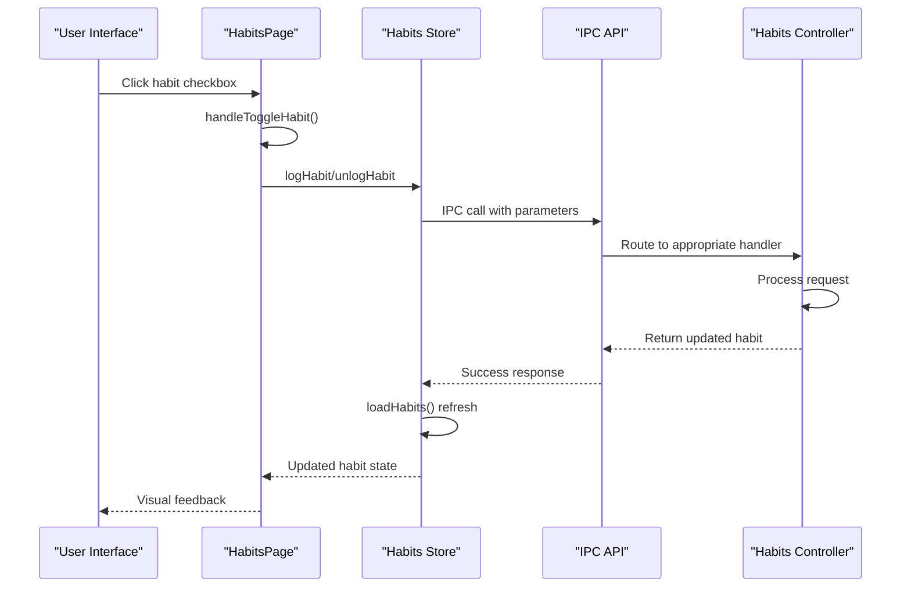

**Diagram sources**
- [HabitsPage.tsx](file://src/renderer/pages/HabitsPage.tsx#L150-L170)
- [habits.ts](file://src/store/habits.ts#L80-L120)

### Real-time Updates

The system supports real-time updates through the Zustand store pattern:

| Update Type | Trigger | Response | UI Impact |
|-------------|---------|----------|-----------|
| Habit Creation | User action | Refresh habit list | Add new habit card |
| Habit Completion | Checkbox click | Update streak stats | Mark as completed |
| Habit Deletion | Delete button | Remove from list | Hide habit card |
| Batch Operations | Archive/Restore | Filter habit list | Show/hide archived |

**Section sources**
- [HabitsPage.tsx](file://src/renderer/pages/HabitsPage.tsx#L100-L200)
- [habits.ts](file://src/store/habits.ts#L120-L160)

## Performance Optimization

### Database Indexing Strategy

The system employs strategic indexing for optimal query performance:

| Table | Index | Columns | Purpose | Performance Impact |
|-------|-------|---------|---------|-------------------|
| habits | idx_habits_position | position | Sorting habits | O(log n) sorting |
| habits | idx_habits_archived | archived_at | Filtering active habits | O(log n) filtering |
| habit_logs | idx_habit_logs_habit | habit_id, logged_date | Habit-specific queries | O(log n) lookups |
| habit_logs | idx_habit_logs_date | logged_date | Date range queries | O(log n) date filtering |

### Caching Strategy

The repository implements intelligent caching for frequently accessed data:

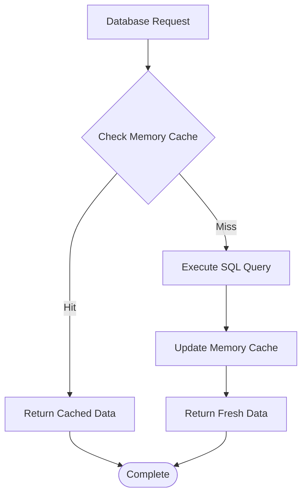

### Query Optimization Techniques

| Technique | Implementation | Benefit | Trade-off |
|-----------|----------------|---------|-----------|
| Prepared Statements | Zod schema parsing | SQL injection prevention | Initial overhead |
| Batch Operations | Bulk habit loading | Reduced round trips | Memory usage |
| Lazy Loading | On-demand habit logs | Faster page loads | Additional requests |
| Connection Pooling | Single database instance | Resource efficiency | Complexity |

**Section sources**
- [habitsSchema.ts](file://src/database/habitsSchema.ts#L25-L38)
- [habitsRepo.ts](file://src/database/habitsRepo.ts#L150-L200)

## Edge Cases and Time Zone Handling

### Time Zone Considerations

The system handles time zones through careful date management:

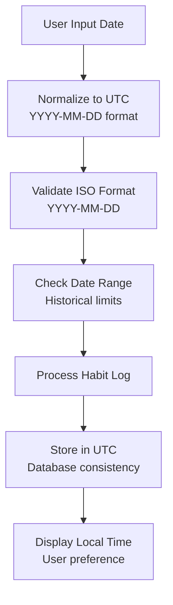

### Retroactive Completions

The system supports retroactive logging with proper streak recalculations:

| Scenario | Behavior | Streak Impact | Rate Impact |
|----------|----------|---------------|-------------|
| Today's completion | Add to current day | May increase current streak | Increases rate |
| Yesterday's completion | Add to yesterday | May merge streak segments | Increases rate |
| Historical date | Add to past date | Recalculates from date | Affects recent window |
| Duplicate logging | Merge counts | Preserves streak continuity | Cumulative effect |

### Frequency Pattern Handling

Different frequency patterns require specialized handling:

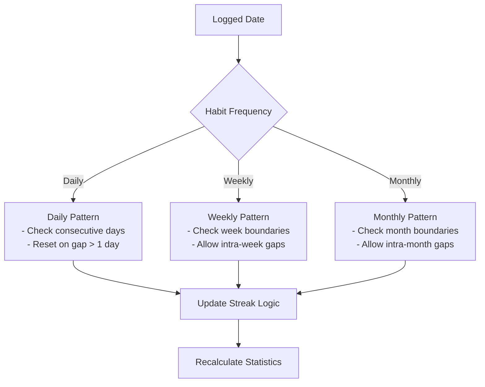

**Section sources**
- [habitsRepo.ts](file://src/database/habitsRepo.ts#L50-L110)

## Future Expansion Strategies

### Habit Reminders System

Planned reminder functionality would integrate with the existing architecture:

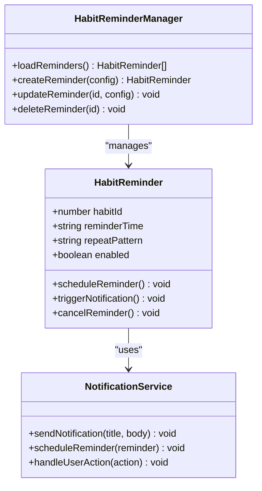

### Advanced Analytics

Future analytics capabilities would enhance the current statistics:

| Metric | Current | Enhanced | Implementation |
|--------|---------|----------|----------------|
| Completion Trends | Basic rate | Trend analysis | Moving averages |
| Predictive Analytics | None | Probability modeling | Machine learning |
| Comparative Analysis | Per-habit | Cross-habit comparison | Statistical tests |
| Goal Tracking | Simple targets | Progress tracking | Milestone management |

### Integration Points

Potential integrations with other LifeOS modules:

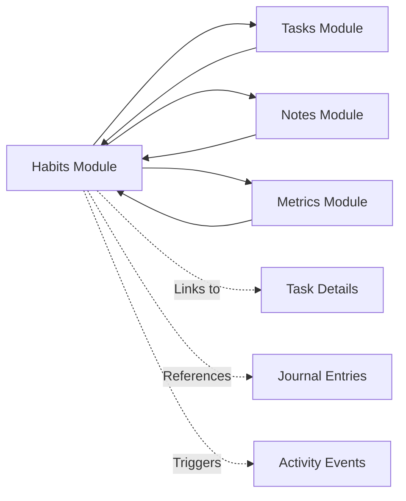

### Scalability Considerations

Future scalability enhancements:

| Aspect | Current Limitation | Proposed Solution | Timeline |
|--------|-------------------|------------------|----------|
| Concurrent Users | Single-user | Session isolation | Phase 1 |
| Large Habit Lists | Linear queries | Pagination | Phase 1 |
| Real-time Sync | Local-only | WebSockets | Phase 2 |
| Mobile Support | Desktop-only | Progressive Web App | Phase 2 |

## Troubleshooting Guide

### Common Issues and Solutions

#### Habit Creation Failures

**Problem**: Habit creation fails with validation errors
**Symptoms**: Form submission returns error messages
**Solution**: 
1. Verify required fields are filled
2. Check field length constraints
3. Ensure frequency is valid enum value
4. Confirm target count is positive integer

#### Streak Calculation Anomalies

**Problem**: Streak counts appear incorrect
**Symptoms**: Current streak doesn't match expected value
**Debugging Steps**:
1. Check habit logs for missing dates
2. Verify frequency alignment
3. Review historical completion patterns
4. Confirm UTC date handling

#### Performance Issues

**Problem**: Slow habit loading or updates
**Symptoms**: Delayed UI responses during habit operations
**Optimization Steps**:
1. Enable database indexing
2. Reduce concurrent requests
3. Implement client-side caching
4. Optimize query parameters

### Diagnostic Commands

For development and debugging:

```sql
-- Check habit statistics
SELECT 
  id, 
  name, 
  current_streak, 
  longest_streak, 
  completion_rate 
FROM habits;

-- Verify log consistency
SELECT 
  habit_id, 
  logged_date, 
  COUNT(*) as duplicate_count 
FROM habit_logs 
GROUP BY habit_id, logged_date 
HAVING COUNT(*) > 1;

-- Monitor recent activity
SELECT 
  h.name, 
  hl.logged_date, 
  hl.count 
FROM habit_logs hl
JOIN habits h ON hl.habit_id = h.id
ORDER BY hl.logged_date DESC 
LIMIT 50;
```

**Section sources**
- [habitsRepo.ts](file://src/database/habitsRepo.ts#L370-L394)

### Error Recovery Procedures

#### Database Corruption

**Detection**: Schema validation failures or query errors
**Recovery**: 
1. Backup current database
2. Reinitialize schema
3. Restore from backup if available
4. Verify data integrity

#### Streak Calculation Errors

**Detection**: Inconsistent streak values across sessions
**Resolution**:
1. Clear cached statistics
2. Recalculate from raw logs
3. Verify date normalization
4. Check timezone handling

#### IPC Communication Failures

**Detection**: Frontend shows "Connection failed" errors
**Fix**:
1. Restart application
2. Verify IPC channel availability
3. Check main process health
4. Review error logs for specific causes