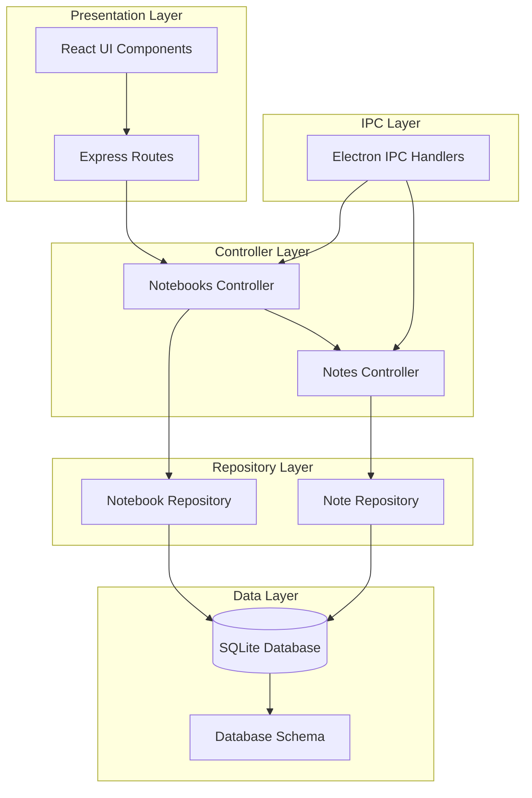
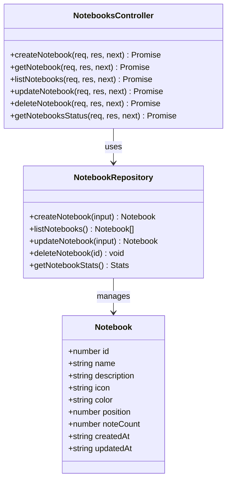
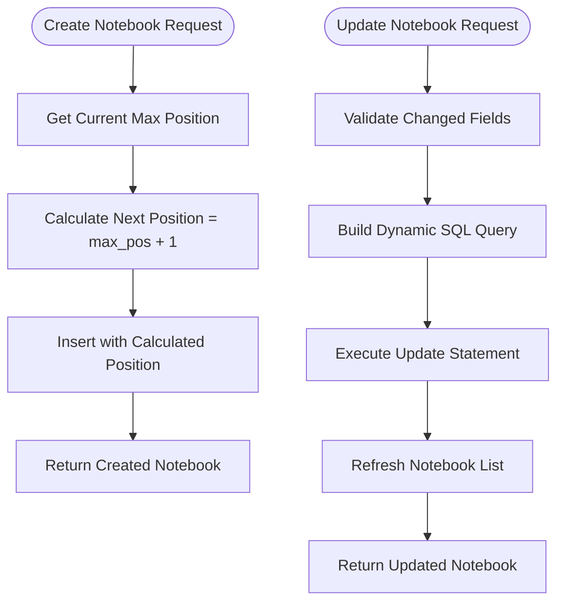
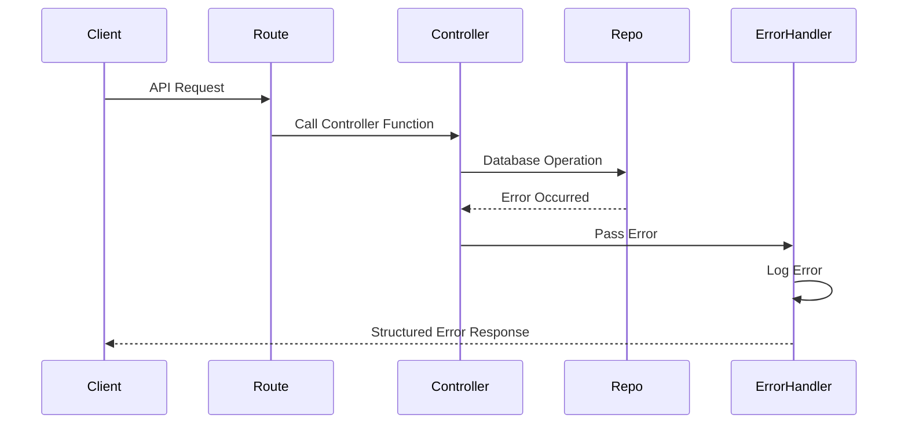
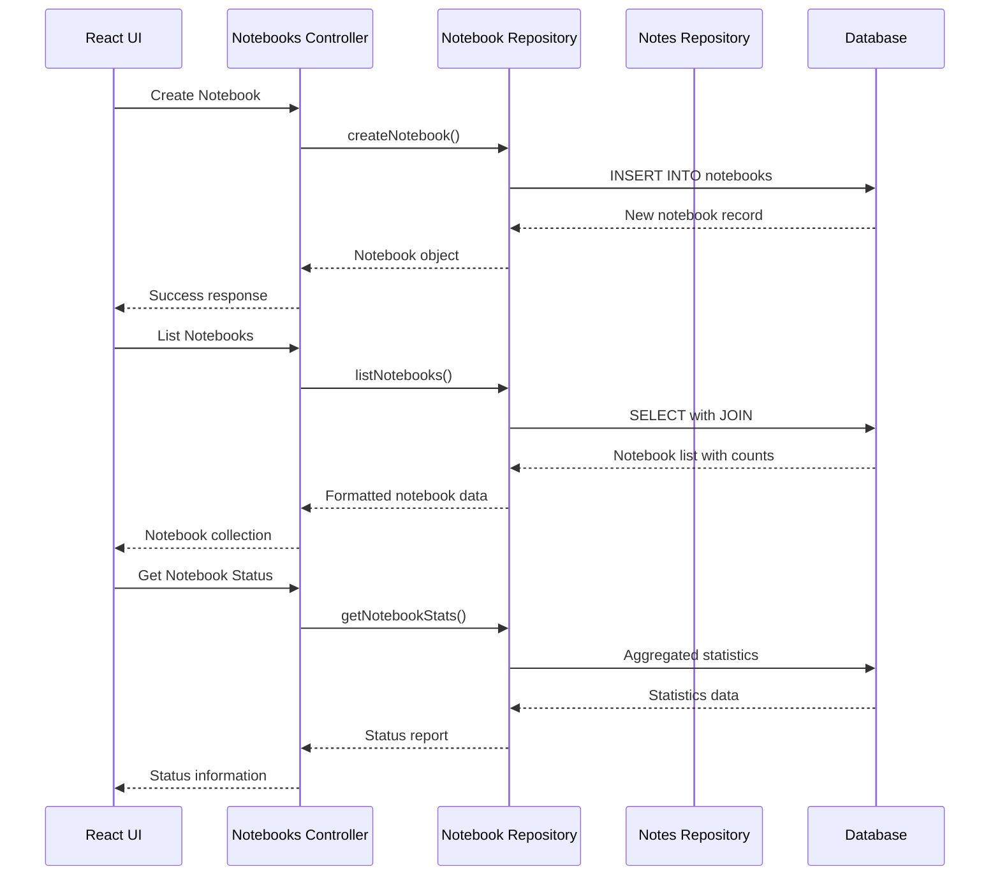

# Notebooks Controller

<cite>
**Referenced Files in This Document**
- [notebooksController.ts](file://src/server/controllers/notebooksController.ts)
- [notebookRepo.ts](file://src/database/notebookRepo.ts)
- [notebooks.ts](file://src/server/routes/notebooks.ts)
- [notebookSchema.ts](file://src/database/notebookSchema.ts)
- [notesController.ts](file://src/server/controllers/notesController.ts)
- [notebook.ts](file://src/main/ipc/notebook.ts)
- [NotebookPage.tsx](file://src/renderer/pages/NotebookPage.tsx)
- [init.ts](file://src/database/init.ts)
- [errorHandler.ts](file://src/server/middleware/errorHandler.ts)
</cite>

## Table of Contents
1. [Introduction](#introduction)
2. [System Architecture](#system-architecture)
3. [Core Components](#core-components)
4. [API Endpoints](#api-endpoints)
5. [Data Validation and Constraints](#data-validation-and-constraints)
6. [Error Handling](#error-handling)
7. [Integration with Notes Controller](#integration-with-notes-controller)
8. [Performance Considerations](#performance-considerations)
9. [Extensibility Guidelines](#extensibility-guidelines)
10. [Best Practices](#best-practices)

## Introduction

The Notebooks Controller serves as the primary orchestrator for managing notebook collections within the LifeOS application. It provides comprehensive CRUD operations for notebook management while maintaining strict data integrity and enforcing hierarchical constraints. The controller operates as part of a layered architecture that separates concerns between presentation, business logic, and data persistence.

The system supports hierarchical notebook organization with position-based ordering, metadata management (icons, colors, descriptions), and seamless integration with the Notes Controller for content operations. It implements robust validation mechanisms to prevent circular references and maintains performance optimizations for large notebook trees.

## System Architecture

The Notebooks Controller follows a clean architecture pattern with clear separation of responsibilities:



**Diagram sources**
- [notebooksController.ts](file://src/server/controllers/notebooksController.ts#L1-L89)
- [notebookRepo.ts](file://src/database/notebookRepo.ts#L1-L400)
- [notebooks.ts](file://src/server/routes/notebooks.ts#L1-L23)

**Section sources**
- [notebooksController.ts](file://src/server/controllers/notebooksController.ts#L1-L89)
- [notebookRepo.ts](file://src/database/notebookRepo.ts#L1-L400)

## Core Components

### Notebooks Controller Functions

The Notebooks Controller provides five primary operations:

#### 1. Notebook Creation
Handles the creation of new notebook collections with automatic position assignment and validation.

#### 2. Notebook Retrieval
Supports both individual notebook fetching by ID and bulk listing with hierarchical ordering.

#### 3. Notebook Updates
Manages updates to notebook metadata including name, description, icons, colors, and position.

#### 4. Notebook Deletion
Processes notebook removal with cascade deletion of associated notes.

#### 5. Status Reporting
Provides comprehensive statistics and health monitoring for notebook collections.



**Diagram sources**
- [notebooksController.ts](file://src/server/controllers/notebooksController.ts#L4-L89)
- [notebookRepo.ts](file://src/database/notebookRepo.ts#L8-L25)

**Section sources**
- [notebooksController.ts](file://src/server/controllers/notebooksController.ts#L4-L89)
- [notebookRepo.ts](file://src/database/notebookRepo.ts#L8-L25)

## API Endpoints

### Endpoint Specifications

| Method | Endpoint | Description | Request Body | Response |
|--------|----------|-------------|--------------|----------|
| POST | `/api/notebooks/create` | Create new notebook | `{name, description?, icon?, color?}` | `{data: Notebook}` |
| GET | `/api/notebooks/:id` | Get notebook by ID | None | `{data: Notebook}` |
| GET | `/api/notebooks/` | List all notebooks | None | `{data: Notebook[]}` |
| PUT | `/api/notebooks/:id` | Update notebook | `{name?, description?, icon?, color?, position?}` | `{data: Notebook}` |
| DELETE | `/api/notebooks/:id` | Delete notebook | None | `{data: {success: true, id}}` |
| GET | `/api/notebooks/status` | Get notebook statistics | None | `{data: StatusReport}` |

### Response Payload Examples

#### Successful Notebook Creation
```json
{
  "data": {
    "id": 1,
    "name": "Personal Journal",
    "description": "Daily reflections and thoughts",
    "icon": "📔",
    "color": "#FF6B6B",
    "position": 0,
    "noteCount": 0,
    "createdAt": "2024-01-15T10:30:00.000Z",
    "updatedAt": "2024-01-15T10:30:00.000Z"
  }
}
```

#### Status Report Response
```json
{
  "data": {
    "total": 5,
    "totalNotes": 127,
    "notebooks": [
      {
        "id": 1,
        "title": "Personal Journal",
        "noteCount": 45,
        "lastUpdated": "2024-01-15T14:20:00.000Z"
      }
    ]
  }
}
```

**Section sources**
- [notebooks.ts](file://src/server/routes/notebooks.ts#L1-L23)
- [notebooksController.ts](file://src/server/controllers/notebooksController.ts#L4-L89)

## Data Validation and Constraints

### Zod Schema Validation

The system employs Zod schemas for comprehensive input validation:

#### Notebook Creation Schema
- **Name**: Required string, min 1 char, max 200 chars
- **Description**: Optional string, max 1000 chars
- **Icon**: Optional string, max 30 chars
- **Color**: Optional string, max 20 chars

#### Notebook Update Schema
- **ID**: Required positive integer
- **Payload**: Optional fields for each property
- **Position**: Optional numeric value for reordering

### Position Management

The system automatically manages notebook positioning:



**Diagram sources**
- [notebookRepo.ts](file://src/database/notebookRepo.ts#L105-L141)
- [notebookRepo.ts](file://src/database/notebookRepo.ts#L143-L190)

### Constraint Enforcement

The database schema enforces several critical constraints:

1. **Foreign Key Relationships**: Notes cascade delete when notebooks are removed
2. **Unique Positions**: Automatic position assignment prevents conflicts
3. **Required Fields**: Name field validation ensures data integrity
4. **Type Safety**: SQLite type enforcement prevents invalid data storage

**Section sources**
- [notebookRepo.ts](file://src/database/notebookRepo.ts#L27-L47)
- [notebookSchema.ts](file://src/database/notebookSchema.ts#L12-L51)

## Error Handling

### Validation Error Responses

The system provides structured error responses for validation failures:

```json
{
  "error": {
    "code": "VALIDATION_ERROR",
    "message": "Invalid request data",
    "details": [
      {
        "path": ["name"],
        "message": "String must contain at least 1 character(s)"
      }
    ]
  }
}
```

### Not Found Error Handling

Specific handling for missing resources:

```json
{
  "error": {
    "code": "NOT_FOUND",
    "message": "Notebook not found"
  }
}
```

### Error Middleware Integration

The error handler middleware provides centralized error processing:



**Diagram sources**
- [errorHandler.ts](file://src/server/middleware/errorHandler.ts#L10-L69)
- [notebooksController.ts](file://src/server/controllers/notebooksController.ts#L4-L89)

**Section sources**
- [errorHandler.ts](file://src/server/middleware/errorHandler.ts#L10-L69)
- [notebooksController.ts](file://src/server/controllers/notebooksController.ts#L15-L30)

## Integration with Notes Controller

### Coordination Mechanisms

The Notebooks Controller coordinates closely with the Notes Controller for comprehensive notebook management:



**Diagram sources**
- [notebooksController.ts](file://src/server/controllers/notebooksController.ts#L4-L89)
- [notesController.ts](file://src/server/controllers/notesController.ts#L4-L119)
- [notebookRepo.ts](file://src/database/notebookRepo.ts#L96-L141)

### Data Synchronization

The controllers maintain synchronization through:

1. **Consistent Interfaces**: Both controllers share similar CRUD patterns
2. **Shared Types**: Common TypeScript interfaces for notebook and note objects
3. **Event Integration**: Note creation triggers word count updates and metrics events
4. **Transaction Safety**: Foreign key constraints ensure referential integrity

**Section sources**
- [notebooksController.ts](file://src/server/controllers/notebooksController.ts#L1-L89)
- [notesController.ts](file://src/server/controllers/notesController.ts#L1-L119)
- [notebookRepo.ts](file://src/database/notebookRepo.ts#L275-L280)

## Performance Considerations

### Database Optimization

The system implements several performance optimizations:

#### Index Strategy
- **Notebooks Position Index**: `idx_notebooks_position` for efficient ordering
- **Notes Organization Index**: `idx_notes_notebook` for notebook-specific queries
- **Creation Timestamp Index**: `idx_notes_created` for chronological sorting
- **Pinned Notes Index**: `idx_notes_pinned` for priority access

#### Query Optimization
```sql
-- Efficient notebook listing with note counts
SELECT 
  n.*,
  COUNT(DISTINCT nt.id) as note_count
FROM notebooks n
LEFT JOIN notes nt ON nt.notebook_id = n.id
GROUP BY n.id
ORDER BY n.position ASC, n.id ASC
```

### Caching Strategies

While the current implementation doesn't include explicit caching, several optimization opportunities exist:

#### Memory-Based Caching
- **Notebook Collections**: Cache frequently accessed notebook lists
- **Statistics Data**: Store computed statistics for dashboard views
- **Metadata Caches**: Cache icon/color combinations for UI rendering

#### Lazy Loading Patterns
- **Incremental Loading**: Load notebook contents on demand
- **Pagination**: Implement pagination for large notebook collections
- **Virtual Scrolling**: Use virtual scrolling for extensive note lists

### Large Tree Performance

For applications with large notebook hierarchies:

#### Hierarchical Queries
```sql
-- Optimized hierarchical notebook retrieval
WITH RECURSIVE notebook_tree AS (
  SELECT id, name, parent_id, position
  FROM notebooks
  WHERE parent_id IS NULL
  UNION ALL
  SELECT n.id, n.name, n.parent_id, n.position
  FROM notebooks n
  INNER JOIN notebook_tree nt ON n.parent_id = nt.id
)
SELECT * FROM notebook_tree ORDER BY position;
```

#### Batch Operations
- **Bulk Updates**: Group multiple notebook updates into single transactions
- **Batch Deletion**: Handle cascading deletions efficiently
- **Aggregate Queries**: Use aggregate functions for statistical calculations

**Section sources**
- [notebookSchema.ts](file://src/database/notebookSchema.ts#L35-L42)
- [notebookRepo.ts](file://src/database/notebookRepo.ts#L96-L115)

## Extensibility Guidelines

### Rich Content Types

The architecture supports extension for rich content types:

#### Media Attachments
```typescript
interface RichNote extends Note {
  attachments: Attachment[];
  mediaCount: number;
  embeddedContent: EmbeddedContent[];
}

interface Attachment {
  id: number;
  fileName: string;
  fileType: string;
  fileSize: number;
  uploadDate: string;
}
```

#### Collaborative Editing
```typescript
interface CollaborativeNote extends Note {
  collaborators: Collaborator[];
  lastEditor: Collaborator;
  version: number;
  locks: Lock[];
}

interface Collaborator {
  userId: number;
  displayName: string;
  lastActive: string;
  permissions: Permission[];
}
```

### Extension Points

#### Custom Validation Rules
Extend the Zod schemas for specialized validation:

```typescript
const createCustomNotebookSchema = createNotebookSchema.extend({
  template: z.enum(['journal', 'project', 'reference']).optional(),
  privacyLevel: z.enum(['public', 'private', 'shared']).default('private'),
  tags: z.array(z.string().max(50)).max(10).optional()
});
```

#### Plugin Architecture
Implement plugin hooks for custom functionality:

```typescript
interface NotebookPlugin {
  name: string;
  version: string;
  hooks: {
    beforeCreate: (notebook: Notebook) => Promise<Notebook>;
    afterCreate: (notebook: Notebook) => Promise<void>;
    beforeUpdate: (notebook: Notebook) => Promise<Notebook>;
    afterUpdate: (notebook: Notebook) => Promise<void>;
  };
}
```

### Event-Driven Extensions

The system can be extended with event-driven patterns:

#### Lifecycle Events
- **NotebookCreated**: Trigger analytics, notifications, or external integrations
- **NotebookUpdated**: Sync with external systems or update caches
- **NotebookDeleted**: Clean up associated resources and notify dependents

#### Real-Time Updates
- **WebSocket Integration**: Push notebook changes to connected clients
- **Change Streams**: Monitor database changes for real-time synchronization
- **Conflict Resolution**: Handle concurrent edits gracefully

**Section sources**
- [notebookRepo.ts](file://src/database/notebookRepo.ts#L47-L60)
- [NotebookPage.tsx](file://src/renderer/pages/NotebookPage.tsx#L1-L717)

## Best Practices

### Development Guidelines

#### Controller Responsibilities
1. **Single Responsibility**: Controllers handle HTTP requests/responses only
2. **Validation**: Delegate input validation to repository layer
3. **Error Handling**: Use consistent error response patterns
4. **Logging**: Implement comprehensive logging for debugging

#### Repository Patterns
1. **Data Access**: Repositories handle database operations exclusively
2. **Transaction Management**: Use transactions for complex operations
3. **Connection Pooling**: Reuse database connections efficiently
4. **Query Optimization**: Write optimized SQL queries with proper indexing

#### Frontend Integration
1. **State Management**: Maintain consistent state between UI and backend
2. **Loading States**: Implement appropriate loading indicators
3. **Error Recovery**: Provide user-friendly error messages
4. **Offline Support**: Consider offline-first approaches

### Security Considerations

#### Input Sanitization
- **SQL Injection**: Use prepared statements and parameterized queries
- **XSS Protection**: Sanitize user-generated content before rendering
- **File Uploads**: Validate file types and sizes for attachments

#### Access Control
- **Authorization**: Implement role-based access controls
- **Data Isolation**: Ensure users can only access their own notebooks
- **Audit Logging**: Track notebook modifications for accountability

### Testing Strategies

#### Unit Testing
```typescript
describe('Notebooks Controller', () => {
  it('should create a notebook with valid data', async () => {
    const mockRequest = { body: { name: 'Test Notebook' } };
    const mockResponse = { status: jest.fn().mockReturnThis(), json: jest.fn() };
    const mockNext = jest.fn();
    
    await createNotebook(mockRequest, mockResponse, mockNext);
    
    expect(mockResponse.json).toHaveBeenCalledWith({
      data: expect.objectContaining({
        name: 'Test Notebook',
        noteCount: 0
      })
    });
  });
});
```

#### Integration Testing
- **API Endpoints**: Test complete request/response cycles
- **Database Operations**: Verify data persistence and retrieval
- **Error Scenarios**: Test failure conditions and error handling
- **Performance Tests**: Validate response times under load

**Section sources**
- [notebooksController.ts](file://src/server/controllers/notebooksController.ts#L1-L89)
- [notebookRepo.ts](file://src/database/notebookRepo.ts#L1-L400)
- [errorHandler.ts](file://src/server/middleware/errorHandler.ts#L10-L69)