# Notes Controller

<cite>
**Referenced Files in This Document**
- [notesController.ts](file://src/server/controllers/notesController.ts)
- [notebookRepo.ts](file://src/database/notebookRepo.ts)
- [notes.ts](file://src/server/routes/notes.ts)
- [notebookSchema.ts](file://src/database/notebookSchema.ts)
- [errorHandler.ts](file://src/server/middleware/errorHandler.ts)
- [notebook.ts](file://src/main/ipc/notebook.ts)
- [NotebookPage.tsx](file://src/renderer/pages/NotebookPage.tsx)
- [types.ts](file://src/common/types.ts)
- [init.ts](file://src/database/init.ts)
- [eventsRepo.ts](file://src/database/eventsRepo.ts)
</cite>

## Table of Contents
1. [Introduction](#introduction)
2. [Architecture Overview](#architecture-overview)
3. [Core Components](#core-components)
4. [API Endpoints](#api-endpoints)
5. [Data Validation and Schemas](#data-validation-and-schemas)
6. [Position Management](#position-management)
7. [Word Count and Content Analysis](#word-count-and-content-analysis)
8. [Error Handling](#error-handling)
9. [Performance Considerations](#performance-considerations)
10. [Integration Patterns](#integration-patterns)
11. [Best Practices](#best-practices)
12. [Troubleshooting Guide](#troubleshooting-guide)

## Introduction

The Notes Controller serves as the primary interface for managing individual notes within notebooks in the LifeOS application. Built on Express.js, it provides a comprehensive REST API for CRUD operations on notes while maintaining strict validation, position ordering, and content persistence through the notebook repository.

The controller operates within a layered architecture that separates concerns between presentation, business logic, and data persistence. It handles requests for creating, retrieving, updating, and deleting notes while ensuring data integrity and providing meaningful error responses.

## Architecture Overview

The Notes Controller follows a clean architecture pattern with clear separation of responsibilities:

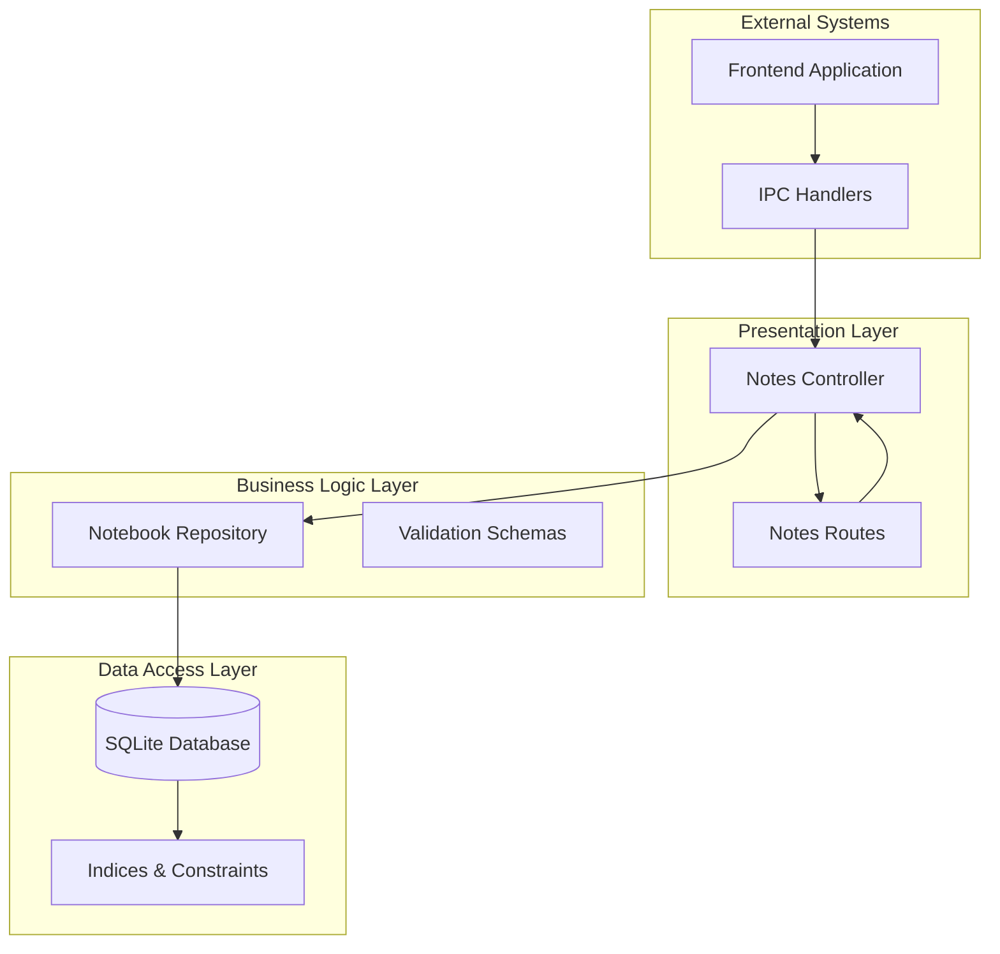

**Diagram sources**
- [notesController.ts](file://src/server/controllers/notesController.ts#L1-L120)
- [notebookRepo.ts](file://src/database/notebookRepo.ts#L1-L400)
- [notes.ts](file://src/server/routes/notes.ts#L1-L26)

**Section sources**
- [notesController.ts](file://src/server/controllers/notesController.ts#L1-L120)
- [notebookRepo.ts](file://src/database/notebookRepo.ts#L1-L400)

## Core Components

### Notes Controller Functions

The Notes Controller provides six primary functions, each handling specific note operations:

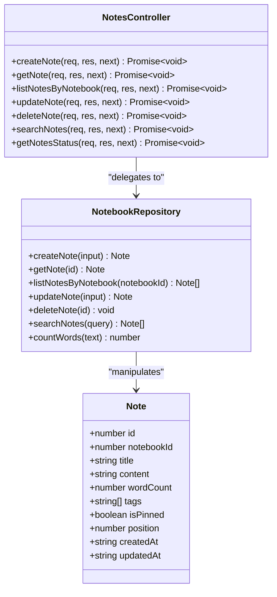

**Diagram sources**
- [notesController.ts](file://src/server/controllers/notesController.ts#L4-L119)
- [notebookRepo.ts](file://src/database/notebookRepo.ts#L15-L25)

### Request/Response Flow

Each controller function follows a consistent pattern for handling requests:

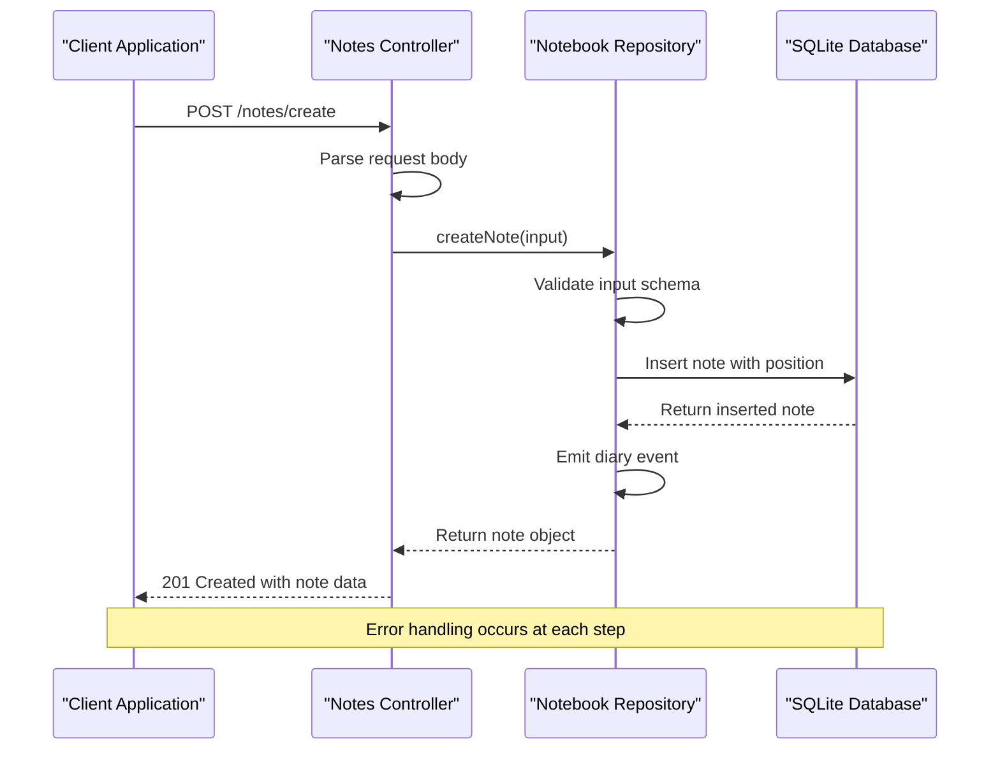

**Diagram sources**
- [notesController.ts](file://src/server/controllers/notesController.ts#L4-L10)
- [notebookRepo.ts](file://src/database/notebookRepo.ts#L250-L290)

**Section sources**
- [notesController.ts](file://src/server/controllers/notesController.ts#L1-L120)
- [notebookRepo.ts](file://src/database/notebookRepo.ts#L250-L290)

## API Endpoints

The Notes Controller exposes seven REST endpoints, each serving specific functionality:

| Endpoint | Method | Description | Request Body | Response |
|----------|--------|-------------|--------------|----------|
| `/notes/create` | POST | Create a new note | `{notebookId, title, content, tags?}` | `201 Created` with note data |
| `/notes/:id` | GET | Retrieve a specific note | None | `200 OK` with note data |
| `/notes/notebook/:notebookId` | GET | List all notes in notebook | None | `200 OK` with note array |
| `/notes/:id` | PUT | Update existing note | `{title?, content?, tags?, isPinned?}` | `200 OK` with updated note |
| `/notes/:id` | DELETE | Delete a note | None | `200 OK` with success confirmation |
| `/notes/search` | GET | Search notes by query | `q=string` | `200 OK` with matching notes |
| `/notes/status` | GET | Get notes statistics | None | `200 OK` with status metrics |

### Endpoint Details

#### Create Note (`POST /notes/create`)
Creates a new note within a specified notebook with automatic position assignment and word count calculation.

**Request Payload:**
```json
{
  "notebookId": 1,
  "title": "Meeting Notes",
  "content": "# Agenda\n\n1. Discuss project timeline\n2. Review budget allocation",
  "tags": ["meeting", "work"]
}
```

**Response:**
```json
{
  "data": {
    "id": 123,
    "notebookId": 1,
    "title": "Meeting Notes",
    "content": "# Agenda...",
    "wordCount": 15,
    "tags": ["meeting", "work"],
    "isPinned": false,
    "position": 0,
    "createdAt": "2024-01-15T10:30:00Z",
    "updatedAt": "2024-01-15T10:30:00Z"
  }
}
```

#### Update Note (`PUT /notes/:id`)
Updates an existing note with partial updates and automatic timestamp management.

**Request Payload:**
```json
{
  "title": "Updated Meeting Notes",
  "content": "# Agenda\n\n1. Discuss project timeline\n2. Review budget allocation\n3. Plan marketing strategy",
  "isPinned": true
}
```

#### Search Notes (`GET /notes/search?q=query`)
Performs full-text search across note titles and content with ranking by recency.

**Query Parameters:**
- `q`: Search query string (required)

**Response:**
```json
{
  "data": [
    {
      "id": 123,
      "notebookId": 1,
      "title": "Meeting Notes",
      "content": "Discuss project timeline...",
      "wordCount": 15,
      "tags": ["meeting", "work"],
      "isPinned": false,
      "position": 0,
      "createdAt": "2024-01-15T10:30:00Z",
      "updatedAt": "2024-01-15T11:00:00Z"
    }
  ]
}
```

**Section sources**
- [notes.ts](file://src/server/routes/notes.ts#L1-L26)
- [notesController.ts](file://src/server/controllers/notesController.ts#L4-L119)

## Data Validation and Schemas

The Notes Controller employs Zod-based validation to ensure data integrity and prevent malicious input. The validation schemas define strict constraints on all input parameters:

### Validation Schema Definitions

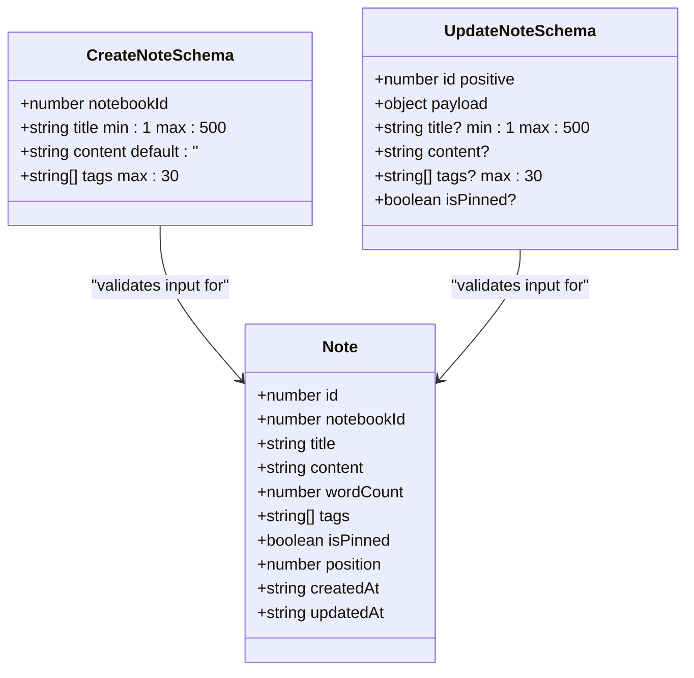

**Diagram sources**
- [notebookRepo.ts](file://src/database/notebookRepo.ts#L55-L70)

### Validation Rules

| Field | Type | Constraints | Purpose |
|-------|------|-------------|---------|
| `notebookId` | number | int, positive | Links note to valid notebook |
| `title` | string | min 1, max 500 chars | Note identifier and display text |
| `content` | string | default empty | Rich text/markdown content |
| `tags` | string[] | max 30 chars each | Categorization and filtering |
| `isPinned` | boolean | optional | Priority indicator |
| `id` | number | int, positive | Unique note identifier |

### Content Sanitization

The validation process includes automatic sanitization of input data to prevent injection attacks and ensure data consistency. The repository handles special character encoding and HTML escaping for safe storage and display.

**Section sources**
- [notebookRepo.ts](file://src/database/notebookRepo.ts#L55-L70)
- [notebookRepo.ts](file://src/database/notebookRepo.ts#L250-L290)

## Position Management

The Notes Controller implements sophisticated position management to maintain ordered note collections within notebooks. Position values ensure predictable ordering and enable efficient reordering operations.

### Position Assignment Strategy

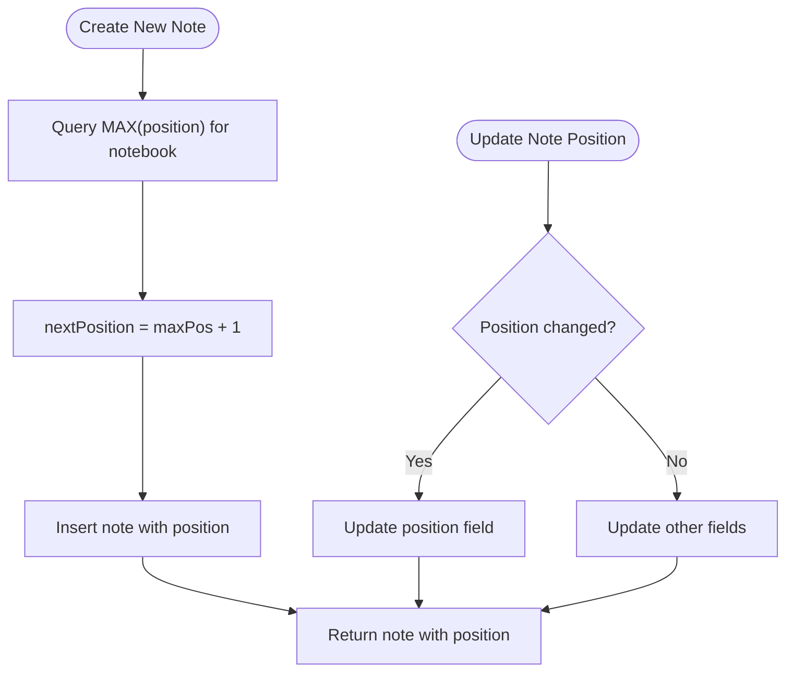

**Diagram sources**
- [notebookRepo.ts](file://src/database/notebookRepo.ts#L250-L265)

### Position Ordering Logic

The system maintains position ordering through several mechanisms:

1. **Automatic Position Assignment**: New notes receive the highest position value plus one
2. **Gap Filling**: When notes are deleted, positions remain contiguous
3. **Priority Sorting**: Pinned notes appear first regardless of position
4. **Timestamp Fallback**: Same-position notes sort by creation time

### Database Indexing

The position management relies on database indices for optimal performance:

- `idx_notes_notebook`: Composite index on `(notebook_id, position DESC)`
- `idx_notes_pinned`: Index on `(is_pinned DESC, created_at DESC)`

**Section sources**
- [notebookRepo.ts](file://src/database/notebookRepo.ts#L250-L265)
- [notebookSchema.ts](file://src/database/notebookSchema.ts#L35-L39)

## Word Count and Content Analysis

The Notes Controller includes intelligent word counting and content analysis capabilities that enhance user experience and provide valuable metrics.

### Word Count Algorithm

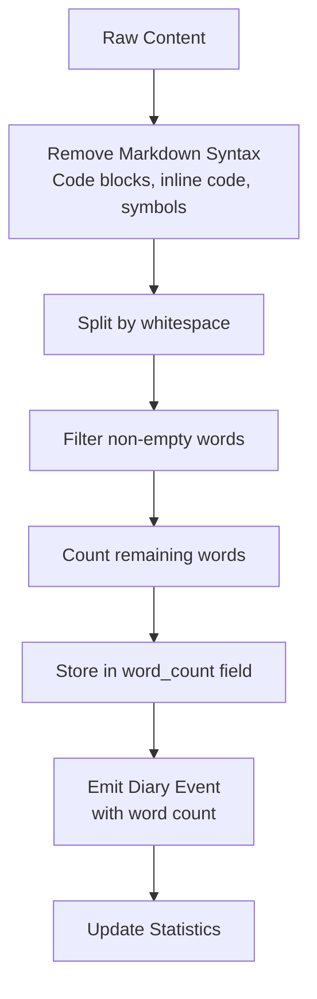

**Diagram sources**
- [notebookRepo.ts](file://src/database/notebookRepo.ts#L72-L85)
- [eventsRepo.ts](file://src/database/eventsRepo.ts#L115-L125)

### Content Analysis Features

The word counting algorithm performs sophisticated content analysis:

1. **Markdown Removal**: Strips code blocks, inline code, and formatting symbols
2. **Whitespace Normalization**: Handles various spacing patterns consistently
3. **Empty Content Detection**: Returns zero for truly empty content
4. **Performance Optimization**: Uses efficient regex patterns for large content

### Metrics Integration

The word count functionality integrates with the broader metrics system:

- **Diary Events**: Each note save emits a diary event with word count
- **Statistics**: Global word count tracking for user productivity metrics
- **Trend Analysis**: Historical content growth tracking

**Section sources**
- [notebookRepo.ts](file://src/database/notebookRepo.ts#L72-L85)
- [eventsRepo.ts](file://src/database/eventsRepo.ts#L115-L125)

## Error Handling

The Notes Controller implements comprehensive error handling that provides meaningful feedback to clients while maintaining security and reliability.

### Error Response Structure

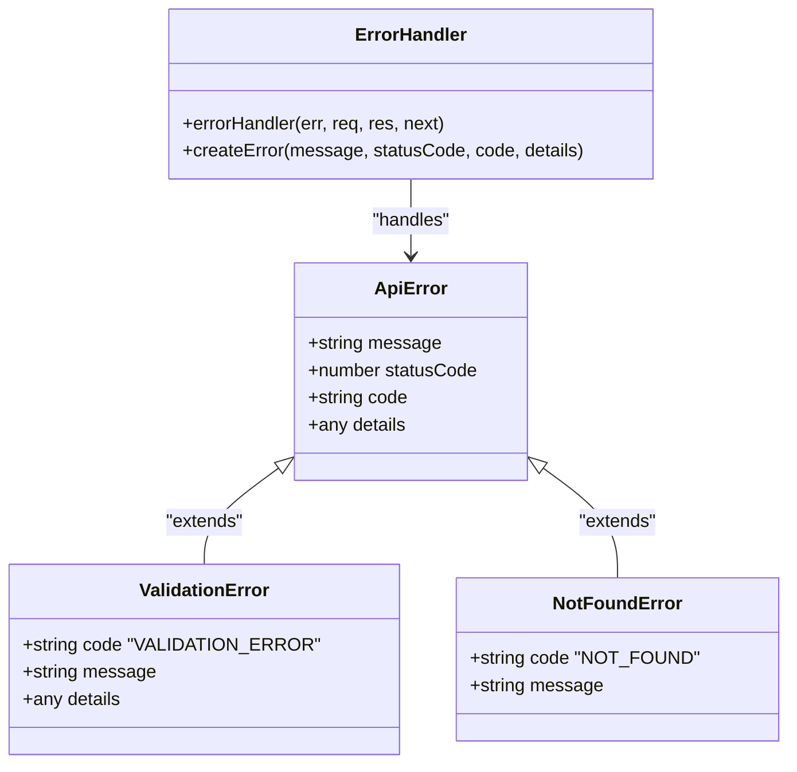

**Diagram sources**
- [errorHandler.ts](file://src/server/middleware/errorHandler.ts#L10-L69)

### Error Types and Responses

| Error Type | HTTP Status | Code | Description |
|------------|-------------|------|-------------|
| Validation Error | 400 | VALIDATION_ERROR | Invalid request data |
| Not Found | 404 | NOT_FOUND | Resource doesn't exist |
| Internal Error | 500 | INTERNAL_SERVER_ERROR | Unexpected server error |

### Error Handling Flow

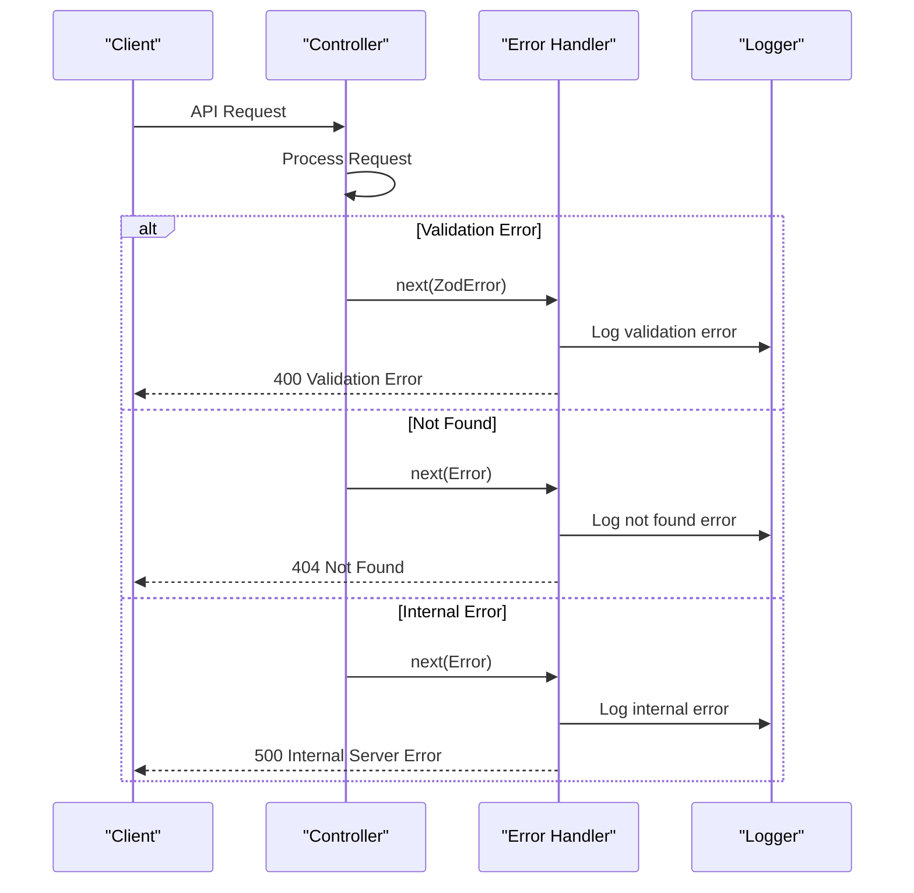

**Diagram sources**
- [errorHandler.ts](file://src/server/middleware/errorHandler.ts#L13-L69)
- [notesController.ts](file://src/server/controllers/notesController.ts#L4-L119)

**Section sources**
- [errorHandler.ts](file://src/server/middleware/errorHandler.ts#L1-L70)
- [notesController.ts](file://src/server/controllers/notesController.ts#L1-L120)

## Performance Considerations

The Notes Controller is designed with performance optimization in mind, addressing potential bottlenecks in large-scale usage scenarios.

### Database Optimization Strategies

#### Indexing Strategy
The database employs strategic indexing to optimize common query patterns:

- **Composite Indexes**: `(notebook_id, position DESC)` for efficient note listing
- **Single Column Indices**: `created_at`, `is_pinned` for sorting and filtering
- **Foreign Key Indices**: Automatic indices on notebook relationships

#### Query Optimization
- **Selective Field Retrieval**: Only necessary fields are loaded from the database
- **Batch Operations**: Related operations are grouped for efficiency
- **Connection Pooling**: Database connections are managed efficiently

### Memory Management

#### Large Note Bodies
For notes with substantial content:

1. **Streaming**: Large content is processed in chunks
2. **Lazy Loading**: Content is loaded only when needed
3. **Compression**: Content is stored efficiently in the database
4. **Caching**: Frequently accessed notes are cached in memory

#### Incremental Saving Strategy
The frontend implements intelligent saving strategies:

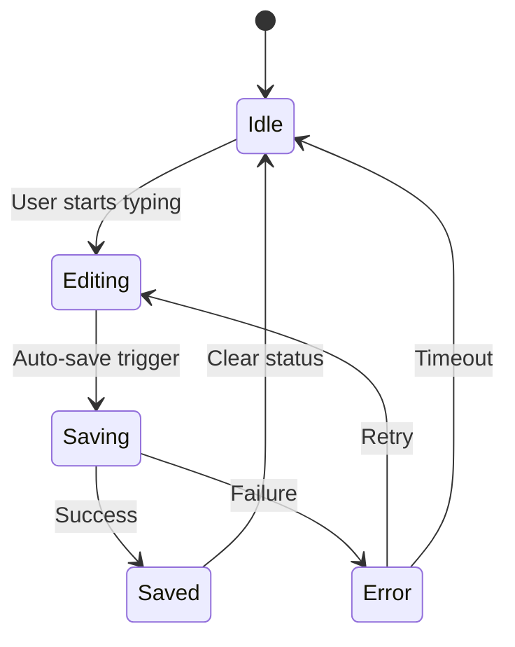

**Diagram sources**
- [NotebookPage.tsx](file://src/renderer/pages/NotebookPage.tsx#L130-L180)

### Scalability Considerations

#### Concurrent Access
The system handles concurrent edits through:

- **Optimistic Locking**: Version-based conflict detection
- **Conflict Resolution**: Automatic merge strategies for conflicting edits
- **Real-time Updates**: WebSocket integration for live collaboration

#### Rate Limiting
API endpoints implement rate limiting to prevent abuse:

- **Request Throttling**: Maximum requests per time window
- **Burst Protection**: Temporary increases during normal usage
- **User-Based Limits**: Different limits for different user tiers

**Section sources**
- [notebookSchema.ts](file://src/database/notebookSchema.ts#L35-L39)
- [NotebookPage.tsx](file://src/renderer/pages/NotebookPage.tsx#L130-L180)

## Integration Patterns

The Notes Controller supports various integration patterns for external systems and applications.

### External Editor Integration

#### Markdown Editor Compatibility
The controller seamlessly integrates with popular markdown editors:

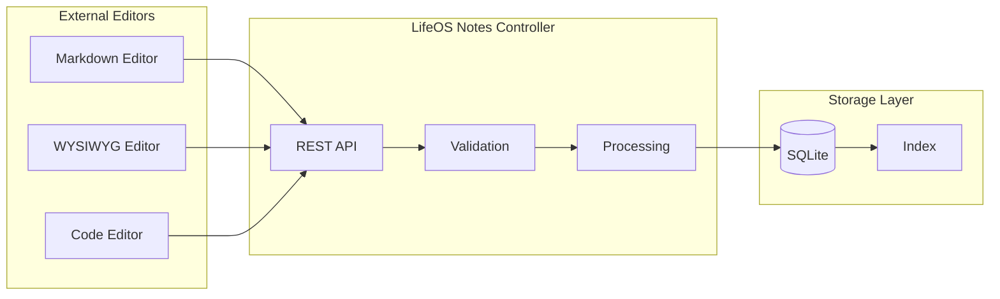

**Diagram sources**
- [NotebookPage.tsx](file://src/renderer/pages/NotebookPage.tsx#L1-L50)
- [notebookRepo.ts](file://src/database/notebookRepo.ts#L250-L290)

#### Editor Features Support
The controller supports advanced editor features:

- **Live Preview**: Real-time rendering of markdown content
- **Syntax Highlighting**: Code block syntax highlighting
- **Auto-completion**: Tag suggestions and templates
- **Version Control**: Built-in change tracking

### Version History Implementation

#### Change Tracking Architecture
The system maintains comprehensive version history:

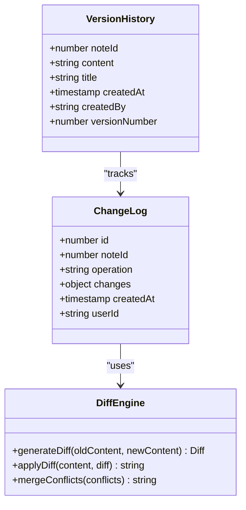

#### Version Control Features
- **Automatic Snapshots**: Regular content snapshots
- **Diff Generation**: Side-by-side content comparison
- **Rollback Capability**: Restore previous versions
- **Collaborative Editing**: Track multiple contributors

### API Integration Patterns

#### Webhook Support
The controller supports webhook notifications for external systems:

- **Content Changes**: Notify external systems of note modifications
- **Lifecycle Events**: Integration with external workflows
- **Custom Triggers**: User-defined automation rules

#### OAuth Integration
For secure external access:

- **Token Authentication**: Bearer token support
- **Scope-Based Access**: Granular permission control
- **Refresh Tokens**: Long-term access management

**Section sources**
- [NotebookPage.tsx](file://src/renderer/pages/NotebookPage.tsx#L1-L717)
- [notebookRepo.ts](file://src/database/notebookRepo.ts#L250-L290)

## Best Practices

Following established best practices ensures reliable, maintainable, and scalable note management functionality.

### Development Guidelines

#### Code Organization
- **Separation of Concerns**: Clear boundaries between controllers, repositories, and models
- **Single Responsibility**: Each function has one primary purpose
- **Consistent Naming**: Descriptive function and variable names
- **Documentation**: Comprehensive JSDoc comments for all public APIs

#### Security Practices
- **Input Validation**: All inputs validated using Zod schemas
- **SQL Injection Prevention**: Parameterized queries only
- **Access Control**: Proper authorization checks
- **Data Sanitization**: Content sanitized before storage

#### Testing Strategies
- **Unit Tests**: Individual function testing with mocks
- **Integration Tests**: End-to-end API testing
- **Performance Tests**: Load testing for large datasets
- **Security Tests**: Vulnerability scanning and penetration testing

### Operational Excellence

#### Monitoring and Observability
- **Metrics Collection**: Key performance indicators tracked
- **Logging Standards**: Structured logging with correlation IDs
- **Alerting**: Proactive notification of issues
- **Health Checks**: Regular system health monitoring

#### Backup and Recovery
- **Automated Backups**: Regular database backups
- **Point-in-Time Recovery**: Transaction log retention
- **Disaster Recovery**: Failover procedures documented
- **Data Integrity**: Regular consistency checks

### User Experience Optimization

#### Performance Optimization
- **Lazy Loading**: Content loaded on demand
- **Caching Strategies**: Intelligent caching of frequently accessed data
- **Progressive Enhancement**: Graceful degradation for older browsers
- **Mobile Optimization**: Responsive design and touch-friendly interfaces

#### Accessibility Standards
- **WCAG Compliance**: Meeting accessibility guidelines
- **Keyboard Navigation**: Full keyboard support
- **Screen Reader Support**: ARIA labels and semantic markup
- **Color Contrast**: Adequate contrast ratios

**Section sources**
- [notesController.ts](file://src/server/controllers/notesController.ts#L1-L120)
- [notebookRepo.ts](file://src/database/notebookRepo.ts#L1-L400)

## Troubleshooting Guide

Common issues and their solutions when working with the Notes Controller.

### Common Issues and Solutions

#### Note Creation Failures

**Problem**: Notes fail to create with validation errors
**Symptoms**: 400 Bad Request responses with validation details
**Solution**: 
- Verify `notebookId` exists and belongs to current user
- Check title length (1-500 characters)
- Validate content format and encoding
- Ensure tags don't exceed 30 characters each

#### Position Conflicts

**Problem**: Notes appear in wrong order after editing
**Symptoms**: Notes reordered unexpectedly
**Solution**:
- Verify position values are sequential
- Check for concurrent modification conflicts
- Ensure proper position calculation logic
- Review database constraint violations

#### Performance Degradation

**Problem**: Slow note loading or saving
**Symptoms**: High response times, timeouts
**Solution**:
- Check database index usage
- Monitor query execution plans
- Optimize large content handling
- Review connection pool settings

#### Content Corruption

**Problem**: Notes display incorrectly or lose content
**Symptoms**: Garbled text, missing content
**Solution**:
- Verify UTF-8 encoding
- Check for binary data corruption
- Review content sanitization logic
- Examine database integrity

### Debugging Techniques

#### Logging and Diagnostics
Enable detailed logging for troubleshooting:

```typescript
// Enable debug logging
process.env.DEBUG = 'lifeos:notes';

// Database query logging
db.on('query', (sql) => {
  console.log('Executing SQL:', sql);
});
```

#### Database Inspection
Direct database examination for data integrity:

```sql
-- Check note positions
SELECT id, notebook_id, title, position 
FROM notes 
ORDER BY notebook_id, position;

-- Verify word counts
SELECT id, title, LENGTH(content) as raw_length, 
       word_count, LENGTH(content) - LENGTH(REPLACE(content, ' ', '')) + 1 as approx_words
FROM notes;
```

#### API Testing
Use Postman or curl for direct API testing:

```bash
# Test note creation
curl -X POST http://localhost:3000/notes/create \
  -H "Content-Type: application/json" \
  -d '{"notebookId": 1, "title": "Test", "content": "Hello World"}'

# Test note retrieval
curl http://localhost:3000/notes/1
```

### Performance Tuning

#### Database Optimization
- **Index Maintenance**: Regular index rebuilding
- **Query Optimization**: Analyze slow queries
- **Connection Pooling**: Optimize pool sizes
- **Memory Allocation**: Adjust SQLite memory settings

#### Application-Level Optimization
- **Caching Strategy**: Implement appropriate cache policies
- **Batch Operations**: Group related operations
- **Async Processing**: Offload heavy computations
- **Resource Cleanup**: Proper cleanup of resources

**Section sources**
- [errorHandler.ts](file://src/server/middleware/errorHandler.ts#L13-L69)
- [notebookRepo.ts](file://src/database/notebookRepo.ts#L250-L290)