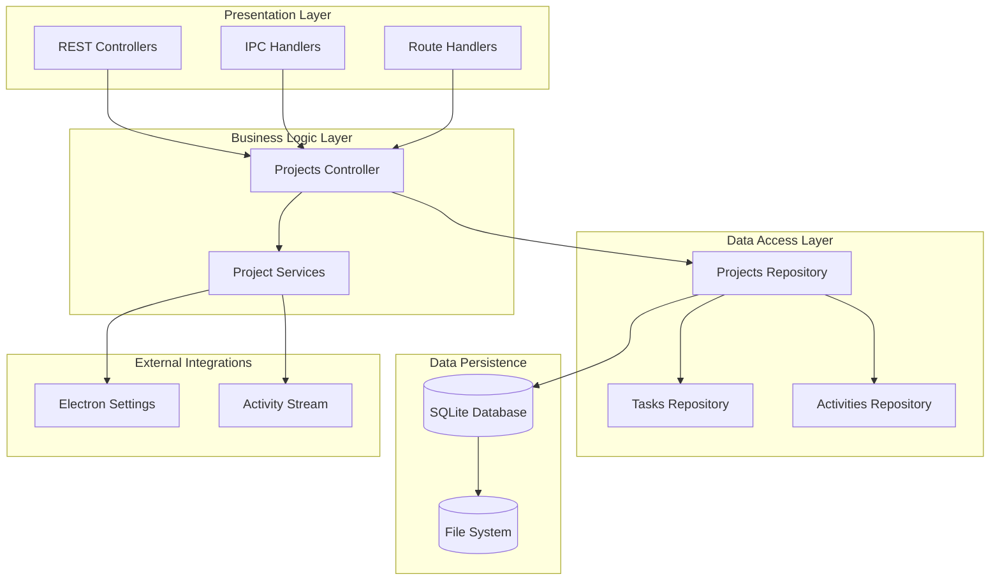
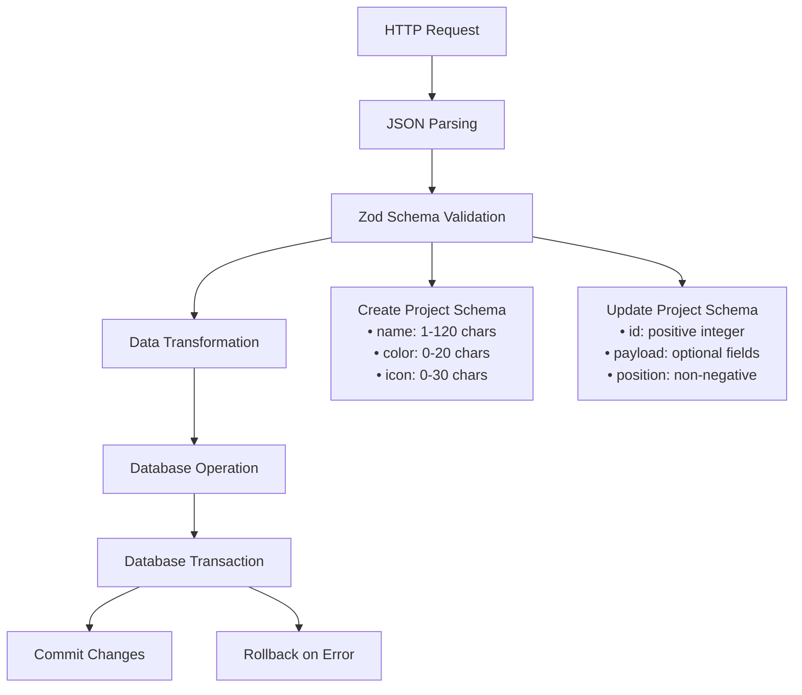
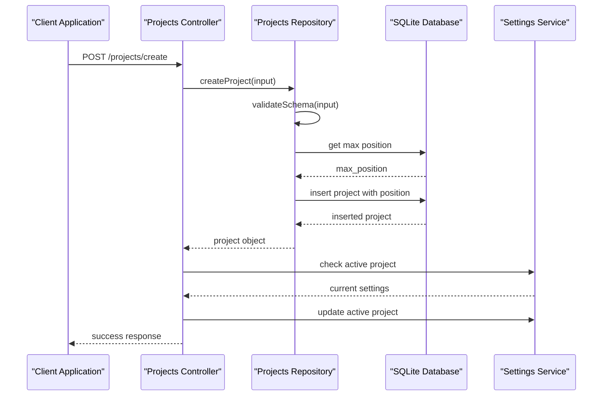
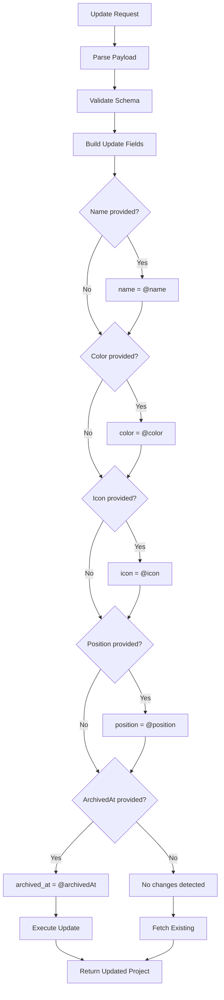
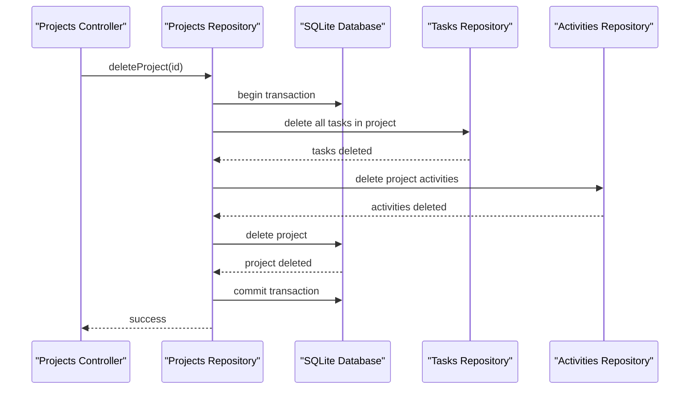
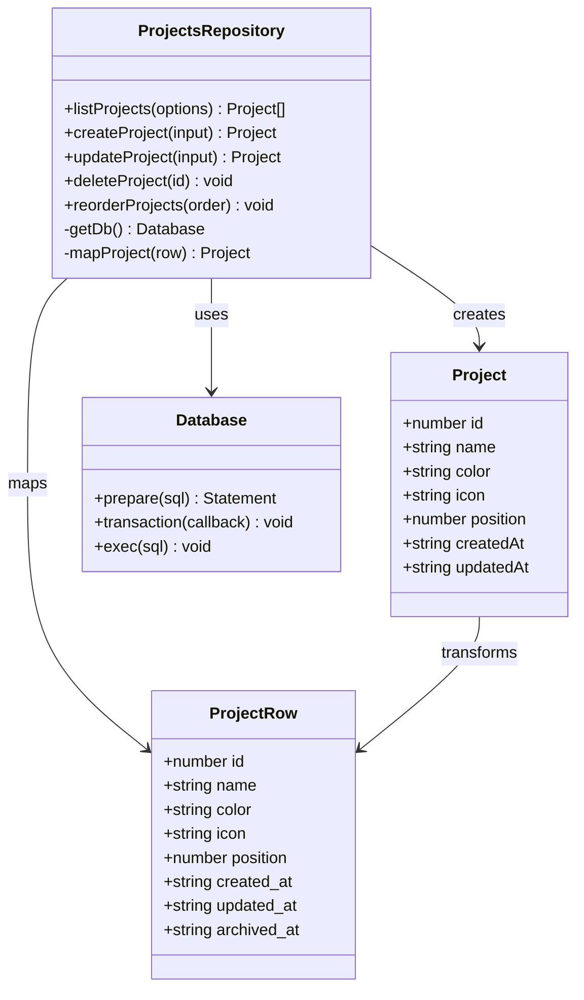
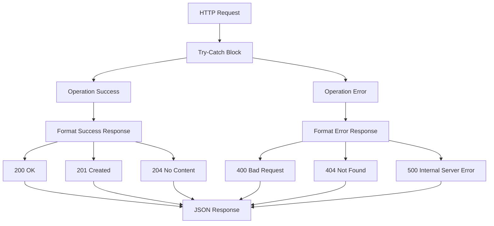
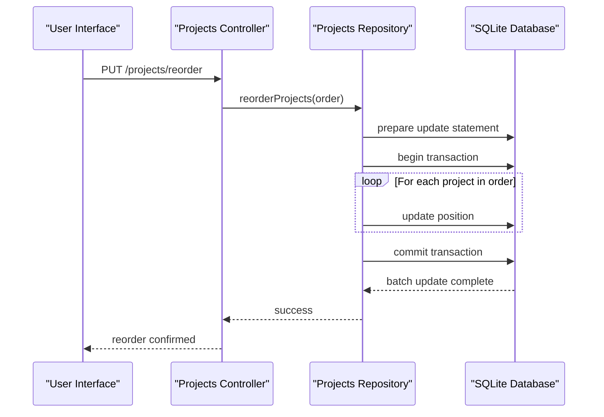
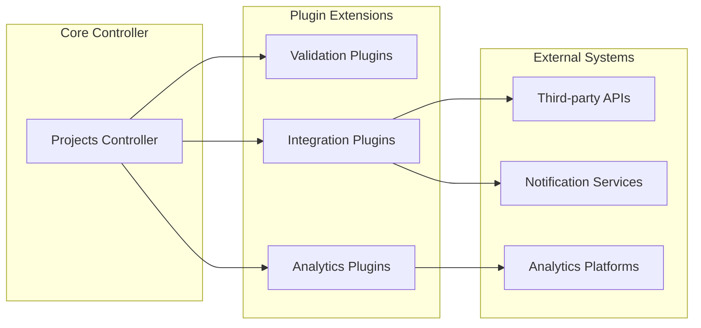
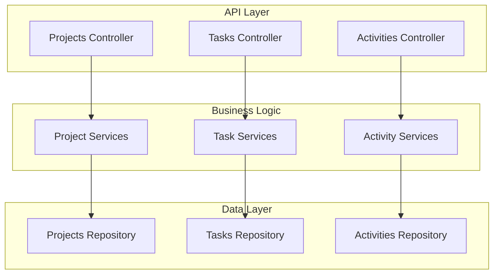

# Projects Controller

<cite>
**Referenced Files in This Document**
- [projectsController.ts](file://src/server/controllers/projectsController.ts)
- [projectsRepo.ts](file://src/database/projectsRepo.ts)
- [projects.ts](file://src/server/routes/projects.ts)
- [types.ts](file://src/common/types.ts)
- [mappers.ts](file://src/database/mappers.ts)
- [projects.ts](file://src/main/ipc/projects.ts)
- [settings.ts](file://src/services/settings.ts)
- [init.ts](file://src/database/init.ts)
- [tasksRepo.ts](file://src/database/tasksRepo.ts)
</cite>

## Table of Contents
1. [Introduction](#introduction)
2. [Architecture Overview](#architecture-overview)
3. [Core Responsibilities](#core-responsibilities)
4. [Data Validation and Integrity](#data-validation-and-integrity)
5. [Project Lifecycle Operations](#project-lifecycle-operations)
6. [Database Integration](#database-integration)
7. [Error Handling and Response Formatting](#error-handling-and-response-formatting)
8. [Performance Considerations](#performance-considerations)
9. [Extensibility and Customization](#extensibility-and-customization)
10. [Integration Patterns](#integration-patterns)
11. [Best Practices](#best-practices)

## Introduction

The Projects Controller serves as the central orchestration layer for project management operations in the LifeOS application. Built on Express.js, it provides a comprehensive API for managing project lifecycles including creation, updates, reordering, deletion, and status monitoring. The controller enforces strict data integrity through schema validation while coordinating with the database layer to maintain consistency across related entities like tasks and activities.

The controller operates within a layered architecture that separates concerns between presentation, business logic, and data persistence. It leverages Zod for robust input validation, ensures atomic operations through database transactions, and maintains referential integrity across the application's relational data model.

## Architecture Overview

The Projects Controller follows a clean architecture pattern with clear separation of responsibilities:



**Diagram sources**
- [projectsController.ts](file://src/server/controllers/projectsController.ts#L1-L134)
- [projectsRepo.ts](file://src/database/projectsRepo.ts#L1-L148)
- [projects.ts](file://src/main/ipc/projects.ts#L1-L84)

**Section sources**
- [projectsController.ts](file://src/server/controllers/projectsController.ts#L1-L134)
- [projects.ts](file://src/server/routes/projects.ts#L1-L29)

## Core Responsibilities

The Projects Controller manages five primary operational domains:

### Project Creation and Management
Handles the complete lifecycle of project creation, including automatic position assignment, validation of project metadata, and integration with the settings service to manage active project states.

### Project Updates and Renaming
Provides flexible update capabilities for project attributes including name, color, icon, and position. Implements partial update functionality to modify individual project properties without affecting others.

### Project Reordering
Manages the dynamic reordering of projects through batch operations, ensuring smooth user experience during drag-and-drop interactions while maintaining data consistency.

### Project Deletion and Cleanup
Coordinates the safe removal of projects along with all associated data including tasks, activities, and historical records, using database transactions to guarantee atomicity.

### Status Monitoring and Analytics
Provides comprehensive project status information including task counts, completion rates, and time tracking metrics for dashboard and reporting purposes.

**Section sources**
- [projectsController.ts](file://src/server/controllers/projectsController.ts#L6-L134)

## Data Validation and Integrity

The controller implements multi-layered validation to ensure data integrity and prevent corruption:

### Schema-Based Validation



**Diagram sources**
- [projectsRepo.ts](file://src/database/projectsRepo.ts#L6-L25)

### Validation Rules

| Field | Validation Type | Constraints | Purpose |
|-------|----------------|-------------|---------|
| `name` | String | Min: 1, Max: 120 characters | Prevent empty names and excessive length |
| `color` | String | Max: 20 characters | Limit CSS color values and prevent injection |
| `icon` | String | Max: 30 characters | Restrict icon identifiers and prevent XSS |
| `position` | Integer | Non-negative | Ensure valid ordering positions |
| `archivedAt` | DateTime | Optional nullable | Support soft deletion with timestamps |

### Data Integrity Enforcement

The controller enforces referential integrity through several mechanisms:

- **Unique Name Constraint**: Projects must have unique names within the active project set
- **Foreign Key Relationships**: Automatic cascade deletion for related tasks and activities
- **Atomic Transactions**: All operations occur within database transactions to prevent partial updates
- **Null Safety**: Proper handling of nullable fields to prevent database constraint violations

**Section sources**
- [projectsRepo.ts](file://src/database/projectsRepo.ts#L6-L25)
- [projectsRepo.ts](file://src/database/projectsRepo.ts#L39-L79)

## Project Lifecycle Operations

### Creation Workflow

The project creation process follows a structured sequence to ensure data consistency:



**Diagram sources**
- [projectsController.ts](file://src/server/controllers/projectsController.ts#L6-L12)
- [projectsRepo.ts](file://src/database/projectsRepo.ts#L39-L60)

### Update Operations

Project updates support partial modifications through flexible payload handling:



**Diagram sources**
- [projectsRepo.ts](file://src/database/projectsRepo.ts#L61-L117)

### Deletion Coordination

Project deletion requires careful coordination to maintain data integrity:



**Diagram sources**
- [projectsRepo.ts](file://src/database/projectsRepo.ts#L120-L146)

**Section sources**
- [projectsController.ts](file://src/server/controllers/projectsController.ts#L14-L94)
- [projectsRepo.ts](file://src/database/projectsRepo.ts#L39-L146)

## Database Integration

### Repository Pattern Implementation

The Projects Controller interacts with the database through a dedicated repository layer that encapsulates all data access logic:



**Diagram sources**
- [projectsRepo.ts](file://src/database/projectsRepo.ts#L1-L148)
- [types.ts](file://src/common/types.ts#L1-L15)
- [mappers.ts](file://src/database/mappers.ts#L18-L32)

### Transaction Management

The repository implements sophisticated transaction management for complex operations:

| Operation | Transaction Scope | Rollback Triggers |
|-----------|------------------|-------------------|
| Project Creation | Single insert operation | Database constraint violation |
| Project Update | Dynamic field updates | Missing project or constraint violation |
| Project Reorder | Batch position updates | Any position conflict |
| Project Deletion | Cascade delete operation | Project not found |

### Indexing and Performance

The database schema includes strategic indexing to optimize common queries:

- **Primary Index**: `idx_projects_position` on project positions for efficient sorting
- **Foreign Key Index**: Automatic indexing on project references in tasks table
- **Composite Index**: `idx_tasks_project_status` for filtered task queries

**Section sources**
- [projectsRepo.ts](file://src/database/projectsRepo.ts#L1-L148)
- [init.ts](file://src/database/init.ts#L82-L88)

## Error Handling and Response Formatting

### Standardized Error Responses

The controller implements consistent error handling patterns across all operations:



**Diagram sources**
- [projectsController.ts](file://src/server/controllers/projectsController.ts#L6-L134)

### Error Categories and Handling

| Error Type | HTTP Status | Response Format | Recovery Strategy |
|------------|-------------|-----------------|-------------------|
| Validation Error | 400 | `{error: {code, message}}` | Client-side correction |
| Not Found | 404 | `{error: {code: 'NOT_FOUND'}}` | Verify resource existence |
| Database Error | 500 | `{error: {message}}` | Retry with exponential backoff |
| Constraint Violation | 400 | `{error: {code, message}}` | Check uniqueness constraints |

### Response Formatting Standards

All controller responses follow a consistent JSON structure:

```typescript
// Success Response
{
  "data": {
    // Project object or operation result
  }
}

// Error Response
{
  "error": {
    "code": "ERROR_CODE",
    "message": "Human-readable error message"
  }
}
```

**Section sources**
- [projectsController.ts](file://src/server/controllers/projectsController.ts#L14-L94)

## Performance Considerations

### Frequent Reordering Optimization

Project reordering represents a performance-critical operation that requires careful optimization:



**Diagram sources**
- [projectsRepo.ts](file://src/database/projectsRepo.ts#L119-L128)

### Batch Update Strategies

For scenarios involving frequent reordering operations:

- **Transaction Batching**: All position updates occur within a single transaction
- **Statement Preparation**: Prepared statements reduce parsing overhead
- **Atomic Commits**: Ensures consistency while minimizing lock duration

### List Retrieval Optimization

Project listing operations benefit from several optimization strategies:

- **Lazy Loading**: Archived projects are excluded by default
- **Index Utilization**: Position-based ordering leverages database indexes
- **Selective Projection**: Only required fields are retrieved from the database

### Memory Management

The controller implements efficient memory usage patterns:

- **Streaming Results**: Large project lists are processed efficiently
- **Object Pooling**: Reuse of response objects reduces garbage collection
- **Connection Pooling**: Database connections are managed optimally

**Section sources**
- [projectsController.ts](file://src/server/controllers/projectsController.ts#L64-L72)
- [projectsRepo.ts](file://src/database/projectsRepo.ts#L119-L128)

## Extensibility and Customization

### Metadata Extension Points

The controller architecture supports extension through several mechanisms:

#### Custom Project Properties

Future enhancements can introduce additional project metadata:

```typescript
// Example extension interface
interface ExtendedProject extends Project {
  metadata?: Record<string, any>;
  customFields?: Record<string, any>;
  tags?: string[];
}

// Extension point in schema validation
const extendedProjectSchema = createProjectSchema.extend({
  metadata: z.record(z.any()).optional(),
  tags: z.array(z.string()).optional()
});
```

#### Integration Hooks

The controller provides integration points for external systems:

- **Activity Logging**: Automatic activity stream generation for all operations
- **Event Broadcasting**: Real-time notifications for project changes
- **Webhook Support**: External system integration capabilities

### Plugin Architecture Considerations

The modular design supports plugin-based extensions:



**Diagram sources**
- [projectsController.ts](file://src/server/controllers/projectsController.ts#L1-L134)

### Configuration Management

The controller integrates with the settings service for runtime configuration:

| Configuration Option | Type | Purpose | Default Value |
|---------------------|------|---------|---------------|
| `activeProjectId` | Number | Currently selected project | First project |
| `autoArchiveThreshold` | Number | Days before archiving | 30 |
| `maxProjectNameLength` | Number | Maximum project name length | 120 |
| `enableProjectColors` | Boolean | Allow custom colors | true |

**Section sources**
- [projectsController.ts](file://src/server/controllers/projectsController.ts#L74-L82)
- [settings.ts](file://src/services/settings.ts#L1-L46)

## Integration Patterns

### Frontend Integration

The controller supports multiple frontend integration patterns:

#### REST API Integration
Direct HTTP communication for web and mobile clients:

```typescript
// Example REST client usage
const createProject = async (name: string) => {
  const response = await fetch('/api/projects/create', {
    method: 'POST',
    headers: { 'Content-Type': 'application/json' },
    body: JSON.stringify({ name })
  });
  return response.json();
};
```

#### IPC Communication
Native desktop application integration through Electron IPC:

```typescript
// Example IPC usage
const createProject = async (name: string) => {
  return await window.api.projects.create({ name });
};
```

### Backend Integration

The controller participates in broader backend operations:



**Diagram sources**
- [projectsController.ts](file://src/server/controllers/projectsController.ts#L1-L134)
- [projects.ts](file://src/main/ipc/projects.ts#L1-L84)

### Event-Driven Architecture

The controller participates in event-driven patterns:

- **Project Events**: Automatic event emission for all project operations
- **State Synchronization**: Real-time updates to connected clients
- **Audit Trails**: Comprehensive logging of all project changes

**Section sources**
- [projects.ts](file://src/server/routes/projects.ts#L1-L29)
- [projects.ts](file://src/main/ipc/projects.ts#L1-L84)

## Best Practices

### Security Considerations

The controller implements several security measures:

- **Input Sanitization**: All inputs are validated through Zod schemas
- **SQL Injection Prevention**: Parameterized queries prevent injection attacks
- **Access Control**: Route-level authorization prevents unauthorized access
- **Data Validation**: Comprehensive validation prevents malformed data

### Testing Strategies

Recommended testing approaches for the Projects Controller:

#### Unit Testing
- Test individual controller methods in isolation
- Mock database operations for focused testing
- Validate error handling scenarios

#### Integration Testing
- Test complete request/response cycles
- Validate database transaction behavior
- Test error propagation through middleware

#### Performance Testing
- Benchmark reordering operations with large datasets
- Test concurrent access scenarios
- Validate memory usage patterns

### Monitoring and Observability

Key metrics to monitor for optimal performance:

| Metric | Description | Alert Threshold |
|--------|-------------|-----------------|
| Request Latency | Average response time | >200ms |
| Error Rate | Percentage of failed requests | >5% |
| Active Connections | Database connection usage | >80% |
| Transaction Duration | Average transaction time | >100ms |

### Maintenance Guidelines

Regular maintenance tasks for the Projects Controller:

- **Schema Evolution**: Monitor for database schema changes
- **Performance Tuning**: Regular review of slow queries
- **Security Audits**: Periodic security assessments
- **Documentation Updates**: Keep API documentation current

**Section sources**
- [projectsController.ts](file://src/server/controllers/projectsController.ts#L1-L134)
- [projectsRepo.ts](file://src/database/projectsRepo.ts#L1-L148)