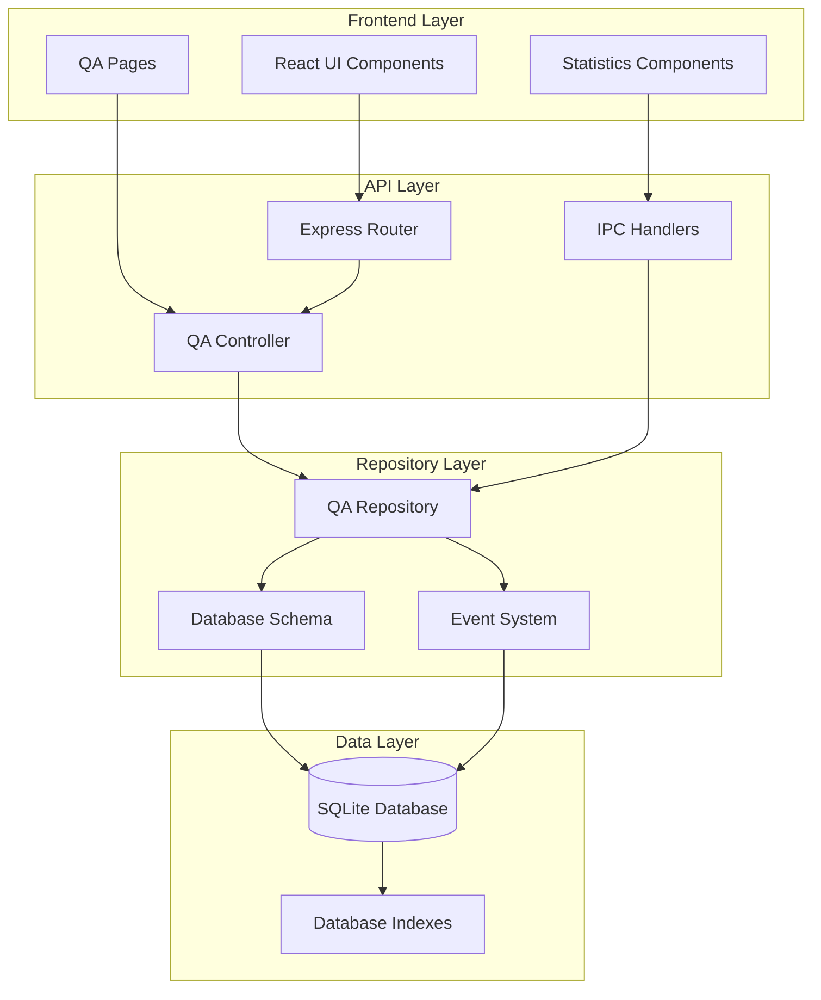
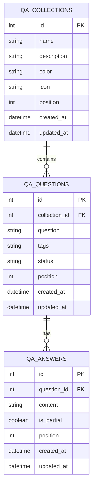
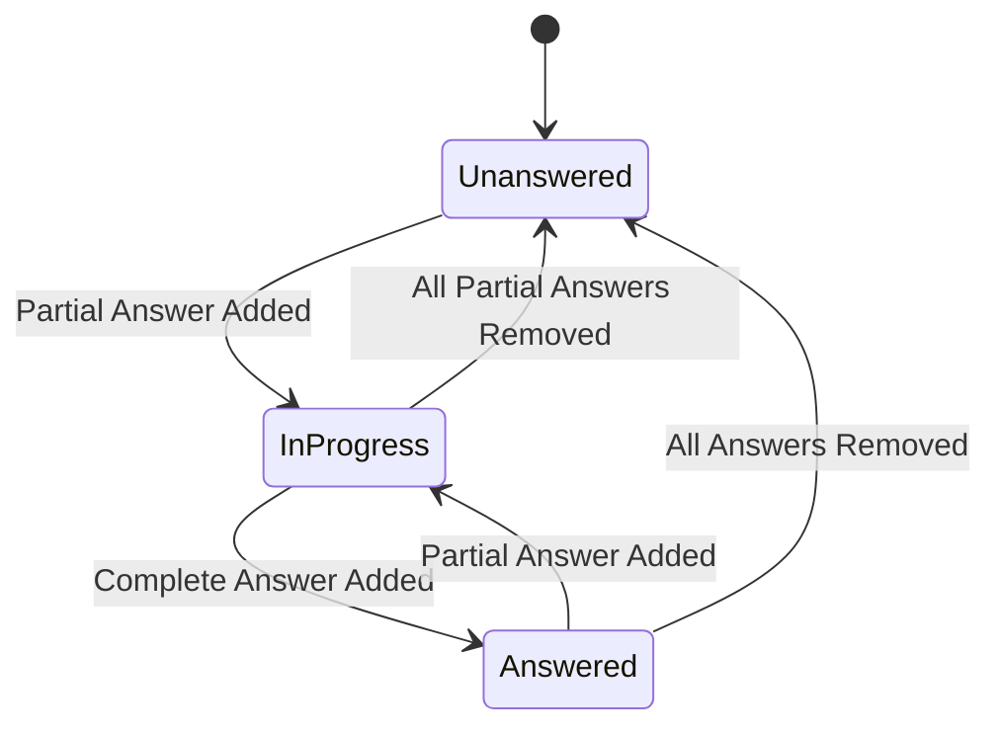
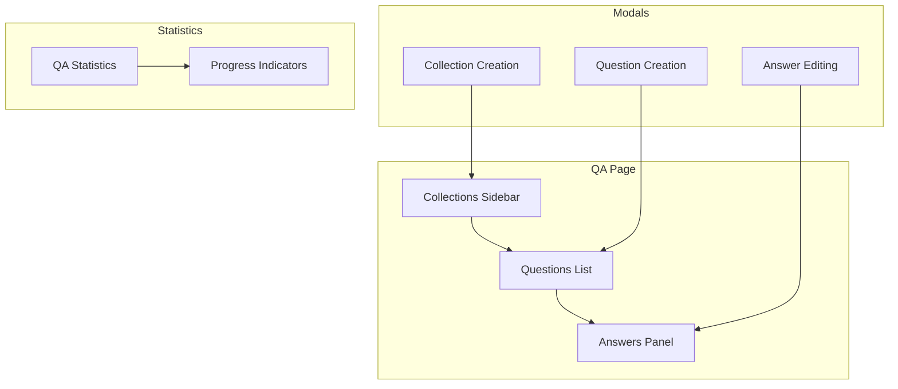

# QA Controller

<cite>
**Referenced Files in This Document**
- [qaController.ts](file://src/server/controllers/qaController.ts)
- [qaRepo.ts](file://src/database/qaRepo.ts)
- [qaSchema.ts](file://src/database/qaSchema.ts)
- [qa.ts](file://src/main/ipc/qa.ts)
- [qa.ts](file://src/server/routes/qa.ts)
- [QA.tsx](file://src/renderer/pages/QA.tsx)
- [QAStats.tsx](file://src/renderer/components/QAStats.tsx)
- [eventsRepo.ts](file://src/database/eventsRepo.ts)
- [metricsSchema.ts](file://src/database/metricsSchema.ts)
- [init.ts](file://src/database/init.ts)
</cite>

## Table of Contents
1. [Introduction](#introduction)
2. [System Architecture](#system-architecture)
3. [Core Components](#core-components)
4. [Data Model](#data-model)
5. [CRUD Operations](#crud-operations)
6. [Status Tracking System](#status-tracking-system)
7. [API Endpoints](#api-endpoints)
8. [Frontend Integration](#frontend-integration)
9. [Validation and Error Handling](#validation-and-error-handling)
10. [Performance Optimization](#performance-optimization)
11. [Edge Cases and Consistency](#edge-cases-and-consistency)
12. [Scalability Considerations](#scalability-considerations)
13. [Best Practices](#best-practices)

## Introduction

The QA Controller is a comprehensive knowledge management system designed to manage question-answer collections with sophisticated learning progress tracking. Built on Electron with Express backend and React frontend, it provides a robust platform for organizing, storing, and reviewing knowledge through flashcard-style interactions.

The system supports hierarchical organization through collections (similar to flashcard decks), allows multiple answers per question with partial completion tracking, and maintains detailed statistics for learning progress assessment. It integrates seamlessly with the broader LifeOS ecosystem while maintaining data consistency and performance optimization.

## System Architecture

The QA Controller follows a layered architecture pattern with clear separation of concerns:



**Diagram sources**
- [qaController.ts](file://src/server/controllers/qaController.ts#L1-L217)
- [qaRepo.ts](file://src/database/qaRepo.ts#L1-L540)
- [qa.ts](file://src/main/ipc/qa.ts#L1-L124)

**Section sources**
- [qaController.ts](file://src/server/controllers/qaController.ts#L1-L217)
- [qaRepo.ts](file://src/database/qaRepo.ts#L1-L540)
- [qaSchema.ts](file://src/database/qaSchema.ts#L1-L72)

## Core Components

### Controller Layer

The controller layer handles HTTP requests and coordinates between the API and repository layers. It provides comprehensive CRUD operations for all QA entities while maintaining proper error handling and response formatting.

Key responsibilities include:
- Request validation and parameter extraction
- Coordinate with repository layer for data operations
- Format responses according to API standards
- Handle error propagation and logging

### Repository Layer

The repository layer manages all database interactions and implements business logic for QA operations. It provides transaction-safe operations and maintains data integrity through careful constraint handling.

Core features:
- Type-safe data validation using Zod schemas
- Automatic status tracking updates
- Event emission for analytics
- Cascade operations for referential integrity

### Frontend Components

The frontend provides an intuitive interface for QA management with real-time synchronization and responsive design. Components are built with React and integrate seamlessly with the Electron IPC system.

**Section sources**
- [qaController.ts](file://src/server/controllers/qaController.ts#L1-L217)
- [qaRepo.ts](file://src/database/qaRepo.ts#L1-L540)
- [QA.tsx](file://src/renderer/pages/QA.tsx#L1-L727)

## Data Model

The QA system uses a three-tier relational model optimized for knowledge organization and learning progression tracking.



**Diagram sources**
- [qaSchema.ts](file://src/database/qaSchema.ts#L10-L60)

### Collection Entity

Collections serve as organizational containers for questions, similar to flashcard decks. They support rich metadata including colors, icons, and positioning for visual organization.

### Question Entity

Questions represent individual knowledge items with flexible tagging and status tracking. The system supports multiple answers per question and maintains detailed statistics on answer distribution.

### Answer Entity

Answers support both complete and partial completion states, enabling progressive learning approaches. Each answer maintains its own position for ordering and can be marked as partial or complete.

**Section sources**
- [qaSchema.ts](file://src/database/qaSchema.ts#L10-L72)
- [qaRepo.ts](file://src/database/qaRepo.ts#L8-L40)

## CRUD Operations

### Collections Management

Collections provide the highest level of organization in the QA system. The CRUD operations enable comprehensive collection lifecycle management.

#### Create Collection
Creates a new collection with automatic positioning and validation. Collections support rich metadata for visual identification and organization.

#### Read Collection
Retrieves collection details including associated questions and answer counts. Supports filtering and pagination for large datasets.

#### Update Collection
Modifies collection properties including name, description, color, and icon. Position updates trigger reordering cascades.

#### Delete Collection
Removes collections with cascade deletion of associated questions and answers. Maintains referential integrity through database constraints.

### Questions Management

Questions form the core knowledge units within collections. Each question supports multiple answers and flexible tagging.

#### Create Question
Adds new questions with automatic status initialization and position assignment. Triggers event emission for analytics tracking.

#### Read Question
Retrieves individual questions with associated answers and status information. Supports filtering by collection and status.

#### Update Question
Modifies question content, tags, and status. Updates related statistics and triggers status recalculations.

#### Delete Question
Removes questions with cascade deletion of all associated answers. Updates collection statistics and question counts.

### Answers Management

Answers provide the interactive component of the QA system, supporting both complete and partial responses.

#### Create Answer
Adds new answers with automatic position assignment and status updates. Emits events for learning analytics.

#### Read Answers
Retrieves all answers for a specific question with sorting and filtering capabilities.

#### Update Answer
Modifies answer content and completeness status. Triggers immediate status recalculations.

#### Delete Answer
Removes answers with status recalculation and statistic updates. Maintains data consistency.

**Section sources**
- [qaController.ts](file://src/server/controllers/qaController.ts#L4-L217)
- [qaRepo.ts](file://src/database/qaRepo.ts#L110-L540)

## Status Tracking System

The QA system implements a sophisticated status tracking mechanism that monitors learning progress through three distinct states.



**Diagram sources**
- [qaSchema.ts](file://src/database/qaSchema.ts#L66-L72)
- [qaRepo.ts](file://src/database/qaRepo.ts#L360-L380)

### Status Types

#### Unanswered
Questions with no answers at all. These represent knowledge gaps requiring initial exploration.

#### In Progress
Questions with at least one partial answer but no complete answers. Indicates active learning engagement.

#### Answered
Questions with at least one complete answer. Represents successful knowledge acquisition.

### Status Calculation Logic

The system automatically calculates question status based on answer composition:

1. **Initial State**: All questions start as UNANSWERED
2. **Partial Answers**: Adding any partial answer moves to IN_PROGRESS
3. **Complete Answers**: Adding a complete answer moves to ANSWERED
4. **Status Recalculation**: Deletion of answers triggers immediate status updates

### Statistics Aggregation

The system maintains comprehensive statistics across all status categories for learning progress assessment:

- Total questions by status
- Answer completion rates
- Collection-level progress tracking
- Global learning metrics

**Section sources**
- [qaSchema.ts](file://src/database/qaSchema.ts#L66-L72)
- [qaRepo.ts](file://src/database/qaRepo.ts#L360-L380)
- [qaController.ts](file://src/server/controllers/qaController.ts#L180-L217)

## API Endpoints

The QA Controller exposes a comprehensive REST API for all CRUD operations and status tracking.

### Collections Endpoints

| Method | Endpoint | Description | Parameters |
|--------|----------|-------------|------------|
| GET | `/api/qa/collections` | List all collections | None |
| GET | `/api/qa/collections/:id` | Get specific collection | `id`: Collection ID |
| POST | `/api/qa/collections/create` | Create new collection | `name`, `description`, `color`, `icon` |
| PUT | `/api/qa/collections/:id` | Update collection | `id`: Collection ID, `payload`: Update fields |
| DELETE | `/api/qa/collections/:id` | Delete collection | `id`: Collection ID |

### Questions Endpoints

| Method | Endpoint | Description | Parameters |
|--------|----------|-------------|------------|
| GET | `/api/qa/questions` | List questions by collection | `collectionId`: Required |
| GET | `/api/qa/questions/:id` | Get specific question | `id`: Question ID, `collectionId`: Required |
| POST | `/api/qa/questions/create` | Create new question | `collectionId`, `question`, `tags` |
| PUT | `/api/qa/questions/:id` | Update question | `id`: Question ID, `payload`: Update fields |
| DELETE | `/api/qa/questions/:id` | Delete question | `id`: Question ID |

### Answers Endpoints

| Method | Endpoint | Description | Parameters |
|--------|----------|-------------|------------|
| GET | `/api/qa/answers/:questionId` | List answers for question | `questionId`: Required |
| POST | `/api/qa/answers/create` | Create new answer | `questionId`, `content`, `isPartial` |
| PUT | `/api/qa/answers/:id` | Update answer | `id`: Answer ID, `payload`: Update fields |
| DELETE | `/api/qa/answers/:id` | Delete answer | `id`: Answer ID |

### Status Endpoints

| Method | Endpoint | Description | Parameters |
|--------|----------|-------------|------------|
| GET | `/api/qa/status` | Get QA system status | None |

### Status Response Format

```typescript
{
  totalQuestions: number;
  totalAnswers: number;
  byStatus: {
    unanswered: number;
    inProgress: number;
    answered: number;
  };
  answerRate: number;
  collections: {
    name: string;
    questionCount: number;
  }[];
}
```

**Section sources**
- [qa.ts](file://src/server/routes/qa.ts#L1-L28)
- [qaController.ts](file://src/server/controllers/qaController.ts#L1-L217)

## Frontend Integration

The frontend provides a comprehensive React-based interface for QA management with real-time synchronization and responsive design.

### Component Architecture



**Diagram sources**
- [QA.tsx](file://src/renderer/pages/QA.tsx#L1-L727)
- [QAStats.tsx](file://src/renderer/components/QAStats.tsx#L1-L140)

### Key Features

#### Real-time Synchronization
Components automatically synchronize with the backend through IPC communication, ensuring data consistency across sessions.

#### Rich Text Support
Answers support Markdown formatting through ReactMarkdown integration, enabling rich content presentation.

#### Interactive Status Indicators
Visual status indicators show question progress with color-coded feedback for learning state.

#### Responsive Design
Layout adapts to different screen sizes while maintaining usability across devices.

### Event Handling

The frontend implements comprehensive event handling for user interactions:

- Collection selection and navigation
- Question filtering and search
- Answer creation and editing
- Status updates and progress tracking

**Section sources**
- [QA.tsx](file://src/renderer/pages/QA.tsx#L1-L727)
- [QAStats.tsx](file://src/renderer/components/QAStats.tsx#L1-L140)

## Validation and Error Handling

The QA system implements comprehensive validation and error handling at multiple layers to ensure data integrity and user experience quality.

### Input Validation

#### Zod Schema Validation
All inputs undergo strict validation using Zod schemas:

- **Collection Validation**: Name length limits, optional description and metadata
- **Question Validation**: Content length limits, optional tagging system
- **Answer Validation**: Content requirements, completeness flags

#### Type Safety
Strong typing ensures compile-time validation of all data operations and prevents runtime errors.

### Error Handling Strategies

#### HTTP Error Responses
Standardized error responses with appropriate HTTP status codes:

- 400: Validation errors and malformed requests
- 404: Resource not found errors
- 500: Internal server errors

#### Database Constraints
Foreign key constraints and unique indexes prevent data corruption and maintain referential integrity.

#### Transaction Safety
Critical operations use database transactions to ensure atomicity and consistency.

### User Feedback

#### Immediate Validation
Form validation provides instant feedback for user input errors.

#### Error Notifications
Toast notifications inform users of operation successes and failures.

#### Graceful Degradation
The system continues operating even when individual operations fail.

**Section sources**
- [qaRepo.ts](file://src/database/qaRepo.ts#L45-L100)
- [qaController.ts](file://src/server/controllers/qaController.ts#L10-L217)

## Performance Optimization

The QA system implements several performance optimization strategies to handle large knowledge bases efficiently.

### Database Optimization

#### Index Strategy
Strategic indexing improves query performance across all major operations:

- **Collections**: Position-based ordering for visual organization
- **Questions**: Collection and status-based filtering
- **Answers**: Question and position-based sorting

#### Query Optimization
Efficient SQL queries minimize database load and improve response times:

- **Aggregated Statistics**: Pre-calculated counts reduce computation overhead
- **Join Optimization**: Strategic joins minimize data transfer
- **Batch Operations**: Bulk operations reduce transaction overhead

### Memory Management

#### Lazy Loading
Components load data on demand to minimize initial page load times.

#### Caching Strategy
Frequently accessed data remains in memory to reduce database queries.

#### Garbage Collection
Proper cleanup prevents memory leaks in long-running applications.

### Frontend Performance

#### Virtual Scrolling
Large lists use virtual scrolling to maintain performance with thousands of items.

#### Debounced Operations
User input operations debounce to reduce unnecessary API calls.

#### Efficient Re-rendering
React optimization techniques minimize unnecessary component re-renders.

**Section sources**
- [qaSchema.ts](file://src/database/qaSchema.ts#L45-L50)
- [qaRepo.ts](file://src/database/qaRepo.ts#L110-L200)

## Edge Cases and Consistency

The QA system handles various edge cases to maintain data integrity and user experience quality.

### Orphaned Data Prevention

#### Cascade Operations
Database constraints ensure that deleting collections automatically removes associated questions and answers.

#### Foreign Key Validation
Strict foreign key constraints prevent orphaned records at the database level.

### Batch Import Consistency

#### Transaction Management
Batch operations use database transactions to ensure atomicity and rollback capability.

#### Duplicate Prevention
Unique constraints and validation prevent duplicate entries during bulk operations.

#### Progress Tracking
Batch operations provide progress feedback and error isolation.

### Concurrent Access

#### Optimistic Locking
Version timestamps prevent concurrent modification conflicts.

#### Conflict Resolution
Clear conflict resolution strategies handle simultaneous updates.

### Data Migration

#### Schema Evolution
Forward-compatible schema design supports future feature additions.

#### Data Preservation
Migration procedures preserve existing data during schema updates.

**Section sources**
- [qaSchema.ts](file://src/database/qaSchema.ts#L25-L45)
- [qaRepo.ts](file://src/database/qaRepo.ts#L400-L540)

## Scalability Considerations

The QA system is designed to scale effectively with growing knowledge bases and user populations.

### Horizontal Scaling

#### Database Optimization
SQLite's ACID compliance and efficient indexing support horizontal scaling through read replicas.

#### Caching Layers
Application-level caching reduces database load for frequently accessed data.

### Vertical Scaling

#### Memory Optimization
Efficient data structures minimize memory usage for large datasets.

#### CPU Optimization
Optimized algorithms reduce computational overhead for complex operations.

### Storage Considerations

#### Data Compression
Text content compression reduces storage requirements for large knowledge bases.

#### Archival Strategy
Inactive data can be moved to archival storage to maintain performance.

### Monitoring and Metrics

#### Performance Metrics
Built-in metrics track system performance and identify bottlenecks.

#### Usage Analytics
Event system provides insights into user behavior and system utilization.

**Section sources**
- [eventsRepo.ts](file://src/database/eventsRepo.ts#L1-L136)
- [metricsSchema.ts](file://src/database/metricsSchema.ts#L1-L104)

## Best Practices

### Development Guidelines

#### Code Organization
- Clear separation of concerns between layers
- Consistent naming conventions across files
- Comprehensive documentation for all public APIs

#### Testing Strategy
- Unit tests for all repository functions
- Integration tests for API endpoints
- End-to-end tests for user workflows

#### Security Considerations
- Input sanitization for all user-provided content
- Proper error handling to prevent information leakage
- Secure IPC communication between frontend and backend

### Operational Excellence

#### Backup Strategy
Regular database backups ensure data recovery capability.

#### Monitoring Setup
System monitoring tracks performance and availability metrics.

#### Maintenance Procedures
Scheduled maintenance windows for updates and optimizations.

### User Experience

#### Accessibility
Keyboard navigation and screen reader support for all functionality.

#### Internationalization
Flexible text handling supports multiple languages and character sets.

#### Performance
Responsive design ensures smooth operation across different devices and connection speeds.

**Section sources**
- [qaRepo.ts](file://src/database/qaRepo.ts#L1-L540)
- [qaController.ts](file://src/server/controllers/qaController.ts#L1-L217)