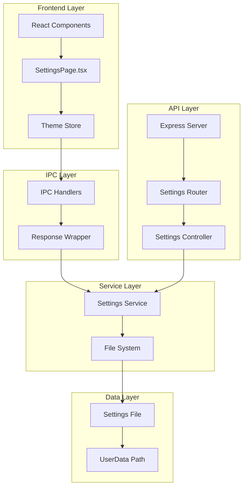
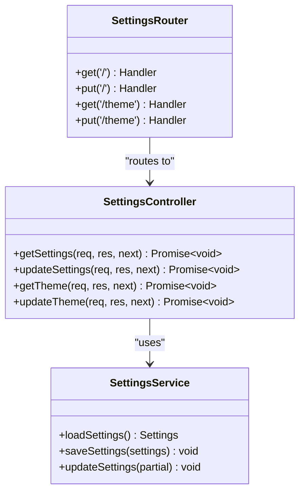
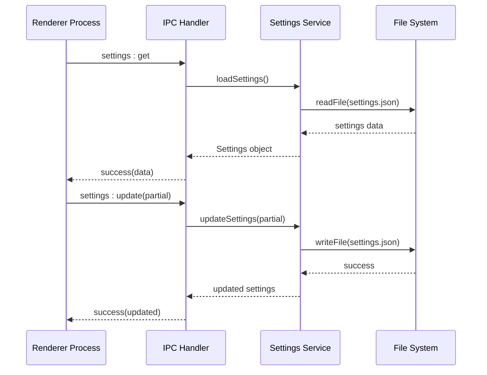
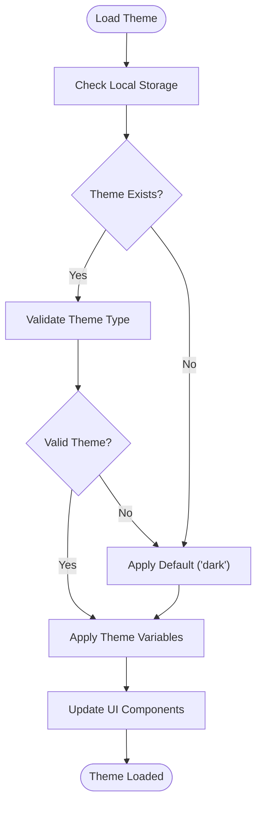
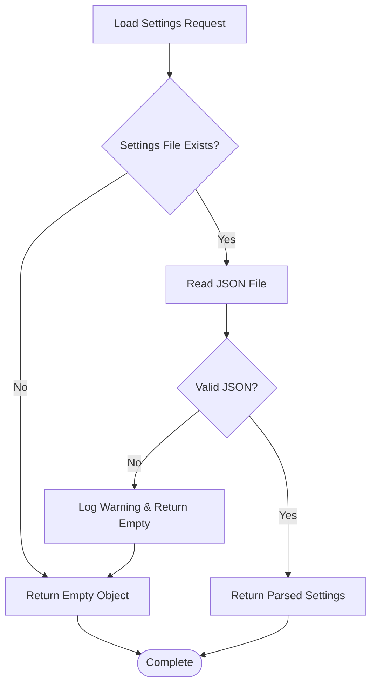
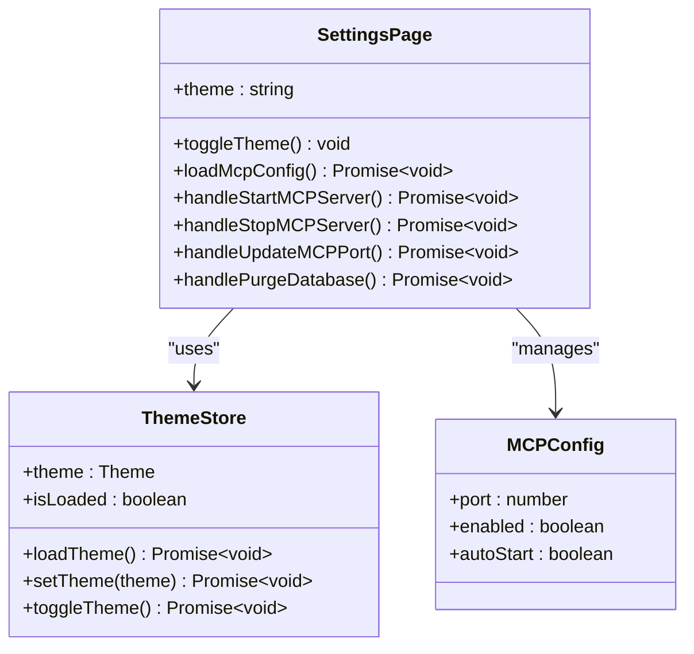
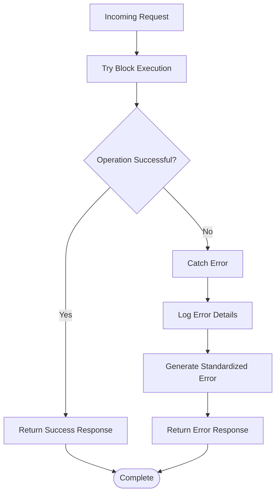

# Settings Controller

<cite>
**Referenced Files in This Document**
- [settingsController.ts](file://src/server/controllers/settingsController.ts)
- [settings.ts](file://src/services/settings.ts)
- [settings.ts](file://src/main/ipc/settings.ts)
- [SettingsPage.tsx](file://src/renderer/pages/SettingsPage.tsx)
- [settings.ts](file://src/server/routes/settings.ts)
- [theme.ts](file://src/store/theme.ts)
- [types.ts](file://src/common/types.ts)
- [response.ts](file://src/main/utils/response.ts)
</cite>

## Table of Contents
1. [Introduction](#introduction)
2. [Architecture Overview](#architecture-overview)
3. [Core Components](#core-components)
4. [Settings Data Model](#settings-data-model)
5. [Controller Implementation](#controller-implementation)
6. [Service Layer](#service-layer)
7. [Frontend Integration](#frontend-integration)
8. [Security Considerations](#security-considerations)
9. [Error Handling](#error-handling)
10. [Best Practices](#best-practices)
11. [Extension Guidelines](#extension-guidelines)
12. [Troubleshooting](#troubleshooting)

## Introduction

The Settings Controller serves as the central hub for managing application preferences and user configurations in LifeOS. It provides a comprehensive system for persisting user settings, validating input types, and synchronizing configuration changes across application restarts. The controller handles both theme preferences and broader application settings, offering robust validation mechanisms and secure storage solutions.

The system follows a layered architecture with clear separation between the Express API controllers, Electron IPC handlers, and frontend React components. This design ensures consistent behavior across different application contexts while maintaining security and reliability.

## Architecture Overview

The Settings Controller implements a multi-layered architecture that spans the backend API, Electron main process, and React frontend:

**Diagram sources**
- [SettingsPage.tsx](file://src/renderer/pages/SettingsPage.tsx#L1-L50)
- [settings.ts](file://src/main/ipc/settings.ts#L1-L28)
- [settings.ts](file://src/services/settings.ts#L1-L46)
- [settingsController.ts](file://src/server/controllers/settingsController.ts#L1-L54)

## Core Components

### Backend Controller Layer

The Express controller layer provides RESTful endpoints for settings management with specialized handlers for different setting categories:

**Diagram sources**
- [settingsController.ts](file://src/server/controllers/settingsController.ts#L1-L54)
- [settings.ts](file://src/services/settings.ts#L1-L46)
- [settings.ts](file://src/server/routes/settings.ts#L1-L17)

### IPC Handler Layer

The Electron IPC layer bridges the main process with the renderer process, providing secure communication channels:

**Diagram sources**
- [settings.ts](file://src/main/ipc/settings.ts#L6-L27)
- [settings.ts](file://src/services/settings.ts#L38-L46)

**Section sources**
- [settingsController.ts](file://src/server/controllers/settingsController.ts#L1-L54)
- [settings.ts](file://src/main/ipc/settings.ts#L1-L28)
- [settings.ts](file://src/services/settings.ts#L1-L46)

## Settings Data Model

The settings system uses a strongly-typed interface that defines all configurable application preferences:

### Core Settings Interface

The Settings interface defines the structure for all user-configurable options:

| Property | Type | Description | Default Value |
|----------|------|-------------|---------------|
| `activeProjectId` | `number?` | Currently selected project identifier | `undefined` |
| `theme` | `'light' \| 'dark'?` | Application theme preference | `'dark'` |
| `hideOldCompletedTasks` | `boolean?` | Hide completed tasks older than 30 days | `false` |

### Theme Management

The theme system supports two primary modes with automatic fallback mechanisms:

**Diagram sources**
- [theme.ts](file://src/store/theme.ts#L15-L35)

**Section sources**
- [settings.ts](file://src/services/settings.ts#L5-L9)
- [theme.ts](file://src/store/theme.ts#L1-L89)

## Controller Implementation

### GET Request Handlers

The controller provides multiple endpoints for retrieving settings with appropriate response formatting:

#### Full Settings Retrieval
The `/settings` endpoint returns all configured preferences as a nested object structure, enabling comprehensive configuration management.

#### Theme-Specific Retrieval
The `/settings/theme` endpoint focuses specifically on appearance preferences, providing streamlined access to theme-related settings.

### PUT Request Handlers

#### Bulk Settings Update
The bulk update endpoint accepts partial settings objects and merges them with existing configurations, preserving unchanged preferences while updating specified values.

#### Theme Validation
The theme update endpoint implements strict validation requiring either 'light' or 'dark' values, returning standardized error responses for invalid inputs.

### Request/Response Patterns

The controller implements consistent request/response patterns across all endpoints:

| Endpoint | Method | Request Body | Response Format | Validation |
|----------|--------|--------------|-----------------|------------|
| `/settings` | GET | None | `{ data: Settings }` | None |
| `/settings` | PUT | `Partial<Settings>` | `{ data: Settings }` | Merge with existing |
| `/settings/theme` | GET | None | `{ data: { theme: string } }` | Default to 'light' |
| `/settings/theme` | PUT | `{ theme: string }` | `{ data: { theme: string } }` | 'light' \| 'dark' |

**Section sources**
- [settingsController.ts](file://src/server/controllers/settingsController.ts#L4-L54)

## Service Layer

### File System Operations

The settings service manages persistent storage using Electron's userData directory for cross-platform compatibility:

**Diagram sources**
- [settings.ts](file://src/services/settings.ts#L20-L35)

### Atomic Operations

The service layer ensures data integrity through atomic write operations that prevent corruption during concurrent access scenarios.

### Directory Management

The service automatically creates the necessary directory structure within the application's userData folder, ensuring reliable storage locations across different operating systems.

**Section sources**
- [settings.ts](file://src/services/settings.ts#L1-L46)

## Frontend Integration

### React Component Architecture

The SettingsPage component provides a comprehensive user interface for configuration management:

**Diagram sources**
- [SettingsPage.tsx](file://src/renderer/pages/SettingsPage.tsx#L1-L50)
- [theme.ts](file://src/store/theme.ts#L8-L25)

### State Management

The frontend integrates with a centralized theme store that maintains reactive state for theme preferences and UI updates.

### Real-time Updates

Settings changes propagate instantly to all connected components through React's state management system, ensuring immediate visual feedback for user actions.

**Section sources**
- [SettingsPage.tsx](file://src/renderer/pages/SettingsPage.tsx#L1-L660)
- [theme.ts](file://src/store/theme.ts#L1-L89)

## Security Considerations

### Data Protection

The settings system implements several security measures to protect user configuration data:

#### Local Storage Security
Settings are stored locally in JSON format within the application's userData directory, providing isolation from external threats while maintaining accessibility.

#### Input Validation
All incoming settings data undergoes strict validation to prevent injection attacks and ensure data integrity. The theme validation demonstrates this approach with explicit type checking.

#### Error Handling
Sensitive operations are wrapped with comprehensive error handling that prevents information leakage while providing meaningful feedback to users.

### Future Security Enhancements

The system architecture supports future security enhancements including:

- **Encryption**: Planned support for passphrase-protected backups and exports
- **Access Control**: Role-based permissions for different setting categories
- **Audit Logging**: Comprehensive logging of configuration changes for security monitoring

**Section sources**
- [settingsController.ts](file://src/server/controllers/settingsController.ts#L28-L42)
- [response.ts](file://src/main/utils/response.ts#L1-L37)

## Error Handling

### Standardized Error Responses

The controller implements consistent error handling patterns across all endpoints:

**Diagram sources**
- [settingsController.ts](file://src/server/controllers/settingsController.ts#L5-L12)
- [settings.ts](file://src/main/ipc/settings.ts#L8-L15)

### Error Response Format

All error responses follow a standardized structure that enables consistent client-side handling:

| Field | Type | Description |
|-------|------|-------------|
| `ok` | `boolean` | Always `false` for errors |
| `error` | `string` | Human-readable error message |

### Validation Error Handling

Specific validation errors receive detailed error objects with structured information:

| Code | Message | Context |
|------|---------|---------|
| `VALIDATION_ERROR` | "Invalid theme. Must be 'light' or 'dark'" | Theme validation failures |

**Section sources**
- [settingsController.ts](file://src/server/controllers/settingsController.ts#L28-L42)
- [response.ts](file://src/main/utils/response.ts#L1-L37)

## Best Practices

### Adding New Settings

When extending the settings system with new configuration options:

#### Interface Extension
Add new properties to the Settings interface with appropriate TypeScript types and optional modifiers for backward compatibility.

#### Controller Updates
Implement dedicated endpoints for new setting categories to maintain clean separation of concerns and enable focused validation.

#### Service Integration
Ensure new settings integrate with the existing service layer for consistent persistence and retrieval patterns.

### Backward Compatibility

The system maintains backward compatibility through several mechanisms:

#### Optional Properties
New settings are marked as optional in the TypeScript interface, allowing existing installations to function without modification.

#### Default Values
Unspecified settings receive sensible defaults, preventing runtime errors in legacy installations.

#### Graceful Degradation
The system gracefully handles missing or corrupted settings files by returning empty objects and creating new files as needed.

### Validation Strategies

Implement comprehensive validation for all user-provided settings:

#### Type Safety
Leverage TypeScript interfaces to enforce compile-time type checking for all settings properties.

#### Runtime Validation
Add runtime validation for complex settings that cannot be fully enforced through TypeScript alone.

#### Range Checking
Implement bounds checking for numeric settings and enumeration validation for categorical options.

## Extension Guidelines

### New Setting Categories

To add new setting categories beyond themes:

1. **Define Interface**: Extend the Settings interface with new optional properties
2. **Create Controller**: Implement dedicated controller methods for the new category
3. **Add Routes**: Register new endpoints in the settings router
4. **Update Service**: Modify the service layer to handle the new category
5. **Frontend Integration**: Add UI components in the SettingsPage for the new settings

### Advanced Validation

For complex validation requirements:

#### Custom Validators
Implement custom validation functions that can handle complex business logic and cross-setting dependencies.

#### Schema Validation
Consider integrating schema validation libraries for complex nested settings structures.

#### Async Validation
Support asynchronous validation for settings that require external resource checks.

### Performance Optimization

Optimize settings operations for large-scale applications:

#### Caching
Implement caching layers for frequently accessed settings to reduce file I/O overhead.

#### Batch Operations
Support batch operations for multiple setting updates to minimize file write operations.

#### Lazy Loading
Load settings on-demand rather than at application startup to improve initialization performance.

## Troubleshooting

### Common Issues

#### Settings Not Persisting
**Symptoms**: Changes to settings are lost after application restart
**Causes**: File system permissions, corrupted settings file, or service layer failures
**Solutions**: Verify userData directory permissions, check file system integrity, review application logs

#### Theme Not Applying
**Symptoms**: Theme changes don't appear in the UI
**Causes**: Frontend state synchronization issues, CSS variable conflicts, or store state problems
**Solutions**: Clear browser cache, verify theme store state, check CSS variable definitions

#### Validation Errors
**Symptoms**: "Invalid theme" or similar validation messages
**Causes**: Incorrect data types, unsupported values, or malformed request payloads
**Solutions**: Verify input data types, check supported value enumerations, validate request format

### Debugging Strategies

#### Log Analysis
Enable detailed logging in the settings service to track file operations and validation steps.

#### State Inspection
Use browser developer tools to inspect the theme store state and verify proper synchronization.

#### File Monitoring
Monitor the settings.json file for unexpected modifications or corruption during development.

### Recovery Procedures

#### Settings Reset
Implement a settings reset mechanism that restores default values while preserving user data integrity.

#### Backup Restoration
Provide procedures for restoring settings from backup files in case of corruption or loss.

#### Migration Support
Develop migration tools for upgrading settings between application versions while maintaining compatibility.

**Section sources**
- [settings.ts](file://src/services/settings.ts#L20-L35)
- [theme.ts](file://src/store/theme.ts#L15-L35)