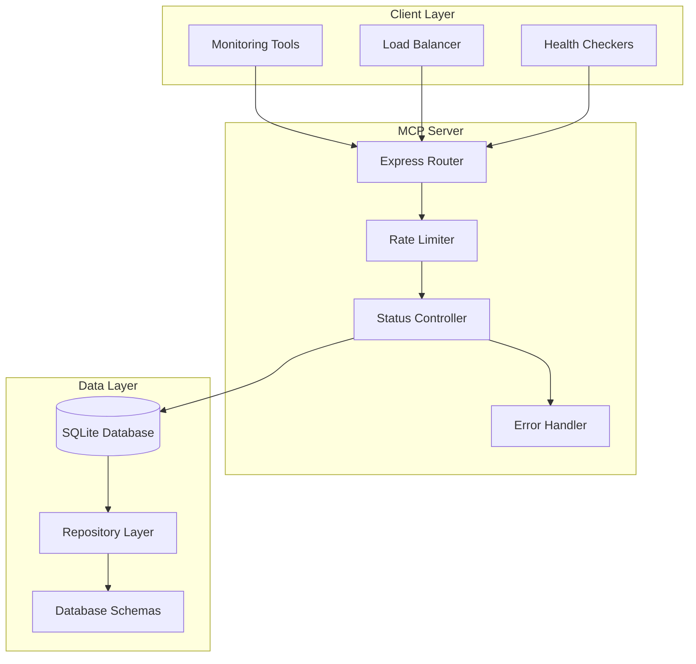
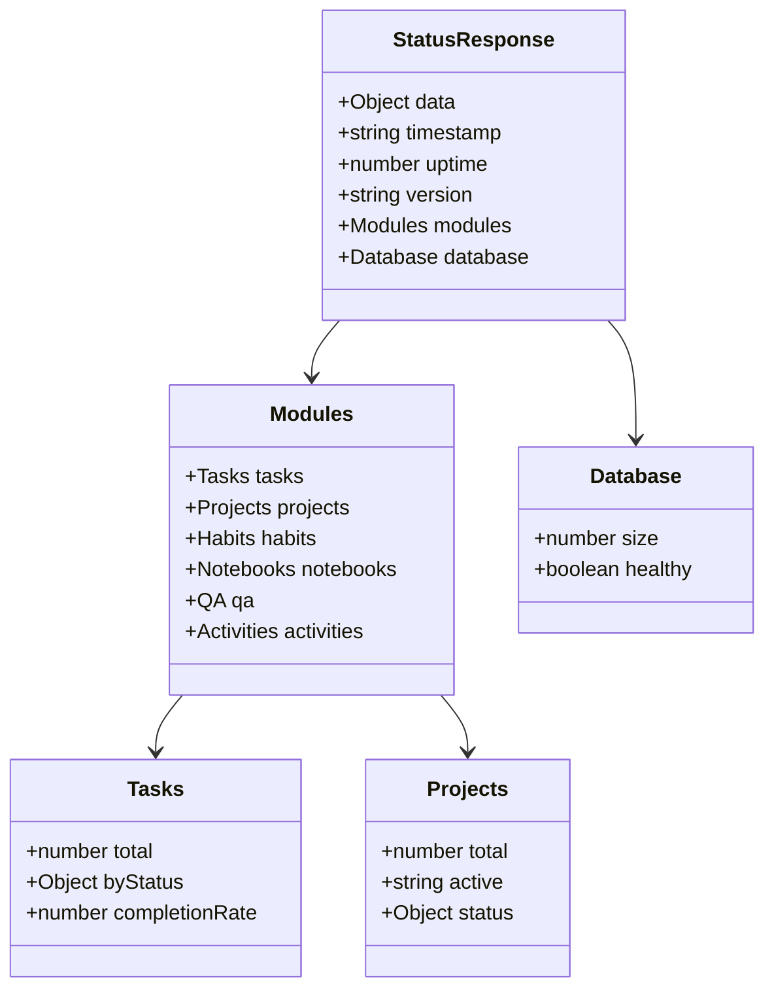
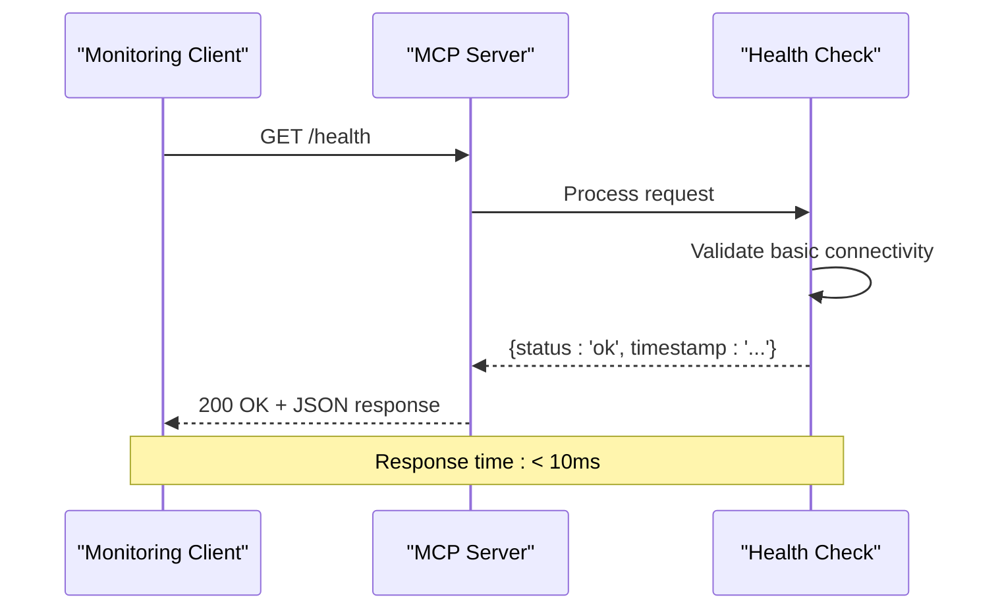
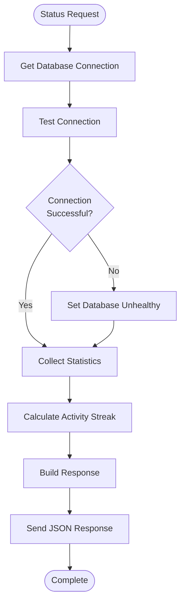
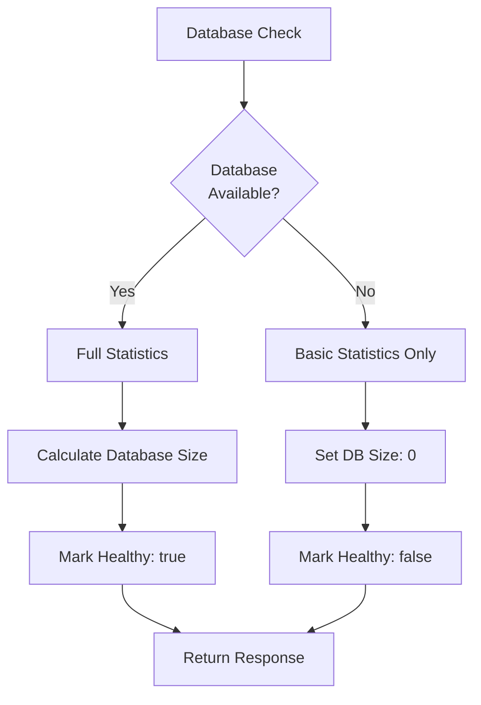
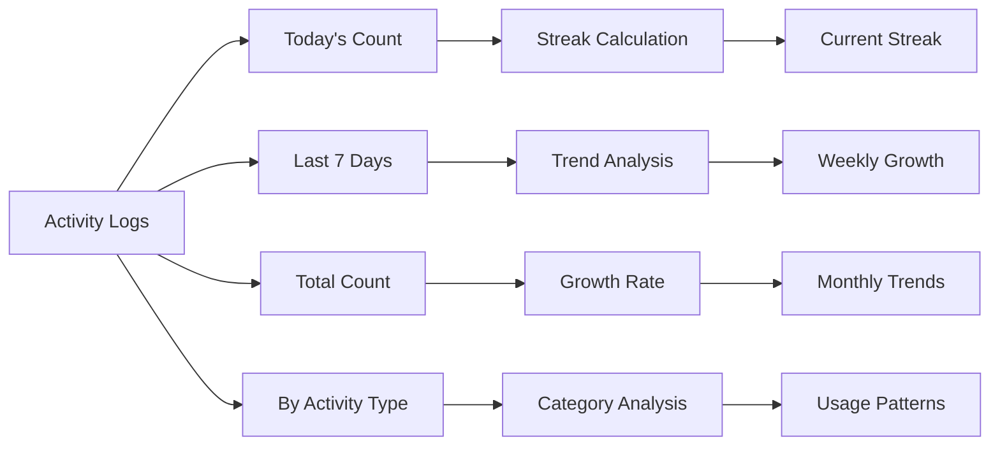
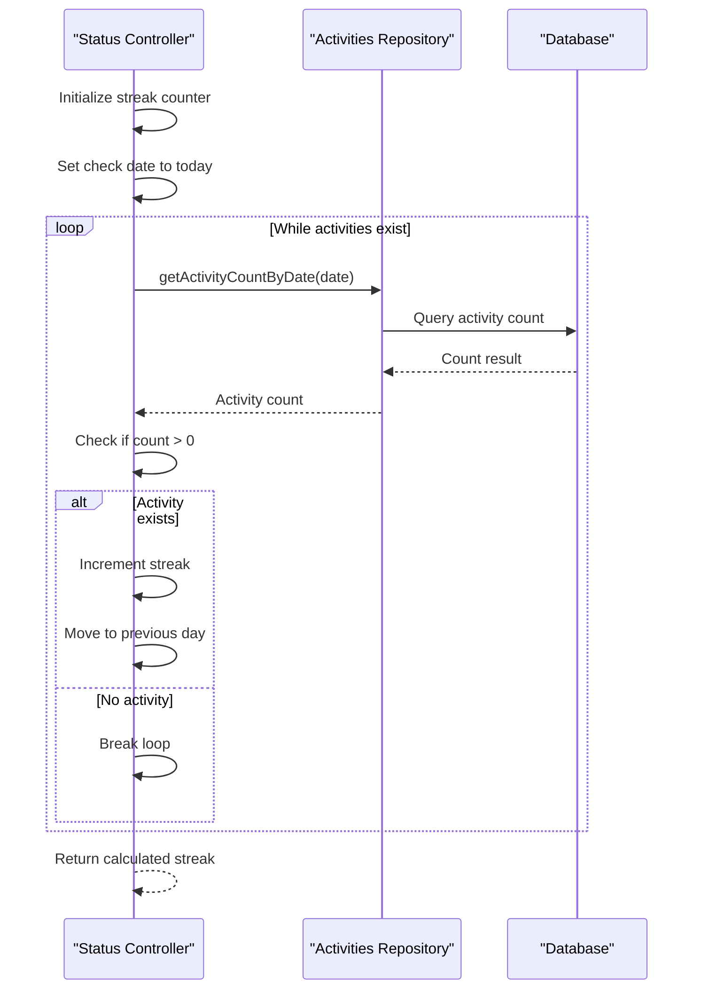
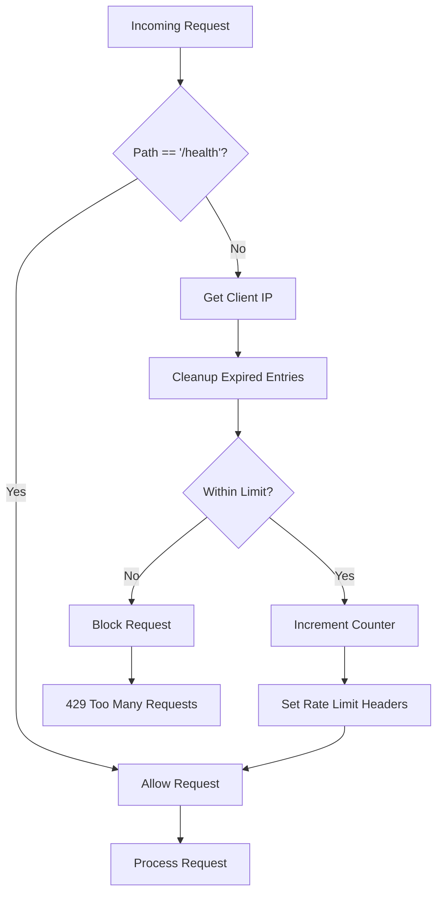
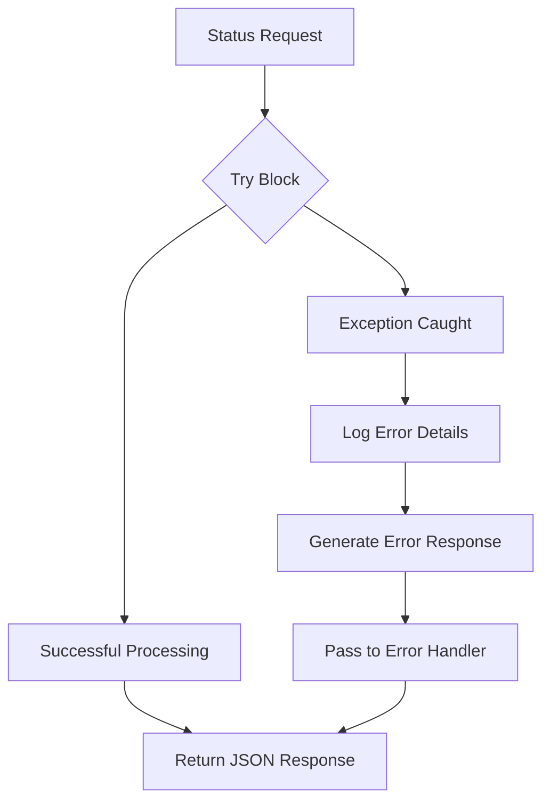

# Status Controller

<cite>
**Referenced Files in This Document**
- [statusController.ts](file://src/server/controllers/statusController.ts)
- [status.ts](file://src/server/routes/status.ts)
- [mcp-server.ts](file://src/server/mcp-server.ts)
- [rateLimiter.ts](file://src/server/middleware/rateLimiter.ts)
- [logger.ts](file://src/server/utils/logger.ts)
- [init.ts](file://src/database/init.ts)
- [settings.ts](file://src/services/settings.ts)
- [activitiesRepo.ts](file://src/database/activitiesRepo.ts)
- [habitsRepo.ts](file://src/database\habitsRepo.ts)
- [tasksRepo.ts](file://src/database\tasksRepo.ts)
</cite>

## Table of Contents
1. [Introduction](#introduction)
2. [Purpose and Architecture](#purpose-and-architecture)
3. [Core Functionality](#core-functionality)
4. [Response Structure](#response-structure)
5. [Health Check Implementation](#health-check-implementation)
6. [Database Connectivity Verification](#database-connectivity-verification)
7. [Statistics Collection](#statistics-collection)
8. [Security and Rate Limiting](#security-and-rate-limiting)
9. [Monitoring Integration](#monitoring-integration)
10. [Error Handling](#error-handling)
11. [Extending the Controller](#extending-the-controller)
12. [Best Practices](#best-practices)
13. [Troubleshooting](#troubleshooting)

## Introduction

The Status Controller serves as the primary health monitoring endpoint for the LifeOS MCP (Model Context Protocol) Server. It provides comprehensive system status information, database connectivity verification, and real-time statistics about the application's operational state. This controller is essential for infrastructure monitoring, automated health checks, and system observability.

The controller implements a holistic approach to system monitoring by aggregating data from multiple subsystems including task management, habit tracking, note-taking, and activity logging. It exposes both basic health check functionality and detailed system status information suitable for production monitoring environments.

## Purpose and Architecture

The Status Controller fulfills several critical roles in the LifeOS ecosystem:

### Primary Objectives
- **System Health Monitoring**: Provide immediate visibility into application operational status
- **Database Connectivity Validation**: Verify underlying data persistence layer availability
- **Operational Statistics**: Expose key metrics about application usage and performance
- **External Integration Readiness**: Enable external systems to assess server readiness
- **Graceful Degradation Support**: Handle partial failures gracefully with fallback mechanisms

### Architectural Positioning



**Diagram sources**
- [mcp-server.ts](file://src/server/mcp-server.ts#L20-L50)
- [status.ts](file://src/server/routes/status.ts#L1-L7)
- [statusController.ts](file://src/server/controllers/statusController.ts#L1-L20)

## Core Functionality

The Status Controller implements two primary endpoints that serve different monitoring needs:

### Comprehensive Status Endpoint
The main `/api/status` endpoint provides detailed system information including:
- Real-time uptime tracking
- Version identification
- Module-specific statistics
- Database health indicators
- Performance metrics

### Basic Health Check Endpoint
The `/health` endpoint offers lightweight connectivity verification:
- Fast response times
- Minimal resource usage
- Essential connectivity confirmation

**Section sources**
- [mcp-server.ts](file://src/server/mcp-server.ts#L35-L40)
- [status.ts](file://src/server/routes/status.ts#L6-L7)

## Response Structure

The Status Controller returns structured JSON responses that provide comprehensive system information. The response format follows a consistent pattern designed for both human readability and machine parsing.

### Standard Success Response Pattern



**Diagram sources**
- [statusController.ts](file://src/server/controllers/statusController.ts#L110-L150)

### Response Fields Breakdown

| Field | Type | Description | Example |
|-------|------|-------------|---------|
| `timestamp` | string | ISO 8601 timestamp of response | `"2024-01-15T10:30:00.000Z"` |
| `uptime` | number | Server uptime in seconds | `3600` |
| `version` | string | Application version | `"1.2.3"` |
| `modules.tasks.total` | number | Total task count | `156` |
| `modules.tasks.completionRate` | number | Percentage completed | `75` |
| `modules.projects.total` | number | Total project count | `8` |
| `modules.activities.today` | number | Activities today | `23` |
| `modules.activities.streak` | number | Current activity streak | `5` |
| `database.size` | number | Database file size in bytes | `1048576` |
| `database.healthy` | boolean | Database connectivity status | `true` |

**Section sources**
- [statusController.ts](file://src/server/controllers/statusController.ts#L110-L150)

## Health Check Implementation

The Status Controller implements robust health checking mechanisms that go beyond simple connectivity tests to provide comprehensive system assessment.

### Ping Request Handling

The health check endpoint responds immediately with minimal processing overhead:



**Diagram sources**
- [mcp-server.ts](file://src/server/mcp-server.ts#L35-L40)

### Database Connectivity Verification

The comprehensive status endpoint performs thorough database validation:



**Diagram sources**
- [statusController.ts](file://src/server/controllers/statusController.ts#L15-L16)
- [statusController.ts](file://src/server/controllers/statusController.ts#L100-L110)

### Uptime Calculation

The controller maintains precise uptime tracking using server startup time:

**Section sources**
- [statusController.ts](file://src/server/controllers/statusController.ts#L12-L13)
- [statusController.ts](file://src/server/controllers/statusController.ts#L115)

## Database Connectivity Verification

The Status Controller implements multi-layered database validation to ensure reliable data persistence and provide accurate health information.

### Database Initialization Check

The controller verifies database availability through multiple validation layers:

1. **Connection Establishment**: Attempts to establish a database connection
2. **Schema Validation**: Confirms required tables exist
3. **File System Verification**: Validates database file accessibility
4. **Query Execution**: Tests basic query functionality

### Graceful Degradation

When database connectivity issues occur, the controller implements graceful degradation:



**Diagram sources**
- [statusController.ts](file://src/server/controllers/statusController.ts#L100-L110)
- [init.ts](file://src/database/init.ts#L15-L35)

### Database Size Monitoring

The controller calculates database file size to monitor storage utilization and detect potential issues:

**Section sources**
- [statusController.ts](file://src/server/controllers/statusController.ts#L100-L110)
- [init.ts](file://src/database/init.ts#L25-L35)

## Statistics Collection

The Status Controller aggregates statistics from multiple application modules to provide comprehensive system insights.

### Task Statistics

Task statistics provide insight into project management activity:

| Metric | Description | Calculation Method |
|--------|-------------|-------------------|
| `total` | Total tasks across all projects | SQL COUNT query |
| `backlog` | Tasks in backlog status | Conditional aggregation |
| `todo` | Tasks awaiting action | Conditional aggregation |
| `in_progress` | Active tasks | Conditional aggregation |
| `completed` | Completed tasks | Conditional aggregation |
| `completion_rate` | Percentage completed | `(completed / total) * 100` |

### Activity Tracking

Activity statistics track user engagement and system usage patterns:



**Diagram sources**
- [activitiesRepo.ts](file://src/database/activitiesRepo.ts#L70-L100)
- [statusController.ts](file://src/server/controllers/statusController.ts#L120-L130)

### Habit Completion Tracking

Habit statistics provide insights into user consistency and goal achievement:

**Section sources**
- [habitsRepo.ts](file://src/database\habitsRepo.ts#L150-L180)
- [statusController.ts](file://src/server/controllers/statusController.ts#L125-L130)

### Activity Streak Calculation

The controller implements sophisticated streak calculation logic:



**Diagram sources**
- [statusController.ts](file://src/server/controllers/statusController.ts#L130-L150)

**Section sources**
- [statusController.ts](file://src/server/controllers/statusController.ts#L130-L150)
- [activitiesRepo.ts](file://src/database\activitiesRepo.ts#L60-L70)

## Security and Rate Limiting

The Status Controller implements comprehensive security measures to protect against abuse while maintaining accessibility for legitimate monitoring needs.

### Rate Limiting Implementation

The rate limiter provides protection against excessive requests:



**Diagram sources**
- [rateLimiter.ts](file://src/server/middleware/rateLimiter.ts#L15-L40)

### Security Considerations

The controller implements several security measures:

1. **API Key Authentication**: Optional API key validation for sensitive endpoints
2. **Rate Limiting**: Protection against abuse and DDoS attacks
3. **Path-Based Exceptions**: Special treatment for health check endpoints
4. **Error Handling**: Graceful error responses without information disclosure

### Rate Limiting Configuration

| Parameter | Value | Description |
|-----------|-------|-------------|
| `RATE_LIMIT` | 100 requests/minute | Default rate limit |
| `WINDOW_MS` | 60000ms | Time window for rate limiting |
| `Skip Paths` | `/health` | Health checks bypass rate limiting |

**Section sources**
- [rateLimiter.ts](file://src/server/middleware/rateLimiter.ts#L10-L15)
- [rateLimiter.ts](file://src/server/middleware/rateLimiter.ts#L15-L20)

## Monitoring Integration

The Status Controller is designed to integrate seamlessly with various monitoring and observability platforms.

### Prometheus Metrics Compatibility

The response structure is compatible with Prometheus metrics collection:

```yaml
# Example Prometheus-compatible metrics
lifecycleos_uptime_seconds 3600
lifecycleos_version_info{version="1.2.3"} 1
lifecycleos_database_size_bytes 1048576
lifecycleos_database_healthy 1
lifecycleos_tasks_total 156
lifecycleos_tasks_completion_rate 75
```

### Grafana Dashboard Integration

The controller's response format supports comprehensive Grafana dashboard creation:

- **System Health Panel**: Database connectivity status
- **Uptime Graph**: Server uptime over time
- **Activity Dashboard**: Task and habit completion rates
- **Resource Utilization**: Database size trends

### External Tool Compatibility

The Status Controller supports integration with popular monitoring tools:

| Tool | Integration Method | Supported Metrics |
|------|-------------------|------------------|
| Prometheus | HTTP endpoint scraping | All status metrics |
| Grafana | Prometheus datasource | Visual dashboards |
| New Relic | Custom metrics | Application performance |
| Datadog | HTTP check integration | Health status alerts |
| Zabbix | Web scenario monitoring | Availability monitoring |

## Error Handling

The Status Controller implements comprehensive error handling to ensure reliable operation under various failure conditions.

### Exception Management



**Diagram sources**
- [statusController.ts](file://src/server/controllers/statusController.ts#L150-L151)

### Error Response Patterns

The controller uses standardized error response formats:

```json
{
  "error": {
    "code": "DATABASE_ERROR",
    "message": "Failed to connect to database",
    "details": {
      "timestamp": "2024-01-15T10:30:00.000Z",
      "databasePath": "/path/to/database.db"
    }
  }
}
```

### Graceful Failure Modes

When components fail, the controller continues operating with reduced functionality:

1. **Database Unavailable**: Return cached statistics, mark database unhealthy
2. **Repository Failures**: Skip affected statistics, continue with others
3. **Network Issues**: Return partial data, indicate connectivity problems
4. **Memory Issues**: Reduce response size, skip expensive calculations

**Section sources**
- [statusController.ts](file://src/server/controllers/statusController.ts#L150-L151)

## Extending the Controller

The Status Controller is designed for extensibility, allowing developers to add custom health metrics and third-party service checks.

### Adding Custom Health Metrics

To add custom health metrics, extend the status object:

```typescript
// Example extension pattern
const customMetrics = {
  cache: {
    hits: cacheStats.hits,
    misses: cacheStats.misses,
    hitRate: calculateHitRate(cacheStats)
  },
  memory: {
    heapUsed: process.memoryUsage().heapUsed,
    heapTotal: process.memoryUsage().heapTotal,
    heapPercent: calculateHeapPercentage()
  }
};
```

### Third-Party Service Checks

Integrate external service health checks:

```typescript
// Example service check integration
async function checkExternalServices() {
  const services = [
    { name: 'email-service', url: 'https://api.email.com/health' },
    { name: 'notification-service', url: 'https://api.notifications.com/health' },
    { name: 'analytics-service', url: 'https://api.analytics.com/health' }
  ];
  
  const results = await Promise.all(
    services.map(async service => {
      try {
        const response = await fetch(service.url);
        return {
          name: service.name,
          healthy: response.ok,
          statusCode: response.status
        };
      } catch (error) {
        return {
          name: service.name,
          healthy: false,
          error: error.message
        };
      }
    })
  );
  
  return results;
}
```

### Custom Status Endpoints

Create specialized status endpoints for specific monitoring needs:

```typescript
// Additional status endpoint
statusRouter.get('/custom-health', (req, res) => {
  const customStatus = {
    timestamp: new Date().toISOString(),
    customChecks: {
      cache: checkCacheHealth(),
      queue: checkQueueHealth(),
      external: checkExternalDependencies()
    }
  };
  
  res.json(customStatus);
});
```

## Best Practices

### Performance Optimization

1. **Minimize Database Queries**: Cache frequently accessed data
2. **Optimize Calculations**: Use efficient algorithms for statistics
3. **Response Compression**: Enable compression for large responses
4. **Caching Strategy**: Implement appropriate caching for static data

### Monitoring Recommendations

1. **Alert Thresholds**: Set appropriate alert thresholds for key metrics
2. **Baseline Establishment**: Establish baselines for normal operation
3. **Trend Analysis**: Monitor trends rather than individual values
4. **Correlation Analysis**: Correlate status metrics with user experience

### Security Guidelines

1. **Access Control**: Restrict access to sensitive status information
2. **Rate Limiting**: Implement appropriate rate limits for all endpoints
3. **Logging**: Log all status endpoint accesses for audit purposes
4. **Encryption**: Use HTTPS for all status endpoint communications

## Troubleshooting

### Common Issues and Solutions

#### Database Connection Problems

**Symptoms**: Database unhealthy status, empty statistics
**Causes**: 
- Database file corruption
- Insufficient permissions
- Disk space issues
- Concurrent access conflicts

**Solutions**:
1. Verify database file permissions
2. Check available disk space
3. Restart database connection
4. Review database logs for errors

#### Slow Response Times

**Symptoms**: High response latency, timeout errors
**Causes**:
- Heavy database queries
- Resource contention
- Network latency
- Insufficient system resources

**Solutions**:
1. Optimize database indexes
2. Implement query caching
3. Scale system resources
4. Review concurrent request patterns

#### Missing Statistics

**Symptoms**: Some statistics return zero or null values
**Causes**:
- Repository initialization issues
- Data migration problems
- Schema inconsistencies
- Permission restrictions

**Solutions**:
1. Verify repository initialization
2. Check database schema version
3. Review data integrity
4. Validate user permissions

### Diagnostic Commands

```bash
# Check database connectivity
curl -v http://localhost:3000/health

# Get full status information
curl -v http://localhost:3000/api/status

# Monitor response times
time curl -s http://localhost:3000/api/status > /dev/null

# Check rate limiting
curl -v --header "X-API-Key: your-key" http://localhost:3000/api/status
```

### Log Analysis

Monitor relevant log entries for troubleshooting:

```
[MCP Server] Database initialized for MCP server
[MCP Server] Failed to initialize database for MCP server
[Status Controller] Processing status request
[Status Controller] Database connection failed
[Rate Limiter] Rate limit exceeded for IP
```

**Section sources**
- [logger.ts](file://src/server/utils/logger.ts#L20-L47)
- [mcp-server.ts](file://src/server/mcp-server.ts#L55-L65)