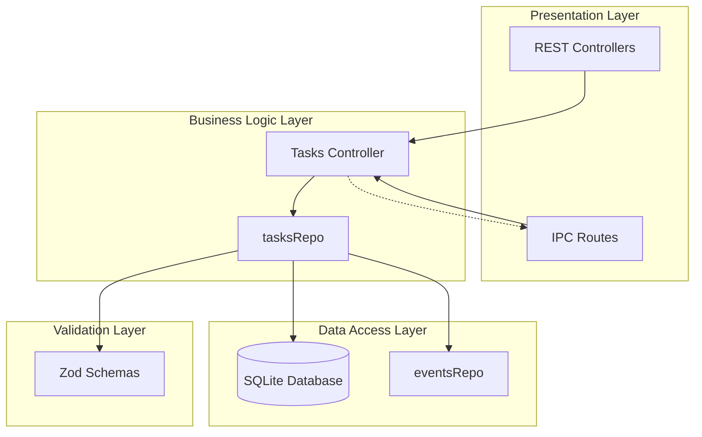
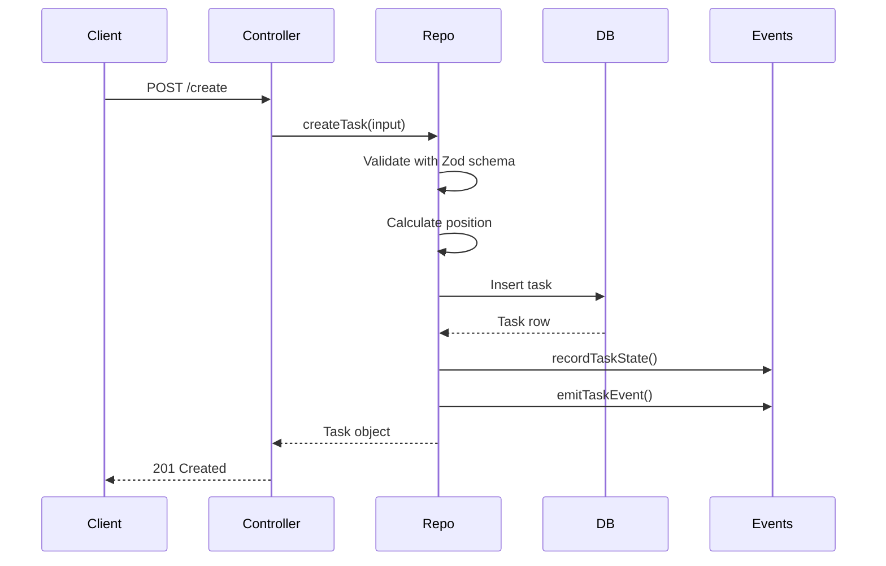
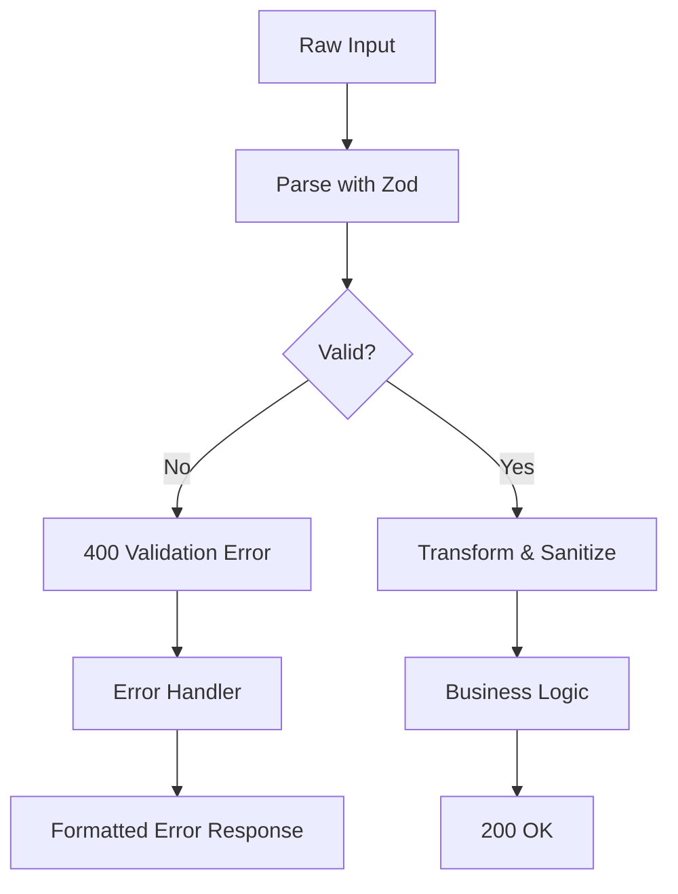
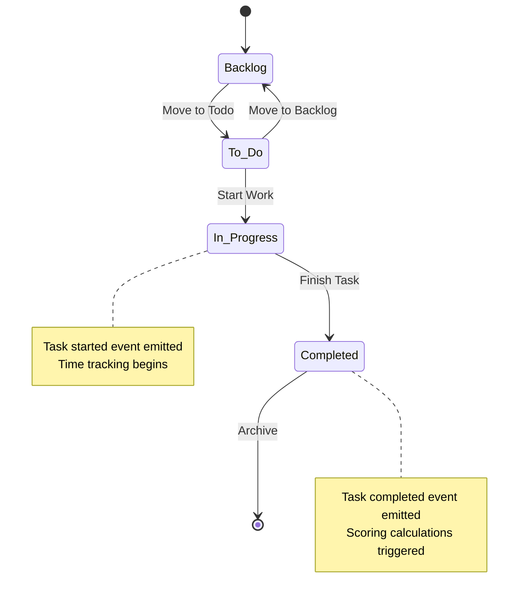
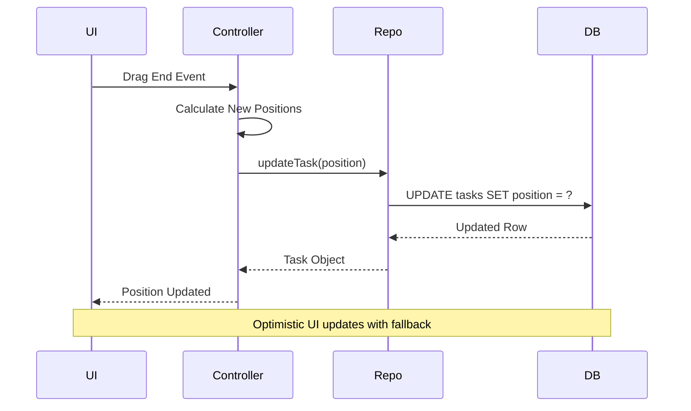

# Tasks Controller

<cite>
**Referenced Files in This Document**
- [tasksController.ts](file://src/server/controllers/tasksController.ts)
- [tasksRepo.ts](file://src/database/tasksRepo.ts)
- [tasks.ts](file://src/server/routes/tasks.ts)
- [tasks.ts](file://src/main/ipc/tasks.ts)
- [init.ts](file://src/database/init.ts)
- [types.ts](file://src/common/types.ts)
- [types.ts](file://src/database/types.ts)
- [response.ts](file://src/main/utils/response.ts)
- [errorHandler.ts](file://src/server/middleware/errorHandler.ts)
- [eventsRepo.ts](file://src/database/eventsRepo.ts)
- [KanbanPage.tsx](file://src/renderer/pages/KanbanPage.tsx)
- [constants.ts](file://src/renderer/constants.ts)
</cite>

## Table of Contents
1. [Introduction](#introduction)
2. [System Architecture](#system-architecture)
3. [Core Components](#core-components)
4. [CRUD Operations](#crud-operations)
5. [Validation and Error Handling](#validation-and-error-handling)
6. [Kanban Workflow Integration](#kanban-workflow-integration)
7. [Transaction Management](#transaction-management)
8. [Performance Considerations](#performance-considerations)
9. [Common Issues and Debugging](#common-issues-and-debugging)
10. [Extension Guidelines](#extension-guidelines)
11. [Best Practices](#best-practices)

## Introduction

The Tasks Controller serves as the central orchestrator for task management operations in the LifeOS application. Built on Express.js, it provides a comprehensive REST API for CRUD operations while maintaining tight integration with the SQLite database through the tasksRepo module. The controller handles everything from basic task creation and updates to complex Kanban workflow operations including position reordering and status transitions.

The controller operates within a layered architecture that separates concerns between presentation, business logic, and data persistence. It leverages Zod for robust input validation, implements comprehensive error handling, and maintains strict adherence to the Kanban methodology through predefined status workflows.

## System Architecture

The Tasks Controller follows a clean architecture pattern with clear separation of responsibilities:



**Diagram sources**
- [tasksController.ts](file://src/server/controllers/tasksController.ts#L1-L140)
- [tasksRepo.ts](file://src/database/tasksRepo.ts#L1-L211)
- [tasks.ts](file://src/server/routes/tasks.ts#L1-L26)

**Section sources**
- [tasksController.ts](file://src/server/controllers/tasksController.ts#L1-L140)
- [tasksRepo.ts](file://src/database/tasksRepo.ts#L1-L211)

## Core Components

### Controller Functions

The Tasks Controller exposes seven primary endpoints, each serving specific business requirements:

| Endpoint | Method | Purpose | Input Validation |
|----------|--------|---------|------------------|
| `/create` | POST | Create new task | Zod schema validation |
| `/:id` | GET | Retrieve task by ID | Parameter parsing |
| `/project/:projectId` | GET | List tasks by project | Project ID validation |
| `/:id` | PUT | Update existing task | Zod schema validation |
| `/:id` | DELETE | Remove task | Parameter parsing |
| `/:id/move` | PUT | Move task between projects/columns | Zod schema validation |
| `/` | GET | Get task statistics | None |

### Database Integration

The controller integrates seamlessly with the SQLite database through the `getDb()` function, ensuring consistent database access patterns. All operations utilize prepared statements to prevent SQL injection attacks and optimize query performance.

### Status Management

The controller enforces Kanban workflow compliance by validating status transitions and maintaining proper state tracking. Supported statuses include: `Backlog`, `To-Do`, `In Progress`, and `Completed`.

**Section sources**
- [tasksController.ts](file://src/server/controllers/tasksController.ts#L5-L140)
- [init.ts](file://src/database/init.ts#L10-L20)

## CRUD Operations

### Task Creation

Task creation involves multiple validation layers and automatic position assignment:



**Diagram sources**
- [tasksController.ts](file://src/server/controllers/tasksController.ts#L5-L10)
- [tasksRepo.ts](file://src/database/tasksRepo.ts#L40-L85)

The creation process includes automatic position calculation when not specified, ensuring tasks are ordered correctly within their status column.

### Task Retrieval and Listing

Task retrieval supports both individual task fetching and bulk operations for project-based filtering. The system implements caching-friendly patterns by utilizing indexed database queries.

### Task Updates

The update mechanism employs selective field updates to minimize database writes and maintain audit trails. Each update operation tracks changes and triggers appropriate event emissions.

### Task Deletion

Deletion operations include soft deletion patterns and cascade cleanup for related data, ensuring data integrity across the system.

**Section sources**
- [tasksController.ts](file://src/server/controllers/tasksController.ts#L12-L89)
- [tasksRepo.ts](file://src/database/tasksRepo.ts#L87-L185)

## Validation and Error Handling

### Zod Schema Validation

The controller leverages Zod for comprehensive input validation at multiple levels:



**Diagram sources**
- [tasksRepo.ts](file://src/database/tasksRepo.ts#L7-L31)
- [errorHandler.ts](file://src/server/middleware/errorHandler.ts#L15-L35)

### Error Response Patterns

The system implements standardized error responses with consistent error codes and detailed validation messages:

| Error Type | HTTP Status | Error Code | Description |
|------------|-------------|------------|-------------|
| Validation Error | 400 | VALIDATION_ERROR | Zod schema validation failures |
| Not Found | 404 | NOT_FOUND | Resource not found |
| Internal Error | 500 | INTERNAL_SERVER_ERROR | Unexpected server errors |

### Input Sanitization

All inputs undergo sanitization including string trimming, null handling, and type coercion to ensure data consistency and prevent injection attacks.

**Section sources**
- [tasksRepo.ts](file://src/database/tasksRepo.ts#L7-L31)
- [errorHandler.ts](file://src/server/middleware/errorHandler.ts#L15-L69)
- [response.ts](file://src/main/utils/response.ts#L15-L36)

## Kanban Workflow Integration

### Status Transitions

The controller enforces Kanban workflow compliance through controlled status transitions and automatic state tracking:



**Diagram sources**
- [constants.ts](file://src/renderer/constants.ts#L1-L2)
- [eventsRepo.ts](file://src/database/eventsRepo.ts#L85-L105)

### Position Reordering

The system supports sophisticated position reordering for drag-and-drop Kanban operations:



**Diagram sources**
- [KanbanPage.tsx](file://src/renderer/pages/KanbanPage.tsx#L209-L280)
- [tasksController.ts](file://src/server/controllers/tasksController.ts#L75-L82)

### Batch Operations

While the current implementation focuses on individual operations, the architecture supports extension for batch operations through transaction management patterns.

**Section sources**
- [KanbanPage.tsx](file://src/renderer/pages/KanbanPage.tsx#L209-L280)
- [constants.ts](file://src/renderer/constants.ts#L1-L2)
- [eventsRepo.ts](file://src/database/eventsRepo.ts#L85-L105)

## Transaction Management

### Current Transaction Patterns

The tasksRepo implements transaction-like behavior through atomic database operations. While SQLite doesn't support explicit transactions for individual operations, the system ensures data consistency through careful operation sequencing.

### Future Transaction Extensions

For complex operations requiring multiple steps, the system can be extended to support explicit transaction blocks:

```typescript
// Example pattern for future transaction support
export function batchUpdateTasks(updates: TaskUpdate[]) {
  const db = getDb();
  db.transaction(() => {
    updates.forEach(update => {
      // Individual task updates within transaction
    });
  })();
}
```

### Position Reordering Strategy

The position reordering system implements an optimistic update pattern with fallback mechanisms to ensure UI consistency during rapid drag-and-drop operations.

**Section sources**
- [tasksRepo.ts](file://src/database/tasksRepo.ts#L187-L211)
- [KanbanPage.tsx](file://src/renderer/pages/KanbanPage.tsx#L209-L280)

## Performance Considerations

### Database Indexing

The system leverages strategic indexing for optimal query performance:

| Index | Purpose | Query Pattern |
|-------|---------|---------------|
| `idx_tasks_project_status` | Project-based task listing | `SELECT * FROM tasks WHERE project_id = ? AND status = ?` |
| `idx_tasks_due_date` | Due date filtering | `SELECT * FROM tasks WHERE due_date BETWEEN ? AND ?` |
| `idx_projects_position` | Project ordering | `SELECT * FROM projects ORDER BY position` |

### Query Optimization

All database operations utilize prepared statements and parameterized queries to prevent SQL injection and improve cache utilization. The system avoids N+1 query problems through efficient JOIN patterns and bulk operations.

### Memory Management

Large task lists are handled efficiently through streaming and pagination patterns. The frontend implements virtual scrolling for optimal rendering performance with thousands of tasks.

### Caching Strategies

While not currently implemented, the architecture supports caching layers for frequently accessed data such as project task counts and user preferences.

**Section sources**
- [init.ts](file://src/database/init.ts#L50-L60)
- [tasksRepo.ts](file://src/database/tasksRepo.ts#L33-L38)

## Common Issues and Debugging

### Invalid Project References

**Problem**: Attempting to create tasks for non-existent projects
**Solution**: The Zod schema validates project IDs against existing projects, and the database enforces foreign key constraints.

**Debugging Steps**:
1. Verify project exists using `GET /projects/{id}`
2. Check project ID in task creation payload
3. Review database foreign key constraints

### Malformed Priority Data

**Problem**: Invalid priority values causing validation errors
**Solution**: The system validates priorities against predefined acceptable values and falls back to null for invalid inputs.

**Debugging Steps**:
1. Check priority field length (< 50 characters)
2. Verify priority value matches supported types
3. Review Zod schema validation messages

### Position Calculation Issues

**Problem**: Incorrect task positioning after drag-and-drop operations
**Solution**: The system automatically recalculates positions and validates against existing task orderings.

**Debugging Steps**:
1. Monitor position field updates
2. Verify task ordering in database
3. Check for concurrent modification conflicts

### Status Transition Failures

**Problem**: Invalid status transitions violating Kanban workflow
**Solution**: The system validates status changes and prevents invalid transitions.

**Debugging Steps**:
1. Review current task status
2. Verify target status is valid
3. Check workflow constraints

**Section sources**
- [tasksRepo.ts](file://src/database/tasksRepo.ts#L7-L31)
- [errorHandler.ts](file://src/server/middleware/errorHandler.ts#L40-L55)

## Extension Guidelines

### Adding New Endpoints

To extend the Tasks Controller with new functionality:

1. **Define Route**: Add route definition in `src/server/routes/tasks.ts`
2. **Create Controller**: Implement controller function in `src/server/controllers/tasksController.ts`
3. **Add Repository**: Extend `src/database/tasksRepo.ts` with new repository functions
4. **Update Types**: Modify `src/common/types.ts` with new interface definitions
5. **Add IPC Handlers**: Update `src/main/ipc/tasks.ts` for Electron integration

### Supporting New Task Properties

To add new task properties:

1. **Extend Schema**: Update Zod schemas in `tasksRepo.ts`
2. **Modify Database**: Add new columns to the tasks table in `init.ts`
3. **Update Mappers**: Modify `mappers.ts` for data transformation
4. **Update Frontend**: Extend React components and state management

### Custom Validation Rules

For specialized validation requirements:

1. **Create Custom Validators**: Implement Zod custom validators
2. **Add Middleware**: Create validation middleware if needed
3. **Update Error Handling**: Enhance error responses for new validation types

**Section sources**
- [tasks.ts](file://src/server/routes/tasks.ts#L1-L26)
- [tasksController.ts](file://src/server/controllers/tasksController.ts#L1-L140)
- [types.ts](file://src/common/types.ts#L1-L117)

## Best Practices

### Input Validation

Always validate inputs using Zod schemas to ensure data integrity and provide meaningful error messages. Leverage the existing schema patterns for consistency.

### Error Handling

Implement comprehensive error handling with standardized error responses. Use the provided error handler middleware for consistent error processing.

### Database Operations

Utilize prepared statements and parameterized queries to prevent SQL injection. Leverage the existing database connection patterns for consistency.

### State Management

Maintain proper state tracking for task operations, especially for status transitions and position changes. Use the events system for audit trails and analytics.

### Performance Optimization

Design queries with indexing in mind and avoid N+1 query problems. Implement pagination for large datasets and consider caching for frequently accessed data.

### Testing Strategies

Implement comprehensive unit tests for controller functions and repository operations. Use integration tests to verify end-to-end workflows and error scenarios.

### Security Considerations

Follow secure coding practices including input sanitization, prepared statements, and proper error handling. Avoid exposing sensitive information in error messages.

**Section sources**
- [tasksController.ts](file://src/server/controllers/tasksController.ts#L1-L140)
- [tasksRepo.ts](file://src/database/tasksRepo.ts#L1-L211)
- [errorHandler.ts](file://src/server/middleware/errorHandler.ts#L1-L70)
- [response.ts](file://src/main/utils/response.ts#L1-L37)